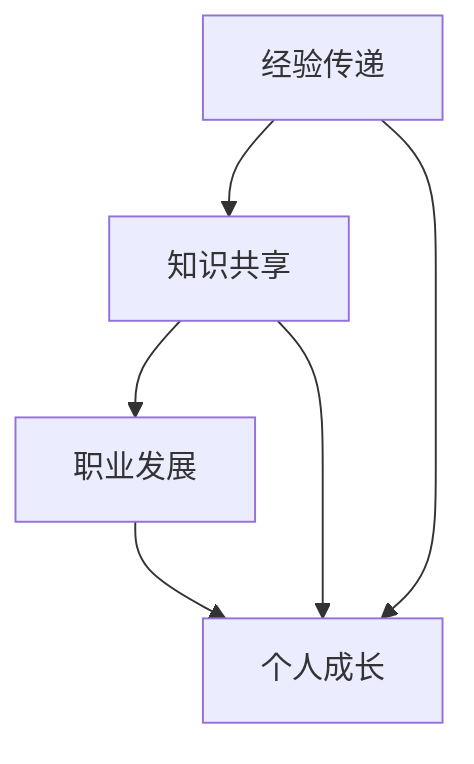
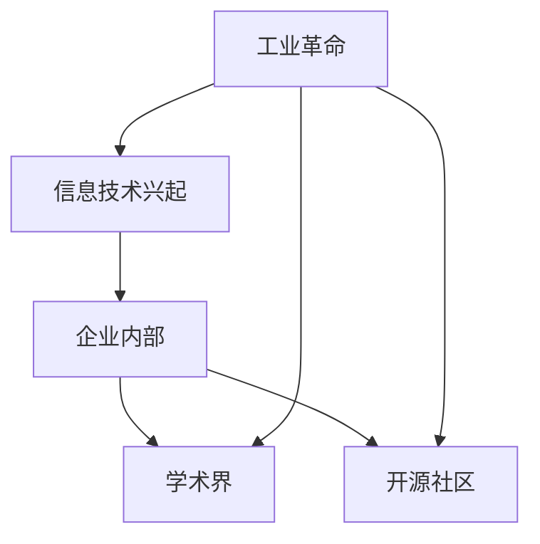
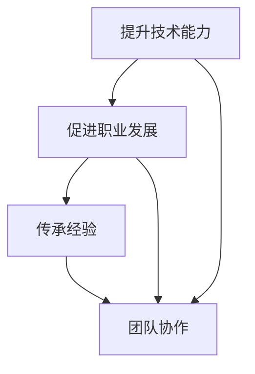

                 

### 第1章 引言与背景介绍

**文章标题：技术mentoring：培养下一代技术领袖**

**关键词：技术mentoring，下一代技术领袖，培养，技术能力，职业发展**

**摘要：**
技术mentoring是一种旨在培养下一代技术领袖的指导模式，通过资深技术人员的经验分享和指导，帮助下一代技术人员提升技术能力和职业发展。本章介绍了技术mentoring的定义、起源和发展，并探讨了其在现代社会中的重要性。

---

### 1.1 技术mentoring的定义

技术mentoring是一种双向的指导关系，其中一名资深技术人员（mentor）向一名或多名新手技术人员（mentee）提供指导和支持。这种指导不仅限于技术技能的提升，还包括职业发展、个人成长和团队合作等方面。

**核心概念与联系：**

技术mentoring的核心概念包括：

1. **经验传递**：mentor将自己的技术知识和经验传授给mentee。
2. **知识共享**：双方通过交流和合作，共同提升技术水平。
3. **职业发展**：mentor帮助mentee规划职业道路，提供职业建议和机会。
4. **个人成长**：mentee在技术mentoring过程中获得自信和成长。

**Mermaid 流程图：**

### 1.2 技术mentoring的起源与发展

技术mentoring的历史可以追溯到工业革命时期，当时师傅（mentor）向徒弟（mentee）传授技能和知识。随着信息技术的发展，技术mentoring逐渐从手工艺扩展到计算机科学、软件开发等领域。

**起源：**
- **工业革命**：师傅向徒弟传授手工艺技能。
- **信息技术兴起**：资深技术人员开始向新手技术人员传授编程知识和经验。

**发展：**
- **企业内部**：企业设立技术mentoring计划，促进内部人才的培养和流动。
- **学术领域**：学术界引入技术mentoring，帮助研究生和年轻学者成长。
- **开源社区**：技术爱好者通过社区交流，实现技术mentoring。

**Mermaid 流程图：**

### 1.3 技术mentoring的重要性

技术mentoring在现代社会中具有重要的意义：

1. **提升技术能力**：通过导师的指导，mentee可以快速掌握新技术，提高工作效率。
2. **促进职业发展**：技术mentoring为mentee提供职业发展的机会和资源，帮助他们实现职业目标。
3. **传承经验**：资深技术人员通过技术mentoring，将自己的经验传承给下一代。
4. **团队协作**：技术mentoring有助于培养团队成员之间的信任和合作精神。

**Mermaid 流程图：**

### 本章小结

技术mentoring是一种有效的培养下一代技术领袖的方式。通过本章的介绍，我们了解了技术mentoring的定义、起源和发展，以及它在现代社会中的重要性。在接下来的章节中，我们将进一步探讨技术mentoring的实践策略和挑战。

---

**作者：AI天才研究院/AI Genius Institute & 禅与计算机程序设计艺术 /Zen And The Art of Computer Programming**

---

[续写下一章内容]

