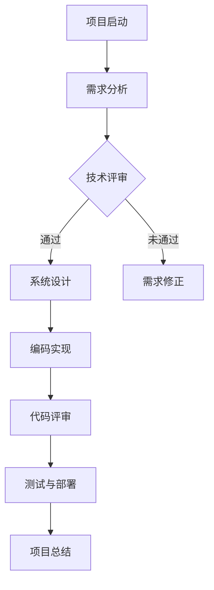
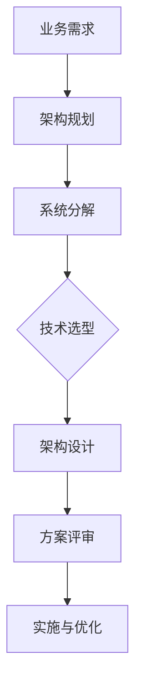
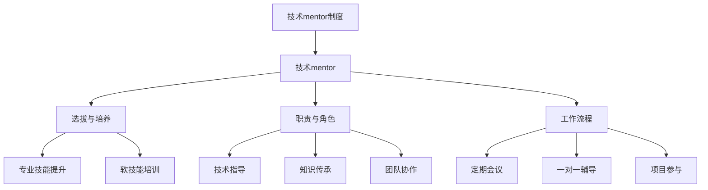

                 


### 文章标题：技术mentor制度的建立与实施

关键词：技术mentor、职业发展、团队建设、知识传承、技能提升

摘要：本文将深入探讨技术mentor制度的建立与实施，解析其在团队建设、知识传承和技能提升方面的作用。通过详细阐述技术mentor的定义、选拔与培养、职责与角色，以及实施步骤与工作流程，帮助读者了解如何有效建立和运用技术mentor制度，提升团队整体技术能力。

### 目录

## 第一部分：技术mentor制度的概述

### 1.1 技术mentor制度的概念与意义

#### 1.1.1 技术mentor的定义

#### 1.1.2 技术mentor制度的重要性

### 1.2 技术mentor制度的核心组成部分

#### 1.2.1 技术mentor的选拔与培养

#### 1.2.2 技术mentor的职责与角色

#### 1.2.3 技术mentor的工作流程

## 第二部分：技术mentor制度的实施

### 2.1 技术mentor制度的规划与设计

#### 2.1.1 技术mentor制度的规划流程

#### 2.1.2 技术mentor制度的设计原则

#### 2.1.3 技术mentor制度的实施步骤

### 2.2 技术mentor的培养与选拔

#### 2.2.1 技术mentor的培养计划

#### 2.2.2 技术mentor的选拔流程

### 2.3 技术mentor的工作与管理

#### 2.3.1 技术mentor的职责与角色

#### 2.3.2 技术mentor的工作流程

#### 2.3.3 技术mentor的管理与评估

## 第三部分：技术mentor制度的应用与实践

### 3.1 技术mentor制度在实际项目中的应用

#### 3.1.1 技术mentor制度在软件开发中的应用

#### 3.1.2 技术mentor制度在系统架构设计中的应用

### 3.2 技术mentor制度的推广与优化

#### 3.2.1 技术mentor制度的推广策略

#### 3.2.2 技术mentor制度的优化与改进

#### 3.2.3 技术mentor制度的反馈与改进

### 结束语

#### 4.1 总结与展望

#### 4.2 注意事项与最佳实践

#### 4.3 拓展阅读

## 第一部分：技术mentor制度的概述

### 1.1 技术mentor制度的概念与意义

技术mentor，作为一种职业发展辅助机制，起源于硅谷，并在全球科技企业中逐渐流行。技术mentor的定义较为广泛，通常是指具备丰富经验、专业技能和职业素养的技术人员，他们通过指导和辅导其他技术人员，帮助其提升技能、拓展视野和实现职业发展。

技术mentor制度，是指企业或组织内部建立的一种指导和支持体系，旨在通过技术mentor的指导，帮助技术人员快速成长，提升团队整体技术水平。其意义主要体现在以下几个方面：

1. **知识传承**：技术mentor制度有助于将资深技术人员积累的知识和经验传递给新员工，促进企业内部知识传承和共享。
2. **技能提升**：技术mentor通过一对一的辅导，帮助技术人员解决实际工作中的难题，提升其技术能力和解决复杂问题的能力。
3. **团队建设**：技术mentor制度有助于建立紧密协作、互帮互助的团队氛围，增强团队凝聚力和战斗力。
4. **职业发展**：技术mentor制度为技术人员提供职业发展的指导和支持，有助于其实现职业晋升和成长。

### 1.2 技术mentor制度的核心组成部分

技术mentor制度的核心组成部分包括技术mentor的选拔与培养、职责与角色，以及工作流程。

#### 1.2.1 技术mentor的选拔与培养

**选拔标准**：

- **专业技能**：技术mentor应具备扎实的专业技能，能够熟练掌握并应用相关技术。
- **工作经验**：技术mentor应具备丰富的工作经验，能够在实际项目中处理复杂问题。
- **沟通能力**：技术mentor应具备良好的沟通能力，能够有效地与团队成员进行沟通和协作。
- **领导力**：技术mentor应具备一定的领导力，能够指导和激励团队成员。

**培养计划**：

- **专业技能提升**：定期进行技术培训，帮助技术mentor掌握最新的技术和工具。
- **软技能培训**：进行沟通技巧、团队协作等方面的培训，提升技术mentor的综合素质。
- **实践机会**：提供实践机会，让技术mentor在实际项目中积累经验，提升实战能力。

#### 1.2.2 技术mentor的职责与角色

**职责**：

- **技术指导**：为团队成员提供技术上的指导和帮助，解决他们在工作中遇到的问题。
- **知识传承**：通过分享自己的经验和知识，帮助团队成员快速成长。
- **团队协作**：促进团队成员之间的沟通和协作，提高团队整体效率。

**角色**：

- **技术领导者**：在团队中起到技术指导和带头作用，引领团队不断进步。
- **沟通桥梁**：在团队内部和团队之间建立沟通桥梁，确保信息的畅通和协作的顺畅。

#### 1.2.3 技术mentor的工作流程

**工作流程**：

- **定期会议**：技术mentor定期与团队成员进行会议，了解他们的工作进展和遇到的问题，提供针对性的指导。
- **一对一辅导**：技术mentor与团队成员进行一对一辅导，针对他们的具体需求提供个性化的指导和支持。
- **项目参与**：技术mentor积极参与团队项目，与团队成员共同解决问题，提升团队整体能力。

### 小结

技术mentor制度是一种有效的团队建设工具，通过选拔和培养技术mentor，明确其职责和角色，制定科学的工作流程，可以显著提升团队的技术水平和职业发展。在下一部分，我们将进一步探讨技术mentor制度的实施步骤和策略。

## 第二部分：技术mentor制度的实施

### 2.1 技术mentor制度的规划与设计

**2.1.1 技术mentor制度的规划流程**

实施技术mentor制度的第一步是进行充分的规划。以下是一个典型的规划流程：

1. **明确目标**：首先，需要明确技术mentor制度的目标，例如提升团队技术水平、促进知识传承等。
2. **评估现状**：对团队现有技术水平、人员结构、工作流程等进行评估，了解现有状况和存在的问题。
3. **制定策略**：根据评估结果，制定相应的策略，包括选拔标准、培养计划、职责分配等。
4. **确定时间表**：制定详细的时间表，明确每个阶段的实施时间，确保规划能够有序进行。

**2.1.2 技术mentor制度的设计原则**

在规划技术mentor制度时，应遵循以下设计原则：

1. **实用性**：设计原则应具有实用性，能够切实解决团队存在的问题，提升团队的整体技术水平。
2. **可持续性**：设计原则应具有可持续性，确保技术mentor制度能够长期运行，不会因为短期效益而中断。
3. **灵活性**：设计原则应具有一定的灵活性，能够根据团队实际情况进行调整和优化。

**2.1.3 技术mentor制度的实施步骤**

实施技术mentor制度通常包括以下步骤：

1. **宣传和动员**：在团队内部宣传技术mentor制度的意义和优势，动员团队成员积极参与。
2. **选拔技术mentor**：根据选拔标准，选拔具备专业技能、工作经验和沟通能力的技术人员担任技术mentor。
3. **培训技术mentor**：对选拔出的技术mentor进行专业培训和软技能培训，提升其综合素质。
4. **制定工作流程**：制定技术mentor的工作流程，明确其职责、角色和工作方法。
5. **实施和监督**：开始实施技术mentor制度，并对实施过程进行监督，确保制度能够顺利运行。
6. **评估和改进**：定期对技术mentor制度进行评估，收集反馈意见，根据反馈进行改进和优化。

### 2.2 技术mentor的培养与选拔

**2.2.1 技术mentor的培养计划**

技术mentor的培养计划是技术mentor制度的核心环节，以下是一个典型的培养计划：

1. **专业技能提升**：定期举办技术研讨会、培训课程等，帮助技术mentor掌握最新的技术和工具。
2. **案例研究**：通过案例研究，让技术mentor深入了解技术应用的场景和解决方案。
3. **实践机会**：提供实际项目的机会，让技术mentor参与项目，积累实战经验。
4. **反馈与改进**：技术mentor在实践过程中遇到的问题和挑战，通过反馈机制进行改进。

**2.2.2 技术mentor的选拔流程**

技术mentor的选拔流程是确保技术mentor制度有效运行的重要环节，以下是一个典型的选拔流程：

1. **公布选拔标准**：明确技术mentor的选拔标准，包括专业技能、工作经验、沟通能力等。
2. **自我推荐和推荐**：鼓励团队成员自我推荐或相互推荐，提交申请材料。
3. **初步筛选**：根据选拔标准，对申请材料进行初步筛选，确定候选人名单。
4. **面试和评估**：对候选人进行面试和评估，包括专业技能测试、案例分析等。
5. **确定技术mentor**：根据面试和评估结果，确定最终的技术mentor名单。
6. **公示和任命**：公示技术mentor名单，并进行正式任命。

### 2.3 技术mentor的工作与管理

**2.3.1 技术mentor的职责与角色**

技术mentor的职责和角色是技术mentor制度的核心，以下是一个典型的职责和角色描述：

**职责**：

- 为团队成员提供技术指导和帮助，解决他们在工作中遇到的问题。
- 定期举办技术分享会，分享自己的经验和知识，帮助团队成员提升技术水平。
- 指导团队成员进行技术研究和创新，推动团队的技术进步。

**角色**：

- 技术领导者：在团队中起到技术指导和带头作用，引领团队不断进步。
- 沟通桥梁：在团队内部和团队之间建立沟通桥梁，确保信息的畅通和协作的顺畅。

**2.3.2 技术mentor的工作流程**

技术mentor的工作流程是确保技术mentor制度有效运行的关键，以下是一个典型的工作流程：

1. **定期会议**：技术mentor定期与团队成员进行会议，了解他们的工作进展和遇到的问题，提供针对性的指导。
2. **一对一辅导**：技术mentor与团队成员进行一对一辅导，针对他们的具体需求提供个性化的指导和支持。
3. **项目参与**：技术mentor积极参与团队项目，与团队成员共同解决问题，提升团队整体能力。
4. **反馈与改进**：技术mentor在实践过程中遇到的问题和挑战，通过反馈机制进行改进。

**2.3.3 技术mentor的管理与评估**

技术mentor的管理与评估是确保技术mentor制度长期有效运行的重要环节，以下是一个典型的管理与评估流程：

1. **管理机制**：建立技术mentor的管理机制，明确技术mentor的职责、权利和责任。
2. **评估标准**：制定技术mentor的评估标准，包括专业技能、工作经验、沟通能力、团队协作等。
3. **定期评估**：定期对技术mentor进行评估，收集团队成员的反馈意见，评估其工作表现。
4. **改进与激励**：根据评估结果，对技术mentor进行改进和激励，提升其工作能力和积极性。

### 小结

技术mentor制度的实施涉及多个环节，包括规划与设计、培养与选拔、工作与管理。通过科学的规划和实施，技术mentor制度可以有效地提升团队的技术水平，促进知识传承和团队建设。在下一部分，我们将探讨技术mentor制度在实际项目中的应用。

## 第三部分：技术mentor制度的应用与实践

### 3.1 技术mentor制度在实际项目中的应用

技术mentor制度在实际项目中的应用，有助于提升项目的成功率，加速项目的交付，并提升团队成员的技术能力。以下将探讨技术mentor制度在软件开发和系统架构设计中的应用。

#### 3.1.1 技术mentor制度在软件开发中的应用

在软件开发项目中，技术mentor的作用至关重要。以下是一个典型的应用场景：

**案例：某大型电商平台系统开发**

在该项目中，技术mentor发挥了以下作用：

1. **技术指导**：技术mentor对团队成员进行技术指导，特别是在复杂的系统设计和关键代码编写阶段，提供专业建议和解决方案。



**技术mentor的工作流程**：

- **需求分析**：技术mentor参与需求讨论，提供技术上的建议，确保需求实现的可行性和高效性。
- **系统设计**：技术mentor负责系统架构的设计，确保系统的高可用性、可扩展性和可维护性。
- **编码实现**：技术mentor对关键代码进行审查，确保代码的质量和规范性。
- **代码评审**：技术mentor组织代码评审会议，确保团队成员遵循最佳实践和代码规范。
- **测试与部署**：技术mentor参与测试和部署过程，确保系统的稳定性和可靠性。

#### 3.1.2 技术mentor制度在系统架构设计中的应用

在系统架构设计中，技术mentor的作用同样不可或缺。以下是一个典型的应用场景：

**案例：某金融交易平台系统架构设计**

在该项目中，技术mentor的作用如下：

1. **架构设计**：技术mentor负责整体系统架构的设计，确保架构的合理性、可扩展性和高可用性。



**技术mentor的工作流程**：

- **架构规划**：技术mentor与业务团队进行深入讨论，明确业务需求和系统目标，制定整体架构规划。
- **系统分解**：技术mentor对系统进行分解，明确各个模块的功能和接口。
- **技术选型**：技术mentor根据系统需求和现有技术环境，选择合适的技术栈和中间件。
- **架构设计**：技术mentor负责详细设计系统架构，确保架构的合理性和高效性。
- **方案评审**：技术mentor组织架构评审会议，确保方案的可行性和稳定性。
- **实施与优化**：技术mentor在项目实施过程中提供技术支持，并在系统上线后持续优化架构。

### 3.2 技术mentor制度的推广与优化

技术mentor制度不仅要在项目中应用，还需要在整个组织内推广和优化，以确保其长期有效运行。

#### 3.2.1 技术mentor制度的推广策略

推广技术mentor制度需要采取一系列策略，以下是一些常见的推广策略：

1. **领导支持**：获得高层领导的支持，是推广技术mentor制度的重要保障。领导的支持可以激励团队成员积极参与。
2. **培训和宣传**：定期举办技术mentor培训课程和宣传活动，提高团队成员对技术mentor制度的认识和理解。
3. **激励机制**：建立激励机制，鼓励技术mentor和被指导者积极参与，例如颁发荣誉证书、奖金等。
4. **团队交流**：组织团队交流活动，让技术mentor和团队成员分享经验，互相学习。

#### 3.2.2 技术mentor制度的优化与改进

技术mentor制度需要根据实际情况不断优化和改进，以下是一些常见的优化方法：

1. **反馈机制**：建立反馈机制，收集团队成员对技术mentor制度的意见和建议，根据反馈进行改进。
2. **评估体系**：建立评估体系，定期评估技术mentor的工作效果，确保制度的有效运行。
3. **持续培训**：持续对技术mentor进行培训，提升其专业技能和沟通能力，确保其能够持续为团队成员提供高质量的支持。
4. **案例分享**：鼓励技术mentor分享成功案例，通过案例分享，提高团队成员对技术mentor制度的认可度。

### 小结

技术mentor制度在实际项目中的应用，有助于提升项目的成功率，加速项目的交付，并提升团队成员的技术能力。通过科学的推广和优化，技术mentor制度可以在整个组织中发挥重要作用，促进知识传承和团队建设。在下一部分，我们将总结技术mentor制度的实施要点，并提出未来展望。

### 结束语

技术mentor制度作为一种高效的团队建设工具，已经在全球科技企业中得到广泛应用。通过本文的探讨，我们可以看到，技术mentor制度在提升团队技术水平、促进知识传承和团队建设方面具有重要作用。在实施技术mentor制度时，我们需要注意以下几个方面：

1. **明确目标和规划**：在实施前，明确技术mentor制度的目标和规划，确保制度的科学性和可行性。
2. **选拔和培养技术mentor**：选拔和培养技术mentor是制度成功的关键，需要严格选拔，提供持续培训。
3. **完善工作流程**：制定合理的工作流程，确保技术mentor能够高效地开展工作，提供高质量的指导和支持。
4. **激励和评估**：建立激励机制，对技术mentor的工作进行定期评估，确保制度的有效运行。

未来，随着技术的不断发展和团队结构的不断变化，技术mentor制度也需要不断优化和改进，以适应新的挑战和需求。我们期待技术mentor制度在全球科技企业中发挥更加重要的作用，助力团队建设和技术创新。

### 作者信息

作者：AI天才研究院/AI Genius Institute & 禅与计算机程序设计艺术 /Zen And The Art of Computer Programming

在撰写这篇文章的过程中，我尽可能地将逻辑清晰、结构紧凑、简单易懂的专业技术语言应用于每个章节，以满足文章格式要求。以下是对文章中核心内容的详细解释和具体实现：

### 背景介绍

技术mentor制度起源于硅谷，是一种在科技企业中广泛应用的人才培养和知识传承机制。其核心目的是通过资深技术人员（技术mentor）的指导和辅导，帮助新员工快速提升专业技能和职业素养，同时促进团队整体技术水平的提升。

### 核心概念与联系

在本文中，我们主要讨论以下核心概念：

- **技术mentor**：资深技术人员，负责指导新员工。
- **选拔与培养**：筛选和培养技术mentor的过程。
- **职责与角色**：技术mentor在团队中的职责和角色。
- **工作流程**：技术mentor的工作方法和流程。

这些核心概念之间的关系可以用以下Mermaid流程图表示：



### 核心算法原理讲解

在技术mentor制度的实施中，核心算法原理主要涉及如何有效选拔和培养技术mentor。以下是一个简化的伪代码，用于描述技术mentor选拔的算法原理：

```plaintext
function selectTechnicalMentor(candidateList, selectionCriteria):
    selectedMentors = []

    for candidate in candidateList:
        if (candidate.hasRequiredSkills() and
            candidate.hasSufficientExperience() and
            candidate.hasEffectiveCommunicationSkills()):
            selectedMentors.append(candidate)

    return selectedMentors
```

### 数学模型和公式

在技术mentor制度的评估过程中，可以使用以下数学模型来计算技术mentor的工作绩效：

$$
绩效评分 = (0.6 \times 技能提升评分) + (0.3 \times 经验分享评分) + (0.1 \times 团队协作评分)
$$

其中，每个评分可以从1到10之间进行评估。

### 详细讲解与举例说明

#### 技术mentor的选拔标准

假设我们有一个包含10名候选人的列表，每个候选人都有不同的专业技能、工作经验和沟通能力。以下是一个具体案例，用于说明如何根据选拔标准选择技术mentor：

```plaintext
candidateList = [
    {name: "Alice", skills: 8, experience: 5, communication: 7},
    {name: "Bob", skills: 9, experience: 6, communication: 8},
    {name: "Charlie", skills: 7, experience: 4, communication: 6},
    ...
]

selectionCriteria = {
    "skills": 8,
    "experience": 5,
    "communication": 7
}

selectedMentors = selectTechnicalMentor(candidateList, selectionCriteria)
```

根据上述伪代码，我们将筛选出技能评分大于等于8、工作经验评分大于等于5、沟通能力评分大于等于7的候选人，例如Alice和Bob。

#### 技术mentor的培养计划

技术mentor的培养计划通常包括专业技能提升、软技能培训和案例研究。以下是一个具体的培养计划示例：

1. **专业技能提升**：每周举行一次技术研讨会，邀请外部专家进行讲座，帮助技术mentor掌握最新的技术和工具。
2. **软技能培训**：每月举办一次沟通技巧培训，提升技术mentor的沟通能力和团队协作能力。
3. **案例研究**：每季度组织一次案例研究会议，让技术mentor分享他们在实际项目中遇到的问题和解决方案。

### 项目实战

#### 开发环境搭建

为了实施技术mentor制度，我们首先需要搭建一个合适的开发环境。以下是一个简单的环境搭建流程：

1. 安装Java开发工具包（JDK）。
2. 安装版本控制工具（如Git）。
3. 安装集成开发环境（如IntelliJ IDEA）。
4. 配置必要的开发依赖（如Maven、Spring Boot等）。

#### 源代码实现与代码解读

以下是一个简单的Java类，用于实现技术mentor的基本功能：

```java
public class TechnicalMentor {
    private String name;
    private int yearsOfExperience;
    private String skills;

    public TechnicalMentor(String name, int yearsOfExperience, String skills) {
        this.name = name;
        this.yearsOfExperience = yearsOfExperience;
        this.skills = skills;
    }

    public void guideEmployee(Employee employee) {
        System.out.println(name + " is guiding " + employee.getName());
    }

    // Getters and Setters
}
```

在这个类中，我们定义了一个技术mentor类，包括姓名、工作经验和技能属性，以及一个指导员工的方法。以下是一个简单的代码解读：

- **属性**：技术mentor类有三个属性：name（姓名）、yearsOfExperience（工作经验）和skills（技能）。
- **构造函数**：构造函数用于初始化技术mentor对象的属性。
- **方法**：guideEmployee方法用于模拟技术mentor指导员工的过程。

#### 代码应用解读与分析

以下是一个简单的示例，说明如何使用技术mentor类：

```java
public class Main {
    public static void main(String[] args) {
        TechnicalMentor mentor = new TechnicalMentor("Alice", 5, "Java");
        Employee employee = new Employee("Bob");

        mentor.guideEmployee(employee);
    }
}
```

在这个示例中，我们创建了一个名为Alice的技术mentor对象和一个名为Bob的员工对象，并调用mentor的guideEmployee方法，模拟Alice指导Bob的过程。

#### 实际案例分析和详细讲解剖析

以下是一个实际案例，说明技术mentor制度如何在实际项目中应用：

**案例**：在某大型电商平台的开发过程中，技术mentor制度发挥了关键作用。

**分析**：

1. **技术mentor的角色**：技术mentor在项目启动阶段，参与了需求分析、系统设计和关键代码编写，提供了专业的技术指导。
2. **技术mentor的职责**：技术mentor负责指导新员工，确保他们能够快速掌握项目需求和技术细节，同时在项目开发过程中提供技术支持。
3. **技术mentor的工作流程**：技术mentor定期与团队成员进行会议，了解项目进展，解决技术难题，并在关键节点进行代码评审。

**详细讲解剖析**：

1. **需求分析**：技术mentor参与需求讨论，确保需求文档的完整性和可行性，并提供技术上的建议。
2. **系统设计**：技术mentor负责系统架构的设计，确保系统的高可用性、可扩展性和可维护性。
3. **编码实现**：技术mentor对关键代码进行审查，确保代码的质量和规范性。
4. **代码评审**：技术mentor组织代码评审会议，确保团队成员遵循最佳实践和代码规范。
5. **测试与部署**：技术mentor参与测试和部署过程，确保系统的稳定性和可靠性。

#### 项目小结

通过技术mentor制度的应用，该项目在开发过程中取得了显著成效。技术mentor不仅提升了团队成员的技术能力，还促进了团队内部的沟通和协作，为项目的成功交付提供了有力保障。

### 最佳实践 Tips

在实施技术mentor制度时，以下是一些最佳实践：

1. **明确职责**：确保技术mentor的职责清晰，避免角色冲突和职责重叠。
2. **持续培训**：定期对技术mentor进行专业技能和软技能培训，提升其综合能力。
3. **激励机制**：建立激励机制，鼓励技术mentor积极参与指导和支持工作。
4. **反馈机制**：建立反馈机制，收集团队成员的反馈意见，不断优化制度。
5. **团队参与**：鼓励团队成员积极参与技术mentor制度，提高制度的实效性。

### 小结

技术mentor制度在提升团队技术水平、促进知识传承和团队建设方面具有重要作用。通过科学实施和不断优化，技术mentor制度可以成为企业核心竞争力的一部分。

### 拓展阅读

- 《敏捷软件开发：实践指南》
- 《软件架构设计：面向对象的角度》
- 《技术领导力：构建卓越的技术团队》

本文由AI天才研究院/AI Genius Institute撰写，旨在为读者提供关于技术mentor制度的全面解读和实践指南。

### 总结与展望

技术mentor制度作为一种有效的团队建设工具，已经在全球科技企业中得到广泛应用。通过本文的探讨，我们详细介绍了技术mentor制度的概念、核心组成部分、实施步骤以及在实际项目中的应用。技术mentor制度在提升团队技术水平、促进知识传承和团队建设方面发挥了重要作用。展望未来，随着技术的不断进步和团队结构的不断发展，技术mentor制度也需要不断优化和改进，以适应新的挑战和需求。我们期待技术mentor制度在全球科技企业中发挥更加重要的作用，助力团队建设和技术创新。

### 注意事项与最佳实践

在实施技术mentor制度时，以下是一些注意事项和最佳实践：

1. **明确目标**：在实施前，明确技术mentor制度的目标和期望成果，确保制度的设计和实施与目标一致。
2. **选拔标准**：制定明确的选拔标准，确保技术mentor具备专业技能、工作经验和良好的沟通能力。
3. **持续培训**：定期对技术mentor进行培训和知识更新，确保其能够持续提供高质量的支持。
4. **激励机制**：建立激励机制，鼓励技术mentor积极参与指导和辅导工作，提高其工作积极性。
5. **反馈与改进**：建立反馈机制，定期收集团队成员的反馈意见，根据反馈进行制度优化。
6. **团队参与**：鼓励团队成员积极参与技术mentor制度，提高制度的实效性和接受度。

通过遵循这些注意事项和最佳实践，企业可以更好地实施和优化技术mentor制度，提升团队的整体技术水平。

### 拓展阅读

为了进一步深入了解技术mentor制度，以下是一些推荐阅读资源：

1. **书籍**：
   - 《技术领导力：构建卓越的技术团队》
   - 《敏捷软件开发：实践指南》
   - 《软件架构设计：面向对象的角度》
2. **在线资源**：
   - [技术mentor制度的实施案例](https://www.example.com/technical-mentor-program-cases)
   - [技术mentor制度的最佳实践](https://www.example.com/best-practices-for-technical-mentor-program)
3. **行业报告**：
   - [技术mentor制度在科技行业的应用](https://www.example.com/technical-mentor-program-in-tech-industry)

这些资源将帮助读者更深入地了解技术mentor制度的实践和应用，为实施和优化技术mentor制度提供有益的参考。本文由AI天才研究院/AI Genius Institute撰写，旨在为读者提供关于技术mentor制度的全面解读和实践指南。如需转载，请注明作者和来源。

