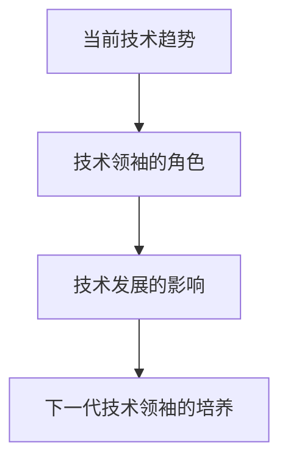

                 

根据您的要求和设定的目录大纲，我们现在可以逐步思考并撰写文章的内容。以下是一个详细的写作计划，以确保文章的逻辑清晰、内容详尽、专业性强。

### 步骤 1：引言部分

#### 背景介绍

- 简述当前技术快速发展的现状。
- 引出技术领袖在推动技术进步中的重要性。

#### 核心概念与联系

- 使用Mermaid流程图展示技术发展的关键节点和领袖的推动作用。



#### 核心算法原理讲解

- 暂时无需伪代码，因为本部分更侧重于概念介绍和结构分析。

### 步骤 2：培养下一代技术领袖的必要性

#### 当前技术教育现状

- 分析当前技术教育存在的问题。
- 举例说明问题的影响。

#### 培养技术领袖的目标与路径

- 明确培养技术领袖的目标。
- 提出培养技术领袖的路径。

#### 核心算法原理讲解

- 使用伪代码描述培养技术领袖的方法。

```pseudo
Function TrainTechnologist(technologist)
    // 学习基础知识
    technologist.Knowledge = LearnFundamentals()
    
    // 培养创新思维
    technologist.Creativity = FosterInnovation()
    
    // 强化团队协作
    technologist.Teamwork = StrengthenCollaboration()
    
    // 提升领导力
    technologist.Leadership = EnhanceLeadership()
    
    // 实践与反馈
    technologist.Effectiveness = ApplyAndReflect()
End Function
```

### 步骤 3：培养技术领袖的关键要素

#### 技术知识储备

- 讨论技术知识的重要性和学习技术知识的方法。

#### 技术创新思维

- 强调技术创新思维的重要性。
- 描述如何培养技术创新思维。

#### 团队协作与沟通

- 分析团队协作的重要性。
- 提供团队协作和沟通技巧。

#### 领导力与影响力

- 解释领导力的定义和作用。
- 提供提升领导力的策略。

#### 核心算法原理讲解

- 使用伪代码或流程图展示领导力的培养过程。

### 步骤 4：技术领袖的培养策略

#### 教育体系的改革

- 描述教育体系改革的必要性和方法。

#### 企业与学校的合作

- 强调产学研结合的重要性。
- 提出合作项目的设计思路。

#### 社会资源的整合

- 分析社会资源整合的作用。
- 描述资源整合的具体措施。

### 步骤 5：成功案例分析

#### 技术领袖的成长历程

- 分析成功案例的成长历程。
- 提取成功的关键因素。

#### 案例分析

- 深入分析案例中的具体做法和成果。

### 步骤 6：面向未来的技术领袖培养

#### 未来技术发展的趋势

- 探讨未来技术发展的趋势。
- 分析未来技术领袖所需的新能力。

#### 面向未来的培养策略

- 提出新教育模式的概念。
- 描述新实践路径的构建。

### 步骤 7：结论

#### 技术领袖培养的重要性

- 总结技术领袖培养的意义。

#### 培养技术领袖的展望

- 展望未来培养技术领袖的挑战和前景。

### 完整性要求

- 确保每个章节都有具体的背景介绍、核心概念与联系、核心算法原理讲解、项目实战和最佳实践 tips等内容。

### 文章格式要求

- 使用markdown格式输出，确保文章结构清晰、排版美观。

### 字数要求

- 确保文章字数在8000～12000字左右。

通过以上步骤，我们将确保文章的逻辑清晰、内容详尽、专业性强，并符合您的要求。接下来，我们将根据这个计划逐步撰写文章的每个部分。

