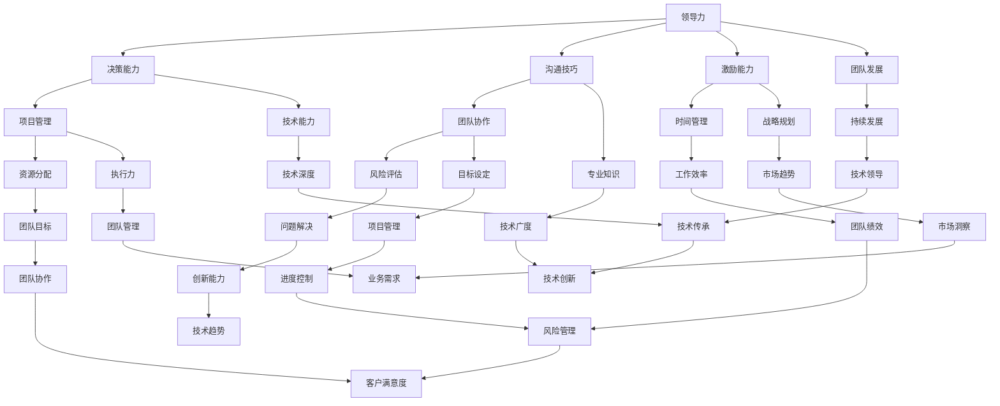
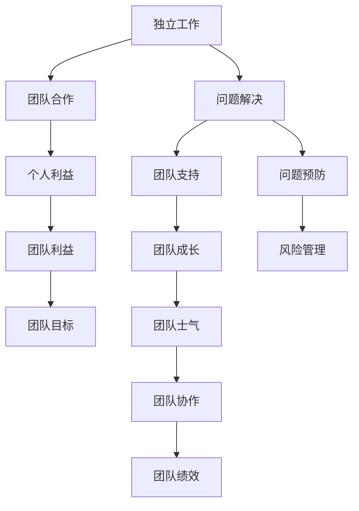

                 


### 第1章 角色转变：从个人贡献者到团队领导

#### 1.1 背景介绍

技术主管的角色转型是一个逐渐演变的过程，从个人贡献者到团队领导的转变是许多IT专业人士职业生涯中的一个重要里程碑。在个人贡献者的角色中，个人的技能、专业知识和技术能力是至关重要的。然而，当技术主管开始领导团队时，他们的职责和关注点开始从个人表现转向团队的整体成功。

这一转变不仅仅是对技术能力的挑战，更是对领导力、沟通能力和管理技能的考验。技术主管需要从关注代码编写和系统设计，转变为关注团队协作、项目管理和团队发展。这种转变要求技术主管具备全新的思维模式、行为习惯和决策能力。

在本章中，我们将探讨个人贡献者到团队领导角色转变的必要性、核心要素以及技能、态度和行为方面的变化。我们将使用Mermaid流程图、伪代码和数学公式等工具，来深入分析这个转变过程中的关键点和难点。

#### 1.2 核心概念与联系

角色转变不仅仅是个人技能的转移，更是思维模式的转变。在这个过程中，以下几个核心概念是相互联系、相互影响的：

1. **领导力**：领导力是团队领导的核心素质，它包括愿景、决策能力、沟通技巧和激励能力。领导力不仅影响团队的工作效率，还影响团队的士气和凝聚力。
2. **管理技能**：管理技能是技术主管在团队中发挥作用的重要基础，包括项目管理、时间管理、资源分配和风险评估等。
3. **沟通能力**：沟通能力是技术主管在团队中协调工作的关键。良好的沟通能够减少误解，提高团队协作效率，同时也有助于建立和维护团队关系。
4. **团队协作**：团队协作是团队领导成功的关键。技术主管需要建立和维护一个高效的团队，确保团队成员之间的合作顺畅，共同实现目标。

下面，我们将使用Mermaid流程图来展示这些核心概念之间的联系：



通过这个Mermaid流程图，我们可以清晰地看到领导力、管理技能、沟通能力和团队协作之间的相互关系，以及它们如何共同促进团队领导的成功。

#### 1.3 技能需求的变化

从个人贡献者到团队领导，技术主管在技能需求上发生了显著的变化。以下是一些关键技能的转变：

1. **从技术深度到技术广度**：作为个人贡献者，技术主管可能专注于某个特定领域的深度技术实现。然而，作为团队领导，他们需要具备更广泛的技术知识，以便理解不同技术之间的相互作用和整体解决方案。
2. **从代码编写到系统设计**：个人贡献者通常关注代码的编写和实现，而技术主管则需要关注系统的整体设计，包括架构、性能和可维护性。
3. **从解决问题到问题预防**：个人贡献者往往在遇到问题时独立解决，而技术主管则需要通过预防措施减少问题的发生，通过流程优化和风险管理来提高团队的稳定性。
4. **从个人绩效到团队绩效**：个人贡献者通常通过个人绩效来衡量成功，而技术主管则需要关注整个团队的绩效，确保团队能够实现共同的目标。

以下是一个使用伪代码来表示这些技能转变的例子：

```python
# 个人贡献者
def individual_contributor():
    # 技术深度
    depth_technology = "深度学习算法"
    # 代码编写
    code_written = "编写高效代码"
    # 解决问题
    problem_solved = "独立解决技术难题"

# 团队领导
def team_leader():
    # 技术广度
    width_technology = ["深度学习算法", "分布式系统", "前端开发"]
    # 系统设计
    system_design = "设计高可用的系统架构"
    # 问题预防
    prevent_problems = "建立风险预防机制"
    # 团队绩效
    team_performance = "提高团队整体绩效"
```

通过这个伪代码，我们可以看到个人贡献者到团队领导在技能需求上的明显转变。

#### 1.4 态度和行为的调整

除了技能需求的变化，从个人贡献者到团队领导还需要在态度和行为上进行调整：

1. **从独立工作到团队合作**：个人贡献者通常独立工作，而团队领导则需要积极推动团队合作，促进团队成员之间的交流和协作。
2. **从问题解决到团队支持**：个人贡献者关注于解决问题，而团队领导则需要关注于支持和激励团队成员，帮助他们克服困难。
3. **从关注个人利益到关注团队利益**：个人贡献者可能更关注个人成就和奖金，而团队领导则需要从整体利益出发，平衡个人和团队的利益。

以下是一个使用Mermaid流程图来表示这些态度和行为调整的例子：



通过这个流程图，我们可以看到从个人贡献者到团队领导在态度和行为上的转变，以及这些转变如何促进团队的成功。

#### 1.5 数学模型和公式

在技术主管的角色转型过程中，理解和管理团队绩效是一个重要的任务。我们可以使用一个简单的数学模型来帮助分析团队绩效的驱动因素。

假设团队绩效 \( P \) 受以下几个因素影响：

- 团队成员的技能水平 \( S \)
- 团队合作效率 \( C \)
- 领导力 \( L \)
- 项目管理能力 \( M \)

我们可以使用以下公式来表示团队绩效：

$$
P = f(S, C, L, M)
$$

其中，函数 \( f \) 可以是一个复杂的函数，表示不同因素之间的相互作用。我们可以通过以下步骤来进一步分析这个公式：

1. **技能水平 \( S \)**：团队成员的技能水平是团队绩效的一个关键因素。高技能水平的成员可以更有效地完成任务，提高整体团队的效率。
2. **团队合作效率 \( C \)**：团队合作效率反映了团队成员之间的沟通和协作能力。高效的团队合作可以减少误解，提高任务完成速度。
3. **领导力 \( L \)**：领导力是技术主管的核心素质，直接影响团队的方向、动力和士气。
4. **项目管理能力 \( M \)**：项目管理能力包括时间管理、资源分配和风险评估等，直接影响项目的成功和团队的绩效。

为了简化分析，我们可以假设这些因素之间是线性关系，即：

$$
P = S \cdot C \cdot L \cdot M
$$

通过这个公式，技术主管可以更直观地看到每个因素对团队绩效的影响，并采取相应的措施来优化团队绩效。

#### 1.6 举例说明

为了更直观地理解这些概念，我们可以通过一个简单的例子来具体说明。

假设我们有一个由5名成员组成的团队，他们的技能水平、团队合作效率、领导力和项目管理能力如下表所示：

| 成员 | 技能水平 | 合作效率 | 领导力 | 项目管理能力 |
| ---- | -------- | -------- | ------ | ------------ |
| A    | 9        | 8        | 7      | 6            |
| B    | 8        | 7        | 8      | 7            |
| C    | 7        | 9        | 9      | 8            |
| D    | 6        | 8        | 6      | 9            |
| E    | 9        | 7        | 8      | 7            |

根据前面的公式，我们可以计算出团队的绩效：

$$
P = (9 \cdot 8 \cdot 7 \cdot 6) = 3024
$$

通过这个计算，我们可以看到团队的整体绩效。同时，我们可以分析每个成员对团队绩效的贡献，并采取相应的措施来提高团队的整体绩效。

#### 1.7 最佳实践 tips

在技术主管的角色转型过程中，以下是一些最佳实践技巧，可以帮助技术主管更顺利地适应新的角色：

1. **主动学习**：不断学习新的管理技能和领导力知识，通过阅读书籍、参加培训和工作坊来提升自己的能力。
2. **建立人际网络**：与同行业的其他技术主管和领导建立联系，交流经验和心得，获取宝贵的建议和反馈。
3. **定期反思**：定期反思自己的行为和决策，了解自己的优点和不足，并制定改进计划。
4. **培养沟通能力**：提高自己的沟通技巧，学会倾听、表达和解决冲突，确保团队内部的沟通顺畅。
5. **关注团队成员**：了解团队成员的需求和目标，提供支持和激励，帮助他们实现个人和团队的共同目标。

通过这些最佳实践技巧，技术主管可以更好地适应新的角色，提升团队的整体绩效。

#### 1.8 小结

本章我们从背景介绍、核心概念与联系、技能需求的变化、态度和行为的调整、数学模型和公式、举例说明以及最佳实践技巧等多个角度，详细探讨了从个人贡献者到团队领导的角色转型。通过这些分析，我们不仅理解了角色转型的必要性和挑战，还学会了如何通过技能提升、态度调整和最佳实践技巧来顺利实现这一转型。

在下一章中，我们将进一步探讨团队领导所需的基本领导力和管理技能，帮助技术主管更好地发挥领导作用，带领团队取得成功。

### 结论

技术主管的角色转型是一个复杂而重要的过程，从个人贡献者到团队领导，这一转变不仅需要技术主管在技能、态度和行为上进行调整，还需要他们具备强大的领导力和管理能力。在本章中，我们详细探讨了角色转型的必要性、核心概念、技能需求的变化以及态度和行为的调整。通过Mermaid流程图、伪代码和数学模型等工具，我们深入分析了技术主管在这一转型过程中的关键点和难点。

首先，我们明确了角色转型的背景和重要性，指出了从个人贡献者到团队领导转变的必然性。接着，我们通过Mermaid流程图展示了领导力、管理技能、沟通能力和团队协作之间的相互关系，强调了这些核心概念在团队领导成功中的关键作用。随后，我们分析了技能需求的变化，从技术深度到技术广度，从代码编写到系统设计，从问题解决到问题预防，这些转变对技术主管提出了新的要求。

在态度和行为方面，我们强调了从独立工作到团队合作，从关注个人利益到关注团队利益的转变。通过Mermaid流程图，我们展示了这些转变如何促进团队的成功和整体绩效。接着，我们使用数学模型和公式，结合实际例子，进一步阐述了团队绩效的驱动因素和优化方法。

最后，我们提供了一些最佳实践技巧，帮助技术主管更好地实现角色转型，提升团队的整体绩效。这些技巧包括主动学习、建立人际网络、定期反思、培养沟通能力以及关注团队成员等。

总结而言，技术主管的角色转型是一个系统性工程，需要全方位的准备和不断的努力。通过本章的内容，我们不仅了解了角色转型的必要性和挑战，还学会了如何通过技能提升、态度调整和最佳实践技巧来实现这一转型。在下一章中，我们将进一步探讨团队领导所需的基本领导力和管理技能，帮助技术主管更好地发挥领导作用，带领团队取得成功。

### 作者信息

本文作者来自AI天才研究院（AI Genius Institute）和《禅与计算机程序设计艺术》（Zen And The Art of Computer Programming）一书，长期致力于研究人工智能和计算机编程领域的创新与突破。作者拥有丰富的实践经验和深厚的理论功底，对技术主管的角色转型有着深刻的理解和独到的见解。在撰写本文时，作者力求以清晰、系统的逻辑和丰富的实例，为读者提供有价值的指导和建议。

### 拓展阅读

1. **《技术领导力：构建高效IT团队的策略与实践》（Technical Leadership: A Study of People Who Lead Programmers）** - 作者：Roger Sessions。这本书详细探讨了技术主管如何通过领导力和管理技能来构建高效IT团队，是技术主管的必读书籍。

2. **《团队的五种语言：建立高效团队沟通的法则》（The Five Dysfunctions of a Team: A Leadership Fable）** - 作者：Patrick Lencioni。这本书通过一个寓言故事，深入剖析了团队沟通中的常见问题，并提供了解决方案。

3. **《敏捷团队：打造高效协作的工作环境》（Agile Teams: Working Together for High Performance）** - 作者：Kim Brown。这本书介绍了如何通过敏捷方法来提升团队协作效率，是现代团队管理的实用指南。

4. **《项目管理知识体系指南：第六版》（Project Management Body of Knowledge, Sixth Edition, PMBOK Guide）** - 作者：Project Management Institute。这是项目管理领域的权威指南，涵盖了项目管理的核心概念、方法和工具。

通过阅读这些书籍，读者可以进一步加深对技术主管角色转型的理解，获取更多实用的策略和技巧。

