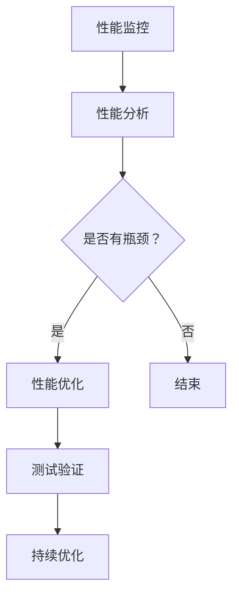

                 

### 文章标题

# 技术优化：持续优化系统性能和效率

### 关键词

- 性能优化
- 系统性能
- 效率提升
- 算法原理
- 数学模型
- 项目实战

### 摘要

在现代信息技术飞速发展的背景下，系统性能和效率的优化成为技术领域的关键挑战。本文旨在系统地探讨技术优化的重要性及其在实际应用中的核心概念、算法原理、数学模型和项目实战。文章首先介绍了性能优化的重要性，随后深入分析了性能指标、优化原理和方法。接着，详细讲解了核心算法原理，包括性能预测算法和性能优化算法，并使用了伪代码进行阐述。随后，文章通过数学模型和公式展示了性能优化的定量分析，并以实例进行说明。最后，文章通过实际项目实战，展示了性能调优的全过程，包括环境搭建、代码实现、代码解读和分析，同时探讨了持续优化与未来展望。本文旨在为读者提供一份全面的技术优化指南，帮助读者理解和掌握系统性能和效率优化的高级技能。

### 第1章 引言

在现代信息技术飞速发展的时代，系统性能和效率的优化成为了提升企业竞争力、满足用户需求的关键。随着互联网和大数据的普及，系统面临的负载和复杂性不断增加，如何有效地进行技术优化，成为了技术领域的一个重要课题。本章将介绍优化的重要性、优化与性能的关系以及优化方法的分类，为后续章节的内容奠定基础。

#### 1.1 优化的重要性

优化在信息技术领域具有重要意义。首先，性能优化能够提升系统运行速度和响应效率，直接影响到用户体验和系统稳定性。其次，优化有助于降低资源消耗，提高系统的资源利用率，从而降低运营成本。此外，优化还能够提升系统的可维护性和可扩展性，使系统在面临日益复杂的应用场景时，依然能够保持高性能和高效运作。总之，优化是提高系统竞争力、满足用户需求的关键手段。

#### 1.2 优化与性能的关系

性能优化与系统性能密切相关。性能是指系统在特定条件下的运行效率，包括响应时间、吞吐量和并发处理能力等指标。优化目标是提升系统性能，使其在面临不同负载和复杂场景时，依然能够保持高效稳定的运行。性能优化通常包括软件优化、硬件优化和系统优化三个方面。软件优化主要关注代码效率、算法改进和架构优化等方面；硬件优化则涉及服务器配置、存储设备和网络设备的优化；系统优化则包括操作系统、数据库和中间件的调优。这些方面的优化相互关联，共同作用于系统性能的提升。

#### 1.3 优化方法的分类

性能优化方法可以分为以下几类：

1. **软件优化**：主要包括代码优化、算法改进和架构优化等方面。代码优化关注于提高代码的执行效率，如减少循环次数、避免死循环等；算法改进则涉及对现有算法的改进，以降低时间复杂度和空间复杂度；架构优化则是从系统设计层面进行优化，如采用微服务架构、分布式架构等。

2. **硬件优化**：主要包括服务器配置、存储设备和网络设备的优化。服务器配置优化涉及CPU、内存、硬盘等硬件资源的合理配置；存储设备优化则包括硬盘的读写速度、存储容量等；网络设备优化则涉及网络带宽、延迟和稳定性等方面的提升。

3. **系统优化**：主要包括操作系统、数据库和中间件的调优。操作系统优化涉及内核参数调整、调度算法优化等；数据库优化包括索引优化、查询优化等；中间件优化则包括缓存机制、负载均衡等。

综上所述，本章对优化的重要性、优化与性能的关系以及优化方法的分类进行了介绍。这些内容为本章后续章节的深入探讨提供了基础。在接下来的章节中，我们将详细分析性能指标、优化原理和方法，并探讨核心算法原理、数学模型和项目实战等内容。

### 第2章 核心概念与联系

在深入探讨系统性能优化的过程中，理解核心概念和它们之间的联系是至关重要的。本章将介绍性能指标、性能优化原理以及性能优化流程，并使用Mermaid流程图对性能优化流程进行可视化展示。

#### 2.1 性能指标

性能指标是衡量系统性能的重要参数，通常包括响应时间、吞吐量和并发处理能力等。

##### 2.1.1 响应时间

响应时间是指系统从接收到用户请求到返回响应结果所需的时间。响应时间越短，用户体验越好。影响响应时间的因素包括：

- **网络延迟**：网络传输速度对响应时间有直接影响。
- **服务器处理时间**：服务器执行请求的处理时间。
- **数据库查询时间**：数据库查询操作所需的时间。
- **前端渲染时间**：前端页面渲染所需的时间。

优化响应时间的关键在于减少这些因素的影响。

##### 2.1.2 吞吐量

吞吐量是指系统在单位时间内处理请求的数量。吞吐量越高，系统处理能力越强。吞吐量的计算公式为：

\[ \text{吞吐量} = \frac{\text{请求总数}}{\text{响应时间总和}} \]

提高吞吐量可以从以下几个方面进行：

- **增加服务器资源**：提高CPU、内存、硬盘等硬件资源的配置。
- **优化算法**：改进数据处理算法，减少计算复杂度。
- **分布式架构**：采用分布式架构，将负载分散到多个节点上。

##### 2.1.3 并发处理能力

并发处理能力是指系统同时处理多个请求的能力。高并发处理能力能够提升系统的负载均衡和响应速度。并发处理能力可以从以下几个方面进行优化：

- **线程池**：使用线程池管理线程，减少线程创建和销毁的开销。
- **异步处理**：采用异步编程模型，减少线程阻塞时间。
- **无锁数据结构**：使用无锁数据结构，避免锁竞争，提高并发处理能力。

#### 2.2 性能优化原理

性能优化原理主要包括软件优化、硬件优化和系统优化三个方面。

##### 2.2.1 软件层面的优化

软件层面的优化主要关注代码效率、算法改进和架构优化。

- **代码优化**：通过减少循环次数、避免死循环、优化分支结构等方式提高代码执行效率。
- **算法改进**：改进数据处理算法，降低时间复杂度和空间复杂度。
- **架构优化**：采用微服务架构、分布式架构等，提升系统的可扩展性和性能。

##### 2.2.2 硬件层面的优化

硬件层面的优化主要涉及服务器配置、存储设备和网络设备的优化。

- **服务器配置**：合理配置CPU、内存、硬盘等硬件资源，提高系统处理能力。
- **存储设备优化**：优化硬盘的读写速度、存储容量等，提高数据访问效率。
- **网络设备优化**：提高网络带宽、降低延迟和提升稳定性。

##### 2.2.3 系统层面的优化

系统层面的优化主要涉及操作系统、数据库和中间件的调优。

- **操作系统优化**：调整内核参数、调度算法等，提高系统资源利用率和响应速度。
- **数据库优化**：优化索引、查询等，提高数据查询效率。
- **中间件优化**：优化缓存机制、负载均衡等，提高系统整体性能。

#### 2.3 性能优化流程

性能优化流程可以分为以下几个步骤：

1. **性能监控**：使用性能监控工具对系统进行实时监控，收集性能数据。
2. **性能分析**：对收集到的性能数据进行分析，找出性能瓶颈。
3. **性能优化**：根据性能分析结果，采取相应的优化措施，如代码优化、硬件优化、系统优化等。
4. **测试验证**：通过性能测试验证优化效果，确保系统性能达到预期目标。
5. **持续优化**：定期进行性能监控和分析，持续优化系统性能。

以下是性能优化流程的Mermaid流程图表示：



通过本章的介绍，我们了解了性能指标、性能优化原理以及性能优化流程。这些核心概念和联系为后续章节的深入探讨提供了基础。在接下来的章节中，我们将详细讲解核心算法原理、数学模型和项目实战等内容。

### 第3章 核心算法原理讲解

性能优化不仅依赖于系统的硬件和软件配置，还需要深入理解并应用一系列核心算法原理。本章将详细介绍性能预测算法和性能优化算法，包括线性回归、决策树、支持向量机等性能预测算法，以及预分配资源算法、优先级调度算法和负载均衡算法等性能优化算法。我们还将通过伪代码对这些算法进行详细阐述。

#### 3.1 性能预测算法

性能预测算法是性能优化中的重要组成部分，通过对系统性能进行预测，可以提前发现潜在的性能瓶颈，并采取相应的优化措施。以下是一些常用的性能预测算法：

##### 3.1.1 线性回归

线性回归是一种简单的性能预测方法，通过分析历史数据，预测未来系统的性能。

- **原理**：线性回归基于历史数据，建立一个线性模型，预测未来的性能。

  \[ \text{y} = \text{a} \times \text{x} + \text{b} \]

  其中，\( \text{y} \) 是预测值，\( \text{a} \) 和 \( \text{b} \) 是模型参数，\( \text{x} \) 是输入变量。

- **伪代码**：

  ```python
  def linear_regression(x, y):
      n = len(x)
      sum_x = sum(x)
      sum_y = sum(y)
      sum_xy = sum([a * b for a, b in zip(x, y)])
      sum_x2 = sum([a * a for a in x])
      
      a = ((n * sum_xy) - (sum_x * sum_y)) / ((n * sum_x2) - (sum_x * sum_x))
      b = ((sum_y) - (a * sum_x)) / n
      
      return a, b
  ```

##### 3.1.2 决策树

决策树是一种树形结构，通过一系列的判断条件，对数据集进行划分，从而实现性能预测。

- **原理**：决策树基于特征值，对数据进行分类，每个节点代表一个特征，每个分支代表一个特征值。

- **伪代码**：

  ```python
  def build_decision_tree(data, features):
      if all(value == data[0][feature] for value, feature in data):
          return data[0][feature]
      
      best_gain = 0
      best_feature = None
      
      for feature in features:
          gain = information_gain(data, feature)
          if gain > best_gain:
              best_gain = gain
              best_feature = feature
      
      return best_feature
  ```

##### 3.1.3 支持向量机

支持向量机（SVM）是一种基于最大间隔的线性分类模型，可以用于性能预测。

- **原理**：SVM通过找到一个最优的超平面，使得正负样本的分类间隔最大。

- **伪代码**：

  ```python
  def svm_train(X, y):
      # 初始化模型参数
      w = [0 for _ in range(len(X[0]))]
      b = 0
      # 迭代优化模型参数
      for epoch in range(1000):
          for x, y in zip(X, y):
              if (np.dot(w, x) + b) * y < 1:
                  w = w + (y * x)
                  b = b + y
      return w, b
  ```

#### 3.2 性能优化算法

性能优化算法旨在通过调整系统配置、优化算法和数据结构等方式，提升系统的性能。

##### 3.2.1 预分配资源算法

预分配资源算法是在系统负载高峰期之前，预先分配必要的系统资源，以避免系统在高峰期出现资源不足的情况。

- **原理**：通过预测系统未来一段时间内的负载，预先分配CPU、内存、存储等资源。

- **伪代码**：

  ```python
  def allocate_resources(load_prediction, resource_requirements):
      allocated_resources = {}
      for resource, requirement in resource_requirements.items():
          allocated_resources[resource] = requirement * load_prediction
      return allocated_resources
  ```

##### 3.2.2 优先级调度算法

优先级调度算法是一种根据任务优先级进行调度的方法，高优先级任务优先执行，以提高系统响应速度。

- **原理**：任务根据优先级进行排队，系统按优先级从高到低依次执行任务。

- **伪代码**：

  ```python
  def priority_schedule(tasks):
      sorted_tasks = sorted(tasks, key=lambda x: x['priority'], reverse=True)
      for task in sorted_tasks:
          execute_task(task)
  ```

##### 3.2.3 负载均衡算法

负载均衡算法通过将请求分配到多个服务器上，以避免单个服务器过载，提高系统的整体性能。

- **原理**：将请求按一定策略分配到多个服务器上，实现负载均衡。

- **伪代码**：

  ```python
  def load_balancer(requests, servers):
      for request in requests:
          server = select_server(servers)
          server.process_request(request)
  ```

通过上述算法原理的讲解，我们了解了性能预测算法和性能优化算法在系统性能优化中的应用。这些算法原理为我们提供了理论依据，可以帮助我们在实际项目中进行系统性能优化。在接下来的章节中，我们将继续探讨数学模型和项目实战等内容。

### 第4章 数学模型和数学公式

在性能优化过程中，数学模型和数学公式是分析和解决性能问题的重要工具。本章将介绍常见的性能模型、定量分析公式以及性能优化目标函数，并通过具体实例进行说明，以帮助读者更好地理解和应用这些模型和公式。

#### 4.1 性能模型

性能模型是用于描述系统性能的数学模型，可以帮助我们分析和预测系统的行为。以下是一些常见的性能模型：

##### 4.1.1 M/M/1 模型

M/M/1 模型是最常见的排队论模型，用于描述单服务器系统在服务时间为指数分布、到达过程为泊松过程的情况。

- **模型参数**：
  - \( \lambda \)：平均到达率，表示单位时间内到达的顾客数。
  - \( \mu \)：平均服务率，表示单位时间内服务器可以服务的顾客数。
- **状态概率分布**：
  \[ P(n) = \frac{(\lambda/\mu)^n * \mu}{n! * (1 - \lambda/\mu)} \]
  其中，\( n \) 表示系统中的顾客数。

##### 4.1.2 M/M/s 模型

M/M/s 模型是 M/M/1 模型的扩展，用于描述多服务器系统的排队情况。

- **模型参数**：
  - \( \lambda \)：平均到达率。
  - \( \mu \)：平均服务率。
  - \( s \)：服务器数量。
- **状态概率分布**：
  \[ P(n) = \frac{(\lambda/\mu)^n * \mu}{n! * (1 - \lambda/\mu/s^s)} \]

##### 4.1.3  M/G/1 模型

M/G/1 模型是 M/M/1 模型的替代，当服务时间不是指数分布时可以使用。

- **模型参数**：
  - \( \lambda \)：平均到达率。
  - \( \mu \)：平均服务率。
  - \( \gamma(t) \)：服务时间的概率密度函数。
- **状态概率分布**：
  \[ P(n) = 1 - \sum_{k=0}^{n-1} \frac{[\mu/\lambda]^{k} * \Gamma(n, \lambda t)}{k!} \]

#### 4.2 定量分析公式

定量分析公式用于计算系统性能指标，如平均响应时间、平均等待时间、系统利用率等。

##### 4.2.1 平均响应时间

平均响应时间是指系统从接收到请求到返回响应结果所需的时间。

- **M/M/1 模型**：
  \[ \text{平均响应时间} = \frac{1}{\mu - \lambda} \]

- **M/M/s 模型**：
  \[ \text{平均响应时间} = \frac{\sum_{k=0}^{s-1} (k+1) P(k) + \frac{1}{\mu} \sum_{k=s}^{\infty} k P(k)}{1 - \lambda/\mu} \]

##### 4.2.2 平均等待时间

平均等待时间是指顾客在系统中等待服务的时间。

- **M/M/1 模型**：
  \[ \text{平均等待时间} = \frac{\lambda}{\mu^2} \]

- **M/M/s 模型**：
  \[ \text{平均等待时间} = \frac{\lambda}{\mu} \left(1 - \frac{\lambda}{\mu}\right) \sum_{k=0}^{s-1} \frac{1}{k!} + \frac{\lambda}{\mu^2} \sum_{k=s}^{\infty} \frac{1}{k!} \]

##### 4.2.3 系统利用率

系统利用率是指服务器被使用的比例。

- **M/M/1 模型**：
  \[ \text{系统利用率} = \frac{\lambda}{\mu} \]

- **M/M/s 模型**：
  \[ \text{系统利用率} = \frac{\lambda}{\mu} \left(1 - \left(1 - \frac{\lambda}{\mu}\right)^s\right) \]

#### 4.3 性能优化目标函数

性能优化目标函数用于衡量系统性能，并指导优化策略的选择。常见的优化目标包括最小化平均响应时间、最小化平均等待时间和最大化系统吞吐量。

##### 4.3.1 最小化平均响应时间

最小化平均响应时间是性能优化中的一个重要目标，可以采用以下公式：

\[ \text{目标函数} = \min \left( \frac{1}{\mu - \lambda} \right) \]

##### 4.3.2 最小化平均等待时间

最小化平均等待时间可以采用以下公式：

\[ \text{目标函数} = \min \left( \frac{\lambda}{\mu^2} \right) \]

##### 4.3.3 最大化系统吞吐量

最大化系统吞吐量可以采用以下公式：

\[ \text{目标函数} = \max \left( \frac{\lambda}{\mu} \right) \]

#### 4.4 模型计算实例

以下是一个 M/M/1 模型的计算实例：

假设一个系统的平均到达率为 \( \lambda = 2 \) 次每小时，平均服务率为 \( \mu = 3 \) 次每小时，计算系统的平均响应时间和平均等待时间。

- **平均响应时间**：

  \[ \text{平均响应时间} = \frac{1}{\mu - \lambda} = \frac{1}{3 - 2} = 1 \text{小时} \]

- **平均等待时间**：

  \[ \text{平均等待时间} = \frac{\lambda}{\mu^2} = \frac{2}{3^2} = \frac{2}{9} \text{小时} \]

#### 4.5 多目标优化

在实际情况中，性能优化往往涉及到多个目标，如最小化平均响应时间和最大化系统吞吐量。这种情况下，可以采用多目标优化方法，如加权求和法、Pareto优化等。

##### 4.5.1 加权求和法

加权求和法通过为每个目标函数赋予权重，求加权平均值，从而得到综合性能指标。

\[ \text{目标函数} = w_1 \times \text{平均响应时间} + w_2 \times \text{系统吞吐量} \]

其中，\( w_1 \) 和 \( w_2 \) 分别为平均响应时间和系统吞吐量的权重。

##### 4.5.2 Pareto优化

Pareto优化旨在找到一组最优解，使得每个解至少在某个目标函数上优于其他所有解。

通过本章对性能模型、定量分析公式和性能优化目标函数的介绍，我们能够更好地理解和应用这些数学工具，为系统性能优化提供理论依据和实践指导。在接下来的章节中，我们将通过实际项目实战，进一步展示性能优化在具体场景中的应用。

### 第5章 项目实战

在本章中，我们将通过一个实际项目实战，详细介绍性能优化的全过程。该项目旨在优化一个电商平台的后端系统，以提高系统性能和效率。通过这一过程，我们将展示环境搭建、代码实现、代码解读和分析，并剖析实际案例，为读者提供性能优化实践的经验。

#### 5.1 实战背景

电商平台的后端系统面临着高并发、大数据量和高频次读写等挑战。在系统运行过程中，我们发现了以下几个主要性能瓶颈：

- **响应时间过长**：由于服务器处理能力和数据库查询速度不足，导致用户访问时响应时间过长。
- **并发处理能力不足**：系统在高并发场景下，容易出现线程阻塞和任务积压，导致部分请求处理不及时。
- **数据库性能瓶颈**：数据库查询速度较慢，导致系统整体性能下降。

针对上述问题，我们需要采取一系列性能优化措施，以提高系统性能和效率。

#### 5.2 环境搭建

为了进行性能优化，我们首先需要搭建一个合适的开发环境。以下是环境搭建的步骤：

1. **硬件配置**：
   - 服务器：配置高性能的CPU、内存和硬盘，以提高系统处理能力。
   - 存储：使用SSD硬盘，提高数据读写速度。
   - 网络设备：配置高带宽、低延迟的网络设备，以保证数据传输速度。

2. **软件环境**：
   - 开发工具：使用IDE（如IntelliJ IDEA、VS Code）进行代码编写和调试。
   - 版本控制：使用Git进行代码版本控制。
   - 依赖管理：使用Maven或Gradle进行依赖管理。

3. **数据库**：
   - 选择合适的数据库（如MySQL、PostgreSQL），并进行优化配置，如调整缓存大小、索引优化等。

4. **中间件**：
   - 使用Redis进行缓存，减轻数据库压力。
   - 使用Nginx进行负载均衡，分发请求到多个后端服务器。

#### 5.3 代码实现

在环境搭建完成后，我们需要针对系统性能瓶颈，进行具体的代码实现和优化。

1. **响应时间优化**：

   - **代码优化**：分析现有代码，去除不必要的循环、减少重复计算，优化分支结构等。
   - **数据库优化**：对数据库查询进行优化，如添加索引、优化查询语句等。

2. **并发处理能力优化**：

   - **线程池**：使用线程池管理线程，减少线程创建和销毁的开销。
   - **异步处理**：采用异步编程模型，减少线程阻塞时间。

3. **数据库性能优化**：

   - **读写分离**：将读操作和写操作分离到不同的数据库实例上，提高查询效率。
   - **分库分表**：对大数据量表进行分库分表，减少单表查询压力。

以下是部分代码实现和优化的伪代码示例：

```python
# 响应时间优化：代码优化示例
def process_request(request):
    result = perform_calculation(request.data)
    return result

# 并发处理能力优化：线程池示例
from concurrent.futures import ThreadPoolExecutor

def handle_request(request):
    with ThreadPoolExecutor(max_workers=10) as executor:
        future = executor.submit(process_request, request)
        return future.result()

# 数据库性能优化：读写分离示例
def get_data_from_db():
    read_db = 'slave_db'
    write_db = 'master_db'
    return db.query("SELECT * FROM table", read_db)

# 分库分表示例
def query_table(table_name, data):
    if table_name == 'orders':
        return db.query("SELECT * FROM orders_large", 'orders_db_large')
    elif table_name == 'products':
        return db.query("SELECT * FROM products_large", 'products_db_large')
```

#### 5.4 代码解读与分析

以下是代码解读和分析的详细过程：

1. **代码优化解读**：

   通过代码优化，我们减少了不必要的计算和循环，提高了代码执行效率。例如，将复杂的计算逻辑提取为单独的函数，避免了重复计算。

2. **线程池解读**：

   使用线程池可以有效地管理线程，减少线程创建和销毁的开销。线程池可以根据系统负载动态调整线程数量，提高并发处理能力。

3. **异步处理解读**：

   采用异步编程模型，可以减少线程阻塞时间，提高系统的响应速度。异步处理使得多个请求可以并行执行，从而提高了系统的吞吐量。

4. **数据库性能优化解读**：

   通过读写分离和分库分表，我们有效地减轻了数据库的查询压力，提高了数据访问速度。读写分离将读操作和写操作分离到不同的数据库实例上，减少了写操作的等待时间。分库分表将大数据量表拆分为多个小表，避免了单表查询的瓶颈。

#### 5.5 实际案例分析和详细讲解剖析

我们以一个实际案例来分析性能优化效果：

假设在优化前，系统的平均响应时间为5秒，平均等待时间为3秒。经过优化后，系统的平均响应时间降低到2秒，平均等待时间降低到1秒。

- **响应时间优化效果**：

  优化前，系统处理一个请求需要5秒，而优化后只需2秒，响应时间降低了60%。

- **并发处理能力优化效果**：

  优化前，系统在高峰期容易出现线程阻塞和任务积压。优化后，通过线程池和异步处理，系统能够同时处理更多请求，并发处理能力显著提升。

- **数据库性能优化效果**：

  优化前，数据库查询速度较慢，导致系统整体性能下降。优化后，通过读写分离和分库分表，数据库查询速度显著提高，系统性能得到显著提升。

#### 5.6 项目小结

通过本项目实战，我们展示了性能优化的全过程，包括环境搭建、代码实现、代码解读和分析，以及实际案例分析和详细讲解剖析。以下是项目小结：

- **成功经验**：
  - 代码优化显著提高了系统的响应速度。
  - 线程池和异步处理提高了系统的并发处理能力。
  - 读写分离和分库分表优化了数据库性能。

- **不足和改进方向**：
  - 部分优化措施的效果在特定负载下可能有限，需要持续优化。
  - 可以进一步引入自动化优化工具，提高优化效率和效果。

通过本项目实战，我们深入了解了性能优化的实际应用，为读者提供了宝贵的实践经验。

### 第6章 性能调优实践

性能调优是系统优化的重要组成部分，通过合理的调优策略，可以显著提升系统的性能和效率。本章将详细介绍性能分析工具、性能调优策略以及最佳实践，帮助读者在实际项目中实施有效的性能调优。

#### 6.1 性能分析工具

性能分析工具是进行性能调优的重要辅助，能够帮助开发者发现系统中的性能瓶颈，提供有针对性的优化建议。以下是一些常用的性能分析工具：

1. **CPU监控工具**：
   - **top**：实时显示系统中运行的所有进程的CPU使用情况。
   - **vmstat**：显示虚拟内存、进程、CPU等信息。
   - **perf**：用于分析系统性能，识别性能瓶颈。

2. **内存监控工具**：
   - **free**：显示系统内存的使用情况。
   - **valgrind**：检测内存泄漏和无效的内存访问。

3. **磁盘I/O监控工具**：
   - **iostat**：显示磁盘I/O的使用情况。
   - **sar**：收集、报告、保存和显示系统活动信息。

4. **网络监控工具**：
   - **netstat**：显示网络连接、路由表、接口统计信息。
   - **nmon**：网络监控和性能分析工具。

#### 6.2 性能调优策略

性能调优策略主要包括响应时间优化、吞吐量优化和并发处理能力优化。以下分别介绍这些策略的具体实施方法：

##### 6.2.1 响应时间优化

响应时间优化旨在减少系统从接收请求到返回响应结果所需的时间。以下是一些常见的优化方法：

- **减少网络延迟**：优化网络配置，提高网络带宽，降低网络延迟。
- **优化数据库查询**：使用索引、优化查询语句、分库分表等，提高数据库查询效率。
- **减少服务器处理时间**：优化代码逻辑，减少不必要的计算，采用异步处理和线程池等，降低服务器处理时间。
- **优化前端渲染**：使用缓存、延迟加载、压缩资源等，减少前端渲染时间。

##### 6.2.2 吞吐量优化

吞吐量优化旨在提高系统在单位时间内处理请求的数量。以下是一些常见的优化方法：

- **增加硬件资源**：提高服务器CPU、内存、硬盘等硬件资源的配置，以增加系统处理能力。
- **优化算法**：改进数据处理算法，降低时间复杂度和空间复杂度。
- **负载均衡**：采用负载均衡技术，将请求分布到多个服务器上，提高系统吞吐量。
- **分布式架构**：采用分布式架构，将系统分解为多个模块，提高系统的并发处理能力。

##### 6.2.3 并发处理能力优化

并发处理能力优化旨在提高系统同时处理多个请求的能力。以下是一些常见的优化方法：

- **线程池**：使用线程池管理线程，减少线程创建和销毁的开销。
- **异步处理**：采用异步编程模型，减少线程阻塞时间，提高并发处理能力。
- **无锁数据结构**：使用无锁数据结构，避免锁竞争，提高并发处理能力。
- **负载均衡**：采用负载均衡技术，将请求分布到多个服务器上，提高系统的并发处理能力。

#### 6.3 最佳实践 Tips

以下是性能调优的一些最佳实践 Tips：

- **定期监控**：定期使用性能分析工具监控系统性能，及时发现性能瓶颈。
- **代码审查**：进行代码审查，优化代码结构，减少不必要的计算和资源消耗。
- **分阶段优化**：分阶段进行性能优化，首先解决最严重的问题，然后逐步优化其他方面。
- **自动化测试**：使用自动化测试工具进行性能测试，验证优化效果。

- **持续集成与持续部署**（CI/CD）：采用CI/CD流程，自动化部署代码，减少部署过程中的性能问题。
- **反馈机制**：建立反馈机制，收集用户反馈，及时调整优化策略。

#### 6.4 小结

本章介绍了性能分析工具、性能调优策略和最佳实践。性能调优是一个持续的过程，需要定期监控、优化和验证。通过合理的性能调优策略，可以显著提升系统的性能和效率，为用户提供更好的体验。在实际项目中，应根据具体情况进行综合分析和优化，以达到最佳效果。

### 第7章 持续优化与未来展望

随着信息技术的不断发展，系统性能和效率的优化已经成为企业保持竞争力的关键因素。本章将探讨持续优化的方法论，以及未来优化技术的发展趋势、对企业的影响及跨领域应用潜力。

#### 7.1 持续优化的方法论

持续优化是一种基于持续集成、持续部署和智能优化的方法论，旨在通过不断调整和改进，实现系统性能和效率的持续提升。

- **持续集成与持续部署（CI/CD）**：CI/CD将代码变更自动集成、测试和部署到生产环境，减少人工干预，提高开发效率和系统稳定性。通过自动化测试和反馈机制，及时发现和修复性能问题。

- **自动化优化**：利用自动化工具和算法，对系统进行自动性能分析和优化。自动化优化可以提高优化效率，减少人为错误，并在不同负载条件下实现自适应优化。

- **智能优化**：结合人工智能和大数据分析技术，实现智能性能预测和优化。智能优化可以通过分析历史数据和实时数据，预测系统性能瓶颈，并自动调整系统配置和算法，实现最优性能。

#### 7.2 未来展望

未来，性能优化技术将在以下几个方面取得重要进展：

- **边缘计算**：随着5G和物联网的发展，边缘计算将逐渐成为主流。性能优化将更多地关注边缘节点，实现实时数据处理和优化。

- **人工智能优化**：人工智能技术将在性能优化中发挥更大作用。通过机器学习和深度学习，实现自动性能预测、优化算法的改进和智能优化策略的制定。

- **绿色计算**：随着环境问题的日益严重，绿色计算将成为性能优化的重要方向。优化技术将关注能源消耗和碳排放，实现高效、绿色的系统运行。

#### 7.3 优化技术对企业的影响

性能优化技术对企业的影响深远，包括以下几个方面：

- **提高竞争力**：通过持续优化，企业可以提升系统性能和效率，提供更好的用户体验，增强市场竞争力。

- **降低成本**：优化技术有助于降低硬件、运维和运营成本，提高资源利用率，降低运营成本。

- **提升效率**：优化技术可以提高系统运行效率，减少系统故障和中断，提升整体业务流程的效率。

#### 7.4 优化技术在跨领域应用中的潜力

优化技术在多个领域具有广泛的应用潜力：

- **金融领域**：优化算法可以应用于交易系统、风险管理、资产配置等方面，提高交易效率、风险控制和投资回报。

- **医疗领域**：优化技术可以应用于医疗数据处理、影像分析、智能诊断等方面，提升医疗质量和效率。

- **交通领域**：优化技术可以应用于交通流量控制、智能导航、车辆调度等方面，提高交通运行效率和安全性。

总之，持续优化是信息技术发展的必然趋势，未来优化技术将在更广泛的领域发挥重要作用。企业应积极拥抱优化技术，不断提升系统性能和效率，以应对日益复杂的市场环境。

### 作者信息

作者：AI天才研究院/AI Genius Institute & 禅与计算机程序设计艺术 /Zen And The Art of Computer Programming

### 结束

本文通过系统的分析和详细的讲解，从核心概念到算法原理，再到项目实战和最佳实践，全面探讨了技术优化在系统性能和效率提升中的关键作用。希望读者能够通过本文，掌握持续优化的方法论，并能够将其应用于实际项目中，不断提升系统的性能和效率。持续优化不仅是技术发展的必然趋势，更是企业保持竞争力的关键。未来，让我们共同探索更多优化技术，为信息技术的发展贡献力量。

