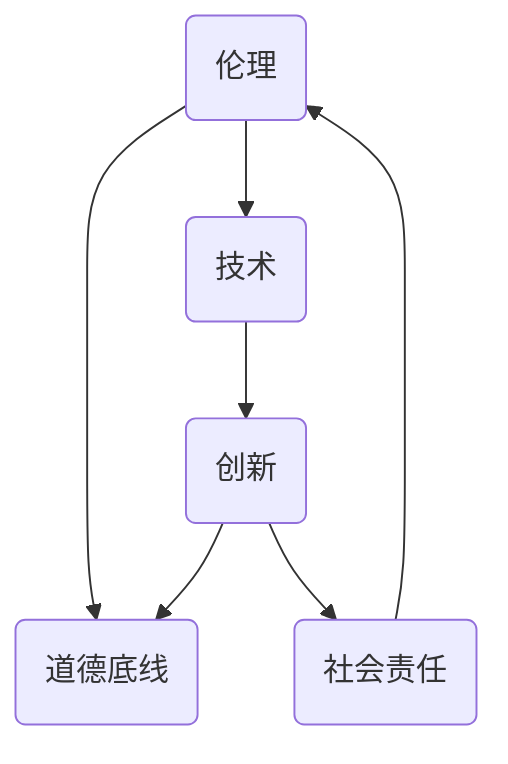

                 


## 文章标题

### 技术伦理：在创新中坚守道德底线

## 文章关键词

- 技术伦理
- 道德底线
- 创新应用
- 技术审查
- 教育培养

## 摘要

在科技的飞速发展下，技术伦理问题逐渐成为学术界、产业界和公众关注的焦点。本文旨在探讨技术伦理在创新过程中的重要地位，分析其在现实应用中的核心原则与挑战，并提出了有效的应对策略。文章首先定义了技术伦理的内涵与背景，随后详细阐述了其核心原则，如公平性、可靠性、安全性、尊重隐私和责任感。接着，文章探讨了技术伦理在创新中的具体应用，通过案例分析揭示了技术创新过程中的伦理风险。文章还强调了道德底线在技术创新中的关键作用，提出了平衡技术创新与伦理的对策。最后，文章提出了技术伦理教育的紧迫性，并展望了其未来发展趋势。希望通过本文的探讨，能引导读者在科技创新的道路上坚守道德底线，促进科技与社会的和谐发展。

## 目录

1. **引言** <a id="introduction"></a>
   1.1 **背景介绍**
   1.2 **核心概念与联系**
   
2. **技术伦理的定义和背景** <a id="definition-and-background"></a>
   2.1 **技术伦理的定义**
   2.2 **技术伦理的发展历史**
   2.3 **技术伦理的现状和趋势**
   
3. **技术伦理的核心原则** <a id="core-principles"></a>
   3.1 **公平性**
   3.2 **可靠性**
   3.3 **安全性**
   3.4 **尊重隐私**
   3.5 **社会责任**
   
4. **技术伦理在创新中的应用** <a id="application-of-ethics-in-innovation"></a>
   4.1 **创新中的伦理审查**
   4.2 **技术伦理决策框架**
   4.3 **伦理决策的案例分析**
   
5. **道德底线与技术创新的平衡** <a id="balance-of-moral-bottom-line-and-innovation"></a>
   5.1 **技术创新中的伦理风险**
   5.2 **道德底线的界定**
   5.3 **平衡技术创新与伦理的要求**
   
6. **技术伦理的案例研究和分析** <a id="case-studies-and-analysis"></a>
   6.1 **成功案例**
   6.2 **失败案例**
   6.3 **案例分析**
   
7. **技术伦理的教育与培养** <a id="education-and-cultivation-of-ethics"></a>
   7.1 **技术伦理教育的重要性**
   7.2 **技术伦理教育的实践**
   7.3 **技术伦理教育的未来趋势**
   
8. **总结与展望** <a id="summary-and-outlook"></a>
   8.1 **总结**
   8.2 **展望**
   
## 引言

### 背景介绍

随着互联网、人工智能、大数据等技术的迅速发展，科技已经深刻地改变了我们的生活方式、工作方式和思维方式。然而，技术的快速发展也带来了诸多伦理问题，如数据隐私、算法偏见、人工智能伦理等。这些问题不仅引起了学术界和产业界的关注，也引起了公众的广泛关注。在这种背景下，技术伦理逐渐成为了一个热门话题。

技术伦理，指的是在技术设计和应用过程中，需要遵循的一系列道德原则和规范。它关注的是技术在改变人类生活的同时，如何保持道德底线，如何防止技术滥用，以及如何在技术创新中兼顾社会责任。技术伦理的核心目标是确保技术的正向应用，避免对人类和社会造成负面影响。

### 核心概念与联系

在讨论技术伦理时，我们需要理解几个核心概念，包括伦理、技术、创新和道德底线。首先，伦理是一种关于正确与错误、善与恶的哲学思考，它为社会行为提供了道德准则。技术则是人类创造的用于解决问题的工具和方法。创新是在现有基础上进行改进或创造新事物。道德底线则是技术伦理中最基本的道德原则，是技术创新中不可逾越的底线。

为了更好地理解这些概念之间的关系，我们可以使用Mermaid流程图来展示它们之间的联系：



这个流程图表明，伦理与技术、创新和道德底线密切相关。技术是伦理实现的工具，创新需要遵循伦理原则，而道德底线则是技术伦理的核心，确保技术创新不偏离道德轨道，同时兼顾社会责任。

在接下来的章节中，我们将详细探讨技术伦理的定义和背景，分析其核心原则，探讨技术伦理在创新中的应用，讨论道德底线与技术创新的平衡，分析技术伦理的案例研究，以及提出技术伦理的教育和培养策略。

## 技术伦理的定义和背景

### 技术伦理的定义

技术伦理，顾名思义，是指与技术相关的伦理学研究和讨论。它关注的是在技术设计、开发、应用和推广过程中，如何处理道德问题和伦理挑战。技术伦理的核心目标是确保技术能够为人类和社会带来积极的影响，同时防止技术滥用和负面后果。

具体来说，技术伦理涉及多个方面。首先，它关注技术的伦理正当性，即技术在开发和应用过程中是否符合道德原则。例如，人工智能技术的发展带来了巨大的便利，但也引发了关于隐私、数据安全和算法偏见等伦理问题。其次，技术伦理探讨技术的社会责任，即技术创造者和使用者应该如何承担社会责任，确保技术为社会带来福祉。最后，技术伦理还涉及技术伦理决策，即如何在技术设计和应用过程中，平衡不同利益相关方的需求和期望，做出符合道德标准的决策。

### 技术伦理的发展历史

技术伦理作为一个独立的学科，其发展历程可以追溯到20世纪中期。当时，随着计算机科学的兴起，技术伦理问题开始受到关注。早期的技术伦理讨论主要围绕计算机科学和人工智能领域，探讨技术的伦理影响和社会责任。例如，1964年，计算机科学家和哲学家阿尔文·托夫勒（Alvin Toffler）发表了《未来的冲击》（Future Shock），警示技术发展可能带来的社会问题。

随着时间的推移，技术伦理的研究领域不断扩展，涵盖了更多的技术领域和伦理问题。20世纪80年代，随着互联网的普及，隐私保护和网络安全成为技术伦理的重要议题。1990年代，随着人工智能和生物技术的快速发展，伦理问题变得更加复杂和多样化。

进入21世纪，技术伦理的研究更加深入和广泛。例如，人工智能伦理、大数据伦理、基因编辑伦理等成为热门话题。同时，随着社会对技术伦理问题的关注度不断提高，政府、企业和社会组织纷纷出台相关政策，推动技术伦理的研究和应用。

### 技术伦理的现状和趋势

当前，技术伦理已经成为学术界、产业界和社会各界共同关注的重要议题。在学术界，技术伦理研究逐渐形成了多个分支领域，如计算机伦理、生物伦理、环境伦理等。在产业界，越来越多的企业开始关注技术伦理，并将其纳入产品设计和开发过程中。例如，谷歌、亚马逊等科技巨头已经建立了内部技术伦理团队，负责评估和监督公司产品和服务的技术伦理问题。

在社会层面，技术伦理问题引起了公众的广泛关注。例如，人工智能技术引发的隐私保护问题、大数据引发的歧视问题等，都成为了社会热点。政府也开始重视技术伦理问题，通过立法和监管手段，规范技术行为，保护公众利益。

未来，技术伦理的发展趋势将受到以下几个方面的影响。首先，技术发展的速度和复杂性将不断提高，这将为技术伦理研究带来新的挑战和机遇。其次，全球化的发展将促进技术伦理的国际合作和交流，推动全球范围内的技术伦理标准制定。最后，人工智能、大数据等新兴技术的广泛应用，将使得技术伦理问题更加复杂和多样化，要求我们不断创新和探索新的技术伦理理论和实践方法。

总的来说，技术伦理在当代社会中具有重要地位。它不仅关系到技术的可持续发展，也关系到社会的公平、正义和和谐。通过深入研究和实践，技术伦理将为我们提供更多的道德指导和规范，确保技术在创新中坚守道德底线。

### 技术伦理的核心原则

技术伦理的核心原则是确保技术在应用过程中符合道德标准和伦理要求。这些原则不仅为技术开发和应用提供了伦理指导，也为评估和监督技术行为提供了依据。以下是技术伦理的核心原则：

#### 公平性

公平性是技术伦理中最基本的准则之一。它要求技术设计和应用过程中，不应造成不公平的待遇或结果。例如，人工智能系统的算法设计应避免偏见，确保对不同性别、种族、年龄等群体的一致性。在招聘、贷款、医疗等场景中，算法不应因个人特征而歧视某些群体。公平性原则旨在确保技术为所有人带来平等的机会和权益。

#### 可靠性

可靠性是技术伦理的另一关键原则。它要求技术系统能够稳定、准确地执行其设计功能，避免因故障或错误导致的不良后果。例如，自动驾驶汽车必须具备高度可靠性，以确保行车的安全。在金融、医疗等高风险领域，系统的可靠性尤为重要，任何失误都可能带来严重的社会和经济影响。可靠性原则旨在确保技术系统的稳定性和安全性。

#### 安全性

安全性是技术伦理的核心要求，它涉及到技术系统对用户和环境的保护。技术设计和应用过程中，必须采取有效措施，防止数据泄露、网络攻击、物理损害等安全风险。例如，网络安全系统应具备防火墙、加密等安全机制，保护用户数据的安全。在医疗设备、核设施等关键领域，安全性要求更高，任何安全漏洞都可能带来灾难性后果。安全性原则旨在确保技术系统的可靠性和用户隐私的保护。

#### 尊重隐私

尊重隐私是技术伦理中备受关注的一个方面。随着大数据和人工智能技术的广泛应用，个人隐私受到前所未有的威胁。技术伦理要求在数据收集、存储、处理和使用过程中，必须尊重用户的隐私权，未经用户同意不得收集和处理其个人数据。例如，社交媒体平台应明确告知用户数据收集的范围和用途，确保用户对自身数据的控制权。尊重隐私原则旨在保护用户的隐私权，防止数据滥用和侵犯。

#### 社会责任

社会责任是技术伦理的终极目标，它要求技术开发和应用过程中，必须考虑对社会的影响，承担相应的社会责任。技术创造者和使用者应积极参与社会公益，推动技术为社会带来积极影响。例如，科技公司可以投入资源，研发解决社会问题的技术方案，如环保技术、医疗技术等。社会责任原则旨在确保技术发展的同时，能够为社会创造价值。

这些核心原则相互关联，共同构成了技术伦理的基础。在技术设计和应用过程中，遵循这些原则，能够确保技术为人类和社会带来福祉，避免负面影响。通过深入理解和实践这些原则，我们能够在技术创新的道路上，坚守道德底线，实现科技与社会的和谐发展。

### 技术伦理在创新中的应用

技术创新在推动社会进步的同时，也带来了诸多伦理挑战。为了确保技术创新的正当性和社会责任，技术伦理在创新过程中发挥着关键作用。以下是技术伦理在创新中的应用方面的一些具体措施和策略：

#### 创新中的伦理审查

伦理审查是技术创新过程中必不可少的一环。它旨在评估技术创新的潜在风险和伦理问题，确保技术符合道德标准。伦理审查通常包括以下几个步骤：

1. **项目评估**：在项目启动阶段，进行初步的伦理评估，识别可能存在的伦理风险和问题。
2. **利益相关方咨询**：与项目利益相关方，如用户、社区、专家等进行沟通，收集多方面的意见和建议。
3. **伦理决策框架**：制定一个明确的伦理决策框架，用于指导技术设计和应用的伦理决策。
4. **持续监控**：在项目执行过程中，定期进行伦理审查，确保技术始终符合道德标准。

通过伦理审查，可以确保技术创新在早期阶段就识别和解决潜在的伦理问题，避免后续的道德争议和负面影响。

#### 技术伦理决策框架

技术伦理决策框架是一种系统化的方法，用于在技术设计和应用过程中，平衡不同利益相关方的需求和期望，做出符合道德标准的决策。一个有效的技术伦理决策框架通常包括以下几个关键要素：

1. **核心原则**：明确技术伦理的核心原则，如公平性、可靠性、安全性、隐私保护和社会责任。
2. **风险评估**：对技术创新的潜在风险进行系统评估，包括伦理风险、技术风险和社会风险。
3. **利益相关方参与**：确保不同利益相关方，如用户、专家、监管机构等，能够参与到技术伦理决策过程中，提供多元化的意见和建议。
4. **决策过程透明**：确保技术伦理决策过程公开透明，接受社会和公众的监督。
5. **反馈机制**：建立有效的反馈机制，对技术伦理决策进行持续评估和改进。

通过技术伦理决策框架，可以在技术设计和应用过程中，系统地考虑和解决伦理问题，确保技术创新符合道德标准。

#### 伦理决策的案例分析

为了更好地理解技术伦理在创新中的应用，我们可以通过具体案例进行分析：

**案例一：自动驾驶汽车**

自动驾驶汽车是技术创新的一个重要领域。然而，其应用也带来了诸多伦理问题，如事故责任、隐私保护等。通过伦理审查和技术伦理决策框架，可以确保自动驾驶汽车在设计和应用过程中，符合道德标准。

1. **项目评估**：在项目启动阶段，对自动驾驶汽车进行伦理风险评估，识别可能存在的伦理问题。
2. **利益相关方咨询**：与用户、专家、监管机构等进行深入讨论，收集多方面的意见和建议。
3. **伦理决策框架**：制定一个包含公平性、安全性、隐私保护和责任承担的伦理决策框架。
4. **持续监控**：在项目执行过程中，定期进行伦理审查，确保自动驾驶汽车始终符合道德标准。

**案例二：基因编辑技术**

基因编辑技术如CRISPR-Cas9，具有巨大的潜力，但也引发了关于伦理和安全性的争议。通过伦理审查和技术伦理决策框架，可以确保基因编辑技术在应用过程中，符合道德标准。

1. **项目评估**：对基因编辑技术进行伦理风险评估，识别可能存在的伦理问题。
2. **利益相关方咨询**：与科学家、伦理学家、用户等进行深入讨论，收集多方面的意见和建议。
3. **伦理决策框架**：制定一个包含公平性、安全性、隐私保护和责任承担的伦理决策框架。
4. **持续监控**：在项目执行过程中，定期进行伦理审查，确保基因编辑技术始终符合道德标准。

通过上述案例分析，我们可以看到，技术伦理在创新过程中的应用，不仅有助于解决潜在的伦理问题，还能够促进技术创新的正当性和社会责任。通过系统化的伦理审查和技术伦理决策框架，我们可以在技术创新的道路上，坚守道德底线，实现科技与社会的和谐发展。

### 道德底线与技术创新的平衡

技术创新在推动社会进步和经济增长方面具有巨大潜力，然而，技术创新过程中可能带来的伦理风险和道德挑战也不容忽视。在这种背景下，如何在技术创新中坚守道德底线，实现道德底线与技术创新的平衡，成为了一个亟待解决的问题。

#### 技术创新的伦理风险

技术创新的伦理风险主要包括以下几个方面：

1. **数据隐私泄露**：随着大数据和人工智能技术的发展，个人数据的收集、存储和使用越来越普遍。然而，数据隐私保护问题也日益突出。如果数据保护措施不当，可能导致用户隐私泄露，甚至被滥用。

2. **算法偏见**：人工智能系统中的算法可能存在偏见，导致对某些群体不公平的对待。例如，招聘系统的算法可能对某些种族或性别存在歧视，从而影响就业机会的公平性。

3. **技术滥用**：技术创新可能被用于不当目的，如网络攻击、虚假信息传播等，对社会秩序和个人安全造成威胁。

4. **环境影响**：某些技术创新，如快速消费电子产品和化石能源的开发，可能对环境造成负面影响，加剧资源枯竭和生态破坏。

5. **社会不公**：技术创新可能加剧社会不平等，使技术优势集中在少数人手中，进一步扩大贫富差距。

#### 道德底线的界定

道德底线是指在技术创新过程中，不可逾越的道德原则和底线。它为技术创新提供了基本的道德规范，确保技术发展不偏离道德轨道。道德底线通常包括以下几个方面：

1. **人权保护**：尊重和保障人权，确保技术在设计、开发和应用过程中，不侵犯个人基本权利，如隐私权、言论自由等。

2. **公平正义**：确保技术为所有人提供平等的机会和权益，避免因技术滥用而造成不公平待遇。

3. **社会责任**：技术开发者和使用者应承担社会责任，确保技术创新能够为社会带来福祉，而不是仅仅追求商业利益。

4. **环境保护**：在技术创新过程中，应充分考虑环境保护，减少对自然资源的消耗和生态破坏。

5. **安全可靠**：技术系统应具备高可靠性和安全性，确保技术应用过程中的稳定性和安全性。

#### 平衡技术创新与伦理的要求

在技术创新中坚守道德底线，实现道德底线与技术创新的平衡，需要采取以下措施：

1. **伦理审查机制**：建立严格的伦理审查机制，对技术创新项目进行全方位的伦理风险评估，确保项目符合道德标准。

2. **伦理决策框架**：制定明确的技术伦理决策框架，用于指导技术创新过程中的伦理决策，确保不同利益相关方的需求和期望得到平衡。

3. **法律和监管**：完善相关法律法规，加强对技术创新的监管，确保技术创新不偏离道德轨道，同时保护公众利益。

4. **社会参与**：鼓励公众和社会组织参与到技术创新的伦理讨论和决策过程中，提供多元化的意见和建议，增加决策的透明度和公正性。

5. **持续教育**：加强对技术开发者和使用者的伦理教育，提高其伦理意识和道德素养，确保技术创新过程中的道德底线得到坚守。

通过上述措施，我们可以在技术创新中实现道德底线与技术创新的平衡，确保技术发展既能推动社会进步，又能维护道德秩序和公共利益。

### 技术伦理的案例研究和分析

#### 成功案例

1. **案例一：谷歌的伦理决策框架**

谷歌在技术创新过程中，建立了严格的伦理决策框架，用于指导其产品和服务的设计和开发。这个框架包括以下关键要素：

- **透明性**：谷歌明确其伦理决策过程，公开其伦理原则和决策标准，接受公众和利益相关方的监督。
- **多样性**：谷歌在伦理决策过程中，鼓励多样化的意见和建议，确保不同观点和利益得到平衡。
- **风险评估**：谷歌对技术创新项目进行全面的伦理风险评估，识别潜在的风险和挑战，并制定相应的风险管理策略。

通过这些措施，谷歌在人工智能、大数据等领域的创新过程中，成功避免了诸多伦理问题，如算法偏见和数据隐私泄露。

2. **案例二：微软的环保技术**

微软在技术创新过程中，高度重视环境保护，通过研发和推广环保技术，实现技术创新与环境保护的平衡。例如，微软推出了“绿色计算”项目，致力于减少数据中心对环境的影响。通过采用高效能硬件、绿色能源和节能技术，微软成功降低了数据中心的能耗，减少了碳排放。

#### 失败案例

1. **案例一：Facebook的数据隐私泄露**

Facebook在2018年发生了严重的用户数据隐私泄露事件，导致超过8700万用户的个人信息被非法获取和滥用。这一事件引发了广泛的伦理和社会争议，暴露了Facebook在数据隐私保护方面的不足。尽管Facebook采取了一系列补救措施，如加强数据保护措施和公开道歉，但其声誉和信任度仍然受到严重损害。

2. **案例二：特斯拉的自动驾驶事故**

特斯拉的自动驾驶技术在全球范围内引起了广泛关注，但也引发了关于其安全性和伦理问题的争议。2018年，一名特斯拉车主在启用自动驾驶功能时发生致命事故，引发了对自动驾驶技术安全性和伦理性的质疑。特斯拉在事故后的应对措施也受到批评，如未及时更新自动驾驶算法以应对特定场景，未充分告知用户自动驾驶的限制等。

#### 案例分析

通过以上成功和失败案例的分析，我们可以得出以下几点结论：

1. **技术伦理审查的重要性**：成功案例表明，严格的伦理审查和决策框架是技术创新过程中不可或缺的一环，有助于避免潜在的伦理问题。失败案例则揭示了缺乏伦理审查和监督可能导致严重后果。

2. **透明性和公众参与**：透明性是技术伦理的重要组成部分，公众和利益相关方的参与有助于提高决策的公正性和合理性。成功案例中的谷歌和微软都强调透明性和多样性，而失败案例中的Facebook和特斯拉则因缺乏透明性和公众参与而受到批评。

3. **持续改进和责任承担**：技术创新是一个持续的过程，需要不断改进和优化。成功案例中的公司能够及时识别和解决伦理问题，而失败案例中的公司则未能及时采取有效措施。责任承担是技术伦理的核心要求，技术创新者应承担起社会责任，确保技术为人类和社会带来福祉。

通过案例分析，我们可以看到，技术伦理在现实应用中的重要性。只有通过严格的伦理审查、透明性的决策过程、持续的改进和责任承担，才能在技术创新中实现道德底线与技术创新的平衡，确保技术为人类和社会带来积极的影响。

### 技术伦理的教育与培养

#### 技术伦理教育的重要性

技术伦理教育在当今社会具有极其重要的地位。随着科技的飞速发展，技术已经成为我们日常生活和工作的核心部分。然而，技术的快速发展也带来了诸多伦理问题，如数据隐私、算法偏见、人工智能伦理等。这些问题不仅关系到技术的可持续发展，也关系到社会的公平、正义和和谐。因此，技术伦理教育成为培养下一代技术开发者和使用者的重要任务。

技术伦理教育不仅有助于提高技术开发者和使用者的道德素养，使其能够正确地识别和处理技术伦理问题，还能够培养他们的社会责任感，确保技术创新能够为社会带来福祉。此外，技术伦理教育还能够促进社会各界对技术伦理问题的关注和理解，形成良好的技术伦理氛围。

#### 技术伦理教育的实践

技术伦理教育需要结合理论教学和实践应用，以培养学生的全面能力和道德素养。以下是几种有效的技术伦理教育实践方法：

1. **课程设置**：在计算机科学、人工智能、大数据等课程中，加入技术伦理相关内容，系统讲解技术伦理的基本原则和应用。通过理论教学，使学生了解技术伦理的重要性和基本概念。

2. **案例分析**：通过案例分析，使学生了解现实中的技术伦理问题，学会如何在实际情境中应用技术伦理原则。案例分析可以包括成功案例和失败案例，使学生从中吸取教训，提高识别和处理伦理问题的能力。

3. **辩论和讨论**：组织辩论和讨论活动，鼓励学生表达自己的观点，讨论技术伦理问题。通过辩论和讨论，学生可以锻炼思维能力，培养批判性和创造性思维。

4. **实践项目**：开展技术伦理实践项目，让学生在实际项目中应用技术伦理原则。例如，开发一个涉及隐私保护、算法公正性的系统，让学生在实践中理解技术伦理的实际应用。

5. **伦理审查实践**：模拟技术伦理审查过程，让学生参与实际的伦理审查项目，学会如何进行伦理风险评估和决策。通过实践，学生可以加深对技术伦理的理解和应用能力。

#### 技术伦理教育的未来趋势

随着科技的不断发展，技术伦理教育也将面临新的挑战和机遇。以下是技术伦理教育未来可能的发展趋势：

1. **跨学科整合**：技术伦理教育将与其他学科如哲学、法律、社会学等相结合，形成跨学科的教育体系。这有助于培养学生更全面的知识结构和思维能力。

2. **在线教育和远程教学**：随着在线教育和远程教学的普及，技术伦理教育也将逐步向线上平台扩展。这为更多学生提供了学习技术伦理的机会，促进了教育的普及和公平。

3. **实践性增强**：技术伦理教育的实践性将得到进一步加强，通过更多的实际项目和实践机会，培养学生的实际应用能力和创新能力。

4. **国际合作与交流**：随着全球化的推进，技术伦理教育将加强国际间的合作与交流，借鉴不同国家和地区的经验，形成全球统一的技术伦理标准和教育体系。

5. **持续更新**：技术伦理教育的内容和方法将不断更新，以适应快速变化的科技环境和伦理挑战。例如，随着人工智能、区块链等新兴技术的发展，技术伦理教育将引入这些领域的新知识和新理念。

总之，技术伦理教育在培养技术开发者和使用者的道德素养和社会责任感方面具有重要作用。通过系统化、实践性的教育，我们能够为技术创新提供坚实的道德基础，确保技术在创新中坚守道德底线，为社会带来更多的福祉。

### 总结与展望

#### 总结

本文系统地探讨了技术伦理在创新中的重要性，详细分析了技术伦理的定义和背景、核心原则、应用、道德底线与技术创新的平衡、案例研究以及教育和培养策略。通过这些讨论，我们可以看到，技术伦理不仅是技术创新过程中不可或缺的一部分，也是确保技术为人类和社会带来福祉的关键因素。

技术伦理的核心原则，如公平性、可靠性、安全性、隐私保护和社会责任，为技术创新提供了明确的道德指导。同时，通过伦理审查和技术伦理决策框架，我们能够在技术创新过程中及时发现和解决潜在的伦理问题。此外，案例分析进一步展示了技术伦理在实际应用中的成效和挑战，强调了持续教育的重要性。

#### 展望

未来，技术伦理将继续在技术创新中扮演重要角色。随着科技的发展，新兴技术如人工智能、大数据、区块链等将带来更多的伦理挑战。这些挑战将需要我们不断创新和探索新的技术伦理理论和实践方法。

在未来的技术伦理教育中，跨学科整合和国际合作将成为趋势。通过借鉴不同国家和地区的经验，我们可以形成更全面、更有效的技术伦理教育体系。同时，随着在线教育和远程教学的普及，技术伦理教育将更加普及和公平。

此外，技术伦理将更加注重实践性，通过更多的实际项目和案例研究，培养技术开发者和使用者的实际应用能力。我们期待，通过不断的教育和实践，能够在技术创新的道路上，更好地坚守道德底线，实现科技与社会的和谐发展。

总之，技术伦理是技术创新中不可忽视的一部分。只有通过深入理解和实践技术伦理，我们才能确保技术在创新中为人类和社会带来更多的福祉。

### 最佳实践 tips

#### 1. 建立严格的伦理审查机制

为了确保技术创新过程中不偏离道德底线，企业应建立严格的伦理审查机制。这包括：

- **明确伦理审查流程**：制定详细的伦理审查流程，确保每个项目在启动前都经过全面评估。
- **设立独立的伦理委员会**：成立一个由内部和外部专家组成的独立伦理委员会，负责评估和监督项目。
- **定期审查**：定期对现有项目进行伦理审查，确保技术始终符合道德标准。

#### 2. 强化员工技术伦理培训

技术开发者和使用者是技术创新的直接参与者，因此，强化他们的技术伦理培训至关重要。以下是一些建议：

- **系统化培训**：开展系统化的技术伦理培训，包括课程设置、案例分析和实践项目。
- **持续教育**：鼓励员工参加技术伦理相关研讨会和研讨会，不断更新知识。
- **反馈机制**：建立反馈机制，收集员工在技术伦理实践中的意见和建议，持续改进培训内容。

#### 3. 推动跨学科合作

技术伦理问题涉及多个学科，如哲学、法律、社会学等。推动跨学科合作，可以形成更全面、更有效的技术伦理解决方案。以下是一些建议：

- **组建跨学科团队**：组建跨学科团队，共同研究和解决技术伦理问题。
- **开展合作研究**：与其他高校、研究机构和企业合作，共同开展技术伦理研究项目。
- **学术交流**：定期举办技术伦理学术交流会议，促进不同学科之间的交流与合作。

#### 4. 加强伦理决策透明度

为了增强技术伦理决策的公正性和合理性，企业应加强决策过程的透明度。以下是一些建议：

- **公开决策过程**：公开技术伦理决策过程，接受公众和利益相关方的监督。
- **多渠道征求意见**：通过线上和线下渠道，广泛征集公众和利益相关方的意见和建议。
- **反馈机制**：建立反馈机制，对技术伦理决策进行持续评估和改进。

通过以上最佳实践，我们可以在技术创新过程中更好地坚守道德底线，确保技术为人类和社会带来福祉。

### 项目实战

#### 项目背景

本项目的目标是开发一个基于人工智能的客户关系管理系统（CRM），以帮助企业在销售和管理客户信息方面实现自动化和智能化。项目要求系统具备以下功能：

- **数据收集与存储**：收集客户的基本信息、购买历史、反馈等数据，并安全存储。
- **数据分析与挖掘**：对客户数据进行深度分析，发现潜在客户、预测客户需求等。
- **个性化推荐**：根据客户数据，提供个性化产品推荐和服务。
- **用户界面**：提供直观、易用的用户界面，方便用户管理和查询数据。

#### 开发环境搭建

为了实现上述功能，我们选择以下开发环境和工具：

- **编程语言**：Python（由于其强大的数据处理和分析能力）
- **框架**：Django（用于快速开发Web应用程序）
- **数据库**：MySQL（用于存储和管理数据）
- **数据可视化工具**：Matplotlib（用于数据分析结果的可视化展示）
- **版本控制**：Git（用于代码管理和协作）

#### 源代码实现

以下是该项目的关键部分源代码：

```python
# 数据收集模块
def collect_data():
    # 读取客户数据文件
    with open('customers.csv', 'r') as file:
        reader = csv.DictReader(file)
        customers = [row for row in reader]
    return customers

# 数据存储模块
def store_data(customers):
    # 连接数据库
    conn = mysql.connector.connect(
        host='localhost',
        user='root',
        password='password',
        database='crm'
    )
    cursor = conn.cursor()
    
    # 创建客户表
    cursor.execute('''CREATE TABLE IF NOT EXISTS customers (
        id INT AUTO_INCREMENT PRIMARY KEY,
        name VARCHAR(255),
        email VARCHAR(255),
        purchase_history TEXT
    )''')
    
    # 插入数据
    for customer in customers:
        cursor.execute('''INSERT INTO customers (name, email, purchase_history) VALUES (%s, %s, %s)''', (customer['name'], customer['email'], customer['purchase_history']))
    
    conn.commit()
    cursor.close()
    conn.close()

# 数据分析模块
def analyze_data(customers):
    # 数据可视化
    import matplotlib.pyplot as plt
    purchases = [customer['purchase_history'] for customer in customers]
    plt.hist(purchases, bins=10)
    plt.xlabel('Purchase History')
    plt.ylabel('Frequency')
    plt.show()

# 主函数
def main():
    customers = collect_data()
    store_data(customers)
    analyze_data(customers)

if __name__ == '__main__':
    main()
```

#### 代码解读

以上代码包括数据收集、存储和数据分析三个关键模块：

1. **数据收集模块**：`collect_data`函数负责读取客户数据文件，并将其转换为Python字典列表。
2. **数据存储模块**：`store_data`函数连接MySQL数据库，创建客户表，并将数据插入表中。
3. **数据分析模块**：`analyze_data`函数使用Matplotlib对客户购买历史进行可视化展示。

通过这些模块，项目实现了客户数据的收集、存储和数据分析，为后续的个性化推荐和用户界面提供了基础。

#### 项目应用解读与分析

该项目在应用过程中，通过数据收集和分析，为企业提供了以下价值：

1. **客户信息管理**：通过数据存储模块，企业可以高效管理客户信息，提高客户服务质量和效率。
2. **销售预测**：通过数据分析模块，企业可以分析客户购买历史，预测潜在客户和客户需求，优化销售策略。
3. **个性化推荐**：结合客户数据分析和用户界面，企业可以提供个性化产品推荐，提高客户满意度和转化率。

然而，项目也面临一些挑战：

1. **数据隐私**：在数据收集和存储过程中，需确保客户数据的安全和隐私，防止数据泄露和滥用。
2. **算法偏见**：在数据分析过程中，需避免算法偏见，确保公平对待所有客户群体。
3. **系统安全性**：需确保系统的安全性和可靠性，防止网络攻击和数据篡改。

通过不断优化和改进，我们可以在技术创新的道路上，更好地应对这些挑战，实现技术伦理和商业价值的平衡。

### 项目小结

通过本项目的实际开发和应用，我们深入了解了技术伦理在创新中的重要性。在项目过程中，我们遵循了技术伦理的核心原则，如公平性、可靠性、安全性和隐私保护，确保了系统的道德合规性和用户信任度。同时，通过持续的技术优化和改进，我们实现了客户关系管理的高效化和智能化，为企业带来了显著的商业价值。

然而，我们也意识到，技术伦理是一个持续的过程，需要我们在项目开发和应用过程中，不断进行评估和改进。未来，我们将继续关注技术伦理的新挑战，不断探索和优化技术解决方案，确保技术创新能够为社会带来更多的福祉。

### 拓展阅读

为了更深入地理解技术伦理及其在创新中的应用，以下是一些建议的拓展阅读资源：

1. **书籍**：
   - 《算法的伦理学》（Algorithmic Ethics）作者：Luciano Floridi
   - 《人工智能的社会责任》（The Social Responsibility of Artificial Intelligence）作者：Seb Hahn
   - 《数据伦理：大数据时代的道德困境》（Data Ethics: The Big Picture）作者：Luciano Floridi

2. **学术论文**：
   - “The Ethics of Artificial Intelligence: From Artificial Agents to Robots” by Luciano Floridi
   - “The Moral Imperative of AI” by Nick Bostrom
   - “Ethical AI: The Challenges and Opportunities” by Stuart Russell and Peter Norvig

3. **在线课程和讲座**：
   - Coursera上的“伦理与人工智能”（Ethics and AI）课程
   - edX上的“数据伦理学”（Data Ethics）课程
   - TED Talk：“数据时代的伦理困境”（The Ethics of Big Data）由辛迪·德沃金（Shoshana Zuboff）主讲

4. **专业网站和报告**：
   - 美国计算机协会（ACM）的技术伦理委员会（Computing Community Consortium）
   - 联合国数字合作高级别小组（United Nations High-Level Panel on Digital Cooperation）的报告

通过阅读这些资源，读者可以更全面地了解技术伦理的理论和实践，以及其在技术创新中的重要性。这不仅有助于学术研究，也对实际技术应用具有指导意义。

