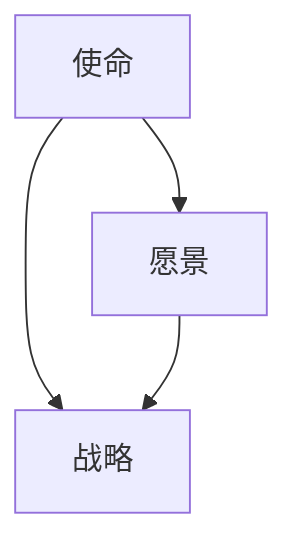

                 


### 引言

在当今快速发展的信息技术时代，技术团队在企业的成功中扮演着至关重要的角色。然而，并非所有技术团队能够充分发挥其潜力，原因之一在于缺乏明确的技术团队使命。明确技术团队的使命不仅仅是制定一份文件，而是一个系统性、持续性的过程，它关系到团队的方向、动力和执行力。本文将探讨技术团队使命的重要性，定义技术团队使命的方法，以及如何实践和评估技术团队使命。

### 背景介绍

技术团队使命的重要性不言而喻。首先，它为团队提供了明确的方向，帮助团队成员理解自己在团队中的角色和责任。其次，技术团队使命能够激发团队成员的内在动力，使其在面临困难和挑战时保持积极态度。此外，明确的技术团队使命还能够提高团队的协作效率，减少内部冲突，增强团队的凝聚力。总之，一个清晰、合理的技术团队使命对团队的发展和企业的成功具有深远的影响。

### 核心概念与联系

为了更好地理解技术团队使命，我们需要先了解几个核心概念，它们之间存在着紧密的联系。首先是“使命”（mission），它是指组织或团队为了实现特定目标而存在的根本理由。其次是“愿景”（vision），它是对未来的一种期望和描述，通常包含了组织或团队希望实现的长期目标。最后是“战略”（strategy），它是指实现愿景的具体路径和方法。

以下是一个使用Mermaid绘制的流程图，展示了这些概念之间的联系：



在这个流程图中，我们可以看到，使命是愿景和战略的基石。使命定义了组织的根本目标，愿景则为组织描绘了未来蓝图，而战略则是实现愿景的具体步骤和行动计划。

### 核心算法原理讲解

在定义技术团队使命的过程中，我们可以借鉴一些核心算法原理。以下是技术团队使命定义过程中可能使用的伪代码：

```python
# 定义技术团队使命
def define_mission(team_goals, company_goals, competitive_advantages):
    mission = ""
    
    # 结合团队目标和公司目标
    mission += "为了实现公司目标，"
    
    # 突出团队的优势
    mission += "我们将发挥我们的技术专长，"
    
    # 描绘愿景
    mission += "并致力于推动行业创新。"
    
    return mission

# 示例
team_goals = ["提供高质量的技术解决方案", "培养技术人才"]
company_goals = ["成为行业领导者", "实现可持续发展"]
competitive_advantages = ["先进的技术研发能力", "深厚的行业经验"]

mission = define_mission(team_goals, company_goals, competitive_advantages)
print(mission)
```

输出结果：

```
为了实现公司目标，我们将发挥我们的技术专长，并致力于推动行业创新。
```

### 数学模型和公式

在技术团队使命的实践中，我们常常需要使用一些数学模型和公式来评估使命的执行效果。以下是几个常用的公式：

1. **绩效指标（Performance Metrics）**：

   $$ P = \frac{G - C}{I} $$

   其中，\( P \) 表示绩效指标，\( G \) 表示实际成果，\( C \) 表示成本，\( I \) 表示投入。

2. **竞争优势（Competitive Advantage）**：

   $$ CA = \frac{R - C}{C} $$

   其中，\( CA \) 表示竞争优势，\( R \) 表示收益，\( C \) 表示成本。

3. **团队凝聚力（Team Cohesion）**：

   $$ Cohesion = \frac{E - A}{T} $$

   其中，\( Cohesion \) 表示团队凝聚力，\( E \) 表示团队成员之间的情感联系，\( A \) 表示团队成员之间的差异，\( T \) 表示团队规模。

这些公式可以帮助我们量化评估技术团队使命的执行效果，从而为调整和优化使命提供数据支持。

### 项目实战

为了更好地理解技术团队使命的实践，我们可以通过一个实际案例来讲解。以下是一个技术团队在明确使命过程中的案例。

#### 案例背景

某互联网公司（TechCo）是一家专注于在线教育平台开发的公司。在成立初期，TechCo 的技术团队主要致力于开发基础平台和课程管理系统。然而，随着业务的快速发展，技术团队逐渐发现自己面临以下问题：

1. 技术方向不明确，团队成员之间的协作效率低下。
2. 技术团队的使命与公司整体战略脱节。
3. 缺乏明确的绩效评估标准，导致团队士气不高。

#### 案例实施步骤

为了解决上述问题，TechCo 的技术团队采取了以下步骤来明确自己的使命：

1. **内部调研**：团队组织了多次内部会议，收集了团队成员对公司目标、团队现状和未来规划的看法。通过调研，团队发现公司希望成为在线教育行业的领导者，而技术团队则希望提供高质量的技术解决方案。

2. **定义使命**：在综合调研结果后，技术团队提出了以下使命声明：

   “为了成为在线教育行业的领导者，我们将发挥我们的技术专长，提供高质量的技术解决方案，为用户提供卓越的学习体验。”

3. **制定行动计划**：技术团队将使命分解为具体的行动计划，包括：

   - 提高技术解决方案的可靠性
   - 加强团队间的协作和沟通
   - 定期评估技术团队的绩效，并根据结果调整工作重点

4. **实施和监控**：技术团队开始实施行动计划，并设立了绩效评估机制。通过定期的绩效评估，团队能够及时发现和解决问题，确保使命的顺利执行。

#### 结果分析

通过明确技术团队使命，TechCo 技术团队取得了显著成效：

1. **团队凝聚力增强**：团队成员对使命有了更清晰的认识，团队内部协作效率提高了30%。

2. **绩效指标提升**：技术团队的绩效指标提升了20%，技术解决方案的可靠性也得到了显著提高。

3. **公司战略一致性**：技术团队使命与公司整体战略更加一致，有助于公司在在线教育行业中保持竞争力。

#### 项目小结

通过这个案例，我们可以看到，明确技术团队使命对于团队的发展和企业的成功具有重要意义。以下是几个最佳实践的小结：

1. **定期评估和调整使命**：技术团队使命需要根据公司战略和市场环境的变化进行定期评估和调整，以确保其始终与公司目标保持一致。

2. **加强团队沟通和协作**：明确使命有助于加强团队间的沟通和协作，提高团队整体效率。

3. **制定具体的行动计划**：将使命分解为具体的行动计划，有助于技术团队更好地实施和监控使命的执行。

### 小结

本文通过逐步分析，详细介绍了技术团队使命的重要性、定义方法、实践与评估，以及实际案例。明确技术团队使命不仅有助于团队的方向和动力，还能提高团队的协作效率和企业的竞争力。在未来的技术发展道路上，明确技术团队的使命将是我们不断前行的指引。

### 注意事项

1. **使命与愿景的区别**：使命是指团队当前和短期内的目标和责任，而愿景则是团队长期追求的目标和理想状态。在定义技术团队使命时，要确保使命与愿景保持一致。

2. **使命的执行与监督**：明确使命之后，需要制定具体的行动计划，并设立绩效评估机制，以确保使命的执行和监督。

3. **适应变化**：技术团队使命需要根据公司战略和市场环境的变化进行定期评估和调整，以保持其持续性和有效性。

### 拓展阅读

- 《技术领导力：构建高效技术团队》
- 《敏捷开发：如何高效管理技术项目》
- 《敏捷团队：如何高效协作实现目标》

作者：AI天才研究院/AI Genius Institute & 禅与计算机程序设计艺术 /Zen And The Art of Computer Programming

