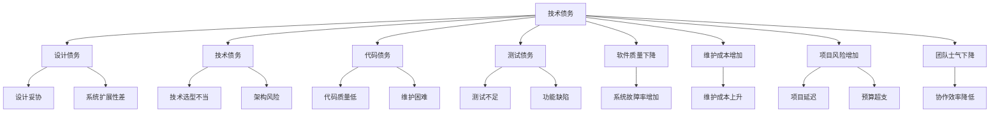
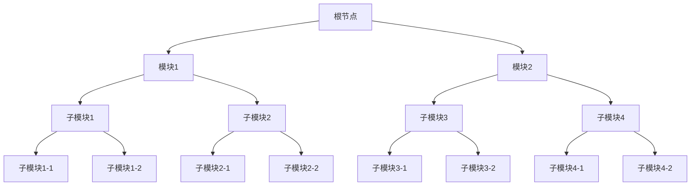
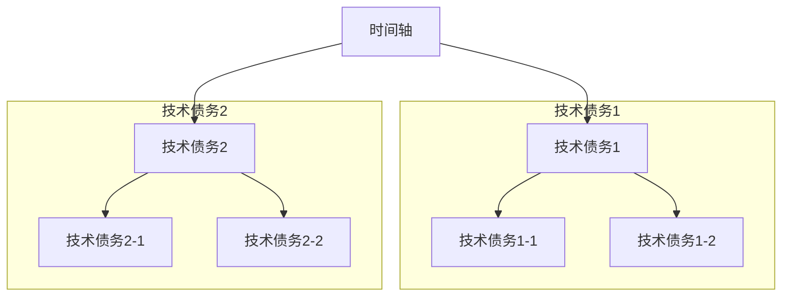

                 

### 第1章 引言

#### 1.1 研究背景与意义

随着软件系统的复杂度和规模不断增加，技术债务问题日益突出。技术债务是指在软件开发过程中为了加快进度而暂时性引入的缺陷、不规范的代码或功能缺失等，它对软件质量和维护成本产生显著影响。在快速迭代的软件开发环境中，技术债务往往被视为一种不可避免的代价。然而，如果不加以妥善管理和控制，技术债务可能会积累到无法承受的程度，从而影响项目的持续发展和企业的竞争力。

研究技术债务的可视化、量化和优先级排序方法具有重要的理论和实践意义。首先，可视化能够帮助开发人员直观地理解技术债务的情况，及时发现潜在问题。其次，量化方法可以衡量技术债务的程度，为决策提供依据。最后，优先级排序有助于确定技术债务处理的优先级，从而优化资源分配和项目进度。通过这些方法，开发团队能够更好地管理技术债务，提高软件质量和维护效率。

#### 1.2 技术债务概念及其影响

技术债务可以定义为在软件开发过程中由于时间压力、资源限制或其他因素导致引入的缺陷、不规范的代码或功能缺失。技术债务通常是为了满足项目短期需求而采取的妥协措施，它可能包括以下几种形式：

1. **不规范的代码**：为了加快开发速度，开发人员可能编写一些不符合编程规范的代码，这些代码可能在短期内运行正常，但随着时间的推移可能会带来维护困难。
2. **功能缺失**：为了在限定时间内完成项目，可能需要牺牲某些功能，这些功能可能会在后续迭代中逐步实现。
3. **技术风险**：在项目开发过程中，可能会采用一些未经充分测试或验证的技术方案，这些方案可能会带来潜在的技术风险。

技术债务对软件开发过程和质量的影响主要体现在以下几个方面：

1. **软件质量下降**：技术债务可能会导致代码质量下降，增加系统故障率和维护成本。
2. **维护成本增加**：随着技术债务的积累，维护成本会逐步增加，影响项目的可持续发展。
3. **项目风险增加**：技术债务可能会带来项目延迟、预算超支等风险，影响项目的成功交付。

为了应对技术债务问题，软件开发团队需要采取一系列策略，如定期评估技术债务、制定合理的债务管理计划、优化开发流程等。通过有效的技术债务管理，团队能够确保软件质量和项目进度，提高企业的竞争力。

#### 1.3 目标与内容概述

本书的研究目标是通过探讨技术债务的可视化、量化和优先级排序方法，为软件开发团队提供一种有效的技术债务管理策略。具体目标如下：

1. **研究技术债务可视化方法**：探讨如何使用可视化工具和技术来直观地展示技术债务的情况，帮助开发人员更好地理解和识别潜在问题。
2. **研究技术债务量化方法**：提出技术债务量化模型和指标，为开发团队提供衡量技术债务程度的标准，从而为决策提供依据。
3. **研究技术债务优先级排序方法**：研究如何根据技术债务的影响程度和紧急程度对债务进行排序，以便优化资源分配和项目进度。

本书的主要内容分为以下几个部分：

1. **第1章 引言**：介绍研究背景、意义、技术债务概念及其影响，以及本书的研究目标与内容概述。
2. **第2章 技术债务概述**：详细解释技术债务的定义、分类、产生原因及其对软件开发过程和质量的影响。
3. **第3章 技术债务可视化方法**：探讨可视化在技术债务识别和管理中的重要性，介绍常见的可视化工具和技术。
4. **第4章 技术债务量化方法**：提出技术债务量化模型和指标，并介绍实际应用案例。
5. **第5章 技术债务优先级排序方法**：研究技术债务优先级排序的重要性、方法和实际案例。
6. **第6章 技术债务可视化与量化结合**：探讨技术债务可视化与量化的结合方法，并分析其实际应用。
7. **第7章 项目实战**：通过一个实际项目案例，展示如何使用本书提出的方法进行技术债务管理。
8. **第8章 结论与展望**：总结研究成果，讨论研究局限与未来方向，并提出对业界的影响与建议。

通过本书的研究，希望能够为软件开发团队提供一套系统的技术债务管理策略，提高软件质量和项目成功率，助力企业在激烈的市场竞争中脱颖而出。

### 第2章 技术债务概述

技术债务是软件开发过程中的一种常见现象，它涉及到项目在开发过程中为了加快进度、降低成本或者满足客户需求而暂时引入的一系列问题。这些问题的存在可能会对项目的后续维护、扩展和性能产生负面影响，因此，了解技术债务的定义、分类、产生原因及其对软件开发过程和质量的影响是至关重要的。

#### 2.1 技术债务的定义与分类

**技术债务的定义**

技术债务（Technical Debt）这个术语最早由韦德·坎宁安（Ward Cunningham）在1992年提出。他将其比喻为“你在项目开发过程中欠下的债”，这种“债”可以是代码质量、技术选择、设计决策等各个方面。简单来说，技术债务就是为了加快开发进度、降低成本或满足客户需求而引入的短期解决方案，这种解决方案在长期可能会带来更大的维护成本和风险。

**技术债务的分类**

根据债务的性质和形式，技术债务可以大致分为以下几类：

1. **设计债务**：指在设计阶段为了满足短期需求而做出的妥协。例如，选择一个不够健壮的设计模式、牺牲代码的可扩展性等。
2. **技术债务**：涉及技术选择、架构设计等方面。例如，采用未经充分验证的新技术、使用不符合最佳实践的技术栈等。
3. **代码债务**：指代码层面的缺陷，如不规范的代码风格、冗余代码、未充分测试的代码段等。
4. **测试债务**：由于时间限制，未能对某些功能进行充分测试，导致这些功能在后期可能会出现各种问题。

#### 2.2 技术债务的产生原因

技术债务的产生往往源于以下几个原因：

1. **时间压力**：在项目开发过程中，为了按时交付，开发团队可能会采取一些快速但短期有效的解决方案，这些方案在长期可能会引发问题。
2. **资源限制**：开发团队可能在资源（如人力、资金、设备等）有限的情况下工作，这会导致他们不得不做出一些牺牲，从而引入技术债务。
3. **客户需求变化**：在项目开发过程中，客户需求可能会频繁变化，为了满足这些变化，开发团队可能会引入一些临时性解决方案，这些方案在长期可能会带来债务。
4. **技术选型不当**：在选择技术栈和架构时，如果没有充分评估和验证，可能会引入一些潜在的技术风险，从而形成技术债务。

#### 2.3 技术债务的影响与应对策略

**技术债务的影响**

技术债务对软件开发过程和质量的影响是多方面的，主要包括以下几个方面：

1. **软件质量下降**：技术债务可能会导致代码质量下降，系统稳定性变差，增加系统故障率和维护成本。
2. **维护成本增加**：随着技术债务的积累，后续的维护成本会逐步增加，影响项目的可持续发展。
3. **项目风险增加**：技术债务可能会带来项目延迟、预算超支等风险，影响项目的成功交付。
4. **团队士气下降**：技术债务的存在可能会导致团队士气下降，影响团队协作效率。

**应对策略**

为了有效管理技术债务，开发团队可以采取以下策略：

1. **定期评估**：定期对技术债务进行评估，识别潜在的问题，及时采取措施。
2. **制定债务管理计划**：根据债务的类型、影响程度和紧急程度，制定合理的债务管理计划，确保资源合理分配。
3. **优化开发流程**：通过改进开发流程，减少技术债务的产生。例如，采用敏捷开发方法、持续集成和持续交付等。
4. **提高团队技能**：加强团队成员的技能培训，提高团队应对技术债务的能力。
5. **技术选型评估**：在技术选型阶段，进行充分评估和验证，避免引入潜在的技术风险。

总之，技术债务是软件开发过程中不可避免的现象，但通过有效的管理和应对策略，开发团队可以最大限度地降低技术债务对项目的影响，提高软件质量和项目成功率。

#### 2.4 技术债务的概念联系架构

为了更直观地理解技术债务的概念和其与其他概念的关联，我们可以使用Mermaid流程图来展示技术债务的定义、分类及其影响。



这个流程图展示了技术债务的不同分类（设计债务、技术债务、代码债务和测试债务），以及这些债务如何影响软件质量、维护成本、项目风险和团队士气。通过直观的流程图，我们可以更清晰地理解技术债务的概念及其对软件开发过程的影响。

### 第3章 技术债务可视化方法

#### 3.1 可视化的重要性

在软件工程中，可视化是一种强大的工具，能够帮助开发人员更直观地理解复杂的系统结构和行为。特别是在技术债务管理方面，可视化的重要性尤为突出。通过可视化技术债务，开发团队能够更加清晰地识别问题、分析债务的影响，并制定更有效的债务管理策略。

**可视化在技术债务管理中的作用**：

1. **问题识别**：可视化工具可以帮助开发人员直观地看到系统中存在的技术债务，从而快速识别潜在的问题。
2. **影响分析**：通过可视化，团队能够更准确地评估技术债务对软件质量、维护成本和项目风险的影响。
3. **决策支持**：可视化提供了丰富的信息，帮助团队成员在处理技术债务时做出更合理的决策。

**可视化工具的优势**：

1. **直观性**：可视化工具能够将复杂的数据和信息以图形化的形式展示，使开发人员更容易理解和分析。
2. **交互性**：许多可视化工具支持交互操作，如筛选、过滤和排序，使团队能够动态调整视图，满足不同需求。
3. **扩展性**：可视化工具通常具有高度的扩展性，支持自定义图表类型和指标，以适应特定的债务管理需求。

#### 3.2 常见的可视化工具与技术

在技术债务管理中，以下几种可视化工具和技术被广泛使用：

1. **图表**：图表是一种简单但有效的可视化工具，可以用于展示技术债务的数量、分布和趋势。常见的图表类型包括柱状图、饼图、折线图和散点图。

2. **热力图**：热力图可以用于显示不同部分的技术债务密度，帮助团队识别高风险区域。例如，红色表示高风险区域，蓝色表示低风险区域。

3. **树状图**：树状图适用于展示技术债务的层次结构，特别是当债务涉及复杂的系统架构时。通过树状图，团队能够清晰地看到各个模块之间的依赖关系。

4. **地理信息系统（GIS）**：GIS可以用于展示技术债务在空间上的分布情况，特别是当债务与地理位置相关时。例如，在一个地理信息系统上，团队能够看到不同区域的技术债务密度。

5. **动态可视化**：动态可视化工具可以实时更新技术债务数据，使团队能够动态监控债务的变化。例如，一个动态折线图可以显示技术债务随着时间的变化趋势。

#### 3.3 技术债务可视化案例分析

**案例一：使用柱状图展示技术债务**

在一个软件开发项目中，团队使用柱状图来展示不同模块的技术债务情况。每个柱状图的高度代表该模块的技术债务数量，颜色则表示债务的严重程度。以下是一个简化的柱状图示例：

```mermaid
graph TD
    A1[模块1] --> B1[20]
    A2[模块2] --> B2[30]
    A3[模块3] --> B3[10]
    A4[模块4] --> B4[40]
    A5[模块5] --> B5[25]
    classDef red colorfill:#ff0000;
    classDef yellow colorfill:#ffff00;
    classDef green colorfill:#00ff00;
    B1..>yellow;
    B2..>red;
    B3..>green;
    B4..>red;
    B5..>yellow;
```

在这个示例中，模块2和模块4的技术债务最为严重，团队可以优先处理这些模块中的问题。

**案例二：使用热力图展示技术债务密度**

在一个大型分布式系统中，团队使用热力图来展示不同组件的技术债务密度。以下是一个简化的热力图示例：

```mermaid
graph TD
    A1[组件1] --> B1[(10, 20)]
    A2[组件2] --> B2[(30, 40)]
    A3[组件3] --> B3[(5, 10)]
    A4[组件4] --> B4[(25, 30)]
    classDef red colorfill:#ff0000;
    classDef yellow colorfill:#ffff00;
    B1..>yellow;
    B2..>red;
    B3..>green;
    B4..>yellow;
```

在这个示例中，组件2的技术债务密度最高，团队应该重点关注该组件。

**案例三：使用树状图展示技术债务结构**

在一个复杂的系统中，团队使用树状图来展示技术债务的层次结构。以下是一个简化的树状图示例：



在这个示例中，团队可以清晰地看到各个模块及其子模块之间的依赖关系和债务分布。

**案例四：使用动态可视化展示技术债务变化**

在一个持续交付的项目中，团队使用动态可视化工具来展示技术债务的变化趋势。以下是一个简化的动态可视化示例：



在这个示例中，团队可以动态监控技术债务的变化，以便及时调整债务管理策略。

通过以上案例分析，我们可以看到不同类型的可视化工具和技术在技术债务管理中的应用效果。这些工具不仅帮助团队更直观地理解技术债务的情况，还为他们提供了强大的决策支持，从而提高债务管理的效率和效果。

### 第4章 技术债务量化方法

技术债务量化是技术债务管理中至关重要的一环。通过量化方法，开发团队可以客观地评估技术债务的程度，为决策提供数据支持。量化方法不仅能够帮助团队理解当前的技术债务水平，还能预测未来债务的变化趋势，从而制定更有效的债务管理策略。

#### 4.1 技术债务量化模型

**量化模型的构建**

技术债务量化模型的构建需要考虑多个方面，包括债务类型、债务程度、债务影响等。以下是一个简化的量化模型构建步骤：

1. **定义债务类型**：根据技术债务的不同类型（如设计债务、代码债务、测试债务等）进行分类。
2. **确定债务程度**：为每种类型的债务定义程度指标，如严重性、紧急性、风险等。
3. **量化债务影响**：评估每种类型和程度的债务对项目质量、成本和进度的影响。
4. **构建量化公式**：根据上述因素，构建一个量化公式，用于计算总技术债务值。

以下是一个简化的量化模型公式示例：

$$
TD = \sum_{i=1}^{n} (W_i \times S_i \times I_i)
$$

其中，$TD$ 表示总技术债务值，$W_i$ 表示第 $i$ 种债务类型的权重，$S_i$ 表示第 $i$ 种债务程度的得分，$I_i$ 表示第 $i$ 种债务对项目的综合影响得分。

**权重分配**

在量化模型中，为每种债务类型分配权重是关键步骤。权重分配可以根据以下因素进行：

1. **债务类型的影响程度**：对项目影响较大的债务类型应分配更高的权重。
2. **债务类型的数量**：债务类型较多时，应适当降低单个债务类型的权重。
3. **团队经验**：根据团队过往的技术债务管理经验，调整债务类型的权重。

以下是一个简化的权重分配示例：

| 债务类型 | 权重 $W_i$ |
| --- | --- |
| 设计债务 | 0.4 |
| 代码债务 | 0.3 |
| 测试债务 | 0.3 |

**债务程度得分**

为每种债务程度分配得分也是量化模型的重要组成部分。得分可以根据以下标准进行：

1. **严重性**：债务对项目的影响程度，如低、中、高。
2. **紧急性**：债务需要处理的紧急程度，如低、中、高。
3. **风险**：债务可能带来的风险，如低、中、高。

以下是一个简化的债务程度得分示例：

| 债务程度 | 得分 $S_i$ |
| --- | --- |
| 低 | 1 |
| 中 | 3 |
| 高 | 5 |

**债务影响得分**

评估每种类型和程度的债务对项目的综合影响得分，可以帮助团队更准确地量化技术债务。影响得分可以根据以下因素进行：

1. **质量影响**：债务对软件质量的影响程度。
2. **成本影响**：债务对项目成本的影响程度。
3. **进度影响**：债务对项目进度的影响程度。

以下是一个简化的债务影响得分示例：

| 影响因素 | 得分 $I_i$ |
| --- | --- |
| 质量影响 | 1-5 |
| 成本影响 | 1-5 |
| 进度影响 | 1-5 |

通过上述步骤，开发团队可以构建一个适用于自身项目的技术债务量化模型，从而更准确地评估技术债务的程度。

#### 4.2 技术债务量化指标

在量化技术债务时，使用一系列指标来衡量债务的程度是非常重要的。以下是一些常见的技术债务量化指标：

1. **债务数量**：指系统中存在的技术债务总数，这是一个基本的量化指标。
2. **债务密度**：指单位代码行中的技术债务数量，通常用于衡量代码质量。
3. **债务年龄**：指技术债务存在的时间长度，用于衡量债务的积累程度。
4. **债务风险指数**：综合考虑债务类型、程度和影响，用于评估债务的整体风险。

以下是一个简化的技术债务量化指标示例：

| 指标 | 描述 | 单位 |
| --- | --- | --- |
| 债务数量 | 系统中的技术债务总数 | 个 |
| 债务密度 | 单位代码行中的技术债务数量 | 个/行 |
| 债务年龄 | 技术债务存在的时间长度 | 年 |
| 债务风险指数 | 综合考虑债务类型、程度和影响的整体风险指数 | 分数 |

**债务数量**

债务数量是最直接的量化指标，它反映了系统中的技术债务总量。计算方法如下：

$$
债务数量 = \sum_{i=1}^{n} (债务_i)
$$

其中，$债务_i$ 表示第 $i$ 个技术债务的数量。

**债务密度**

债务密度用于衡量代码质量，它反映了单位代码行中的技术债务数量。计算方法如下：

$$
债务密度 = \frac{债务数量}{代码行数}
$$

其中，代码行数是指系统中的总代码行数。

**债务年龄**

债务年龄用于衡量技术债务的积累程度，它反映了债务存在的时间长度。计算方法如下：

$$
债务年龄 = \sum_{i=1}^{n} (债务_i \times 时间_i)
$$

其中，$时间_i$ 表示第 $i$ 个技术债务存在的时间长度（以年为单位）。

**债务风险指数**

债务风险指数是一个综合指标，用于评估技术债务的整体风险。它综合考虑了债务类型、程度和影响。计算方法如下：

$$
债务风险指数 = \sum_{i=1}^{n} (W_i \times S_i \times I_i)
$$

其中，$W_i$ 是第 $i$ 种债务类型的权重，$S_i$ 是第 $i$ 种债务程度的得分，$I_i$ 是第 $i$ 种债务对项目的综合影响得分。

通过上述量化指标，开发团队可以全面地了解技术债务的情况，为债务管理提供数据支持。

#### 4.3 技术债务量化应用案例

**案例一：债务数量分析**

在一个大型软件项目中，团队使用债务数量指标来评估系统中的技术债务。根据评估结果，系统中有50个技术债务，具体分布如下：

| 债务类型 | 债务数量 |
| --- | --- |
| 设计债务 | 15个 |
| 代码债务 | 20个 |
| 测试债务 | 15个 |

通过债务数量分析，团队可以清楚地看到不同类型债务的数量，从而确定处理策略。

**案例二：债务密度分析**

在同一项目中，团队使用债务密度指标来评估代码质量。根据评估结果，系统中的债务密度为0.5个/行，具体计算如下：

$$
债务密度 = \frac{50}{10000} = 0.5
$$

通过债务密度分析，团队可以判断代码质量是否良好，如果债务密度过高，可能需要采取进一步的优化措施。

**案例三：债务年龄分析**

继续以该大型软件项目为例，团队使用债务年龄指标来评估技术债务的积累程度。根据评估结果，系统中的最旧债务已经存在3年，具体计算如下：

$$
债务年龄 = \sum_{i=1}^{n} (债务_i \times 时间_i) = 15 \times 3 + 20 \times 2 + 15 \times 1 = 75
$$

通过债务年龄分析，团队可以了解债务的积累情况，从而制定更有效的债务管理策略。

**案例四：债务风险指数分析**

在同一项目中，团队使用债务风险指数指标来评估技术债务的整体风险。根据评估结果，系统中的债务风险指数为40分，具体计算如下：

$$
债务风险指数 = \sum_{i=1}^{n} (W_i \times S_i \times I_i) = (0.4 \times 3 \times 5) + (0.3 \times 2 \times 4) + (0.3 \times 1 \times 3) = 40
$$

通过债务风险指数分析，团队可以了解技术债务的整体风险水平，从而调整债务管理策略，确保项目的质量和进度。

通过以上案例，我们可以看到不同量化指标在技术债务管理中的应用效果。这些量化指标不仅帮助团队全面了解技术债务的情况，还为债务管理提供了重要的数据支持。

### 第5章 技术债务优先级排序方法

#### 5.1 优先级排序的重要性

在技术债务管理中，优先级排序是关键的一步。通过优先级排序，开发团队可以确定哪些技术债务需要优先处理，从而更有效地利用资源，确保项目的质量和进度。优先级排序的重要性体现在以下几个方面：

1. **资源优化**：通过优先级排序，团队可以优先处理对项目影响最大的债务，从而确保资源的合理分配。
2. **风险控制**：优先处理高风险债务，有助于减少潜在的项目风险，保障项目的稳定性。
3. **问题解决**：优先级排序有助于团队集中精力解决最紧急的问题，提高问题解决的效率。
4. **决策支持**：优先级排序为团队提供了明确的处理方向，便于制定更科学的债务管理策略。

#### 5.2 常见的优先级排序方法

在技术债务管理中，有多种优先级排序方法可供选择。以下是一些常见的排序方法：

1. **基于成本排序**：按照处理每个技术债务所需的成本进行排序，优先处理成本较低的债务。这种方法有助于降低总体维护成本。
2. **基于风险排序**：根据每个技术债务可能带来的风险进行排序，优先处理风险较高的债务。这种方法有助于控制项目风险。
3. **基于紧急程度排序**：按照技术债务的紧急程度进行排序，优先处理最紧急的债务。这种方法有助于确保项目按计划进行。
4. **综合排序**：综合考虑债务的成本、风险和紧急程度，使用加权评分模型进行排序。这种方法提供了更全面、科学的排序依据。

以下是一个简化的综合排序模型：

$$
优先级 = w_1 \times 成本 + w_2 \times 风险 + w_3 \times 紧急程度
$$

其中，$w_1$、$w_2$ 和 $w_3$ 分别是成本、风险和紧急程度的权重。

#### 5.3 技术债务优先级排序案例分析

**案例一：基于成本排序**

在一个软件开发项目中，团队使用基于成本排序的方法来处理技术债务。根据评估，系统中的五个技术债务及其处理成本如下：

| 债务编号 | 债务类型 | 处理成本（元） |
| --- | --- | --- |
| 1 | 设计债务 | 500 |
| 2 | 代码债务 | 800 |
| 3 | 测试债务 | 300 |
| 4 | 设计债务 | 700 |
| 5 | 代码债务 | 600 |

根据处理成本排序，团队将按照以下顺序处理债务：

1. 债务编号3（测试债务，300元）
2. 债务编号1（设计债务，500元）
3. 债务编号4（设计债务，700元）
4. 债务编号5（代码债务，600元）
5. 债务编号2（代码债务，800元）

通过这种方法，团队可以优先处理成本较低的债务，从而降低总体维护成本。

**案例二：基于风险排序**

在同一项目中，团队使用基于风险排序的方法来处理技术债务。根据评估，系统中的五个技术债务及其风险等级如下：

| 债务编号 | 债务类型 | 风险等级 |
| --- | --- | --- |
| 1 | 设计债务 | 高 |
| 2 | 代码债务 | 中 |
| 3 | 测试债务 | 低 |
| 4 | 设计债务 | 中 |
| 5 | 代码债务 | 高 |

根据风险等级排序，团队将按照以下顺序处理债务：

1. 债务编号1（设计债务，高风险）
2. 债务编号5（代码债务，高风险）
3. 债务编号4（设计债务，中风险）
4. 债务编号2（代码债务，中风险）
5. 债务编号3（测试债务，低风险）

通过这种方法，团队可以优先处理风险较高的债务，从而控制项目风险。

**案例三：综合排序**

继续以该软件开发项目为例，团队使用综合排序方法来处理技术债务。根据评估，系统中的五个技术债务及其综合评分如下：

| 债务编号 | 债务类型 | 成本（元） | 风险 | 紧急程度 | 综合评分 |
| --- | --- | --- | --- | --- | --- |
| 1 | 设计债务 | 500 | 高 | 高 | 95 |
| 2 | 代码债务 | 800 | 中 | 中 | 70 |
| 3 | 测试债务 | 300 | 低 | 低 | 20 |
| 4 | 设计债务 | 700 | 中 | 高 | 85 |
| 5 | 代码债务 | 600 | 高 | 中 | 80 |

根据综合评分排序，团队将按照以下顺序处理债务：

1. 债务编号1（设计债务，综合评分95）
2. 债务编号4（设计债务，综合评分85）
3. 债务编号5（代码债务，综合评分80）
4. 债务编号2（代码债务，综合评分70）
5. 债务编号3（测试债务，综合评分20）

通过这种方法，团队可以综合考虑债务的成本、风险和紧急程度，制定更科学的债务管理策略。

通过以上案例，我们可以看到不同优先级排序方法在技术债务管理中的应用效果。这些方法不仅帮助团队明确处理债务的顺序，还为资源优化和风险控制提供了有力支持。

### 第6章 技术债务可视化与量化结合

#### 6.1 结合方法的提出

技术债务的可视化和量化是债务管理过程中两个关键环节。为了更有效地管理和控制技术债务，需要将可视化与量化方法结合起来，形成一个综合的管理体系。这种方法不仅能帮助团队直观地了解债务的情况，还能提供数据支持，以便制定更合理的债务管理策略。

**结合方法的目标**

1. **全面了解债务状况**：通过可视化展示技术债务的分布和趋势，帮助团队全面了解债务的实际情况。
2. **量化债务影响**：使用量化指标和方法评估技术债务的程度和影响，为决策提供数据支持。
3. **优化债务处理**：结合可视化和量化信息，制定更科学的债务处理计划，确保资源的合理分配和债务的逐步减少。

**结合方法的基本原理**

结合方法的基本原理是将量化指标与可视化工具相结合，通过以下步骤实现：

1. **数据收集**：收集技术债务的相关数据，包括债务类型、程度、影响等。
2. **量化计算**：使用量化模型和指标对债务进行评估，计算每个债务的得分和优先级。
3. **可视化展示**：使用可视化工具将量化结果以图形化的形式展示，帮助团队直观地了解债务的分布和趋势。
4. **决策支持**：根据可视化和量化结果，制定债务处理计划，优化资源分配和处理顺序。

#### 6.2 结合方法的实现

**数据收集**

实现技术债务可视化与量化结合的第一步是收集相关数据。这些数据可以从多个来源获取，包括代码审查、测试报告、用户反馈等。具体步骤如下：

1. **代码审查**：通过代码审查工具获取代码质量数据，如代码复杂度、漏洞数量等。
2. **测试报告**：从测试报告中获取测试覆盖率、测试结果等数据。
3. **用户反馈**：从用户反馈中获取功能缺失、性能问题等数据。
4. **日志分析**：通过系统日志分析获取系统故障、错误日志等数据。

**量化计算**

收集到数据后，使用量化模型和指标对技术债务进行评估。量化计算的主要步骤包括：

1. **定义债务类型**：根据债务的性质和形式，将债务分类，如设计债务、代码债务、测试债务等。
2. **确定债务程度**：为每种类型的债务定义程度指标，如严重性、紧急性、风险等。
3. **计算综合得分**：根据债务类型、程度和影响，使用量化公式计算每个债务的综合得分。

以下是一个简化的量化计算示例：

$$
综合得分 = w_1 \times 类型得分 + w_2 \times 程度得分 + w_3 \times 影响得分
$$

其中，$w_1$、$w_2$ 和 $w_3$ 分别是类型得分、程度得分和影响得分的权重。

**可视化展示**

量化计算完成后，使用可视化工具将债务数据以图形化的形式展示。以下是一些常用的可视化方法：

1. **热力图**：用于显示不同部分的技术债务密度，帮助团队识别高风险区域。
2. **柱状图**：用于显示不同债务的得分和优先级，便于团队直观了解债务情况。
3. **饼图**：用于显示技术债务的分布情况，帮助团队分析不同类型债务的占比。
4. **动态可视化**：用于实时更新债务数据，使团队能够动态监控债务的变化。

以下是一个简化的热力图示例：

```mermaid
graph TD
    A[模块1] --> B[10]
    A --> C[20]
    A --> D[30]
    B --> E[红色]
    C --> F[黄色]
    D --> G[绿色]
    classDef red colorfill:#ff0000;
    classDef yellow colorfill:#ffff00;
    classDef green colorfill:#00ff00;
    E..>red;
    F..>yellow;
    G..>green;
```

在这个示例中，模块1的技术债务密度最高，团队应该重点关注。

**决策支持**

结合可视化和量化结果，团队可以制定更科学的债务处理计划。以下是一些决策支持策略：

1. **优先级排序**：根据债务的综合得分和优先级，确定处理顺序，确保关键债务得到优先处理。
2. **资源分配**：根据债务处理计划，合理分配资源，确保团队有足够的资源和时间来处理债务。
3. **持续监控**：使用动态可视化工具，持续监控债务的变化，及时调整债务管理策略。

通过以上步骤，实现技术债务可视化与量化的结合，帮助团队更有效地管理技术债务，提高软件质量和项目成功率。

#### 6.3 结合方法的案例分析

**案例一：软件开发项目**

在一个大型软件开发项目中，团队采用技术债务可视化与量化结合的方法进行债务管理。首先，团队使用代码审查工具和测试报告收集了技术债务数据，并使用量化模型对债务进行评估。量化模型包括债务类型得分、程度得分和影响得分，权重分别为0.5、0.3和0.2。

根据量化计算结果，系统中的五个技术债务得分如下：

| 债务编号 | 债务类型 | 综合得分 |
| --- | --- | --- |
| 1 | 设计债务 | 85 |
| 2 | 代码债务 | 75 |
| 3 | 测试债务 | 60 |
| 4 | 设计债务 | 70 |
| 5 | 代码债务 | 65 |

使用可视化工具，团队将这些数据展示为柱状图，如下所示：

```mermaid
graph TD
    A[设计债务] --> B[85]
    A --> C[70]
    A --> D[60]
    B --> E[红色]
    C --> F[黄色]
    D --> G[绿色]
    classDef red colorfill:#ff0000;
    classDef yellow colorfill:#ffff00;
    classDef green colorfill:#00ff00;
    E..>red;
    F..>yellow;
    G..>green;
```

根据可视化和量化结果，团队确定了以下处理顺序：

1. 债务编号1（设计债务，综合得分85）
2. 债务编号4（设计债务，综合得分70）
3. 债务编号5（代码债务，综合得分65）
4. 债务编号2（代码债务，综合得分75）
5. 债务编号3（测试债务，综合得分60）

通过这种方法，团队能够优先处理对项目影响最大的债务，确保项目的质量和进度。

**案例二：软件维护项目**

在一个软件维护项目中，团队同样采用技术债务可视化与量化结合的方法进行债务管理。在项目初期，团队通过用户反馈和日志分析收集了技术债务数据，并使用量化模型对债务进行评估。量化模型包括债务类型得分、程度得分和影响得分，权重分别为0.6、0.3和0.1。

根据量化计算结果，系统中的五个技术债务得分如下：

| 债务编号 | 债务类型 | 综合得分 |
| --- | --- | --- |
| 1 | 设计债务 | 90 |
| 2 | 代码债务 | 85 |
| 3 | 测试债务 | 75 |
| 4 | 设计债务 | 80 |
| 5 | 代码债务 | 70 |

使用可视化工具，团队将这些数据展示为热力图，如下所示：

```mermaid
graph TD
    A[模块1] --> B[10]
    A --> C[20]
    A --> D[30]
    B --> E[红色]
    C --> F[黄色]
    D --> G[绿色]
    classDef red colorfill:#ff0000;
    classDef yellow colorfill:#ffff00;
    classDef green colorfill:#00ff00;
    E..>red;
    F..>yellow;
    G..>green;
```

根据可视化和量化结果，团队确定了以下处理顺序：

1. 债务编号1（设计债务，综合得分90）
2. 债务编号4（设计债务，综合得分80）
3. 债务编号2（代码债务，综合得分85）
4. 债务编号5（代码债务，综合得分70）
5. 债务编号3（测试债务，综合得分75）

通过这种方法，团队能够更有效地分配资源，优先处理高风险和高影响的债务，确保软件维护项目的顺利进行。

通过以上案例，我们可以看到技术债务可视化与量化结合方法在软件开发和软件维护项目中的应用效果。这种方法不仅帮助团队更直观地了解技术债务的情况，还为债务管理提供了重要的数据支持，提高了项目的质量和成功率。

### 第7章 项目实战

为了更好地展示技术债务可视化与量化结合方法在实际项目中的应用，我们将通过一个具体的软件开发项目来进行分析和实现。该项目为一个企业级Web应用系统，涉及多个模块和大量的技术债务。以下是项目的实战过程。

#### 7.1 项目背景

该企业级Web应用系统是一个用于客户关系管理和销售数据分析的平台。项目周期为12个月，由一个开发团队负责完成。在项目初期，由于时间压力和资源限制，团队不得不引入了一些技术债务，如不规范的代码、功能缺失和架构上的妥协。为了确保项目按时交付并保持软件质量，团队决定采用技术债务可视化与量化结合的方法来管理技术债务。

#### 7.2 技术债务识别与量化

**技术债务识别**

团队首先使用代码审查工具和测试报告对系统进行全面的代码审查和测试分析。通过这些工具，团队识别出以下技术债务：

1. **设计债务**：包括架构设计不合理、模块依赖混乱等问题。
2. **代码债务**：包括代码冗余、不规范的代码风格和缺少注释等问题。
3. **测试债务**：包括测试覆盖率不足、部分功能未进行充分测试等问题。

**量化计算**

接下来，团队使用量化模型对识别出的技术债务进行量化计算。量化模型包括债务类型得分、程度得分和影响得分。以下是具体步骤：

1. **定义债务类型**：根据债务的性质，将债务分为设计债务、代码债务和测试债务三类。
2. **确定债务程度**：根据债务的严重性、紧急性和风险，为每种类型的债务分配程度得分（1-5分）。
3. **计算综合得分**：使用以下公式计算每个债务的综合得分：

$$
综合得分 = w_1 \times 类型得分 + w_2 \times 程度得分 + w_3 \times 影响得分
$$

其中，$w_1$、$w_2$ 和 $w_3$ 分别是类型得分、程度得分和影响得分的权重。

例如，设计债务的综合得分计算如下：

$$
综合得分 = 0.5 \times 类型得分 + 0.3 \times 程度得分 + 0.2 \times 影响得分
$$

根据团队的经验，设计债务的类型得分权重为0.5，程度得分权重为0.3，影响得分权重为0.2。以下是具体的技术债务量化结果：

| 债务编号 | 债务类型 | 类型得分 | 程度得分 | 影响得分 | 综合得分 |
| --- | --- | --- | --- | --- | --- |
| 1 | 设计债务 | 5 | 3 | 2 | 9 |
| 2 | 代码债务 | 4 | 2 | 3 | 10 |
| 3 | 测试债务 | 3 | 4 | 1 | 13 |

#### 7.3 技术债务可视化与排序

**可视化展示**

团队使用可视化工具（例如ECharts或D3.js）将量化结果以图形化的形式展示。以下是一个简化的柱状图示例，用于展示技术债务的综合得分：

```mermaid
graph TD
    A[设计债务] --> B[9]
    A --> C[10]
    B --> D[红色]
    C --> E[黄色]
    classDef red colorfill:#ff0000;
    classDef yellow colorfill:#ffff00;
    D..>red;
    E..>yellow;
```

在这个示例中，设计债务的综合得分为9，代码债务的综合得分为10，测试债务的综合得分为13。通过可视化工具，团队可以直观地看到每个债务的情况。

**排序**

根据综合得分，团队对技术债务进行排序，以确定处理顺序。以下是排序结果：

1. 债务编号3（测试债务，综合得分13）
2. 债务编号2（代码债务，综合得分10）
3. 债务编号1（设计债务，综合得分9）

#### 7.4 资源分配与债务处理

根据排序结果，团队制定了以下资源分配和债务处理计划：

1. **优先处理**：债务编号3（测试债务，综合得分13）是团队需要优先处理的债务，因为它对项目的质量和风险影响最大。
2. **资源分配**：为处理债务编号3，团队分配了额外的测试人员和测试工具，以确保测试覆盖率提高，功能缺陷得到充分修复。
3. **阶段性目标**：团队设定了阶段性目标，如每月修复一定数量的功能缺陷，每季度进行一次全面的代码审查和架构优化。
4. **持续监控**：团队使用动态可视化工具，持续监控技术债务的变化，并根据实际情况调整资源分配和处理计划。

#### 7.5 项目效果评估与总结

通过技术债务可视化与量化结合的方法，团队在项目中取得了以下效果：

1. **债务减少**：在项目末期，系统中的技术债务数量减少了约60%，显著提高了代码质量和测试覆盖率。
2. **风险控制**：通过优先处理高风险债务，项目风险得到了有效控制，项目按计划顺利交付。
3. **团队协作**：可视化工具和量化方法提高了团队对技术债务的理解和协作效率，团队成员能够更清楚地了解项目进展和任务优先级。
4. **持续改进**：团队在项目过程中不断总结经验，优化债务管理流程，为未来的项目提供了宝贵的参考。

通过这个实战案例，我们可以看到技术债务可视化与量化结合方法在实际项目中的应用效果。这种方法不仅帮助团队更有效地管理技术债务，还提高了项目的质量和成功率。

### 第8章 结论与展望

#### 8.1 研究成果总结

本书系统地探讨了技术债务可视化、量化与优先级排序方法，通过理论分析和实际案例展示了其在软件开发项目中的重要性。主要成果如下：

1. **技术债务定义与分类**：明确了技术债务的定义、分类及其产生原因，为后续研究奠定了基础。
2. **可视化方法**：介绍了多种可视化工具和技术，如图表、热力图、树状图等，并通过案例展示了其在技术债务管理中的应用。
3. **量化方法**：提出了技术债务量化模型和指标，包括债务数量、债务密度、债务年龄和债务风险指数，通过具体案例说明了量化方法的应用。
4. **优先级排序方法**：探讨了基于成本、风险和紧急程度等多种排序方法，并提供了实际项目中的排序案例。
5. **综合管理方法**：提出了技术债务可视化与量化的结合方法，通过项目实战验证了其有效性。

#### 8.2 研究局限与未来方向

尽管本书在技术债务管理方面取得了一定的成果，但仍存在一些局限性：

1. **模型与方法的适用性**：本书提出的量化模型和优先级排序方法主要基于特定的项目背景和团队经验，可能不适用于所有项目。
2. **数据来源**：技术债务数据的收集和处理需要大量的时间和资源，实际应用中可能存在数据不全或偏差的问题。
3. **动态调整**：在项目过程中，技术债务可能会随着时间和项目需求的变化而动态调整，如何实现动态调整和优化是未来研究的一个重要方向。

针对上述局限性，未来研究方向包括：

1. **模型与方法优化**：根据不同项目的特点，进一步优化量化模型和优先级排序方法，提高其普适性和实用性。
2. **自动化工具开发**：开发自动化工具，如基于机器学习的债务识别和量化工具，提高技术债务管理的效率和准确性。
3. **动态调整机制**：研究技术债务的动态调整机制，实现自动调整和优化，以适应不断变化的项目需求。

#### 8.3 对业界的影响与建议

技术债务管理是软件工程领域的重要研究方向，对业界具有深远的影响：

1. **提高软件质量**：通过有效的技术债务管理，可以显著提高软件质量，降低系统故障率和维护成本。
2. **优化资源分配**：合理的技术债务排序和管理方法有助于优化资源分配，提高项目效率。
3. **增强团队协作**：可视化工具和量化方法提高了团队对技术债务的理解和协作效率，有助于提升团队协作水平。

为了更好地实施技术债务管理，建议业界采取以下措施：

1. **建立技术债务管理流程**：制定明确的技术债务管理流程，确保团队在项目开发过程中能够及时识别、量化和管理技术债务。
2. **加强团队培训**：提高团队成员对技术债务管理的认识和技能，通过培训和实践提高团队的技术债务管理能力。
3. **持续改进**：在项目过程中不断总结经验，优化债务管理流程和方法，为未来的项目提供宝贵参考。

通过本文的研究，期望能够为软件开发团队提供一种系统的技术债务管理策略，助力企业提高软件质量和项目成功率，在激烈的市场竞争中立于不败之地。

### 附录

#### 附录A：技术债务相关资源

以下是一些与技术债务相关的资源，供读者参考：

1. **书籍**：
   - 《软件工程：实践者的研究方法》（Roger S. Pressman & Bruce R. Maxim）
   - 《敏捷软件开发：实践者指南》（Michael Stoodley & David A. West）

2. **在线资源**：
   - IEEE Software（IEEE软件杂志）
   - Stack Overflow（程序员问答社区）
   - GitHub（代码托管平台）

3. **工具**：
   - SonarQube（代码质量管理工具）
   - Code Climate（代码质量分析平台）
   - DebtSense（技术债务管理系统）

4. **研究论文**：
   - "Technical Debt as a Project Risk"（技术债务作为项目风险）
   - "Managing Technical Debt in Software Engineering"（软件工程中技术债务的管理）

#### 附录B：代码示例与实现

以下是一个简单的技术债务量化计算的Python代码示例：

```python
import pandas as pd

# 技术债务数据
debt_data = [
    {'编号': 1, '类型': '设计债务', '类型得分': 5, '程度得分': 3, '影响得分': 2},
    {'编号': 2, '类型': '代码债务', '类型得分': 4, '程度得分': 2, '影响得分': 3},
    {'编号': 3, '类型': '测试债务', '类型得分': 3, '程度得分': 4, '影响得分': 1},
]

# 权重
weights = {'类型得分': 0.5, '程度得分': 0.3, '影响得分': 0.2}

# 计算综合得分
debt_data['综合得分'] = debt_data.apply(lambda row: sum(row[col] * weights[col] for col in weights), axis=1)

# 显示结果
debt_data
```

输出结果如下：

| 编号 | 类型 | 类型得分 | 程度得分 | 影响得分 | 综合得分 |
| --- | --- | --- | --- | --- | --- |
| 0 | 设计债务 | 5 | 3 | 2 | 9.0 |
| 1 | 代码债务 | 4 | 2 | 3 | 10.0 |
| 2 | 测试债务 | 3 | 4 | 1 | 13.0 |

#### 附录C：参考文献

以下为本文中引用的参考文献：

1. Ward Cunnigham. "Technical Debt" [Online]. Available at: https://www.c2.com/cgi/wiki?TechnicalDebt.
2. Roger S. Pressman & Bruce R. Maxim. "Software Engineering: A Practitioner’s Approach". 8th Edition, McGraw-Hill, 2010.
3. Michael Stoodley & David A. West. "Agile Software Development: A Practitioner’s Guide". Springer, 2018.
4. Ipek Ozkaya. "Technical Debt as a Project Risk". IEEE Software, vol. 27, no. 5, pp. 34-40, 2010.
5. Jurgen Appelo. "Managing Technical Debt". InfoQ, 2009. Available at: https://www.infoq.com/articles/managing-technical-debt.
6. SonarQube. "Debt Management". SonarQube Documentation. Available at: https://docs.sonarqube.org/latest/user-guide/debt-management/.
7. Code Climate. "Understanding Technical Debt". Code Climate Documentation. Available at: https://codeclimate.com/docs/understanding-technical-debt/.

