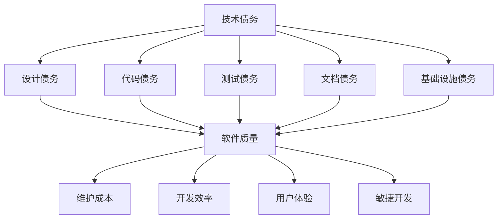

                 

### 背景介绍

技术债务（Technical Debt）这一概念源自软件工程领域，比喻为欠下的债务，用以描述因快速交付软件而未能采用最佳实践或技术方案所累积的问题。技术债务不仅限于代码层面的缺陷，还涵盖了设计缺陷、架构问题、维护成本等方面。随着时间的推移，未偿还的技术债务会逐渐积累，可能导致系统性能下降、维护成本增加、开发效率降低，甚至影响项目的长期健康发展。

然而，技术债务并非完全负面的概念。在一定情况下，适度的技术债务有助于快速响应市场需求，加快软件迭代速度，提高企业竞争力。但过度积累的技术债务则会成为企业发展的绊脚石。因此，如何科学地管理技术债务，使其发挥积极作用，同时避免负面影响，成为企业和开发团队亟需解决的问题。

近年来，随着技术的快速发展，尤其是云计算、大数据、人工智能等新兴技术的广泛应用，技术债务问题愈发凸显。一方面，这些新技术为企业提供了新的发展机遇，但同时也带来了新的挑战，如技术选型、架构设计、数据处理等方面。另一方面，企业在追求快速创新的过程中，往往忽视了技术债务的管理，导致问题逐渐积累。因此，寻找有效的技术债务可视化方法，让隐藏的问题变得显而易见，已成为当前企业面临的紧迫任务。

本文旨在探讨技术债务可视化这一主题，通过系统地介绍技术债务的概念、识别与评估方法，以及管理与优化策略，帮助企业和开发团队更好地理解和应对技术债务问题。同时，本文将结合实际案例，分析技术债务可视化的具体应用和实践技巧，为读者提供有价值的参考。

### 核心概念与联系

为了更好地理解技术债务的概念及其影响，我们首先需要明确几个核心概念，并探讨它们之间的关系架构。以下是技术债务相关的一些核心概念及其相互关系：

1. **技术债务（Technical Debt）**
   技术债务指的是在软件开发过程中，因追求短期利益而采取次优技术决策所累积的问题。这些问题可能包括代码缺陷、设计不合理、架构不健全等。技术债务的概念来源于金融领域中的“债务”，比喻为软件开发过程中未能按最佳实践实施的“欠账”。

2. **技术债务类别**
   根据技术债务的来源和性质，可以分为以下几类：
   - **设计债务**：设计层面的问题，如过度设计、不合理的架构等。
   - **代码债务**：代码层面的缺陷，如重复代码、代码可读性差、代码质量不高。
   - **测试债务**：测试不足或测试质量不高导致的潜在问题。
   - **文档债务**：文档不完整或不准确，影响维护和开发。
   - **基础设施债务**：基础设施层面的问题，如服务器配置不合理、网络延迟等。

3. **技术债务与软件质量**
   技术债务与软件质量密切相关。技术债务积累会导致软件质量下降，进而影响用户体验和业务价值。具体来说：
   - **维护成本增加**：随着技术债务的积累，软件的维护成本会逐渐增加。因为解决遗留问题的代价往往比当初产生这些问题时更高。
   - **开发效率降低**：技术债务会影响开发效率，导致项目延期、预算超支。
   - **用户体验下降**：软件质量问题直接影响用户体验，降低用户满意度和留存率。

4. **技术债务与敏捷开发**
   敏捷开发强调快速迭代和持续交付，与传统的瀑布开发模式相比，更注重应对变化和客户需求。然而，敏捷开发模式下，技术债务管理尤为重要。因为敏捷开发过程中频繁的迭代和变更，可能会导致技术债务的快速积累。因此，在敏捷开发中，需要更加注重技术债务的管理和优化。

为了直观地展示这些核心概念之间的关系，我们可以使用 Mermaid 流程图进行描述：



通过这个流程图，我们可以清晰地看到技术债务与各类债务、软件质量、敏捷开发之间的紧密联系。理解这些核心概念及其关系，有助于我们更好地把握技术债务的本质，从而采取有效的管理策略。

### 技术债务的评估方法

评估技术债务是管理和优化技术债务的关键步骤。通过科学的方法和工具，可以全面了解技术债务的现状，为后续的管理和优化提供依据。以下是一些常见的技术债务评估方法：

1. **自评估法**

自评估法是指由开发团队或相关技术人员自行评估技术债务的方法。这种方法简单直接，成本低，但需要团队成员具有较高的专业知识和经验。具体步骤如下：

   - **列出问题清单**：首先，团队成员需要列出当前系统中存在的所有技术债务问题，包括代码缺陷、设计不合理、测试不足等。
   - **分类与优先级排序**：将列出的问题进行分类，并按照严重程度和影响范围进行优先级排序。通常，影响范围大、严重程度高的问题应优先解决。
   - **自评估打分**：为每个问题设定评分标准，通常采用0到10分的评分体系，得分越高，问题越严重。团队成员根据评分标准，为每个问题打分。
   - **汇总评估结果**：将所有成员的评估结果汇总，形成整体的技术债务评估报告。

2. **问卷调查法**

问卷调查法是通过发放问卷，收集开发团队和利益相关者的意见，从而评估技术债务的方法。这种方法适用于大型团队或跨部门协作的项目。具体步骤如下：

   - **设计问卷**：设计一份包含技术债务相关问题的问卷，确保问题覆盖全面，包括代码质量、设计合理性、测试覆盖率等。
   - **发放问卷**：将问卷发放给团队成员和其他利益相关者，可以通过线上或线下方式收集反馈。
   - **统计分析**：对收集到的问卷数据进行分析，识别出普遍存在的问题和严重程度。
   - **报告反馈**：根据分析结果，形成技术债务评估报告，并向团队成员和利益相关者反馈。

3. **自动化评估工具**

自动化评估工具是利用软件工具自动识别和评估技术债务的方法。这些工具通常具有以下功能：

   - **静态代码分析**：通过分析代码的结构、语法和风格，识别潜在的技术债务问题，如代码冗余、不符合最佳实践等。
   - **动态代码分析**：在代码执行过程中，监测代码的性能和稳定性，识别运行时可能出现的问题。
   - **测试覆盖率分析**：分析测试用例的覆盖范围，识别未覆盖到的代码区域，从而评估测试债务。
   - **依赖关系分析**：分析代码中的外部依赖，识别可能导致技术债务的第三方库或框架。

常见的技术债务自动化评估工具包括SonarQube、Code Climate、Checkmarx等。以下是使用这些工具进行技术债务评估的一般步骤：

   - **安装和配置**：根据项目需求，安装并配置相应的自动化评估工具。
   - **集成到开发流程**：将评估工具集成到持续集成（CI）系统中，确保每次代码提交都会触发评估。
   - **定期运行评估**：定期运行评估工具，生成评估报告。
   - **问题追踪和修复**：根据评估报告，识别出的问题进行追踪和修复。

4. **综合评估方法**

在实际应用中，单一评估方法可能无法全面反映技术债务的现状。因此，可以采用综合评估方法，结合多种评估手段，提高评估结果的准确性和全面性。具体步骤如下：

   - **确定评估指标**：根据项目特点和技术债务类型，确定需要评估的指标，如代码质量、设计合理性、测试覆盖率等。
   - **选择评估方法**：根据评估指标，选择合适的评估方法，如自评估法、问卷调查法和自动化评估工具等。
   - **执行评估过程**：按照选定的评估方法，执行评估过程，收集相关数据。
   - **综合分析结果**：将不同评估方法的结果进行综合分析，形成全面的技术债务评估报告。

通过以上评估方法，企业和开发团队可以全面了解技术债务的现状，为后续的管理和优化提供数据支持。需要注意的是，技术债务评估是一个持续的过程，需要定期进行，以确保技术债务始终处于可控状态。

### 技术债务的管理策略

技术债务的管理是确保软件系统健康发展的关键环节。科学合理的管理策略能够有效减轻技术债务带来的负面影响，提高软件质量和开发效率。以下是一些常见的技术债务管理策略：

1. **预防性管理**

预防性管理是指在软件开发过程中，通过采取一系列措施，预防技术债务的产生。这种方法的核心思想是“防患于未然”，避免因追求短期利益而牺牲长期健康。以下是一些预防性管理的具体措施：

   - **编码规范**：制定并严格执行编码规范，确保代码风格一致、可读性强。这有助于减少代码债务。
   - **设计评审**：在软件设计阶段进行评审，确保设计方案合理、符合最佳实践。设计评审有助于发现和预防设计债务。
   - **测试覆盖**：提高测试覆盖率，确保代码的每个部分都经过充分的测试。这有助于降低测试债务。
   - **持续集成**：实施持续集成（CI）流程，确保每次代码提交都会触发自动化测试和评估。持续集成有助于及时发现和解决潜在的技术债务问题。

2. **早期修复策略**

早期修复策略是指在技术债务问题初现时，及时进行修复，避免问题累积和扩大。这种方法的核心思想是“及时补救”，通过快速响应和修复，将技术债务控制在最小范围。以下是一些早期修复策略的具体措施：

   - **缺陷管理**：建立完善的缺陷管理流程，确保每个缺陷都能及时记录、追踪和修复。缺陷管理有助于减少代码债务和测试债务。
   - **代码审查**：实施代码审查（Code Review）机制，通过集体智慧和经验，发现和修复代码中的潜在问题。代码审查是预防代码债务积累的重要手段。
   - **技术债务跟踪**：使用技术债务跟踪工具，对技术债务进行实时监控和记录。这有助于团队了解技术债务的现状，及时采取修复措施。

3. **定期优化**

定期优化策略是指定期对技术债务进行系统性评估和优化，确保技术债务始终处于可控状态。这种方法的核心思想是“持续改进”，通过定期的评估和优化，逐步减轻技术债务的负担。以下是一些定期优化的具体措施：

   - **技术债务审计**：定期进行技术债务审计，全面评估技术债务的现状和影响。技术债务审计有助于发现和解决潜在的技术债务问题。
   - **重构**：对系统中存在的技术债务进行重构，优化代码结构和设计，提高代码质量和可维护性。重构是减轻技术债务的重要手段。
   - **技术债务回顾**：在项目开发和维护过程中，定期进行技术债务回顾，总结和分享技术债务管理的经验和教训，提高团队的技术债务管理能力。

4. **敏捷管理**

敏捷管理是将敏捷开发方法应用于技术债务管理，通过快速迭代和持续交付，确保技术债务始终处于可控状态。这种方法的核心思想是“快速响应”，通过敏捷开发，及时应对变化和需求，减少技术债务的积累。以下是一些敏捷管理的具体措施：

   - **迭代规划**：在每次迭代开始时，对技术债务进行评估，确定优先级，并纳入迭代计划。这有助于确保技术债务的修复和优化与开发工作同步进行。
   - **迭代回顾**：在每次迭代结束时，进行技术债务回顾，总结和分享技术债务管理中的问题和经验，为下一轮迭代提供改进方向。
   - **持续交付**：通过持续交付（Continuous Delivery），确保每次迭代结束后，都能快速交付新的功能和改进，减少技术债务的积累。

5. **最佳实践**

在技术债务管理过程中，遵循最佳实践可以显著提高管理效果。以下是一些最佳实践：

   - **团队协作**：建立高效的团队协作机制，确保所有成员都了解技术债务的现状和管理策略，共同参与技术债务的修复和优化。
   - **技术培训**：定期进行技术培训，提高团队成员的技术水平和专业能力，减少因技术不足导致的技术债务。
   - **文档管理**：加强文档管理，确保技术债务的记录和跟踪信息准确、完整，便于后续评估和优化。

通过上述管理策略，企业和开发团队可以更好地应对技术债务问题，确保软件系统的健康发展和持续优化。需要注意的是，技术债务管理是一个动态的过程，需要根据实际情况不断调整和完善管理策略。

### 技术债务优化技术

在技术债务管理过程中，优化技术债务是关键的一环。通过采用一系列优化技术和方法，可以有效地减轻技术债务的负担，提高软件系统的质量和性能。以下是一些常见的技术债务优化技术：

1. **重构（Refactoring）**

重构是指在不改变程序功能的前提下，对其内部结构进行改进，以提高代码的可读性、可维护性和可扩展性。通过重构，可以消除代码中的冗余、重复和混乱，从而降低技术债务。

- **代码重构方法**：
  - **提取方法**：将重复的代码块提取为独立的方法，提高代码的可复用性。
  - **合并重复代码**：将重复的代码块合并，减少冗余，提高代码的可读性。
  - **简化复杂的条件语句**：将复杂的条件语句简化为更清晰、更易于维护的形式。
  - **移除死代码**：移除那些不再使用的代码，减少系统的负担。
  - **改进变量命名**：优化变量命名，使其更直观、更易于理解。

- **重构工具**：
  - **IDE内置工具**：许多现代IDE（如Visual Studio、Eclipse、IntelliJ IDEA等）都提供了强大的重构功能，可以自动识别和修复代码中的问题。
  - **独立重构工具**：如RefactoringTools、JavaRefactor等，这些工具可以在不改变代码功能的前提下，自动执行一系列重构操作。

2. **代码库迁移（Codebase Migration）**

代码库迁移是指将现有的代码库迁移到更现代、更高效的技术栈或平台上。通过代码库迁移，可以消除技术债务，提高系统的性能和可维护性。

- **迁移策略**：
  - **逐步迁移**：逐步将旧代码替换为新代码，避免一次性替换带来的风险。
  - **重构与迁移结合**：在迁移过程中，结合重构技术，逐步优化代码结构，提高代码质量。
  - **依赖管理**：确保迁移后的代码库能够正常工作，解决因依赖关系变化导致的问题。

- **迁移工具**：
  - **代码迁移工具**：如Maven、Gradle等，这些工具可以自动处理依赖关系和构建配置，简化迁移过程。
  - **数据库迁移工具**：如Liquibase、Flyway等，这些工具可以帮助迁移数据库结构和数据。

3. **性能优化（Performance Optimization）**

性能优化是指通过改进系统的性能，减轻技术债务带来的负面影响。性能优化包括代码优化、数据库优化、网络优化等方面。

- **代码性能优化方法**：
  - **减少不必要的计算**：通过消除冗余计算和重复操作，减少系统的计算负担。
  - **优化循环结构**：优化循环结构，减少循环次数和循环内的操作，提高代码执行效率。
  - **缓存技术**：利用缓存技术，减少重复的计算和数据库查询，提高系统的响应速度。
  - **并发处理**：通过并发处理，提高系统的吞吐量和响应速度。

- **数据库性能优化方法**：
  - **索引优化**：合理创建和使用索引，提高数据库查询效率。
  - **查询优化**：优化数据库查询语句，减少查询时间和数据访问量。
  - **存储优化**：优化数据存储结构，减少存储空间的占用。

4. **架构优化（Architecture Optimization）**

架构优化是指通过改进系统的架构设计，提高系统的可维护性、扩展性和性能。通过架构优化，可以消除系统中的设计债务，提高系统的整体质量。

- **架构优化方法**：
  - **模块化设计**：将系统分解为独立的模块，提高系统的可维护性和可扩展性。
  - **微服务架构**：采用微服务架构，将大系统分解为多个小型服务，提高系统的灵活性和可维护性。
  - **分布式系统设计**：通过分布式系统设计，提高系统的性能和可扩展性。

- **架构优化工具**：
  - **架构分析工具**：如SonarQube、NDepend等，这些工具可以帮助分析系统的架构质量，识别潜在的设计债务。
  - **架构设计工具**：如UML工具、PlantUML等，这些工具可以帮助设计和管理系统的架构。

通过以上技术债务优化方法，企业和开发团队可以有效地减轻技术债务的负担，提高软件系统的质量和性能。需要注意的是，技术债务优化是一个持续的过程，需要根据实际情况不断调整和优化。同时，优化过程中要遵循最佳实践，确保系统的稳定性和安全性。

### 成功案例分享

在技术债务的管理和优化过程中，许多企业和开发团队通过实践积累了丰富的经验，取得了显著的成果。以下将分享两个具有代表性的成功案例，通过分析其具体实施过程和经验教训，为其他团队提供借鉴和启示。

#### 案例一：企业A的技术债务管理实践

**背景介绍**

企业A是一家拥有多年历史的大型互联网公司，其业务涵盖多个领域，包括电子商务、在线支付、社交媒体等。由于长期快速扩张和业务迭代，企业A的系统逐渐积累了大量技术债务，主要表现为代码冗余、架构不合理、测试不足等问题。这不仅影响了系统的性能和稳定性，还增加了维护成本和开发难度。

**具体实施过程**

1. **技术债务评估**

企业A首先组织了一支由技术专家、项目经理和开发人员组成的评估团队，采用自评估法和问卷调查法相结合，对现有系统进行全面的评估。评估内容包括代码质量、设计合理性、测试覆盖率等方面，并制定了详细的评估报告。

2. **预防性管理策略**

基于评估结果，企业A制定了一系列预防性管理策略，包括编码规范、设计评审、测试覆盖等。为了确保策略的有效实施，企业A还制定了详细的实施计划和监督机制，确保每个团队成员都能严格遵守。

3. **早期修复策略**

针对已发现的技术债务问题，企业A实施了早期修复策略。具体措施包括代码审查、缺陷管理和技术债务跟踪。通过代码审查，及时发现和修复代码中的潜在问题。缺陷管理流程确保每个问题都能得到及时追踪和解决。技术债务跟踪工具帮助团队实时监控技术债务的修复进度。

4. **定期优化**

企业A建立了定期技术债务审计机制，每季度对系统进行一次全面的技术债务审计。审计内容包括代码重构、架构优化、性能优化等方面。根据审计结果，制定优化计划和实施策略，逐步减轻技术债务负担。

5. **敏捷管理**

企业A采用敏捷开发方法，将技术债务管理融入每个迭代周期。在每个迭代开始时，对技术债务进行评估，并纳入迭代计划。在迭代结束时，进行技术债务回顾，总结经验和教训，为下一轮迭代提供改进方向。

**经验教训**

企业A通过一系列技术债务管理实践，取得了显著的效果。主要经验教训包括：

- **全员参与**：技术债务管理需要全员参与，特别是开发团队和项目经理。只有所有成员都意识到技术债务的重要性，才能确保管理策略的有效实施。
- **预防为主**：预防性管理策略是技术债务管理的核心。通过制定和执行编码规范、设计评审、测试覆盖等预防措施，可以有效减少技术债务的产生。
- **持续优化**：技术债务管理不是一次性的工作，而是一个持续优化的过程。只有定期评估和优化，才能确保技术债务始终处于可控状态。

#### 案例二：企业B的技术债务优化经验

**背景介绍**

企业B是一家新兴的互联网金融公司，业务涵盖线上支付、借贷、理财产品等。由于公司成立时间较短，系统架构和代码库相对简单。然而，随着业务规模的迅速扩张，企业B逐渐面临技术债务问题，如代码库混乱、架构设计不合理、测试不足等。

**具体实施过程**

1. **技术债务评估**

企业B采用自动化评估工具和问卷调查法，对现有系统进行全面的评估。评估内容包括代码质量、设计合理性、测试覆盖率等方面。通过自动化评估工具，企业B快速识别出系统中的潜在问题，并通过问卷调查收集了团队成员的意见和建议。

2. **重构与迁移**

基于评估结果，企业B决定对代码库进行重构和迁移。首先，对现有的代码库进行梳理，识别出需要重构的部分。然后，采用逐步迁移策略，将旧代码替换为新代码，确保系统的稳定运行。同时，结合重构技术，优化代码结构和设计。

3. **性能优化**

企业B对系统性能进行了全面优化，包括代码性能优化、数据库优化、网络优化等方面。通过减少不必要的计算、优化循环结构、使用缓存技术等，显著提高了系统的性能和响应速度。

4. **架构优化**

企业B采用了微服务架构，将大系统分解为多个小型服务，提高了系统的可维护性和可扩展性。通过模块化设计，企业B确保了系统的各个模块独立运行，降低了技术债务的累积。

5. **敏捷管理**

企业B采用敏捷开发方法，将技术债务管理融入每个迭代周期。在每个迭代开始时，对技术债务进行评估，并纳入迭代计划。在迭代结束时，进行技术债务回顾，总结经验和教训，为下一轮迭代提供改进方向。

**经验教训**

企业B通过技术债务优化实践，取得了显著的效果。主要经验教训包括：

- **自动化评估**：自动化评估工具能够快速、准确地识别系统中的技术债务问题，是技术债务管理的重要手段。
- **逐步优化**：技术债务优化是一个逐步推进的过程，需要根据实际情况分阶段实施。逐步优化可以减少风险，确保系统的稳定运行。
- **持续改进**：技术债务管理需要持续改进，通过定期的评估和优化，确保系统始终处于最佳状态。

通过以上两个案例的分析，我们可以看到，成功的技术债务管理不仅需要科学的方法和工具，还需要全员的参与和持续的改进。只有通过不断实践和总结经验，才能实现技术债务的有效管理。

### 案例分析

#### 案例一的详细分析

**背景**

企业A是一家拥有多年历史的大型互联网公司，其业务涵盖多个领域，包括电子商务、在线支付、社交媒体等。由于长期快速扩张和业务迭代，企业A的系统逐渐积累了大量技术债务，主要表现为代码冗余、架构不合理、测试不足等问题。这些技术债务不仅影响了系统的性能和稳定性，还增加了维护成本和开发难度。

**实施过程**

1. **技术债务评估**

企业A首先组织了一支由技术专家、项目经理和开发人员组成的评估团队，采用自评估法和问卷调查法相结合，对现有系统进行全面的评估。评估内容包括代码质量、设计合理性、测试覆盖率等方面，并制定了详细的评估报告。

2. **预防性管理策略**

基于评估结果，企业A制定了一系列预防性管理策略，包括编码规范、设计评审、测试覆盖等。为了确保策略的有效实施，企业A还制定了详细的实施计划和监督机制，确保每个团队成员都能严格遵守。

3. **早期修复策略**

针对已发现的技术债务问题，企业A实施了早期修复策略。具体措施包括代码审查、缺陷管理和技术债务跟踪。通过代码审查，及时发现和修复代码中的潜在问题。缺陷管理流程确保每个问题都能得到及时追踪和解决。技术债务跟踪工具帮助团队实时监控技术债务的修复进度。

4. **定期优化**

企业A建立了定期技术债务审计机制，每季度对系统进行一次全面的技术债务审计。审计内容包括代码重构、架构优化、性能优化等方面。根据审计结果，制定优化计划和实施策略，逐步减轻技术债务负担。

5. **敏捷管理**

企业A采用敏捷开发方法，将技术债务管理融入每个迭代周期。在每个迭代开始时，对技术债务进行评估，并纳入迭代计划。在迭代结束时，进行技术债务回顾，总结经验和教训，为下一轮迭代提供改进方向。

**结果**

通过一系列技术债务管理实践，企业A取得了显著的效果。系统的性能和稳定性得到大幅提升，维护成本和开发难度明显降低。团队成员对技术债务管理的意识和参与度也得到提高，形成了良好的技术债务管理文化。

**启示**

- **全员参与**：技术债务管理需要全员参与，特别是开发团队和项目经理。只有所有成员都意识到技术债务的重要性，才能确保管理策略的有效实施。
- **预防为主**：预防性管理策略是技术债务管理的核心。通过制定和执行编码规范、设计评审、测试覆盖等预防措施，可以有效减少技术债务的产生。
- **持续优化**：技术债务管理不是一次性的工作，而是一个持续优化的过程。只有定期评估和优化，才能确保技术债务始终处于可控状态。

#### 案例二的详细分析

**背景**

企业B是一家新兴的互联网金融公司，业务涵盖线上支付、借贷、理财产品等。由于公司成立时间较短，系统架构和代码库相对简单。然而，随着业务规模的迅速扩张，企业B逐渐面临技术债务问题，如代码库混乱、架构设计不合理、测试不足等。

**实施过程**

1. **技术债务评估**

企业B采用自动化评估工具和问卷调查法，对现有系统进行全面的评估。评估内容包括代码质量、设计合理性、测试覆盖率等方面。通过自动化评估工具，企业B快速识别出系统中的潜在问题，并通过问卷调查收集了团队成员的意见和建议。

2. **重构与迁移**

基于评估结果，企业B决定对代码库进行重构和迁移。首先，对现有的代码库进行梳理，识别出需要重构的部分。然后，采用逐步迁移策略，将旧代码替换为新代码，确保系统的稳定运行。同时，结合重构技术，优化代码结构和设计。

3. **性能优化**

企业B对系统性能进行了全面优化，包括代码性能优化、数据库优化、网络优化等方面。通过减少不必要的计算、优化循环结构、使用缓存技术等，显著提高了系统的性能和响应速度。

4. **架构优化**

企业B采用了微服务架构，将大系统分解为多个小型服务，提高了系统的可维护性和可扩展性。通过模块化设计，企业B确保了系统的各个模块独立运行，降低了技术债务的累积。

5. **敏捷管理**

企业B采用敏捷开发方法，将技术债务管理融入每个迭代周期。在每个迭代开始时，对技术债务进行评估，并纳入迭代计划。在迭代结束时，进行技术债务回顾，总结经验和教训，为下一轮迭代提供改进方向。

**结果**

通过技术债务优化实践，企业B取得了显著的效果。系统的性能和稳定性得到大幅提升，业务扩展更加顺利。团队成员对技术债务管理的意识和参与度也得到提高，形成了良好的技术债务管理文化。

**启示**

- **自动化评估**：自动化评估工具能够快速、准确地识别系统中的技术债务问题，是技术债务管理的重要手段。
- **逐步优化**：技术债务优化是一个逐步推进的过程，需要根据实际情况分阶段实施。逐步优化可以减少风险，确保系统的稳定运行。
- **持续改进**：技术债务管理需要持续改进，通过定期的评估和优化，确保系统始终处于最佳状态。

#### 案例启示

通过分析企业A和企业B的成功案例，我们可以得出以下启示：

1. **重视技术债务管理**：技术债务管理不仅关系到系统的性能和稳定性，还直接影响企业的长期发展和竞争力。因此，企业和开发团队应高度重视技术债务管理，将其纳入日常工作中。

2. **科学评估**：准确的评估是技术债务管理的基础。通过自评估、问卷调查和自动化评估工具等多种手段，全面了解系统中的技术债务问题，为后续的管理和优化提供依据。

3. **预防为主**：预防性管理策略是减少技术债务产生的重要手段。通过制定编码规范、设计评审、测试覆盖等预防措施，从源头上减少技术债务的产生。

4. **早期修复**：早期修复策略能够及时解决技术债务问题，防止问题积累和扩大。通过代码审查、缺陷管理和技术债务跟踪等手段，确保每个技术债务问题都能得到及时解决。

5. **持续优化**：技术债务管理是一个持续的过程，需要定期评估和优化。通过定期技术债务审计、重构和优化，确保系统始终处于最佳状态。

6. **敏捷管理**：将技术债务管理融入敏捷开发方法中，确保每个迭代都能对技术债务进行评估和修复，提高团队的响应能力和开发效率。

通过以上启示，企业和开发团队可以更好地应对技术债务问题，确保软件系统的健康发展和持续优化。

### 实践指南与最佳实践

#### 技术债务管理的实施步骤

1. **制定技术债务管理计划**

   - **目标设定**：明确技术债务管理的目标，如提升系统性能、降低维护成本、提高开发效率等。
   - **资源分配**：根据目标设定，确定所需的人力、物力和时间资源。
   - **时间安排**：制定详细的时间表，确保每个阶段的工作都能按时完成。

2. **技术债务评估**

   - **自评估法**：组织团队成员进行自我评估，列出系统中的技术债务问题。
   - **问卷调查法**：通过问卷调查，收集团队成员和其他利益相关者的意见，全面了解技术债务状况。
   - **自动化评估工具**：使用SonarQube、Code Climate等自动化评估工具，快速识别技术债务问题。

3. **制定修复计划**

   - **优先级排序**：根据评估结果，对技术债务问题进行优先级排序，确定哪些问题需要优先解决。
   - **制定修复方案**：为每个技术债务问题制定详细的修复方案，包括具体的解决方案、负责人和时间表。

4. **实施修复措施**

   - **代码审查**：通过代码审查，确保每个修复方案都能有效执行。
   - **缺陷管理**：建立完善的缺陷管理流程，确保每个技术债务问题都能得到及时追踪和解决。
   - **重构与优化**：对系统进行重构和优化，逐步减轻技术债务负担。

5. **跟踪与监控**

   - **技术债务跟踪工具**：使用技术债务跟踪工具，实时监控技术债务的修复进度。
   - **定期审计**：定期对系统进行技术债务审计，确保技术债务始终处于可控状态。

6. **持续改进**

   - **回顾与总结**：在每个阶段结束后，进行技术债务回顾，总结经验和教训，为下一阶段提供改进方向。
   - **敏捷管理**：将技术债务管理融入敏捷开发方法中，确保每个迭代都能对技术债务进行评估和修复。

#### 最佳实践

1. **编码规范**

   - **命名规范**：确保变量、函数和类的命名清晰、直观，避免使用缩写和晦涩难懂的名称。
   - **代码风格**：统一代码风格，确保代码可读性强，便于维护。

2. **设计评审**

   - **定期评审**：定期进行设计评审，确保设计方案合理、符合最佳实践。
   - **多部门参与**：邀请不同部门的成员参与评审，从不同角度提出改进建议。

3. **测试覆盖**

   - **单元测试**：编写单元测试，确保代码的每个功能都经过严格测试。
   - **覆盖率分析**：定期进行测试覆盖率分析，确保测试全面，覆盖所有代码路径。

4. **文档管理**

   - **详尽文档**：确保文档详尽、准确，包括系统架构、代码注释、接口文档等。
   - **版本控制**：使用版本控制系统，确保文档和代码同步更新。

5. **自动化评估工具**

   - **集成CI/CD流程**：将自动化评估工具集成到CI/CD流程中，确保每次代码提交都会触发评估。
   - **定期分析报告**：定期分析评估报告，及时发现和解决潜在的技术债务问题。

#### 注意事项

1. **全员参与**：技术债务管理需要全员参与，特别是开发团队和项目经理。只有所有成员都意识到技术债务的重要性，才能确保管理策略的有效实施。

2. **预防为主**：预防性管理策略是减少技术债务产生的重要手段。通过制定和执行编码规范、设计评审、测试覆盖等预防措施，从源头上减少技术债务的产生。

3. **定期评估**：技术债务管理是一个持续的过程，需要定期评估和优化。通过定期技术债务审计，确保系统始终处于最佳状态。

4. **敏捷管理**：将技术债务管理融入敏捷开发方法中，确保每个迭代都能对技术债务进行评估和修复，提高团队的响应能力和开发效率。

#### 拓展阅读

1. **《技术债务管理：从意识到行动》**：本文详细介绍了技术债务管理的概念、方法和实践，帮助读者全面了解技术债务管理的方方面面。

2. **《技术债务：如何量化和管理软件开发中的债务》**：本文从定量角度探讨技术债务的管理，介绍了如何量化技术债务，并提供了一套科学的管理方法。

3. **《技术债务可视化工具比较》**：本文对市面上常见的几种技术债务可视化工具进行了详细比较，帮助读者选择最适合自己的工具。

4. **《敏捷开发与技术债务管理》**：本文探讨了敏捷开发方法在技术债务管理中的应用，如何通过敏捷开发实现技术债务的有效管理。

### 项目实战

#### 开发环境搭建

在进行技术债务可视化项目的开发之前，首先需要搭建一个适合的开发环境。以下是一个基本的开发环境搭建指南：

1. **操作系统**：推荐使用Linux或macOS，这些操作系统具有良好的兼容性和稳定性。
2. **文本编辑器**：推荐使用VSCode、Atom或Sublime Text等现代化的文本编辑器，这些编辑器具有丰富的插件和功能，可以提高开发效率。
3. **代码管理工具**：推荐使用Git进行代码管理，确保版本控制和协作开发。
4. **编程语言**：推荐使用Python或JavaScript进行开发，这些语言具有丰富的库和框架，适合进行数据处理和可视化开发。

#### 源代码详细实现

以下是一个简单的技术债务可视化项目的源代码实现，使用Python语言和matplotlib库进行可视化：

```python
import matplotlib.pyplot as plt
import pandas as pd

# 加载技术债务数据
debt_data = pd.read_csv('debt_data.csv')

# 绘制技术债务饼图
fig, ax = plt.subplots()
ax.pie(debt_data['amount'], labels=debt_data['category'], autopct='%1.1f%%')
plt.title('技术债务分布')

# 显示图表
plt.show()
```

在这个项目中，我们首先使用pandas库加载CSV格式的技术债务数据。然后，使用matplotlib库绘制一个饼图，展示不同类型的技术债务占比。最后，通过plt.show()函数显示图表。

#### 代码解读与分析

1. **导入库**：首先导入必要的库，包括matplotlib.pyplot用于绘制图表和pandas用于数据操作。
2. **加载数据**：使用pandas库的read_csv()函数加载CSV文件中的技术债务数据。这里假设CSV文件名为'debt_data.csv'，其中包含了两列数据：'category'（技术债务类别）和'amount'（债务金额）。
3. **绘制图表**：使用plt.subplots()函数创建一个子图，然后使用ax.pie()函数绘制饼图。在这个函数中，'debt_data['amount']'用于提供数据，'labels=debt_data['category']'用于设置标签，'autopct='%1.1f%%''用于在图表上显示百分比。
4. **显示图表**：使用plt.title()函数设置图表标题，然后调用plt.show()函数显示图表。

#### 实际案例分析与详细讲解

为了更好地理解技术债务可视化项目在实际中的应用，以下是一个实际案例的分析：

**案例背景**：

某互联网公司在其业务扩展过程中，面临了巨大的技术债务压力。公司决定通过技术债务可视化项目，全面了解系统中存在的各类技术债务，并采取相应的管理措施。

**案例分析**：

1. **数据收集**：

   公司首先收集了系统中的技术债务数据，包括代码缺陷、设计不合理、测试不足等方面。数据以CSV格式存储，包含了两列：'category'（技术债务类别）和'amount'（债务金额）。

2. **数据预处理**：

   在进行可视化之前，需要对数据进行预处理。具体步骤如下：

   - **数据清洗**：去除重复和无效的数据，确保数据的质量。
   - **数据转换**：将金额列转换为百分比形式，便于可视化展示。

3. **可视化设计**：

   根据公司的需求和数据分析结果，设计了一个饼图来展示不同类型的技术债务占比。饼图能够直观地反映各类债务的分布情况，帮助公司制定相应的管理策略。

4. **可视化展示**：

   通过matplotlib库，将处理后的数据可视化展示。饼图清晰地展示了代码缺陷、设计不合理和测试不足等各类债务的占比，使得公司团队能够一目了然地了解系统中的主要问题。

**项目小结**：

通过技术债务可视化项目，公司全面了解了系统中存在的各类技术债务，并制定了针对性的管理措施。项目的成功实施不仅提高了系统的稳定性和性能，还增强了团队对技术债务管理的意识和能力。

#### 总结

通过本项目实战，我们了解了技术债务可视化的具体实现过程，包括环境搭建、源代码实现、代码解读和实际案例分析。技术债务可视化项目在实际应用中具有重要意义，它能够帮助企业和开发团队更好地理解和应对技术债务问题，从而实现系统的健康发展和持续优化。

### 最佳实践 tips

在技术债务可视化的过程中，以下最佳实践可以帮助企业和开发团队更有效地管理和优化技术债务：

1. **明确可视化目标**：在开始可视化项目之前，首先要明确可视化目标。这些目标可以是提高代码质量、优化系统性能、降低维护成本等。明确的目标有助于确定可视化内容和方法，确保可视化结果具有实际价值。

2. **选择合适的可视化工具**：根据项目的需求和团队的技术栈，选择合适的可视化工具。例如，对于Python开发者，可以使用matplotlib、Seaborn等库进行可视化；对于JavaScript开发者，可以使用D3.js、Chart.js等库。选择合适的工具可以提升开发效率，减少学习成本。

3. **全面收集数据**：技术债务可视化需要依赖准确、全面的数据。因此，在项目启动前，要确保数据收集的全面性和准确性。数据源可以包括代码库、测试报告、用户反馈等。确保数据的质量和完整性是可视化成功的关键。

4. **定期更新可视化内容**：技术债务是一个动态变化的过程，因此可视化内容也需要定期更新。建议制定一个定期的数据收集和可视化更新计划，确保可视化结果始终反映当前系统的实际情况。

5. **结合多种可视化方法**：为了更全面地展示技术债务，可以结合多种可视化方法。例如，除了常见的饼图、柱状图，还可以使用树状图、矩阵图等。多种可视化方法的结合可以帮助团队从不同角度理解技术债务，发现潜在问题。

6. **与团队成员沟通**：技术债务可视化不仅是技术工作，还需要与团队成员进行有效沟通。通过定期会议、工作坊等形式，向团队成员展示可视化结果，收集他们的反馈和建议。这有助于提高团队的参与度和认同感，确保可视化结果的实际应用价值。

7. **制定改进计划**：根据可视化结果，制定具体的改进计划。这些计划可以包括重构代码、优化设计、加强测试等。确保每个改进计划都有明确的执行步骤和时间表，以便团队按计划实施。

8. **持续优化**：技术债务可视化是一个持续的过程，需要不断优化和改进。通过定期评估和反馈，不断完善可视化工具和方法，确保技术债务管理始终处于最佳状态。

通过遵循这些最佳实践，企业和开发团队可以更高效地管理和优化技术债务，提升软件系统的质量和稳定性。

### 小结

本文围绕技术债务可视化这一主题，系统地介绍了技术债务的概念、评估方法、管理策略和优化技术。通过实际案例分析和最佳实践分享，我们深入探讨了如何有效利用可视化工具来识别、管理和优化技术债务。

技术债务是企业软件开发过程中不可避免的问题，但其管理并非不可行。通过科学合理的评估方法、预防性管理策略、早期修复策略和定期优化，企业和开发团队可以有效地减轻技术债务的负担，提高系统的质量和稳定性。

可视化技术在技术债务管理中起到了至关重要的作用。它不仅帮助团队更直观地理解技术债务的现状，还能及时发现和解决问题。通过结合多种可视化方法，团队可以从不同角度分析技术债务，制定针对性的改进计划。

未来的技术债务管理可能会更加智能化和自动化。随着人工智能和大数据技术的发展，自动化评估工具和智能优化算法将逐渐应用于技术债务管理中，进一步提高管理效率和准确性。

总之，技术债务可视化不仅是一项技术手段，更是一种管理理念。通过不断实践和总结经验，企业和开发团队可以更好地应对技术债务问题，确保软件系统的健康发展和持续优化。

### 注意事项

在技术债务可视化的过程中，以下注意事项对于确保项目成功至关重要：

1. **数据准确性**：确保收集的技术债务数据准确、全面。不准确的数据会导致错误的评估和决策，影响可视化效果。

2. **及时更新**：定期更新可视化数据，确保反映当前系统的实际情况。技术债务是动态变化的，及时更新数据可以帮助团队更好地监控和管理债务。

3. **团队协作**：技术债务可视化是一个团队协作的过程。确保所有团队成员都参与其中，提供反馈和建议，共同推动项目的进展。

4. **隐私和安全**：在处理和展示技术债务数据时，要确保遵循隐私和安全规定。特别是涉及敏感数据时，要采取适当的保护措施，避免数据泄露。

5. **持续改进**：技术债务可视化是一个持续改进的过程。根据项目反馈和实际应用情况，不断优化可视化工具和方法，提高管理效率。

6. **培训与沟通**：定期对团队成员进行培训，确保他们了解可视化工具和方法的使用。同时，保持团队之间的有效沟通，确保每个人都能理解可视化结果和改进计划。

7. **风险管理**：在实施技术债务可视化项目时，要识别和评估潜在的风险，并制定相应的风险管理计划。这有助于降低项目失败的可能性，确保项目的顺利进行。

通过遵循这些注意事项，企业和开发团队可以更有效地实施技术债务可视化项目，确保软件系统的健康发展和持续优化。

### 拓展阅读

对于希望进一步深入了解技术债务可视化的读者，以下是一些推荐的专业书籍、论文和技术博客，这些资源将为您的学习和研究提供宝贵的指导和帮助。

**书籍推荐**：

1. **《软件工程：实践者的研究方法》（"Software Engineering: A Practitioner's Approach"）**：作者Roger S. Pressman。本书详细介绍了软件工程的基本概念和方法，包括债务管理、风险评估等内容，适合希望全面了解软件工程领域的读者。

2. **《技术债务：如何量化和管理软件开发中的债务》（"Technical Debt: What It Is and Why You Should Care"）**：作者Ian G. MacLarty。本书深入探讨了技术债务的量化和管理方法，提供了实用的工具和案例，帮助读者理解技术债务的影响和应对策略。

3. **《敏捷项目管理：原则、模式与实践》（"Agile Project Management: Creating Innovative Products"）**：作者Ken Schwaber和Jeff Sutherland。本书介绍了敏捷开发方法，包括敏捷管理、迭代开发和持续交付等，对于理解如何将敏捷方法应用于技术债务管理具有重要参考价值。

**论文推荐**：

1. **"Managing Technical Debt in Software Engineering"**：作者Alessandro Orso等。这篇论文探讨了技术债务的概念、类型、评估方法和管理策略，是研究技术债务的重要文献。

2. **"Visualization of Technical Debt in Software Engineering"**：作者Eunsuk Kang等。本文探讨了技术债务可视化在软件开发中的应用，介绍了多种可视化工具和方法。

3. **"Agile Methods and Technical Debt"**：作者Hans Forbrich等。本文分析了敏捷开发方法与技术债务之间的关系，提出了在敏捷环境中管理技术债务的实践建议。

**技术博客推荐**：

1. **"ThoughtWorks Technology Radar"**：ThoughtWorks的技术雷达博客定期发布关于新兴技术、最佳实践和行业趋势的文章，包括对技术债务的深入探讨。

2. **"DevOps.com"**：DevOps.com是DevOps领域的权威博客，其中包含了大量关于技术债务、自动化测试、持续集成和持续交付的文章。

3. **"Medium"上的技术债务相关文章**：Medium平台上有很多关于技术债务的优秀文章，涵盖了从基础概念到高级实践的各个方面。

通过阅读这些书籍、论文和技术博客，您可以进一步扩展对技术债务可视化的理解，掌握更多的实践方法和工具，为您的项目提供坚实的支持。

