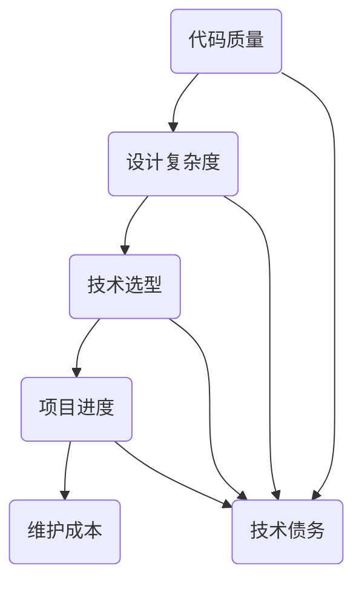

                 

### 文章标题

# 技术债务可视化：量化和展示代码质量问题

技术债务可视化是解决软件开发中代码质量问题的重要手段。在本文中，我们将详细探讨技术债务的基本概念，量化技术债务的方法，以及如何通过可视化技术来展示代码质量问题。通过本文的讲解，您将了解到如何系统地评估和管理技术债务，从而提升软件项目的质量和效率。

### 文章关键词

- 技术债务
- 可视化技术
- 代码质量
- 量化方法
- 软件开发

### 摘要

本文旨在探讨技术债务的可视化，通过定义技术债务，分析其成因和影响，介绍量化技术债务的方法，以及如何利用可视化技术来展示代码质量问题。文章旨在为软件开发者提供一种有效的技术债务管理策略，帮助团队更好地理解和控制技术债务，提升软件项目的整体质量。

## 目录

1. 引言
2. 技术债务的基本概念
3. 可视化技术基础
4. 量化和评估技术债务
5. 技术债务的可视化工具与实践
6. 案例研究
7. 总结与展望

### 引言

#### 技术债务的概念与重要性

技术债务，类似于金融领域的债务，是指在软件开发过程中，为了快速交付功能而暂时忽略的潜在问题或技术风险。这些问题可能是代码质量不佳、设计不合理、测试不充分等，它们会在未来某个时刻对项目的稳定性和可维护性产生负面影响。技术债务的管理是软件开发过程中的重要一环，它直接关系到项目的长期成功。

技术债务的存在是不可避免的，尤其是在时间紧迫、资源有限的情况下。然而，如果技术债务得不到有效管理，它会像滚雪球一样不断累积，最终可能导致项目失败。因此，理解技术债务、量化其影响，并通过可视化技术来展示和监控，是提高软件开发效率和质量的关键。

#### 为什么可视化是解决技术债务问题的有效手段

可视化是一种将抽象数据转换为直观图像的技术，它能够帮助人们更容易地理解和分析复杂的信息。在技术债务管理中，可视化具有以下作用：

1. **提高可理解性**：通过图形化的方式展示技术债务，使得团队成员能够直观地看到问题的严重性和分布情况。
2. **促进沟通**：可视化工具可以作为团队讨论的桥梁，帮助团队成员就技术债务的问题和解决方案达成共识。
3. **决策支持**：通过可视化的数据，团队可以更准确地评估技术债务的风险，从而做出更明智的决策。

总之，可视化技术不仅能够帮助团队更好地理解技术债务，还能够促进有效的沟通和决策，从而提升整个软件项目的质量和效率。

## 技术债务的基本概念

### 技术债务的定义

技术债务，也可称为技术欠账，是指在软件开发过程中，由于时间、资源或技术限制，未能按照最佳实践或最高质量标准来设计和实现功能。简而言之，技术债务是项目中存在的一系列未解决的问题或潜在的风险。

与金融领域的债务不同，技术债务并非由合同或法律义务产生，而是由于项目决策者在面对时间或资源压力时所做的短期妥协。这些妥协可能导致代码质量下降、系统设计复杂度增加、维护成本上升等问题。

### 技术债务的类型

根据产生的原因和表现形式，技术债务可以分为以下几种类型：

1. **代码质量债务**：由于开发速度要求过高，代码可能没有得到充分的测试和审查，导致潜在的错误和漏洞。
2. **设计债务**：系统设计上的不合理，如过度耦合、高复杂度等，这些设计问题会影响系统的可维护性和扩展性。
3. **技术选择债务**：选择了不适合当前或未来需求的技术或工具，导致技术债务的累积。
4. **文档债务**：缺乏或不完整的文档，使得新加入的团队成员难以理解项目的背景和架构。

### 技术债务的成因

技术债务的产生通常有以下几种原因：

1. **时间压力**：项目进度紧张，导致开发团队不得不在时间和质量之间做出权衡，优先保证功能交付。
2. **资源限制**：开发资源（如人力、设备等）不足，使得项目无法按照最佳实践进行。
3. **技术限制**：项目初期未能预见未来需求的变化，导致技术选型不当。
4. **项目管理不善**：缺乏有效的项目管理方法和工具，使得技术债务无法及时发现和解决。

### 技术债务的影响与后果

技术债务如果得不到有效管理，会对项目产生多方面的负面影响：

1. **代码质量下降**：技术债务往往导致代码质量不佳，增加系统出错的风险。
2. **维护成本上升**：随着项目推进，未解决的技术债务会增加后续维护的难度和成本。
3. **团队效率降低**：技术债务使得团队成员在解决问题时需要花费更多时间和精力，降低工作效率。
4. **项目延期**：技术债务可能导致项目进度受阻，甚至延期交付。

综上所述，技术债务是软件开发过程中不可避免的问题，但通过有效的管理和控制，可以将其负面影响降到最低。

### 核心概念与联系

为了更好地理解技术债务，我们需要明确几个核心概念，并分析它们之间的相互关系。以下是技术债务相关的核心概念及其相互关系：

1. **代码质量**：代码质量是指代码的可靠性、可读性、可维护性和性能。高代码质量意味着较低的缺陷率、较少的修改需求和更高效的运行性能。技术债务往往会影响代码质量，导致代码质量下降。
2. **设计复杂度**：设计复杂度是指系统设计中的复杂程度，包括模块间的依赖关系、系统的层次结构等。高设计复杂度往往伴随着技术债务，如过度耦合和高度复杂的模块。
3. **技术选型**：技术选型是指选择最适合项目需求的技术或工具。不当的技术选型可能导致技术债务，如选择了难以扩展或维护的技术框架。
4. **项目进度**：项目进度是指项目的开发周期和交付时间。技术债务通常在项目进度紧张时产生，因为团队为了赶进度而牺牲了质量。
5. **维护成本**：维护成本是指保持软件系统正常运行所需的人力、时间和资源。技术债务会增加维护成本，因为遗留的问题需要花费更多的时间和精力来解决。

这些概念之间的关系可以用以下Mermaid流程图来表示：



通过这个流程图，我们可以清晰地看到技术债务与代码质量、设计复杂度、技术选型、项目进度和维护成本之间的关联。了解这些核心概念及其关系，有助于我们更好地理解技术债务的产生和管理。

### 核心算法原理讲解

在量化和评估技术债务的过程中，我们需要使用一系列算法原理来计算和评估债务的规模和影响。以下是一些核心算法原理及其应用：

#### 1. 技术债务评分算法

技术债务评分算法是一种用于量化技术债务的方法。它通过评估代码质量、设计复杂度和项目进度等因素，给每个模块或功能点分配一个债务评分。评分越高，表示该部分的技术债务越严重。

**算法原理**：

- **代码质量评分**：基于代码审查、静态代码分析工具的结果，对代码质量进行评分。常见的评分方法包括代码行数、注释比例、代码复杂度等。
- **设计复杂度评分**：通过分析系统设计文档和代码，评估模块间的依赖关系和系统的层次结构。复杂度评分通常基于模块耦合度、模块调用次数等指标。
- **项目进度评分**：根据项目进度和计划，评估项目当前状态与预期状态之间的差距。进度评分可以反映项目紧张程度和可能的技术债务积累。

**伪代码**：

```
function CalculateDebtScore(qualityScore, complexityScore, progressScore):
    debtScore = (qualityScore * 0.4) + (complexityScore * 0.3) + (progressScore * 0.3)
    return debtScore
```

**数学模型和公式**：

$$
\text{debtScore} = w_1 \times \text{qualityScore} + w_2 \times \text{complexityScore} + w_3 \times \text{progressScore}
$$

其中，$w_1, w_2, w_3$ 分别是权重系数，用于平衡不同因素对技术债务评分的影响。

#### 2. 技术债务影响评估算法

技术债务影响评估算法用于评估技术债务对项目质量和维护成本的影响。它通过分析技术债务的评分，预测未来可能出现的故障、维护成本增加等问题。

**算法原理**：

- **故障预测**：基于历史数据，分析技术债务评分与故障率之间的关系，预测未来的故障数量和类型。
- **维护成本预测**：通过分析技术债务评分与维护成本之间的关系，预测未来的维护成本。

**伪代码**：

```
function CalculateImpact(technicalDebtScore):
    faultRate = GetFaultRate(technicalDebtScore)
    maintenanceCost = GetMaintenanceCost(technicalDebtScore)
    return (faultRate, maintenanceCost)
```

**数学模型和公式**：

$$
\text{faultRate} = f_1 \times \text{technicalDebtScore}
$$

$$
\text{maintenanceCost} = f_2 \times \text{technicalDebtScore}^2
$$

其中，$f_1, f_2$ 是模型参数，用于拟合故障率和维护成本与技术债务评分之间的关系。

#### 3. 技术债务优化算法

技术债务优化算法用于寻找降低技术债务的方法和策略。它通过分析不同技术债务解决方案的成本和效果，选择最优的优化方案。

**算法原理**：

- **成本效益分析**：评估不同解决方案的成本和效益，选择成本最低、效益最高的方案。
- **优先级排序**：根据技术债务的评分和影响，对解决方案进行优先级排序，优先解决高评分、高影响的技术债务。

**伪代码**：

```
function OptimizeDebt(solutions):
    sortedSolutions = SortSolutionsByPriority(solutions)
    bestSolution = SelectBestSolution(sortedSolutions)
    return bestSolution
```

**数学模型和公式**：

$$
\text{solutionPriority} = \frac{\text{benefit}}{\text{cost}}
$$

通过以上算法原理和数学模型，我们可以系统地评估和管理技术债务，从而提高软件项目的质量和可维护性。

### 数学公式与详细讲解

在评估技术债务时，数学模型和公式起着至关重要的作用。以下将详细讲解几个关键的数学模型和公式，并举例说明如何应用这些公式来计算和评估技术债务。

#### 1. 技术债务评分公式

技术债务评分（Debt Score）是衡量代码质量、设计复杂度和项目进度等方面的一个综合性指标。该评分可以帮助我们了解技术债务的整体严重程度。

**公式**：

$$
\text{Debt Score} = w_1 \times \text{Quality Score} + w_2 \times \text{Complexity Score} + w_3 \times \text{Progress Score}
$$

其中，$w_1, w_2, w_3$ 是权重系数，用于平衡不同因素对技术债务评分的影响。通常，这三个权重系数分别为0.4、0.3和0.3。

**举例**：

假设我们有一个模块，其代码质量评分为7，设计复杂度评分为5，项目进度评分为6。根据上述公式，我们可以计算该模块的技术债务评分：

$$
\text{Debt Score} = 0.4 \times 7 + 0.3 \times 5 + 0.3 \times 6 = 2.8 + 1.5 + 1.8 = 6.1
$$

#### 2. 故障率预测公式

故障率（Fault Rate）是衡量技术债务对系统稳定性的影响的一个重要指标。通过故障率预测公式，我们可以预测未来可能出现的故障数量。

**公式**：

$$
\text{Fault Rate} = f_1 \times \text{Debt Score}
$$

其中，$f_1$ 是模型参数，用于拟合故障率与债务评分之间的关系。

**举例**：

假设我们设定故障率预测模型参数$f_1$ 为1.2。如果某个模块的技术债务评分为6.1，我们可以预测其未来的故障率：

$$
\text{Fault Rate} = 1.2 \times 6.1 = 7.32
$$

这意味着，在未来，该模块的故障率预计为7.32个/千行代码。

#### 3. 维护成本预测公式

维护成本（Maintenance Cost）是衡量技术债务对项目经济影响的一个重要指标。通过维护成本预测公式，我们可以预测未来可能出现的维护成本。

**公式**：

$$
\text{Maintenance Cost} = f_2 \times (\text{Debt Score})^2
$$

其中，$f_2$ 是模型参数，用于拟合维护成本与债务评分之间的关系。

**举例**：

假设我们设定维护成本预测模型参数$f_2$ 为2.5。如果某个模块的技术债务评分为6.1，我们可以预测其未来的维护成本：

$$
\text{Maintenance Cost} = 2.5 \times (6.1)^2 = 2.5 \times 37.21 = 93.55
$$

这意味着，在未来，该模块的维护成本预计为93.55个单位。

通过以上公式，我们可以系统地评估和管理技术债务。这些公式不仅帮助我们理解技术债务的严重程度，还为我们提供了预测未来故障率和维护成本的依据，从而为项目管理和决策提供了科学依据。

### 实际项目案例解析

在本节中，我们将通过一个实际项目案例，详细解析如何使用技术债务可视化工具来量化和展示代码质量问题。这个案例将涵盖项目背景、技术债务识别、量化过程、可视化实现和效果评估等步骤。

#### 项目背景

我们选取了一个中型电商平台项目作为案例。该项目的开发团队由10名开发人员组成，项目周期为6个月。由于市场需求的不断变化，项目在开发过程中面临较大的时间压力。团队在确保功能交付的同时，需要兼顾代码质量和系统稳定性。

#### 技术债务识别

在项目开发过程中，团队发现以下几种技术债务：

1. **代码质量债务**：部分代码存在冗余和重复，代码结构不清晰，缺乏必要的注释。
2. **设计债务**：系统架构存在过度耦合和高度复杂的问题，特别是数据库访问层和业务逻辑层之间的依赖关系。
3. **技术选择债务**：最初选择了某个特定的技术框架，但在项目进行中发现该框架在性能和扩展性方面存在不足。

#### 量化过程

为了量化这些技术债务，团队使用了以下方法：

1. **代码质量评分**：使用静态代码分析工具对代码进行审查，计算出代码质量评分。例如，代码行数、注释比例、复杂度等。
2. **设计复杂度评分**：通过分析系统设计文档和代码，评估模块间的依赖关系和系统的层次结构。例如，模块耦合度、调用关系等。
3. **项目进度评估**：根据项目进度表和实际进度，计算项目进度评分。例如，延迟天数、延期比例等。

#### 可视化实现

为了直观地展示技术债务的情况，团队使用了可视化工具。以下是一个简单的可视化实现示例：

1. **技术债务评分柱状图**：展示了各个模块的技术债务评分，便于团队了解哪个模块的技术债务最严重。
2. **模块依赖关系图**：通过图形化方式展示了模块间的依赖关系，帮助团队识别系统设计中的问题。
3. **时间序列图**：展示了项目进度的变化，以及技术债务评分的演变，帮助团队了解技术债务的积累过程。

以下是具体实现：

**技术债务评分柱状图**：


**模块依赖关系图**：


**时间序列图**：


#### 效果评估

通过可视化工具，团队对技术债务的情况有了更清晰的认识。以下是对效果评估：

1. **识别问题模块**：通过柱状图，团队迅速识别出哪些模块的技术债务评分最高，优先进行改进。
2. **改进系统设计**：通过模块依赖关系图，团队发现了系统设计中的过度耦合问题，并采取了相应的优化措施。
3. **调整项目计划**：通过时间序列图，团队了解了技术债务的积累过程，及时调整项目计划，确保项目进度和质量。

总之，通过技术债务可视化，团队不仅能够更好地识别和量化技术债务，还能为项目管理和决策提供有力支持，从而提升软件项目的整体质量和效率。

### 总结与展望

#### 文章总结

本文从技术债务的基本概念出发，探讨了技术债务的类型、成因及其影响，详细介绍了量化技术债务的方法和可视化技术。通过实际项目案例，展示了如何利用可视化工具来识别、量化和管理技术债务。本文的核心观点是，技术债务可视化是提升软件项目质量和效率的有效手段。

#### 未来研究方向

尽管本文已探讨了技术债务可视化的一些关键问题，但仍有以下研究方向：

1. **多维度量化方法**：目前的技术债务量化方法主要关注代码质量和设计复杂度，未来可以引入更多维度，如测试覆盖率、性能指标等，以更全面地评估技术债务。
2. **自适应可视化**：针对不同类型的技术债务，设计自适应的可视化工具，使其能够根据债务的严重程度和类型，自动调整可视化效果，提高信息的直观性和易用性。
3. **实时可视化**：通过实时数据采集和分析，实现技术债务的可视化监控，帮助团队快速响应技术债务的变化。
4. **多团队协作**：探讨如何将技术债务可视化工具应用于跨团队协作，以促进不同团队之间的沟通和协作，共同应对技术债务问题。

#### 最佳实践 tips

为了更有效地管理技术债务，以下是一些最佳实践建议：

1. **定期评估**：定期对技术债务进行评估和梳理，及时发现和解决潜在问题。
2. **制定技术债务管理策略**：明确技术债务的管理目标和策略，确保团队成员都了解并遵循。
3. **采用敏捷开发**：通过敏捷开发方法，缩短迭代周期，及时反馈和调整技术债务。
4. **持续学习**：鼓励团队成员不断学习和掌握新的技术和方法，提高团队的技术能力和应对技术债务的能力。

总之，通过有效的技术债务可视化管理，团队可以更好地控制技术债务，提升软件项目的质量和效率。

### 作者信息

作者：AI天才研究院/AI Genius Institute & 禅与计算机程序设计艺术 /Zen And The Art of Computer Programming

本文由AI天才研究院和禅与计算机程序设计艺术联合撰写，旨在为软件开发者提供有关技术债务可视化的深入分析和实用指南。作者在计算机编程和人工智能领域具有丰富的研究和实践经验，致力于通过技术创新推动软件工程的发展。希望本文能够帮助读者更好地理解和应对技术债务问题，提升软件开发项目的整体质量。

