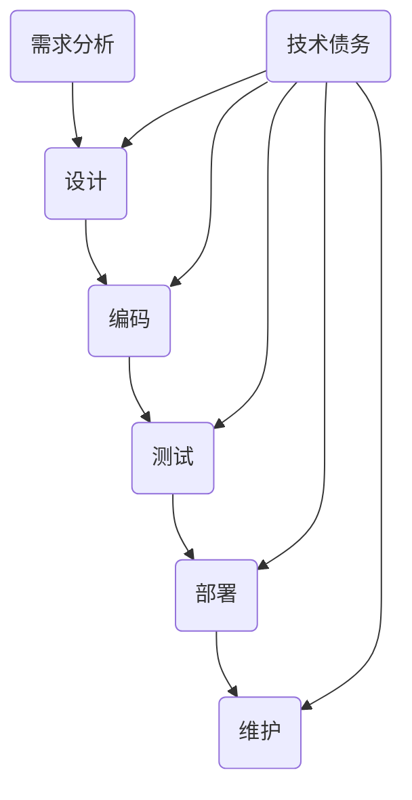
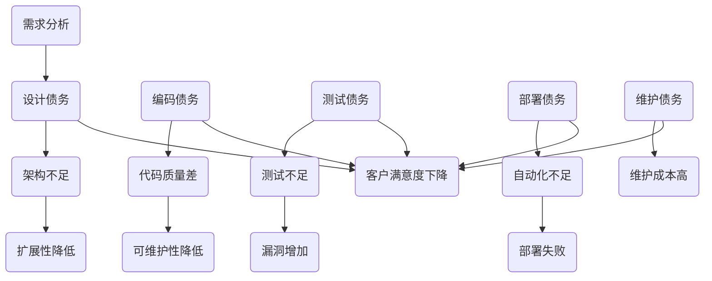

                 

### 文章标题：技术债务管理策略：识别、量化与偿还

> 关键词：技术债务、识别、量化、偿还、管理策略

技术债务是指在软件开发和维护过程中，由于短期内采取的妥协措施而积累的问题和风险。它是一种比喻，类似于金融债务，但在这里指的是技术层面的债务。随着软件系统的复杂性和规模不断扩大，技术债务问题逐渐成为制约项目成功的关键因素。本文将探讨技术债务管理的核心策略，包括识别、量化以及偿还技术债务的方法，帮助软件开发团队更好地应对这一挑战。

### 摘要

本文首先介绍技术债务的基本概念及其产生的背景，接着阐述技术债务管理的体系结构，包括管理原则、流程、工具和团队。随后，详细讨论技术债务的识别与评估方法，并介绍量化技术债务的原则、模型和工具。在此基础上，本文提出一系列技术债务的偿还策略和实践，旨在提供具体可行的解决方案。最后，对技术债务管理优化和未来趋势进行展望，探讨技术创新和法律伦理问题，以期为读者提供全面的技术债务管理指南。

### 第一部分：技术债务基础概念与体系构建

#### 第1章：技术债务概述

##### 1.1 技术债务的定义

技术债务（Technical Debt）最初由Mike Cohn在2006年提出，用来描述在软件开发过程中，为了加快开发进度而采取的短期解决方案所累积的问题和风险。这些问题和风险可能会在未来的某个时间点给项目带来额外的成本和复杂性。

技术债务不仅仅是指代码层面的缺陷，还包括设计上的不足、架构上的妥协、测试的不足以及文档的不完整性。与金融债务类似，技术债务也是一种负债，但是它体现在软件的维护和扩展性上。

##### 1.2 技术债务的产生原因

技术债务的产生主要有以下几个原因：

1. **时间压力**：为了在截止日期前交付功能，开发团队可能会采取一些“捷径”来满足需求。
2. **资源限制**：有限的开发资源和人力可能会迫使我们选择质量较低但更快的解决方案。
3. **技术限制**：使用不适合当前项目的工具或技术栈，可能会在长期使用中产生问题。
4. **沟通不足**：项目团队成员之间的沟通不畅可能导致技术债务的积累。
5. **知识不足**：开发人员可能缺乏足够的背景知识来做出最优的技术决策。

##### 1.3 技术债务的类型

技术债务可以根据其影响和性质分为以下几类：

1. **设计债务**：由于架构上的不足或设计上的妥协而产生的债务。
2. **代码债务**：代码质量低劣、可读性差、缺乏注释和文档等问题。
3. **测试债务**：测试覆盖不足、自动化测试不足或者缺乏单元测试等问题。
4. **部署债务**：部署流程不完善、缺乏自动化部署工具等问题。

##### 1.4 技术债务的影响

技术债务对项目的长期成功和可持续发展具有深远的影响：

1. **维护成本增加**：随着技术债务的增加，维护软件的成本会显著上升。
2. **扩展性降低**：系统的扩展性会受到影响，增加新功能或修复问题的成本会更高。
3. **团队士气下降**：技术债务可能导致团队成员感到沮丧和挫败，影响团队的工作效率和士气。
4. **客户满意度下降**：由于技术债务导致的项目延期和问题频发，会降低客户的满意度。

### 技术债务的概念架构

为了更好地理解技术债务的概念，我们可以使用Mermaid流程图来展示其与软件开发过程中各个环节的联系。



在这个流程图中，技术债务贯穿了软件开发的整个生命周期，从需求分析到维护阶段。每个阶段都可能产生技术债务，而这些债务会随着时间的推移而积累，影响项目的长期健康。

### 核心概念与联系

为了更好地理解技术债务的核心概念及其相互关系，我们可以构建一个Mermaid流程图，展示不同类型的技术债务如何影响软件开发的各个环节。



在这个流程图中，我们可以看到设计债务、编码债务、测试债务和部署债务是如何影响软件开发的各个阶段，并最终导致客户满意度的下降。这些债务类型相互关联，共同构成了技术债务的整体框架。

### 核心算法原理讲解

在识别技术债务时，常用的算法包括代码审查、静态代码分析和自动化测试。以下是一个简化的伪代码，用于描述这些算法的基本原理。

```pseudo
function identifyTechnicalDebt(sourceCode, testCases):
    debtList = []
    for each file in sourceCode:
        qualityScore = staticCodeAnalysis(file)
        if qualityScore < threshold:
            debtList.append(file)
        
        testResults = runTestCases(testCases, file)
        if testResults.failed():
            debtList.append(file)
    return debtList
```

在这个伪代码中，`staticCodeAnalysis`函数用于评估代码质量，`runTestCases`函数用于执行自动化测试。如果代码质量低于某个阈值，或者测试失败，则该文件被视为存在技术债务。

### 数学模型和公式

在量化技术债务时，常用的模型包括复杂度度量、代码行数和缺陷率等。以下是一个简化的数学模型，用于计算技术债务的量化值。

$$
TD = C \times E \times (1 - R)
$$

其中，$TD$表示技术债务值，$C$表示代码复杂度，$E$表示工程复杂度，$R$表示测试覆盖率。这个公式表明，技术债务与代码复杂度、工程复杂度和测试覆盖率呈正相关关系。

### 举例说明

假设一个项目的代码复杂度为100，工程复杂度为200，测试覆盖率为70%，则技术债务值计算如下：

$$
TD = 100 \times 200 \times (1 - 0.7) = 6000
$$

这意味着该项目的技术债务值为6000。随着测试覆盖率的提高，技术债务值将逐渐降低。

### 项目实战

为了更好地理解技术债务的管理，我们来看一个实际案例。假设某团队正在开发一个电子商务平台，他们在项目早期由于时间压力，选择了简单但功能有限的数据库进行数据存储，而不是更优的分布式数据库。

1. **开发环境搭建**：团队使用常规的开发环境，包括本地计算机和虚拟机，使用Git进行版本控制。
2. **源代码详细实现**：团队使用简单的数据库进行数据存储，未实现数据分片和高可用性。
3. **代码解读与分析**：团队成员发现，随着用户量的增加，系统性能逐渐下降，维护成本也在增加。

通过上述案例，我们可以看到，技术债务是如何在实际项目中积累并影响系统性能的。为了解决这些问题，团队需要采取技术债务偿还策略，包括升级数据库和优化系统架构。

### 最佳实践 Tips

1. **早期识别**：尽早识别技术债务，可以在问题积累之前就采取措施。
2. **持续改进**：定期评估和修复技术债务，以避免问题积累。
3. **沟通与协作**：确保团队之间的沟通畅通，共同面对技术债务问题。
4. **培训与知识分享**：定期进行培训，提高团队成员的技术能力和知识水平。

### 小结

技术债务是软件开发过程中不可避免的问题，但通过有效的管理策略，可以将其对项目的负面影响降到最低。本文介绍了技术债务的定义、产生原因、类型和影响，并探讨了技术债务的管理体系、识别评估方法以及量化优先级排序。在接下来的部分，我们将继续深入讨论技术债务的量化方法、偿还策略和实践，帮助读者更好地应对这一挑战。

