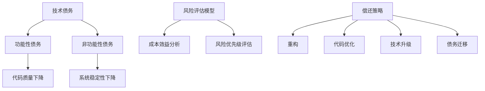

                 

### 文章标题

《技术债务管理：从识别到偿还的全流程》

### 关键词

- 技术债务
- 技术债务管理
- 代码质量检测
- 风险评估模型
- 技术升级与重构
- 团队协作

### 摘要

本文将深入探讨技术债务管理这一重要课题，从技术债务的基本概念、识别、评估、偿还到最佳实践，提供全面的指南。通过详细的步骤和案例分析，帮助读者理解技术债务对软件项目的影响，掌握有效的管理方法，提升项目质量，保障团队协作和项目持续发展。

---

## 引言

在软件工程领域，技术债务（Technical Debt）是一个被广泛讨论的话题。它源于软件开发中的快速交付和不断迭代，代表着为了短期利益而做出的技术上的妥协。技术债务的存在如同财务债务，如果不加以管理，会随着时间的积累而对项目产生严重的负面影响。本文旨在通过从识别到偿还的全流程，为技术债务管理提供一套科学、系统的解决方案。

### 背景介绍

技术债务的概念最早由软件工程师 Ward Cunningham 在1992年提出，他比喻技术债务为“我们选择今天不去做某事，而是向未来借一个解决方案”。技术债务可以分为功能性债务和非功能性债务，前者指的是代码层面的优化和重构，后者则涉及系统的可维护性、性能和安全性等方面。

### 核心概念与联系

#### 技术债务的定义

技术债务是指为了满足项目短期需求，而做出的某些低效、不完善或具有潜在风险的决策。这些决策可能在开发速度和项目交付上带来了短期的利益，但长期来看，可能会导致代码复杂度增加、维护成本上升、系统稳定性下降等问题。

#### 技术债务的类型

- **功能性债务**：指为了快速实现功能而牺牲代码质量和设计优化，例如使用快速开发的框架而非稳定成熟的技术栈。

- **非功能性债务**：指在系统性能、安全性和可维护性等方面的妥协，例如为了提升性能而牺牲系统的可扩展性。

- **示例**：假设一个项目团队为了赶在市场发布前交付产品，选择了使用一个尚未稳定的技术栈。虽然产品如期上市，但之后不断出现性能问题和安全性漏洞，这就是技术债务的具体表现。

#### 技术债务的影响

- **负面影响**：技术债务会增加代码的复杂度，使得未来的维护成本上升。同时，技术债务可能引发系统故障，影响用户体验和业务连续性。

- **正面影响**：适度的技术债务在一定情况下可以加速项目进度，提升市场竞争力。但是，过度的技术债务会带来灾难性后果。

- **风险评估模型**：技术债务的风险评估模型可以帮助团队量化债务的影响，并制定相应的偿还策略。常见的模型包括成本效益分析、风险优先级评估等。

### 联系与关系架构

为了更好地理解技术债务的各个概念及其相互关系，我们可以使用Mermaid流程图来展示这些核心概念及其联系。

通过上述流程图，我们可以清晰地看到技术债务、功能性债务和非功能性债务之间的层次关系，以及风险评估模型和偿还策略的具体应用。

### 结论

本文介绍了技术债务的基本概念、类型、影响以及相互关系。技术债务管理是一个持续的过程，需要团队在开发过程中时刻保持警惕，识别和评估债务，制定合理的偿还策略。只有这样，才能确保软件项目的长期健康发展和持续交付高质量的产品。

### 引用

作者：AI天才研究院/AI Genius Institute & 禅与计算机程序设计艺术 /Zen And The Art of Computer Programming

---

在接下来的章节中，我们将逐步深入探讨技术债务的识别、评估和偿还方法，并提供实际案例和最佳实践，帮助读者更好地理解和应用技术债务管理策略。通过这些步骤，我们将确保读者能够全面掌握技术债务管理的方法和技巧，提升项目质量和团队效率。

