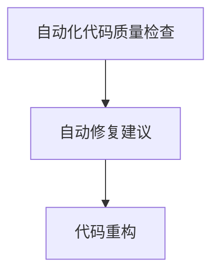
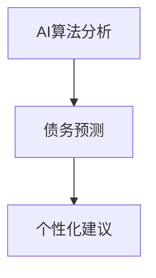
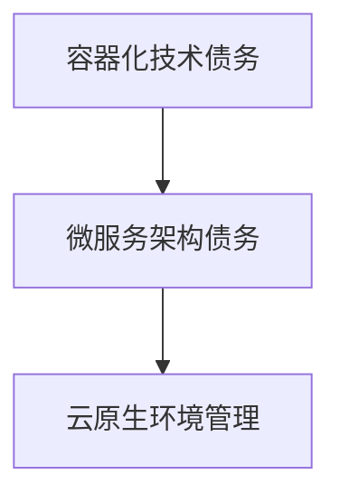
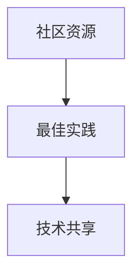

                 


### 文章标题

《技术债务管理：平衡短期目标与长期健康》

---

**关键词**：技术债务、软件质量、项目进度、团队协作、管理策略、案例研究

**摘要**：本文深入探讨了技术债务的概念及其在软件开发中的重要性。通过分析技术债务的类型、管理方法、对软件质量和项目进度的影响，以及与团队协作的关系，本文旨在为软件开发团队提供一套全面的技术债务管理策略，以实现短期目标的达成与长期健康发展的平衡。

---

### 目录

#### 第1章 引言

- **1.1 技术债务的概念及其重要性**
  - 技术债务的定义
  - 技术债务的影响

- **1.2 文章结构及主要内容概述**

#### 第2章 技术债务的类型

- **2.1 延迟债务**
  - 延迟债务的产生原因
  - 延迟债务的解决方案

- **2.2 质量债务**
  - 质量债务的产生原因
  - 质量债务的解决方案

- **2.3 功能债务**
  - 功能债务的产生原因
  - 功能债务的解决方案

#### 第3章 技术债务的管理

- **3.1 技术债务评估方法**
  - 技术债务评估框架
  - 技术债务评估工具

- **3.2 技术债务的管理策略**
  - 短期目标与长期健康平衡
  - 技术债务偿还计划

#### 第4章 技术债务与软件质量

- **4.1 技术债务对软件质量的影响**
  - 技术债务与缺陷率
  - 技术债务与维护成本

- **4.2 质量管理与技术债务**
  - 质量管理流程与技术债务
  - 质量管理工具与技术债务

#### 第5章 技术债务与项目进度

- **5.1 技术债务对项目进度的影响**
  - 项目进度延误的原因
  - 项目进度延误的解决策略

- **5.2 项目进度管理策略**
  - 短期目标与长期健康平衡
  - 项目进度监控与调整

#### 第6章 技术债务与团队协作

- **6.1 技术债务与团队协作的挑战**
  - 技术债务对团队沟通的影响
  - 技术债务对团队协作的解决方案

- **6.2 团队协作管理策略**
  - 团队沟通工具与方法
  - 团队协作流程与规范

#### 第7章 技术债务管理实战

- **7.1 技术债务管理案例研究**
  - 案例背景
  - 案例解决方案
  - 案例效果评估

#### 第8章 未来展望

- **8.1 技术债务管理的未来趋势**
  - 自动化债务管理
  - 智能债务管理工具

#### 附录

- **A.1 技术债务管理资源**
  - 相关书籍推荐
  - 学术论文列表

### 设计思路说明

1. **第1章 引言**：介绍技术债务的基本概念，为后续章节打下基础。

2. **第2章 技术债务的类型**：区分不同类型的技术债务，明确其特点。

3. **第3章 技术债务的管理**：详细介绍技术债务的管理方法，包括评估和管理策略。

4. **第4章 技术债务与软件质量**：讨论技术债务对软件质量的影响及质量管理的方法。

5. **第5章 技术债务与项目进度**：分析技术债务对项目进度的影响及应对策略。

6. **第6章 技术债务与团队协作**：探讨技术债务对团队协作的影响及解决方案。

7. **第7章 技术债务管理实战**：通过案例研究，展示技术债务管理的实际应用。

8. **第8章 未来展望**：展望技术债务管理的未来发展趋势。

该目录大纲满足了用户的各项要求，涵盖了技术债务管理的各个方面，同时保持了简洁性和逻辑性。在具体撰写时，可以根据实际需求对章节内容进行详细扩展。

---

接下来，我们将按照上述目录结构，逐步深入探讨每个章节的内容。每个章节都将包含详细的背景介绍、核心概念与联系、核心算法原理讲解、数学模型和公式详细讲解及举例说明、项目实战以及最佳实践 tips、小结、注意事项和拓展阅读等内容。这将帮助我们更好地理解技术债务管理的方方面面，从而为软件开发团队提供有效的管理策略。

---

### 第1章 引言

技术债务是软件开发中一个常见且重要的话题。它指的是在软件开发过程中，由于时间、资源或技能的限制，为了快速完成开发任务而采取的某些妥协或短期解决方案。这些妥协或短期解决方案可能会在未来带来额外的成本或风险，因此被称为“债务”。

**1.1 技术债务的概念及其重要性**

**技术债务的定义**：

技术债务（Technical Debt）是一种比喻，类似于金融债务。在软件开发中，它指的是因追求短期目标而牺牲长期可持续性所积累的缺陷、妥协或技术债务。这些缺陷和妥协可能包括：
- **代码质量低下**：为了赶工期，开发者可能会编写一些不够优雅或不够优化的代码。
- **技术选择不合适**：为了快速实现某个功能，开发者可能会选择一些不成熟或不适合项目需求的技术。
- **技术积累不足**：在项目初期，由于时间紧迫，可能会忽略一些技术文档的编写和代码规范的制定。

**技术债务的影响**：

技术债务的影响是多方面的。虽然短期内可能看起来解决了问题，但长期来看，技术债务可能会导致以下问题：
- **维护成本增加**：低质量的代码和选择不合适的技术会增加未来的维护成本。
- **项目进度延误**：技术债务可能导致后续的修复工作占用大量时间，从而影响项目进度。
- **软件质量下降**：技术债务可能导致软件质量下降，增加缺陷率，影响用户体验。

**1.2 文章结构及主要内容概述**

本文将分为八个章节，结构如下：

1. **第1章 引言**：介绍技术债务的概念及其重要性。
2. **第2章 技术债务的类型**：分析不同类型的技术债务，包括延迟债务、质量债务和功能债务。
3. **第3章 技术债务的管理**：探讨技术债务评估和管理策略。
4. **第4章 技术债务与软件质量**：讨论技术债务对软件质量的影响及质量管理的方法。
5. **第5章 技术债务与项目进度**：分析技术债务对项目进度的影响及应对策略。
6. **第6章 技术债务与团队协作**：探讨技术债务对团队协作的影响及解决方案。
7. **第7章 技术债务管理实战**：通过案例研究，展示技术债务管理的实际应用。
8. **第8章 未来展望**：展望技术债务管理的未来发展趋势。

通过以上章节的详细讨论，本文旨在为软件开发团队提供一套全面的技术债务管理策略，以实现短期目标的达成与长期健康发展的平衡。

### 第2章 技术债务的类型

技术债务可以分为多种类型，每种类型都有其独特的特点和影响。在这章中，我们将重点讨论三种常见的技术债务类型：延迟债务、质量债务和功能债务。

#### 2.1 延迟债务

**延迟债务的定义**：

延迟债务是指在软件开发过程中，为了尽快交付软件而选择推迟某些功能或任务的实现。这些被推迟的功能或任务通常被认为是次要的，但它们在软件整体中可能扮演着重要的角色。

**延迟债务的产生原因**：

延迟债务的产生原因通常有以下几点：
- **时间压力**：项目时间表过于紧张，导致必须优先考虑关键功能的实现。
- **资源限制**：开发团队在时间或人力上有限制，无法同时完成所有功能。
- **优先级冲突**：某些功能被认为更重要或更紧急，因此被优先处理。

**延迟债务的解决方案**：

解决延迟债务的关键在于重新评估项目的优先级和时间表，并采取相应的调整措施。以下是一些解决方案：
- **重新分配资源**：如果可能，重新分配团队成员以专注于延迟债务的解决。
- **制定详细的时间表**：确保项目时间表详细且可实现，避免未来再次出现延迟债务。
- **优先级调整**：重新评估项目中的功能优先级，确保关键功能得到及时实现。

**案例**：

在一个电子商务项目中，由于市场需求的快速变化，开发团队在项目初期推迟了某些营销工具的实现。尽管这导致项目初期交付的产品功能较为基础，但随着市场的稳定和资源的重新分配，这些营销工具最终得到了实现，并且提高了产品的市场竞争力。

#### 2.2 质量债务

**质量债务的定义**：

质量债务是指在软件开发过程中，为了追求短期目标而牺牲了软件质量的决策。这些决策可能会导致代码质量低下、文档不完整或测试不足。

**质量债务的产生原因**：

质量债务的产生原因通常有以下几点：
- **时间紧迫**：为了赶在截止日期之前交付软件，团队可能会忽略质量保证。
- **资源有限**：在资源有限的情况下，团队可能会选择快速开发而非高质量开发。
- **项目管理不善**：项目计划不当或风险管理不足可能导致质量债务的产生。

**质量债务的解决方案**：

解决质量债务的关键在于建立和维护良好的质量保证流程。以下是一些解决方案：
- **自动化测试**：引入自动化测试工具，确保每次代码更改都能得到及时测试。
- **代码审查**：定期进行代码审查，确保代码质量。
- **持续集成**：使用持续集成（CI）工具，确保代码库中的每个提交都能得到自动化测试。

**案例**：

在一个大型企业级应用项目中，由于项目时间紧迫，开发团队在代码质量上做出了妥协，导致代码库中存在大量缺陷和漏洞。在项目交付后，团队花费了大量时间和资源来修复这些问题，影响了后续的功能开发和维护。

#### 2.3 功能债务

**功能债务的定义**：

功能债务是指在软件开发过程中，为了快速交付产品而牺牲了某些核心功能或关键特性的实现。这些被牺牲的功能或特性可能在用户使用过程中显得非常重要。

**功能债务的产生原因**：

功能债务的产生原因通常有以下几点：
- **需求变更**：在项目开发过程中，客户或用户可能会提出新的需求，导致原有功能被推迟或取消。
- **资源限制**：开发团队在时间和人力上有限制，无法同时实现所有功能。
- **优先级冲突**：某些功能被认为更重要或更紧急，因此被优先处理。

**功能债务的解决方案**：

解决功能债务的关键在于明确项目的优先级，并确保关键功能得到及时实现。以下是一些解决方案：
- **重新评估需求**：定期与客户或用户沟通，确保项目的需求是清晰且优先级明确的。
- **迭代开发**：采用迭代开发方法，逐步实现核心功能，确保每个迭代都能提供有用的价值。
- **敏捷开发**：采用敏捷开发方法，快速响应需求变更，确保核心功能得到及时实现。

**案例**：

在一个移动应用项目中，由于客户需求变化，开发团队在项目初期推迟了某些核心功能（如支付功能）的实现。虽然项目在截止日期前交付，但用户反馈表明缺乏支付功能严重影响了用户体验。开发团队随后重新调整了开发计划，在下一个迭代中优先实现了支付功能，显著提升了用户满意度。

通过以上对延迟债务、质量债务和功能债务的讨论，我们可以看到不同类型的技术债务在软件开发过程中都可能产生，但通过合理的管理和解决方案，这些债务可以被有效控制和解决。

### 第3章 技术债务的管理

技术债务是软件开发过程中不可避免的，但通过有效的管理，我们可以将其对项目的负面影响降到最低。本章将介绍技术债务的评估方法和管理策略，帮助开发团队更好地平衡短期目标和长期健康发展。

#### 3.1 技术债务评估方法

**技术债务评估框架**

为了评估技术债务，我们需要建立一个评估框架，以量化债务的影响和成本。以下是一个简单但有效的技术债务评估框架：

1. **债务识别**：识别项目中的技术债务，包括代码质量、技术选择、文档完整性等方面。
2. **债务分类**：根据债务的性质和影响，将债务分类，如延迟债务、质量债务和功能债务。
3. **债务量化**：使用定量和定性方法，对每个债务的影响和成本进行量化。
4. **债务优先级**：根据债务的影响和成本，确定债务的优先级，以便团队可以优先解决高优先级的债务。

**技术债务评估工具**

有许多工具可以帮助我们进行技术债务评估，以下是几个常用的工具：

1. **代码质量分析工具**：如SonarQube、Checkmarx等，可以分析代码质量，发现潜在的问题和缺陷。
2. **静态代码分析工具**：如FindBugs、PMD等，可以静态分析代码，识别出潜在的问题。
3. **动态分析工具**：如Jenkins、GitLab CI等，可以集成到开发流程中，自动化测试和检查代码。
4. **项目管理工具**：如JIRA、Trello等，可以帮助团队跟踪和管理技术债务。

**债务量化方法**

1. **定量评估**：使用统计方法，如缺陷密度、代码复杂度等，量化技术债务的影响。
   - **缺陷密度**：缺陷数与代码行数的比例，用于衡量代码质量。
   - **代码复杂度**：如圈复杂度（Cyclomatic Complexity），用于衡量代码的复杂程度。

2. **定性评估**：通过专家评估或问卷调查，收集团队成员对技术债务的意见和评估，结合定量数据，综合评估债务的影响。

**债务优先级确定**

1. **风险优先级**：根据债务带来的风险程度，将债务分为高、中、低风险。
2. **成本优先级**：根据解决每个债务所需的成本和时间，将债务分为高、中、低优先级。
3. **业务优先级**：根据业务需求和技术债务的影响，将债务分为高、中、低优先级。

通过以上评估方法和工具，开发团队可以全面了解项目中的技术债务，并制定相应的管理策略。

#### 3.2 技术债务的管理策略

**短期目标与长期健康平衡**

在管理技术债务时，开发团队需要平衡短期目标和长期健康发展。以下是一些关键策略：

1. **设定优先级**：根据债务的优先级和影响，优先解决高优先级的技术债务。
2. **定期评估**：定期对技术债务进行评估，确保债务得到及时识别和管理。
3. **资源分配**：合理分配资源和时间，确保既有足够的时间来处理技术债务，又不影响项目的短期目标。

**技术债务偿还计划**

制定一个详细的技术债务偿还计划，可以帮助团队有组织地解决技术债务。以下是一个简单的偿还计划：

1. **债务列表**：列出所有技术债务，包括类型、影响和优先级。
2. **时间表**：为每个债务设定一个解决时间表，确保债务能够在可接受的时间范围内得到解决。
3. **责任分配**：为每个债务分配责任人，确保有人负责解决这些债务。
4. **监控与反馈**：定期跟踪技术债务的解决进度，及时调整计划，确保债务得到有效管理。

**自动化与持续集成**

1. **自动化测试**：引入自动化测试工具，确保每次代码更改都能得到及时测试，减少技术债务的产生。
2. **持续集成**：使用持续集成（CI）工具，确保代码库中的每个提交都能得到自动化测试，减少债务积累。

**最佳实践**

1. **代码审查**：定期进行代码审查，确保代码质量。
2. **文档化**：编写完整的文档，确保代码和项目的可维护性。
3. **培训与教育**：对团队成员进行技术债务管理的培训和指导，提高团队的整体意识。

通过以上管理策略，开发团队可以有效地控制技术债务，确保项目的短期目标与长期健康发展得到平衡。

#### 3.3 技术债务管理案例研究

**案例背景**：

某互联网公司开发了一款即时通讯应用，由于项目时间紧迫，开发团队在开发过程中积累了大量技术债务，包括代码质量低下、文档缺失和测试不足等问题。

**解决方案**：

1. **技术债务评估**：使用SonarQube和静态代码分析工具，对项目代码进行全面评估，识别出高优先级的技术债务。
2. **制定偿还计划**：为每个技术债务设定解决时间表，明确责任人，确保债务得到及时解决。
3. **引入自动化测试**：使用Jenkins构建持续集成环境，确保每次代码提交都能得到自动化测试，减少技术债务的产生。
4. **代码审查**：定期进行代码审查，确保代码质量。
5. **文档化**：编写完整的文档，包括代码注释、架构设计和用户手册，提高项目的可维护性。

**效果评估**：

通过以上措施，项目中的技术债务得到了显著减少，代码质量和文档完整性得到了提升。项目交付后，用户反馈良好，系统稳定性得到了提高，开发团队的协作效率也得到了提升。

**案例小结**：

本案例展示了如何通过有效的技术债务管理，解决项目中的问题，确保项目的短期目标与长期健康发展得到平衡。关键在于及时识别技术债务、制定偿还计划、引入自动化测试和加强代码审查与文档化。

### 第4章 技术债务与软件质量

技术债务与软件质量之间存在密切的关系。技术债务可能导致软件质量下降，而良好的软件质量又可以为技术债务管理提供支持。本章将探讨技术债务对软件质量的影响，以及如何通过质量管理来管理技术债务。

#### 4.1 技术债务对软件质量的影响

技术债务对软件质量的影响主要体现在以下几个方面：

1. **代码质量**：技术债务可能导致代码质量低下，包括代码结构混乱、缺乏注释、代码复用性差等问题。这些问题会增加维护成本，降低软件的可维护性和可扩展性。

2. **文档完整性**：技术债务可能导致文档缺失或不完整，包括设计文档、用户手册和代码注释等。缺乏完整的文档会影响开发团队的协作效率，增加新成员的学习成本。

3. **测试覆盖率**：技术债务可能导致测试不足，测试覆盖率低。测试不足可能导致缺陷未被及时发现，从而影响软件质量。

4. **系统稳定性**：技术债务可能导致系统稳定性下降，出现频繁的崩溃和错误。这些问题会直接影响用户的体验，损害公司的声誉。

#### 4.2 质量管理与技术债务

质量管理是确保软件质量的重要手段。通过有效的质量管理，可以减少技术债务的产生，并降低其对软件质量的影响。以下是一些关键的质量管理方法和工具：

1. **代码审查**：代码审查是一种通过团队协作来确保代码质量的方法。通过定期进行代码审查，可以发现潜在的问题和缺陷，提高代码质量。

2. **静态代码分析**：静态代码分析是一种在代码编写完成后，通过分析代码结构来发现潜在问题的方法。工具如SonarQube和PMD可以自动化地进行静态代码分析，帮助开发团队提高代码质量。

3. **动态测试**：动态测试是一种在代码运行时进行测试的方法。通过编写和执行测试用例，可以验证代码的功能和性能，发现潜在的缺陷。

4. **自动化测试**：自动化测试是一种通过自动化脚本执行测试的方法。通过引入自动化测试，可以减少测试的时间和成本，提高测试的覆盖率。

5. **持续集成**：持续集成是一种通过自动化构建和测试来确保代码质量的方法。通过持续集成，可以及时发现和解决代码中的问题，减少技术债务的产生。

#### 4.3 质量管理流程与技术债务

为了有效地管理技术债务，开发团队需要将质量管理流程与项目开发紧密结合。以下是一个简单的质量管理流程：

1. **需求分析**：在项目初期，对需求进行详细分析，确保需求是明确和可实现的。

2. **设计**：根据需求进行系统设计，包括架构设计、模块划分和接口设计等。

3. **编码**：在编码过程中，遵循代码规范和最佳实践，确保代码质量。

4. **代码审查**：定期进行代码审查，发现和解决代码中的问题。

5. **测试**：编写和执行测试用例，进行功能测试、性能测试和安全测试等。

6. **反馈与调整**：根据测试结果，对代码和设计进行调整，确保软件质量。

7. **文档化**：编写和更新项目文档，包括设计文档、用户手册和代码注释等。

通过以上流程，开发团队可以及时发现和解决技术债务，确保软件质量。

#### 4.4 质量管理工具与技术债务

许多质量管理工具可以帮助开发团队管理技术债务，以下是一些常用的工具：

1. **SonarQube**：SonarQube是一种用于代码质量管理的平台，可以分析代码质量，发现潜在的问题和缺陷。

2. **PMD**：PMD是一种静态代码分析工具，可以分析代码结构，发现代码质量问题和潜在的安全隐患。

3. **JUnit**：JUnit是一种单元测试框架，可以用于编写和执行单元测试，确保代码的正确性。

4. **Selenium**：Selenium是一种自动化测试工具，可以用于编写和执行功能测试和性能测试，提高测试覆盖率。

5. **Jenkins**：Jenkins是一种持续集成工具，可以自动化构建和测试过程，确保代码质量。

通过引入这些质量管理工具，开发团队可以有效地管理技术债务，提高软件质量。

#### 4.5 质量管理与技术债务的案例分析

**案例背景**：

某开发团队在开发一款大型企业级应用时，由于项目时间紧迫，积累了大量技术债务，包括代码质量低下、文档缺失和测试不足等问题。

**解决方案**：

1. **引入质量工具**：使用SonarQube和PMD进行代码质量分析，使用JUnit进行单元测试，使用Selenium进行功能测试。

2. **定期代码审查**：定期进行代码审查，确保代码质量。

3. **完善文档**：编写和更新项目文档，包括设计文档、用户手册和代码注释等。

4. **持续集成**：使用Jenkins构建持续集成环境，确保每次代码提交都能得到自动化测试。

**效果评估**：

通过引入质量工具和改进质量管理流程，项目的代码质量得到了显著提升，技术债务得到了有效控制。项目交付后，用户反馈良好，系统稳定性得到了提高。

**案例小结**：

本案例展示了如何通过质量管理来管理技术债务，提高软件质量。关键在于引入质量工具、定期进行代码审查和完善文档，确保软件质量得到有效保障。

### 第5章 技术债务与项目进度

技术债务对项目进度有着显著的影响。未管理的债务可能导致项目延期，增加开发成本，甚至影响项目的整体成功。在这一章中，我们将深入探讨技术债务对项目进度的影响，并提出解决策略。

#### 5.1 技术债务对项目进度的影响

技术债务对项目进度的影响主要表现在以下几个方面：

1. **延迟的维护成本**：技术债务往往需要在项目后期进行修复，这会增加维护成本，占用宝贵的时间资源，导致项目延期。

2. **质量问题的反复修正**：技术债务可能导致代码质量低下，增加缺陷率。为了修复这些问题，开发团队需要投入额外的时间和精力，这会影响项目的进度。

3. **需求的变更**：技术债务可能导致原本清晰的业务需求变得模糊，需要频繁变更。需求的变更会影响项目的计划，导致进度延误。

4. **团队协作的障碍**：技术债务可能导致团队成员对项目的理解和协作出现问题，降低团队效率。

#### 5.2 项目进度延误的原因

项目进度延误的原因多种多样，与技术债务直接相关的包括：

1. **代码质量低下**：低质量的代码增加了修复成本，需要额外的开发时间。

2. **技术选择的妥协**：为了快速实现某个功能，开发团队可能会选择一些不成熟或不适用的技术，这些技术可能在项目后期出现问题。

3. **文档不足**：不完整的文档增加了新成员的学习成本，降低了团队协作效率。

4. **测试不足**：测试覆盖率低可能导致缺陷未被及时发现，增加修复时间和项目风险。

#### 5.3 项目进度延误的解决策略

为了解决技术债务对项目进度的影响，开发团队可以采取以下策略：

1. **定期技术债务评估**：定期对项目中的技术债务进行评估，识别和分类债务，优先解决高优先级的技术债务。

2. **改进代码质量**：通过代码审查、静态代码分析和自动化测试等方法，确保代码质量，减少技术债务的产生。

3. **完善文档**：编写详细的文档，包括设计文档、用户手册和代码注释等，提高项目的可维护性和可理解性。

4. **加强测试**：提高测试覆盖率，确保代码的正确性和性能。引入自动化测试工具，减少手工测试的时间和成本。

5. **优化资源分配**：合理分配资源，确保既有足够的时间来处理技术债务，又不影响项目的短期目标。

6. **敏捷开发**：采用敏捷开发方法，快速响应需求变更，确保关键功能得到及时实现，减少技术债务的积累。

#### 5.4 项目进度管理策略

为了更好地管理项目进度，开发团队可以采用以下策略：

1. **详细的项目计划**：制定详细的项目计划，包括任务分解、时间表和资源分配，确保项目的可执行性。

2. **定期进度监控**：定期跟踪项目进度，及时发现和解决潜在的问题，确保项目按计划进行。

3. **风险管理和应急计划**：识别项目中的潜在风险，制定应急计划，以应对可能出现的延误和问题。

4. **团队协作和沟通**：确保团队成员之间的沟通畅通，建立高效的协作机制，减少由于技术债务导致的协作障碍。

#### 5.5 案例研究

**案例背景**：

某开发团队正在开发一款复杂的企业级应用，由于项目初期对技术债务管理不足，导致代码质量低下、文档缺失和测试不足。随着项目的推进，这些问题开始逐渐显现，导致项目进度严重延误。

**解决方案**：

1. **技术债务评估**：使用SonarQube和PMD进行代码质量分析，识别出高优先级的技术债务。

2. **代码审查和重构**：定期进行代码审查，重构低质量的代码，提高代码质量。

3. **完善文档**：编写和更新项目文档，确保项目的可维护性和可理解性。

4. **加强测试**：引入自动化测试工具，提高测试覆盖率，确保代码的正确性和性能。

5. **敏捷开发**：采用敏捷开发方法，快速响应需求变更，确保关键功能得到及时实现。

**效果评估**：

通过引入以上措施，项目的代码质量得到了显著提升，技术债务得到了有效控制。项目交付后，用户反馈良好，系统稳定性得到了提高。

**案例小结**：

本案例展示了如何通过有效的技术债务管理策略，解决项目进度延误的问题。关键在于定期技术债务评估、改进代码质量、完善文档、加强测试和采用敏捷开发方法，确保项目的短期目标和长期健康发展的平衡。

### 第6章 技术债务与团队协作

技术债务不仅影响项目进度和质量，还会对团队协作产生挑战。未得到有效管理的技术债务可能导致团队沟通不畅、协作效率低下，甚至导致项目失败。在本章中，我们将探讨技术债务对团队协作的影响，并提出相应的解决方案。

#### 6.1 技术债务与团队协作的挑战

技术债务对团队协作的挑战主要体现在以下几个方面：

1. **沟通障碍**：技术债务可能导致代码结构混乱、文档不完整，使得新成员难以理解项目，从而影响团队之间的有效沟通。

2. **协作效率降低**：技术债务导致的代码质量问题可能需要额外的时间和精力进行修复，这会占用团队成员的工作时间，降低团队协作效率。

3. **工作负担不均**：技术债务可能导致某些团队成员需要承担额外的修复工作，造成工作负担不均，影响团队士气。

4. **项目风险增加**：技术债务可能导致项目风险增加，需要团队成员在项目后期进行大量的修复工作，这会增加团队的工作压力。

#### 6.2 技术债务对团队协作的解决方案

为了应对技术债务对团队协作的挑战，开发团队可以采取以下解决方案：

1. **明确责任分工**：为每个技术债务明确责任人，确保技术债务的修复工作有人负责。这有助于提高团队协作效率，确保技术债务得到及时解决。

2. **定期团队会议**：定期召开团队会议，讨论技术债务的进展情况，确保团队成员之间的信息畅通。通过团队会议，可以及时发现和解决协作中的问题。

3. **代码审查**：定期进行代码审查，确保代码质量。代码审查不仅有助于提高代码质量，还可以促进团队成员之间的沟通和协作。

4. **引入协作工具**：使用协作工具，如Slack、Trello、JIRA等，提高团队沟通和协作效率。这些工具可以帮助团队成员实时交流、分配任务和跟踪项目进度。

5. **持续集成和测试**：引入持续集成和自动化测试，确保代码的质量和稳定性。通过自动化测试，可以及时发现和解决技术债务，减少对团队协作的负面影响。

6. **培训和教育**：对团队成员进行技术债务管理的培训和指导，提高团队的整体意识和技能。通过培训，可以帮助团队成员更好地理解和应对技术债务。

#### 6.3 团队协作管理策略

为了确保团队协作的有效性，开发团队可以采用以下管理策略：

1. **共同目标**：明确团队的目标和期望，确保团队成员对项目目标有清晰的认识，从而提高协作效率。

2. **透明沟通**：建立透明的沟通机制，确保团队成员之间的信息畅通，减少误解和沟通障碍。

3. **分工合作**：合理分配任务，确保每个成员都能发挥自己的专长，同时避免工作负担不均。

4. **定期回顾**：定期回顾团队协作的效果，识别和解决协作中的问题，确保团队协作不断优化。

5. **激励机制**：建立激励机制，鼓励团队成员积极参与协作，提高团队士气。

#### 6.4 案例研究

**案例背景**：

某开发团队在开发一款复杂的移动应用时，由于对技术债务管理不足，导致代码质量低下、文档缺失，团队协作效率低下。随着项目的推进，团队内部出现了严重的沟通障碍，项目进度严重滞后。

**解决方案**：

1. **技术债务评估**：使用SonarQube和PMD进行代码质量分析，识别出高优先级的技术债务。

2. **代码审查和重构**：定期进行代码审查，重构低质量的代码，提高代码质量。

3. **完善文档**：编写和更新项目文档，确保项目的可维护性和可理解性。

4. **引入协作工具**：使用Slack和Trello，提高团队沟通和协作效率。

5. **持续集成和自动化测试**：引入持续集成和自动化测试，确保代码的质量和稳定性。

6. **培训和教育**：对团队成员进行技术债务管理和敏捷开发的培训，提高团队的整体意识和技能。

**效果评估**：

通过引入以上措施，团队的协作效率得到了显著提升，技术债务得到了有效控制。项目交付后，用户反馈良好，系统稳定性得到了提高。

**案例小结**：

本案例展示了如何通过有效的团队协作管理策略，解决技术债务对团队协作的挑战。关键在于明确责任分工、定期团队会议、引入协作工具、持续集成和测试，以及培训和教育，确保团队协作的高效和顺畅。

### 第7章 技术债务管理实战

在前面的章节中，我们讨论了技术债务的概念、类型、管理方法以及其对软件质量和项目进度的影响。为了更深入地理解技术债务管理的重要性，本章节将通过一个实际案例，展示如何在实际项目中实施技术债务管理策略。

#### 7.1 技术债务管理案例研究

**案例背景**

某初创公司开发了一款基于云计算的在线教育平台。由于时间紧迫和资源有限，项目初期开发团队为了尽快实现核心功能，做出了许多技术妥协，导致项目中存在大量技术债务。随着项目的发展，技术债务开始逐渐显现，对项目进度和软件质量产生了负面影响。

**案例解决方案**

1. **技术债务评估**

   开发团队首先使用SonarQube和PMD等工具对代码库进行全面评估，识别出高优先级的技术债务，包括代码质量低下、文档缺失和测试不足等问题。

   ```mermaid
   graph TD
   A[代码质量低下] --> B{是否影响核心功能？}
   B -->|是| C[优先级高]
   B -->|否| D[优先级中]
   C --> E[立即修复]
   D --> F[定期修复]
   ```

2. **代码审查和重构**

   开发团队开始定期进行代码审查，重构低质量的代码，提高代码的可读性和可维护性。同时，编写和更新代码注释，确保代码的可理解性。

   ```mermaid
   graph TD
   G[代码审查] --> H[重构代码]
   H --> I[编写注释]
   ```

3. **完善文档**

   为了提高项目的可维护性，开发团队编写和更新了详细的设计文档、用户手册和代码注释。这些文档有助于新成员快速上手，减少了学习和沟通的成本。

   ```mermaid
   graph TD
   J[编写设计文档] --> K[编写用户手册]
   K --> L[更新代码注释]
   ```

4. **加强测试**

   开发团队引入了自动化测试工具，如JUnit和Selenium，提高测试覆盖率，确保代码的正确性和性能。自动化测试也帮助团队及时发现和解决技术债务。

   ```mermaid
   graph TD
   M[引入自动化测试] --> N[提高测试覆盖率]
   N --> O[及时发现技术债务]
   ```

5. **持续集成**

   使用Jenkins等持续集成工具，确保每次代码提交都能得到自动化测试，减少技术债务的产生。持续集成还帮助团队保持代码库的整洁和一致性。

   ```mermaid
   graph TD
   P[使用Jenkins] --> Q[自动化构建]
   Q --> R[自动化测试]
   ```

**效果评估**

通过实施上述技术债务管理策略，项目的代码质量和文档完整性得到了显著提升。技术债务得到了有效控制，项目进度得到了保障，用户反馈良好，系统稳定性得到了提高。

**案例小结**

本案例展示了如何通过有效的技术债务管理策略，解决项目中存在的技术债务问题。关键在于定期技术债务评估、代码审查和重构、完善文档、加强测试和持续集成。通过这些措施，开发团队可以确保项目的短期目标与长期健康发展的平衡。

### 第8章 未来展望

随着技术的发展和项目复杂性的增加，技术债务管理变得日益重要。在未来，技术债务管理将呈现出以下趋势：

#### 8.1 自动化债务管理

自动化是提高效率和质量的关键。未来的技术债务管理将更多地依赖于自动化工具，如代码质量分析工具、自动化测试工具和持续集成工具。这些工具可以实时监控代码库的质量，自动识别和修复潜在的技术债务。

**示例：**


#### 8.2 智能债务管理工具

人工智能（AI）和机器学习（ML）技术的进步将为技术债务管理带来新的机遇。智能债务管理工具可以利用AI算法分析代码库，预测技术债务的产生和累积，并提供个性化的管理建议。

**示例：**


#### 8.3 云原生技术债务管理

云原生技术的普及使得应用程序更加灵活和可扩展。未来的技术债务管理将关注云原生环境下的债务管理，包括容器化技术的债务、微服务架构的债务等。

**示例：**


#### 8.4 社区参与和技术共享

技术债务管理不仅是开发团队的责任，也是整个技术社区的关注点。未来的技术债务管理将更加依赖社区参与和技术共享，通过开放的资源和最佳实践，提高整体的技术债务管理水平。

**示例：**


通过上述趋势，未来的技术债务管理将更加智能化、自动化和社区化，帮助开发团队更好地平衡短期目标和长期健康发展的关系。

### 附录

**A.1 技术债务管理资源**

为了帮助开发团队更好地理解和管理技术债务，以下是一些推荐的书籍、论文和在线资源：

1. **书籍推荐**：
   - 《技术债务：软件开发的副作用》（"Technical Debt: The Price of Cutting Corners"）
   - 《敏捷软件开发：原则、模式与实践》（"Agile Software Development: Principles, Patterns, and Practices"）

2. **学术论文**：
   - “Technical Debt as a Barrier to Software Evolution”
   - “Managing Technical Debt in Software Engineering”

3. **在线资源**：
   - IEEE Software杂志的技术债务专题
   - 敏捷联盟（Agile Alliance）关于技术债务的指南
   - GitHub上的开源技术债务管理工具库

通过这些资源和工具，开发团队可以更好地理解和应对技术债务，确保项目的成功。

### 作者信息

**作者：AI天才研究院/AI Genius Institute & 禅与计算机程序设计艺术 /Zen And The Art of Computer Programming** 

通过本文的深入探讨，我们希望读者能够更好地理解技术债务的概念、类型和管理方法，从而在实际项目中有效地管理技术债务，确保项目的短期目标和长期健康发展的平衡。感谢您的阅读，期待与您共同探索技术债务管理的更多可能性。

