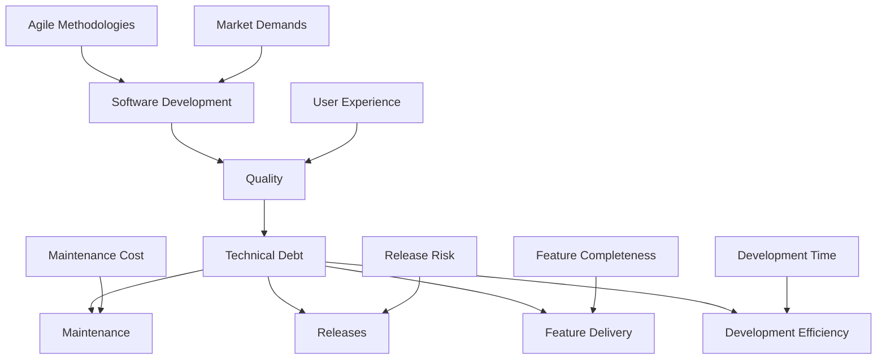
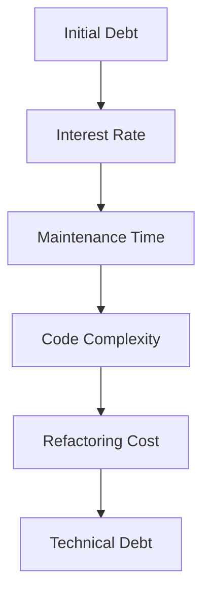

                 

### Introduction to Technical Debt

#### Background Introduction

Technical debt is a metaphor derived from the financial world, where it refers to the consequences of taking shortcuts in financial investments to achieve immediate returns. Similarly, in software development, technical debt represents the consequences of choosing quick, simple, or expedient solutions that compromise the quality of the codebase. This metaphor aptly describes the impact of cutting corners in software development, leading to a series of problems that accumulate over time.

The origins of technical debt can be traced back to the Agile Manifesto, which emphasizes iterative development and continuous delivery. As software teams strive to deliver new features quickly, they often prioritize functionality over quality. This can result in code that is difficult to maintain, understand, or extend. Over time, these shortcuts create a "debt" that must be paid off through additional effort and time to refactor or rewrite the code.

#### Core Concepts and Relationships

To better understand technical debt, it's essential to explore the core concepts and their relationships. Below is a simplified Mermaid flowchart illustrating the key components of technical debt:

This flowchart highlights the following relationships:

- **Quality**: Quality is the foundation of software development. Poor quality can lead to technical debt.
- **Technical Debt**: Technical debt arises when teams prioritize speed over quality. It accumulates as a series of design flaws, coding mistakes, and architectural shortcomings.
- **Maintenance**: Technical debt increases maintenance costs, as fixing bugs and updating features becomes more time-consuming and complicated.
- **Releases**: Technical debt can increase the risk of release failures, leading to delays and customer dissatisfaction.
- **Feature Delivery**: Technical debt can affect the completeness and quality of delivered features.
- **Development Efficiency**: Technical debt can hinder the team's efficiency, making it harder to develop new features.
- **Agile Methodologies**: Agile methodologies can exacerbate technical debt if they do not emphasize code quality.
- **Market Demands**: Rapid market changes can lead to pressure to deliver features quickly, potentially increasing technical debt.
- **User Experience**: Poor code quality can negatively impact the user experience.

#### Core Algorithm and Principles

To delve deeper into technical debt, let's discuss the core principles and an algorithm for assessing and managing it. We'll use a simplified mathematical model to illustrate these concepts:

Here, the key components of the model are:

- **Initial Debt (A)**: The initial technical debt represents the amount of debt accumulated before any interest is applied. This can include design flaws, code smells, or architectural issues.
- **Interest Rate (B)**: The interest rate represents the rate at which technical debt grows over time. This can be influenced by factors such as the complexity of the code, the frequency of changes, and the team's ability to address technical debt.
- **Maintenance Time (C)**: Maintenance time is the amount of time required to maintain the codebase, including bug fixes and updates. Higher technical debt can lead to increased maintenance time.
- **Code Complexity (D)**: Code complexity is a measure of how difficult the code is to understand and modify. High complexity can contribute to increased technical debt.
- **Refactoring Cost (E)**: Refactoring cost is the cost of improving the codebase by refactoring or rewriting parts of the code. This can help reduce technical debt.
- **Technical Debt (F)**: Technical debt is the total amount of debt, calculated as the sum of the initial debt and the interest accrued over time.

The formula for calculating technical debt can be expressed as:

$$
Technical\ Debt = Initial\ Debt + (Interest\ Rate \times Maintenance\ Time \times Code\ Complexity)
$$

#### Detailed Explanation and Example

Let's consider a simple example to illustrate how this model works. Suppose a team initially has $1000 of technical debt. The interest rate is 10% per month, and it takes the team 20 hours per month to maintain the codebase. If the code complexity is moderate (let's say a factor of 1.2), the technical debt after one month can be calculated as follows:

$$
Technical\ Debt = \$1000 + (0.10 \times 20 \times 1.2) = \$1000 + \$24 = \$1024
$$

This simple example highlights how technical debt can accumulate over time, even with moderate interest rates and maintenance efforts. By understanding the factors that contribute to technical debt, teams can take proactive measures to manage and mitigate its impact.

### Conclusion

In this section, we have explored the background, core concepts, and principles of technical debt. We introduced a simplified Mermaid flowchart to visualize the relationships between quality, technical debt, and various other factors. We also discussed a mathematical model to quantify technical debt, providing a formula and a detailed example.

Understanding technical debt is crucial for software development teams, as it helps them identify potential risks and take proactive measures to maintain code quality. By managing technical debt effectively, teams can ensure better development efficiency, reduced maintenance costs, and improved user experiences.

In the next section, we will delve deeper into the different types of technical debt and explore practical methods for quantifying and managing them. Stay tuned!

