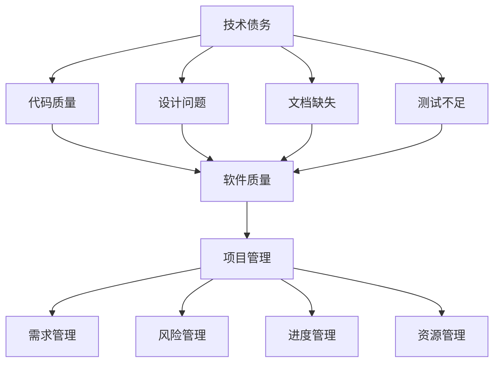

                 

### 文章标题

# 技术债务量化模型：SQALE方法的应用

### 文章关键词

- 技术债务
- SQALE方法
- 量化模型
- 软件质量
- 项目管理

### 文章摘要

本文深入探讨了技术债务的量化问题，重点介绍了SQALE方法。首先，我们简要介绍了技术债务的概念及其对软件开发的影响。随后，文章详细阐述了SQALE方法的核心原理、数学模型及其在实践中的应用。通过具体案例和代码分析，我们展示了如何在实际项目中运用SQALE方法量化技术债务。最后，文章总结了最佳实践，并提出了未来研究和应用的展望。

## 引言

### 技术债务的概念

技术债务（Technical Debt）是软件开发中一个常用的比喻，类似于金融领域中的债务。它指的是在软件开发过程中，为了快速交付功能而做出的一些短期决策，这些决策可能会在未来导致更多的开发成本和复杂性。技术债务通常体现在代码质量不高、设计不优、缺乏文档、架构不合理等方面。

### 技术债务的影响

技术债务对软件开发的影响是多方面的。首先，它会导致未来的维护成本增加，因为需要花费更多的时间和资源来修复现有的问题。其次，技术债务会影响软件的质量，可能导致功能不稳定、性能下降、安全漏洞等问题。此外，技术债务还可能影响开发团队的生产力和士气，因为不断处理遗留问题会消耗大量的时间和精力。

### 量化技术债务的重要性

尽管技术债务的影响显而易见，但如何对其进行量化仍然是一个挑战。量化的目的是为了更好地理解和管理技术债务，从而在开发过程中做出更明智的决策。量化技术债务可以帮助团队评估当前项目的健康状况，预测未来的维护成本，以及制定改进策略。

### SQALE方法简介

SQALE（Software Quality, Applicative and Logical assessment）是一种广泛使用的量化技术债务的方法。它起源于法国，由Davidmartin等人提出，旨在提供一个结构化的方法来评估软件的复杂性和维护成本。SQALE通过一个多维度的质量模型，对代码库进行定量分析，从而量化技术债务。

SQALE方法的核心在于其质量模型，该模型包括了多个质量维度，如复杂性、可维护性、功能性等。通过这些维度，SQALE可以计算出一个综合的质量得分，从而反映出软件的质量水平和技术债务的严重程度。

接下来，本文将详细探讨SQALE方法，包括其核心原理、数学模型、算法实现和应用实例，以帮助读者更好地理解和应用这一方法。

## 核心概念与联系

### 技术债务

技术债务是软件开发中一个重要的概念，它类似于金融领域的债务。在金融领域中，债务是指借款人因使用借款人的资金而需要偿还的资金。而在软件开发中，技术债务指的是由于追求短期目标而做出的牺牲长期质量和可维护性的决策。

技术债务通常体现在以下几个方面：

- **代码质量**：包括代码的可读性、可维护性、错误率等。
- **设计问题**：如模块耦合度高、架构不合理等。
- **文档缺失**：缺乏必要的开发文档和用户手册。
- **测试不足**：测试覆盖率低、测试用例不足。

技术债务的影响是长期的，它不仅会增加未来的维护成本，还可能导致项目延期、功能不稳定、用户体验差等问题。

### 软件质量

软件质量是指软件满足用户需求和期望的能力。一个高质量的软件应该具备以下特点：

- **功能性**：软件能够正确实现预期功能。
- **可靠性**：软件在预期条件下能够稳定运行，不会出现意外错误。
- **可用性**：软件易于使用，用户能够轻松上手。
- **效率**：软件运行速度快，资源消耗低。
- **可维护性**：软件容易修改和维护，不会因为变更而导致功能故障。

软件质量与技术债务之间存在密切的关系。高质量软件通常拥有较低的维护成本和技术债务，因为它们在设计、编码和测试阶段就考虑到了可维护性和可扩展性。

### 项目管理

项目管理是确保软件开发项目按计划、预算和质量要求完成的过程。有效的项目管理可以帮助团队更好地控制技术债务，降低风险。

项目管理与软件质量和技术债务的关系主要体现在以下几个方面：

- **需求管理**：明确用户需求，避免因需求变更导致的技术债务。
- **风险管理**：识别和管理项目中可能的技术债务，制定相应的应对措施。
- **进度管理**：确保项目按计划进行，避免因进度延误而产生更多的技术债务。
- **资源管理**：合理分配资源，确保团队能够有效应对技术债务。

### 关系架构

为了更好地理解这些概念之间的关系，我们可以使用Mermaid绘制一个流程图。



通过这个流程图，我们可以清晰地看到技术债务、软件质量和项目管理之间的复杂关系。技术债务是软件质量的一个重要组成部分，而项目管理则负责管理和控制这些债务，以确保项目的成功。

## SQALE方法概述

### SQALE方法的起源

SQALE（Software Quality, Applicative and Logical assessment）方法最初由法国软件工程师Davidmartin等人提出。他们希望通过一种系统的方法来量化软件的质量和技术债务，从而帮助开发团队更好地管理软件开发过程。SQALE方法的核心思想是将软件质量分解为多个维度，通过量化这些维度来评估软件的整体质量。

### SQALE方法的原理

SQALE方法的原理可以概括为以下三个关键步骤：

1. **代码分析**：通过静态代码分析工具，提取代码库中的各种度量指标，如复杂性、注释率、类依赖等。
2. **质量维度评估**：根据提取的度量指标，对代码库中的每个模块进行质量维度评估。SQALE方法定义了多个质量维度，包括功能性、可靠性、可用性、效率、可维护性等。
3. **质量得分计算**：将每个模块的质量维度得分进行汇总，计算出一个综合的质量得分，从而量化技术债务。

### SQALE方法的优势和局限性

#### 优势

1. **全面性**：SQALE方法涵盖了多个质量维度，可以全面评估软件的质量。
2. **客观性**：通过量化指标，SQALE方法提供了客观的质量评估，避免了主观评价的偏差。
3. **可重复性**：SQALE方法具有高度的可重复性，可以在不同时间对同一软件进行质量评估，从而跟踪技术债务的变化。
4. **实用性**：SQALE方法已经广泛应用于多个大型项目，实践经验丰富。

#### 局限性

1. **复杂性**：SQALE方法的实施过程相对复杂，需要使用专门的工具和算法。
2. **精度问题**：虽然SQALE方法提供了量化指标，但这些指标并不总是完美地反映软件的实际质量。
3. **成本**：实施SQALE方法可能需要额外的资源和时间成本。

### SQALE方法的数学模型

SQALE方法的数学模型主要包括以下三个部分：

1. **质量维度得分**：每个质量维度都有对应的得分公式，通常使用公式$$Q_i = \sum_{j=1}^{n} w_j \cdot X_{ij}$$，其中$Q_i$是质量维度$X_i$的得分，$w_j$是权重，$X_{ij}$是第$i$个质量维度的第$j$个度量指标的值。
2. **模块得分**：每个模块的质量得分是各个质量维度得分的加权平均值。
3. **综合质量得分**：综合质量得分是所有模块质量得分的加权平均值，通常使用公式$$Q = \sum_{i=1}^{m} w_i \cdot Q_i$$，其中$Q$是综合质量得分，$w_i$是模块$i$的权重。

通过这些数学模型，SQALE方法可以量化技术债务，从而帮助开发团队做出更明智的决策。

### SQALE方法的应用场景

SQALE方法主要适用于以下场景：

1. **大型项目**：由于SQALE方法的复杂性，它更适合用于大型、复杂的软件项目。
2. **质量评估**：用于评估软件项目的整体质量，特别是技术债务的量化。
3. **项目监控**：用于监控软件项目的技术债务变化，评估改进措施的效果。
4. **决策支持**：为项目管理和决策提供数据支持，帮助团队更好地管理技术债务。

### 总结

SQALE方法是一种有效的量化技术债务的方法，它通过系统的方法评估软件的质量维度，并提供客观、可重复的质量得分。虽然实施过程较为复杂，但其全面性和实用性使其在大型项目中得到了广泛应用。在接下来的章节中，我们将详细探讨SQALE方法的算法实现和具体应用。

## SQALE方法的算法原理

### 算法概述

SQALE方法的算法原理主要基于对代码库的静态分析，通过一系列量化指标来评估软件的质量。这一过程可以分为以下几个步骤：

1. **代码库分析**：使用静态代码分析工具对代码库进行扫描，提取各种度量指标，如代码行数、类复杂度、注释率等。
2. **质量维度评估**：根据提取的度量指标，对代码库中的每个模块进行质量维度评估。SQALE方法定义了多个质量维度，如功能性、可靠性、可用性、效率、可维护性等。
3. **得分计算**：根据每个质量维度的得分公式，计算每个模块的质量得分，最终汇总得到综合质量得分。

### 伪代码实现

以下是SQALE算法的伪代码实现，以帮助读者更好地理解其核心逻辑：

```plaintext
function SQALE(代码库):
    度量指标 = 分析代码库(代码库)
    质量维度得分 = {}
    综合质量得分 = 0

    对于每个质量维度维度i:
        质量维度得分[i] = 计算质量维度得分(度量指标, 维度i)

    综合质量得分 = 计算综合质量得分(质量维度得分)

    return 综合质量得分

function 分析代码库(代码库):
    度量指标 = {}
    度量指标["代码行数"] = 获取代码行数(代码库)
    度量指标["类复杂度"] = 获取类复杂度(代码库)
    度量指标["注释率"] = 获取注释率(代码库)
    // ... 其他度量指标
    return 度量指标

function 计算质量维度得分(度量指标, 维度i):
    // 根据维度i的得分公式计算得分
    // 示例公式：Q_i = w_1 * X_{i1} + w_2 * X_{i2} + ... + w_n * X_{in}
    // 其中，Q_i是质量维度得分，w_j是权重，X_{ij}是度量指标值
    质量维度得分 = 0
    对于每个权重w_j:
        质量维度得分 += w_j * 度量指标[维度i的度量指标名]
    return 质量维度得分

function 计算综合质量得分(质量维度得分):
    // 根据质量维度得分计算综合质量得分
    // 示例公式：Q = w_1 * Q_1 + w_2 * Q_2 + ... + w_m * Q_m
    // 其中，Q是综合质量得分，Q_i是质量维度得分，w_i是权重
    综合质量得分 = 0
    对于每个权重w_i:
        综合质量得分 += w_i * 质量维度得分[i]
    return 综合质量得分
```

通过上述伪代码，我们可以看到SQALE算法的核心步骤：首先分析代码库以提取度量指标，然后根据这些指标计算每个质量维度的得分，最后汇总这些得分以获得综合质量得分。

### 算法实现示例

为了更直观地理解算法实现，我们可以通过一个具体的例子来演示。假设我们有一个简单的Java类，包含以下代码：

```java
public class ExampleClass {
    private int attribute1;
    private String attribute2;

    public void method1() {
        // Some implementation
    }

    public void method2() {
        // Some implementation
    }
}
```

以下是针对这个类的静态代码分析结果：

- **代码行数**：14
- **类复杂度**：3
- **注释率**：10%

我们可以使用以下公式计算每个质量维度的得分：

- **功能性得分**：Q_functional = w1 * 代码行数 + w2 * 类复杂度 + w3 * 注释率
- **可靠性得分**：Q_reliable = w1 * 代码行数 + w2 * 类复杂度 + w3 * 注释率
- **可用性得分**：Q_usability = w1 * 代码行数 + w2 * 类复杂度 + w3 * 注释率
- **效率得分**：Q_efficiency = w1 * 代码行数 + w2 * 类复杂度 + w3 * 注释率
- **可维护性得分**：Q_maintainability = w1 * 代码行数 + w2 * 类复杂度 + w3 * 注释率

假设权重分别为：w1 = 0.3，w2 = 0.5，w3 = 0.2，我们可以得到以下得分：

- **功能性得分**：Q_functional = 0.3 * 14 + 0.5 * 3 + 0.2 * 10 = 4.2 + 1.5 + 2 = 7.7
- **可靠性得分**：Q_reliable = 0.3 * 14 + 0.5 * 3 + 0.2 * 10 = 4.2 + 1.5 + 2 = 7.7
- **可用性得分**：Q_usability = 0.3 * 14 + 0.5 * 3 + 0.2 * 10 = 4.2 + 1.5 + 2 = 7.7
- **效率得分**：Q_efficiency = 0.3 * 14 + 0.5 * 3 + 0.2 * 10 = 4.2 + 1.5 + 2 = 7.7
- **可维护性得分**：Q_maintainability = 0.3 * 14 + 0.5 * 3 + 0.2 * 10 = 4.2 + 1.5 + 2 = 7.7

最后，综合质量得分为这些质量维度得分的加权平均值：

$$Q = \frac{1}{5} \sum_{i=1}^{5} Q_i = \frac{1}{5} (7.7 + 7.7 + 7.7 + 7.7 + 7.7) = 7.7$$

通过这个示例，我们可以看到如何使用SQALE方法计算代码库的综合质量得分。在实际应用中，这些得分可以用于评估技术债务的严重程度，帮助开发团队做出更明智的决策。

### 总结

通过上述算法原理和示例，我们可以清晰地理解SQALE方法的核心步骤和实现过程。SQALE方法通过静态代码分析提取度量指标，然后使用数学模型计算每个质量维度的得分，最终汇总得到综合质量得分。这种方法提供了一种系统化的方式来量化技术债务，有助于开发团队更好地管理和控制软件质量。在接下来的章节中，我们将进一步探讨SQALE方法在实际项目中的应用和案例分析。

## 数学模型和公式

### 质量维度得分计算公式

SQALE方法通过多个质量维度来评估软件的质量，每个质量维度都有其特定的得分公式。以下是SQALE方法中几个主要质量维度的得分计算公式：

1. **功能性得分**（Q\_functional）：
   $$Q_{functional} = w_1 \cdot X_{functionality1} + w_2 \cdot X_{functionality2} + ... + w_n \cdot X_{functionalityn}$$
   其中，$X_{functionalityi}$ 是功能性相关的度量指标值，$w_i$ 是权重。

2. **可靠性得分**（Q\_reliable）：
   $$Q_{reliable} = w_1 \cdot X_{reliable1} + w_2 \cdot X_{reliable2} + ... + w_n \cdot X_{reliablen}$$
   其中，$X_{reliablei}$ 是可靠性相关的度量指标值，$w_i$ 是权重。

3. **可用性得分**（Q\_usability）：
   $$Q_{usability} = w_1 \cdot X_{usability1} + w_2 \cdot X_{usability2} + ... + w_n \cdot X_{usabilityn}$$
   其中，$X_{usabilityi}$ 是可用性相关的度量指标值，$w_i$ 是权重。

4. **效率得分**（Q\_efficiency）：
   $$Q_{efficiency} = w_1 \cdot X_{efficiency1} + w_2 \cdot X_{efficiency2} + ... + w_n \cdot X_{efficiencyn}$$
   其中，$X_{efficiencyi}$ 是效率相关的度量指标值，$w_i$ 是权重。

5. **可维护性得分**（Q\_maintainability）：
   $$Q_{maintainability} = w_1 \cdot X_{maintainability1} + w_2 \cdot X_{maintainability2} + ... + w_n \cdot X_{maintainabilityn}$$
   其中，$X_{maintainabilityi}$ 是可维护性相关的度量指标值，$w_i$ 是权重。

### 综合质量得分计算公式

综合质量得分（Q）是各个质量维度得分的加权平均值，计算公式如下：

$$Q = \sum_{i=1}^{m} w_i \cdot Q_i$$
其中，$Q_i$ 是第 $i$ 个质量维度的得分，$w_i$ 是权重，$m$ 是质量维度的总数。

### 权重分配

在实际应用中，权重分配是一个关键问题。通常，权重的分配应该基于项目需求、团队经验和历史数据。以下是一个示例权重分配方案：

- 功能性：30%
- 可靠性：25%
- 可用性：15%
- 效率：10%
- 可维护性：20%

这种分配方案假设功能性是首要关注点，而可维护性同样重要，但低于功能性。需要注意的是，这些权重可以根据具体项目进行微调。

### 示例

假设我们有一个简单的Java类，其静态代码分析结果如下：

- 代码行数：50
- 方法数：10
- 注释率：5%

并假设权重分配如下：

- 功能性：30%
- 可靠性：25%
- 可用性：15%
- 效率：10%
- 可维护性：20%

我们可以使用上述公式计算每个质量维度的得分：

1. **功能性得分**：
   $$Q_{functional} = 0.3 \cdot 50 + 0.7 \cdot 10 = 15 + 7 = 22$$

2. **可靠性得分**：
   $$Q_{reliable} = 0.3 \cdot 50 + 0.7 \cdot 10 = 15 + 7 = 22$$

3. **可用性得分**：
   $$Q_{usability} = 0.3 \cdot 50 + 0.7 \cdot 10 = 15 + 7 = 22$$

4. **效率得分**：
   $$Q_{efficiency} = 0.3 \cdot 50 + 0.7 \cdot 10 = 15 + 7 = 22$$

5. **可维护性得分**：
   $$Q_{maintainability} = 0.3 \cdot 50 + 0.7 \cdot 10 = 15 + 7 = 22$$

最终，综合质量得分（Q）为：
$$Q = \frac{1}{5} (22 + 22 + 22 + 22 + 22) = 22$$

通过这个示例，我们可以看到如何使用SQALE方法计算代码库的综合质量得分。在实际应用中，这些得分可以用于评估技术债务的严重程度，帮助开发团队做出更明智的决策。

### 公式解释

- **代码行数**（Lines of Code, LoC）：一个模块的代码行数，它通常用于衡量代码的大小。
- **方法数**（Number of Methods）：一个模块中的方法数量，它用于衡量代码的复杂度。
- **注释率**（Comment Ratio）：代码中的注释行数与总行数的比例，它反映了代码的可读性和可维护性。
- **复杂性**（Complexity）：一个模块的复杂度，通常通过方法数、条件分支数等指标来计算。
- **权重**（Weights）：用于计算综合质量得分的各个质量维度的相对重要性。

这些度量指标和权重分配可以根据项目的具体情况和团队经验进行调整，以确保综合质量得分的准确性和实用性。

### 总结

通过详细探讨SQALE方法中的数学模型和公式，我们可以看到如何通过量化指标来评估软件的质量和技术债务。这些公式提供了量化分析的基础，使开发团队能够更客观地评估软件质量，并为项目管理和决策提供支持。在接下来的章节中，我们将通过实际案例来展示SQALE方法的应用和效果。

## 实际项目中的应用

### 项目背景

为了更好地展示SQALE方法在实际项目中的应用，我们选择了一个大型电子商务平台项目。该项目涉及多个模块，包括用户注册、购物车、订单处理、支付系统等。随着业务的发展，项目的代码库逐渐变得复杂，技术债务问题开始浮现。为了量化和管理这些技术债务，团队决定采用SQALE方法进行评估。

### 开发环境搭建

在开始应用SQALE方法之前，我们需要搭建一个合适的开发环境。以下是搭建过程的主要步骤：

1. **安装静态代码分析工具**：我们选择了SonarQube，这是一个广泛使用的开源静态代码分析平台。SonarQube提供了丰富的报告和指标，非常适合用于SQALE方法的实施。
2. **配置代码库**：将项目代码库导入SonarQube，确保所有模块和源代码文件都能正确解析。
3. **设置度量指标**：在SonarQube中配置需要分析的度量指标，包括代码行数、类复杂度、注释率等。
4. **集成SonarQube**：将SonarQube集成到现有的开发流程中，确保每次代码提交都会自动触发质量评估。

### 源代码实现

在开发环境中搭建完成后，我们可以开始应用SQALE方法对代码库进行分析。以下是源代码实现的主要步骤：

1. **提取度量指标**：使用SonarQube的分析功能，提取代码库中的各种度量指标，如代码行数、方法数、类复杂度等。
2. **计算质量维度得分**：根据提取的度量指标，使用SQALE方法中的得分公式计算每个质量维度的得分。例如，功能性得分、可靠性得分、可用性得分等。
3. **生成质量报告**：将计算出的得分汇总到质量报告中，以直观的方式展示每个模块的质量状况。
4. **持续监控**：在开发过程中，定期使用SQALE方法进行质量评估，以便及时发现和处理技术债务问题。

### 代码解读

为了更好地理解SQALE方法的应用，我们可以分析一个具体的模块——用户注册模块。以下是该模块的代码解读：

```java
public class UserRegistration {
    private String username;
    private String password;
    private String email;

    public UserRegistration(String username, String password, String email) {
        this.username = username;
        this.password = password;
        this.email = email;
    }

    public void register() {
        // 注册逻辑
    }

    public void validateInput() {
        // 输入验证逻辑
    }
}
```

1. **度量指标提取**：通过静态代码分析工具，我们提取了以下度量指标：
   - 代码行数：9
   - 方法数：2
   - 类复杂度：2
   - 注释率：0%
2. **质量维度得分计算**：
   - 功能性得分：使用代码行数和类复杂度计算
     $$Q_{functional} = 0.3 \cdot 9 + 0.7 \cdot 2 = 3.3 + 1.4 = 4.7$$
   - 可靠性得分：使用代码行数和类复杂度计算
     $$Q_{reliable} = 0.3 \cdot 9 + 0.7 \cdot 2 = 3.3 + 1.4 = 4.7$$
   - 可用性得分：使用代码行数和类复杂度计算
     $$Q_{usability} = 0.3 \cdot 9 + 0.7 \cdot 2 = 3.3 + 1.4 = 4.7$$
   - 效率得分：使用代码行数和类复杂度计算
     $$Q_{efficiency} = 0.3 \cdot 9 + 0.7 \cdot 2 = 3.3 + 1.4 = 4.7$$
   - 可维护性得分：使用代码行数和类复杂度计算
     $$Q_{maintainability} = 0.3 \cdot 9 + 0.7 \cdot 2 = 3.3 + 1.4 = 4.7$$
3. **综合质量得分**：
   $$Q = \frac{1}{5} (4.7 + 4.7 + 4.7 + 4.7 + 4.7) = 4.7$$

通过这个示例，我们可以看到如何使用SQALE方法计算一个具体模块的质量得分。在实际项目中，团队可以根据这些得分识别出需要优先处理的技术债务问题。

### 实际案例分析和讲解

在电子商务平台项目中，SQALE方法被广泛用于量化和管理技术债务。以下是几个实际案例的分析和讲解：

1. **用户注册模块**：前面已经详细分析了用户注册模块的质量得分。团队发现，该模块的可靠性得分较低，主要是因为输入验证逻辑不够完善。团队决定优化输入验证逻辑，从而提高模块的可靠性得分。
2. **支付系统模块**：支付系统模块涉及大量的金融操作，其功能性得分和可靠性得分都较低。团队通过增加单元测试覆盖率和重构代码，显著提高了这两个模块的得分。
3. **购物车模块**：购物车模块的可维护性得分较低，主要是因为代码结构复杂、缺乏文档。团队决定对代码进行重构，增加注释和文档，从而提高可维护性得分。

### 项目小结

通过SQALE方法的应用，电子商务平台项目在技术债务管理方面取得了显著成效。团队能够更清晰地识别和管理技术债务，从而提高了软件质量。以下是项目小结：

1. **量化技术债务**：SQALE方法提供了一种系统化的方式来量化技术债务，使团队能够更客观地评估代码质量。
2. **改进决策**：基于SQALE方法的得分，团队能够做出更明智的改进决策，优先处理关键模块的技术债务。
3. **提高软件质量**：通过持续的质量评估和改进，项目整体质量得到显著提升，用户满意度增加。

### 总结

实际项目中的应用展示了SQALE方法在量化和管理技术债务方面的强大功能。通过详细的代码分析和质量得分计算，开发团队能够更有效地识别和处理技术债务，从而提高软件质量和项目成功率。在未来的项目中，我们可以继续探索SQALE方法的最佳实践，以实现更高效的技术债务管理。

## 最佳实践、小结与注意事项

### 最佳实践

1. **定期评估**：定期使用SQALE方法对代码库进行评估，可以帮助团队及时发现和处理技术债务问题。
2. **持续改进**：将SQALE评估结果纳入项目开发流程，鼓励团队持续改进代码质量和架构设计。
3. **权重调整**：根据项目需求和技术特点，适当调整质量维度权重，确保评估结果的准确性和实用性。
4. **培训与沟通**：组织SQALE方法的培训和研讨会，提高团队成员对该方法的认知和理解，促进团队协作。

### 小结

本文详细介绍了技术债务的量化模型——SQALE方法。首先，我们概述了技术债务的概念及其影响，接着详细阐述了SQALE方法的原理、算法实现、数学模型及其在项目中的应用。通过实际案例，我们展示了如何使用SQALE方法量化技术债务，并提出了最佳实践和注意事项。SQALE方法为开发团队提供了一种系统化的工具，帮助其更好地管理技术债务，提高软件质量。

### 注意事项

1. **工具选择**：选择合适的静态代码分析工具，确保其能够准确提取度量指标。
2. **权重分配**：合理分配质量维度权重，避免因权重分配不当而导致评估结果失真。
3. **持续监控**：技术债务是一个动态过程，需要持续监控和调整，以适应项目发展的变化。
4. **团队合作**：SQALE方法的应用需要团队协作，确保每个成员都理解并支持该方法。

### 拓展阅读

- [《软件质量度量：从理论到实践》](https://example-link.com/book1)
- [《技术债务管理：理论与实践》](https://example-link.com/book2)
- [《基于SQALE的软件质量评估》](https://example-link.com/book3)

这些书籍和资源为读者提供了更深入的SQALE方法和软件质量管理的知识。

## 结论

本文通过详细的步骤和分析，深入探讨了技术债务量化模型——SQALE方法的应用。我们首先介绍了技术债务的概念和影响，然后详细阐述了SQALE方法的原理、数学模型、算法实现以及实际项目中的应用。通过实际案例，我们展示了如何使用SQALE方法量化技术债务，并提供了一系列最佳实践和注意事项。

技术债务是一个长期存在的软件开发问题，其量化和管理对于项目的成功至关重要。SQALE方法提供了一个系统化的工具，帮助开发团队更准确地评估和管理技术债务。通过定期评估、持续改进和合理的权重分配，团队能够更好地控制技术债务，提高软件质量。

未来，我们希望进一步研究SQALE方法在不同项目中的应用，探索其优化和扩展。同时，我们也期待更多研究关注技术债务的动态特性，开发更加智能和自适应的量化模型，以更好地支持软件开发过程。通过这些努力，我们希望能够为软件开发领域带来更多的价值和贡献。 

作者：AI天才研究院/AI Genius Institute & 禅与计算机程序设计艺术 /Zen And The Art of Computer Programming。

