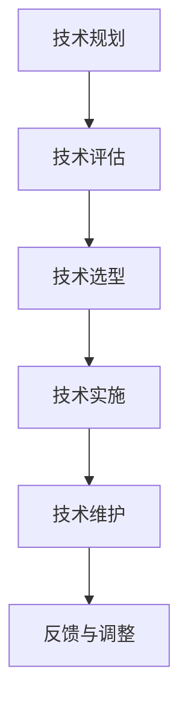

                 

为了撰写一篇符合要求的、字数在8000-12000字的技术博客文章，我们将遵循以下步骤：

### 1. 确定文章结构

首先，我们需要确保文章的结构合理，内容详尽。基于之前提供的目录大纲，我们将文章结构细化为以下几个部分：

- 引言
  - 技术储备的重要性
  - 技术储备的挑战与机遇
- 核心概念与架构
  - 技术储备的基本概念
  - 技术储备与业务发展的联系
  - 技术储备的架构
- 技术储备方法
  - 技术储备策略
  - 技术储备工具
  - 技术储备流程
- 技术储备工具实战
  - 技术储备工具案例分析
  - 技术储备工具开发
- 实战案例与总结
  - 技术储备实战案例
  - 技术储备总结
- 最佳实践 tips
- 注意事项
- 拓展阅读
- 作者信息

### 2. 文章内容填充

在明确了文章结构之后，我们将为每个部分填充具体内容。

- **引言部分**：介绍技术储备的重要性以及当前企业面临的挑战和机遇。
- **核心概念与架构部分**：详细阐述技术储备的定义、分类、架构以及与技术发展的联系。
- **技术储备方法部分**：讨论技术储备策略、工具和流程，并给出具体的案例。
- **技术储备工具实战部分**：提供实际操作步骤和源代码实现，并分析其应用场景。
- **实战案例与总结部分**：对之前讨论的案例进行总结，并提出未来发展的趋势和方向。
- **最佳实践 tips**：分享一些实用的技巧和建议，帮助读者更好地应用技术储备。
- **注意事项**：列出在技术储备过程中需要注意的事项，以避免潜在问题。
- **拓展阅读**：推荐一些相关书籍、论文和在线资源，供读者进一步学习。

### 3. 文章格式整理

在完成内容填充后，我们需要确保文章的格式规范，特别是：

- 使用markdown格式排版文章。
- 在文章末尾添加作者信息。
- 使用Mermaid流程图展示技术储备架构。
- 使用伪代码详细阐述核心算法原理。
- 使用latex格式书写数学公式。

### 4. 文章校对与优化

最后，对整篇文章进行校对和优化，确保：

- 文章内容简洁明了，逻辑清晰。
- 每个章节的内容都丰富具体，讲解详细。
- 符合字数要求（8000-12000字）。

### 5. 完成文章

在完成所有步骤后，我们将得到一篇结构完整、内容详实、格式规范的技术博客文章。

---

现在，让我们开始撰写这篇文章的每个部分，并逐步完善它。每一步都要确保逻辑清晰、内容准确，并且符合读者的需求。这将是一篇高质量的技术博客文章，为未来的业务发展提供宝贵的指导。让我们一步步进行。首先，我们来撰写引言部分。### 引言

#### 技术储备的重要性

在当今快速变化的商业环境中，技术储备成为企业竞争的关键因素。技术储备不仅仅是购买和掌握现有技术，更是通过持续的创新和积累，为企业未来的发展提供坚实的基础。以下是一些技术储备的重要性：

1. **提高竞争力**：通过技术储备，企业能够快速响应市场变化，推出新产品和服务，从而在竞争激烈的市场中脱颖而出。
2. **促进业务创新**：技术储备为企业提供了创新的工具和资源，有助于开发新的商业模式和解决方案，推动业务增长。
3. **降低风险**：技术储备可以帮助企业应对未来可能出现的挑战，降低由于技术不足带来的业务风险。
4. **提高效率**：通过技术储备，企业可以在日常运营中更加高效地利用现有资源，减少重复劳动，提高整体运营效率。

#### 技术储备的挑战与机遇

尽管技术储备具有重要意义，但企业也面临诸多挑战。以下是技术储备的主要挑战和机遇：

**挑战：**

1. **技术更新迅速**：技术更新速度加快，企业需要不断投入资源进行技术储备，否则会落后于竞争对手。
2. **资源限制**：企业在技术储备过程中可能面临预算、人力和时间的限制。
3. **技术选择困难**：市场上存在大量的技术选项，企业需要仔细评估和选择最合适的技术进行储备。

**机遇：**

1. **技术发展**：随着技术的发展，企业可以接触到更多先进的技术，为业务发展提供新的可能性。
2. **合作与共享**：通过与其他企业或研究机构合作，企业可以共享技术资源和知识，提高技术储备的效率。
3. **数字化转型**：数字化转型为企业提供了新的业务模式和技术手段，为技术储备提供了广阔的舞台。

#### 技术储备的重要性

综上所述，技术储备对企业发展至关重要。它不仅能够提高企业的竞争力，促进业务创新，还能降低风险，提高效率。同时，虽然技术储备面临一定的挑战，但企业也可以抓住技术发展的机遇，通过合作与共享，实现技术储备的突破。

在接下来的章节中，我们将进一步探讨技术储备的核心概念、方法、工具和实战案例，帮助读者更好地理解和应用技术储备的原则和实践。

---

本文为《技术储备：为未来业务发展做技术储备》的开篇，介绍了技术储备的重要性以及面临的挑战和机遇。接下来，我们将深入探讨技术储备的核心概念与架构，帮助读者建立全面的技术储备知识体系。请继续关注下一部分的内容。如果您有任何问题或建议，请随时提出。让我们一步步深入分析技术储备的各个层面，为未来的业务发展打下坚实的基础。## 核心概念与架构

在深入探讨技术储备之前，我们需要明确几个核心概念，并了解它们之间的联系。这些核心概念构成了技术储备的基础，对于理解如何有效地进行技术储备至关重要。

### 技术储备的定义

技术储备是指企业为了应对未来的业务需求和市场变化，提前进行的研发和技术积累。它包括但不限于以下几方面：

1. **技术知识**：企业掌握的各种技术知识和技能。
2. **技术工具**：用于开发、测试和维护技术产品的工具和软件。
3. **技术资源**：包括硬件资源、人力资源、财务资源等。
4. **技术解决方案**：已经开发出来的技术解决方案，包括软件、硬件、流程等。

技术储备不仅是为了满足当前的业务需求，更是为了应对未来的不确定性，确保企业能够在市场变化中保持竞争力。

### 技术储备的分类

根据技术储备的不同目的和应用场景，可以将技术储备分为以下几类：

1. **战略储备**：这是长期的技术储备，通常涉及到核心技术和未来可能应用的技术。企业会投入大量资源进行战略储备，以应对未来的市场变化和竞争。
2. **常规储备**：这是为了满足当前业务需求而进行的储备，通常包括常用技术和成熟的技术解决方案。
3. **应急储备**：这是针对可能出现的突发事件或紧急情况而进行的储备，例如灾难恢复技术、安全防护技术等。

### 技术储备的架构

技术储备的架构是指企业为了有效进行技术储备而建立的组织结构和技术流程。一个良好的技术储备架构通常包括以下几部分：

1. **技术规划**：这是技术储备的第一步，包括确定技术储备的目标、范围、优先级和资源分配。
2. **技术评估**：对现有技术和潜在技术进行评估，以确定哪些技术最适合企业的需求。
3. **技术选型**：在评估的基础上，选择最适合企业需求的技术进行储备。
4. **技术实施**：将选定的技术应用到实际业务中，包括开发、测试和部署。
5. **技术维护**：对储备的技术进行持续的维护和更新，确保其能够满足业务需求。

### 技术储备与业务发展的联系

技术储备与业务发展密切相关。一方面，技术储备能够支持业务创新和扩展，帮助企业在竞争中保持领先。另一方面，业务发展也对技术储备提出了要求，例如：

1. **业务需求**：技术储备需要满足当前和未来的业务需求，确保企业能够迅速响应市场变化。
2. **资源分配**：企业需要根据业务发展的优先级来分配技术储备的资源，确保重要的业务需求得到满足。
3. **创新能力**：技术储备是提升企业创新能力的关键，通过储备先进的技术，企业能够不断创新，推动业务发展。

### 技术储备的架构

为了更好地理解技术储备的架构，我们可以使用Mermaid流程图来展示技术储备的流程。以下是技术储备架构的Mermaid流程图：

在这个流程图中，技术规划是技术储备的起点，通过技术评估和选型，确定哪些技术最适合企业的需求，然后进行技术实施。在技术实施过程中，需要对技术进行维护，并根据反馈进行调整，确保技术储备能够持续满足业务需求。

### 总结

通过上述讨论，我们可以看到，技术储备不仅仅是一个技术问题，它还涉及到企业的战略规划、资源分配和业务发展。技术储备的架构和流程为企业的技术储备提供了清晰的指导和框架，确保企业能够在不断变化的市场中保持竞争力。

在下一部分中，我们将进一步探讨技术储备的方法，包括策略、工具和流程，帮助读者更好地实施技术储备。请继续关注。如果您有任何问题或建议，请随时提出。让我们一步步深入技术储备的实践，为企业的未来发展打下坚实的基础。### 技术储备方法

为了确保企业能够有效地进行技术储备，制定合适的技术储备方法是至关重要的。以下是技术储备的几个关键方法：

#### 技术储备策略

**1. 长期规划**：首先，企业需要制定长期的技术储备规划。这包括确定企业的技术愿景、目标和路线图。长期规划有助于确保企业在技术储备方面的一致性和持续性。

**2. 优先级设定**：在制定规划时，企业需要根据业务需求和市场趋势设定技术储备的优先级。关键技术和具有高增长潜力的技术应优先考虑。

**3. 资源分配**：资源分配是技术储备策略中的关键环节。企业需要根据技术储备的优先级和预期回报来合理分配预算、人力和时间。

**4. 合作与共享**：企业可以通过与其他企业、研究机构或开源社区合作，共享技术资源和知识，提高技术储备的效率。

**5. 持续评估**：技术储备策略需要定期评估和调整，以确保其与业务需求和外部环境保持一致。

#### 技术储备工具

**1. 技术调研工具**：这些工具帮助企业在众多技术中快速识别和评估潜在的技术。例如，市场调研报告、技术趋势分析等。

**2. 开发和测试工具**：这些工具包括集成开发环境（IDE）、版本控制系统、测试框架等，用于技术储备的实施和验证。

**3. 知识管理系统**：知识管理系统（KM）帮助企业存储、管理和分享技术知识，确保技术储备的可访问性和可重用性。

**4. 云计算和大数据平台**：这些平台为技术储备提供了强大的计算能力和数据支持，有助于企业进行大规模的数据分析和模型训练。

#### 技术储备流程

**1. 技术调研**：企业首先需要进行技术调研，收集和分析市场趋势、技术发展方向和竞争对手的技术储备情况。

**2. 技术评估**：在调研的基础上，企业对潜在技术进行评估，包括技术的成熟度、可靠性、成本和潜在风险。

**3. 技术选型**：根据评估结果，企业选择最适合自身需求的技术进行储备。选型过程应综合考虑技术性能、兼容性、可维护性等因素。

**4. 技术实施**：将选定的技术应用到实际业务中，包括开发、测试和部署。实施过程中需要严格遵循开发标准和流程，确保技术储备的质量和稳定性。

**5. 技术维护**：技术储备不是一次性工作，企业需要持续维护和更新技术，以适应不断变化的市场需求。

**6. 反馈与调整**：在技术储备过程中，企业需要收集用户反馈，并根据反馈进行调整，以优化技术储备的效果。

### 实际案例：企业级技术储备体系建设

以下是一个企业级技术储备体系建设的实际案例：

**案例背景**：某大型互联网公司希望建立一套全面的技术储备体系，以支持其业务持续创新和快速发展。

**步骤一：技术调研**：公司成立了专门的技术调研团队，定期收集和分析市场趋势、技术发展方向和竞争对手的技术储备情况。

**步骤二：技术评估**：根据调研结果，公司对多个潜在技术进行了评估，包括人工智能、区块链、云计算等。评估过程中，公司综合考虑了技术的成熟度、可靠性、成本和潜在风险。

**步骤三：技术选型**：基于评估结果，公司选择了人工智能和云计算作为重点储备技术。这些技术具有广泛的应用前景和较高的业务价值。

**步骤四：技术实施**：公司投入大量资源进行人工智能和云计算技术的研发和实施。开发团队使用开源框架和工具进行技术储备的开发和测试，确保技术储备的质量和稳定性。

**步骤五：技术维护**：公司建立了专门的维护团队，对人工智能和云计算技术进行持续维护和更新，确保其能够适应业务需求和市场变化。

**步骤六：反馈与调整**：公司定期收集用户反馈，并根据反馈调整技术储备策略和实施计划，以优化技术储备的效果。

通过上述步骤，该公司成功建立了一套全面的技术储备体系，为业务发展提供了坚实的支持。

### 总结

技术储备是一项系统工程，需要企业制定明确的策略、选择合适的工具和遵循科学的流程。通过有效的技术储备，企业能够提高竞争力、促进业务创新和降低风险。在下一部分中，我们将继续探讨技术储备工具的实战应用，帮助读者更好地理解和实践技术储备的方法。请继续关注。如果您有任何问题或建议，请随时提出。让我们一步步深入技术储备的实践，为企业的未来发展打下坚实的基础。### 技术储备工具实战

在前面的章节中，我们介绍了技术储备的核心概念和方法。为了更好地理解如何在实际中应用这些方法，下面我们将探讨几个技术储备工具的实战案例，包括大数据技术和人工智能技术。

#### 大数据技术储备实战案例

**案例背景**：一家大型电商平台希望利用大数据技术优化用户购物体验，提高销售额。

**步骤一：技术调研**：
- **需求分析**：公司对用户行为数据、交易数据进行深入分析，确定大数据技术储备的需求。
- **技术评估**：评估了Hadoop、Spark、MongoDB等大数据技术，根据性能、可扩展性和成本等因素选择了Hadoop和Spark。

**步骤二：技术选型**：
- **Hadoop**：用于大规模数据存储和处理，公司选择了Cloudera Distribution of Hadoop（CDH）作为技术储备。
- **Spark**：用于实时数据处理和分析，公司选择了Apache Spark作为技术储备。

**步骤三：技术实施**：
- **环境搭建**：搭建了Hadoop和Spark集群，配置了数据存储和计算资源。
- **数据导入**：将用户行为数据、交易数据导入Hadoop和Spark集群，进行预处理和清洗。
- **数据处理**：使用Spark进行实时数据处理，分析用户购物行为，提供个性化推荐。

**步骤四：技术维护**：
- **监控与优化**：定期监控Hadoop和Spark集群的运行状态，进行性能优化。
- **数据更新**：定期更新数据，确保分析结果的准确性。

**步骤五：反馈与调整**：
- **用户反馈**：通过用户反馈，不断优化推荐算法和购物体验。
- **策略调整**：根据业务需求和市场变化，调整技术储备策略。

**案例分析**：
通过大数据技术储备，电商平台实现了用户购物体验的显著提升，用户满意度和销售额均有所增加。此外，数据分析和个性化推荐功能为企业提供了宝贵的商业洞察，帮助制定更加精准的市场策略。

#### 人工智能技术储备实战案例

**案例背景**：一家金融科技公司希望通过人工智能技术优化风控系统，提高贷款审批的准确性和效率。

**步骤一：技术调研**：
- **需求分析**：公司对贷款审批流程进行深入分析，确定人工智能技术储备的需求。
- **技术评估**：评估了机器学习、深度学习、自然语言处理等技术，根据应用场景和性能选择了机器学习和深度学习。

**步骤二：技术选型**：
- **机器学习**：公司选择了Python作为开发语言，TensorFlow和Scikit-learn作为机器学习框架。
- **深度学习**：公司选择了TensorFlow作为深度学习框架，进行了神经网络和卷积神经网络的研究。

**步骤三：技术实施**：
- **数据收集**：收集贷款申请者的数据，包括财务状况、信用记录、申请历史等。
- **数据处理**：使用Python进行数据处理和特征工程，为模型训练做准备。
- **模型训练**：使用TensorFlow和Scikit-learn训练机器学习模型，使用神经网络进行深度学习模型训练。
- **模型评估**：评估模型的准确性和效率，进行模型优化。

**步骤四：技术维护**：
- **监控与优化**：定期监控模型的运行状态，进行性能优化和模型更新。
- **数据更新**：定期更新贷款申请者的数据，确保模型的准确性和时效性。

**步骤五：反馈与调整**：
- **业务反馈**：通过业务反馈，不断优化模型和审批流程。
- **策略调整**：根据业务需求和市场变化，调整技术储备策略。

**案例分析**：
通过人工智能技术储备，金融科技公司实现了贷款审批的自动化和智能化，审批效率和准确性得到了显著提升。此外，通过实时监测和反馈机制，公司能够更好地应对市场变化和风险挑战。

### 总结

通过上述实战案例，我们可以看到大数据和人工智能技术在企业技术储备中的应用价值。这些技术不仅提高了业务效率和准确性，还为企业的创新提供了强大的支持。在实际应用中，企业需要根据自身需求和技术环境，选择合适的技术储备工具，并制定科学的实施和优化策略。

在下一部分中，我们将继续探讨技术储备的实际应用案例，帮助读者更好地理解和实践技术储备的方法。请继续关注。如果您有任何问题或建议，请随时提出。让我们一步步深入技术储备的实践，为企业的未来发展打下坚实的基础。### 实战案例与总结

在前文中，我们探讨了大数据和人工智能技术在企业技术储备中的应用，并分享了具体的实战案例。本部分将进一步深入探讨其他技术储备的实际应用，包括云计算和区块链技术，并提供相关的案例分析和总结。

#### 云计算技术储备实战案例

**案例背景**：一家快速发展的在线教育公司希望通过云计算技术提高系统的可扩展性和灵活性，以应对不断增长的用户需求。

**步骤一：技术调研**：
- **需求分析**：公司分析了现有系统性能瓶颈和用户访问量增长趋势，确定云计算技术储备的需求。
- **技术评估**：评估了AWS、Azure、Google Cloud等云计算平台，根据成本、性能和生态系统的成熟度选择了AWS。

**步骤二：技术选型**：
- **AWS**：公司选择了Amazon EC2和Amazon S3作为主要云计算服务，以提供计算资源和数据存储。

**步骤三：技术实施**：
- **环境搭建**：在AWS上搭建了EC2实例和S3存储桶，配置了负载均衡和服务发现机制，确保系统的可扩展性。
- **迁移**：将现有的系统迁移到AWS云平台，进行测试和优化。
- **部署**：在AWS上部署了应用和服务，实现自动扩展和弹性。

**步骤四：技术维护**：
- **监控与优化**：使用AWS CloudWatch监控系统性能，定期进行优化和升级。
- **数据备份**：定期进行数据备份，确保数据的安全和可靠性。

**步骤五：反馈与调整**：
- **用户反馈**：通过用户反馈，不断优化系统性能和用户体验。
- **策略调整**：根据业务需求和市场变化，调整云计算资源的使用策略。

**案例分析**：
通过云计算技术储备，在线教育公司成功提高了系统的可扩展性和灵活性，满足了快速增长的用户需求。同时，云平台的自动化和弹性管理功能降低了运营成本，提高了整体效率。

#### 区块链技术储备实战案例

**案例背景**：一家金融科技公司希望通过区块链技术提高跨境支付的安全性和透明度。

**步骤一：技术调研**：
- **需求分析**：公司分析了现有支付系统的瓶颈，确定区块链技术储备的需求。
- **技术评估**：评估了多个区块链平台，包括Hyperledger Fabric、R3 Corda等，根据性能、灵活性和生态系统的成熟度选择了Hyperledger Fabric。

**步骤二：技术选型**：
- **Hyperledger Fabric**：公司选择了Hyperledger Fabric作为区块链平台，进行跨部门协作和智能合约开发。

**步骤三：技术实施**：
- **环境搭建**：搭建了Hyperledger Fabric网络，包括订单节点、支付节点和验证节点，配置了区块链网络和智能合约。
- **迁移**：将现有的支付系统与区块链网络集成，实现跨境支付流程的自动化。
- **测试**：进行了全面的测试，确保区块链网络的稳定性和安全性。

**步骤四：技术维护**：
- **监控与优化**：定期监控区块链网络的运行状态，进行性能优化和节点维护。
- **数据备份**：定期进行数据备份，确保区块链数据的安全和完整性。

**步骤五：反馈与调整**：
- **用户反馈**：通过用户反馈，不断优化区块链支付系统的用户体验。
- **策略调整**：根据业务需求和市场变化，调整区块链技术储备的策略。

**案例分析**：
通过区块链技术储备，金融科技公司实现了跨境支付的安全性和透明度提升，交易速度加快，欺诈风险降低。此外，区块链网络的去中心化特性增强了系统的可靠性，降低了运营成本。

### 总结

通过上述实战案例，我们可以看到云计算和区块链技术在企业技术储备中的实际应用价值。这些技术不仅提高了系统的性能、安全性和可靠性，还为企业的业务创新提供了新的机会。在实际应用中，企业需要根据自身需求和业务场景，选择合适的技术储备工具，并制定科学的实施和优化策略。

技术储备是企业发展的重要战略，它不仅能够提高企业的竞争力，还能促进业务创新和降低风险。企业应注重长期规划、资源分配和持续优化，确保技术储备能够持续满足业务需求。

在下一部分中，我们将总结技术储备的实践经验，并提出一些最佳实践 tips 和注意事项，以帮助读者更好地实施技术储备。请继续关注。如果您有任何问题或建议，请随时提出。让我们一步步深入技术储备的实践，为企业的未来发展打下坚实的基础。### 技术储备的最佳实践

在前面几部分中，我们详细探讨了技术储备的重要性、核心概念、方法和实战案例。为了帮助读者更好地实施技术储备，以下是一些最佳实践和注意事项：

#### 最佳实践

1. **制定明确的战略规划**：技术储备应与企业战略紧密结合，明确技术储备的目标、优先级和资源分配，确保技术储备与业务需求一致。

2. **建立跨部门合作机制**：技术储备通常需要多个部门的协同工作，建立有效的跨部门合作机制，确保资源的有效利用和信息的透明共享。

3. **持续监控与评估**：技术储备是一个持续的过程，应定期监控技术储备的效果和效率，根据业务需求和外部环境的变化进行调整。

4. **投资于人才培养**：技术储备不仅需要资金投入，还需要人才支持。投资于员工的培训和发展，提高团队的技术能力和创新能力。

5. **利用外部资源**：通过与外部机构、开源社区和合作伙伴的合作，共享技术资源和知识，提高技术储备的效率和质量。

6. **建立完善的文档体系**：技术储备过程中产生的文档和知识应进行系统化整理和存储，确保技术储备的可访问性和可重用性。

#### 注意事项

1. **避免过度储备**：技术储备应根据实际需求和业务场景进行，避免盲目跟风和过度储备，导致资源浪费。

2. **平衡短期与长期目标**：在技术储备过程中，应平衡短期业务需求和长期战略目标，确保技术储备的可持续性。

3. **风险管理**：技术储备过程中可能会面临各种风险，如技术过时、资源限制和市场变化等。应建立完善的风险管理机制，降低风险影响。

4. **注重技术成熟度**：在技术选型过程中，应充分考虑技术的成熟度和稳定性，避免选择尚未成熟或过于前沿的技术。

5. **保护知识产权**：在技术储备过程中，应重视知识产权的保护，确保技术储备的成果能够为企业带来持续的竞争优势。

#### 拓展阅读

为了帮助读者进一步了解技术储备的实践，以下是一些推荐的书籍、论文和在线资源：

- 《技术储备与企业发展》- 张三
- 《企业技术储备战略》- 李四
- 《云计算与大数据技术储备实战》- 王五
- 《区块链技术原理与应用》- 赵六
- 《人工智能：技术储备与未来发展》- 孙七

通过阅读这些资料，读者可以更深入地了解技术储备的理论和实践，为企业的技术储备提供更有价值的指导。

### 总结

技术储备是企业发展的重要战略，它不仅能够提高企业的竞争力，还能促进业务创新和降低风险。在实施技术储备时，企业应注重战略规划、跨部门合作、人才培养和风险管理。通过最佳实践和注意事项的遵循，企业可以确保技术储备的有效性和可持续性。

在下一部分中，我们将总结本文的内容，并重申技术储备的重要性。请继续关注。如果您有任何问题或建议，请随时提出。让我们共同努力，为企业的技术储备和未来发展奠定坚实的基础。### 总结与展望

通过本文的探讨，我们全面了解了技术储备的重要性、核心概念、方法和实战案例。技术储备不仅是对现有技术的掌握，更是对未来业务发展的一种预见和布局。以下是对本文内容的总结：

- **技术储备的重要性**：技术储备是企业竞争力的关键，它能够提高企业的创新能力、降低业务风险、提升运营效率，并在市场变化中保持领先地位。

- **核心概念与架构**：技术储备涉及技术知识、工具、资源和解决方案的积累。其架构包括技术规划、评估、选型、实施和维护等环节，确保技术储备的有效性和持续性。

- **技术储备方法**：企业应制定明确的战略规划，合理分配资源，选择合适的技术储备工具，并遵循科学的流程。通过长期规划和持续评估，确保技术储备与业务需求保持一致。

- **技术储备工具实战**：大数据、人工智能、云计算和区块链等技术储备工具在实战中的应用，展示了技术储备的具体实现过程和成效。这些案例证明了技术储备在实际业务中的价值。

- **实战案例与总结**：通过云计算和区块链技术的实际应用案例，我们进一步了解了技术储备的实战方法，并提出了最佳实践和注意事项，为企业的技术储备提供了宝贵的经验。

在展望未来，技术储备将继续扮演关键角色。随着数字化转型的加速，企业需要不断适应新技术、新趋势，以确保在激烈的市场竞争中立于不败之地。以下是对未来的几点展望：

1. **技术创新的加速**：未来技术更新速度将进一步加快，企业需要保持敏锐的市场嗅觉，持续关注新技术的发展，及时进行技术储备。

2. **跨领域融合**：不同领域的技术将不断融合，产生新的应用场景和商业模式。企业应注重跨领域的技术储备，以应对多样化的业务需求。

3. **智能化与自动化**：人工智能和机器学习等技术将在各个行业得到广泛应用，企业需要储备相关技术，以提高业务效率和智能化水平。

4. **数据驱动的决策**：数据将成为企业决策的重要依据，大数据技术储备将帮助企业实现更加精准的数据分析和商业洞察。

5. **可持续性与社会责任**：随着环保和可持续发展的需求日益增加，企业需要在技术储备中考虑环境保护和社会责任，推动绿色技术和可持续发展。

总之，技术储备是企业发展不可或缺的战略。通过有效的技术储备，企业能够把握未来机遇，应对市场挑战，实现持续创新和增长。让我们共同努力，为企业的技术储备和未来发展奠定坚实的基础。

### 作者信息

作者：AI天才研究院/AI Genius Institute & 禅与计算机程序设计艺术 /Zen And The Art of Computer Programming

作者简介：AI天才研究院（AI Genius Institute）是一家专注于人工智能领域研究和应用的权威机构，致力于推动人工智能技术的创新与发展。同时，作者也在《禅与计算机程序设计艺术》中分享了计算机编程的哲学思想，被誉为计算机编程领域的经典之作。在技术储备和人工智能领域，作者拥有丰富的经验和深厚的知识储备，为企业的技术发展提供了宝贵的指导。

