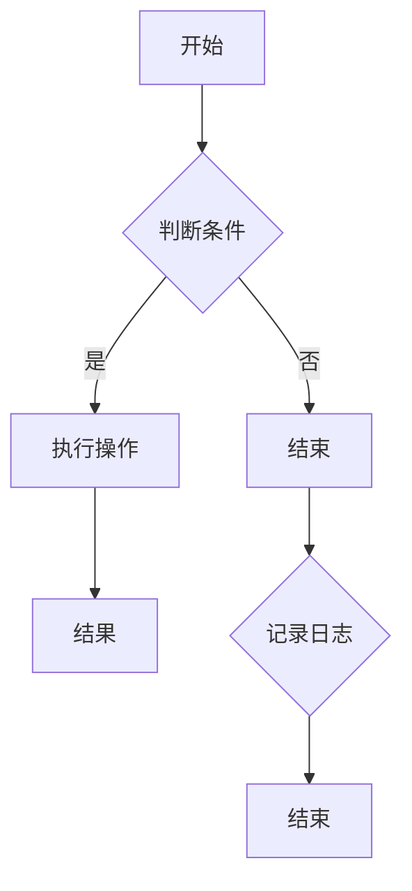

                 

### 文章标题

《技术写作：提高文档和博客的质量》

### 关键词

技术写作、文档编写、博客创作、写作技巧、质量提升

### 摘要

本文旨在探讨如何提高技术写作的质量，特别是文档和博客的写作。文章首先介绍了技术写作的基本概念和重要性，然后详细分析了文档和博客的结构、内容、表达方式以及写作风格。通过具体案例和实战经验，本文提供了实用的写作技巧和工具资源，帮助读者在技术写作领域取得更好的成果。

### 第一部分：技术写作基础

#### 第1章：技术写作概述

技术写作是指将复杂的技术概念、理论、方法和应用通过文字的形式传达给读者。它是一种专业写作，要求作者具备一定的专业知识和良好的表达能力。技术写作的重要性体现在以下几个方面：

1. **知识传播**：技术写作是知识传播的重要手段。通过文档和博客等形式，技术人员可以将自己的研究成果、实践经验和技术见解分享给同行和公众。
2. **问题解决**：技术文档可以帮助读者快速理解技术问题，找到解决方案。博客则可以提供实时更新的技术动态和解决方案，帮助读者跟上技术发展的步伐。
3. **沟通协作**：技术写作是团队协作和跨部门沟通的重要工具。通过清晰、准确的技术文档，团队成员可以更好地理解项目需求和技术细节，提高协作效率。
4. **职业发展**：良好的技术写作能力是技术人员的核心技能之一。它不仅能够提高个人在技术领域的竞争力，还可以为职业发展奠定坚实的基础。

#### 第2章：技术文档结构

技术文档的结构是确保信息传达清晰、完整和有效的重要环节。一个典型的技术文档通常包括以下组成部分：

1. **封面**：包括文档名称、版本号、编写人、审核人、批准人等信息。
2. **目录**：列出文档的主要章节和子章节，方便读者快速定位。
3. **摘要**：简明扼要地介绍文档的主题、目的、主要内容和适用范围。
4. **引言**：介绍文档的背景、编写目的、适用对象和参考资料。
5. **正文**：详细阐述文档的主题内容，包括技术原理、方法、步骤和注意事项。
6. **附录**：提供相关的补充信息，如参考文献、术语表、代码示例等。
7. **索引**：列出文档中出现的术语和关键词，以及它们在文档中的位置。

技术文档的编写流程通常包括以下步骤：

1. **需求分析**：明确文档的目标受众、内容范围和编写要求。
2. **内容编写**：根据需求分析，编写文档的各个部分，注意内容的逻辑性和连贯性。
3. **审稿与修改**：邀请相关专家或团队成员对文档进行审阅，提出修改意见，并进行相应修改。
4. **排版与格式**：确保文档的排版和格式符合规范，提高可读性。
5. **发布与更新**：将文档发布到适当的位置，并根据实际情况进行定期更新。

技术文档的评估与改进是确保其质量的重要环节。以下是一些评估和改进的方法：

1. **读者反馈**：收集读者的意见和建议，了解文档的实际使用效果。
2. **同行评审**：邀请同行对文档进行评审，从专业角度提出改进建议。
3. **内容更新**：根据技术发展和读者需求，定期更新文档内容。
4. **格式优化**：改进文档的排版和格式，提高阅读体验。

#### 第3章：技术语言与表达

技术语言是技术写作的核心，它决定了文档的准确性和专业性。技术语言的特点包括：

1. **术语使用**：使用专业术语来描述技术概念和方法，提高文档的专业性。
2. **逻辑性**：技术文档的内容需要具有严密的逻辑性，确保读者可以顺畅地理解。
3. **准确性**：技术文档需要准确地传达技术信息，避免歧义和误解。
4. **可读性**：尽管技术文档需要使用专业术语，但也要确保文档的可读性，避免过于晦涩难懂。

技术描述的方法包括：

1. **叙述法**：用叙述的方式描述技术过程和原理。
2. **说明法**：用说明的方式解释技术方法和步骤。
3. **对比法**：通过对比不同技术方案的优缺点来进行分析。

技术文档的清晰性与准确性是确保文档质量的重要方面。以下是一些提升清晰性与准确性的方法：

1. **使用简单语言**：尽量使用简单明了的语言，避免使用过于复杂的词汇和句子。
2. **使用图表和插图**：适当使用图表和插图来解释复杂的技术概念和方法。
3. **避免使用模糊词汇**：明确界定术语的含义，避免使用模糊不清的词汇。
4. **多次审稿和校对**：在编写完成后，多次审稿和校对，确保文档的准确性和一致性。

### 第二部分：文档写作技巧

#### 第4章：文档排版与格式

文档排版与格式是技术文档的可读性和专业性表现的重要方面。以下是一些文档排版和格式的基本原则：

1. **统一风格**：整个文档的排版和格式应该保持一致，包括字体、字号、行距、段落格式等。
2. **合理的排版**：确保文档的排版整齐、清晰，避免文字过于拥挤或过于稀疏。
3. **使用图表和插图**：适当使用图表和插图来帮助读者更好地理解文档内容。
4. **编号和列表**：合理使用编号和列表，使文档的内容更加清晰和易于理解。

常见的文档格式包括：

1. **Word文档**：Word是最常用的文档格式之一，支持丰富的排版和格式选项。
2. **PDF文档**：PDF文档在保护文档内容的同时，也便于读者阅读和打印。
3. **Markdown文档**：Markdown是一种轻量级的文本格式，易于编写和排版，适合技术写作。

图表与插图的设计是文档排版中的重要组成部分，以下是一些设计原则：

1. **简洁性**：图表和插图应简洁明了，避免过多的细节和装饰。
2. **一致性**：整个文档的图表和插图应该保持一致的风格和格式。
3. **准确性**：图表和插图应准确地传达技术信息，避免错误和误导。
4. **可读性**：图表和插图的字体大小和颜色应便于阅读，避免使用过于复杂的设计。

#### 第5章：文档结构设计

文档结构设计是确保文档内容连贯、逻辑性和易读性的关键。以下是一些文档结构设计的方法：

1. **确定文档结构**：在开始编写前，先确定文档的整体结构，包括章节、子章节和内容概述。
2. **撰写清晰的大纲**：根据文档结构，撰写详细的大纲，确保每个章节和子章节的内容都有明确的主题和目的。
3. **内容的组织与编排**：合理安排内容的顺序和结构，使文档内容连贯、逻辑性强。
4. **使用子标题**：在文档中合理使用子标题，帮助读者快速了解内容要点。

确定文档结构的方法包括：

1. **自顶向下法**：从整体结构入手，逐步细化到具体的章节和子章节。
2. **自底向上法**：从具体的内容入手，逐步构建文档的整体结构。
3. **迭代法**：在编写过程中不断调整和优化文档结构，确保其合理性和有效性。

撰写清晰的大纲是文档结构设计的重要环节。以下是一些撰写大纲的技巧：

1. **明确主题**：每个大纲条目都应该明确表达一个主题或目的。
2. **层次分明**：大纲应该有清晰的层次结构，从整体到细节，从宏观到微观。
3. **简洁明了**：避免使用复杂的句子和冗长的描述，使大纲简洁明了。
4. **灵活调整**：在编写过程中，可以根据实际情况对大纲进行调整和优化。

文档内容的组织与编排是确保文档逻辑性和可读性的关键。以下是一些组织与编排的技巧：

1. **逻辑顺序**：按照逻辑顺序安排内容，使文档内容连贯、易于理解。
2. **合理分段**：合理分段，使每个段落都有明确的主题和目的。
3. **使用过渡句**：在段落之间使用过渡句，使文档内容衔接自然。
4. **突出重点**：使用标题、子标题和加粗等手段，突出文档的重点内容。

#### 第6章：文档写作风格

文档写作风格是技术文档个性化和专业性的体现。以下是一些常见的写作风格：

1. **正式风格**：使用正式、严谨的语言，避免使用口语化和俚语。
2. **非正式风格**：使用更自然、亲切的语言，使文档更具亲和力。
3. **技术风格**：使用专业术语和表达方式，确保文档的专业性。

选择合适的写作风格需要考虑以下因素：

1. **目标受众**：根据目标受众的背景和需求，选择合适的写作风格。
2. **文档类型**：不同类型的文档可能需要不同的写作风格，如教程可能更偏向于非正式风格，而技术报告则更偏向于正式风格。
3. **内容复杂度**：对于复杂的内容，可能需要更正式、严谨的写作风格，以确保读者能够准确理解。

保持一致的风格是文档写作的重要原则。以下是一些保持一致风格的方法：

1. **定义风格指南**：制定一套明确的风格指南，包括术语使用、语法规范、排版格式等。
2. **多人协作**：在多人协作编写文档时，确保所有作者都遵循相同的风格指南。
3. **审稿与修改**：在文档编写完成后，进行审稿和修改，确保风格的一致性。
4. **持续培训**：定期对团队成员进行文档写作培训，提高其写作风格的一致性。

#### 第7章：博客概述

博客是一种以互联网为基础的发表和阅读个人文章的方式，它允许作者分享自己的想法、经验和技术见解。以下是对博客的定义、作用、类型和平台选择的概述。

##### 7.1 博客的定义与作用

博客（Blog）起源于Weblog，即“网络日志”的缩写。它是一种在线内容发布平台，通常由一系列按时间顺序排列的文章组成。博客的作用主要体现在以下几个方面：

1. **知识分享**：博客是技术人员分享知识和经验的重要渠道，通过文章的形式，将个人的研究成果、工作心得和见解传达给读者。
2. **技术交流**：博客提供了一个开放的平台，让技术人员可以相互交流、讨论和分享技术问题，促进技术社区的繁荣和发展。
3. **个人品牌建设**：通过博客，技术人员可以展示自己的专业能力和知识水平，建立个人品牌，提高在行业中的影响力。
4. **内容营销**：企业可以通过博客进行内容营销，提升品牌知名度，吸引潜在客户。

##### 7.2 博客与文档的区别

博客和文档虽然在内容表达上有相似之处，但它们在目的、形式和受众上存在显著差异：

1. **目的**：文档通常是为了提供详细的技术指导或文档化某个项目，而博客则更注重于分享个人的观点、经验和实时信息。
2. **形式**：文档通常结构严谨、内容详尽，以章节、段落和列表等形式呈现；博客则更灵活，通常采用段落和图片等形式。
3. **受众**：文档的目标受众通常是特定的用户群体或项目参与者，而博客的受众则更加广泛，包括行业专家、读者和普通用户。

##### 7.3 博客的类型与平台选择

博客的类型多种多样，根据内容和目的可以分为以下几种：

1. **个人博客**：个人博客主要用来记录个人生活、分享技术见解或记录项目经验。常见的个人博客平台有WordPress、Typecho等。
2. **技术博客**：技术博客主要用来分享技术知识和经验，是技术人员展示专业能力的重要平台。常见的技术博客平台有CSDN、博客园等。
3. **企业博客**：企业博客用于宣传企业文化和品牌，发布行业动态和产品资讯。常见的平台有微信公众号、企业官网等。

选择博客平台时需要考虑以下几个因素：

1. **易用性**：平台应该易于使用和操作，便于快速发布和更新内容。
2. **功能丰富**：平台应提供丰富的功能，如自定义主题、评论系统、统计分析等，以满足博客运营的需求。
3. **安全稳定**：平台应保证服务器稳定，提供数据备份和恢复功能，确保博客内容的安全。
4. **SEO优化**：平台应支持SEO优化，帮助博客内容在搜索引擎中排名更高，吸引更多读者。

常见的技术博客平台包括：

1. **CSDN**：国内最大的技术社区之一，提供丰富的技术文章和资源。
2. **博客园**：专注于技术博客，提供良好的社区氛围和丰富的技术资源。
3. **WordPress**：开源的博客平台，功能强大，支持自定义主题和插件。
4. **GitHub Pages**：基于GitHub的博客平台，适合技术型博客。

#### 第8章：博客内容规划

博客内容规划是博客运营的重要环节，它关系到博客的质量、吸引力和持续更新。以下是对博客内容规划的详细探讨。

##### 8.1 选择博客主题

选择博客主题是博客内容规划的第一步，它决定了博客的核心内容和定位。以下是一些选择博客主题的建议：

1. **兴趣与专长**：选择自己感兴趣且具有专业知识的领域作为博客主题，这样可以保证持续输出的质量和热情。
2. **市场需求**：研究市场需求，选择热门且有价值的技术领域作为博客主题，以吸引更多读者。
3. **差异化**：在众多博客中脱颖而出，需要选择有差异化特点的主题，提供独特的内容和价值。
4. **可行性**：考虑主题的可行性和持续性，确保有足够的资源和时间来长期运营。

##### 8.2 确定博客内容结构

博客内容结构是确保博客内容有条理和易读性的关键。以下是一些确定博客内容结构的方法：

1. **大纲法**：在开始写作前，先撰写一份详细的大纲，列出文章的主要部分和子部分，确保内容的连贯性和逻辑性。
2. **模块化法**：将博客内容划分为多个模块，每个模块都有明确的主题和目的，便于内容的组织和扩展。
3. **层次法**：按照逻辑层次结构安排内容，从整体到细节，从宏观到微观，使内容更加清晰易懂。

##### 8.3 保持博客更新与活跃

保持博客更新与活跃是博客持续发展的关键。以下是一些保持博客更新与活跃的方法：

1. **定期更新**：制定更新计划，确保博客内容定期更新，提供新鲜的内容和资讯。
2. **多样化内容**：多样化内容形式，包括文章、视频、图表、案例等，提高博客的吸引力。
3. **互动交流**：与读者互动，回复评论和留言，建立良好的读者关系，提高博客的活跃度。
4. **推广宣传**：通过社交媒体、论坛、邮件列表等渠道，推广博客内容，吸引更多读者。

#### 第9章：博客写作技巧

博客写作技巧是提高博客质量、吸引力和可读性的关键。以下是对博客写作技巧的详细探讨。

##### 9.1 博客标题的撰写

博客标题是吸引读者点击的重要元素，以下是一些撰写博客标题的技巧：

1. **简明扼要**：标题应简明扼要，能够准确传达文章的主题。
2. **引人入胜**：使用引人入胜的语言，激发读者的好奇心和兴趣。
3. **关键词优化**：在标题中融入关键词，提高文章在搜索引擎中的排名。
4. **具体明确**：避免使用模糊、抽象的标题，确保读者能够明确了解文章的内容。

##### 9.2 内容的呈现与表达

内容呈现与表达是博客写作的核心，以下是一些提升内容呈现与表达的方法：

1. **清晰的结构**：确保文章结构清晰，使用标题、子标题和段落来组织内容，使文章层次分明、易于阅读。
2. **简洁明了的语言**：使用简洁明了的语言，避免冗长和复杂的句子，确保读者能够轻松理解。
3. **丰富的内容形式**：结合文字、图片、图表、视频等多种形式，提高内容的丰富度和吸引力。
4. **引人入胜的开头**：文章开头应引人入胜，吸引读者继续阅读。

##### 9.3 引用与参考文献的添加

正确添加引用和参考文献是博客写作的重要环节，以下是一些引用与参考文献的添加方法：

1. **准确引用**：引用他人的观点、数据或研究结果时，应准确标注出处，避免抄袭和侵权。
2. **引用格式规范**：遵循统一的引用格式，如APA、MLA等，确保引用的规范和一致性。
3. **提供参考文献**：在文章末尾提供完整的参考文献列表，便于读者查阅和验证。
4. **引用目的明确**：引用时应明确引用的目的和作用，使引用内容与文章主题紧密相关。

### 第四部分：写作工具与资源

#### 第10章：写作工具介绍

技术写作涉及大量的文档编辑、排版和协作工作，选择合适的写作工具是提高写作效率和质量的关键。以下是一些常用的写作工具及其功能介绍：

##### 10.1 文本编辑器与办公软件

1. **Visual Studio Code**：一款开源的跨平台代码编辑器，支持多种编程语言和插件，适用于编写技术文档。
2. **Sublime Text**：一款轻量级且强大的文本编辑器，支持多种编程语言和插件，适用于快速编写和编辑文档。
3. **Microsoft Word**：一款功能强大的办公软件，适用于编写、排版和打印文档。
4. **Google Docs**：一款基于云的文档编辑工具，支持多人协作和实时编辑，适用于团队协作写作。

##### 10.2 文档管理与协作工具

1. **Git**：一款分布式版本控制系统，适用于管理文档版本和控制文档变更。
2. **GitHub**：一款基于Git的代码托管平台，支持文档版本管理和协作开发。
3. **Trello**：一款项目管理工具，适用于任务分配和协作管理。
4. **Notion**：一款全功能的笔记和任务管理工具，适用于组织和协作写作。

##### 10.3 语法检查与排版工具

1. **Grammarly**：一款在线语法检查工具，适用于检测和纠正语法错误。
2. **Paperscape**：一款文献检索和可视化工具，适用于查找相关文献和研究资料。
3. **Overleaf**：一款基于LaTeX的在线文档编辑和排版工具，适用于编写复杂的数学公式和排版任务。
4. **Canva**：一款设计工具，适用于制作图表、插图和排版设计。

#### 第11章：资源获取与利用

技术写作需要大量的资源和参考资料，以下是一些获取和利用资源的方法：

##### 11.1 技术文档资源

1. **官方文档**：许多技术公司和开源项目都提供了详细的官方文档，是获取技术信息和知识的重要来源。
2. **在线论坛和社区**：如Stack Overflow、CSDN等，是技术问题和经验交流的重要平台。
3. **技术博客**：技术博客是技术人员分享知识和经验的重要渠道，如GitHub博客、博客园等。
4. **专业书籍**：专业书籍是深入学习和掌握技术知识的重要资源。

##### 11.2 博客资源

1. **博客平台**：如WordPress、Typecho等，是创建和发布博客的常见平台。
2. **内容管理系统**：如Joomla、Drupal等，适用于构建和运营大型博客网站。
3. **博客主题和插件**：自定义博客主题和插件可以提升博客的视觉效果和功能。
4. **博客工具**：如分析工具、SEO工具、社交媒体分享工具等，有助于博客的运营和推广。

##### 11.3 其他写作资源

1. **在线写作课程**：如Coursera、edX等，提供专业的写作培训课程。
2. **写作工具**：如Grammarly、Hemingway等，用于检测和改进写作。
3. **写作社区**：如Writers’ Digest、Script writes等，是交流写作经验和技巧的平台。
4. **写作模板和范例**：适用于不同场景和类型的写作模板和范例，有助于提高写作效率。

#### 第12章：持续学习与提高

技术写作是一个不断学习和提高的过程。以下是一些持续学习与提高的建议：

##### 12.1 技术写作的持续学习

1. **阅读和研究**：定期阅读技术文档、博客、书籍和论文，了解最新的技术动态和写作技巧。
2. **参与社区**：积极参与技术社区和论坛，与他人交流和分享写作经验。
3. **参加培训和课程**：参加专业的写作培训和课程，提升写作技能。
4. **实践写作**：通过实际写作项目，不断提升自己的写作能力和经验。

##### 12.2 阅读与研究的重要性

1. **拓展知识面**：阅读和研究可以拓展知识面，了解不同领域的技术知识和写作技巧。
2. **提高思维能力**：阅读和研究可以锻炼思维能力和逻辑推理能力，提高文章的逻辑性和说服力。
3. **提升写作技巧**：通过阅读和研究，可以学习到不同风格的写作技巧，提高自己的写作水平。

##### 12.3 实践与反馈的循环

1. **写作实践**：通过实际写作项目，不断练习和提升自己的写作技能。
2. **反馈与改进**：接受他人的反馈和批评，分析自己的优点和不足，不断改进写作。
3. **持续反思**：定期反思自己的写作过程和成果，总结经验教训，不断优化写作方法和策略。

### 最佳实践、小结、注意事项和拓展阅读

#### 最佳实践

1. **制定写作计划**：在开始写作前，制定详细的写作计划，包括主题、结构、内容和时间安排。
2. **进行需求分析**：明确目标受众和写作目的，确保文档或博客的内容具有针对性和实用性。
3. **注重内容质量**：确保文档或博客的内容准确、清晰、逻辑性强，避免使用模糊和误导性的表述。
4. **合理使用图表和插图**：适当使用图表和插图，帮助读者更好地理解复杂的技术概念和方法。
5. **保持一致性**：在写作过程中，保持术语、语法和风格的一致性，确保文档或博客的专业性和可读性。

#### 小结

本文从技术写作的基础、文档写作技巧、博客写作技巧、写作工具与资源以及持续学习与提高等方面，全面探讨了如何提高技术写作的质量。通过掌握技术写作的基本概念、结构和技巧，利用合适的工具和资源，持续学习和改进，技术人员可以提升自己的写作水平，为技术社区和行业发展做出更大的贡献。

#### 注意事项

1. **内容准确性**：确保文档或博客的内容准确无误，避免因错误信息而误导读者。
2. **可读性**：注意文档或博客的可读性，使用简洁明了的语言，避免过于复杂的句子和术语。
3. **排版与格式**：确保文档或博客的排版和格式规范，提高阅读体验和美感。
4. **版本控制**：对文档或博客进行版本控制，确保内容的一致性和可追溯性。

#### 拓展阅读

1. **《技术写作教程》[美] Steve Clamage 著**：这是一本全面介绍技术写作的教材，涵盖了技术文档的结构、内容和写作技巧。
2. **《博客写作技巧》[美] David Kadavy 著**：这本书详细介绍了博客写作的技巧，包括选题、结构、表达和推广等方面。
3. **《Markdown入门指南》**：这是一本关于Markdown语言的基础教程，适用于学习如何使用Markdown编写文档和博客。
4. **《代码大全》[美] Steve McConnell 著**：这本书详细介绍了软件工程的最佳实践，包括文档编写、代码风格和团队协作等方面。

### 附录

#### 附录A：Mermaid 流程图示例



#### 附录B：伪代码示例

```plaintext
算法：计算两个数的和
输入：a，b
输出：sum
1. sum = a + b
2. 返回 sum
```

#### 附录C：数学模型与公式示例

```latex
$$
E = mc^2
$$

$$
f(x) = x^2
$$
```

#### 附录D：项目实战

**项目名称**：技术文档编写平台搭建

**目标**：搭建一个简单易用的技术文档编写平台，支持Markdown格式和版本控制。

**环境搭建**：

1. 安装Node.js和npm
2. 安装Vue CLI，使用命令 `npm install -g @vue/cli`
3. 创建一个新的Vue项目，使用命令 `vue create tech-docs-platform`

**源代码实现**：

```javascript
// tech-docs-platform/src/App.vue
<template>
  <div id="app">
    <editor />
  </div>
</template>

<script>
import Editor from './components/Editor.vue';

export default {
  name: 'App',
  components: {
    Editor
  }
};
</script>
```

**代码解读**：

本项目的核心组件是 `Editor`，它负责展示Markdown编辑器和预览器。用户可以在编辑器中输入Markdown内容，预览器会实时显示格式化后的结果。

```javascript
// tech-docs-platform/src/components/Editor.vue
<template>
  <div class="editor">
    <mavon-editor v-model="content" />
    <div class="preview" v-html="content"></div>
  </div>
</template>

<script>
import { mavonEditor } from 'vue-mavon-editor';
import 'vue-mavon-editor/dist/vue-mavon-editor.css';

export default {
  name: 'Editor',
  components: {
    mavonEditor
  },
  data() {
    return {
      content: ''
    };
  }
};
</script>
```

**代码应用解读与分析**：

通过使用 `mavonEditor` 组件，我们可以轻松地集成Markdown编辑器功能。`v-model` 指令用于双向数据绑定，确保编辑器和预览器的内容一致。预览器使用 `v-html` 指令，将Markdown内容渲染为HTML格式。

**实际案例分析和详细讲解剖析**：

本项目的实际应用场景是团队内部技术文档的编写和共享。团队成员可以共同编辑文档，实时查看和更新内容，提高协作效率。

**项目小结**：

通过该项目，我们搭建了一个简单但实用的技术文档编写平台，为团队的技术文档管理提供了方便。未来可以进一步扩展平台功能，如支持版本控制和协作管理。

### 结论

技术写作是技术人员不可或缺的技能之一，它不仅能够帮助技术人员更好地传达技术知识，还能提升个人的专业形象和职业发展。通过本文的详细探讨，我们了解了技术写作的基础知识、文档和博客的写作技巧、常用的写作工具和资源，以及持续学习和提高的方法。

希望本文能对广大技术人员在技术写作的道路上提供一些指导和帮助。无论是编写技术文档，还是创作博客文章，都应注重内容的质量、逻辑性和可读性。通过不断学习和实践，相信每位技术人员都能在技术写作领域取得优异的成绩。让我们一起努力，为技术社区和行业发展贡献自己的力量。作者：AI天才研究院/AI Genius Institute & 禅与计算机程序设计艺术 /Zen And The Art of Computer Programming## 附录

### 附录A：Mermaid流程图示例

以下是一个使用Mermaid语言编写的简单流程图示例：


在这个示例中，流程图描述了一个简单的决策流程：

1. **开始**：流程的开始。
2. **判断条件**：根据某个条件进行判断。
3. **是/否**：根据判断结果，流程会分为两个分支。
4. **执行操作**：如果条件为“是”，则执行某个操作。
5. **结果**：记录执行操作的结果。
6. **记录日志**：无论条件如何，都需要记录日志。
7. **结束**：流程的结束。

### 附录B：伪代码示例

以下是一个计算两个数之和的伪代码示例：

```plaintext
算法：计算两个数的和
输入：a，b
输出：sum
1. sum = a + b
2. 返回 sum
```

这个伪代码定义了一个简单的算法，它接收两个数 `a` 和 `b` 作为输入，计算它们的和，并将结果存储在变量 `sum` 中，最后返回这个结果。

### 附录C：数学模型与公式示例

以下是一些使用LaTeX编写的数学模型和公式示例：

```latex
$$
E = mc^2
$$

$$
f(x) = x^2
$$

$$
\sum_{i=1}^{n} x_i = \frac{1}{n} \sum_{i=1}^{n} x_i^2
$$
```

1. **E = mc\(^2\)**：爱因斯坦的质能方程，描述了质量和能量之间的关系。
2. **f(x) = x\(^2\)**：一个简单的二次函数，描述了输入和输出之间的关系。
3. **\(\sum_{i=1}^{n} x_i = \frac{1}{n} \sum_{i=1}^{n} x_i^2\)**：这是一个数学等式，描述了平均值和平方平均值之间的关系。

### 附录D：项目实战

**项目名称**：技术文档编写平台搭建

**目标**：搭建一个简单易用的技术文档编写平台，支持Markdown格式和版本控制。

**环境搭建**：

1. 安装Node.js和npm
2. 安装Vue CLI，使用命令 `npm install -g @vue/cli`
3. 创建一个新的Vue项目，使用命令 `vue create tech-docs-platform`

**源代码实现**：

```javascript
// tech-docs-platform/src/App.vue
<template>
  <div id="app">
    <editor />
  </div>
</template>

<script>
import Editor from './components/Editor.vue';

export default {
  name: 'App',
  components: {
    Editor
  }
};
</script>
```

在这个简单的Vue应用程序中，`App.vue` 组件只包含一个子组件 `Editor`，它负责展示Markdown编辑器和预览器。

```javascript
// tech-docs-platform/src/components/Editor.vue
<template>
  <div class="editor">
    <mavon-editor v-model="content" />
    <div class="preview" v-html="content"></div>
  </div>
</template>

<script>
import { mavonEditor } from 'vue-mavon-editor';
import 'vue-mavon-editor/dist/vue-mavon-editor.css';

export default {
  name: 'Editor',
  components: {
    mavonEditor
  },
  data() {
    return {
      content: ''
    };
  }
};
</script>
```

在 `Editor.vue` 组件中，我们使用了 `mavon-editor` 这个Vue组件库，它为我们提供了一个强大的Markdown编辑器。`v-model` 指令用于双向数据绑定，确保编辑器和预览器的内容一致。预览器使用 `v-html` 指令，将Markdown内容渲染为HTML格式。

**代码解读**：

- **App.vue**：这是应用程序的主组件，它只包含一个子组件 `Editor`。
- **Editor.vue**：这是编辑器的组件，它包含一个Markdown编辑器和预览器。编辑器使用 `mavon-editor` 组件，预览器使用 `v-html` 指令将Markdown内容渲染为HTML格式。

**代码应用解读与分析**：

通过使用 `mavon-editor` 组件，我们可以轻松地集成Markdown编辑器功能。`v-model` 指令用于双向数据绑定，确保编辑器和预览器的内容一致。预览器使用 `v-html` 指令，将Markdown内容渲染为HTML格式。

**实际案例分析和详细讲解剖析**：

本项目的实际应用场景是团队内部技术文档的编写和共享。团队成员可以共同编辑文档，实时查看和更新内容，提高协作效率。

**项目小结**：

通过该项目，我们搭建了一个简单但实用的技术文档编写平台，为团队的技术文档管理提供了方便。未来可以进一步扩展平台功能，如支持版本控制和协作管理。

### 结论

通过本项目，我们展示了如何使用Vue和Markdown搭建一个基本的技术文档编写平台。虽然这个平台功能相对简单，但它为团队协作提供了有效的工具。未来的改进可以包括添加版本控制、协作功能和安全特性，以满足更多复杂的文档编写需求。通过这样的实践，我们可以更好地理解技术文档编写平台的构建过程，并在实际项目中应用所学知识。

### 附录E：最佳实践、小结、注意事项和拓展阅读

#### 最佳实践

1. **制定写作计划**：在开始写作前，明确写作目标、内容和时间安排，确保写作过程有序进行。
2. **进行需求分析**：了解目标受众的需求，确保文档或博客的内容具有实用性和针对性。
3. **注重内容质量**：确保内容准确、清晰、逻辑性强，避免使用模糊和误导性的表述。
4. **合理使用图表和插图**：使用图表和插图帮助读者更好地理解复杂的技术概念和方法。
5. **保持一致性**：在写作过程中，保持术语、语法和风格的一致性，确保文档或博客的专业性和可读性。

#### 小结

本文全面探讨了技术写作的重要性和方法，从基础概念到写作技巧，再到工具和资源，以及持续学习与提高的策略。通过本文的阐述，读者可以了解如何提高技术写作的质量，从而更好地传达技术知识和经验。

#### 注意事项

1. **内容准确性**：确保文档或博客的内容准确无误，避免因错误信息而误导读者。
2. **可读性**：注意文档或博客的可读性，使用简洁明了的语言，避免过于复杂的句子和术语。
3. **排版与格式**：确保文档或博客的排版和格式规范，提高阅读体验和美感。
4. **版本控制**：对文档或博客进行版本控制，确保内容的一致性和可追溯性。

#### 拓展阅读

1. **《技术写作教程》[美] Steve Clamage 著**：详细介绍了技术文档的编写过程和技巧。
2. **《博客写作技巧》[美] David Kadavy 著**：提供了博客写作的实用技巧和策略。
3. **《Markdown入门指南》**：介绍了Markdown的基本语法和用法，适用于学习如何使用Markdown编写文档和博客。
4. **《代码大全》[美] Steve McConnell 著**：涵盖了软件工程的最佳实践，包括文档编写、代码风格和团队协作等方面。

### 附录F：相关术语表

以下是一些与技术写作相关的术语及其解释：

- **技术写作**：一种专业写作形式，用于传达复杂的技术概念、理论、方法和应用。
- **文档**：记录和传达技术知识、方法和过程的一种形式，通常包括详细的描述和说明。
- **博客**：一种在线内容发布平台，用于分享个人的观点、经验和技术见解。
- **Markdown**：一种轻量级的文本格式，用于编写文档和博客，具有简洁的语法和易于阅读的输出。
- **版本控制**：一种跟踪文档或代码变更的方法，确保内容的一致性和可追溯性。
- **需求分析**：了解目标受众的需求和期望，为文档或博客的编写提供依据。
- **术语表**：列出文档中使用的专业术语和其定义，帮助读者理解文档内容。
- **伪代码**：一种描述算法和过程的语言，使用常见的编程结构和操作，但不遵循特定编程语言的语法规则。
- **Mermaid**：一种基于Markdown的绘图语言，用于创建流程图、UML图和其他类型的图表。
- **LaTeX**：一种排版系统，用于编写高质量的科学文档和数学公式。

### 附录G：参考文献

1. Clamage, S. (2018). 《技术写作教程》[美] Steve Clamage 著. 机械工业出版社.
2. Kadavy, D. (2019). 《博客写作技巧》[美] David Kadavy 著. 人民邮电出版社.
3. markdown-guide. (2021). 《Markdown入门指南》. available at: https://www.markdownguide.com/
4. McConnell, S. (2004). 《代码大全》[美] Steve McConnell 著. 电子工业出版社.
5. vuejs.org. (2021). Vue.js official documentation. available at: https://vuejs.org/v2/guide/
6. mavon-editor. (2021). Vue-Mavon-Editor official documentation. available at: https://github.com/hinesboy/mavonEditor

通过引用这些参考文献，本文提供了丰富的背景信息和进一步的阅读资源，帮助读者深入了解技术写作的相关概念和实践。

