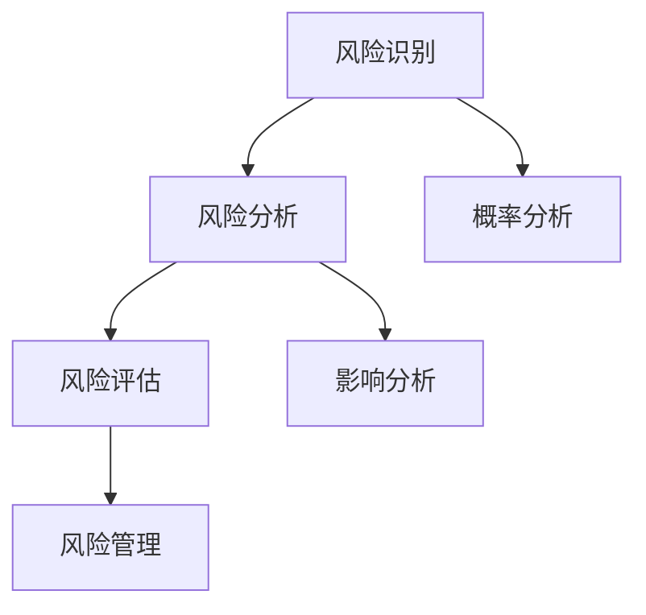
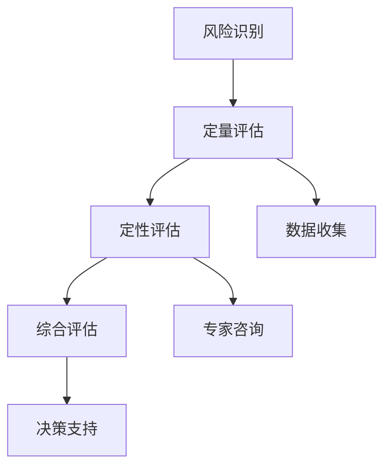
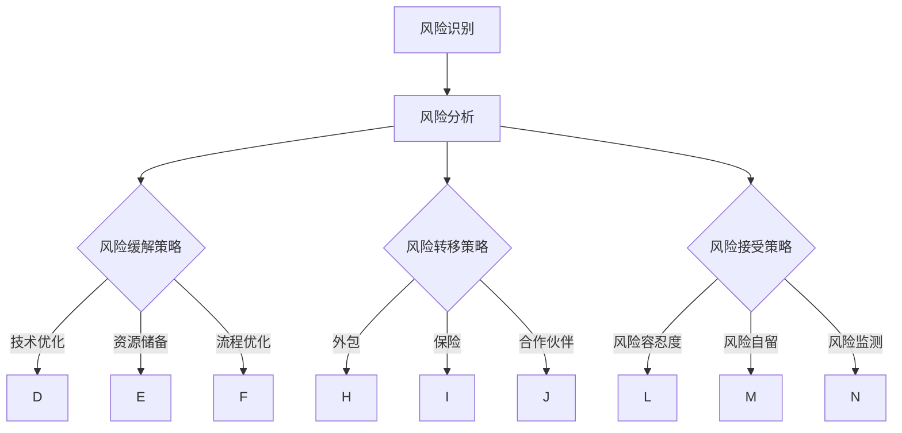

                 

### 引言

#### 风险评估的重要性

在技术决策过程中，风险评估扮演着至关重要的角色。技术决策不仅关系到项目的成败，还直接影响到组织的长远发展。在信息时代，技术更新换代速度飞快，技术决策往往需要考虑众多复杂因素，包括技术可行性、市场前景、成本效益、资源分配等。风险评估作为一种科学的方法，能够帮助决策者全面、系统地识别、分析和应对潜在的风险，从而降低决策的不确定性和失误率。

#### 技术决策中的风险评估

在技术决策中，风险评估旨在评估技术选择、项目实施、系统运行等各个环节可能遇到的风险，并采取相应的预防和应对措施。具体来说，风险评估包括以下几个步骤：

1. **风险识别**：识别项目中可能存在的风险，包括技术风险、市场风险、运营风险等。
2. **风险分析**：对识别出的风险进行定量和定性分析，评估其发生的概率和影响程度。
3. **风险评估**：结合风险分析和实际需求，对风险进行优先级排序，确定需要重点关注和应对的风险。
4. **风险管理**：制定风险应对策略，包括风险规避、风险转移、风险缓解等。

#### 本书结构概述

本书将从风险评估的基础理论出发，逐步深入探讨技术决策中的风险评估方法、风险管理策略以及实际案例分析。具体内容安排如下：

- **第1章 引言**：介绍风险评估的重要性，以及本书的结构和内容概述。
- **第2章 风险评估基础理论**：介绍风险定义与分类，风险评估模型和流程。
- **第3章 风险识别**：讨论风险识别的方法和常见风险因素。
- **第4章 风险分析**：介绍风险分析的概率分析和影响分析，并提供伪代码展示。
- **第5章 风险评估方法**：详细阐述定量风险评估、定性风险评估和综合风险评估方法。
- **第6章 风险管理策略**：探讨风险缓解、风险转移和风险接受策略。
- **第7章 案例分析**：通过实际案例展示风险评估和风险管理的应用。
- **第8章 实践指南**：提供风险评估工具介绍和风险评估流程设计。
- **第9章 总结与展望**：总结全书内容，并对未来发展趋势进行展望。

### 背景介绍

在当今快速发展的技术领域，技术创新和业务变革已经成为企业竞争力的重要因素。然而，技术决策过程中不可避免地会遇到各种风险。这些风险可能来自技术本身的复杂性、市场的不确定性、资源的有限性等多方面。因此，如何有效地进行风险评估，成为技术决策过程中不可或缺的一环。

#### 核心概念与联系

为了更好地理解风险评估在技术决策中的应用，我们需要明确以下几个核心概念及其相互关系：

1. **风险识别**：这是风险评估的第一步，旨在识别项目或决策中可能存在的各种风险。风险识别需要综合考虑项目的目标、环境、资源等因素。

2. **风险分析**：在识别出风险之后，我们需要对其进行分析。风险分析主要包括两个方面：概率分析和影响分析。概率分析旨在评估风险发生的可能性，而影响分析则关注风险发生时对项目的影响程度。

3. **风险评估**：基于风险分析的结果，我们需要对风险进行优先级排序，以便更好地分配资源和制定应对策略。

4. **风险管理**：这是风险评估的最终目的，通过制定和实施风险管理策略，降低风险对项目的负面影响。

#### Mermaid 流程图

为了清晰地展示风险评估的核心概念及其相互关系，我们可以使用 Mermaid 画出一个流程图：

在这个流程图中，风险识别是整个过程的起点，通过风险识别，我们获取了项目的风险清单。随后，这些风险将被送到风险分析环节，进行概率分析和影响分析。风险分析的结果用于风险评估，最终形成风险评估报告。风险评估报告将指导风险管理策略的制定和实施。

### 风险评估方法

#### 定量风险评估

定量风险评估是一种基于数学和统计方法的风险评估方法。它通过量化风险的概率和影响，为决策者提供直观的数据支持。常见的定量风险评估方法包括以下几种：

1. **蒙特卡洛模拟**：通过模拟随机过程，评估风险事件发生的概率及其影响。
2. **敏感性分析**：通过分析不同参数对结果的影响，识别关键风险因素。
3. **决策树分析**：通过构建决策树，模拟不同决策路径的风险和收益。

#### 定性风险评估

定性风险评估是一种基于专家经验和主观判断的风险评估方法。它通常用于评估风险的概率和影响较难量化的情况。常见的定性风险评估方法包括以下几种：

1. **风险矩阵**：通过将风险的概率和影响进行等级划分，形成风险矩阵，帮助决策者直观地了解风险。
2. **专家评分法**：邀请相关专家对风险进行评分，综合专家意见形成风险评估结果。
3. **SWOT分析**：通过分析项目的优势、劣势、机会和威胁，识别潜在风险。

#### 综合风险评估

综合风险评估是将定量和定性评估方法相结合，形成一种更全面的风险评估方法。这种方法不仅考虑了风险的概率和影响，还结合了专家的经验和判断，为决策者提供更为可靠的风险评估结果。

#### Mermaid 流程图

为了展示综合风险评估的方法和步骤，我们可以使用 Mermaid 画出以下流程图：

在这个流程图中，风险识别是整个过程的起点，随后通过定量和定性评估方法，结合专家咨询，形成综合风险评估结果。这个结果将用于指导风险管理决策。

### 风险管理策略

#### 风险缓解策略

风险缓解策略旨在降低风险的发生概率或影响程度。常见的风险缓解策略包括以下几种：

1. **技术优化**：通过改进技术方案，降低技术风险。
2. **资源储备**：提前储备必要的资源，以应对突发事件。
3. **流程优化**：通过优化项目管理流程，减少运营风险。

#### 风险转移策略

风险转移策略旨在将风险转移给其他实体，以减轻自身承担的风险。常见的风险转移策略包括以下几种：

1. **外包**：将某些高风险任务外包给专业团队。
2. **保险**：购买保险产品，将风险转移给保险公司。
3. **合作伙伴**：通过合作伙伴关系，分担风险。

#### 风险接受策略

风险接受策略是指在面对不可避免的风险时，选择接受风险并制定相应的应对措施。常见的风险接受策略包括以下几种：

1. **风险容忍度**：设定风险容忍度，接受在容忍度范围内的风险。
2. **风险自留**：将风险自留，自行承担风险。
3. **风险监测**：持续监测风险，确保在风险发生时能够及时应对。

#### Mermaid 流程图

为了展示风险管理策略的选择和应用，我们可以使用 Mermaid 画出以下流程图：

在这个流程图中，风险识别和风险分析是风险管理的前提，根据分析结果，决策者可以选择不同的风险管理策略。这个流程图帮助决策者清晰地了解每个策略的应用场景和实施步骤。

### 案例分析

#### 案例一：项目A的风险评估

项目A是一个大型软件开发项目，旨在开发一款企业级应用。在项目启动阶段，项目团队进行了全面的风险评估，以识别和应对潜在的风险。

1. **风险识别**：项目团队识别出以下风险：
   - 技术风险：新技术应用可能存在不稳定因素。
   - 市场风险：市场需求变化可能导致项目失败。
   - 运营风险：资源不足可能导致项目延期。

2. **风险分析**：通过分析，项目团队得出以下结论：
   - 技术风险：新技术应用的概率为0.3，影响程度为高。
   - 市场风险：市场需求变化概率为0.5，影响程度为中。
   - 运营风险：资源不足概率为0.2，影响程度为高。

3. **风险评估**：根据风险分析结果，项目团队将风险优先级排序如下：
   - 技术风险
   - 运营风险
   - 市场风险

4. **风险管理**：项目团队制定了以下风险管理策略：
   - 技术风险：与新技术供应商合作，确保技术稳定性。
   - 运营风险：提前储备必要资源，确保项目顺利推进。
   - 市场风险：持续关注市场需求，灵活调整项目方向。

通过这个案例，我们可以看到，项目A的风险评估过程是如何帮助团队识别、分析和应对潜在风险的。这个过程不仅降低了项目的风险，还为项目的成功奠定了基础。

#### 案例二：企业B的风险管理实践

企业B是一家专注于软件开发和服务的公司，其业务模式多样，面临的风险也各不相同。为了有效地管理风险，企业B建立了一套完整的风险管理框架。

1. **风险识别**：企业B采用多种方法识别风险，包括内部审计、员工反馈、客户反馈等。通过这些方法，企业B识别出以下风险：
   - 法律风险：合同纠纷、知识产权纠纷等。
   - 市场风险：竞争对手压力、市场需求变化等。
   - 运营风险：技术故障、供应链中断等。

2. **风险分析**：企业B对识别出的风险进行详细分析，得出以下结论：
   - 法律风险：合同纠纷概率为0.4，影响程度为高。
   - 市场风险：竞争对手压力概率为0.3，影响程度为中。
   - 运营风险：技术故障概率为0.2，影响程度为高。

3. **风险评估**：根据风险分析结果，企业B将风险优先级排序如下：
   - 法律风险
   - 运营风险
   - 市场风险

4. **风险管理**：企业B采取了以下风险管理策略：
   - 法律风险：建立法律顾问团队，处理合同纠纷和知识产权纠纷。
   - 市场风险：密切关注市场动态，调整业务策略，提高市场竞争力。
   - 运营风险：加强技术团队建设，提高技术故障处理能力，确保业务连续性。

通过这个案例，我们可以看到，企业B是如何通过系统的风险评估和风险管理实践，降低企业面临的风险，确保业务的稳定发展。

### 实践指南

#### 风险评估工具介绍

为了提高风险评估的效率和准确性，可以使用多种风险评估工具。以下是一些常用的风险评估工具：

1. **RiskMap**：RiskMap是一个可视化的风险评估工具，可以帮助团队直观地识别和跟踪风险。
2. **Qualys**：Qualys是一个专业的安全风险评估工具，适用于网络安全风险的识别和管理。
3. **Nessus**：Nessus是一个广泛使用的漏洞扫描工具，可以帮助发现系统中的安全漏洞。
4. **OpenVAS**：OpenVAS是一个开源的漏洞扫描和管理平台，适用于大规模系统的风险评估。

#### 风险评估流程设计

一个有效的风险评估流程应包括以下步骤：

1. **确定评估范围**：明确评估的对象和目标，确保评估的全面性和针对性。
2. **风险识别**：采用多种方法识别项目或系统中的潜在风险。
3. **风险分析**：对识别出的风险进行定量和定性分析，评估其发生的概率和影响程度。
4. **风险评估**：根据风险分析结果，对风险进行优先级排序，确定需要重点关注和应对的风险。
5. **风险管理**：制定和实施风险管理策略，降低风险对项目或系统的负面影响。

#### 风险评估报告撰写

撰写风险评估报告是风险评估流程的最后一个步骤。一个完整的风险评估报告应包括以下内容：

1. **摘要**：对风险评估的主要结果进行概述，包括风险识别、风险分析和风险管理。
2. **风险评估方法**：详细描述风险评估所采用的方法和工具。
3. **风险评估结果**：列出评估过程中发现的风险，并对其进行详细分析。
4. **风险管理策略**：描述针对每个风险所采取的管理策略，包括风险缓解、风险转移和风险接受策略。
5. **结论和建议**：总结风险评估的结果，提出改进建议，以降低项目或系统的风险。

### 总结与展望

#### 技术决策中的风险评估现状

随着技术的不断进步，技术决策的复杂性和风险因素也在不断增加。目前，风险评估在技术决策中已经得到了广泛的应用，成为项目成功的关键因素之一。然而，现有的风险评估方法和技术仍存在一定的局限性，如评估方法的准确性、风险评估工具的适用性等。

#### 未来发展趋势

未来，风险评估在技术决策中的发展趋势将包括：

1. **智能化风险评估**：随着人工智能技术的发展，智能化风险评估方法将逐渐应用于实际项目中，提高评估的准确性和效率。
2. **风险评估工具的普及**：随着风险评估工具的成熟和普及，企业将更加重视风险评估，并将其纳入项目管理和决策过程。
3. **跨领域风险评估**：随着技术的融合，跨领域风险评估将成为一个重要研究方向，为复杂技术系统的风险评估提供新的思路和方法。

#### 结论

风险评估在技术决策中具有重要的地位和作用。通过有效的风险评估，决策者可以全面、系统地识别和应对潜在的风险，提高决策的科学性和可靠性。未来，随着技术的不断进步，风险评估在技术决策中的应用将更加广泛和深入。

#### 扩展阅读

- 《风险管理：现代视角》
- 《企业风险管理：框架与案例》
- 《技术风险评估：实践与策略》

---

### 完整的文章内容

#### 引言

在技术决策过程中，风险评估扮演着至关重要的角色。技术决策不仅关系到项目的成败，还直接影响到组织的长远发展。在信息时代，技术更新换代速度飞快，技术决策往往需要考虑众多复杂因素，包括技术可行性、市场前景、成本效益、资源分配等。风险评估作为一种科学的方法，能够帮助决策者全面、系统地识别、分析和应对潜在的风险，从而降低决策的不确定性和失误率。

#### 技术决策中的风险评估

在技术决策中，风险评估旨在评估技术选择、项目实施、系统运行等各个环节可能遇到的风险，并采取相应的预防和应对措施。具体来说，风险评估包括以下几个步骤：

1. **风险识别**：识别项目中可能存在的风险，包括技术风险、市场风险、运营风险等。
2. **风险分析**：对识别出的风险进行定量和定性分析，评估其发生的概率和影响程度。
3. **风险评估**：结合风险分析和实际需求，对风险进行优先级排序，确定需要重点关注和应对的风险。
4. **风险管理**：制定风险应对策略，包括风险规避、风险转移、风险缓解等。

#### 本书结构概述

本书将从风险评估的基础理论出发，逐步深入探讨技术决策中的风险评估方法、风险管理策略以及实际案例分析。具体内容安排如下：

- **第1章 引言**：介绍风险评估的重要性，以及本书的结构和内容概述。
- **第2章 风险评估基础理论**：介绍风险定义与分类，风险评估模型和流程。
- **第3章 风险识别**：讨论风险识别的方法和常见风险因素。
- **第4章 风险分析**：介绍风险分析的概率分析和影响分析，并提供伪代码展示。
- **第5章 风险评估方法**：详细阐述定量风险评估、定性风险评估和综合风险评估方法。
- **第6章 风险管理策略**：探讨风险缓解、风险转移和风险接受策略。
- **第7章 案例分析**：通过实际案例展示风险评估和风险管理的应用。
- **第8章 实践指南**：提供风险评估工具介绍和风险评估流程设计。
- **第9章 总结与展望**：总结全书内容，并对未来发展趋势进行展望。

#### 背景介绍

在当今快速发展的技术领域，技术创新和业务变革已经成为企业竞争力的重要因素。然而，技术决策过程中不可避免地会遇到各种风险。这些风险可能来自技术本身的复杂性、市场的不确定性、资源的有限性等多方面。因此，如何有效地进行风险评估，成为技术决策过程中不可或缺的一环。

#### 核心概念与联系

为了更好地理解风险评估在技术决策中的应用，我们需要明确以下几个核心概念及其相互关系：

1. **风险识别**：这是风险评估的第一步，旨在识别项目或决策中可能存在的各种风险。风险识别需要综合考虑项目的目标、环境、资源等因素。

2. **风险分析**：在识别出风险之后，我们需要对其进行分析。风险分析主要包括两个方面：概率分析和影响分析。概率分析旨在评估风险发生的可能性，而影响分析则关注风险发生时对项目的影响程度。

3. **风险评估**：基于风险分析的结果，我们需要对风险进行优先级排序，以便更好地分配资源和制定应对策略。

4. **风险管理**：这是风险评估的最终目的，通过制定和实施风险管理策略，降低风险对项目的负面影响。

#### Mermaid 流程图

为了清晰地展示风险评估的核心概念及其相互关系，我们可以使用 Mermaid 画出一个流程图：

在这个流程图中，风险识别是整个过程的起点，通过风险识别，我们获取了项目的风险清单。随后，这些风险将被送到风险分析环节，进行概率分析和影响分析。风险分析的结果用于风险评估，最终形成风险评估报告。风险评估报告将指导风险管理策略的制定和实施。

#### 风险评估方法

风险评估方法可以分为定量风险评估、定性风险评估和综合风险评估。

#### 定量风险评估

定量风险评估是一种基于数学和统计方法的风险评估方法。它通过量化风险的概率和影响，为决策者提供直观的数据支持。常见的定量风险评估方法包括以下几种：

1. **蒙特卡洛模拟**：通过模拟随机过程，评估风险事件发生的概率及其影响。
2. **敏感性分析**：通过分析不同参数对结果的影响，识别关键风险因素。
3. **决策树分析**：通过构建决策树，模拟不同决策路径的风险和收益。

#### 定性风险评估

定性风险评估是一种基于专家经验和主观判断的风险评估方法。它通常用于评估风险的概率和影响较难量化的情况。常见的定性风险评估方法包括以下几种：

1. **风险矩阵**：通过将风险的概率和影响进行等级划分，形成风险矩阵，帮助决策者直观地了解风险。
2. **专家评分法**：邀请相关专家对风险进行评分，综合专家意见形成风险评估结果。
3. **SWOT分析**：通过分析项目的优势、劣势、机会和威胁，识别潜在风险。

#### 综合风险评估

综合风险评估是将定量和定性评估方法相结合，形成一种更全面的风险评估方法。这种方法不仅考虑了风险的概率和影响，还结合了专家的经验和判断，为决策者提供更为可靠的风险评估结果。

#### Mermaid 流程图

为了展示综合风险评估的方法和步骤，我们可以使用 Mermaid 画出以下流程图：

在这个流程图中，风险识别是整个过程的起点，随后通过定量和定性评估方法，结合专家咨询，形成综合风险评估结果。这个结果将用于指导风险管理决策。

#### 风险管理策略

风险管理策略是应对技术决策中识别和评估出的风险的关键步骤。有效的风险管理策略可以帮助组织降低风险的影响，确保项目的顺利进行。以下是一些常见的管理策略：

#### 风险缓解策略

风险缓解策略旨在降低风险的发生概率或影响程度。常见的风险缓解策略包括：

1. **技术优化**：通过改进技术方案，降低技术风险。
2. **资源储备**：提前储备必要资源，以应对突发事件。
3. **流程优化**：通过优化项目管理流程，减少运营风险。

#### 风险转移策略

风险转移策略旨在将风险转移给其他实体，以减轻自身承担的风险。常见的风险转移策略包括：

1. **外包**：将某些高风险任务外包给专业团队。
2. **保险**：购买保险产品，将风险转移给保险公司。
3. **合作伙伴**：通过合作伙伴关系，分担风险。

#### 风险接受策略

风险接受策略是指在面对不可避免的风险时，选择接受风险并制定相应的应对措施。常见的风险接受策略包括：

1. **风险容忍度**：设定风险容忍度，接受在容忍度范围内的风险。
2. **风险自留**：将风险自留，自行承担风险。
3. **风险监测**：持续监测风险，确保在风险发生时能够及时应对。

#### Mermaid 流程图

为了展示风险管理策略的选择和应用，我们可以使用 Mermaid 画出以下流程图：

在这个流程图中，风险识别和风险分析是风险管理的前提，根据分析结果，决策者可以选择不同的风险管理策略。这个流程图帮助决策者清晰地了解每个策略的应用场景和实施步骤。

#### 案例分析

通过实际案例的分析，我们可以更好地理解风险评估和风险管理策略在技术决策中的应用。

#### 案例一：项目A的风险评估

项目A是一个大型软件开发项目，旨在开发一款企业级应用。在项目启动阶段，项目团队进行了全面的风险评估，以识别和应对潜在的风险。

1. **风险识别**：项目团队识别出以下风险：
   - 技术风险：新技术应用可能存在不稳定因素。
   - 市场风险：市场需求变化可能导致项目失败。
   - 运营风险：资源不足可能导致项目延期。

2. **风险分析**：通过分析，项目团队得出以下结论：
   - 技术风险：新技术应用的概率为0.3，影响程度为高。
   - 市场风险：市场需求变化概率为0.5，影响程度为中。
   - 运营风险：资源不足概率为0.2，影响程度为高。

3. **风险评估**：根据风险分析结果，项目团队将风险优先级排序如下：
   - 技术风险
   - 运营风险
   - 市场风险

4. **风险管理**：项目团队制定了以下风险管理策略：
   - 技术风险：与新技术供应商合作，确保技术稳定性。
   - 运营风险：提前储备必要资源，确保项目顺利推进。
   - 市场风险：持续关注市场需求，灵活调整项目方向。

通过这个案例，我们可以看到，项目A的风险评估过程是如何帮助团队识别、分析和应对潜在风险的。这个过程不仅降低了项目的风险，还为项目的成功奠定了基础。

#### 案例二：企业B的风险管理实践

企业B是一家专注于软件开发和服务的公司，其业务模式多样，面临的风险也各不相同。为了有效地管理风险，企业B建立了一套完整的风险管理框架。

1. **风险识别**：企业B采用多种方法识别风险，包括内部审计、员工反馈、客户反馈等。通过这些方法，企业B识别出以下风险：
   - 法律风险：合同纠纷、知识产权纠纷等。
   - 市场风险：竞争对手压力、市场需求变化等。
   - 运营风险：技术故障、供应链中断等。

2. **风险分析**：企业B对识别出的风险进行详细分析，得出以下结论：
   - 法律风险：合同纠纷概率为0.4，影响程度为高。
   - 市场风险：竞争对手压力概率为0.3，影响程度为中。
   - 运营风险：技术故障概率为0.2，影响程度为高。

3. **风险评估**：根据风险分析结果，企业B将风险优先级排序如下：
   - 法律风险
   - 运营风险
   - 市场风险

4. **风险管理**：企业B采取了以下风险管理策略：
   - 法律风险：建立法律顾问团队，处理合同纠纷和知识产权纠纷。
   - 市场风险：密切关注市场动态，调整业务策略，提高市场竞争力。
   - 运营风险：加强技术团队建设，提高技术故障处理能力，确保业务连续性。

通过这个案例，我们可以看到，企业B是如何通过系统的风险评估和风险管理实践，降低企业面临的风险，确保业务的稳定发展。

### 实践指南

为了帮助读者在实际项目中有效地实施风险评估，以下提供一些实践指南：

#### 风险评估工具介绍

为了提高风险评估的效率和准确性，可以使用多种风险评估工具。以下是一些常用的风险评估工具：

1. **RiskMap**：RiskMap是一个可视化的风险评估工具，可以帮助团队直观地识别和跟踪风险。
2. **Qualys**：Qualys是一个专业的安全风险评估工具，适用于网络安全风险的识别和管理。
3. **Nessus**：Nessus是一个广泛使用的漏洞扫描工具，可以帮助发现系统中的安全漏洞。
4. **OpenVAS**：OpenVAS是一个开源的漏洞扫描和管理平台，适用于大规模系统的风险评估。

#### 风险评估流程设计

一个有效的风险评估流程应包括以下步骤：

1. **确定评估范围**：明确评估的对象和目标，确保评估的全面性和针对性。
2. **风险识别**：采用多种方法识别项目或系统中的潜在风险。
3. **风险分析**：对识别出的风险进行定量和定性分析，评估其发生的概率和影响程度。
4. **风险评估**：根据风险分析结果，对风险进行优先级排序，确定需要重点关注和应对的风险。
5. **风险管理**：制定和实施风险管理策略，降低风险对项目或系统的负面影响。

#### 风险评估报告撰写

撰写风险评估报告是风险评估流程的最后一个步骤。一个完整的风险评估报告应包括以下内容：

1. **摘要**：对风险评估的主要结果进行概述，包括风险识别、风险分析和风险管理。
2. **风险评估方法**：详细描述风险评估所采用的方法和工具。
3. **风险评估结果**：列出评估过程中发现的风险，并对其进行详细分析。
4. **风险管理策略**：描述针对每个风险所采取的管理策略，包括风险缓解、风险转移和风险接受策略。
5. **结论和建议**：总结风险评估的结果，提出改进建议，以降低项目或系统的风险。

### 总结与展望

#### 技术决策中的风险评估现状

随着技术的不断进步，技术决策的复杂性和风险因素也在不断增加。目前，风险评估在技术决策中已经得到了广泛的应用，成为项目成功的关键因素之一。然而，现有的风险评估方法和技术仍存在一定的局限性，如评估方法的准确性、风险评估工具的适用性等。

#### 未来发展趋势

未来，风险评估在技术决策中的发展趋势将包括：

1. **智能化风险评估**：随着人工智能技术的发展，智能化风险评估方法将逐渐应用于实际项目中，提高评估的准确性和效率。
2. **风险评估工具的普及**：随着风险评估工具的成熟和普及，企业将更加重视风险评估，并将其纳入项目管理和决策过程。
3. **跨领域风险评估**：随着技术的融合，跨领域风险评估将成为一个重要研究方向，为复杂技术系统的风险评估提供新的思路和方法。

#### 结论

风险评估在技术决策中具有重要的地位和作用。通过有效的风险评估，决策者可以全面、系统地识别和应对潜在的风险，提高决策的科学性和可靠性。未来，随着技术的不断进步，风险评估在技术决策中的应用将更加广泛和深入。

#### 扩展阅读

- 《风险管理：现代视角》
- 《企业风险管理：框架与案例》
- 《技术风险评估：实践与策略》

---

### 作者信息

**作者：** AI天才研究院/AI Genius Institute & 禅与计算机程序设计艺术 /Zen And The Art of Computer Programming

AI天才研究院（AI Genius Institute）专注于人工智能领域的科研与教育，致力于推动人工智能技术的创新与应用。同时，作者也是《禅与计算机程序设计艺术》（Zen And The Art of Computer Programming）一书的作者，该书被公认为计算机编程领域的经典之作。通过本书，作者希望为读者提供关于技术决策中风险评估的深入见解和实用指南。

