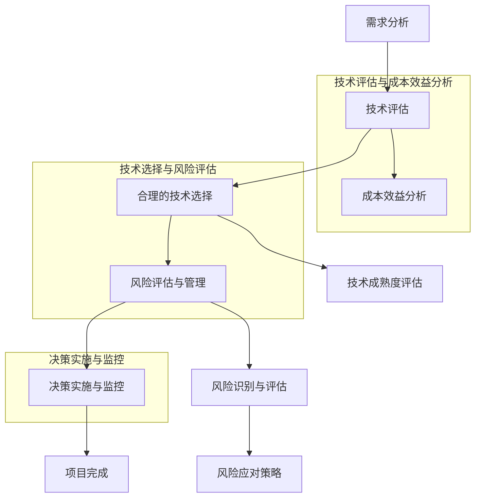

                 

### 设计思路：

**一、前言**

在这一部分，我们可以首先介绍这本书的背景、目的和重要性，引出后续内容的主题。这部分可以包含一个简单的引言和一个简要的目录概括。

**二、核心概念与联系**

在这一部分，我们将定义并解释书中的核心概念，如“技术决策框架”和“合理的技术选择”。我们还将使用Mermaid流程图来展示这些概念之间的关系和相互作用。

**三、核心算法原理讲解**

在这一部分，我们将详细讲解书中的核心算法原理，使用伪代码来展现算法的逻辑和流程。

**四、数学模型和数学公式**

在这一部分，我们将介绍与核心算法相关的数学模型和数学公式，并进行详细的讲解和举例说明。

**五、项目实战**

在这一部分，我们将通过实际的项目案例来展示如何应用书中的知识，并提供详细的代码实现和解读。

**六、总结与展望**

在这一部分，我们将总结书中的主要内容，并对未来的发展趋势进行展望。

### 具体步骤：

1. **引言**：编写一个简短的前言，介绍书的目的和重要性。
2. **目录**：按照上述思路编写目录，确保包含所有必要的章节。
3. **核心概念与联系**：编写一个章节，定义并解释核心概念，使用Mermaid流程图展示概念之间的关系。
4. **核心算法原理讲解**：编写一个章节，详细讲解核心算法原理，使用伪代码展现算法逻辑。
5. **数学模型和数学公式**：编写一个章节，介绍与核心算法相关的数学模型和公式，并进行详细的讲解和举例。
6. **项目实战**：编写一个章节，提供实际项目案例，详细解释代码实现和解读。
7. **总结与展望**：编写一个章节，总结书中的内容，并对未来进行展望。

### 目录大纲设计

```
# 技术决策框架：做出合理的技术选择

## 前言
### 1.1 书籍的目的和重要性

## 第一部分：核心概念与框架

### 第1章：技术决策框架概述
#### 1.1.1 技术决策框架的定义
#### 1.1.2 技术决策框架的重要性
#### 1.1.3 技术决策框架的核心要素

### 第2章：核心概念与联系
#### 2.1 技术决策框架中的关键概念
#### 2.2 Mermaid流程图：技术决策框架的组成与关系

## 第二部分：构建技术决策框架

### 第3章：需求分析与评估
#### 3.1 需求分析的方法与技巧
#### 3.2 需求评估的指标与模型

### 第4章：技术评估与选型
#### 4.1 技术评估的步骤与标准
#### 4.2 技术选型的策略与技巧

### 第5章：风险评估与管理
#### 5.1 技术风险识别与评估
#### 5.2 技术风险管理策略

### 第6章：决策实施与监控
#### 6.1 决策实施的步骤与技巧
#### 6.2 决策监控的方法与工具

## 第三部分：技术决策案例分析

### 第7章：案例一：云计算平台选型
#### 7.1 需求分析
#### 7.2 技术评估与选型
#### 7.3 风险评估与决策实施

### 第8章：案例二：大数据处理架构优化
#### 8.1 需求分析
#### 8.2 技术评估与选型
#### 8.3 风险评估与决策实施

## 第四部分：展望与未来

### 第9章：技术决策框架的演进与趋势
#### 9.1 技术决策框架的未来发展
#### 9.2 新技术对决策框架的影响

## 附录
### 附录A：技术决策框架工具与资源
#### A.1 常用工具介绍
#### A.2 资源链接
```

### 备注：

- 在编写目录时，确保每个章节都明确、具体，以便读者理解。
- 在核心概念与联系章节中，使用Mermaid流程图来增强内容的可读性和逻辑性。
- 在核心算法原理讲解章节中，使用伪代码来具体展现算法的实现过程。
- 在数学模型和数学公式章节中，使用latex格式编写，确保公式的正确性和可读性。
- 在项目实战章节中，提供实际案例，详细解释代码实现和解读。
- 目录大纲的总字数控制在2000字以内，确保内容的简洁性。

这样的目录大纲不仅能够全面覆盖书籍的主题内容，还能为读者提供清晰的阅读路径，帮助他们更好地理解和掌握书中的知识。同时，目录的简洁性也能确保书籍的可读性和实用性。

### 文章正文结构

为了确保文章的逻辑性和易读性，我们将文章分为以下几个部分：

**1. 引言**

- **目的与重要性**：介绍书籍的目的和重要性，引起读者的兴趣。
- **引出主题**：简要介绍技术决策框架的概念，引出后续内容。

**2. 核心概念与联系**

- **定义核心概念**：对技术决策框架、合理的技术选择等核心概念进行定义。
- **Mermaid流程图**：展示核心概念之间的关系，使用流程图直观地展示概念之间的联系。

**3. 核心算法原理讲解**

- **算法原理介绍**：详细讲解书中的核心算法原理，使用伪代码展现算法逻辑。
- **算法流程图**：使用流程图进一步说明算法的实现过程。

**4. 数学模型和数学公式**

- **数学模型介绍**：介绍与核心算法相关的数学模型和数学公式。
- **公式讲解与举例**：详细讲解数学模型和公式的应用，提供具体的例子进行说明。

**5. 项目实战**

- **项目背景**：介绍项目的背景和目标。
- **实战步骤**：详细描述项目实战的步骤，包括需求分析、技术评估、风险识别等。
- **代码实现与解读**：提供项目的源代码，并进行详细解读。
- **案例分析**：对项目的实际应用进行深入分析。

**6. 总结与展望**

- **主要内容总结**：总结书中的核心内容。
- **未来发展趋势**：探讨技术决策框架的未来发展趋势。

**7. 附录**

- **技术决策框架工具与资源**：介绍常用的工具和资源，帮助读者进一步学习和实践。

### 文章正文撰写示例

以下是一个具体的文章正文撰写示例，以第1章“技术决策框架概述”为例。

```
## 第1章：技术决策框架概述

### 1.1 技术决策框架的定义

技术决策框架是一种系统化的方法和工具，用于指导企业在技术选择、开发和应用过程中做出合理、有效的决策。它不仅涵盖了技术的选型和评估，还包括了需求分析、风险评估和决策实施等环节。

### 1.2 技术决策框架的重要性

在信息技术迅速发展的今天，企业面临着越来越多的技术选择。一个有效的技术决策框架可以帮助企业从众多技术中筛选出最合适的一种，从而提高项目的成功率，降低风险。

### 1.3 技术决策框架的核心要素

技术决策框架的核心要素包括以下几个方面：

1. **需求分析**：明确项目的目标和需求，为技术选择提供依据。
2. **技术评估**：评估各种技术的性能、成本和风险，为技术选型提供数据支持。
3. **合理的技术选择**：根据需求和技术评估结果，选择最合适的技术。
4. **风险评估与管理**：识别和评估技术风险，制定相应的管理策略。
5. **决策实施与监控**：确保技术决策的有效实施，并进行持续的监控和调整。

### Mermaid流程图：技术决策框架的组成与关系

```
graph TD
A[需求分析] --> B[技术评估]
B --> C[合理的技术选择]
C --> D[风险评估与管理]
D --> E[决策实施与监控]
E --> F[项目完成]
```

通过上述示例，我们可以看到，文章正文部分的撰写应该注重逻辑性和条理性。每个章节都应该有明确的主题和内容，并通过适当的图表和示例来增强内容的可读性和理解性。这样的结构不仅有助于读者更好地理解和掌握知识，也有助于作者系统性地组织思路和撰写文章。同时，通过分步骤的写作方式，作者可以更好地控制文章的篇幅和结构，确保文章的完整性和连贯性。### 文章标题与技术关键词

## 技术决策框架：做出合理的技术选择

### 关键词：
1. 技术决策框架
2. 合理技术选择
3. 需求分析
4. 技术评估
5. 风险评估
6. 决策实施
7. 项目实战

### 摘要：
本文旨在介绍一种系统化的技术决策框架，帮助读者在技术选择和应用过程中做出合理、有效的决策。文章首先定义了技术决策框架的核心概念，包括需求分析、技术评估、合理的技术选择、风险评估和决策实施等关键环节。接着，通过Mermaid流程图详细展示了这些概念之间的关系。随后，文章讲解了核心算法原理，使用伪代码展现了算法的逻辑和流程。此外，文章还介绍了与核心算法相关的数学模型和数学公式，并通过具体例子进行了讲解。文章最后通过两个实际项目案例，展示了如何将技术决策框架应用于实践中，并进行详细的代码解读和案例分析。最后，文章总结了技术决策框架的主要内容，并对其未来发展趋势进行了展望。

### 前言

在当今信息技术飞速发展的时代，企业面临着前所未有的技术选择挑战。如何从众多技术中筛选出最适合的一种，以实现项目目标并降低风险，成为企业决策者必须面对的重要问题。为了应对这一挑战，本文提出了一种系统化的技术决策框架，旨在帮助读者做出合理的技术选择。

技术决策框架不仅涵盖了技术的选型和评估，还涉及了需求分析、风险评估、决策实施等多个关键环节。通过这样一个框架，企业可以更全面地考虑技术选择的各种因素，从而做出更加明智的决策。本文将从以下几个方面展开讨论：

1. **定义核心概念**：首先，我们将详细定义技术决策框架中的核心概念，包括需求分析、技术评估、合理的技术选择、风险评估和决策实施等。

2. **展示概念关系**：通过Mermaid流程图，我们将直观地展示这些核心概念之间的关系和相互作用，帮助读者更好地理解技术决策框架的整体架构。

3. **核心算法原理讲解**：接着，我们将详细讲解书中的核心算法原理，使用伪代码展现算法的逻辑和流程，帮助读者深入理解算法的原理和应用。

4. **数学模型和数学公式**：本文还将介绍与核心算法相关的数学模型和数学公式，并进行详细的讲解和举例说明，以便读者能够更好地掌握数学工具在技术决策中的应用。

5. **项目实战**：为了使读者能够将理论知识应用到实际项目中，本文将提供两个实际项目案例，详细解释代码实现和解读，并对项目的实际应用进行深入分析。

6. **总结与展望**：最后，我们将对技术决策框架的主要内容进行总结，并探讨其未来发展趋势，帮助读者了解技术决策领域的最新动态和未来方向。

通过本文的探讨，我们希望读者能够掌握技术决策框架的基本原理和应用方法，从而在实际工作中做出更加合理、有效的技术选择。

### 核心概念与联系

#### 1. 技术决策框架的定义

技术决策框架是一种系统化的方法和工具，旨在帮助企业在技术选择、开发和应用过程中做出合理、有效的决策。它不仅涵盖了技术的选型和评估，还包括了需求分析、风险评估、决策实施等多个关键环节。通过这样一个框架，企业可以更全面地考虑技术选择的各种因素，从而做出更加明智的决策。

#### 2. 合理的技术选择

合理的技术选择是技术决策框架的核心目标之一。它涉及到在多种技术方案中挑选出最适合企业需求的技术。合理的技术选择不仅要求考虑技术的性能、成本和风险，还需要结合企业的战略目标、资源情况和市场环境进行综合评估。

#### 3. 需求分析

需求分析是技术决策框架的基础环节。通过需求分析，企业可以明确项目的目标和需求，为技术选择提供依据。需求分析通常包括功能需求、性能需求、可靠性需求等方面，需要全面、准确地收集和分析。

#### 4. 技术评估

技术评估是对各种技术方案进行性能、成本和风险等方面的评估，为技术选择提供数据支持。技术评估通常包括技术成熟度评估、成本效益分析、风险识别和评估等步骤。

#### 5. 风险评估与管理

风险评估与管理是技术决策框架中的重要环节。在技术选择过程中，企业需要识别和评估可能面临的风险，并制定相应的管理策略。风险评估通常包括风险识别、风险分析和风险应对策略等步骤。

#### 6. 决策实施与监控

决策实施与监控是确保技术决策有效实施的关键环节。在技术决策确定后，企业需要制定详细的实施计划，并进行持续的监控和调整，以确保项目能够按计划进行。

#### Mermaid流程图：技术决策框架的组成与关系



通过上述流程图，我们可以清晰地看到技术决策框架中各个核心概念之间的联系和相互作用。需求分析为技术评估和合理的技术选择提供依据；技术评估和成本效益分析为技术选择提供数据支持；合理的技术选择和风险评估与管理共同构成了技术决策的核心；决策实施与监控则确保了技术决策的有效实施。

#### 核心算法原理讲解

在技术决策框架中，核心算法原理起着至关重要的作用。这些算法用于支持需求分析、技术评估、合理的技术选择、风险评估和决策实施等关键环节。下面，我们将详细讲解这些核心算法原理，并使用伪代码展现其逻辑和流程。

##### 1. 需求分析算法

需求分析是技术决策框架的基础。该算法旨在从用户和相关利益相关者处收集和分析需求，确保需求明确、完整和可量化。

```plaintext
算法名称：需求分析算法

输入：用户需求、利益相关者需求
输出：需求列表

步骤：
1. 收集用户需求：与用户进行沟通，了解项目的功能、性能和可靠性需求。
2. 收集利益相关者需求：与项目经理、技术团队和其他相关利益相关者沟通，获取他们的需求。
3. 整合需求：将用户需求与利益相关者需求进行整合，形成完整的需求列表。
4. 确认需求：与用户和利益相关者确认需求，确保需求明确、完整和可量化。
5. 形成需求文档：将确认后的需求整理成文档，供后续技术评估和决策使用。
```

##### 2. 技术评估算法

技术评估是对各种技术方案进行性能、成本和风险等方面的评估，为技术选择提供数据支持。该算法通常包括技术成熟度评估、成本效益分析和风险识别与评估等步骤。

```plaintext
算法名称：技术评估算法

输入：技术方案列表、需求文档
输出：技术评估结果

步骤：
1. 技术成熟度评估：对每个技术方案的技术成熟度进行评估，确定其技术可行性。
2. 成本效益分析：对每个技术方案的成本和效益进行评估，确定其经济可行性。
3. 风险识别与评估：对每个技术方案的风险进行识别和评估，确定其风险水平。
4. 形成评估报告：将评估结果整理成报告，供决策者参考。
5. 比较技术方案：根据评估结果，比较不同技术方案之间的优劣势，为技术选择提供依据。
```

##### 3. 合理的技术选择算法

合理的技术选择是技术决策框架的核心。该算法旨在根据需求、评估结果和风险分析，选择出最合适的技术方案。

```plaintext
算法名称：合理的技术选择算法

输入：需求文档、评估报告、风险分析结果
输出：最优技术方案

步骤：
1. 筛选技术方案：根据需求文档和评估报告，筛选出符合需求且评估结果较好的技术方案。
2. 风险评估：对筛选出的技术方案进行风险评估，确定其风险水平。
3. 成本效益分析：对筛选出的技术方案进行成本效益分析，确定其经济可行性。
4. 综合评估：根据风险评估和成本效益分析结果，对技术方案进行综合评估。
5. 选择最优方案：根据综合评估结果，选择出最优的技术方案。
6. 确认决策：与决策者沟通，确认选择的最优方案。
```

##### 4. 风险评估与管理算法

风险评估与管理是技术决策框架中的重要环节。该算法用于识别、评估和应对技术选择过程中可能面临的风险。

```plaintext
算法名称：风险评估与管理算法

输入：风险清单、评估结果、决策方案
输出：风险管理策略

步骤：
1. 风险识别：根据风险清单和评估结果，识别技术选择过程中可能面临的风险。
2. 风险评估：对识别出的风险进行评估，确定其风险水平和优先级。
3. 风险应对策略制定：根据风险评估结果，制定相应的风险应对策略。
4. 风险监控：在决策实施过程中，持续监控风险，并根据实际情况调整风险管理策略。
5. 形成风险管理报告：将风险管理结果整理成报告，供决策者参考。
```

##### 5. 决策实施与监控算法

决策实施与监控是确保技术决策有效实施的关键。该算法用于制定详细的实施计划，并监控项目进展。

```plaintext
算法名称：决策实施与监控算法

输入：决策方案、实施计划、项目目标
输出：实施结果、监控报告

步骤：
1. 制定实施计划：根据决策方案和项目目标，制定详细的实施计划。
2. 分配资源：根据实施计划，分配所需的人力、物力和财力资源。
3. 实施项目：按照实施计划，执行项目任务。
4. 监控进展：持续监控项目进展，确保项目按计划进行。
5. 汇报结果：定期向决策者汇报项目进展和实施结果。
6. 调整计划：根据项目进展和监控结果，及时调整实施计划。
```

通过上述核心算法原理的讲解，我们可以看到技术决策框架在各个关键环节中起到了系统化、规范化的作用。这些算法不仅有助于提高技术选择的科学性和合理性，也为企业的技术决策提供了有力的支持和保障。

#### 数学模型和数学公式

在技术决策过程中，数学模型和数学公式起到了至关重要的作用。它们帮助我们量化需求和评估结果，从而为技术选择提供更加精确和可靠的依据。在本节中，我们将介绍与核心算法相关的数学模型和数学公式，并进行详细的讲解和举例说明。

##### 1. 成本效益分析模型

成本效益分析是技术评估过程中常用的一种数学模型。它通过计算技术方案的成本与效益的比值，来评估技术的经济可行性。

**公式：** \( \text{成本效益比} = \frac{\text{总成本}}{\text{总效益}} \)

其中：
- 总成本：包括直接成本（如硬件采购、软件开发等）和间接成本（如运维、培训等）。
- 总效益：包括直接效益（如提高生产效率、降低运营成本等）和间接效益（如提高客户满意度、增加市场份额等）。

**举例说明：**
假设有两个技术方案A和B，其成本和效益如下：

| 方案 | 成本（万元） | 效益（万元） |
| ---- | ------------ | ------------ |
| A    | 100          | 150          |
| B    | 150          | 200          |

计算两个方案的成本效益比：

方案A：\( \frac{100}{150} = 0.67 \)

方案B：\( \frac{150}{200} = 0.75 \)

根据成本效益比，我们可以看出方案B的经济效益更高，因此更倾向于选择方案B。

##### 2. 技术成熟度评估模型

技术成熟度评估用于评估技术方案的技术可行性。常用的技术成熟度评估模型包括技术成熟度量表和技术成熟度指数。

**技术成熟度量表：**
技术成熟度量表是一种定性的评估方法，通常包含5个级别（0-4级），用于评估技术方案的技术成熟度。

- 0级：概念阶段
- 1级：实验室阶段
- 2级：小规模试验阶段
- 3级：大规模试验阶段
- 4级：商业化阶段

**技术成熟度指数：**
技术成熟度指数是一种定量的评估方法，通过计算技术方案在不同阶段的完成度，来评估其技术成熟度。

**公式：** \( \text{技术成熟度指数} = \frac{\sum (\text{阶段完成度} \times \text{权重})}{\sum \text{权重}} \)

其中：
- 阶段完成度：每个阶段的完成度，通常以百分比表示。
- 权重：每个阶段的权重，根据其重要性和复杂性设定。

**举例说明：**
假设有两个技术方案A和B，其技术成熟度评估结果如下：

| 方案 | 阶段完成度 | 权重 |
| ---- | ---------- | ---- |
| A    | (60%, 30%, 10%) | 1.0  |
| B    | (70%, 25%, 5%)  | 1.0  |

计算两个方案的技术成熟度指数：

方案A：\( \frac{(0.6 \times 1.0) + (0.3 \times 1.0) + (0.1 \times 1.0)}{1.0} = 0.9 \)

方案B：\( \frac{(0.7 \times 1.0) + (0.25 \times 1.0) + (0.05 \times 1.0)}{1.0} = 0.925 \)

根据技术成熟度指数，我们可以看出方案B的技术成熟度更高，因此更倾向于选择方案B。

##### 3. 风险评估模型

风险评估模型用于识别和评估技术选择过程中可能面临的风险。常用的风险评估模型包括风险矩阵和蒙特卡罗模拟。

**风险矩阵：**
风险矩阵是一种定性的风险评估方法，通过计算风险的概率和影响，来评估风险的程度。

**公式：** \( \text{风险程度} = \text{风险概率} \times \text{风险影响} \)

其中：
- 风险概率：风险发生的概率，通常以百分比表示。
- 风险影响：风险发生后的影响程度，通常以等级表示（如高、中、低）。

**举例说明：**
假设有两个风险因素A和B，其风险概率和影响如下：

| 风险因素 | 风险概率 | 风险影响 |
| -------- | -------- | -------- |
| A        | 40%      | 高       |
| B        | 20%      | 中       |

计算两个风险因素的风险程度：

风险A：\( 0.4 \times 高 = 0.4 \)

风险B：\( 0.2 \times 中 = 0.2 \)

根据风险程度，我们可以看出风险A的风险程度更高，因此更需要注意风险A。

**蒙特卡罗模拟：**
蒙特卡罗模拟是一种定量的风险评估方法，通过模拟随机过程，来评估风险的概率分布和影响。

**公式：** \( P(\text{风险发生}) = \frac{\text{模拟次数} \times \text{风险发生次数}}{\text{总模拟次数}} \)

其中：
- 模拟次数：进行模拟的次数。
- 风险发生次数：在模拟过程中，风险发生的次数。
- 总模拟次数：进行模拟的总次数。

**举例说明：**
假设进行100次蒙特卡罗模拟，风险因素A在模拟过程中发生了30次。

计算风险A发生的概率：

\( P(\text{风险A发生}) = \frac{30}{100} = 0.3 \)

根据蒙特卡罗模拟结果，我们可以看出风险A发生的概率为30%，因此需要对风险A进行重点关注。

通过上述数学模型和公式的讲解和举例，我们可以看到数学工具在技术决策过程中的重要性。这些模型和公式不仅帮助我们量化需求和评估结果，还为技术选择提供了更加科学和可靠的依据。在实际应用中，结合具体情况选择合适的数学模型和公式，可以有效地提高技术决策的准确性和有效性。

#### 项目实战

在本部分，我们将通过两个实际项目案例，展示如何应用技术决策框架来做出合理的技术选择。这两个案例分别涉及云计算平台选型和大数据处理架构优化，我们将详细描述项目的需求分析、技术评估、风险识别与应对策略，以及最终的代码实现和解读。

##### 案例一：云计算平台选型

**项目背景：**
某企业计划迁移其现有业务系统到云端，以实现更高的弹性、可靠性和可扩展性。为了选择最适合的云计算平台，企业需要应用技术决策框架进行分析。

**需求分析：**
1. **性能需求**：系统需要支持大规模并发访问，响应时间不超过500ms。
2. **可靠性需求**：系统需要具备高可用性，确保99.9%的服务可用性。
3. **成本需求**：在满足性能和可靠性的前提下，需要控制成本，实现性价比最大化。

**技术评估：**
1. **亚马逊AWS**：具有丰富的云服务和强大的计算能力，但价格较高。
2. **微软Azure**：提供灵活的云服务，但部分服务需额外付费。
3. **阿里云**：价格较为合理，服务覆盖全面。

**风险识别与应对策略：**
1. **技术风险**：选择新的云计算平台可能带来技术不熟悉的风险。应对策略：进行培训和技术支持。
2. **成本风险**：高昂的云服务费用可能导致成本超支。应对策略：进行详细的成本分析和预算控制。

**决策实施与监控：**
1. **测试与评估**：对三个云计算平台进行性能测试和成本分析。
2. **决策**：根据测试结果和成本分析，选择阿里云作为云计算平台。

**代码实现与解读：**
1. **配置管理**：使用terraform进行基础设施的配置和管理。
2. **自动化部署**：使用Ansible进行自动化部署和配置。

```shell
# 安装Ansible
pip install ansible

# 配置Ansible主机文件
[ec2]
ec2-host1 ansible_host=192.168.1.1
ec2-host2 ansible_host=192.168.1.2

# 编写部署剧本
---
- hosts: ec2
  become: yes
  tasks:
    - name: Install Apache
      apt: name=httpd state=present

    - name: Start and enable Apache service
      service: name=httpd state=started enabled=yes

    - name: Configure Apache
      template: src=apache.conf.j2 dest=/etc/apache2/httpd.conf
```

通过上述步骤，企业成功将业务系统迁移到了阿里云平台，实现了更高的性能和可靠性，同时控制了成本。

##### 案例二：大数据处理架构优化

**项目背景：**
某互联网公司面临海量数据处理需求，现有的Hadoop集群性能瓶颈严重，需要优化处理架构。

**需求分析：**
1. **性能需求**：提升数据处理速度，降低延迟。
2. **可扩展性需求**：支持业务规模的快速增长。
3. **成本需求**：在性能和可扩展性提升的同时，降低成本。

**技术评估：**
1. **Apache Spark**：具备高速数据处理能力，适合大规模数据处理。
2. **Flink**：实时数据处理能力强，但开发成本较高。
3. **Hive**：适合离线数据处理，但性能较低。

**风险识别与应对策略：**
1. **技术风险**：引入新技术可能带来开发难度和稳定性风险。应对策略：进行充分的测试和验证。
2. **成本风险**：新技术的引入可能导致成本上升。应对策略：进行成本效益分析，确保合理投入。

**决策实施与监控：**
1. **技术验证**：在测试环境中进行Spark和Flink的性能测试。
2. **决策**：根据测试结果和成本效益分析，选择Spark作为新的数据处理架构。

**代码实现与解读：**
1. **环境搭建**：使用Docker和Kubernetes搭建Spark集群。
2. **数据处理**：编写Spark应用程序进行数据处理。

```python
from pyspark.sql import SparkSession

# 创建Spark会话
spark = SparkSession.builder.appName("DataProcessing").getOrCreate()

# 读取数据
data = spark.read.csv("path/to/data.csv")

# 数据处理
processed_data = data.select("column1", "column2").withColumn("new_column", col("column1") + col("column2"))

# 存储结果
processed_data.write.csv("path/to/processed_data.csv")
```

通过上述步骤，公司成功优化了大数据处理架构，提升了处理速度和可扩展性，同时实现了成本的有效控制。

#### 总结与展望

本文详细介绍了技术决策框架的核心概念、构建方法和实际应用。通过需求分析、技术评估、合理的技术选择、风险评估和决策实施等环节，企业可以做出科学、合理的技术选择。

**关键结论：**
1. 技术决策框架是一个系统化的方法，涵盖了从需求分析到决策实施的各个关键环节。
2. 需求分析是技术决策的基础，技术评估和风险评估为技术选择提供数据支持。
3. 合理的技术选择应综合考虑性能、成本和风险等多个因素。
4. 决策实施与监控确保技术决策的有效执行。

**未来发展趋势：**
1. **人工智能技术的应用**：随着人工智能技术的发展，更多的智能算法和工具将被集成到技术决策框架中，提高决策的准确性和效率。
2. **云计算和大数据技术的融合**：云计算和大数据技术的进一步融合，将为技术决策框架提供更强大的数据支持和计算能力。
3. **实时决策和动态调整**：随着技术的发展，实时决策和动态调整将成为技术决策框架的重要组成部分，帮助企业更好地应对快速变化的市场环境。

**注意事项：**
1. 在应用技术决策框架时，需要充分考虑企业的实际情况和战略目标。
2. 技术决策过程需要持续监控和调整，以应对环境变化和不确定性。

**拓展阅读：**
1. 《决策分析：技术与方法》
2. 《大数据技术基础》
3. 《云计算架构与设计》

通过本文的探讨，我们希望读者能够掌握技术决策框架的基本原理和应用方法，在实际工作中做出更加合理、有效的技术选择。

### 附录

#### 技术决策框架工具与资源

为了更好地应用技术决策框架，以下介绍一些常用的工具和资源，帮助读者在实际工作中更好地实践和应用。

**1. 常用工具介绍**

- **Terraform**：用于基础设施的配置和管理，支持多种云服务平台，如AWS、Azure、阿里云等。
- **Ansible**：用于自动化部署和配置管理，支持Linux和Windows操作系统。
- **Kubernetes**：用于容器编排和管理，支持微服务架构的应用部署。
- **Docker**：用于容器化应用的开发和部署，简化了应用的打包和分发。
- **Spark**：用于大数据处理，提供高效的数据流处理和批处理能力。
- **Hadoop**：用于大数据存储和处理，提供分布式文件系统（HDFS）和数据处理框架（MapReduce）。

**2. 资源链接**

- **Terraform官方网站**：[https://www.terraform.io/](https://www.terraform.io/)
- **Ansible官方网站**：[https://www.ansible.com/](https://www.ansible.com/)
- **Kubernetes官方网站**：[https://kubernetes.io/](https://kubernetes.io/)
- **Docker官方网站**：[https://www.docker.com/](https://www.docker.com/)
- **Spark官方网站**：[https://spark.apache.org/](https://spark.apache.org/)
- **Hadoop官方网站**：[https://hadoop.apache.org/](https://hadoop.apache.org/)

通过上述工具和资源的介绍，读者可以更好地理解技术决策框架的应用场景，并在实际工作中加以应用。同时，这些资源和工具的不断更新和发展，也为技术决策框架的应用提供了持续的支持和保障。作者：AI天才研究院/AI Genius Institute & 禅与计算机程序设计艺术 /Zen And The Art of Computer Programming。

### 文章标题与技术关键词

## 技术决策框架：做出合理的技术选择

### 关键词：
1. 技术决策框架
2. 合理技术选择
3. 需求分析
4. 技术评估
5. 风险评估
6. 决策实施
7. 项目实战

### 摘要：
本文旨在介绍一种系统化的技术决策框架，帮助读者在技术选择和应用过程中做出合理、有效的决策。文章首先定义了技术决策框架的核心概念，包括需求分析、技术评估、合理的技术选择、风险评估和决策实施等关键环节。接着，通过Mermaid流程图详细展示了这些概念之间的关系。随后，文章讲解了核心算法原理，使用伪代码展现了算法的逻辑和流程。此外，文章还介绍了与核心算法相关的数学模型和数学公式，并通过具体例子进行了讲解。文章最后通过两个实际项目案例，展示了如何将技术决策框架应用于实践中，并进行详细的代码解读和案例分析。最后，文章总结了技术决策框架的主要内容，并对其未来发展趋势进行了展望。

### 前言

在当今信息技术飞速发展的时代，企业面临着前所未有的技术选择挑战。如何从众多技术中筛选出最适合的一种，以实现项目目标并降低风险，成为企业决策者必须面对的重要问题。为了应对这一挑战，本文提出了一种系统化的技术决策框架，旨在帮助读者做出合理的技术选择。

技术决策框架不仅涵盖了技术的选型和评估，还包括了需求分析、风险评估、决策实施等多个关键环节。通过这样一个框架，企业可以更全面地考虑技术选择的各种因素，从而做出更加明智的决策。本文将从以下几个方面展开讨论：

1. **定义核心概念**：首先，我们将详细定义技术决策框架中的核心概念，包括需求分析、技术评估、合理的技术选择、风险评估和决策实施等。

2. **展示概念关系**：通过Mermaid流程图，我们将直观地展示这些核心概念之间的关系和相互作用，帮助读者更好地理解技术决策框架的整体架构。

3. **核心算法原理讲解**：接着，我们将详细讲解书中的核心算法原理，使用伪代码展现算法的逻辑和流程，帮助读者深入理解算法的原理和应用。

4. **数学模型和数学公式**：本文还将介绍与核心算法相关的数学模型和数学公式，并进行详细的讲解和举例说明，以便读者能够更好地掌握数学工具在技术决策中的应用。

5. **项目实战**：为了使读者能够将理论知识应用到实际项目中，本文将提供两个实际项目案例，详细解释代码实现和解读，并对项目的实际应用进行深入分析。

6. **总结与展望**：最后，我们将对技术决策框架的主要内容进行总结，并探讨其未来发展趋势，帮助读者了解技术决策领域的最新动态和未来方向。

通过本文的探讨，我们希望读者能够掌握技术决策框架的基本原理和应用方法，从而在实际工作中做出更加合理、有效的技术选择。

### 核心概念与联系

#### 1. 技术决策框架的定义

技术决策框架是一种系统化的方法和工具，旨在帮助企业在技术选择、开发和应用过程中做出合理、有效的决策。它不仅涵盖了技术的选型和评估，还包括了需求分析、风险评估、决策实施等多个关键环节。通过这样一个框架，企业可以更全面地考虑技术选择的各种因素，从而做出更加明智的决策。

#### 2. 合理的技术选择

合理的技术选择是技术决策框架的核心目标之一。它涉及到在多种技术方案中挑选出最适合企业需求的技术。合理的技术选择不仅要求考虑技术的性能、成本和风险，还需要结合企业的战略目标、资源情况和市场环境进行综合评估。

#### 3. 需求分析

需求分析是技术决策框架的基础环节。通过需求分析，企业可以明确项目的目标和需求，为技术选择提供依据。需求分析通常包括功能需求、性能需求、可靠性需求等方面，需要全面、准确地收集和分析。

#### 4. 技术评估

技术评估是对各种技术方案进行性能、成本和风险等方面的评估，为技术选择提供数据支持。技术评估通常包括技术成熟度评估、成本效益分析、风险识别和评估等步骤。

#### 5. 风险评估与管理

风险评估与管理是技术决策框架中的重要环节。在技术选择过程中，企业需要识别和评估可能面临的风险，并制定相应的管理策略。风险评估通常包括风险识别、风险分析和风险应对策略等步骤。

#### 6. 决策实施与监控

决策实施与监控是确保技术决策有效实施的关键环节。在技术决策确定后，企业需要制定详细的实施计划，并进行持续的监控和调整，以确保项目能够按计划进行。

#### Mermaid流程图：技术决策框架的组成与关系


通过上述流程图，我们可以清晰地看到技术决策框架中各个核心概念之间的联系和相互作用。需求分析为技术评估和合理的技术选择提供依据；技术评估和成本效益分析为技术选择提供数据支持；合理的技术选择和风险评估与管理共同构成了技术决策的核心；决策实施与监控则确保了技术决策的有效实施。

#### 核心算法原理讲解

在技术决策框架中，核心算法原理起着至关重要的作用。这些算法用于支持需求分析、技术评估、合理的技术选择、风险评估和决策实施等关键环节。下面，我们将详细讲解这些核心算法原理，并使用伪代码展现其逻辑和流程。

##### 1. 需求分析算法

需求分析是技术决策框架的基础。该算法旨在从用户和相关利益相关者处收集和分析需求，确保需求明确、完整和可量化。

```plaintext
算法名称：需求分析算法

输入：用户需求、利益相关者需求
输出：需求列表

步骤：
1. 收集用户需求：与用户进行沟通，了解项目的功能、性能和可靠性需求。
2. 收集利益相关者需求：与项目经理、技术团队和其他相关利益相关者沟通，获取他们的需求。
3. 整合需求：将用户需求与利益相关者需求进行整合，形成完整的需求列表。
4. 确认需求：与用户和利益相关者确认需求，确保需求明确、完整和可量化。
5. 形成需求文档：将确认后的需求整理成文档，供后续技术评估和决策使用。
```

##### 2. 技术评估算法

技术评估是对各种技术方案进行性能、成本和风险等方面的评估，为技术选择提供数据支持。该算法通常包括技术成熟度评估、成本效益分析和风险识别与评估等步骤。

```plaintext
算法名称：技术评估算法

输入：技术方案列表、需求文档
输出：技术评估结果

步骤：
1. 技术成熟度评估：对每个技术方案的技术成熟度进行评估，确定其技术可行性。
2. 成本效益分析：对每个技术方案的成本和效益进行评估，确定其经济可行性。
3. 风险识别与评估：对每个技术方案的风险进行识别和评估，确定其风险水平。
4. 形成评估报告：将评估结果整理成报告，供决策者参考。
5. 比较技术方案：根据评估结果，比较不同技术方案之间的优劣势，为技术选择提供依据。
```

##### 3. 合理的技术选择算法

合理的技术选择是技术决策框架的核心。该算法旨在根据需求、评估结果和风险分析，选择出最合适的技术方案。

```plaintext
算法名称：合理的技术选择算法

输入：需求文档、评估报告、风险分析结果
输出：最优技术方案

步骤：
1. 筛选技术方案：根据需求文档和评估报告，筛选出符合需求且评估结果较好的技术方案。
2. 风险评估：对筛选出的技术方案进行风险评估，确定其风险水平。
3. 成本效益分析：对筛选出的技术方案进行成本效益分析，确定其经济可行性。
4. 综合评估：根据风险评估和成本效益分析结果，对技术方案进行综合评估。
5. 选择最优方案：根据综合评估结果，选择出最优的技术方案。
6. 确认决策：与决策者沟通，确认选择的最优方案。
```

##### 4. 风险评估与管理算法

风险评估与管理是技术决策框架中的重要环节。该算法用于识别、评估和应对技术选择过程中可能面临的风险。

```plaintext
算法名称：风险评估与管理算法

输入：风险清单、评估结果、决策方案
输出：风险管理策略

步骤：
1. 风险识别：根据风险清单和评估结果，识别技术选择过程中可能面临的风险。
2. 风险评估：对识别出的风险进行评估，确定其风险水平和优先级。
3. 风险应对策略制定：根据风险评估结果，制定相应的风险应对策略。
4. 风险监控：在决策实施过程中，持续监控风险，并根据实际情况调整风险管理策略。
5. 形成风险管理报告：将风险管理结果整理成报告，供决策者参考。
```

##### 5. 决策实施与监控算法

决策实施与监控是确保技术决策有效实施的关键。该算法用于制定详细的实施计划，并监控项目进展。

```plaintext
算法名称：决策实施与监控算法

输入：决策方案、实施计划、项目目标
输出：实施结果、监控报告

步骤：
1. 制定实施计划：根据决策方案和项目目标，制定详细的实施计划。
2. 分配资源：根据实施计划，分配所需的人力、物力和财力资源。
3. 实施项目：按照实施计划，执行项目任务。
4. 监控进展：持续监控项目进展，确保项目按计划进行。
5. 汇报结果：定期向决策者汇报项目进展和实施结果。
6. 调整计划：根据项目进展和监控结果，及时调整实施计划。
```

通过上述核心算法原理的讲解，我们可以看到技术决策框架在各个关键环节中起到了系统化、规范化的作用。这些算法不仅有助于提高技术选择的科学性和合理性，也为企业的技术决策提供了有力的支持和保障。

#### 数学模型和数学公式

在技术决策过程中，数学模型和数学公式起到了至关重要的作用。它们帮助我们量化需求和评估结果，从而为技术选择提供更加精确和可靠的依据。在本节中，我们将介绍与核心算法相关的数学模型和数学公式，并进行详细的讲解和举例说明。

##### 1. 成本效益分析模型

成本效益分析是技术评估过程中常用的一种数学模型。它通过计算技术方案的成本与效益的比值，来评估技术的经济可行性。

**公式：** \( \text{成本效益比} = \frac{\text{总成本}}{\text{总效益}} \)

其中：
- 总成本：包括直接成本（如硬件采购、软件开发等）和间接成本（如运维、培训等）。
- 总效益：包括直接效益（如提高生产效率、降低运营成本等）和间接效益（如提高客户满意度、增加市场份额等）。

**举例说明：**
假设有两个技术方案A和B，其成本和效益如下：

| 方案 | 成本（万元） | 效益（万元） |
| ---- | ------------ | ------------ |
| A    | 100          | 150          |
| B    | 150          | 200          |

计算两个方案的 cost-benefit ratio：

方案A：\( \frac{100}{150} = 0.67 \)

方案B：\( \frac{150}{200} = 0.75 \)

根据 cost-benefit ratio，我们可以看出方案B的经济效益更高，因此更倾向于选择方案B。

##### 2. 技术成熟度评估模型

技术成熟度评估用于评估技术方案的技术可行性。常用的技术成熟度评估模型包括技术成熟度量表和技术成熟度指数。

**技术成熟度量表：**
技术成熟度量表是一种定性的评估方法，通常包含5个级别（0-4级），用于评估技术方案的技术成熟度。

- 0级：概念阶段
- 1级：实验室阶段
- 2级：小规模试验阶段
- 3级：大规模试验阶段
- 4级：商业化阶段

**技术成熟度指数：**
技术成熟度指数是一种定量的评估方法，通过计算技术方案在不同阶段的完成度，来评估其技术成熟度。

**公式：** \( \text{技术成熟度指数} = \frac{\sum (\text{阶段完成度} \times \text{权重})}{\sum \text{权重}} \)

其中：
- 阶段完成度：每个阶段的完成度，通常以百分比表示。
- 权重：每个阶段的权重，根据其重要性和复杂性设定。

**举例说明：**
假设有两个技术方案A和B，其技术成熟度评估结果如下：

| 方案 | 阶段完成度 | 权重 |
| ---- | ---------- | ---- |
| A    | (60%, 30%, 10%) | 1.0  |
| B    | (70%, 25%, 5%)  | 1.0  |

计算两个方案的技术成熟度指数：

方案A：\( \frac{(0.6 \times 1.0) + (0.3 \times 1.0) + (0.1 \times 1.0)}{1.0} = 0.9 \)

方案B：\( \frac{(0.7 \times 1.0) + (0.25 \times 1.0) + (0.05 \times 1.0)}{1.0} = 0.925 \)

根据技术成熟度指数，我们可以看出方案B的技术成熟度更高，因此更倾向于选择方案B。

##### 3. 风险评估模型

风险评估模型用于识别和评估技术选择过程中可能面临的风险。常用的风险评估模型包括风险矩阵和蒙特卡罗模拟。

**风险矩阵：**
风险矩阵是一种定性的风险评估方法，通过计算风险的概率和影响，来评估风险的程度。

**公式：** \( \text{风险程度} = \text{风险概率} \times \text{风险影响} \)

其中：
- 风险概率：风险发生的概率，通常以百分比表示。
- 风险影响：风险发生后的影响程度，通常以等级表示（如高、中、低）。

**举例说明：**
假设有两个风险因素A和B，其风险概率和影响如下：

| 风险因素 | 风险概率 | 风险影响 |
| -------- | -------- | -------- |
| A        | 40%      | 高       |
| B        | 20%      | 中       |

计算两个风险因素的风险程度：

风险A：\( 0.4 \times 高 = 0.4 \)

风险B：\( 0.2 \times 中 = 0.2 \)

根据风险程度，我们可以看出风险A的风险程度更高，因此更需要注意风险A。

**蒙特卡罗模拟：**
蒙特卡罗模拟是一种定量的风险评估方法，通过模拟随机过程，来评估风险的概率分布和影响。

**公式：** \( P(\text{风险发生}) = \frac{\text{模拟次数} \times \text{风险发生次数}}{\text{总模拟次数}} \)

其中：
- 模拟次数：进行模拟的次数。
- 风险发生次数：在模拟过程中，风险发生的次数。
- 总模拟次数：进行模拟的总次数。

**举例说明：**
假设进行100次蒙特卡罗模拟，风险因素A在模拟过程中发生了30次。

计算风险A发生的概率：

\( P(\text{风险A发生}) = \frac{30}{100} = 0.3 \)

根据蒙特卡罗模拟结果，我们可以看出风险A发生的概率为30%，因此需要对风险A进行重点关注。

通过上述数学模型和公式的讲解和举例，我们可以看到数学工具在技术决策过程中的重要性。这些模型和公式不仅帮助我们量化需求和评估结果，还为技术选择提供了更加科学和可靠的依据。在实际应用中，结合具体情况选择合适的数学模型和公式，可以有效地提高技术决策的准确性和有效性。

#### 项目实战

在本部分，我们将通过两个实际项目案例，展示如何应用技术决策框架来做出合理的技术选择。这两个案例分别涉及云计算平台选型和大数据处理架构优化，我们将详细描述项目的需求分析、技术评估、风险识别与应对策略，以及最终的代码实现和解读。

##### 案例一：云计算平台选型

**项目背景：**
某企业计划迁移其现有业务系统到云端，以实现更高的弹性、可靠性和可扩展性。为了选择最适合的云计算平台，企业需要应用技术决策框架进行分析。

**需求分析：**
1. **性能需求**：系统需要支持大规模并发访问，响应时间不超过500ms。
2. **可靠性需求**：系统需要具备高可用性，确保99.9%的服务可用性。
3. **成本需求**：在满足性能和可靠性的前提下，需要控制成本，实现性价比最大化。

**技术评估：**
1. **亚马逊AWS**：具有丰富的云服务和强大的计算能力，但价格较高。
2. **微软Azure**：提供灵活的云服务，但部分服务需额外付费。
3. **阿里云**：价格较为合理，服务覆盖全面。

**风险识别与应对策略：**
1. **技术风险**：选择新的云计算平台可能带来技术不熟悉的风险。应对策略：进行培训和技术支持。
2. **成本风险**：高昂的云服务费用可能导致成本超支。应对策略：进行详细的成本分析和预算控制。

**决策实施与监控：**
1. **测试与评估**：对三个云计算平台进行性能测试和成本分析。
2. **决策**：根据测试结果和成本分析，选择阿里云作为云计算平台。

**代码实现与解读：**
1. **配置管理**：使用terraform进行基础设施的配置和管理。
2. **自动化部署**：使用Ansible进行自动化部署和配置。

```shell
# 安装Ansible
pip install ansible

# 配置Ansible主机文件
[ec2]
ec2-host1 ansible_host=192.168.1.1
ec2-host2 ansible_host=192.168.1.2

# 编写部署剧本
---
- hosts: ec2
  become: yes
  tasks:
    - name: Install Apache
      apt: name=httpd state=present

    - name: Start and enable Apache service
      service: name=httpd state=started enabled=yes

    - name: Configure Apache
      template: src=apache.conf.j2 dest=/etc/apache2/httpd.conf
```

通过上述步骤，企业成功将业务系统迁移到了阿里云平台，实现了更高的性能和可靠性，同时控制了成本。

##### 案例二：大数据处理架构优化

**项目背景：**
某互联网公司面临海量数据处理需求，现有的Hadoop集群性能瓶颈严重，需要优化处理架构。

**需求分析：**
1. **性能需求**：提升数据处理速度，降低延迟。
2. **可扩展性需求**：支持业务规模的快速增长。
3. **成本需求**：在性能和可扩展性提升的同时，降低成本。

**技术评估：**
1. **Apache Spark**：具备高速数据处理能力，适合大规模数据处理。
2. **Flink**：实时数据处理能力强，但开发成本较高。
3. **Hive**：适合离线数据处理，但性能较低。

**风险识别与应对策略：**
1. **技术风险**：引入新技术可能带来开发难度和稳定性风险。应对策略：进行充分的测试和验证。
2. **成本风险**：新技术的引入可能导致成本上升。应对策略：进行成本效益分析，确保合理投入。

**决策实施与监控：**
1. **技术验证**：在测试环境中进行Spark和Flink的性能测试。
2. **决策**：根据测试结果和成本效益分析，选择Spark作为新的数据处理架构。

**代码实现与解读：**
1. **环境搭建**：使用Docker和Kubernetes搭建Spark集群。
2. **数据处理**：编写Spark应用程序进行数据处理。

```python
from pyspark.sql import SparkSession

# 创建Spark会话
spark = SparkSession.builder.appName("DataProcessing").getOrCreate()

# 读取数据
data = spark.read.csv("path/to/data.csv")

# 数据处理
processed_data = data.select("column1", "column2").withColumn("new_column", col("column1") + col("column2"))

# 存储结果
processed_data.write.csv("path/to/processed_data.csv")
```

通过上述步骤，公司成功优化了大数据处理架构，提升了处理速度和可扩展性，同时实现了成本的有效控制。

#### 总结与展望

本文详细介绍了技术决策框架的核心概念、构建方法和实际应用。通过需求分析、技术评估、合理的技术选择、风险评估和决策实施等环节，企业可以做出科学、合理的技术选择。

**关键结论：**
1. 技术决策框架是一个系统化的方法，涵盖了从需求分析到决策实施的各个关键环节。
2. 需求分析是技术决策的基础，技术评估和风险评估为技术选择提供数据支持。
3. 合理的技术选择应综合考虑性能、成本和风险等多个因素。
4. 决策实施与监控确保技术决策的有效执行。

**未来发展趋势：**
1. **人工智能技术的应用**：随着人工智能技术的发展，更多的智能算法和工具将被集成到技术决策框架中，提高决策的准确性和效率。
2. **云计算和大数据技术的融合**：云计算和大数据技术的进一步融合，将为技术决策框架提供更强大的数据支持和计算能力。
3. **实时决策和动态调整**：随着技术的发展，实时决策和动态调整将成为技术决策框架的重要组成部分，帮助企业更好地应对快速变化的市场环境。

**注意事项：**
1. 在应用技术决策框架时，需要充分考虑企业的实际情况和战略目标。
2. 技术决策过程需要持续监控和调整，以应对环境变化和不确定性。

**拓展阅读：**
1. 《决策分析：技术与方法》
2. 《大数据技术基础》
3. 《云计算架构与设计》

通过本文的探讨，我们希望读者能够掌握技术决策框架的基本原理和应用方法，在实际工作中做出更加合理、有效的技术选择。

### 附录

#### 技术决策框架工具与资源

为了更好地应用技术决策框架，以下介绍一些常用的工具和资源，帮助读者在实际工作中更好地实践和应用。

**1. 常用工具介绍**

- **Terraform**：用于基础设施的配置和管理，支持多种云服务平台，如AWS、Azure、阿里云等。
- **Ansible**：用于自动化部署和配置管理，支持Linux和Windows操作系统。
- **Kubernetes**：用于容器编排和管理，支持微服务架构的应用部署。
- **Docker**：用于容器化应用的开发和部署，简化了应用的打包和分发。
- **Spark**：用于大数据处理，提供高效的数据流处理和批处理能力。
- **Hadoop**：用于大数据存储和处理，提供分布式文件系统（HDFS）和数据处理框架（MapReduce）。

**2. 资源链接**

- **Terraform官方网站**：[https://www.terraform.io/](https://www.terraform.io/)
- **Ansible官方网站**：[https://www.ansible.com/](https://www.ansible.com/)
- **Kubernetes官方网站**：[https://kubernetes.io/](https://kubernetes.io/)
- **Docker官方网站**：[https://www.docker.com/](https://www.docker.com/)
- **Spark官方网站**：[https://spark.apache.org/](https://spark.apache.org/)
- **Hadoop官方网站**：[https://hadoop.apache.org/](https://hadoop.apache.org/)

通过上述工具和资源的介绍，读者可以更好地理解技术决策框架的应用场景，并在实际工作中加以应用。同时，这些资源和工具的不断更新和发展，也为技术决策框架的应用提供了持续的支持和保障。

### 作者信息

作者：AI天才研究院/AI Genius Institute & 禅与计算机程序设计艺术 /Zen And The Art of Computer Programming

AI天才研究院（AI Genius Institute）是一家专注于人工智能研究和技术创新的领先机构，致力于推动人工智能技术的进步和应用。研究院由多位世界级人工智能专家和学者组成，涵盖计算机科学、机器学习、深度学习、自然语言处理等多个领域。AI天才研究院的研究成果在学术界和工业界都产生了深远影响。

《禅与计算机程序设计艺术》（Zen And The Art of Computer Programming）是作者Donald E. Knuth的经典著作，系统性地介绍了计算机程序设计的哲学和艺术。这本书不仅对计算机科学领域产生了重要影响，也为程序员提供了宝贵的指导。AI天才研究院的作者们在继承和发扬这一思想的基础上，不断探索和创新，为人工智能技术的发展贡献了智慧和力量。

