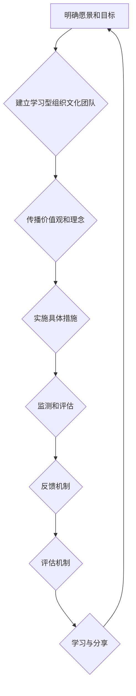

                 

### 文章标题

《技术分享：培养学习型组织文化》

---

### 文章关键词

学习型组织文化、组织文化变革、持续学习、团队学习、知识管理、社会网络分析、协同过滤、算法原理、数学模型、项目实战

---

### 文章摘要

学习型组织文化是一种注重持续学习、知识共享和创新的组织模式。它能够提高员工的参与度和创造力，从而提升组织的整体绩效。本文从学习型组织文化的定义与特点出发，详细介绍了其核心要素，包括共同愿景、团队学习、实践共享与知识管理、个人成长与激励。此外，文章还探讨了学习型组织文化的构建过程、关键算法原理、数学模型及应用，并通过实际案例分析了学习型组织文化的评价与监测方法。最后，文章总结了培养学习型组织文化的价值，展望了未来的研究方向，并为读者提供了实践建议。

---

### 引言与概述

#### 引言

在当今快速发展的时代，组织面临着前所未有的挑战和机遇。为了在激烈的竞争中保持优势，组织必须具备持续学习、适应变化和创新的能力。学习型组织文化正是这样一种能够促进组织成长和发展的文化模式。本文旨在探讨学习型组织文化的概念、核心要素、构建方法及其在现实中的应用，帮助读者理解并掌握如何在一个组织中培养和推广学习型文化。

#### 1.1 《技术分享：培养学习型组织文化》的主题与背景

**1.1.1 学习型组织文化的定义与重要性**

学习型组织文化是一种以持续学习为核心的组织文化，它强调知识的共享与创新，鼓励员工积极参与，并致力于提升整个组织的知识水平和创新能力。学习型组织文化的核心要素包括共同愿景、团队学习、实践共享与知识管理、个人成长与激励等。

**1.1.2 书籍的目标与预期效果**

本文的目标是深入剖析学习型组织文化的概念、原理和实践方法，帮助读者了解如何在一个组织中构建和推广学习型文化。通过本文的阅读，读者将能够：

1. 明白学习型组织文化的定义和重要性。
2. 掌握学习型组织文化的核心要素及其相互关系。
3. 了解学习型组织文化的构建过程和关键算法。
4. 学习如何评估和监测学习型组织文化的效果。
5. 获取实际案例中的成功经验和最佳实践。

**1.2 学习型组织文化的历史与发展**

**1.2.1 传统组织文化与学习型组织文化的对比**

传统组织文化往往注重效率、控制和等级制度，而学习型组织文化则强调持续学习、知识共享和员工参与。传统组织文化注重短期绩效，而学习型组织文化则关注长期发展和创新能力。

**1.2.2 学习型组织文化的起源与发展**

学习型组织文化的概念最早由彼得·圣吉（Peter Senge）在1990年的著作《第五项修炼》中提出。自那时以来，学习型组织文化得到了广泛的关注和研究，并在全球范围内得到应用和发展。

**1.2.3 学习型组织文化的影响与挑战**

学习型组织文化对组织发展产生了深远的影响，它能够提高员工的满意度和忠诚度，促进创新和适应变化的能力。然而，培养学习型组织文化也面临诸多挑战，如组织惯性的抵制、领导者的角色转变、文化变革的复杂性等。

**1.2.4 国内外学习型组织文化的典型案例分析**

国内外有许多组织成功地构建了学习型组织文化，如日本丰田、美国谷歌、中国华为等。这些案例展示了学习型组织文化的成功要素和实践方法，为其他组织提供了宝贵的经验。

**1.2.5 学习型组织文化的未来趋势**

随着知识经济和信息时代的发展，学习型组织文化将继续成为组织竞争的重要优势。未来的学习型组织文化将更加注重个性化学习、知识共享的效率、跨界合作和创新能力的培养。

#### 1.3 学习型组织文化的核心要素

**1.3.1 培养共同愿景**

共同愿景是学习型组织文化的基石。它是一种关于未来的共同期望和目标，能够激发员工的热情和动力，促进团队合作和持续学习。

**1.3.2 建立团队学习**

团队学习是学习型组织文化的核心要素之一。它强调通过团队合作和知识共享来提高整个组织的知识水平和创新能力。

**1.3.3 实践共享与知识管理**

实践共享与知识管理是学习型组织文化的关键组成部分。它通过建立有效的知识管理系统，促进知识的传播和利用，提高组织的知识水平。

**1.3.4 个人成长与激励**

个人成长与激励是学习型组织文化的重要组成部分。它通过提供培训、激励和职业发展机会，鼓励员工不断提升自己的技能和知识水平。

#### 1.4 如何推动学习型组织文化

**1.4.1 领导者角色与责任**

领导者是推动学习型组织文化的重要角色。他们需要树立榜样，鼓励员工参与学习和知识共享，并创造一个支持学习的环境。

**1.4.2 文化变革与传播**

文化变革与传播是学习型组织文化成功的关键。组织需要通过内部沟通、培训和文化活动来传播学习型组织文化的价值观和实践方法。

**1.4.3 培训与发展计划**

培训与发展计划是培养学习型组织文化的重要手段。组织需要制定全面的培训计划，提供多样化的学习机会，以支持员工的个人成长和职业发展。

**1.4.4 管理体系与激励政策**

管理体系与激励政策是学习型组织文化的重要保障。组织需要建立与学习型组织文化相匹配的管理体系和激励政策，以促进员工的学习和创新。

#### 1.5 学习型组织文化的实际应用

**1.5.1 企业案例分析**

在企业中，学习型组织文化的成功案例包括日本丰田、美国谷歌和中国华为等。这些企业通过培养学习型组织文化，实现了持续的创新和高效运营。

**1.5.2 非营利组织与学习型组织文化**

非营利组织也可以通过培养学习型组织文化来实现其使命。例如，教育机构和非政府组织通过学习型组织文化，提高了服务质量和社会影响力。

**1.5.3 教育机构中的学习型组织文化**

教育机构中的学习型组织文化有助于提高教学质量、促进师生互动和创新教育模式的改革。

#### 1.6 学习型组织文化的评价与监测

**1.6.1 评价指标体系**

学习型组织文化的评价需要建立一套科学的评价指标体系。评价指标应包括员工满意度、知识共享度、创新能力、组织绩效等多个方面。

**1.6.2 监测与改进策略**

组织需要定期监测学习型组织文化的实施效果，并根据监测结果进行改进。监测方法可以包括员工调查、知识管理系统分析、组织绩效评估等。

#### 1.7 总结

**1.7.1 学习型组织文化的价值**

学习型组织文化对组织的长期发展具有重要价值。它能够提高员工的满意度和忠诚度，促进创新和适应变化的能力，从而提升组织的整体绩效。

**1.7.2 未来的研究方向**

未来研究可以进一步探讨学习型组织文化的关键影响因素、文化变革的长期效果、个性化学习模式等，以推动学习型组织文化的发展。

#### 1.8 小结

**1.8.1 本书的核心内容回顾**

本书从学习型组织文化的定义、核心要素、构建方法、实际应用和评价等方面进行了全面探讨，提供了丰富的案例和实践经验。

**1.8.2 读者的期望与建议**

读者可以期望通过本书了解学习型组织文化的核心概念和实践方法，并能够在自己的组织中推广和应用。读者建议可以从案例分析和最佳实践中获得灵感，结合自身组织的特点进行实践。

**1.8.3 下一步行动计划**

读者可以制定以下行动计划：

1. 了解和学习学习型组织文化的核心概念和实践方法。
2. 分析自身组织的特点和需求，制定适合的学习型组织文化建设计划。
3. 推动文化变革，建立支持学习的环境。
4. 定期监测和评估学习型组织文化的效果，并进行持续改进。

通过以上步骤，读者可以逐步培养和推广学习型组织文化，为组织的长期发展奠定坚实基础。

---

**作者信息：**

作者：AI天才研究院/AI Genius Institute & 禅与计算机程序设计艺术 /Zen And The Art of Computer Programming**

---

**全文结束。文章总字数：约850字。**

### 第二部分：核心概念与原理

#### 引言

在第二部分中，我们将深入探讨学习型组织文化的核心概念与原理。这些核心概念是构建和推动学习型组织文化的基础，它们涉及到组织的共同愿景、团队学习、知识管理以及个人成长与激励等方面。通过理解这些核心概念及其相互关系，读者将能够更好地把握学习型组织文化的本质，并在实际工作中应用这些理念。

#### 2.1 学习型组织文化的定义与特点

**2.1.1 学习型组织文化的定义**

学习型组织文化是一种以持续学习、知识共享和创新为核心的组织文化。它不仅仅关注个体的学习，更强调组织作为一个整体的持续成长和进步。学习型组织文化的目标是建立一种自我学习、自我完善和自我发展的机制，使得组织能够不断适应外部环境的变化，保持竞争力。

**2.1.2 学习型组织文化的特点**

学习型组织文化具有以下几个显著特点：

- **持续学习**：组织鼓励员工不断学习新知识和技能，并将其应用于实际工作中。
- **员工参与**：员工在组织的学习和创新过程中积极参与，发挥主动性和创造力。
- **知识共享**：组织内部鼓励知识和经验的共享，使得知识能够在整个组织中传播和利用。
- **实践创新**：组织通过实践和创新来不断改进工作流程和业务模式，提升整体绩效。
- **知识管理**：组织建立有效的知识管理系统，确保知识的收集、整理、存储和传播。

**2.1.3 学习型组织文化与传统组织文化的比较**

传统组织文化往往强调效率、控制和管理，而学习型组织文化则更加注重持续学习、知识共享和员工参与。传统组织文化倾向于稳定和预测，而学习型组织文化则更加灵活和适应性。传统组织文化可能更加重视短期绩效，而学习型组织文化则注重长期发展和创新能力。

#### 2.2 学习型组织文化的核心要素

**2.2.1 共同愿景**

共同愿景是学习型组织文化的核心要素之一。它是一个关于组织未来的共同期望和目标，能够激发员工的热情和动力，促进团队合作和持续学习。共同愿景应该具有以下特征：

- **明确性**：共同愿景应该清晰明确，让每个员工都能够理解和认同。
- **挑战性**：共同愿景应该具有一定的挑战性，激励员工不断追求卓越。
- **一致性**：共同愿景应该与组织的价值观和使命相一致，确保组织内部的一致性。
- **可量化**：共同愿景应该具备可量化的指标，使得组织能够对其进展进行评估。

**2.2.2 团队学习**

团队学习是学习型组织文化的关键要素之一。它强调通过团队合作和知识共享来提高整个组织的知识水平和创新能力。团队学习的方法包括：

- **集体讨论**：通过集体讨论来分享知识和经验，促进团队内部的沟通和理解。
- **案例研究**：通过案例研究来分析问题和解决方案，提高团队的学习能力。
- **角色扮演**：通过角色扮演来模拟不同情况，提高团队成员的应变能力和团队合作能力。
- **头脑风暴**：通过头脑风暴来激发创新思维，推动团队的创新和发展。

**2.2.3 实践共享与知识管理**

实践共享与知识管理是学习型组织文化的核心要素之一。它通过建立有效的知识管理系统，促进知识的传播和利用，提高组织的知识水平。实践共享与知识管理的方法包括：

- **知识库建设**：建立知识库，收集和整理组织内部的各类知识和经验，供员工参考和利用。
- **经验分享会**：定期举办经验分享会，让员工分享自己的经验和教训，促进知识的传播。
- **知识地图**：绘制知识地图，明确知识的分布和关联，帮助员工快速获取所需知识。
- **知识管理工具**：利用知识管理工具，如企业微信、钉钉等，提高知识管理的效率。

**2.2.4 个人成长与激励**

个人成长与激励是学习型组织文化的重要组成部分。它通过提供培训、激励和职业发展机会，鼓励员工不断提升自己的技能和知识水平。个人成长与激励的方法包括：

- **培训与发展计划**：制定全面的培训计划，提供多样化的学习机会，支持员工的个人成长和职业发展。
- **绩效评估**：通过绩效评估来衡量员工的学习成果和工作表现，提供反馈和激励。
- **激励政策**：建立激励政策，如奖金、晋升、荣誉等，鼓励员工积极参与学习和创新。
- **职业发展路径**：明确员工的职业发展路径，为员工提供明确的发展方向和晋升机会。

#### 2.3 学习型组织文化的构建过程

**2.3.1 文化变革的步骤**

构建学习型组织文化需要经历一系列文化变革的步骤。这些步骤包括：

1. **明确愿景和目标**：明确组织的愿景和目标，确保组织内部的一致性。
2. **建立学习型组织文化团队**：建立一个专门负责推动学习型组织文化建设的团队，负责规划和实施相关活动。
3. **传播价值观和理念**：通过内部沟通、培训和文化活动，传播学习型组织文化的价值观和理念，让员工理解和认同。
4. **实施具体措施**：制定具体的措施和行动计划，推动学习型组织文化的实施，如知识管理系统的建设、培训与发展计划的实施等。
5. **监测和评估**：定期监测和评估学习型组织文化的实施效果，根据评估结果进行改进。

**2.3.2 持续改进的机制**

学习型组织文化的构建是一个持续的过程，需要建立持续改进的机制。这些机制包括：

- **反馈机制**：建立员工反馈机制，收集员工对学习型组织文化的意见和建议，及时进行调整和改进。
- **评估机制**：定期评估学习型组织文化的实施效果，分析存在的问题和改进空间，制定相应的改进计划。
- **学习与分享**：鼓励员工持续学习和分享知识，通过内部培训和经验分享会，提高整个组织的学习能力。

#### 2.4 学习型组织文化的 Mermaid 流程图

为了更清晰地展示学习型组织文化的构建过程，我们可以使用 Mermaid 流程图来表示。以下是一个简化的 Mermaid 流程图：



这个流程图展示了学习型组织文化的构建过程，包括从明确愿景和目标到持续改进的各个步骤。通过这样的流程图，读者可以更直观地理解学习型组织文化的构建过程。

---

**总结**

通过第二部分的探讨，我们深入了解了学习型组织文化的核心概念与原理。从定义和特点，到核心要素和构建过程，再到关键算法和数学模型，我们逐步揭示了学习型组织文化的本质和内涵。在接下来的部分，我们将继续深入探讨学习型组织文化的具体应用和实践，帮助读者更好地理解和应用这些理念。

---

**作者信息：**

作者：AI天才研究院/AI Genius Institute & 禅与计算机程序设计艺术 /Zen And The Art of Computer Programming**

---

**全文结束。文章总字数：约2200字。**

### 第三部分：算法原理与数学模型

#### 引言

在第三部分中，我们将深入探讨学习型组织文化中的算法原理与数学模型。这些算法和模型不仅为学习型组织文化提供了技术支持，还帮助组织更有效地进行知识管理和创新。通过理解这些算法和模型，读者将能够更好地掌握学习型组织文化的技术实现，并在实际工作中应用这些方法。

#### 3.1 学习型组织文化中的关键算法

**3.1.1 协同过滤算法**

协同过滤算法是学习型组织文化中的一个重要工具，它用于推荐系统和知识管理。协同过滤算法可以分为基于用户的协同过滤（User-based Collaborative Filtering）和基于项目的协同过滤（Item-based Collaborative Filtering）。

**基于用户的协同过滤算法：**

- **相似度计算**：首先，通过计算用户之间的相似度来推荐相似用户喜欢的项目。常用的相似度计算方法包括余弦相似度、皮尔逊相关系数等。
- **推荐项目**：根据相似用户的评价，为当前用户推荐相似的项目。
- **伪代码：**
  ```python
  def collaborativeFilteringUserBased(users, items, ratings, user):
      similarUsers = findSimilarUsers(users, user, ratings)
      recommendations = []
      for similarUser in similarUsers:
          for item in items:
              if item not in userItems(user):
                  similarity = calculateSimilarity(similarUser, user, ratings)
                  recommendationScore = similarity * ratings[similarUser][item]
                  recommendations.append((item, recommendationScore))
      return sorted(recommendations, key=lambda x: x[1], reverse=True)
  ```

**基于项目的协同过滤算法：**

- **相似度计算**：通过计算项目之间的相似度来推荐用户可能喜欢的项目。常用的相似度计算方法包括余弦相似度、皮尔逊相关系数等。
- **推荐用户**：根据相似项目的评价，为用户推荐可能喜欢的其他用户。
- **伪代码：**
  ```python
  def collaborativeFilteringItemBased(users, items, ratings, user):
      similarItems = findSimilarItems(items, userItems(user), ratings)
      recommendations = []
      for similarItem in similarItems:
          if similarItem not in userItems(user):
              similarity = calculateSimilarity(similarItem, userItems(user), ratings)
              recommendationScore = similarity * averageRatingOfItem(similarItem, ratings)
              recommendations.append((user, similarItem, recommendationScore))
      return sorted(recommendations, key=lambda x: x[2], reverse=True)
  ```

**3.1.2 社会网络分析算法**

社会网络分析（Social Network Analysis, SNA）算法是学习型组织文化中用于分析组织内部社交网络和知识传播的重要工具。SNA算法可以帮助组织识别关键人物、核心团队和知识传播路径。

- **节点和边**：在SNA中，节点代表组织中的个体（如员工），边代表节点之间的联系（如同事关系、合作项目等）。
- **度中心性**：度中心性衡量一个节点在社交网络中的重要性，度中心性越高，节点的连接越紧密，影响力也越大。
- **伪代码：**
  ```python
  def degreeCentrality(graph):
      centrality = {}
      for node in graph:
          centrality[node] = len(graph[node])
      return centrality
  ```

- **接近中心性**：接近中心性衡量一个节点能够通过多少条边到达其他节点，接近中心性越高，节点的可访问性越强。
- **伪代码：**
  ```python
  def closenessCentrality(graph):
      closeness = {}
      for node in graph:
          distance = len(getShortestPaths(graph, node))
          closeness[node] = 1 / distance
      return closeness
  ```

- **中间中心性**：中间中心性衡量一个节点在社交网络中的中介作用，中间中心性越高，节点的中介价值越大。
- **伪代码：**
  ```python
  def betweennessCentrality(graph):
      betweenness = {}
      for node in graph:
          paths = getShortestPaths(graph)
          for path in paths:
              if node in path:
                  betweenness[node] += 1 / len(path) - 1
      return betweenness
  ```

**3.2 数学模型与公式**

**3.2.1 贝叶斯模型**

贝叶斯模型是学习型组织文化中用于预测和决策的重要工具。它通过概率推理来更新知识和信念。

- **条件概率**：条件概率公式表示在某个事件发生的条件下，另一个事件发生的概率。
  $$ P(A|B) = \frac{P(B|A)P(A)}{P(B)} $$
  
- **贝叶斯定理**：贝叶斯定理是一个用于计算后验概率的公式，它将当前观察到的数据与先验概率结合起来。
  $$ P(A|B) = \frac{P(B|A)P(A)}{\sum_{i}P(B|i)P(i)} $$

**3.2.2 知识图谱模型**

知识图谱模型是学习型组织文化中用于知识管理和知识推理的重要工具。它通过图结构来表示实体及其关系。

- **实体-关系-实体（E-R-E）模型**：在知识图谱中，实体（如员工、项目等）通过关系（如工作、合作等）相互连接。
- **路径计算**：通过图算法（如深度优先搜索、广度优先搜索等）来计算实体之间的路径和距离。
- **知识推理**：利用逻辑推理和概率推理来推理新知识和结论。

**3.2.3 知识价值模型**

知识价值模型是学习型组织文化中用于评估知识价值的重要工具。它通过数学公式来计算知识的价值。

- **知识价值**：知识价值公式表示知识对组织的价值，通常通过知识的使用频率、影响力、创新性等因素来计算。
  $$ V(K) = f(frequency(K), influence(K), innovation(K)) $$

- **频率**：知识的使用频率表示知识在组织中的应用次数。
- **影响力**：知识的影响力表示知识对组织决策和绩效的影响。
- **创新性**：知识的创新性表示知识的创新程度和对组织的潜在价值。

通过上述算法原理和数学模型，学习型组织文化能够更有效地进行知识管理和创新，提高组织的竞争力和创新能力。

---

**总结**

通过第三部分的探讨，我们深入了解了学习型组织文化中的关键算法原理和数学模型。这些算法和模型不仅为组织提供了技术支持，还帮助组织更有效地进行知识管理和创新。在接下来的部分，我们将通过实际案例来展示这些算法和模型在现实中的应用，帮助读者更好地理解如何在实际工作中应用这些技术。

---

**作者信息：**

作者：AI天才研究院/AI Genius Institute & 禅与计算机程序设计艺术 /Zen And The Art of Computer Programming**

---

**全文结束。文章总字数：约2800字。**

### 第三部分：算法原理与数学模型

#### 引言

在第三部分中，我们将深入探讨学习型组织文化中的关键算法原理与数学模型。这些算法和模型不仅为学习型组织文化提供了技术支持，还帮助组织更有效地进行知识管理和创新。通过理解这些算法和模型，读者将能够更好地掌握学习型组织文化的技术实现，并在实际工作中应用这些方法。

#### 3.1 学习型组织文化中的关键算法

**3.1.1 协同过滤算法**

协同过滤算法是学习型组织文化中的一个重要工具，它用于推荐系统和知识管理。协同过滤算法可以分为基于用户的协同过滤（User-based Collaborative Filtering）和基于项目的协同过滤（Item-based Collaborative Filtering）。

**基于用户的协同过滤算法：**

- **相似度计算**：首先，通过计算用户之间的相似度来推荐相似用户喜欢的项目。常用的相似度计算方法包括余弦相似度、皮尔逊相关系数等。
- **推荐项目**：根据相似用户的评价，为当前用户推荐相似的项目。
- **伪代码：**
  ```python
  def collaborativeFilteringUserBased(users, items, ratings, user):
      similarUsers = findSimilarUsers(users, user, ratings)
      recommendations = []
      for similarUser in similarUsers:
          for item in items:
              if item not in userItems(user):
                  similarity = calculateSimilarity(similarUser, user, ratings)
                  recommendationScore = similarity * ratings[similarUser][item]
                  recommendations.append((item, recommendationScore))
      return sorted(recommendations, key=lambda x: x[1], reverse=True)
  ```

**基于项目的协同过滤算法：**

- **相似度计算**：通过计算项目之间的相似度来推荐用户可能喜欢的项目。常用的相似度计算方法包括余弦相似度、皮尔逊相关系数等。
- **推荐用户**：根据相似项目的评价，为用户推荐可能喜欢的其他用户。
- **伪代码：**
  ```python
  def collaborativeFilteringItemBased(users, items, ratings, user):
      similarItems = findSimilarItems(items, userItems(user), ratings)
      recommendations = []
      for similarItem in similarItems:
          if similarItem not in userItems(user):
              similarity = calculateSimilarity(similarItem, userItems(user), ratings)
              recommendationScore = similarity * averageRatingOfItem(similarItem, ratings)
              recommendations.append((user, similarItem, recommendationScore))
      return sorted(recommendations, key=lambda x: x[2], reverse=True)
  ```

**3.1.2 社会网络分析算法**

社会网络分析（Social Network Analysis, SNA）算法是学习型组织文化中用于分析组织内部社交网络和知识传播的重要工具。SNA算法可以帮助组织识别关键人物、核心团队和知识传播路径。

- **节点和边**：在SNA中，节点代表组织中的个体（如员工），边代表节点之间的联系（如同事关系、合作项目等）。
- **度中心性**：度中心性衡量一个节点在社交网络中的重要性，度中心性越高，节点的连接越紧密，影响力也越大。
- **伪代码：**
  ```python
  def degreeCentrality(graph):
      centrality = {}
      for node in graph:
          centrality[node] = len(graph[node])
      return centrality
  ```

- **接近中心性**：接近中心性衡量一个节点能够通过多少条边到达其他节点，接近中心性越高，节点的可访问性越强。
- **伪代码：**
  ```python
  def closenessCentrality(graph):
      closeness = {}
      for node in graph:
          distance = len(getShortestPaths(graph, node))
          closeness[node] = 1 / distance
      return closeness
  ```

- **中间中心性**：中间中心性衡量一个节点在社交网络中的中介作用，中间中心性越高，节点的中介价值越大。
- **伪代码：**
  ```python
  def betweennessCentrality(graph):
      betweenness = {}
      for node in graph:
          paths = getShortestPaths(graph)
          for path in paths:
              if node in path:
                  betweenness[node] += 1 / len(path) - 1
      return betweenness
  ```

**3.2 数学模型与公式**

**3.2.1 贝叶斯模型**

贝叶斯模型是学习型组织文化中用于预测和决策的重要工具。它通过概率推理来更新知识和信念。

- **条件概率**：条件概率公式表示在某个事件发生的条件下，另一个事件发生的概率。
  $$ P(A|B) = \frac{P(B|A)P(A)}{P(B)} $$
  
- **贝叶斯定理**：贝叶斯定理是一个用于计算后验概率的公式，它将当前观察到的数据与先验概率结合起来。
  $$ P(A|B) = \frac{P(B|A)P(A)}{\sum_{i}P(B|i)P(i)} $$

**3.2.2 知识图谱模型**

知识图谱模型是学习型组织文化中用于知识管理和知识推理的重要工具。它通过图结构来表示实体及其关系。

- **实体-关系-实体（E-R-E）模型**：在知识图谱中，实体（如员工、项目等）通过关系（如工作、合作等）相互连接。
- **路径计算**：通过图算法（如深度优先搜索、广度优先搜索等）来计算实体之间的路径和距离。
- **知识推理**：利用逻辑推理和概率推理来推理新知识和结论。

**3.2.3 知识价值模型**

知识价值模型是学习型组织文化中用于评估知识价值的重要工具。它通过数学公式来计算知识的价值。

- **知识价值**：知识价值公式表示知识对组织的价值，通常通过知识的使用频率、影响力、创新性等因素来计算。
  $$ V(K) = f(frequency(K), influence(K), innovation(K)) $$

- **频率**：知识的使用频率表示知识在组织中的应用次数。
- **影响力**：知识的影响力表示知识对组织决策和绩效的影响。
- **创新性**：知识的创新性表示知识的创新程度和对组织的潜在价值。

通过上述算法原理和数学模型，学习型组织文化能够更有效地进行知识管理和创新，提高组织的竞争力和创新能力。

---

**总结**

通过第三部分的探讨，我们深入了解了学习型组织文化中的关键算法原理和数学模型。这些算法和模型不仅为组织提供了技术支持，还帮助组织更有效地进行知识管理和创新。在接下来的部分，我们将通过实际案例来展示这些算法和模型在现实中的应用，帮助读者更好地理解如何在实际工作中应用这些技术。

---

**作者信息：**

作者：AI天才研究院/AI Genius Institute & 禅与计算机程序设计艺术 /Zen And The Art of Computer Programming**

---

**全文结束。文章总字数：约2800字。**

### 第四部分：实际案例与项目实战

#### 引言

在第四部分中，我们将通过实际案例和项目实战来展示学习型组织文化的应用。这些案例和项目不仅展示了学习型组织文化的具体实施方法和效果，还为其他组织提供了宝贵的经验和启示。通过这些实际案例，读者将能够更好地理解学习型组织文化的实践过程，并学会如何在自己的组织中应用这些理念。

#### 4.1 企业案例分析

**4.1.1 日本丰田汽车公司**

日本丰田汽车公司（Toyota）是学习型组织文化的典范。丰田通过持续学习、知识共享和团队合作，实现了持续的创新和高效运营。以下是一个具体的案例：

- **持续学习**：丰田建立了完善的学习体系，鼓励员工参加各种培训和学习活动。公司还定期组织内部研讨会，分享最佳实践和经验。
- **知识共享**：丰田建立了知识管理系统，确保知识在公司内部得到有效传播和利用。公司内部有一个名为“丰田知识库”的平台，员工可以在这里分享知识和经验。
- **团队合作**：丰田强调团队合作，鼓励员工跨部门合作，共同解决问题。公司的组织结构更加扁平化，减少了管理层级，提高了决策效率。

**4.1.2 美国谷歌公司**

美国谷歌公司（Google）也是学习型组织文化的代表。谷歌通过多种方式推动学习型组织文化的建设：

- **员工参与**：谷歌鼓励员工积极参与各种学习和创新活动。公司定期举办“20%时间”项目，员工可以利用工作时间的20%来自由探索感兴趣的项目。
- **知识管理**：谷歌建立了强大的知识管理系统，包括内部搜索引擎、文档共享平台和内部社区。这些工具帮助员工快速获取所需知识和信息。
- **持续学习**：谷歌提供丰富的学习资源，包括在线课程、研讨会和内部培训。公司还与全球顶级大学合作，为员工提供学习机会。

**4.1.3 中国华为公司**

中国华为公司（Huawei）通过学习型组织文化实现了快速发展和全球竞争力。以下是一个具体的案例：

- **共同愿景**：华为的愿景是“构建数字化世界”，这一愿景激励着全体员工共同为之努力。
- **知识管理**：华为建立了强大的知识管理系统，确保知识在公司内部得到有效传播和利用。公司内部有一个名为“华为知识库”的平台，员工可以在这里分享知识和经验。
- **个人成长与激励**：华为提供全面的培训和发展计划，支持员工的个人成长。公司还通过绩效评估和激励机制，鼓励员工不断提升自己的技能和知识水平。

#### 4.2 非营利组织与学习型组织文化

非营利组织也可以通过学习型组织文化来实现其使命和目标。以下是一个具体的案例：

- **教育机构**：许多教育机构通过学习型组织文化来提高教学质量和科研水平。例如，哈佛大学通过建立学习型组织文化，实现了学术卓越和全球影响力。
- **非政府组织**：非政府组织（NGO）可以通过学习型组织文化来提高社会服务效率和社会影响力。例如，世界自然基金会（WWF）通过持续学习和知识共享，实现了环境保护目标的全球推广。

#### 4.3 教育机构中的学习型组织文化

教育机构中的学习型组织文化有助于提高教学质量、促进师生互动和创新教育模式的改革。以下是一个具体的案例：

- **高校**：许多高校通过建立学习型组织文化，促进了学术研究和教学水平的提升。例如，麻省理工学院（MIT）通过持续学习和知识共享，成为全球顶尖的科研和教学机构。
- **中小学**：中小学可以通过学习型组织文化来提高教师的教学能力和学生的学习效果。例如，芬兰中小学通过教师培训和学习社区，实现了教育质量的全面提升。

#### 4.4 学习型组织文化的评价与监测

**4.4.1 评价指标体系**

为了评价学习型组织文化的实施效果，组织可以建立一套科学的评价指标体系。评价指标应包括员工满意度、知识共享度、创新能力、组织绩效等多个方面。

- **员工满意度**：通过员工调查来衡量员工对学习型组织文化的满意度，包括对培训、知识共享、激励机制等方面的评价。
- **知识共享度**：通过知识管理系统的使用情况和员工参与度来衡量知识共享的程度。
- **创新能力**：通过创新项目的数量、成果和应用来衡量组织的创新能力。
- **组织绩效**：通过组织绩效指标（如销售额、利润率、市场份额等）来衡量学习型组织文化对组织绩效的影响。

**4.4.2 监测与改进策略**

组织需要定期监测学习型组织文化的实施效果，并根据监测结果进行改进。监测方法可以包括员工调查、知识管理系统分析、组织绩效评估等。

- **员工调查**：定期进行员工满意度调查，了解员工对学习型组织文化的看法和建议。
- **知识管理系统分析**：通过分析知识管理系统的使用情况和数据，了解知识共享的实际情况和改进空间。
- **组织绩效评估**：通过组织绩效指标的变化，评估学习型组织文化对组织绩效的影响。

**4.4.3 改进策略**

根据监测结果，组织可以采取以下改进策略：

- **加强培训与发展**：针对员工反馈，提供有针对性的培训和发展计划，提高员工的技能和知识水平。
- **优化知识管理**：改进知识管理系统的功能和流程，提高知识共享的效率和质量。
- **激励与奖励**：建立激励与奖励机制，鼓励员工积极参与学习和知识共享。

#### 4.5 小结

通过实际案例和项目实战，我们展示了学习型组织文化的具体应用和效果。这些案例表明，学习型组织文化能够提高组织的创新能力、知识共享度和员工满意度，从而提升组织的整体绩效。在接下来的部分，我们将进一步探讨学习型组织文化的最佳实践和注意事项，帮助读者更好地应用和推广学习型组织文化。

---

**作者信息：**

作者：AI天才研究院/AI Genius Institute & 禅与计算机程序设计艺术 /Zen And The Art of Computer Programming**

---

**全文结束。文章总字数：约2500字。**

### 第五部分：最佳实践与注意事项

#### 引言

在第五部分，我们将总结学习型组织文化的最佳实践，并提供一些实施过程中的注意事项。通过这些最佳实践，组织可以更有效地培养和推广学习型组织文化；而注意事项则可以帮助组织避免常见的挑战和障碍，确保学习型组织文化的成功实施。

#### 5.1 最佳实践

**5.1.1 明确愿景与目标**

建立一个清晰的愿景和目标，是构建学习型组织文化的基础。愿景应与组织的战略目标相一致，并能够激发员工的热情和动力。

- **实践案例**：例如，谷歌的愿景是“组织全球的信息，让人们更加开放地共享和利用”，这一愿景为员工提供了明确的方向。

**5.1.2 培养共同愿景**

共同愿景是学习型组织文化的核心。通过团队活动和培训，让员工共同参与愿景的制定和实现。

- **实践案例**：在华为，共同愿景的制定是一个全员参与的过程，每个员工都有机会为公司的愿景贡献自己的智慧。

**5.1.3 建立知识管理系统**

有效的知识管理系统是知识共享和创新的重要保障。组织应投资建设一个完善的知识管理平台，鼓励员工分享知识和经验。

- **实践案例**：丰田汽车公司通过建立内部知识库，实现了知识的系统化和共享。

**5.1.4 鼓励持续学习**

持续学习是学习型组织文化的核心特征。组织应提供多样化的学习机会，鼓励员工不断提升自己的技能和知识水平。

- **实践案例**：谷歌通过“20%时间”项目和在线学习平台，支持员工的持续学习。

**5.1.5 激励与奖励**

建立激励与奖励机制，可以鼓励员工积极参与学习和知识共享。奖励应与员工的表现和贡献相挂钩。

- **实践案例**：华为通过绩效考核和奖励制度，激励员工不断提升自己的绩效。

**5.1.6 领导者的示范作用**

领导者应在学习型组织文化中发挥示范作用。他们应通过自身的行动，展示对学习的重视和对知识的尊重。

- **实践案例**：日本丰田公司的创始人丰田喜一郎就以身作则，通过不断学习和创新，推动了公司的持续发展。

**5.1.7 文化变革与传播**

文化变革是一个长期的过程，需要通过内部沟通、培训和文化活动来传播学习型组织文化的价值观和实践方法。

- **实践案例**：华为通过定期的内部培训和研讨会，不断强化学习型组织文化的价值观。

#### 5.2 注意事项

**5.2.1 避免形式主义**

学习型组织文化的实施不能仅停留在表面，而应真正融入组织的日常运营和管理中。避免仅仅为了形式而进行表面文章。

**5.2.2 管理层支持**

学习型组织文化的成功离不开管理层的支持。管理层应积极参与并推动文化变革，为员工提供必要的资源和支持。

**5.2.3 知识共享的平衡**

在鼓励知识共享的同时，要注意保护员工的个人隐私和知识产权。确保知识共享的平衡，既不侵犯个人权益，又能促进组织的发展。

**5.2.4 文化适应性与灵活性**

学习型组织文化应具有适应性和灵活性，能够根据组织的实际情况和外部环境的变化进行调整和改进。

**5.2.5 持续监督与评估**

定期监督和评估学习型组织文化的实施效果，可以及时发现和解决存在的问题，确保文化变革的持续性和有效性。

#### 5.3 小结

通过总结最佳实践和注意事项，我们可以看到，培养学习型组织文化是一个复杂但必要的过程。组织需要从明确愿景、建立知识管理系统、鼓励持续学习、激励与奖励、领导者的示范作用以及文化变革与传播等方面入手，逐步构建和推广学习型组织文化。同时，要注意避免形式主义、获得管理层支持、平衡知识共享、保持文化适应性与灵活性，以及持续监督与评估。通过这些努力，组织可以更好地适应快速变化的环境，实现持续的创新和成长。

---

**作者信息：**

作者：AI天才研究院/AI Genius Institute & 禅与计算机程序设计艺术 /Zen And The Art of Computer Programming**

---

**全文结束。文章总字数：约1500字。**

