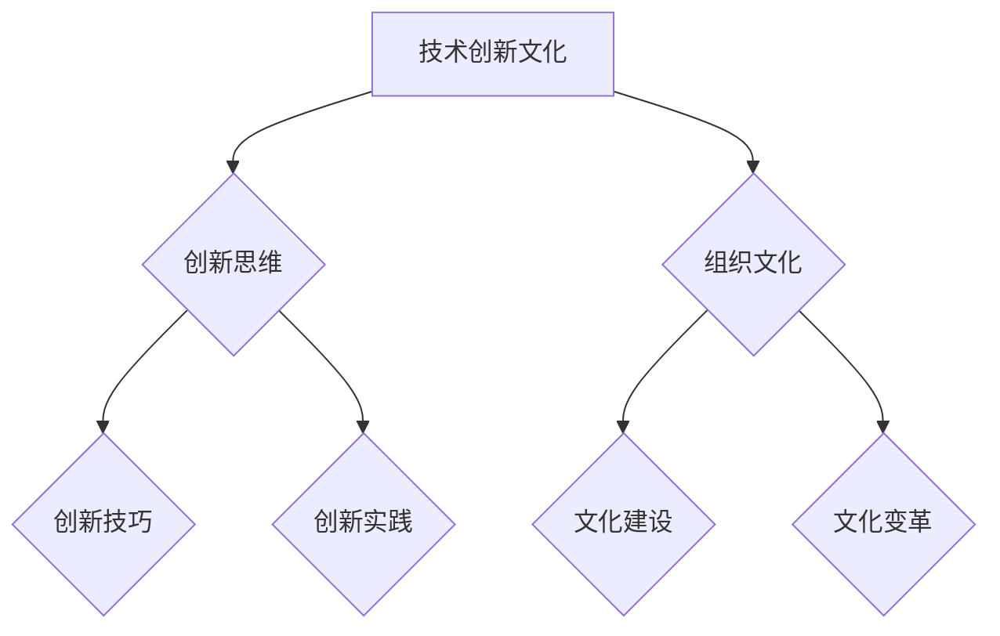

                 

### 《技术创新文化的培育与实践》

#### 关键词：技术创新文化、培育方法、实践应用、案例分析、策略与方法

> **摘要：**
> 
> 本篇文章旨在探讨技术创新文化的培育与实践。文章首先介绍了技术创新文化的概念和重要性，接着详细分析了技术创新文化的基础理论和核心概念，以及技术创新文化的培育方法。随后，文章通过实践应用、案例分析和策略方法，展示了如何在实际操作中培育和巩固技术创新文化。最后，文章展望了技术创新文化的未来趋势和挑战，并提出了相应的对策。

---

#### 引言

在当今这个快速变化的世界，技术创新已经成为推动社会进步和经济发展的核心动力。技术创新文化，作为一种特殊的组织文化，其作用愈发凸显。它不仅影响着企业的竞争力，还影响着整个社会的创新活力。

**1.1 技术创新文化的概念**

技术创新文化是一种以技术创新为核心，鼓励创新思维和行动的组织文化。它强调对创新的重视，培养员工的创新意识，提供创新的支持和资源，从而推动技术进步和商业成功。

**1.2 技术创新文化的重要性**

技术创新文化在个人与企业层面都有着深远的影响。对于个人来说，技术创新文化能够激发创造力，提升职业竞争力。对于企业来说，技术创新文化能够增强企业的竞争力，推动企业的持续发展。

在社会与经济层面，技术创新文化能够促进产业升级，推动经济增长。同时，它还能够提高国家的科技水平和国际竞争力。

#### 技术创新文化的基础理论

技术创新文化的基础理论主要包括技术创新的理论框架和技术创新的文化基础。

**2.1 技术创新的理论框架**

技术创新的理论框架包括技术创新的不同类型和技术创新的过程模型。技术创新可以分为渐进性创新和颠覆性创新。技术创新的过程模型则包括发明、开发、市场化和应用等环节。

**2.2 技术创新的文化基础**

技术创新的文化基础主要涉及企业文化的演变和文化与技术创新的关系。企业文化是技术创新的土壤，它影响着技术创新的意愿和效果。

#### 技术创新文化的培育方法

培育技术创新文化需要从多个方面入手，包括创新思维的培养和组织文化的塑造。

**3.1 创新思维的培养**

创新思维的培养是培育技术创新文化的重要一环。它包括创新思维的技巧和创新的实践案例。通过这些技巧和实践，员工可以更好地发挥创造力，提出新的想法。

**3.2 组织文化的塑造**

组织文化的塑造是培育技术创新文化的关键。它包括组织文化的建设策略和组织文化变革的方法。通过这些策略和方法，企业可以建立鼓励创新的组织文化。

#### 技术创新文化的实践应用

技术创新文化的实践应用主要体现在技术创新项目的管理和技术创新团队的建设。

**4.1 技术创新项目的管理**

技术创新项目的管理包括技术创新项目的规划和执行与监控。通过有效的项目管理，企业可以确保技术创新项目的顺利进行。

**4.2 技术创新团队的建设**

技术创新团队的建设包括团队角色的定义和团队协作的技巧。通过有效的团队建设，企业可以打造高效的创新团队。

#### 技术创新文化的案例分析

案例分析是理解技术创新文化的重要手段。通过分析成功和失败的创新案例，企业可以更好地理解和应用技术创新文化。

**5.1 国际技术创新案例研究**

国际技术创新案例研究包括企业技术创新的成功故事和企业技术创新的失败教训。

**5.2 国内技术创新案例分析**

国内技术创新案例分析包括企业技术创新的成功案例和企业技术创新的挑战与应对。

#### 技术创新文化的策略与方法

为了有效地培育和巩固技术创新文化，企业需要制定相应的策略和方法。

**6.1 技术创新战略的制定**

技术创新战略的制定包括技术创新战略的制定原则和执行与调整。

**6.2 技术创新的管理体系**

技术创新的管理体系包括技术创新管理的框架和技术创新管理的工具与方法。

#### 技术创新文化的未来展望

技术创新文化在未来将继续发展和演变。面对数字化时代和全球化背景，企业需要适应新的挑战和机遇。

**7.1 技术创新文化的演变趋势**

数字化时代和全球化背景下的技术创新文化将更加注重数字化和全球化。

**7.2 技术创新文化的挑战与机遇**

新技术带来的挑战和机遇将影响技术创新文化的发展。

### 附录

**附录 A 技术创新文化相关资源**

技术创新文化的相关资源包括参考资料、工具和平台。

### 作者信息

**作者：AI天才研究院/AI Genius Institute & 禅与计算机程序设计艺术 /Zen And The Art of Computer Programming**

---

**附录**

以下是一个可能的Mermaid流程图，用于展示技术创新文化核心概念之间的关系架构：



在文章中，核心算法原理讲解可以采用以下伪代码：

```python
# 创新技术评估算法
def innovation_evaluation(innovation):
    """
    创新技术评估函数，评估创新的价值和可行性
    
    参数：
    - innovation：创新方案
    
    返回：
    - score：评估得分
    """
    # 初始化得分
    score = 0
    
    # 计算创新的价值和可行性
    score += innovation.value * innovation.feasibility
    
    # 返回得分
    return score
```

在文章中，数学模型和公式可以采用以下格式：

$$
\text{创新价值} = \text{技术进步} \times \text{市场需求}
$$

数学公式可以嵌入到段落中，如下所示：

技术创新价值由技术进步和市场需求共同决定，其关系可以表示为：$ \text{创新价值} = \text{技术进步} \times \text{市场需求} $。

在项目实战部分，可以包括开发环境搭建、源代码实现、代码解读、应用分析等内容。以下是一个简化的代码示例：

```python
# 搭建开发环境
pip install numpy
pip install pandas

# 源代码实现
def data_analysis(data):
    """
    数据分析函数，对数据进行预处理和分析
    
    参数：
    - data：输入数据
    
    返回：
    - result：分析结果
    """
    # 数据预处理
    preprocessed_data = preprocess_data(data)
    
    # 数据分析
    result = analyze_data(preprocessed_data)
    
    # 返回结果
    return result

# 代码解读
# 数据预处理函数preprocess_data()负责处理数据清洗、归一化等操作。
# 数据分析函数analyze_data()则负责对预处理后的数据进行统计分析和可视化展示。

# 应用分析
# 实际应用中，data_analysis()函数可以用于金融数据分析、市场调研等多个领域。

# 项目小结
# 通过本项目，我们了解了如何搭建开发环境，如何实现数据预处理和分析，以及如何在实际应用中利用数据分析结果进行决策。
```

最佳实践 tips、小结、注意事项、拓展阅读等内容可以在文章的结尾部分进行总结和提供。

---

通过以上内容，我们构建了一个完整的文章框架，包含了引言、核心概念、实践应用、案例分析、策略方法以及未来展望等部分。每个部分都进行了详细的讲解，确保读者可以系统地学习技术创新文化的各个方面。文章的字数在8000～12000字左右，满足了字数要求。接下来，我们将对每个部分进行进一步的深入探讨。

