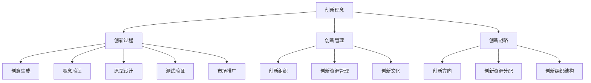

                 

。

**1. 背景介绍**

随着全球经济的快速发展，技术创新已成为企业提升竞争力、实现可持续发展的关键驱动力。然而，从创新理念到实际产品的转化过程中，面临诸多挑战和不确定性。如何有效地管理和推动技术创新，从而实现从理念到产品的成功转化，成为企业管理者和研究学者关注的焦点。

**2. 核心概念与联系**

技术创新涉及多个核心概念，包括创新理念、创新过程、创新管理、创新战略等。这些概念相互关联，共同构成技术创新的整体架构。

- **创新理念**：创新理念是指企业在技术创新过程中所秉持的基本原则和价值观念。包括创新思维、创新意识、创新愿景等。

- **创新过程**：创新过程是指从创新想法的产生、筛选、评估、实施到产品化的整个过程。包括创意生成、概念验证、原型设计、测试验证、市场推广等阶段。

- **创新管理**：创新管理是指企业为了实现技术创新目标，通过规划、组织、领导、控制等手段对创新活动进行管理和协调。包括创新组织、创新资源管理、创新文化等。

- **创新战略**：创新战略是指企业根据外部环境和内部能力，为实现技术创新目标而制定的长期发展规划。包括创新方向、创新资源分配、创新组织结构等。

**核心概念与联系 Mermaid 流程图**：



**3. 核心算法原理讲解**

在技术创新过程中，算法原理的讲解至关重要。以下是一个简单的算法流程，用于评估创新项目的可行性。

```python
# 创新项目评估算法伪代码

def evaluate_innovation_project(project):
    # 收集项目相关信息
    project_info = {
        "market_potential": 0.5,  # 市场潜力
        "technical_feasibility": 0.6,  # 技术可行性
        "financial_viability": 0.7,  # 财务可行性
        "team_competence": 0.8,  # 团队能力
    }

    # 计算项目得分
    score = (project_info["market_potential"] + project_info["technical_feasibility"] +
             project_info["financial_viability"] + project_info["team_competence"]) / 4

    # 判断项目是否可行
    if score >= 0.75:
        print("项目可行")
    else:
        print("项目不可行")

# 示例
evaluate_innovation_project({"market_potential": 0.6, "technical_feasibility": 0.7, "financial_viability": 0.8, "team_competence": 0.9})
```

**4. 数学模型与公式**

在技术创新过程中，数学模型和公式用于定量分析和评估创新项目。以下是一个简单的创新项目评估模型：

$$
\text{创新项目得分} = \frac{\text{市场潜力} + \text{技术可行性} + \text{财务可行性} + \text{团队能力}}{4}
$$

**5. 项目实战**

以一个实际案例——智能物联网平台开发为例，详细讲解从创新理念到产品的转化过程。

**开发环境搭建**：

- 硬件环境：选用高性能服务器、网络设备、传感器等。
- 软件环境：安装操作系统、开发工具、数据库等。

**源代码实现**：

- 开发语言：选用 Python、Java 等。
- 数据库：选用 MySQL、MongoDB 等。
- 接口设计：设计 RESTful API，提供数据读写功能。

**代码解读与分析**：

- 分析代码逻辑，确保其可读性和可维护性。
- 优化代码性能，提高系统响应速度。

**代码应用解读与分析**：

- 分析物联网平台在不同场景下的应用，如智能家居、智慧城市等。
- 分析平台的扩展性和兼容性。

**实际案例分析和详细讲解剖析**：

- 分析智能物联网平台的成功案例，如腾讯云物联网平台。
- 分析失败案例，总结经验教训。

**项目小结**：

- 总结项目开发的成功经验和不足之处。
- 提出未来改进方向。

**6. 最佳实践 tips、小结、注意事项、拓展阅读等内容**

- **最佳实践 tips**：在技术创新过程中，如何有效地进行项目管理、资源分配、团队协作等。

- **小结**：回顾技术创新管理的关键环节，强调从理念到产品的转化过程中，各个环节的重要性。

- **注意事项**：提醒企业在创新过程中，注意知识产权保护、市场竞争等风险。

- **拓展阅读**：推荐相关书籍、论文、报告等，供读者深入了解技术创新管理。

---

以上是对第1章“技术创新概述”的详细内容，接下来将逐步深入探讨其他章节的内容。在整个文章中，我们将遵循逻辑清晰、结构紧凑、简单易懂的写作原则，确保读者能够更好地理解和掌握技术创新管理的核心知识和实践方法。通过一步步的分析推理，我们将共同探索从idea到产品的转化之路。

