                 

### 引言

在当今快速变化的技术时代，技术创新管理成为企业和组织保持竞争力的关键因素。技术创新管理不仅涉及技术的开发和应用，还包括如何有效地组织、管理和激励团队成员，以实现持续的创新。本文将围绕“技术创新管理：在团队中培养创新文化”这一主题，深入探讨如何通过培养创新文化，提升团队的整体创新能力。

为什么在团队中培养创新文化至关重要？首先，创新是驱动企业持续增长和发展的动力源泉。随着市场需求的不断变化，只有不断推出新颖的产品和服务，才能满足客户的需求，并在竞争中脱颖而出。其次，创新文化能够激发团队成员的创造力和主动性，提升整体工作效率和质量。一个充满活力的创新文化能够吸引和留住顶尖人才，为企业的长远发展打下坚实基础。

本文将采用一步一步的分析推理方式，系统地介绍技术创新管理的基本概念、关键流程和成功要素。具体来说，我们将分为以下几个部分：

1. **核心概念与联系**：介绍技术创新管理中的关键概念，并使用Mermaid流程图展示它们之间的关系。
2. **技术创新的过程**：详细探讨从发现机会到商业化路径的创新全过程。
3. **创新文化建设**：分析如何通过领导力、团队合作、沟通和激励等方面，在团队中培养创新文化。
4. **技术技能培养**：讨论团队成员在技术创新中需要掌握的关键技能。
5. **项目管理**：介绍如何有效管理技术创新项目，包括资源分配、进度控制和风险管理。
6. **案例研究**：提供实际案例，展示如何在不同环境中实施技术创新管理。
7. **未来趋势**：讨论技术创新管理的未来方向和挑战。

通过本文的阅读，读者将能够获得对技术创新管理的全面理解，并掌握如何在实际工作中培养创新文化的具体方法。让我们一起探讨如何通过技术创新管理，推动团队和企业的持续创新与发展。

### 核心概念与联系

在探讨技术创新管理的过程中，理解一系列核心概念及其相互关系是至关重要的。这些核心概念包括技术创新、商业成功、创新文化、技术创新流程等。通过使用Mermaid流程图，我们可以更直观地展示这些概念之间的联系，有助于读者更好地把握技术创新管理的整体框架。

#### 技术创新与商业成功的联系

技术创新是推动商业成功的关键因素之一。技术创新可以带来新的产品和服务，提高效率和降低成本，从而在市场中获得竞争优势。Mermaid流程图如下：

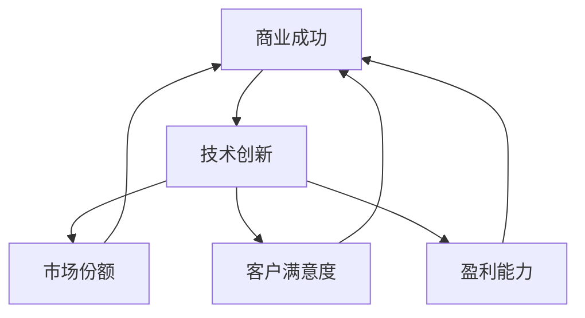

在这个流程图中，技术创新是商业成功的驱动因素，通过提升市场份额、客户满意度和盈利能力，最终实现商业目标。

#### 创新文化的要素

创新文化是一个团队或组织中共同认同的价值观和行为模式，它鼓励创新思维和实践。创新文化包含多个要素，如开放性、灵活性、风险容忍度、持续学习和团队合作等。这些要素相互作用，共同促进创新。Mermaid流程图如下：

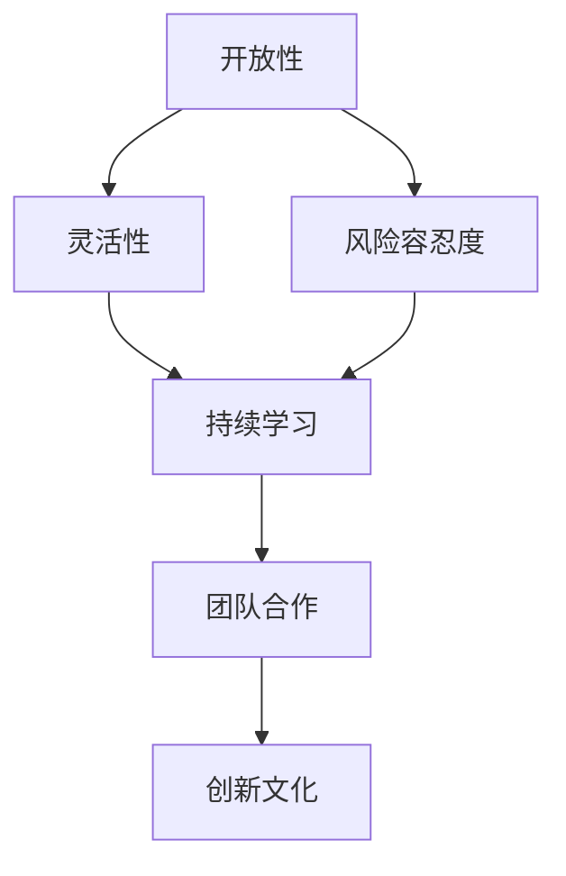

在这个流程图中，开放性、灵活性、风险容忍度、持续学习和团队合作是创新文化的重要组成部分，它们相互支持，共同构建一个鼓励创新的环境。

#### 技术创新流程

技术创新流程是一个系统化的过程，包括发现机会、需求分析、解决方案设计、原型开发、测试与迭代等阶段。每个阶段都是相互关联的，前一个阶段的成果为下一个阶段提供基础。Mermaid流程图如下：

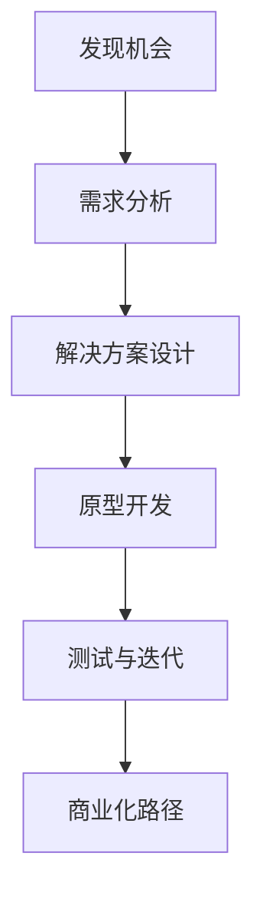

在这个流程图中，发现机会是创新过程的起点，需求分析、解决方案设计、原型开发、测试与迭代是创新的核心步骤，最终通过商业化路径实现技术成果的商业化。

通过这些Mermaid流程图，我们可以清晰地看到技术创新管理中的核心概念及其相互关系。这些概念和流程不仅是理论上的指导，更是实际操作中的指南，帮助团队在创新过程中更加有序和高效。

#### 技术创新与商业成功的关系

技术创新与商业成功之间存在着密切的联系。技术创新是指通过应用新技术、新方法或改进现有技术，从而创造出新的产品或服务，提升企业竞争力。商业成功则是指企业在市场中取得盈利和增长的能力。技术创新能够直接带来以下几个方面的商业成功：

1. **市场份额的提升**：通过技术创新，企业能够开发出更符合市场需求的新产品或服务，吸引更多的客户，从而扩大市场份额。

2. **客户满意度的提高**：技术创新能够提升产品的性能、质量和用户体验，增强客户对企业的满意度，提高客户忠诚度。

3. **盈利能力的增强**：通过技术创新，企业可以降低生产成本、提高效率，从而提高盈利能力。例如，自动化技术的应用可以减少人力成本，提高生产效率。

4. **市场竞争力的增强**：技术创新可以帮助企业获得技术领先优势，在激烈的市场竞争中脱颖而出，占据有利位置。

在Mermaid流程图中，我们可以将技术创新与商业成功的关系表示如下：

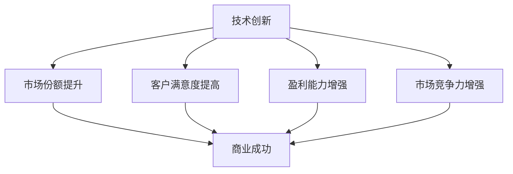

在这个流程图中，技术创新通过提升市场份额、客户满意度、盈利能力和市场竞争力，最终实现商业成功。

此外，创新文化的建立也是技术创新与商业成功之间的重要纽带。创新文化是指在一个团队或组织中形成的一种鼓励创新思维和实践的文化氛围。创新文化能够激发员工的创造力和主动性，提高团队的整体创新能力。以下是创新文化与技术创新、商业成功之间的Mermaid流程图：

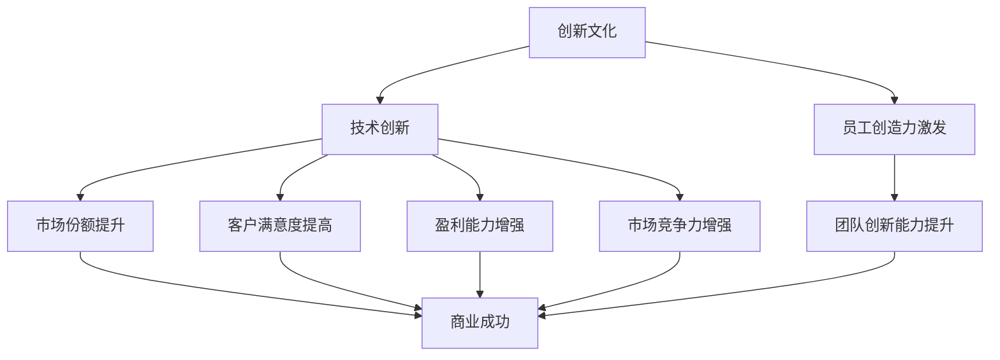

在这个流程图中，创新文化通过激发员工创造力、提升团队创新能力，进而推动技术创新和商业成功。创新文化不仅是技术创新的重要推动力，也是企业实现长期可持续发展的重要保障。

通过上述的Mermaid流程图，我们可以看到技术创新与商业成功之间紧密的联系，以及创新文化在其中的关键作用。理解这些核心概念和流程，将有助于企业在实际操作中更好地实施技术创新管理，从而实现持续的商业成功。

#### 创新文化的要素

创新文化是推动技术创新和管理成功的关键要素，它包括开放性、灵活性、风险容忍度、持续学习和团队合作等多个方面。以下是对这些要素的详细描述及其相互关系：

1. **开放性**：开放性是指一个团队或组织愿意接受新的想法和不同的观点。在创新文化中，开放性鼓励团队成员分享他们的见解和创意，并乐于倾听他人的意见。这种开放性的氛围有助于促进创新思维的产生，从而推动技术的进步。开放性可以与灵活性形成互补关系，因为只有在一个开放的环境中，灵活性才能得到充分发挥。

2. **灵活性**：灵活性是指团队或组织在应对变化时的适应能力和快速响应能力。一个具有灵活性的团队可以迅速调整战略和计划，以应对市场变化和技术革新。灵活性与开放性密切相关，因为只有在开放的氛围中，团队成员才会愿意尝试新方法，从而提升整体的灵活性。

3. **风险容忍度**：风险容忍度是指团队或组织在创新过程中愿意承担风险的意愿。在创新过程中，不可避免地会遇到失败和挫折，但一个具有高风险容忍度的团队会勇于面对这些挑战，并从中学习和成长。风险容忍度与持续学习密切相关，因为只有在愿意承担风险的环境中，团队才能持续进行实验和改进。

4. **持续学习**：持续学习是指团队或组织不断通过培训、知识分享和实践来提升技能和知识水平。在快速变化的技术环境中，持续学习是保持竞争力的关键。持续学习可以促进团队成员之间的知识共享，增强团队的整体创新能力。

5. **团队合作**：团队合作是指团队成员之间紧密协作，共同实现目标。在一个创新文化中，团队合作至关重要，因为它能够激发团队成员的创造力和主动性，提高工作效率和项目成功率。团队合作与开放性、灵活性和风险容忍度都有紧密的联系，因为这些都是促进团队合作的重要因素。

以下是这些创新文化要素之间的Mermaid流程图：

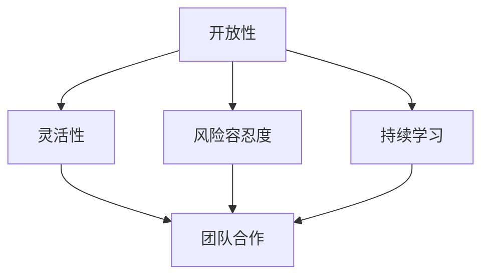

在这个流程图中，开放性、灵活性、风险容忍度和持续学习共同构成了创新文化的基础，而团队合作则是这些要素在实际操作中的体现。这些要素相互作用，共同推动团队在创新过程中的表现。

通过培养这些创新文化要素，团队可以在面对技术挑战时更加灵活、开放和有创造力。一个健康的创新文化不仅能够提高团队的创新能力，还能激发团队成员的积极性，促进企业的持续发展。

#### 技术创新的过程

技术创新的过程是一个系统化的流程，涵盖了从发现机会到商业化路径的多个阶段。每个阶段都对最终的成功至关重要，下面我们将详细探讨这些阶段。

1. **发现机会**

发现机会是技术创新过程的起点。在这一阶段，团队需要通过市场趋势分析、技术趋势分析和用户需求分析来识别潜在的创新机会。市场趋势分析包括对行业动态、竞争对手和客户需求的深入调研。技术趋势分析则关注新兴技术和创新方法，以确定哪些技术可能带来新的商业机会。用户需求分析是通过直接与用户沟通，了解他们的需求、痛点和期望，从而发现改进点。以下是这一阶段的Mermaid流程图：

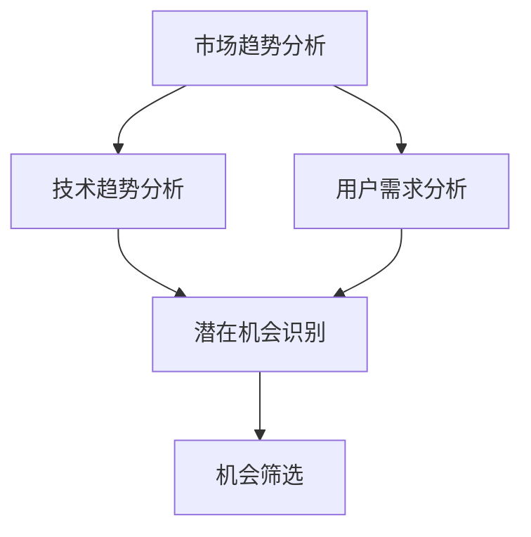

在这个流程图中，通过综合市场、技术和用户需求的分析，团队能够识别出具有潜力的创新机会，并进行初步筛选。

2. **需求分析**

在发现机会之后，需求分析成为关键步骤。需求分析旨在明确具体的需求，包括功能需求和非功能需求。功能需求描述了产品或服务需要实现的具体功能，而非功能需求则涉及到性能、安全性、可维护性等方面。以下是需求分析的Mermaid流程图：

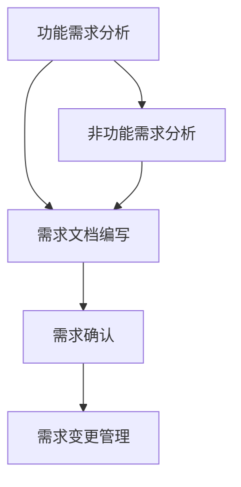

在这个流程图中，通过详细的需求分析，团队能够确保项目目标明确，并能够及时应对需求变更。

3. **解决方案设计**

解决方案设计是将需求转化为具体的技术方案。在这一阶段，团队需要选择合适的技术和架构，设计出能够满足需求的系统。技术选型和架构设计是关键步骤，需要综合考虑系统的性能、可扩展性、安全性和可靠性。以下是解决方案设计的Mermaid流程图：

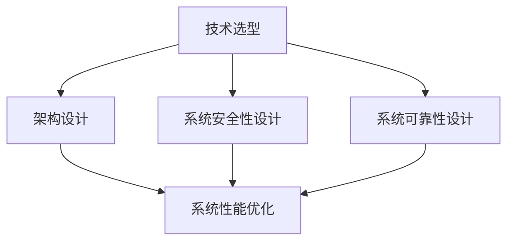

在这个流程图中，通过全面的技术选型和架构设计，团队能够确保解决方案的有效性和可行性。

4. **原型开发**

原型开发是将设计方案转化为可运行的系统。在这一阶段，团队需要开发出一个功能完整的原型，以验证解决方案的可行性和用户体验。原型开发通常分为多个迭代，每个迭代都包括需求分析、设计、编码和测试。以下是原型开发的Mermaid流程图：

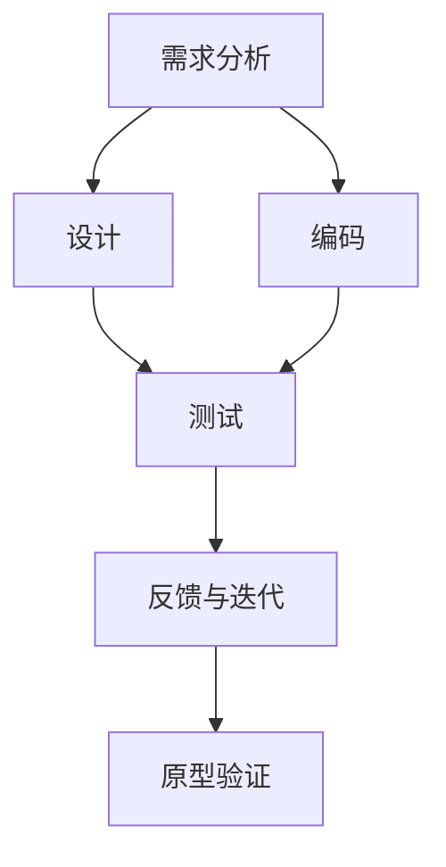

在这个流程图中，通过不断迭代和反馈，团队能够逐步完善原型，确保最终产品满足需求。

5. **测试与迭代**

测试与迭代是确保技术创新成功的关键步骤。在这一阶段，团队需要进行单元测试、集成测试和用户测试，以验证系统的功能、性能和安全。通过迭代，团队能够及时修复发现的问题，优化系统性能，提升用户体验。以下是测试与迭代的Mermaid流程图：

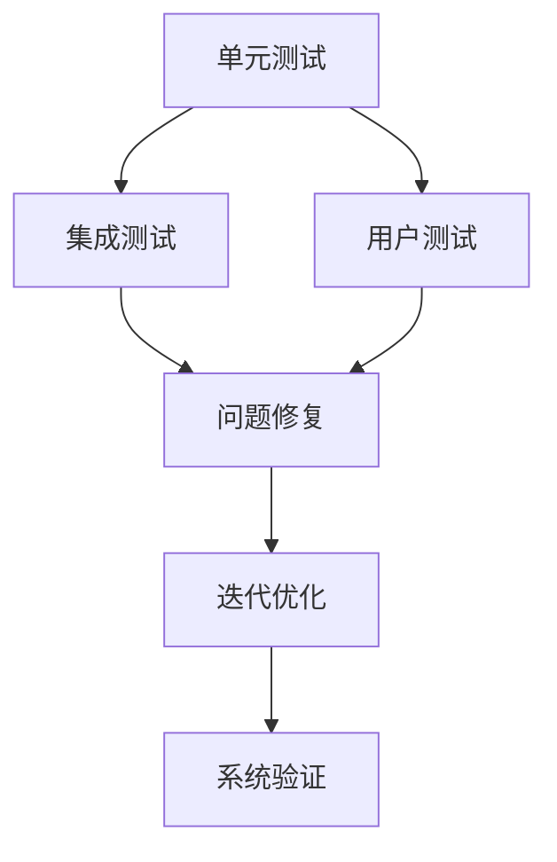

在这个流程图中，通过严格的测试和迭代，团队能够确保最终产品的高质量。

6. **商业化路径**

在完成技术验证后，商业化路径是确保创新成果能够成功推向市场的重要步骤。在这一阶段，团队需要制定商业模式，设计营销策略，进行市场推广，并评估成本与收益。以下是商业化路径的Mermaid流程图：

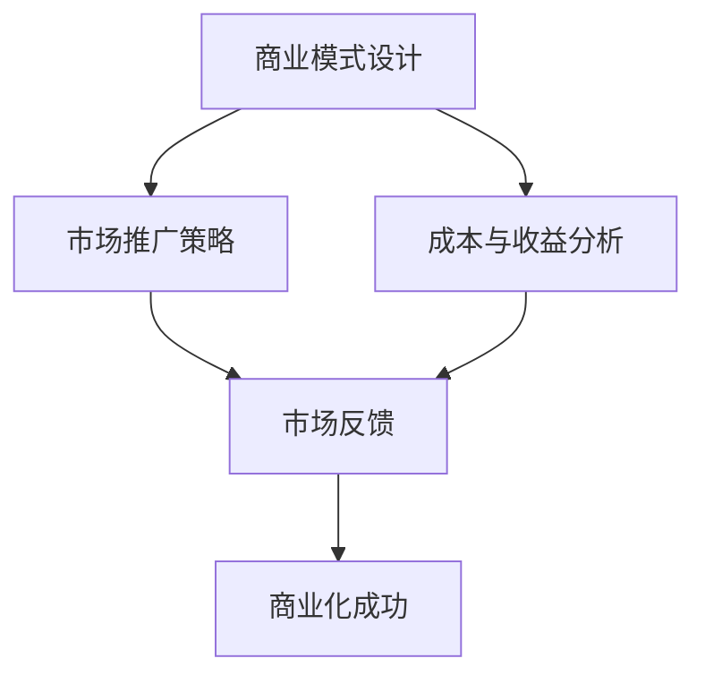

在这个流程图中，通过有效的商业模式和市场策略，团队能够将技术创新成功商业化。

通过以上对技术创新过程的详细探讨，我们可以看到每个阶段的重要性和相互关系。只有通过系统化、有序地进行每个阶段的创新工作，团队才能实现最终的技术创新目标，并在市场中获得成功。

#### 创新文化建设

在团队中培养创新文化是一个系统性工程，涉及多个方面，如领导力、团队合作、沟通和激励。以下详细探讨这些方面，以帮助团队构建一个健康的创新文化。

1. **领导力**

领导力是创新文化培养的核心要素之一。一个具有创新意识的领导者不仅能够激发团队成员的创造力，还能为团队提供明确的方向和支持。以下是一些关键的领导力策略：

- **鼓励创新思维**：领导者应该鼓励团队成员大胆提出新想法，并对这些想法持开放态度。通过定期举办创意竞赛、头脑风暴会议等活动，可以激发团队成员的创新潜能。

- **提供资源支持**：创新往往需要资金、技术和人力等资源的支持。领导者应确保团队拥有足够的资源，以便顺利推进创新项目。

- **授权与信任**：给予团队成员自主决策和执行的权力，可以增强他们的责任感和创新动力。领导者应该信任团队成员，给予他们足够的自由度来探索和实验。

2. **团队合作**

团队合作是创新文化的重要组成部分。一个高效的团队可以充分发挥每个成员的优势，共同克服创新过程中的各种挑战。以下是一些促进团队合作的方法：

- **建立共同目标**：团队成员应该明确共同的目标，并为此共同努力。通过共同目标的设定，可以增强团队的凝聚力和协作精神。

- **促进知识共享**：知识共享是团队协作的重要环节。通过定期的技术分享会、内部讲座和项目报告，可以促进团队成员之间的知识交流。

- **建立反馈机制**：团队成员之间应该建立有效的反馈机制，以便及时发现和解决问题。通过定期进行项目回顾和团队评估，可以不断优化团队的工作流程和协作方式。

3. **沟通**

沟通是团队协作和创新文化培养的关键。有效的沟通可以确保团队成员理解项目目标、任务分配和工作进度，从而提高工作效率。以下是一些提升沟通效果的方法：

- **明确沟通目标**：在每次沟通之前，明确沟通的目标和重点，有助于提高沟通的效率。

- **采用多种沟通方式**：根据不同的沟通场景和需求，选择合适的沟通方式，如面对面交流、邮件、即时通讯工具等。

- **倾听与理解**：有效的沟通不仅包括表达自己的观点，还要认真倾听他人的意见。领导者应该鼓励团队成员积极表达自己的想法，并给予充分的反馈和肯定。

4. **激励**

激励是保持团队成员创新动力和积极性的重要因素。以下是一些激励策略：

- **认可与奖励**：对团队成员的创新成果给予认可和奖励，可以增强他们的自信心和积极性。这可以包括奖金、晋升机会、公开表彰等。

- **职业发展机会**：提供职业发展机会，如培训、轮岗、项目负责等，可以激发团队成员的学习兴趣和职业发展愿望。

- **灵活的工作环境**：提供灵活的工作时间和工作地点，可以减轻团队成员的工作压力，提高他们的工作满意度。

通过以上这些方法和策略，团队可以在领导力、团队合作、沟通和激励等方面不断优化，逐步构建一个健康的创新文化。一个充满活力的创新文化不仅能够激发团队成员的创造力，还能为企业的持续创新和发展提供强有力的支持。

#### 技术技能培养

在技术创新过程中，团队成员需要掌握一系列关键技能，以确保项目能够顺利推进并取得成功。以下是一些主要的技术技能，以及如何培养这些技能的方法：

1. **项目管理**

项目管理是确保技术创新项目按时、按预算和按质量完成的基石。团队成员需要了解项目管理的基本原则和方法，包括项目计划、进度控制、风险管理和团队协作。

- **培养方法**：参加项目管理相关课程，如PMP（项目管理专业人士认证）培训。实际参与项目管理实践，通过项目执行中的反思和总结，不断提高项目管理能力。

2. **技术趋势分析**

技术趋势分析能够帮助团队及时把握行业动态，识别潜在的创新机会。团队成员需要具备分析技术趋势的能力，了解新兴技术和方法的发展方向。

- **培养方法**：定期阅读技术博客、研究报告和行业白皮书。参加技术会议和研讨会，与行业专家交流，了解最新的技术趋势。

3. **创新思维训练**

创新思维是推动技术创新的重要动力。团队成员需要培养开放性思维、批判性思维和系统性思维，以便在遇到问题时能够从多个角度寻找解决方案。

- **培养方法**：通过参加创新思维训练课程，如设计思考（Design Thinking）工作坊，学习使用创新思维工具，如头脑风暴、思维导图等。

4. **编程与开发**

编程和开发是技术创新的核心技能。团队成员需要熟悉至少一种编程语言，并具备开发应用程序、构建系统和编写代码的能力。

- **培养方法**：参加编程课程，如Python、Java或JavaScript培训。通过实际编码实践，如参与开源项目或自行开发小型项目，提高编程技能。

5. **数据分析和处理**

数据分析是许多技术创新项目的关键环节。团队成员需要掌握数据收集、清洗、分析和可视化等技能，以便从数据中提取有价值的信息。

- **培养方法**：参加数据分析课程，如Python数据分析库Pandas、NumPy等工具的学习。实际参与数据分析项目，通过处理真实数据，提高数据分析和处理能力。

6. **用户体验设计**

用户体验设计是确保技术创新产品成功的关键。团队成员需要了解用户需求，设计直观、易用的用户界面。

- **培养方法**：参加用户体验设计课程，学习用户研究、用户测试和原型设计等技能。通过实际项目实践，如设计用户界面和交互流程，提高用户体验设计能力。

通过上述方法，团队成员可以逐步培养和提升关键技能，为技术创新提供强有力的支持。这些技能不仅有助于团队在创新过程中克服各种挑战，还能提升团队的整体能力和竞争力。

#### 项目管理

在技术创新过程中，项目管理起着至关重要的作用。一个有效的项目管理能够确保项目按时、按预算和按质量完成，从而推动创新目标的实现。以下将详细介绍项目管理的几个关键方面：资源分配、进度控制和风险管理。

1. **资源分配**

资源分配是项目管理的核心任务之一，涉及将人力、资金、设备和材料等资源合理地分配给项目的各个阶段和任务。以下是资源分配的一些具体方法：

- **资源管理策略**：制定详细的资源管理计划，明确每个资源的需求、使用时间和责任人。这有助于避免资源浪费和冲突。
  
- **资源分配模型**：采用资源平衡和优化算法，如最小生成树算法，确保资源的合理分配和利用。这可以通过项目管理系统实现，如JIRA或Trello。

- **资源优化方法**：定期审查和调整资源分配，根据项目进展和实际情况进行资源调整，确保资源的高效利用。例如，可以通过技术共享或跨项目协作，提高资源利用率。

2. **进度控制**

进度控制是确保项目按时完成的重要环节。以下是一些进度控制的策略和工具：

- **进度监控**：使用项目管理工具（如Gantt图、Burndown图）实时监控项目进度，及时发现和解决进度偏差。

- **进度调整**：在项目执行过程中，根据实际情况调整项目计划，确保项目能够按时完成。这包括调整任务优先级、重新分配资源等。

- **进度报告**：定期生成进度报告，向项目团队和管理层提供项目进展和风险信息，以便及时采取应对措施。

3. **风险管理**

风险管理是项目管理的重要方面，旨在识别、评估和应对项目中的潜在风险。以下是风险管理的方法：

- **风险识别**：通过头脑风暴、历史数据分析和专家评审等方法，识别项目中可能出现的各种风险。

- **风险评估**：对识别出的风险进行评估，确定其发生概率和影响程度，以便采取相应的应对措施。

- **风险应对策略**：根据风险评估结果，制定应对策略，如风险规避、转移、减轻或接受。例如，可以通过增加预算或时间缓冲，减轻项目延期等风险。

通过上述资源分配、进度控制和风险管理的方法，项目经理能够确保技术创新项目在预定时间内高质量地完成。有效的项目管理不仅能够提高项目成功率，还能为企业的长期发展提供有力保障。

#### 案例研究：某公司的技术创新实践

为了更好地理解技术创新管理的实际应用，我们来看一个真实案例：某全球知名的科技公司如何通过系统化的技术创新管理，实现了从产品开发到市场推出的成功转型。

**案例背景**

该公司是一家提供云计算服务和解决方案的领军企业，随着市场竞争的加剧和技术的迅速发展，公司意识到需要通过技术创新来保持市场领先地位。为此，公司决定实施一系列创新管理措施，以提升团队的创新能力和项目成功率。

**创新过程**

1. **发现机会**

公司首先通过市场调研和用户反馈，发现客户对云服务的需求不仅限于基础的存储和计算资源，更需要定制化的解决方案，以应对复杂的应用场景。公司通过分析技术趋势，发现人工智能和机器学习技术在云服务中的应用潜力巨大。这为公司提供了创新的机会。

2. **需求分析**

在明确创新方向后，公司成立了专门的项目团队，深入分析用户需求，并制定了详细的需求文档。需求分析包括功能需求和非功能需求，如高可用性、安全性和易扩展性等。通过用户访谈、问卷调查和市场分析，团队确保需求文档的准确性和完整性。

3. **解决方案设计**

解决方案设计阶段，团队综合考虑了技术选型和架构设计。公司选择了业界领先的人工智能框架，并结合云服务的特性，设计出了一套高效、可靠的智能云服务架构。架构设计考虑了系统的可扩展性、安全性和性能优化，以适应不同客户的需求。

4. **原型开发**

原型开发是创新过程中的关键步骤。团队利用敏捷开发方法，快速构建了功能原型，并通过迭代不断优化。在原型开发过程中，团队注重用户体验，通过用户测试和反馈，及时调整和改进产品设计。

5. **测试与迭代**

在原型开发完成后，团队进行了全面的测试，包括单元测试、集成测试和用户测试。通过严格的测试流程，团队确保了产品的稳定性和可靠性。测试过程中发现的问题和反馈，被及时纳入下一个迭代，以进一步优化产品。

6. **商业化路径**

测试验证成功后，公司制定了详细的商业化路径，包括市场推广策略、定价策略和销售计划。通过精准的市场定位和有效的营销手段，公司成功地将新产品推向市场，并获得了客户的积极反馈。

**成功与失败原因分析**

**成功原因**：

1. **明确的创新方向**：通过市场调研和技术分析，公司明确了创新方向，确保了创新工作的针对性和有效性。

2. **有效的团队合作**：项目团队在需求分析、解决方案设计和测试阶段紧密合作，通过多部门协作，实现了资源的最佳配置。

3. **用户驱动**：公司始终以用户需求为中心，通过用户测试和反馈，不断优化产品设计，确保了产品的用户满意度。

4. **严格的测试与迭代**：通过全面的测试和迭代，公司确保了产品的质量，降低了市场风险。

**失败原因**：

1. **需求变更频繁**：在项目初期，由于对市场需求的预测不准确，导致需求频繁变更，增加了项目管理的复杂性。

2. **资源分配不当**：在某些阶段，资源分配不合理，导致关键任务延误，影响了项目进度。

3. **沟通不畅**：项目团队内部和跨部门之间的沟通不畅，导致信息传递不及时，影响了协作效率。

**案例分析总结**

通过该案例，我们可以看到技术创新管理在实际应用中的关键要素。成功的因素包括明确的创新方向、有效的团队合作、用户驱动的产品设计以及严格的测试与迭代。而失败的原因则提醒我们在项目管理中需要注意需求管理、资源优化和沟通协作。通过这个案例，企业可以更好地理解如何在实际工作中实施技术创新管理，以提高项目成功率，实现商业成功。

#### 未来趋势

技术创新管理的未来趋势将受到多个因素的影响，包括技术进步、市场变化和企业管理理念的发展。以下是一些可能影响技术创新管理的未来趋势：

1. **人工智能与自动化**：随着人工智能和自动化技术的不断发展，越来越多的任务将实现自动化，从而提高生产效率和创新能力。企业将需要整合这些技术，优化管理流程，提高决策的准确性和速度。

2. **数据驱动的决策**：大数据和数据分析技术的进步将使得企业能够更加精准地识别市场机会和用户需求，从而更好地指导创新工作。数据驱动的决策将取代传统的经验式管理，成为技术创新管理的重要支撑。

3. **开放式创新**：开放式创新模式将越来越受到企业的重视。通过与外部合作伙伴合作，企业可以更快地获取新技术和新想法，从而缩短创新周期，提高市场竞争力。

4. **敏捷管理**：敏捷管理方法在技术创新项目中已得到广泛应用，未来这一趋势将进一步加强。通过快速迭代和灵活调整，团队可以更快地响应市场变化，提高项目成功率。

5. **可持续发展**：随着全球对环境保护和可持续发展的关注日益增加，企业将需要将可持续性原则融入技术创新管理中。这包括采用环保材料、减少能源消耗和优化资源利用等。

6. **虚拟现实与增强现实**：虚拟现实（VR）和增强现实（AR）技术的进步将带来新的创新机会。通过VR和AR技术，企业可以提供更加沉浸式的用户体验，推动产品创新和服务优化。

7. **全球化与本地化**：全球化使得企业能够更广泛地获取创新资源，而本地化则要求企业适应不同市场的文化、法规和用户需求。未来，企业将需要更好地平衡全球化与本地化的关系，以实现全球范围内的创新管理。

#### 团队准备

为了应对这些未来趋势，团队需要采取以下措施：

1. **持续学习与培训**：团队应定期参加培训，了解最新的技术趋势和管理方法。通过持续学习，团队能够不断提升自身能力，适应新的工作环境。

2. **灵活的团队结构**：团队应保持灵活的组织结构，以便快速调整和适应变化。通过采用跨职能团队和项目化组织，团队能够更高效地协作和创新。

3. **建立跨部门合作机制**：跨部门合作是提升创新能力的重要手段。团队应建立有效的跨部门沟通和协作机制，促进知识共享和资源优化。

4. **投资于新技术**：企业应积极投资于新技术的研究和应用，以保持技术领先地位。这包括购买新技术设备、资助科研项目和引进新技术人才。

5. **优化项目管理流程**：通过优化项目管理流程，团队可以更好地控制项目进度和质量。采用敏捷管理方法、建立项目跟踪机制和风险管理体系是优化项目管理的关键。

通过以上措施，团队可以更好地准备迎接未来的挑战，确保在技术创新管理中取得成功。

### 附录

为了帮助读者更深入地了解技术创新管理，本文提供了以下附录资源：

1. **参考文献**：
   - Christensen, C. M. (1997). The Innovator's Dilemma: When New Technologies Cause Great Firms to Fail. Harvard Business Review Press.
   - Tidd, J., Bessant, J., & Pavitt, K. (2016). Managing Innovation: Integrating Technological, Market and Organization Change. John Wiley & Sons.

2. **工具和技术栈介绍**：
   - **JIRA**：用于项目管理和任务追踪的敏捷开发工具。
   - **Trello**：简单易用的看板式项目管理工具。
   - **GitLab**：用于代码管理、持续集成和持续交付的软件平台。
   - **GitHub**：全球最大的代码托管平台，支持开源项目的协作开发。

3. **相关书籍推荐**：
   - **《创新者的窘境》**：作者：克里斯坦森，探讨企业如何应对技术变革。
   - **《精益创业》**：作者：埃里克·莱斯，介绍如何通过快速迭代和用户反馈进行创新。

通过这些资源，读者可以进一步拓展对技术创新管理的理解和应用。

### 总结与呼吁

技术创新管理是推动企业持续增长和发展的关键因素。通过培养创新文化、掌握关键技术技能和实施有效的项目管理，团队可以不断提升创新能力，应对市场变化，实现商业成功。本文系统地探讨了技术创新管理的基本概念、关键流程和成功要素，并通过实际案例展示了其在企业中的应用。

让我们共同呼吁，关注技术创新管理的重要性，积极参与创新实践。通过不断学习和优化，企业将能够保持竞争优势，迎接未来的挑战。让我们携手打造一个充满活力和创新精神的工作环境，为企业的长远发展贡献力量。

