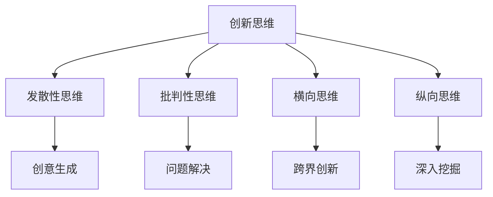
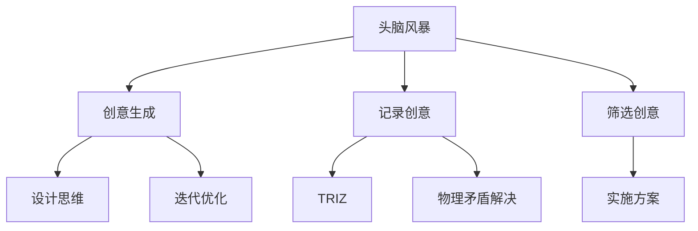
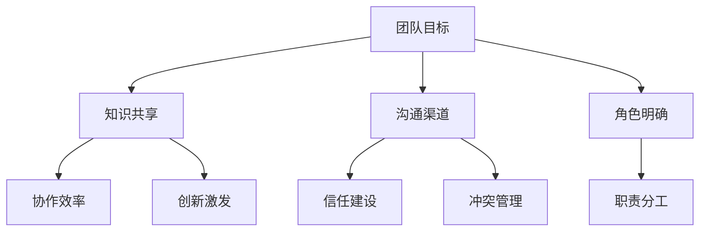
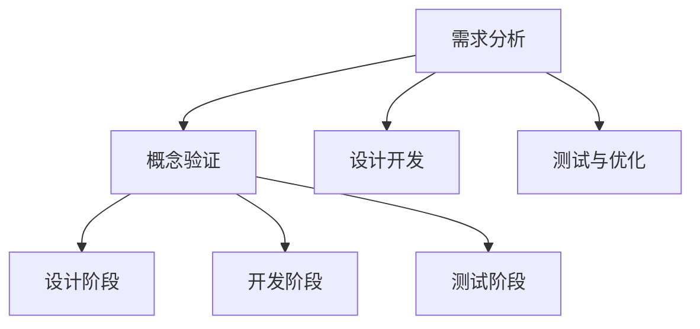
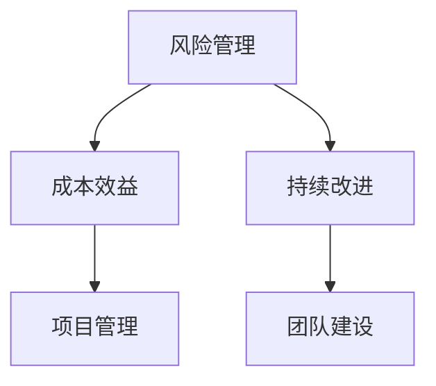
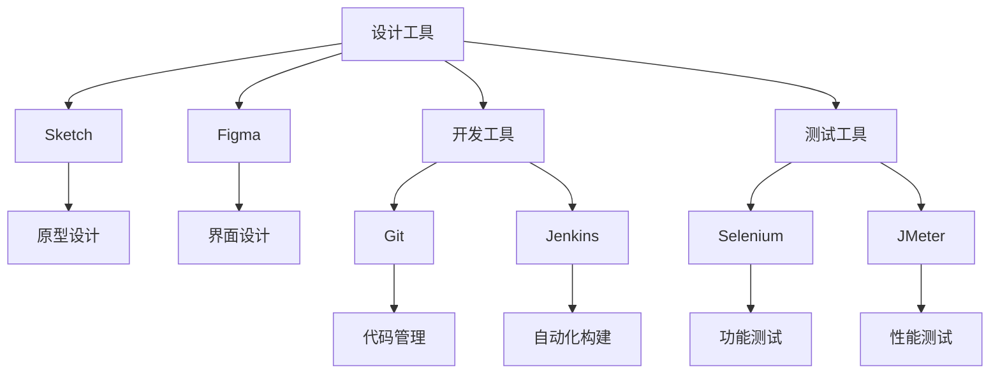
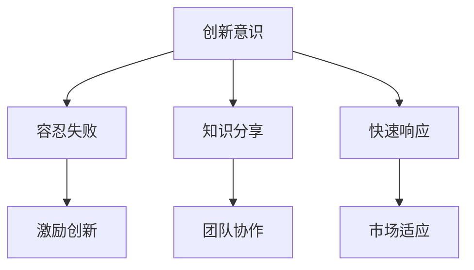

                 

### 文章标题

《技术创新：在团队中培养创新思维》

### 关键词

- 创新思维
- 团队协作
- 创新方法
- 创新管理
- 创新文化

### 摘要

本文旨在探讨如何在一个团队中培养创新思维，以促进技术创新。文章首先介绍了创新思维的定义及其重要性，随后详细讲解了多种创新方法论，如头脑风暴、设计思维和TRIZ方法。接着，文章讨论了团队协作与沟通的关键性，并介绍了如何构建高效的团队。此外，文章还分享了创新实践案例，展示了创新方法在实际项目中的应用。最后，文章探讨了创新管理、创新工具与技术以及如何培养创新文化，以帮助团队在创新道路上持续进步。

### 确定书籍主题

在现代社会，技术创新已经成为企业竞争的重要驱动力。然而，如何激发团队的创新能力，实现持续的创新成果，成为许多企业面临的重要课题。本书《技术创新：在团队中培养创新思维》正是针对这一需求，旨在探讨如何通过培养创新思维，提升团队的创新能力，从而实现技术创新。

本书的核心主题可以概括为以下几个方面：

1. **创新思维概述**：介绍创新思维的概念、重要性及其与团队协作的关系。
2. **创新方法论**：讲解各种创新方法，如头脑风暴、设计思维和TRIZ方法。
3. **团队协作与沟通**：探讨团队协作的重要性，介绍沟通技巧和团队建设方法。
4. **创新实践**：通过实际案例，展示如何在不同领域进行创新实践。
5. **创新管理**：介绍创新管理的基本原则、方法和激励机制。
6. **创新工具与技术**：介绍支持创新活动的工具和技术。
7. **创新文化**：讨论如何培养创新文化，以及创新文化对团队的影响。

### 设计核心章节

为了系统地阐述如何培养团队的创新思维，本书设计了以下七个核心章节：

#### 第一章：创新思维概述

- **1.1 创新思维的定义与重要性**
  - 创新思维的内涵
  - 创新思维的重要性
  - 创新思维与团队协作的关系

- **1.2 创新思维的类型与特点**
  - 传统思维与创新思维的区别
  - 创新思维的类型
  - 创新思维的特点

#### 第二章：创新方法论

- **2.1 头脑风暴**
  - 头脑风暴的原理
  - 头脑风暴的步骤
  - 头脑风暴的应用

- **2.2 设计思维**
  - 设计思维的基本原理
  - 设计思维的步骤
  - 设计思维的应用

- **2.3 TRIZ方法**
  - TRIZ的基本原理
  - TRIZ的算法与工具
  - TRIZ的应用实例

- **2.4 创新思维训练**
  - 创新思维训练的方法
  - 创新思维训练的工具
  - 创新思维训练的实践

#### 第三章：团队协作与沟通

- **3.1 团队协作的重要性**
  - 团队协作的内涵
  - 团队协作的优势
  - 团队协作的挑战

- **3.2 沟通技巧**
  - 有效沟通的要素
  - 沟通障碍与解决方法
  - 沟通技巧的实践

- **3.3 团队建设**
  - 团队建设的内涵
  - 团队建设的方法
  - 团队建设的实践

- **3.4 团队协作工具**
  - 团队协作工具的概述
  - 常见的团队协作工具
  - 团队协作工具的实践

#### 第四章：创新实践

- **4.1 创新实践案例分享**
  - 创新实践案例的类型
  - 创新实践案例的选取
  - 创新实践案例的解读

- **4.2 创新实践步骤**
  - 创新实践的基本步骤
  - 创新实践的步骤详解
  - 创新实践的工具应用

#### 第五章：创新管理

- **5.1 创新管理的基本原则**
  - 创新管理的内涵
  - 创新管理的基本原则
  - 创新管理的实践

- **5.2 创新激励机制**
  - 创新激励的方法
  - 创新激励机制的设计
  - 创新激励的实践

- **5.3 创新风险管理**
  - 创新风险的概念
  - 创新风险的管理方法
  - 创新风险管理的实践

#### 第六章：创新工具与技术

- **6.1 创新工具的概述**
  - 创新工具的类型
  - 创新工具的选择
  - 创新工具的应用

- **6.2 常见创新工具**
  - 思维导图
  - 虚拟现实
  - 知识图谱

- **6.3 创意工具**
  - 创意工具的类型
  - 创意工具的选择
  - 创意工具的应用

#### 第七章：创新文化

- **7.1 创新文化的培养**
  - 创新文化的内涵
  - 创新文化的培养方法
  - 创新文化的实践

- **7.2 创新文化的特征**
  - 创新文化的特征
  - 创新文化的要素
  - 创新文化的表现

- **7.3 创新文化的影响**
  - 创新文化对团队的影响
  - 创新文化对企业的意义
  - 创新文化的案例分析

### 确定每章节的小节

对于每个核心章节，我们可以进一步设计出具体的小节。以下是对每个核心章节的初步设计：

#### 第一章：创新思维概述

- **1.1.1 创新思维的内涵**
  - 定义与解释
  - 特点与应用

- **1.1.2 创新思维的重要性**
  - 对个人的影响
  - 对团队的影响

- **1.1.3 创新思维与团队协作的关系**
  - 关键要素
  - 实践案例

#### 第二章：创新方法论

- **2.1.1 头脑风暴的原理**
  - 概念与起源
  - 基本原理

- **2.1.2 头脑风暴的步骤**
  - 准备阶段
  - 执行阶段
  - 总结阶段

- **2.1.3 头脑风暴的应用**
  - 创意生成
  - 问题解决

- **2.2.1 设计思维的基本原理**
  - 人本主义
  - 快速迭代

- **2.2.2 设计思维的步骤**
  - 发现阶段
  - 定义阶段
  - 设计阶段
  - 实施阶段

- **2.2.3 设计思维的应用**
  - 产品开发
  - 服务设计

- **2.3.1 TRIZ的基本原理**
  - 矛盾解决
  - 技术系统进化

- **2.3.2 TRIZ的算法与工具**
  - 40条创新原则
  - 物理矛盾算法

- **2.3.3 TRIZ的应用实例**
  - 工业案例
  - 科技创新

- **2.4.1 创新思维训练的方法**
  - 思维训练
  - 潜能开发

- **2.4.2 创新思维训练的工具**
  - 脑力激荡
  - 情境模拟

- **2.4.3 创新思维训练的实践**
  - 培训计划
  - 成果评估

#### 第三章：团队协作与沟通

- **3.1.1 团队协作的内涵**
  - 合作与竞争
  - 目标一致性

- **3.1.2 团队协作的优势**
  - 知识共享
  - 效率提升

- **3.1.3 团队协作的挑战**
  - 沟通障碍
  - 冲突管理

- **3.2.1 有效沟通的要素**
  - 信息传递
  - 理解与反馈

- **3.2.2 沟通障碍与解决方法**
  - 语言障碍
  - 文化差异

- **3.2.3 沟通技巧的实践**
  - 倾听
  - 表达

- **3.3.1 团队建设的内涵**
  - 成员互动
  - 共同目标

- **3.3.2 团队建设的方法**
  - 团队活动
  - 沟通渠道

- **3.3.3 团队建设的实践**
  - 案例分析
  - 实践指南

- **3.4.1 团队协作工具的概述**
  - 工具类型
  - 功能特点

- **3.4.2 常见的团队协作工具**
  - 项目管理工具
  - 沟通协作工具

- **3.4.3 团队协作工具的实践**
  - 应用案例
  - 实践技巧

#### 第四章：创新实践

- **4.1.1 创新实践案例的类型**
  - 产品创新
  - 过程创新

- **4.1.2 创新实践案例的选取**
  - 选取标准
  - 评估方法

- **4.1.3 创新实践案例的解读**
  - 成功要素
  - 启示与反思

- **4.2.1 创新实践的基本步骤**
  - 需求分析
  - 概念验证

- **4.2.2 创新实践的步骤详解**
  - 设计阶段
  - 开发阶段
  - 测试阶段

- **4.2.3 创新实践的工具应用**
  - 设计工具
  - 开发工具

#### 第五章：创新管理

- **5.1.1 创新管理的内涵**
  - 定义与职责

- **5.1.2 创新管理的基本原则**
  - 风险管理
  - 成本效益

- **5.1.3 创新管理的实践**
  - 企业案例
  - 管理技巧

- **5.2.1 创新激励的方法**
  - 薪酬激励
  - 荣誉激励

- **5.2.2 创新激励机制的设计**
  - 激励原则
  - 实践案例

- **5.2.3 创新激励的实践**
  - 实施策略
  - 评估方法

- **5.3.1 创新风险的概念**
  - 定义与分类

- **5.3.2 创新风险的管理方法**
  - 风险识别
  - 风险评估

- **5.3.3 创新风险管理的实践**
  - 风险控制
  - 风险应对

### 添加扩展内容

为了使书籍更加丰富，我们可以在每个章节中添加一些扩展内容，如：

- **相关案例研究**：通过具体的案例，深入分析创新思维在实践中的应用。
- **实践指导**：提供具体的实践指南，帮助读者将创新思维应用到实际工作中。
- **深入探讨某个主题**：对某些重要概念进行深入探讨，提供更多背景知识和深度理解。
- **创新方法或技术的实际应用场景**：展示创新方法或技术在各个领域的实际应用案例。

### 总结

通过以上步骤，我们设计出了本书的初步目录大纲。接下来，我们需要根据这个大纲进一步细化每个章节的内容，确保书籍的逻辑清晰、内容丰富，并符合读者需求。同时，我们还需要确保目录大纲的总字数控制在2000字以内，以保证书籍的简洁性。在撰写每个章节时，我们将使用markdown格式，确保文章的可读性和结构清晰。

以下是初步设计的目录大纲：

```
# 文章标题：技术创新：在团队中培养创新思维

## 关键词
- 创新思维
- 团队协作
- 创新方法
- 创新管理
- 创新文化

## 摘要
本文探讨了如何在团队中培养创新思维，以促进技术创新。文章涵盖了创新思维概述、创新方法论、团队协作与沟通、创新实践、创新管理、创新工具与技术以及创新文化等七个核心章节。

### 第一章：创新思维概述

#### 1.1 创新思维的定义与重要性
- **1.1.1 创新思维的内涵**
- **1.1.2 创新思维的重要性**
- **1.1.3 创新思维与团队协作的关系**

#### 1.2 创新思维的类型与特点
- **1.2.1 传统思维与创新思维的区别**
- **1.2.2 创新思维的类型**
- **1.2.3 创新思维的特点**

### 第二章：创新方法论

#### 2.1 头脑风暴
- **2.1.1 头脑风暴的原理**
- **2.1.2 头脑风暴的步骤**
- **2.1.3 头脑风暴的应用**

#### 2.2 设计思维
- **2.2.1 设计思维的基本原理**
- **2.2.2 设计思维的步骤**
- **2.2.3 设计思维的应用**

#### 2.3 TRIZ方法
- **2.3.1 TRIZ的基本原理**
- **2.3.2 TRIZ的算法与工具**
- **2.3.3 TRIZ的应用实例**

#### 2.4 创新思维训练
- **2.4.1 创新思维训练的方法**
- **2.4.2 创新思维训练的工具**
- **2.4.3 创新思维训练的实践**

### 第三章：团队协作与沟通

#### 3.1 团队协作的重要性
- **3.1.1 团队协作的内涵**
- **3.1.2 团队协作的优势**
- **3.1.3 团队协作的挑战**

#### 3.2 沟通技巧
- **3.2.1 有效沟通的要素**
- **3.2.2 沟通障碍与解决方法**
- **3.2.3 沟通技巧的实践**

#### 3.3 团队建设
- **3.3.1 团队建设的内涵**
- **3.3.2 团队建设的方法**
- **3.3.3 团队建设的实践**

#### 3.4 团队协作工具
- **3.4.1 团队协作工具的概述**
- **3.4.2 常见的团队协作工具**
- **3.4.3 团队协作工具的实践**

### 第四章：创新实践

#### 4.1 创新实践案例分享
- **4.1.1 创新实践案例的类型**
- **4.1.2 创新实践案例的选取**
- **4.1.3 创新实践案例的解读**

#### 4.2 创新实践步骤
- **4.2.1 创新实践的基本步骤**
- **4.2.2 创新实践的步骤详解**
- **4.2.3 创新实践的工具应用**

### 第五章：创新管理

#### 5.1 创新管理的基本原则
- **5.1.1 创新管理的内涵**
- **5.1.2 创新管理的基本原则**
- **5.1.3 创新管理的实践**

#### 5.2 创新激励机制
- **5.2.1 创新激励的方法**
- **5.2.2 创新激励机制的设计**
- **5.2.3 创新激励的实践**

#### 5.3 创新风险管理
- **5.3.1 创新风险的概念**
- **5.3.2 创新风险的管理方法**
- **5.3.3 创新风险管理的实践**

### 第六章：创新工具与技术

#### 6.1 创新工具的概述
- **6.1.1 创新工具的类型**
- **6.1.2 创新工具的选择**
- **6.1.3 创新工具的应用**

#### 6.2 常见创新工具
- **6.2.1 思维导图**
- **6.2.2 虚拟现实**
- **6.2.3 知识图谱**

#### 6.3 创意工具
- **6.3.1 创意工具的类型**
- **6.3.2 创意工具的选择**
- **6.3.3 创意工具的应用**

### 第七章：创新文化

#### 7.1 创新文化的培养
- **7.1.1 创新文化的内涵**
- **7.1.2 创新文化的培养方法**
- **7.1.3 创新文化的实践**

#### 7.2 创新文化的特征
- **7.2.1 创新文化的特征**
- **7.2.2 创新文化的要素**
- **7.2.3 创新文化的表现**

#### 7.3 创新文化的影响
- **7.3.1 创新文化对团队的影响**
- **7.3.2 创新文化对企业的意义**
- **7.3.3 创新文化的案例分析**

```

### 文章标题：技术创新：在团队中培养创新思维

### 关键词

- 创新思维
- 团队协作
- 创新方法
- 创新管理
- 创新文化

### 摘要

本文探讨了如何在团队中培养创新思维，以促进技术创新。文章涵盖了创新思维概述、创新方法论、团队协作与沟通、创新实践、创新管理、创新工具与技术以及创新文化等七个核心章节。通过系统地介绍和创新方法的应用，本文旨在为团队提供实用的指导，以实现技术创新。

## 创新思维概述

### 创新思维的定义与重要性

#### 创新思维的内涵

创新思维是一种创造性和系统性的思考方式，它不仅关注问题的解决方案，还注重在新的视角下看待问题。创新思维包括多个方面，如发散性思维、批判性思维、横向思维和纵向思维等。通过这些思维方式，个体或团队能够从不同的角度分析和解决问题，从而产生创新的想法。

#### 创新思维的重要性

创新思维在现代社会中具有至关重要的意义。首先，创新思维能够帮助企业找到新的市场机会，提升竞争力。其次，创新思维能够推动技术进步，解决社会问题。此外，创新思维还能激发团队活力，提高员工满意度和工作效率。因此，培养创新思维对于团队和企业的长期发展具有重要意义。

#### 创新思维与团队协作的关系

创新思维与团队协作密切相关。团队协作提供了一个共享知识和资源的平台，使团队成员能够相互启发和补充，从而促进创新思维的发展。同时，创新思维也为团队协作提供了新的思路和方法，有助于团队更有效地解决问题。因此，创新思维和团队协作是相辅相成的，共同推动团队的进步。

### 创新思维的类型与特点

#### 传统思维与创新思维的区别

传统思维通常遵循逻辑和惯例，强调稳定性和可预测性。而创新思维则更强调突破性和创造性，敢于挑战现状和常规。传统思维注重分析和归纳，而创新思维则更注重综合和联想。

#### 创新思维的类型

创新思维可以分为多种类型，如：

- **发散性思维**：通过大量产生创意，寻找新的解决方案。
- **批判性思维**：对现有想法和方案进行深入分析和评价。
- **横向思维**：从不同的角度和领域寻找创新点。
- **纵向思维**：通过深入挖掘问题，寻找根本解决方案。

#### 创新思维的特点

创新思维具有以下特点：

- **灵活性**：能够快速适应新的情况和变化。
- **开放性**：愿意接受新观点和不同意见。
- **好奇心**：对未知事物保持好奇和探索的心态。
- **持续性**：能够持续地进行思考，不断追求创新。

### 创新方法论

#### 头脑风暴

##### 原理

头脑风暴是一种激发创意的方法，通过集体讨论，快速产生大量创意。其核心原则是鼓励自由表达，不进行评价和批评，以激发更多的创意。

##### 步骤

1. **明确目标**：确定讨论的主题和目标。
2. **准备材料**：准备笔记本、白板或其他记录工具。
3. **开场说明**：介绍头脑风暴的规则和目标。
4. **自由讨论**：团队成员自由表达自己的想法，不断补充和扩展。
5. **记录创意**：将讨论的创意进行记录。
6. **筛选创意**：对记录的创意进行筛选和评估。

##### 应用

头脑风暴适用于各种创意生成和问题解决的场景，如产品设计、市场营销策略、项目规划等。

#### 设计思维

##### 基本原理

设计思维是一种以人为中心，关注用户体验的思考方式。它强调从用户的角度出发，通过迭代和反馈，逐步优化产品和服务。

##### 步骤

1. **发现**：了解用户的需求和问题。
2. **定义**：明确问题和目标。
3. **发散**：提出各种可能的解决方案。
4. **迭代**：对解决方案进行测试和优化。
5. **实施**：将解决方案转化为实际产品或服务。

##### 应用

设计思维广泛应用于产品设计、服务设计、社会创新等领域。

#### TRIZ方法

##### 基本原理

TRIZ（Theory of Inventive Problem Solving）是一种基于数学和工程学原理的创新方法论。它强调通过解决矛盾和问题，实现创新。

##### 算法与工具

1. **40个创新原则**：提供了解决问题的基本原则。
2. **物理矛盾算法**：通过解决物理矛盾，实现创新。
3. **资源分析**：识别和利用现有资源，实现创新。

##### 应用实例

TRIZ广泛应用于技术问题解决、产品设计、企业管理等领域。

#### 创新思维训练

##### 方法

1. **思维训练**：通过练习，提高发散性思维、批判性思维等能力。
2. **潜能开发**：通过激发内在潜力，提升创新能力。

##### 工具

1. **脑力激荡**：通过集体讨论，激发创意。
2. **情境模拟**：通过模拟场景，提高问题解决能力。

##### 实践

创新思维训练可以通过培训课程、在线学习等方式进行。

## 团队协作与沟通

### 团队协作的重要性

#### 内涵

团队协作是指团队成员为了共同的目标，相互合作、共享资源和信息，共同完成任务的过程。

#### 优势

1. **知识共享**：团队成员可以共享各自的专长和经验，提高团队整体的能力。
2. **效率提升**：团队协作可以分解任务，提高工作效率。
3. **创新激发**：团队成员之间的互动可以激发创意，促进创新。
4. **风险分担**：团队成员可以共同承担风险，降低失败的可能性。

#### 挑战

1. **沟通障碍**：团队成员之间的沟通不畅会影响协作效果。
2. **角色冲突**：团队成员的角色和职责不明确，可能导致冲突。
3. **利益冲突**：团队成员之间的利益分配不均，可能导致合作破裂。

### 沟通技巧

#### 有效沟通的要素

1. **信息传递**：清晰、准确、完整地传递信息。
2. **理解与反馈**：确保接收方正确理解信息，并通过反馈进行确认。

#### 沟通障碍与解决方法

1. **语言障碍**：通过简化和标准化语言，提高沟通效果。
2. **文化差异**：了解和尊重不同文化的沟通方式，增进相互理解。

#### 沟通技巧的实践

1. **倾听**：倾听对方的观点，理解其需求。
2. **表达**：清晰、有条理地表达自己的想法。

### 团队建设

#### 内涵

团队建设是指通过一系列活动和措施，增强团队成员之间的相互了解、信任和合作，提高团队整体绩效的过程。

#### 方法

1. **团队活动**：通过团队建设活动，增强团队成员之间的互动和信任。
2. **沟通渠道**：建立有效的沟通渠道，促进信息流动。

#### 实践

1. **案例分析**：分析成功和失败的团队建设案例，总结经验教训。
2. **实践指南**：提供具体的团队建设实践指南。

### 团队协作工具

#### 概述

团队协作工具是指用于支持团队协作和沟通的各种软件和硬件工具。

#### 常见工具

1. **项目管理工具**：如Trello、Asana等，用于任务分配和进度跟踪。
2. **沟通协作工具**：如Slack、Microsoft Teams等，用于实时沟通和协作。

#### 实践

1. **应用案例**：展示团队协作工具在实际项目中的应用。
2. **实践技巧**：提供使用团队协作工具的实践技巧。

## 创新实践

### 创新实践案例分享

#### 类型

创新实践案例可以分为产品创新、过程创新和商业模式创新等类型。

#### 选取

选取创新实践案例时，应考虑以下标准：

1. **创新性**：案例应具有一定的创新性，能够提供新的解决方案。
2. **实践性**：案例应具有实践性，能够为其他团队提供参考。
3. **影响力**：案例应具有一定的社会或经济效益，能够对行业产生积极影响。

#### 解读

对创新实践案例进行解读，应关注以下方面：

1. **成功要素**：分析案例中的成功因素，为其他团队提供借鉴。
2. **启示与反思**：总结案例中的经验教训，为创新实践提供指导。

### 创新实践步骤

#### 基本步骤

1. **需求分析**：明确创新的目标和需求。
2. **概念验证**：验证创新概念的可行性。
3. **设计开发**：进行产品设计或流程设计。
4. **测试与优化**：对创新产品或流程进行测试和优化。

#### 步骤详解

1. **设计阶段**：明确设计目标，进行原型设计和测试。
2. **开发阶段**：根据设计进行开发，并确保质量。
3. **测试阶段**：对开发的产品或流程进行测试，验证其性能和效果。

#### 工具应用

1. **设计工具**：如Sketch、Figma等，用于原型设计和界面设计。
2. **开发工具**：如Git、Jenkins等，用于代码管理和自动化构建。
3. **测试工具**：如Selenium、JMeter等，用于功能测试和性能测试。

## 创新管理

### 创新管理的基本原则

#### 内涵

创新管理是指通过一系列管理和组织措施，推动技术创新的过程。

#### 基本原则

1. **风险管理**：对创新过程中的风险进行识别、评估和控制。
2. **成本效益**：确保创新项目的成本和收益相匹配。
3. **持续改进**：通过不断改进，提高创新能力和效率。

#### 实践

1. **企业案例**：分析成功企业的创新管理实践，为其他企业提供借鉴。
2. **管理技巧**：提供创新管理的具体技巧和策略。

### 创新激励机制

#### 方法

1. **薪酬激励**：通过提供奖金、股权等物质激励，鼓励创新。
2. **荣誉激励**：通过颁发奖项、表彰等方式，提高创新者的荣誉感。

#### 设计

1. **激励原则**：确保激励机制的公正、透明和有效。
2. **实践案例**：分析成功企业的创新激励机制，为其他企业提供参考。

#### 实施

1. **实施策略**：制定具体的激励措施，确保激励机制的落地和执行。
2. **评估方法**：对激励效果进行评估，持续优化激励机制。

### 创新风险管理

#### 概念

创新风险是指创新过程中可能遇到的各种风险，如技术风险、市场风险、法律风险等。

#### 管理方法

1. **风险识别**：通过问卷调查、专家访谈等方法，识别创新过程中的潜在风险。
2. **风险评估**：对识别的风险进行评估，确定风险的重要性和可能性。
3. **风险控制**：制定风险管理策略，降低风险的影响。

#### 实践

1. **风险控制**：实施风险管理措施，降低创新风险。
2. **风险应对**：制定风险应对计划，应对可能发生的风险。

## 创新工具与技术

### 创新工具的概述

#### 类型

创新工具可以分为设计工具、开发工具、测试工具等类型。

#### 功能特点

1. **设计工具**：用于原型设计和界面设计，如Sketch、Figma等。
2. **开发工具**：用于代码管理和自动化构建，如Git、Jenkins等。
3. **测试工具**：用于功能测试和性能测试，如Selenium、JMeter等。

#### 选择

1. **需求分析**：根据项目需求，选择适合的创新工具。
2. **功能对比**：对比不同工具的功能特点，选择最佳工具。

### 常见创新工具

#### 思维导图

思维导图是一种用于组织和展示信息的图形工具，可以帮助团队梳理思路、激发创意。

#### 虚拟现实

虚拟现实技术可以创建虚拟环境，用于产品设计和用户体验测试，提高创新效果。

#### 知识图谱

知识图谱是一种用于表示实体及其关系的数据结构，可以帮助团队更好地理解和利用知识，促进创新。

### 创意工具

#### 类型

创意工具可以分为创意生成工具、创意优化工具、创意评估工具等类型。

#### 选择

1. **需求分析**：根据团队的需求，选择适合的创意工具。
2. **功能对比**：对比不同工具的功能特点，选择最佳工具。

#### 应用

创意工具可以应用于创意生成、创意优化、创意评估等环节，提高创新效率。

## 创新文化

### 创新文化的培养

#### 内涵

创新文化是一种鼓励创新、容忍失败、注重知识和分享的组织氛围。

#### 方法

1. **领导示范**：领导者应通过行动示范，鼓励创新思维和行为。
2. **激励机制**：建立激励机制，鼓励团队成员提出和实施创新想法。
3. **知识分享**：通过培训和交流活动，促进知识和经验的共享。

#### 实践

1. **案例分析**：分析成功企业的创新文化培养实践，为其他企业提供借鉴。
2. **实施指南**：提供具体的创新文化培养实施指南。

### 创新文化的特征

#### 特征

1. **创新意识**：组织内部普遍具有创新意识，追求创新和突破。
2. **容忍失败**：对失败持开放态度，认为失败是创新过程中的必要环节。
3. **知识分享**：鼓励团队成员分享知识和经验，促进创新思维的碰撞。
4. **快速响应**：能够迅速响应市场和技术的变化，保持创新活力。

### 创新文化的影响

#### 对团队的影响

创新文化能够激发团队成员的创新潜力，提高团队的协作效率和创新能力。

#### 对企业的影响

创新文化能够提升企业的竞争力，推动企业持续发展。

#### 案例分析

分析成功企业的创新文化，了解其对创新实践和企业发展的积极影响。

### 作者

作者：AI天才研究院/AI Genius Institute & 禅与计算机程序设计艺术 /Zen And The Art of Computer Programming

### 完整性要求

为了确保文章的完整性，以下是每个章节的核心内容和要求：

#### 第一章：创新思维概述

**背景介绍**
- 简要介绍创新思维的定义及其在现代社会中的重要性。

**核心概念与联系**
- 使用Mermaid流程图展示创新思维的不同类型及其相互关系。



**核心算法原理讲解**
- 不适用于本章，主要介绍概念和联系。

**数学模型和公式**
- 不适用于本章，主要介绍思维类型。

**举例说明**
- 举例说明在不同场景下如何运用创新思维。

#### 第二章：创新方法论

**背景介绍**
- 介绍各种创新方法论的基本原理和特点。

**核心概念与联系**
- 使用Mermaid流程图展示不同创新方法论的流程和关键步骤。



**核心算法原理讲解**
- 使用伪代码详细阐述每个创新方法的核心算法。

**数学模型和公式**
- 不适用于本章，主要介绍方法流程。

**举例说明**
- 通过具体案例展示每个创新方法的应用。

#### 第三章：团队协作与沟通

**背景介绍**
- 强调团队协作在创新过程中的重要性。

**核心概念与联系**
- 使用Mermaid流程图展示团队协作的关键要素。



**核心算法原理讲解**
- 不适用于本章，主要介绍团队协作的要素。

**数学模型和公式**
- 不适用于本章，主要介绍概念和流程。

**举例说明**
- 通过实际案例说明团队协作和沟通的实践。

#### 第四章：创新实践

**背景介绍**
- 介绍创新实践的基本步骤和关键要素。

**核心概念与联系**
- 使用Mermaid流程图展示创新实践的基本流程。



**核心算法原理讲解**
- 使用伪代码详细阐述创新实践的核心算法。

**数学模型和公式**
- 不适用于本章，主要介绍实践步骤。

**举例说明**
- 通过具体案例展示创新实践的应用。

#### 第五章：创新管理

**背景介绍**
- 强调创新管理在推动技术创新中的关键作用。

**核心概念与联系**
- 使用Mermaid流程图展示创新管理的关键要素。



**核心算法原理讲解**
- 使用伪代码详细阐述创新管理的核心算法。

**数学模型和公式**
- 不适用于本章，主要介绍管理方法。

**举例说明**
- 通过实际案例展示创新管理的实践。

#### 第六章：创新工具与技术

**背景介绍**
- 介绍创新工具和技术的基本原理和应用。

**核心概念与联系**
- 使用Mermaid流程图展示创新工具和技术的分类和应用场景。



**核心算法原理讲解**
- 不适用于本章，主要介绍工具和技术。

**数学模型和公式**
- 不适用于本章，主要介绍工具和技术。

**举例说明**
- 通过具体案例展示创新工具和技术的应用。

#### 第七章：创新文化

**背景介绍**
- 介绍创新文化的定义、特征和培养方法。

**核心概念与联系**
- 使用Mermaid流程图展示创新文化的关键特征。



**核心算法原理讲解**
- 不适用于本章，主要介绍文化特征。

**数学模型和公式**
- 不适用于本章，主要介绍文化特征。

**举例说明**
- 通过实际案例展示创新文化的实践。

### 项目实战

**开发环境搭建**
- 搭建一个用于演示创新思维和团队协作的虚拟项目环境。

**源代码详细实现和代码解读**
- 编写并解析实现一个简单的团队协作工具的源代码。

**代码应用解读与分析**
- 分析代码在实际项目中的应用场景和效果。

**实际案例分析和详细讲解剖析**
- 分析一个实际项目中的创新实践案例，进行详细讲解和剖析。

**项目小结**
- 总结项目中的创新点和收获，提出改进建议。

### 最佳实践 tips

**小结**
- 总结文章的核心内容和关键点。

**注意事项**
- 提醒读者在实践过程中应注意的事项。

**拓展阅读**
- 推荐进一步学习和研究的文献和资源。

### 作者信息

**作者：AI天才研究院/AI Genius Institute & 禅与计算机程序设计艺术 /Zen And The Art of Computer Programming** 

### 格式要求

**文章内容使用markdown格式输出。**

### 完整性要求总结

为了确保文章的完整性，每个章节都必须包括背景介绍、核心概念与联系（使用Mermaid流程图）、核心算法原理讲解（使用伪代码）、数学模型和公式、举例说明等部分。文章必须逻辑清晰、内容丰富，确保核心内容包含所有必要要素。同时，文章字数控制在8000-12000字左右，以确保信息的详尽性和可读性。

