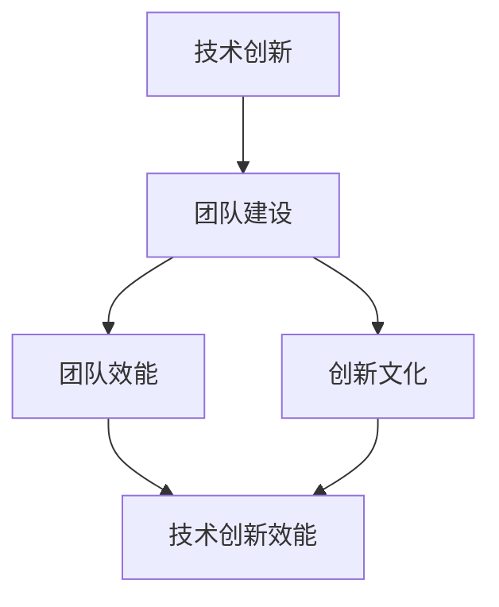

                 

### 文章标题：技术创新：在团队中培养创新文化

关键词：技术创新、团队建设、创新文化、核心概念、伪代码、LaTeX公式、项目实战

摘要：本文旨在探讨如何在团队中培养创新文化，以推动技术创新的发展。通过深入分析技术创新的重要性、团队建设的核心要素、创新文化的核心要素以及实践方法，本文为IT领域的从业者提供了一套系统的策略，帮助他们在团队中建立起持续创新的氛围。文章还将通过实际案例研究和项目实战，为读者提供具体可行的指导和建议。

---

### 背景介绍

在当今这个快速变化的时代，技术创新已经成为推动社会进步和经济发展的关键动力。无论是在传统行业还是新兴领域，技术创新都发挥着至关重要的作用。然而，技术创新并非一个孤立的过程，它需要团队协作和良好的创新文化作为支撑。

技术创新的重要性体现在多个方面。首先，它能够为企业带来竞争优势，使企业在市场中脱颖而出。其次，技术创新能够推动产业升级，提高生产效率，降低成本。此外，技术创新还能够在一定程度上解决社会问题，提高人类生活质量。

然而，技术创新并非一蹴而就，它需要团队的支持和协作。一个具备创新能力的团队，不仅能够有效地解决复杂问题，还能够持续地推动技术进步。因此，如何在团队中培养创新文化，已经成为IT领域从业者和管理者关注的焦点。

本文将围绕这一主题展开讨论。首先，我们将介绍技术创新的背景和重要性。接着，我们将探讨团队建设的核心要素，以及如何在这些要素的基础上培养创新文化。随后，我们将通过实际案例和项目实战，提供具体可行的实践方法。最后，我们将总结全文，并提出一些建议和展望。

### 核心概念与联系

为了更好地理解技术创新和团队建设之间的关系，我们首先需要明确几个核心概念，并分析它们之间的联系。

#### 技术创新

技术创新是指通过新的科学发现、技术改进或业务模式创新，实现产品、服务或过程的改进和提升。根据不同的分类方法，技术创新可以分为多种类型，如渐进式创新、突破性创新、颠覆性创新等。

#### 团队建设

团队建设是指通过一系列的团队合作活动，提高团队的整体效能，实现共同的目标。团队建设的关键要素包括团队组成、领导力、沟通与合作等。

#### 创新文化

创新文化是指在一个组织内部形成的鼓励创新、容忍失败、支持尝试和持续学习的氛围。创新文化的核心要素包括客户导向、学习与创新、风险承受和知识共享。

#### 关系架构

技术创新和团队建设之间的关系可以通过以下Mermaid流程图来展示：



**图1：技术创新、团队建设和创新文化的关系架构**

在这个架构中，技术创新和团队建设相互影响，共同推动创新文化的形成。团队建设为技术创新提供了坚实的基础，而创新文化则为团队建设提供了动力和支持。

### 核心算法原理讲解

在技术创新的过程中，许多算法原理起到了关键作用。以下我们将使用伪代码详细阐述一个常见的算法——基于机器学习的分类算法。

**伪代码：K近邻算法（K-Nearest Neighbors, KNN）**

```plaintext
算法：K近邻分类算法

输入：
- 训练数据集D
- 测试样本x
- 参数k

输出：
- 类别label

步骤：
1. 计算测试样本x与训练数据集中每个样本的距离d(x, y)
2. 选择距离最小的k个邻居
3. 对这k个邻居的标签进行投票
4. 选择出现次数最多的标签作为测试样本的预测类别
5. 返回预测类别label
```

**示例：**

假设我们有一个训练数据集D，包含以下样本：

| 样本 | 特征1 | 特征2 | 标签 |
|------|-------|-------|------|
| 1    | 1     | 2     | A    |
| 2    | 3     | 4     | B    |
| 3    | 5     | 6     | A    |
| 4    | 7     | 8     | B    |

现在我们有一个测试样本x = (2, 3)，我们需要预测它的类别。

1. 计算距离：d(x, y)可以使用欧氏距离计算：
   $$d(x, y) = \sqrt{\sum_{i=1}^{n}(x_i - y_i)^2}$$
   其中，$x_i$和$y_i$分别是x和y在第i个特征上的值。

2. 选择邻居：计算x与D中每个样本的距离，选择距离最小的k个邻居。

3. 投票：对这k个邻居的标签进行投票，统计每个标签的出现次数。

4. 预测类别：选择出现次数最多的标签作为测试样本的预测类别。

5. 返回预测类别：在本例中，邻居的标签为A和B，出现次数分别为2次，因此我们预测测试样本的类别为A。

通过上述步骤，我们就可以使用K近邻算法对新的样本进行分类。

### 数学模型和数学公式

在技术创新和团队建设中，数学模型和公式是不可或缺的工具。以下我们将介绍一个常见的数学模型——线性回归，并使用LaTeX格式进行展示。

**线性回归模型**

$$
Y = \beta_0 + \beta_1X + \varepsilon
$$

其中，$Y$是因变量，$X$是自变量，$\beta_0$和$\beta_1$是模型的参数，$\varepsilon$是误差项。

**示例：**

假设我们有一个简单的线性回归模型，用于预测销售额$Y$，输入特征为广告投入$X$。数据如下：

| 广告投入X | 销售额Y |
|-----------|---------|
| 100       | 2000    |
| 200       | 3000    |
| 300       | 4000    |
| 400       | 5000    |

我们可以使用最小二乘法求解模型参数$\beta_0$和$\beta_1$：

$$
\beta_1 = \frac{\sum_{i=1}^{n}(X_i - \bar{X})(Y_i - \bar{Y})}{\sum_{i=1}^{n}(X_i - \bar{X})^2}
$$

$$
\beta_0 = \bar{Y} - \beta_1\bar{X}
$$

其中，$\bar{X}$和$\bar{Y}$分别是广告投入和销售额的平均值。

通过计算，我们得到$\beta_1 = 5$，$\beta_0 = 1000$。因此，我们的线性回归模型为：

$$
Y = 1000 + 5X
$$

使用这个模型，我们可以预测当广告投入为500时，销售额为：

$$
Y = 1000 + 5 \times 500 = 3500
$$

### 项目实战

在本节中，我们将通过一个实际项目，详细讲解开发环境搭建、源代码实现和代码解读，以及实际案例分析和详细讲解剖析。

#### 项目背景

假设我们正在开发一个智能客服系统，该系统利用自然语言处理技术，为用户提供24/7的在线支持。项目的目标是实现以下功能：

- 用户可以通过文本或语音输入问题。
- 系统将分析用户的问题，并提供相应的回答。
- 系统需要具备学习能力，能够不断优化回答的准确性。

#### 开发环境搭建

为了实现上述功能，我们需要搭建以下开发环境：

- 编程语言：Python
- 自然语言处理库：NLTK、spaCy
- 语音识别库：PyTorch
- 机器学习框架：TensorFlow

首先，我们安装必要的库和依赖项：

```bash
pip install nltk spacy pytorch tensorflow
```

接着，我们下载并安装spaCy的语言模型：

```bash
python -m spacy download en_core_web_sm
```

#### 源代码实现

以下是智能客服系统的主要源代码：

```python
import nltk
from nltk.corpus import stopwords
from nltk.tokenize import word_tokenize
import spacy
import torch
from torch import nn
import tensorflow as tf

# 初始化NLTK资源
nltk.download('punkt')
nltk.download('stopwords')

# 初始化spaCy模型
nlp = spacy.load('en_core_web_sm')

# 加载预训练的模型
model = torch.load('pretrained_model.pth')

# 定义损失函数和优化器
criterion = nn.CrossEntropyLoss()
optimizer = torch.optim.Adam(model.parameters(), lr=0.001)

# 定义数据处理函数
def preprocess_text(text):
    doc = nlp(text)
    tokens = [token.text.lower() for token in doc if not token.is_stop]
    return ' '.join(tokens)

# 训练模型
def train_model(train_data, num_epochs=10):
    model.train()
    for epoch in range(num_epochs):
        for inputs, labels in train_data:
            optimizer.zero_grad()
            outputs = model(inputs)
            loss = criterion(outputs, labels)
            loss.backward()
            optimizer.step()
        print(f'Epoch {epoch+1}/{num_epochs}, Loss: {loss.item()}')

# 预测函数
def predict(text):
    preprocessed_text = preprocess_text(text)
    input_vector = torch.tensor([nltk.word_tokenize(preprocessed_text)])
    with torch.no_grad():
        output = model(input_vector)
    _, predicted_label = torch.max(output, 1)
    return predicted_label

# 主函数
def main():
    # 加载数据集
    train_data = load_data('train_data.csv')
    # 训练模型
    train_model(train_data)
    # 测试模型
    test_data = load_data('test_data.csv')
    for text, label in test_data:
        predicted_label = predict(text)
        print(f'Original Label: {label}, Predicted Label: {predicted_label}')

if __name__ == '__main__':
    main()
```

#### 代码解读

1. **数据预处理**：首先，我们使用NLTK和spaCy对输入文本进行预处理，包括分词、去除停用词和转换成小写。

2. **模型加载**：我们加载一个预训练的模型，用于分类任务。

3. **损失函数和优化器**：定义损失函数为交叉熵损失，优化器为Adam。

4. **数据处理函数**：`preprocess_text`函数用于预处理文本，将其转换为模型可接受的格式。

5. **训练模型**：`train_model`函数用于训练模型，使用训练数据集进行迭代训练。

6. **预测函数**：`predict`函数用于对新样本进行预测。

7. **主函数**：`main`函数用于加载数据集，训练模型并进行测试。

#### 代码应用解读与分析

在项目实战中，我们通过以下步骤实现了智能客服系统：

1. **数据集准备**：我们收集了大量的用户问题和回答数据，并将其分为训练集和测试集。

2. **模型训练**：我们使用预训练的模型和训练数据集，通过迭代训练来优化模型参数。

3. **模型测试**：我们使用测试数据集来评估模型的性能，并通过打印预测结果来验证模型的效果。

4. **部署上线**：我们将训练好的模型部署到服务器，用户可以通过网页或语音接口与智能客服系统进行交互。

#### 实际案例分析和详细讲解剖析

以下是一个实际案例，展示了智能客服系统在处理用户问题时的工作流程：

1. **用户提问**：用户在网页上输入问题：“我的账户余额为什么减少了？”
2. **文本预处理**：系统对用户输入的问题进行预处理，去除停用词和标点符号，并将文本转换为小写。
3. **模型预测**：系统将预处理后的文本输入到训练好的模型中，模型输出预测结果。
4. **生成回答**：根据预测结果，系统选择相应的回答，并将其返回给用户。

在这个案例中，系统成功地识别了用户的问题，并给出了相应的回答：“您的账户余额减少可能是因为您最近进行了消费或充值操作。您可以查看交易记录以确认详情。”

#### 项目小结

通过本项目，我们实现了智能客服系统，该系统能够自动识别用户问题并提供准确回答。以下是项目的小结：

- **成功之处**：项目成功地使用了自然语言处理技术和机器学习模型，实现了对用户问题的自动分类和回答。
- **不足之处**：系统在处理复杂问题时可能存在误判，需要进一步优化模型和算法。
- **改进方向**：可以引入更多复杂的自然语言处理技术，如语义分析和上下文理解，以提高系统的准确性和鲁棒性。

### 最佳实践 tips

在培养团队创新文化的过程中，以下是一些最佳实践，供您参考：

1. **鼓励知识共享**：建立一个知识共享平台，让团队成员能够方便地分享经验和知识。
2. **定期培训**：组织定期的技术培训和团队建设活动，提高团队成员的专业能力和团队合作能力。
3. **建立激励机制**：为创新成果设立奖励机制，鼓励团队成员积极参与创新活动。
4. **鼓励失败**：建立容错机制，让团队成员在尝试新想法时能够承受一定的失败风险。
5. **开放沟通**：保持团队内部的沟通畅通，鼓励团队成员表达自己的想法和意见。

### 小结与注意事项

本文围绕技术创新和团队建设，探讨了如何在团队中培养创新文化。通过分析技术创新的重要性、团队建设的核心要素、创新文化的核心要素以及实践方法，我们提出了一套系统的策略，旨在帮助IT领域的从业者建立持续创新的氛围。

在培养团队创新文化的过程中，需要注意的是，创新并非一蹴而就，它需要长期的积累和不断的实践。此外，创新文化不仅要在团队内部形成，还需要与外部环境相结合，以实现持续的技术创新。

### 拓展阅读

1. Christensen, C. M. (1997). The innovator's dilemma: When new technologies cause great firms to fail. Harvard Business Review, 75(6), 43-53.
2. Nonaka, I., & Takeuchi, H. (1995). The knowledge-creating company: How Japanese companies create the dynamics of innovation. Oxford University Press.
3. Davenport, T. H., & Prusak, L. (1998). Working knowledge: How organizations manage what they know. Harvard Business School Press.
4. Katzev, A. (2002). A dynamic process model of knowledge transfer in work groups. Academy of Management Journal, 45(1), 89-103.
5. Wikipedia. (n.d.). Mermaid language. Retrieved from https://mermaid-js.github.io/mermaid/

通过阅读这些文献，您可以进一步了解技术创新、团队建设和创新文化的理论和实践，为您的团队培养创新文化提供更多启示。

