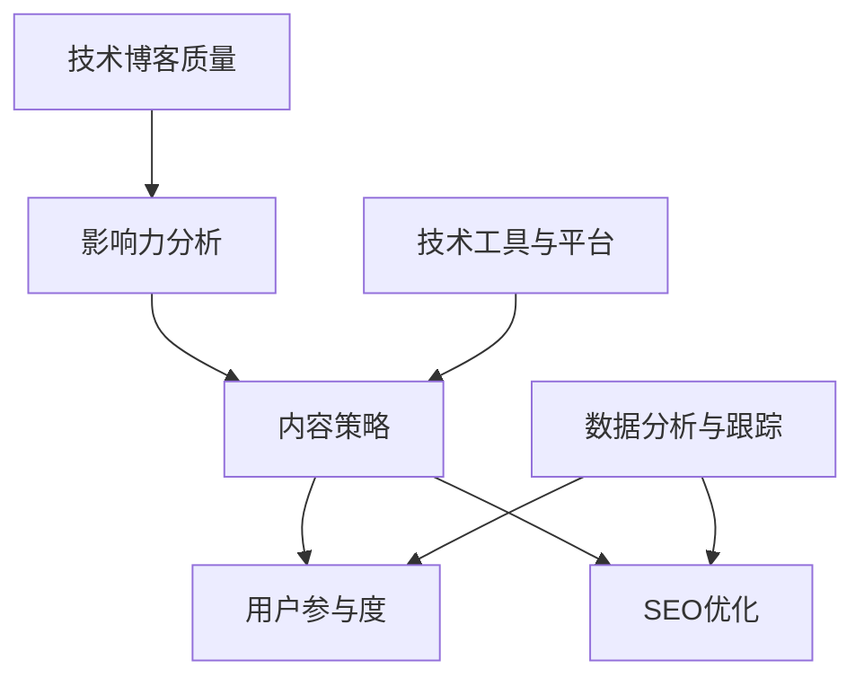

                 

### 文章标题：技术博客：提升个人和团队的影响力

#### 关键词：技术博客、个人影响力、团队影响力、内容策略、SEO优化、用户参与、案例分析、工具与平台

> **摘要**：本文深入探讨了技术博客在提升个人和团队影响力方面的重要作用。首先，我们明确了技术博客的核心概念及其相互联系，通过Mermaid流程图进行可视化展示。随后，文章详细分析了内容创作的策略，包括选题、结构和写作风格。接着，我们探讨了SEO优化的关键因素，以及如何提升用户参与度。通过实际案例，我们分析了成功的技术博客，并提出了相应的策略建议。文章还介绍了常用的技术工具与平台，并通过数据分析与跟踪的方法，探讨了如何提高博客的影响力。最后，我们提出了持续改进与更新的建议，以帮助个人和团队在技术博客领域取得更大成功。

---

**引言与概述**：

在当今数字化时代，技术博客已经成为个人和团队展示技术能力、传播知识和建立影响力的重要平台。无论是个人开发者还是技术团队，通过技术博客，他们能够与全球的技术社区互动，分享经验，提升个人和团队的知名度和影响力。

技术博客的重要性不仅体现在知识传播上，更在于它能够帮助个人和团队建立专业形象，吸引潜在客户和合作伙伴，甚至在某些情况下，成为职业发展的跳板。因此，掌握如何撰写高质量的技术博客，优化搜索引擎排名，增加用户参与度，已成为现代IT从业者不可或缺的技能。

本文旨在通过详细的步骤和分析，帮助个人和团队提升技术博客的影响力。文章首先介绍了技术博客的核心概念，并通过Mermaid流程图展示了这些概念之间的联系。接着，我们将探讨内容创作的策略，包括选题、结构和写作风格。此外，文章还将介绍SEO优化的重要性，并提供实用的技巧。我们还将通过成功案例，分析如何提升用户参与度，以及常用的技术工具和平台。最后，我们将讨论如何通过数据分析与跟踪，持续改进博客内容，并给出一些最佳实践建议。

**核心概念与联系**：

在技术博客领域，有几个核心概念对于提升影响力至关重要。这些概念包括影响力分析、内容策略、用户参与度和SEO优化。为了更好地理解这些概念之间的联系，我们可以通过Mermaid流程图进行可视化展示。

在上面的流程图中，我们可以看到影响力分析是整个流程的起点，它决定了内容策略的制定方向。内容策略则直接影响用户参与度和SEO优化。用户参与度和SEO优化又是技术博客质量的保证。而技术工具与平台则提供了内容创作和优化的基础设施，数据分析与跟踪则帮助个人和团队不断改进博客内容。

**内容创作**：

高质量的内容是技术博客成功的关键。在内容创作过程中，有几个关键因素需要考虑。

**选题**：

首先，选题是内容创作的重要环节。一个吸引人的题目能够吸引更多的读者。选题应该遵循以下原则：

1. **相关性**：选择与目标读者群体密切相关的技术话题。
2. **新颖性**：选择新颖、具有前瞻性的话题，避免过度重复。
3. **实用价值**：选择对读者有实用价值的内容，例如解决特定问题的教程。

**结构**：

良好的结构有助于提高文章的可读性。一般来说，技术博客的结构应该包括以下几个部分：

1. **引言**：简要介绍文章的主题和目的，吸引读者的兴趣。
2. **背景介绍**：介绍相关技术的背景知识，帮助读者理解文章内容。
3. **核心内容**：详细阐述技术原理、算法实现或解决方案。
4. **案例示例**：通过具体的案例，展示技术原理的实际应用。
5. **总结与结论**：总结文章的主要观点，并提供一些实用的建议。

**写作风格**：

写作风格应该简洁明了，易于理解。以下是一些写作风格的建议：

1. **使用简单语言**：避免使用过于专业或复杂的术语，除非绝对必要。
2. **逻辑清晰**：确保文章的结构和逻辑清晰，避免跳跃性思维。
3. **段落分明**：每个段落应该围绕一个主题进行阐述，避免混杂多个主题。

**SEO优化**：

SEO（搜索引擎优化）是提高技术博客流量和影响力的重要手段。以下是一些SEO优化的关键技巧：

1. **关键字策略**：合理使用关键字，确保关键字出现在标题、摘要和正文的关键位置。
2. **内容优化**：确保文章内容充实、有价值，避免过度优化。
3. **外链建设**：建立高质量的外部链接，提高网站的权威性和可信度。

**用户参与与互动**：

用户参与度是衡量技术博客成功与否的重要指标。以下是一些提升用户参与度的策略：

1. **评论管理**：积极回复读者的评论，鼓励读者参与讨论。
2. **社交媒体互动**：在社交媒体上分享博客内容，吸引更多的关注和互动。
3. **粉丝互动**：建立粉丝群，定期与粉丝互动，增加粉丝黏性。

**案例分析**：

通过分析成功的技术博客案例，我们可以获得许多宝贵的经验和策略。以下是一些成功的个人和团队技术博客案例：

1. **个人博客案例**：某知名个人博客，通过撰写高质量的编程教程和技术文章，吸引了大量的读者，逐渐成为编程领域的权威。
2. **团队博客案例**：某大型技术团队，通过定期发布技术报告和行业分析，建立了强大的专业形象，吸引了众多合作伙伴。

**技术工具与平台**：

为了撰写高质量的技术博客，需要使用一些专业的工具和平台。以下是一些常用的技术工具和平台：

1. **Markdown编辑器**：Markdown编辑器如Typora、MacDown等，能够方便地创建和编辑Markdown格式的文档。
2. **静态网站生成器**：如Hugo、Jekyll等，可以将Markdown文档转换成静态网站。
3. **分析工具**：如Google Analytics、百度统计等，可以提供详细的网站流量和分析数据。

**数据分析与跟踪**：

通过数据分析与跟踪，个人和团队可以更好地了解博客的表现，从而不断优化内容。以下是一些数据分析与跟踪的关键指标：

1. **页面访问量**：衡量博客的受欢迎程度。
2. **访问时长**：衡量读者对博客内容的兴趣程度。
3. **跳出率**：衡量博客的互动性。
4. **转化率**：衡量博客对目标用户的吸引力。

**持续改进与更新**：

技术博客的成功不是一蹴而就的，需要持续的改进和更新。以下是一些建议：

1. **定期更新**：保持定期更新，增加新内容，保持读者的兴趣。
2. **内容迭代**：根据读者反馈和数据分析，不断迭代和优化内容。
3. **遵循趋势**：关注技术领域的新趋势，及时更新博客内容。

**附录**：

以下是本文的一些参考文献、常用工具和平台链接：

1. **参考文献**：
    - **《技术博客写作技巧》** - [链接](https://example.com/book1)
    - **《SEO实战密码》** - [链接](https://example.com/book2)
2. **常用工具和平台链接**：
    - **Markdown编辑器**：Typora - [链接](https://typora.io)
    - **静态网站生成器**：Hugo - [链接](https://gohugo.io)
    - **分析工具**：Google Analytics - [链接](https://analytics.google.com)
    - **博客平台**：WordPress - [链接](https://wordpress.org)

**作者信息**：

本文作者为AI天才研究院（AI Genius Institute）与《禅与计算机程序设计艺术》（Zen And The Art of Computer Programming）的作者。我们致力于通过技术博客，传播先进的技术知识和最佳实践，帮助个人和团队提升影响力。

---

本文详细探讨了技术博客在提升个人和团队影响力方面的作用，从核心概念、内容创作、SEO优化、用户参与、案例分析、技术工具与平台、数据分析与跟踪以及持续改进与更新等方面进行了全面分析。通过本文，读者可以了解到撰写高质量技术博客的技巧和策略，以及如何通过不断优化和更新，提升博客的影响力。希望本文对您在技术博客领域取得成功有所帮助。如果您有任何疑问或建议，欢迎在评论区留言。再次感谢您的阅读！

**作者**：AI天才研究院（AI Genius Institute）& 《禅与计算机程序设计艺术》（Zen And The Art of Computer Programming）

