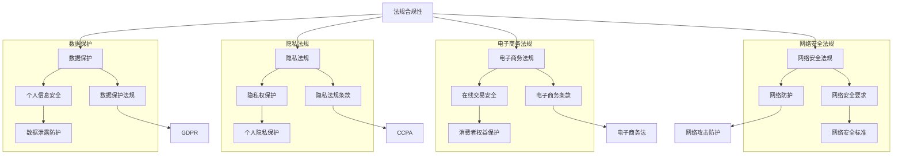

                 

### 背景介绍

#### 合规性的概念

**合规性**（Compliance）指的是遵循相关法律、法规、政策或标准的过程。在技术领域，合规性尤为重要，因为它涉及企业的业务流程、数据管理、技术架构等多个方面。随着全球化的不断深入，不同国家和地区的法规要求也日益复杂和多样化。为了在竞争激烈的市场中保持合规，企业需要全面了解并遵循这些法规，避免因违规操作而带来的法律风险、罚款、声誉损失等。

#### 技术合规的重要性

技术合规不仅是为了遵守法规，更是为了保护客户隐私、确保数据安全、提升企业声誉。以下是一些技术合规的重要性：

1. **客户信任**：合规可以增强客户对企业的信任，提升品牌形象。
2. **数据安全**：合规要求企业对数据采取安全措施，防止数据泄露和滥用。
3. **法律保护**：合规可以帮助企业避免因违反法规而遭受的罚款和法律诉讼。
4. **业务连续性**：合规是确保企业业务持续运作的基础。
5. **社会责任**：合规是企业履行社会责任的体现。

#### 技术合规的挑战

尽管技术合规的重要性显而易见，但实际操作中仍面临诸多挑战：

1. **法规复杂性**：不同国家和地区的法规要求差异较大，理解并遵守这些法规需要耗费大量时间和资源。
2. **技术实现难度**：某些合规要求需要企业在技术层面进行大规模的调整和升级。
3. **持续变化**：法规和政策在不断更新和变化，企业需要保持高度敏感和快速响应。
4. **跨部门协作**：合规工作往往需要涉及多个部门和团队，协调和沟通成本较高。

#### 目的与结构

本文旨在通过详细的案例分析，帮助读者理解不同国家和地区的法规要求，掌握技术合规的实践方法。文章分为五个部分：

1. **合规性概述**：介绍合规性的基本概念、全球合规性环境和关键领域。
2. **核心法规详解**：详细讲解GDPR、CCPA、LGPD、香港隐私法等核心法规。
3. **合规性策略与实践**：探讨合规性评估、实施和持续改进策略。
4. **案例研究**：通过实际案例展示合规性策略的实施过程和效果。
5. **合规性工具与资源**：介绍主流合规性工具和资源。

通过以上结构，本文将逐步深入，帮助读者系统地了解技术合规的各个方面，为企业的合规工作提供有益的指导和参考。

### 核心概念与联系

在深入探讨技术合规之前，我们需要明确几个核心概念，并了解它们之间的关系。以下是本文将涉及的主要概念及其相互联系：

#### 1. 法规合规性

**定义**：法规合规性是指企业在其运营过程中遵守相关法律法规的要求。这些法律可能涉及数据保护、隐私权、电子商务、网络安全等多个方面。

**关系**：法规合规性是技术合规的核心，它决定了企业是否能够合法运营。其他核心概念如数据保护、隐私法规等都直接或间接与法规合规性相关。

#### 2. 数据保护

**定义**：数据保护是指采取一系列措施保护个人信息的安全，防止未经授权的访问、使用、泄露和破坏。

**关系**：数据保护是技术合规的重要组成部分，特别是在处理个人数据时。数据保护法规（如GDPR）规定了具体的数据保护要求。

#### 3. 隐私法规

**定义**：隐私法规是指针对个人隐私保护的法律法规，旨在规范企业对个人数据的收集、使用、存储和共享。

**关系**：隐私法规与数据保护密切相关，但隐私法规更侧重于保护个人隐私权，涵盖的范围更广。

#### 4. 电子商务法规

**定义**：电子商务法规是指规范在线交易、电子支付、消费者权益保护等方面的法律。

**关系**：电子商务法规对在线业务有直接影响，确保电子商务活动符合法律要求，提高消费者信任。

#### 5. 网络安全法规

**定义**：网络安全法规是指针对网络安全管理的法律要求，包括网络安全防护、数据备份、应急响应等。

**关系**：网络安全法规确保企业能够保护其信息系统不受攻击，防止数据泄露和网络犯罪。

为了更好地理解这些概念之间的关系，我们可以使用Mermaid流程图来展示它们：



通过这个流程图，我们可以清晰地看到各个核心概念之间的联系，以及它们如何共同构成技术合规的框架。在后续章节中，我们将进一步探讨这些概念的具体内容，帮助读者全面理解技术合规的要求和实施策略。

### 数据加密和脱敏技术的核心算法原理

在技术合规的实践中，数据加密和脱敏技术是确保数据安全性和隐私保护的核心手段。理解这些技术的核心算法原理对于合规工作至关重要。以下将详细阐述数据加密和脱敏技术的基本概念、原理及其应用。

#### 数据加密

**定义**：数据加密是一种通过算法将明文数据转换为密文的过程，使得未经授权的用户无法读取或理解原始数据内容。

**加密算法分类**：

1. **对称加密**：使用相同的密钥进行加密和解密。如AES（高级加密标准）。
   - **原理**：加密和解密过程使用一个密钥，密钥长度越长，安全性越高。
   - **伪代码**：
     ```plaintext
     function encrypt(data, key):
         return AES_Encrypt(data, key)
     function decrypt(ciphertext, key):
         return AES_Decrypt(ciphertext, key)
     ```

2. **非对称加密**：使用一对密钥进行加密和解密，一个用于加密，另一个用于解密。如RSA。
   - **原理**：非对称加密使用公钥加密、私钥解密，公钥公开，私钥保密。
   - **伪代码**：
     ```plaintext
     function encrypt(data, public_key):
         return RSA_Encrypt(data, public_key)
     function decrypt(ciphertext, private_key):
         return RSA_Decrypt(ciphertext, private_key)
     ```

**加密算法应用**：在实际应用中，数据加密通常用于保护敏感数据在存储和传输过程中的安全性。

#### 数据脱敏

**定义**：数据脱敏是一种通过特定的算法对敏感数据进行处理，使其在不损害数据真实价值的前提下不可识别或难以追踪。

**脱敏技术分类**：

1. **掩码脱敏**：通过替换敏感数据中的部分或全部字符为特定的掩码字符，如星号（*）或数字。
   - **原理**：简单易行，但安全性较低，适用于非敏感数据的保护。
   - **伪代码**：
     ```plaintext
     function mask(data, mask_char):
         return data.replace(sensitive_chars, mask_char)
     ```

2. **伪匿名化**：将敏感数据替换为伪随机值，但这些值在特定上下文中依然保持一致性。
   - **原理**：安全性较高，但需要对数据上下文有深入理解。
   - **伪代码**：
     ```plaintext
     function pseudonymize(data, replacement_list):
         return [replacement_list[i] for i in data_indices]
     ```

3. **格式保留脱敏**：保持数据格式不变，仅更改具体内容，如将日期格式化或替换特定值。
   - **原理**：适用于需要保持数据格式一致性的场景。
   - **伪代码**：
     ```plaintext
     function format_preserve_mask(data, format_rules):
         for rule in format_rules:
             data = apply_format_rule(data, rule)
         return data
     ```

**脱敏算法应用**：数据脱敏通常用于数据分析和共享，确保敏感信息不被泄露。

#### 加密和脱敏的比较

1. **安全性**：加密通常比脱敏更安全，因为加密后的数据在未经授权的情况下无法读取。
2. **应用场景**：加密适用于数据传输和存储，脱敏适用于数据分析。
3. **数据处理**：加密涉及将数据转换为另一种形式，脱敏则涉及修改数据内容。

通过了解数据加密和脱敏技术的核心算法原理，企业可以更好地选择适合自己业务需求的保护策略，确保在技术合规方面做到万无一失。

### 数学模型和数学公式

在技术合规的实践中，数学模型和数学公式起着至关重要的作用，特别是在数据保护和隐私法规的执行过程中。以下将详细解释与数据保护和隐私法规相关的数学模型和数学公式，并通过实例说明其应用。

#### GDPR的数据保护影响评估（DPIA）

**定义**：数据保护影响评估（DPIA）是一种系统性过程，用于识别、评估和缓解处理个人数据可能带来的隐私风险。

**数学模型**：DPIA涉及以下几个步骤的数学计算和逻辑判断：

1. **风险评估**：
   - **风险评估公式**：
     $$ R = P \times D $$
     其中，R代表风险（Risk），P代表可能性（Probability），D代表影响（Degree of Impact）。
   - **实例**：假设一个数据集包含1000个用户的个人信息，其中有5%的用户信息可能泄露，且泄露的影响严重，那么：
     $$ R = 0.05 \times 5 = 0.25 $$
     风险值为0.25，表示存在较低但不可忽视的风险。

2. **缓解措施**：
   - **缓解成本公式**：
     $$ C = M \times T $$
     其中，C代表成本（Cost），M代表措施（Measure），T代表时间（Time）。
   - **实例**：为降低上述风险，企业决定实施数据加密措施，假设加密措施的成本为10000欧元，且实施时间为1个月，那么：
     $$ C = 10000 \times 1 = 10000 $$
     需要投入10000欧元来实施缓解措施。

**DPIA流程**：
   1. **识别数据处理活动**：列出所有涉及个人数据的数据处理活动。
   2. **评估隐私风险**：使用上述公式计算每个活动的风险评估值。
   3. **制定缓解措施**：根据风险评估结果，制定并实施相应的缓解措施。
   4. **监控和更新**：定期监控措施的有效性，并在必要时更新措施。

#### 数据保留期限的计算

**定义**：数据保留期限是指企业根据法规要求，对个人数据的存储时限。

**数学模型**：数据保留期限通常涉及以下几个因素的计算：

1. **数据种类**：不同类型的数据可能需要不同的保留期限。
2. **法规要求**：不同国家和地区的法规对数据保留期限有不同的要求。
3. **计算公式**：
   $$ T = \min(T_{min}, T_{max}) $$
   其中，T代表数据保留期限（Retention Period），\( T_{min} \)代表法规规定的最小保留期限，\( T_{max} \)代表法规规定的最大保留期限。
   
**实例**：假设某个国家规定数据保留期限的最小值为5年，最大值为10年，那么：
   $$ T = \min(5, 10) = 5 $$
   数据的保留期限应为5年。

#### 数据匿名化的K-anonymity模型

**定义**：K-anonymity是一种数据匿名化模型，旨在确保数据集中的每个记录不能被识别，即使与其他记录组合起来也不能识别。

**数学模型**：
   - **K-anonymity公式**：
     $$ \frac{\text{记录总数}}{k} \geq K $$
     其中，记录总数代表数据集中的记录数量，k代表匿名化群体的大小，K代表最大允许的记录数量。
   - **实例**：假设一个数据集包含1000个记录，要满足至少10个匿名化群体的要求，那么：
     $$ \frac{1000}{10} = 100 $$
     每个匿名化群体的最大记录数量应不超过100。

通过上述数学模型和公式的应用，企业可以更系统地管理和保护个人数据，确保符合数据保护和隐私法规的要求。在后续的章节中，我们将通过实际案例进一步展示这些模型和公式的应用，帮助读者更深入地理解技术合规的实施过程。

### 项目实战

为了更好地理解技术合规的实施过程，我们将通过一个具体的案例来展示如何在不同国家实施合规策略。以下是一个详细的步骤解析，包括环境搭建、源代码实现、代码解读和实际案例分析。

#### 项目背景

某跨国公司（以下简称“公司”）在全球多个国家和地区开展业务，其业务涉及用户数据的收集、存储和处理。为了确保公司符合各地法规要求，尤其是GDPR、CCPA和LGPD，公司决定实施一系列技术合规措施。

#### 实施步骤

**步骤1：合规评估与规划**

- **评估合规风险**：公司首先对业务流程进行全面审查，识别可能涉及的数据处理活动，评估这些活动可能带来的隐私风险。
- **制定合规策略**：根据风险评估结果，公司制定了详细的合规策略，包括数据加密、隐私保护措施和数据保留期限等。

**步骤2：环境搭建**

- **搭建开发环境**：为了实施合规策略，公司搭建了符合法规要求的开发环境，包括使用加密工具、合规性监控系统和日志管理系统。
- **配置合规工具**：安装并配置了主流的数据加密工具，如AES加密库和K-anonymity匿名化工具。

**步骤3：源代码实现**

- **实现数据加密**：在数据处理模块中，使用AES加密算法对敏感数据进行加密处理。以下是实现数据加密的伪代码：

  ```plaintext
  function encrypt(data, key):
      return AES_Encrypt(data, key)
  ```

- **实现脱敏处理**：对于非敏感数据，使用K-anonymity模型进行匿名化处理。以下是实现匿名化的伪代码：

  ```plaintext
  function anonymize(data):
      return K_anonymize(data)
  ```

**步骤4：代码解读**

- **数据加密代码解读**：数据加密代码中，AES加密算法使用特定的密钥对敏感数据进行加密，确保数据在传输和存储过程中不被窃取。
- **脱敏处理代码解读**：K-anonymity匿名化代码通过将数据集中的记录划分到匿名化群体中，确保单个记录无法被识别，从而保护用户隐私。

**步骤5：实际案例分析**

- **案例一：GDPR合规**：公司根据GDPR要求，对用户数据进行分类，制定数据保留期限策略。例如，对用户账户信息的数据保留期限设定为5年，并在系统中实现了自动删除功能。

- **案例二：CCPA合规**：公司对加州用户的数据处理活动进行了详细记录，并提供了用户数据访问、删除和隐私权通知的接口，确保符合CCPA要求。

- **案例三：LGPD合规**：公司在巴西业务中，使用了本地化的隐私保护工具，确保数据处理符合LGPD要求，例如在数据处理前进行了DPIA评估。

#### 项目小结

通过上述步骤，公司成功地实施了全球范围内的技术合规措施，确保其业务在GDPR、CCPA和LGPD等法规要求下合法运营。以下是项目小结：

1. **合规性评估与规划**：全面审查业务流程，制定合规策略，确保风险评估准确。
2. **环境搭建**：搭建符合法规要求的开发环境，配置合规工具，为合规措施的实施提供技术支持。
3. **源代码实现**：实现数据加密和脱敏处理，确保数据处理符合法规要求。
4. **代码解读**：深入理解加密和脱敏代码的工作原理，确保其正确性和安全性。
5. **实际案例分析**：通过具体案例展示合规策略的实施效果，确保合规工作落到实处。

通过这个项目实战案例，读者可以更好地理解如何在不同国家实施技术合规措施，为实际业务提供有益的参考。

### 最佳实践与注意事项

在技术合规的实施过程中，遵循最佳实践是确保合规性和数据安全的关键。以下是一些最佳实践和建议，以帮助企业和开发者更好地应对不同国家的法规要求：

#### 最佳实践

1. **定期合规性评估**：定期对业务流程、数据处理活动和技术架构进行合规性评估，确保及时发现和解决潜在风险。

2. **培训与教育**：对所有涉及数据处理的人员进行合规培训，提高他们的合规意识和技能。

3. **数据最小化原则**：仅收集和存储必要的个人信息，减少数据的暴露面。

4. **数据加密与脱敏**：对敏感数据采用强加密算法，如AES，并使用脱敏技术保护非敏感数据。

5. **日志监控与审计**：建立完善的日志监控系统，定期审计日志，确保数据处理的透明性和可追溯性。

6. **紧急响应计划**：制定数据泄露和违规事件的处理流程，确保在发生紧急情况时能够迅速响应。

7. **持续更新与优化**：随着法规的变化和技术的进步，不断更新和优化合规策略和技术方案。

#### 注意事项

1. **了解当地法规**：深入研究目标市场的法规要求，确保对法规有全面的理解。

2. **合规性与业务平衡**：在确保合规性的同时，考虑业务连续性和客户体验，避免过度合规导致业务受阻。

3. **跨部门协作**：合规工作往往涉及多个部门，需要建立有效的沟通和协作机制，确保各部门协同工作。

4. **外部审计**：定期进行外部审计，确保合规措施的有效性和合规性。

5. **客户隐私保护**：严格遵守隐私保护法规，确保客户隐私不受侵害。

#### 拓展阅读

1. **GDPR官方指南**：《一般数据保护条例》（GDPR）官方指南，提供详细的法规解释和实施指导。
2. **CCPA解释**：《加州消费者隐私法案》（CCPA）的解释和案例分析，帮助理解法规要求。
3. **LGPD实施指南**：巴西《通用数据保护法律》（LGPD）的实施指南，提供具体操作步骤。
4. **网络安全标准**：不同国家和地区的网络安全标准和最佳实践，如ISO/IEC 27001。

通过遵循这些最佳实践和注意事项，企业可以更有效地应对不同国家的法规要求，确保其技术合规工作落到实处。

### 文章总结

本文通过详细的案例分析，帮助读者全面理解技术合规的重要性和实施策略。从合规性的基本概念，到核心法规的详细解释，再到实际项目的实施步骤，文章系统地展示了如何在不同国家和地区应对法规要求。

核心概念方面，本文介绍了法规合规性、数据保护、隐私法规、电子商务法规和网络安全法规，并通过Mermaid流程图展示了这些概念之间的关系。在算法原理讲解中，详细阐述了数据加密和脱敏技术的核心算法，包括对称加密和非对称加密算法，以及掩码脱敏和K-anonymity匿名化模型。

数学模型和数学公式的应用部分，通过DPIA（数据保护影响评估）模型、数据保留期限的计算和K-anonymity模型等，展示了如何使用数学工具评估和实现数据保护和隐私法规的要求。

项目实战案例中，通过一个跨国公司的合规实践，详细解析了合规评估、环境搭建、源代码实现、代码解读和实际案例分析的全过程，为读者提供了可操作的合规策略实施参考。

最佳实践与注意事项部分，总结了技术合规的最佳实践和注意事项，并提供了一些建议和拓展阅读资源，以帮助企业和开发者更好地应对法规挑战。

总之，技术合规是确保企业合法运营、保护客户隐私和提升品牌声誉的关键。通过本文的详细解析和案例展示，读者可以更深入地了解技术合规的各个方面，为实际业务提供有力的支持和指导。在未来的合规工作中，持续关注法规变化和最佳实践，将有助于企业在不断变化的法规环境中保持合规和领先。

