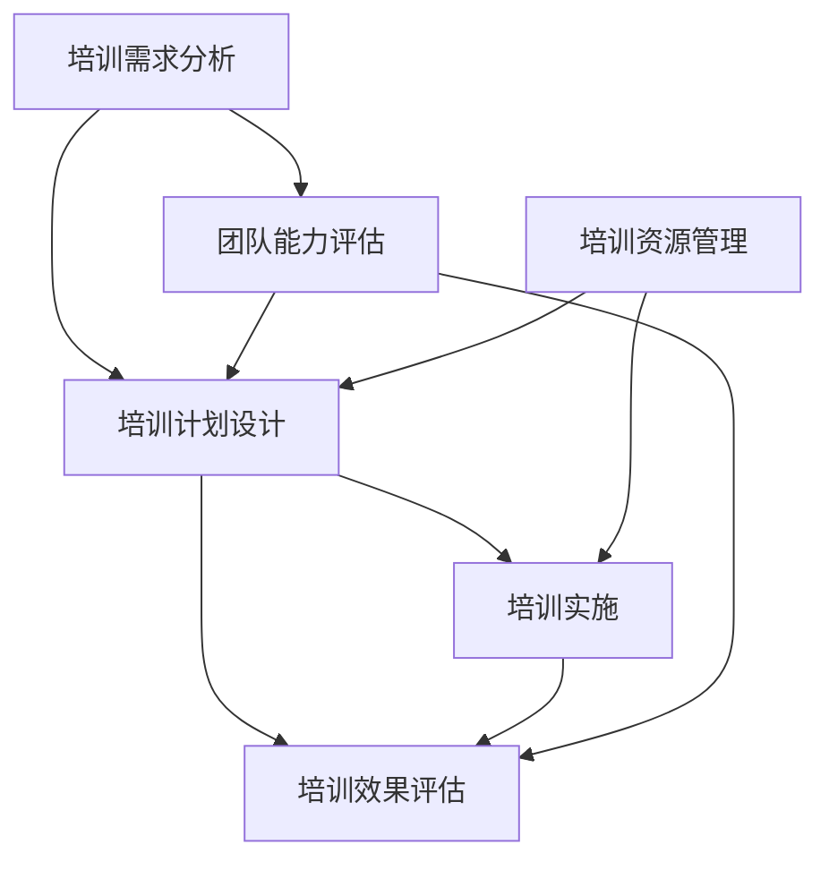
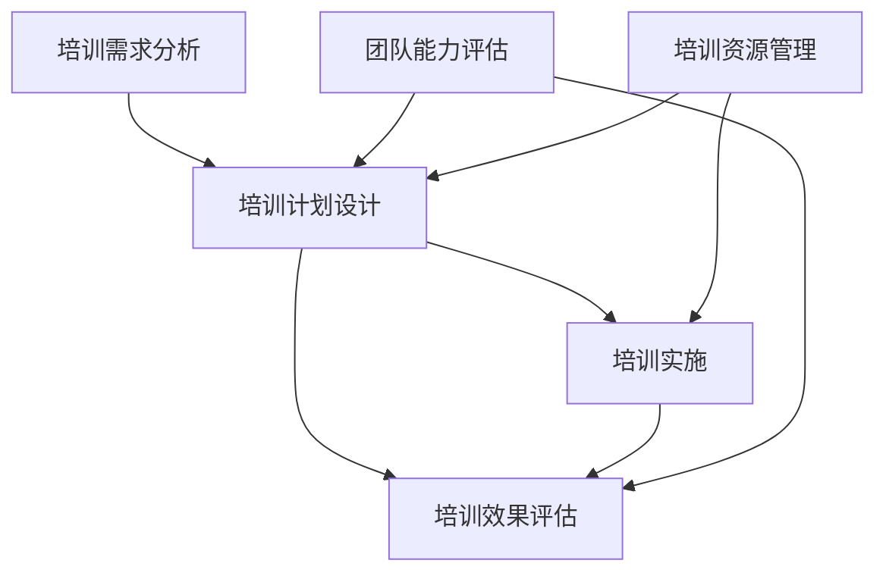

                 


## 文章标题：技术培训体系：系统化提升团队能力

### 关键词：技术培训体系、团队能力、系统化提升、培训计划设计、培训方法与工具

#### 摘要：

在当今快速发展的信息技术领域，团队能力的提升已成为企业持续竞争的关键因素。技术培训体系作为团队能力提升的重要手段，通过系统化的培训计划设计和有效的培训方法与工具，能够显著提高团队的技术水平和工作效率。本文旨在探讨技术培训体系的设计原则、核心概念及其在实践中的应用，通过逐步分析推理，为读者提供一套完整的提升团队能力的技术培训体系。

----------------------------------------------------------------

### 第1章：引言

#### 1.1 技术培训体系的背景

随着信息技术的迅猛发展，软件工程项目变得更加复杂和多样化。技术培训体系在这种背景下应运而生，旨在帮助团队掌握最新的技术知识，提升项目开发能力和团队能力。企业面临着不断更新的技术环境和日益激烈的竞争，只有通过不断的学习和培训，才能保持竞争优势。

#### 1.2 技术培训的重要性

技术培训不仅是提升个人技能的重要途径，也是企业持续发展的关键因素。有效的技术培训可以：

- 提高团队整体技术水平，减少项目风险。
- 增强团队成员之间的协作能力，提升项目效率。
- 培养技术领导者和创新者，推动企业技术进步。
- 降低员工流失率，提高员工满意度和忠诚度。

#### 1.3 技术培训的挑战

尽管技术培训的重要性不言而喻，但在实际操作中，企业仍然面临着诸多挑战：

- 培训需求的不确定性：技术更新迅速，如何准确识别和满足培训需求。
- 培训资源有限：企业往往面临培训资源（时间、资金、师资等）的不足。
- 培训效果难以衡量：如何确保培训投入能够带来实际的收益。
- 员工参与度不高：员工对培训缺乏兴趣或积极性，导致培训效果打折。

### 第2章：技术培训体系概述

#### 2.1 技术培训体系的核心概念

技术培训体系由以下几个核心概念组成：

- **培训需求分析**：识别团队在技术上的需求和差距。
- **培训计划设计**：根据培训需求，设计合理的培训计划。
- **培训实施与监控**：实施培训计划，并对培训过程进行监控。
- **培训效果评估**：评估培训效果，为下一次培训提供依据。

#### 2.2 技术培训体系的框架

技术培训体系的框架可以概括为：

1. **需求分析**：通过问卷调查、访谈等方式，收集团队成员的培训需求。
2. **计划设计**：根据需求分析结果，制定培训计划，包括培训目标、内容、方式等。
3. **培训实施**：按照培训计划，实施培训活动。
4. **监控与反馈**：对培训过程进行监控，收集反馈，对培训计划进行调整。
5. **效果评估**：评估培训效果，总结经验，持续改进培训体系。

#### 2.3 技术培训体系与传统培训的对比

传统培训通常侧重于知识的传递，而技术培训体系更注重知识的实际应用和能力的提升。与传统培训相比，技术培训体系的特点包括：

- **针对性更强**：根据团队的实际需求，量身定制培训计划。
- **互动性更高**：通过案例分析、实战演练等方式，增强培训的互动性。
- **系统性更强**：不仅关注短期效果，更注重培训体系的长远规划。
- **效果可衡量**：通过效果评估，确保培训投入能够带来实际的收益。

----------------------------------------------------------------

### 第3章：团队能力评估

#### 3.1 团队能力评估的重要性

团队能力评估是技术培训体系的关键环节，通过评估可以：

- 了解团队在技术上的优势和不足。
- 确定培训需求和目标。
- 评估培训效果，为后续培训提供依据。

#### 3.2 团队成员能力指标

团队成员的能力指标通常包括以下几个方面：

- **技术能力**：包括编程技能、系统设计能力、数据库管理等。
- **项目管理能力**：包括项目计划、进度控制、风险管理等。
- **沟通与合作能力**：包括团队沟通、协作、冲突解决等。

#### 3.3 团队能力评估方法

团队能力评估方法包括：

- **自我评估**：团队成员根据自身情况，进行自我评估。
- **同级评估**：团队成员相互评估，取平均值。
- **上级评估**：上级对团队成员进行评估。

#### 3.4 团队能力评估流程

团队能力评估流程通常包括以下几个步骤：

1. **确定评估指标**：根据团队需求，确定评估指标。
2. **制定评估计划**：包括评估时间、方式、责任人等。
3. **实施评估**：按照评估计划，实施评估活动。
4. **收集与分析数据**：收集评估数据，进行统计分析。
5. **反馈与改进**：根据评估结果，进行反馈和改进。

----------------------------------------------------------------

### 第4章：培训计划设计

#### 4.1 培训计划的制定原则

在制定培训计划时，应遵循以下原则：

- **针对性**：根据团队需求，量身定制培训计划。
- **系统性**：培训内容应具有系统性，避免零散化。
- **实用性**：培训内容应具有实用性，能够解决实际问题。
- **灵活性**：培训计划应具有一定的灵活性，以应对变化的需求。

#### 4.2 培训计划的设计流程

培训计划的设计流程包括以下几个步骤：

1. **需求分析**：通过问卷调查、访谈等方式，收集团队成员的培训需求。
2. **确定培训目标**：根据需求分析结果，确定培训目标。
3. **设计培训内容**：根据培训目标，设计培训内容。
4. **选择培训方式**：根据培训内容和目标，选择合适的培训方式。
5. **制定培训时间表**：确定培训的时间安排和责任人。

#### 4.2.1 培训需求分析

培训需求分析是培训计划设计的基础，主要包括以下几个方面：

- **技术需求**：分析团队在技术上的需求和差距。
- **项目需求**：分析当前项目对团队技能的要求。
- **个人需求**：了解团队成员的个人成长需求。

#### 4.2.2 培训目标设定

培训目标应明确、具体、可衡量，通常包括以下几个方面：

- **知识目标**：掌握特定的技术知识。
- **技能目标**：提高实际操作技能。
- **行为目标**：改变团队成员的工作习惯和行为。

#### 4.2.3 培训内容设计

培训内容设计应包括以下几个方面：

- **理论知识**：包括基本概念、原理等。
- **实践操作**：包括实际案例、实验等。
- **互动环节**：包括讨论、问答等。

#### 4.2.4 培训方式选择

培训方式选择应根据培训目标和内容来决定，常见的培训方式包括：

- **讲座式培训**：适合知识传授。
- **工作坊**：适合技能提升。
- **案例研究**：适合问题解决。
- **在线学习**：适合灵活安排学习时间。

#### 4.2.5 培训资源分配

培训资源分配包括时间、资金、师资等，应合理规划，确保培训计划的有效实施。

#### 4.3 培训计划的调整与优化

在培训计划实施过程中，应根据实际情况进行适时调整，以适应不断变化的需求。调整与优化包括以下几个方面：

- **调整培训内容**：根据团队反馈，调整培训内容。
- **优化培训方式**：根据培训效果，优化培训方式。
- **增加培训资源**：根据培训需求，增加培训资源。

----------------------------------------------------------------

### 第5章：培训方法与工具

#### 5.1 常见的培训方法

常见的培训方法包括：

- **讲座式培训**：通过讲解，传授理论知识。
- **工作坊**：通过实际操作，提高技能水平。
- **案例研究**：通过案例分析，培养问题解决能力。
- **在线学习**：通过互联网，提供灵活的学习方式。

#### 5.2 培训工具的应用

培训工具的应用可以提高培训效果，常见的培训工具包括：

- **E-learning平台**：提供在线学习资源，支持多种学习模式。
- **视频会议系统**：支持远程培训，提高培训的互动性。
- **在线协作工具**：支持团队协作，提高培训效率。
- **实战演练平台**：提供实际操作环境，培养实际操作能力。

#### 5.2.1 E-learning平台

E-learning平台的应用可以大大提高培训的灵活性和效率，常见功能包括：

- **课程发布与管理**：发布培训课程，管理课程进度。
- **在线测试与评估**：进行在线测试，评估学员学习效果。
- **学习记录与报告**：记录学员学习情况，生成学习报告。

#### 5.2.2 视频会议系统

视频会议系统支持远程培训，提高培训的互动性，常见功能包括：

- **实时语音与视频通信**：支持实时语音和视频交流。
- **共享屏幕与文件**：共享培训材料和操作演示。
- **互动功能**：包括问答、投票、讨论等。

#### 5.2.3 在线协作工具

在线协作工具支持团队协作，提高培训效率，常见功能包括：

- **团队聊天**：支持实时团队交流。
- **任务管理**：分配和跟踪培训任务。
- **文档共享**：共享培训资料和文档。
- **项目管理**：管理培训项目和进度。

#### 5.2.4 实战演练平台

实战演练平台提供实际操作环境，培养实际操作能力，常见功能包括：

- **实验环境搭建**：提供各种实验环境和工具。
- **操作指导与提示**：提供操作指导，帮助学员完成任务。
- **实验报告生成**：生成实验报告，评估学员操作能力。

----------------------------------------------------------------

### 第6章：培训实施与监控

#### 6.1 培训实施的准备工作

培训实施前的准备工作包括：

- **确认培训需求**：确保培训计划与团队需求相符。
- **确定培训师**：选择合适的培训师，确保培训质量。
- **准备培训材料**：准备培训所需的教材、工具等。
- **安排培训场地**：确保培训场地的设备齐全，环境舒适。

#### 6.2 培训实施流程

培训实施流程包括以下几个步骤：

1. **开班仪式**：介绍培训计划、培训师、培训目标等。
2. **课程讲解**：按照培训计划，进行理论知识讲解。
3. **实践操作**：安排实际操作环节，培养实际操作能力。
4. **互动环节**：组织讨论、问答等互动环节，提高学习兴趣。
5. **反馈与总结**：收集学员反馈，进行培训总结。

#### 6.3 培训监控的方法

培训监控的方法包括：

- **过程监控**：监控培训过程中的各项指标，如出勤率、参与度等。
- **成果监控**：监控培训成果，如知识掌握度、技能应用度等。
- **反馈监控**：收集学员对培训的反馈，了解培训效果。

#### 6.3.1 过程监控

过程监控主要包括以下几个方面：

- **出勤率**：监控学员的出勤情况。
- **参与度**：监控学员在培训过程中的参与程度。
- **学习进度**：监控学员的学习进度。

#### 6.3.2 成果监控

成果监控主要包括以下几个方面：

- **知识掌握度**：通过测试、作业等方式，评估学员对知识的掌握程度。
- **技能应用度**：通过实际操作、项目演练等方式，评估学员的技能应用能力。
- **工作表现**：评估学员在项目工作中的表现。

#### 6.3.3 反馈监控

反馈监控主要包括以下几个方面：

- **学员反馈**：收集学员对培训的反馈，了解培训效果。
- **培训师反馈**：收集培训师对学员的反馈，了解培训情况。
- **上级反馈**：收集上级对培训的反馈，评估培训效果。

----------------------------------------------------------------

### 第7章：培训效果评估与改进

#### 7.1 培训效果评估的目的

培训效果评估的目的是：

- 了解培训效果，为后续培训提供依据。
- 评估培训资源的投入产出比。
- 提高培训质量，持续优化培训体系。

#### 7.2 培训效果评估的方法

培训效果评估的方法包括：

- **问卷调查法**：通过问卷调查，了解学员对培训的满意度、知识掌握度等。
- **观察法**：通过观察学员在培训过程中的表现，评估培训效果。
- **访谈法**：通过与学员、上级的访谈，了解培训效果。

#### 7.3 培训效果评估的指标

培训效果评估的指标包括：

- **知识掌握度**：评估学员对培训内容的掌握程度。
- **技能应用度**：评估学员在项目工作中应用培训知识的程度。
- **工作表现**：评估学员在项目工作中的表现。
- **培训满意度**：评估学员对培训的满意度。

#### 7.4 培训改进的措施

根据培训效果评估的结果，可以采取以下措施进行培训改进：

- **调整培训内容**：根据评估结果，调整培训内容，使其更加贴近团队需求。
- **优化培训方式**：根据评估结果，优化培训方式，提高培训效果。
- **增加培训资源**：根据评估结果，增加培训资源，提高培训质量。
- **加强培训管理**：加强培训管理，确保培训计划的有效实施。

#### 7.4.1 调整培训内容

根据评估结果，对培训内容进行调整，可以采取以下措施：

- **增加实践操作**：增加实际操作环节，提高学员的动手能力。
- **案例分析**：增加案例分析，提高学员的问题解决能力。
- **项目实战**：组织项目实战，培养学员的实际工作能力。

#### 7.4.2 优化培训方式

根据评估结果，对培训方式进行优化，可以采取以下措施：

- **引入互动式教学**：增加互动环节，提高学员的参与度。
- **采用多元化的培训方法**：结合讲座、工作坊、在线学习等多种方式，提高培训效果。
- **加强培训师的指导**：提高培训师的教学水平，确保培训质量。

#### 7.4.3 增加培训资源

根据评估结果，对培训资源进行增加，可以采取以下措施：

- **提供更多学习资源**：提供更多教材、视频、在线课程等学习资源。
- **增加培训时间**：延长培训时间，确保学员有足够的时间进行学习。
- **提供培训经费**：提供培训经费，支持学员参加外部培训。

#### 7.4.4 加强培训管理

根据评估结果，对培训管理进行加强，可以采取以下措施：

- **完善培训计划**：完善培训计划，确保培训目标的实现。
- **加强培训监督**：加强对培训过程的监督，确保培训计划的有效实施。
- **建立培训档案**：建立培训档案，记录学员的学习情况，为后续培训提供依据。

----------------------------------------------------------------

## 最佳实践 tips

1. **明确培训目标**：在制定培训计划时，应明确培训目标，确保培训内容与目标一致。
2. **关注学员反馈**：在培训过程中，关注学员的反馈，及时调整培训方式。
3. **提供实际操作机会**：通过实际操作，提高学员的技能水平。
4. **建立学习氛围**：营造良好的学习氛围，提高学员的学习兴趣和积极性。

## 小结

技术培训体系是提升团队能力的重要手段。通过系统化的培训计划设计和有效的培训方法与工具，企业可以显著提高团队的技术水平和工作效率。团队能力评估是技术培训体系的关键环节，通过评估可以确定培训需求和目标，评估培训效果，为下一次培训提供依据。在培训过程中，关注学员反馈，提供实际操作机会，建立学习氛围，可以提高培训效果。

## 注意事项

1. **确保培训计划与团队需求相符**：在制定培训计划时，应充分考虑团队的实际需求，确保培训内容与需求一致。
2. **合理分配培训资源**：在培训资源有限的情况下，应合理分配资源，确保培训计划的有效实施。
3. **加强培训管理**：加强对培训过程的监督和管理，确保培训计划的有效实施。

## 拓展阅读

1. **《企业培训体系构建与实施》**：详细介绍了企业培训体系的构建和实施方法。
2. **《团队培训管理实务》**：提供了团队培训管理的实用方法和技巧。
3. **《技术培训方法与工具》**：介绍了多种技术培训方法和工具，帮助企业选择合适的培训方法。

----------------------------------------------------------------

## 作者信息

作者：AI天才研究院/AI Genius Institute & 禅与计算机程序设计艺术 /Zen And The Art of Computer Programming

本文由AI天才研究院和禅与计算机程序设计艺术联合撰写，旨在为IT领域的从业者提供一套完整的技术培训体系，以系统化提升团队能力。

----------------------------------------------------------------

### 第1章：引言

#### 1.1 技术培训体系的背景

随着信息技术的快速发展，软件工程项目变得越来越复杂和多样化。企业面临着技术更新迅速、市场需求多变、竞争压力增大的挑战，这对团队的技术能力和工作效率提出了更高的要求。为了保持竞争优势，企业必须不断投入资源进行技术培训，以提升团队能力。

技术培训体系作为一种系统化的培训方法，通过有计划、有组织地进行技术知识、技能和团队协作能力的培养，帮助企业解决技术瓶颈，提高项目开发效率，增强团队凝聚力。技术培训体系不仅关注知识的传授，更注重能力的提升和实践的应用。

当前，许多企业已经意识到技术培训的重要性，并开始构建和完善自己的技术培训体系。然而，在实际操作中，企业往往面临着培训需求不明确、培训资源有限、培训效果难以衡量等挑战。因此，设计一套科学、系统、有效的技术培训体系，对于企业来说至关重要。

#### 1.2 技术培训的重要性

技术培训在团队建设中扮演着关键角色，其重要性体现在以下几个方面：

1. **提升个人技能**：技术培训可以帮助团队成员掌握最新的技术知识，提高编程技能、系统设计能力、项目管理能力等，从而在项目开发中发挥更大的作用。
   
2. **增强团队协作能力**：技术培训不仅关注个人技能的提升，还注重团队协作能力的培养。通过团队培训，成员之间的沟通、协作和配合能力将得到显著提高，有利于项目的顺利推进。

3. **促进企业技术创新**：技术培训可以培养一批技术领先者，推动企业技术创新。这些技术领导者不仅能够引领团队进行技术攻关，还能推动企业整体技术水平的提升。

4. **降低员工流失率**：提供丰富的培训机会，有助于提升员工的职业发展前景，增强员工的归属感和满意度，从而降低员工流失率。

5. **提高项目成功率**：技术培训可以提升团队的技术能力和项目管理水平，减少项目风险，提高项目成功率。

#### 1.3 技术培训的挑战

尽管技术培训对企业发展具有重要意义，但在实际操作中，企业往往会遇到以下挑战：

1. **培训需求的不确定性**：技术更新速度加快，企业难以准确预测和识别团队成员的培训需求。

2. **培训资源有限**：企业可能在时间、资金、师资等方面存在资源限制，难以开展全面、深入的技术培训。

3. **培训效果难以衡量**：如何评估培训效果，确保培训投入能够转化为实际的业绩提升，是企业面临的一大难题。

4. **员工参与度不高**：部分员工可能对培训缺乏兴趣或积极性，导致培训效果打折。

5. **培训与实际工作脱节**：部分培训内容可能过于理论化，与实际工作需求脱节，难以转化为实际能力。

为了克服这些挑战，企业需要设计一套科学、系统、可操作的技术培训体系，通过明确培训目标、优化培训内容、选择合适的方法和工具，确保培训的有效实施和持续改进。

----------------------------------------------------------------

### 第2章：技术培训体系概述

#### 2.1 技术培训体系的核心概念

技术培训体系的核心概念包括以下几个方面：

1. **培训需求分析**：通过问卷调查、访谈、工作观察等方式，了解团队成员在技术、项目管理、团队协作等方面的需求和差距，为制定培训计划提供依据。

2. **培训计划设计**：根据培训需求分析结果，制定培训计划，包括培训目标、内容、方式、时间安排等，确保培训计划的针对性和实用性。

3. **培训实施**：按照培训计划，开展具体的培训活动，包括理论知识讲解、实际操作演练、案例研究等，提高团队成员的技术能力和团队协作水平。

4. **培训效果评估**：通过测试、问卷调查、工作表现评估等方式，对培训效果进行评估，了解培训目标的实现情况，为下一次培训提供反馈和改进建议。

5. **培训资源管理**：合理分配培训资源，包括时间、资金、师资等，确保培训计划的有效实施。

#### 2.2 技术培训体系的框架

技术培训体系的框架可以概括为以下几个阶段：

1. **需求分析阶段**：通过问卷调查、访谈等方式，收集团队成员的培训需求，包括技术、项目管理、团队协作等方面的需求。

2. **计划设计阶段**：根据培训需求分析结果，制定培训计划，明确培训目标、内容、方式、时间安排等。

3. **实施阶段**：按照培训计划，开展具体的培训活动，包括理论知识讲解、实际操作演练、案例研究等。

4. **监控与反馈阶段**：在培训过程中，对培训过程和效果进行监控，收集学员的反馈，及时调整培训计划。

5. **效果评估阶段**：培训结束后，通过测试、问卷调查、工作表现评估等方式，对培训效果进行评估，总结培训经验，为下一次培训提供反馈和改进建议。

#### 2.3 技术培训体系与传统培训的对比

传统培训通常侧重于知识的传递，而技术培训体系更注重知识的实际应用和能力的提升。与传统培训相比，技术培训体系具有以下几个特点：

1. **针对性更强**：技术培训体系根据团队的实际需求，量身定制培训计划，确保培训内容与团队需求相符。

2. **系统性更强**：技术培训体系不仅关注短期培训效果，更注重培训体系的长远规划，确保培训内容的系统性和连续性。

3. **互动性更高**：技术培训体系通过实际操作、案例研究、互动环节等方式，提高学员的参与度和学习效果。

4. **效果可衡量**：技术培训体系通过效果评估，对培训效果进行量化分析，确保培训投入能够带来实际的收益。

5. **灵活性更强**：技术培训体系采用多种培训方式，如在线学习、讲座、工作坊等，满足不同学员的学习需求和节奏。

总之，技术培训体系相较于传统培训，更具有针对性、系统性、互动性、效果可衡量和灵活性，能够更好地满足企业技术培训的需求，提升团队能力。

----------------------------------------------------------------

### 第3章：团队能力评估

#### 3.1 团队能力评估的重要性

团队能力评估是技术培训体系的核心环节之一，其重要性体现在以下几个方面：

1. **识别团队能力短板**：团队能力评估可以帮助企业识别团队在技术、项目管理、团队协作等方面的短板，为制定有针对性的培训计划提供依据。

2. **确定培训需求**：通过团队能力评估，企业可以了解团队成员的技能水平和能力差距，确定具体的培训需求，确保培训计划的有效性。

3. **评估培训效果**：团队能力评估可以作为培训效果评估的依据，评估培训目标是否实现，为下一次培训提供反馈和改进建议。

4. **促进团队发展**：团队能力评估可以激励团队成员不断学习和进步，促进团队整体能力的提升。

5. **优化人力资源配置**：团队能力评估可以帮助企业优化人力资源配置，合理分配培训资源，提高培训效率。

#### 3.2 团队成员能力指标

团队成员的能力指标通常包括以下几个方面：

1. **技术能力**：包括编程技能、系统设计能力、数据库管理技能等，是团队成员在项目开发中发挥核心作用的基础。

2. **项目管理能力**：包括项目计划、进度控制、风险管理等，是确保项目按时、按质完成的关键。

3. **沟通与合作能力**：包括团队沟通、协作、冲突解决等，是团队协作效率的保障。

4. **创新能力**：包括技术革新、方法改进等，是团队持续发展的动力。

5. **学习能力**：包括对新技术的快速掌握、对新知识的持续学习等，是团队适应技术变革的重要能力。

#### 3.3 团队能力评估方法

团队能力评估方法包括以下几种：

1. **自我评估**：团队成员根据自身的技能水平和工作表现，进行自我评估。

2. **上级评估**：上级领导或管理人员根据团队成员的工作表现和技能水平，进行评估。

3. **同级评估**：团队成员之间相互评估，通过集体讨论和投票等方式，确定每位成员的评估结果。

4. **第三方评估**：聘请外部专业机构或专家，对团队能力进行评估。

5. **工作表现评估**：通过实际项目的工作表现，评估团队成员的能力。

#### 3.4 团队能力评估流程

团队能力评估流程通常包括以下几个步骤：

1. **确定评估指标**：根据团队成员的能力指标，确定具体的评估指标。

2. **制定评估计划**：包括评估时间、方式、责任人等。

3. **实施评估**：按照评估计划，实施评估活动。

4. **收集与分析数据**：收集评估数据，进行统计分析。

5. **反馈与改进**：根据评估结果，进行反馈和改进，制定有针对性的培训计划。

#### 3.4.1 评估指标体系设计

评估指标体系设计是团队能力评估的关键环节，一个科学、合理的评估指标体系可以准确反映团队成员的能力水平。设计评估指标体系时，应遵循以下原则：

1. **全面性**：评估指标应涵盖团队成员在技术、项目管理、沟通与合作等方面的能力。

2. **客观性**：评估指标应具有客观性，避免主观臆断。

3. **可衡量性**：评估指标应具有可衡量性，能够通过具体的数据或标准进行评估。

4. **相关性**：评估指标应与团队成员的工作表现和职业发展密切相关。

5. **动态性**：评估指标应具有动态性，能够适应技术发展和团队变化。

#### 3.4.2 评估数据的收集与分析

评估数据的收集与分析是团队能力评估的关键环节，以下是几个关键点：

1. **数据来源**：评估数据可以从多个渠道收集，如自我评估、上级评估、同级评估、工作表现等。

2. **数据质量**：保证评估数据的质量，避免数据失真或遗漏。

3. **数据分析**：对评估数据进行统计分析，确定团队成员的能力水平，找出短板和优势。

4. **可视化**：通过图表、报表等方式，直观展示评估结果，便于团队成员和上级领导了解评估情况。

#### 3.4.3 评估结果的反馈与改进

评估结果需要及时反馈给团队成员，帮助他们了解自身的能力水平，明确改进方向。同时，企业应根据评估结果，制定有针对性的培训计划，提升团队的整体能力。以下是几个关键点：

1. **反馈方式**：可以通过一对一谈话、团队会议、书面报告等方式进行反馈。

2. **改进措施**：针对评估中发现的问题，制定具体的改进措施，如技能培训、项目管理培训、团队沟通培训等。

3. **跟踪与监控**：对改进措施的实施情况进行跟踪和监控，确保改进措施的有效性。

4. **持续优化**：根据改进措施的实施效果，不断优化评估指标和评估方法，提高评估的准确性和有效性。

通过团队能力评估，企业可以更好地了解团队的能力状况，识别培训需求，优化培训计划，提升团队的整体能力，从而在激烈的市场竞争中保持优势。

----------------------------------------------------------------

### 第4章：培训计划设计

#### 4.1 培训计划的制定原则

在制定培训计划时，需要遵循以下原则，以确保培训计划的有效性和实用性：

1. **针对性**：培训计划应根据团队成员的实际情况和需求进行定制，确保培训内容与团队成员的实际工作紧密相关。

2. **系统性**：培训计划应具有系统性，涵盖团队成员所需掌握的各项技术知识和技能，避免培训内容的碎片化和不完整性。

3. **实用性**：培训计划的内容应具有实用性，能够帮助团队成员在实际工作中解决问题，提高工作效率。

4. **灵活性**：培训计划应具有一定的灵活性，以适应团队成员的学习节奏和工作变化。

5. **可衡量性**：培训计划应设定可量化的培训目标，以便后续对培训效果进行评估。

6. **互动性**：培训计划应包含互动环节，以提高学员的参与度和学习效果。

7. **持续性**：培训计划应考虑长期的培训需求，确保培训内容的持续性和连贯性。

#### 4.2 培训计划的设计流程

设计培训计划是一个系统化的过程，通常包括以下步骤：

1. **需求分析**：通过问卷调查、访谈、工作观察等方式，了解团队成员的培训需求，包括技术、项目管理、团队协作等方面的需求。

2. **确定培训目标**：根据需求分析结果，设定明确的培训目标，确保培训计划具有明确的方向和目标。

3. **设计培训内容**：根据培训目标和需求，设计具体的培训内容，包括理论知识、实际操作、案例研究等。

4. **选择培训方式**：根据培训内容和目标，选择合适的培训方式，如讲座、工作坊、在线学习等。

5. **制定培训时间表**：确定培训的时间安排和责任人，确保培训计划的有序实施。

6. **资源分配**：合理分配培训所需的资源，包括时间、资金、师资等。

7. **评估与优化**：在培训实施过程中，对培训效果进行评估，并根据反馈进行优化。

#### 4.2.1 培训需求分析

培训需求分析是培训计划设计的基础，其目的是确定团队成员的培训需求和优先级。以下是培训需求分析的方法和步骤：

1. **确定分析目标**：明确培训需求分析的目标和范围，如技术能力、项目管理能力、团队协作能力等。

2. **收集信息**：通过问卷调查、访谈、工作观察等方式，收集团队成员的培训需求信息。

3. **分析信息**：对收集到的信息进行整理和分析，找出团队成员在技能、知识和能力方面的短板。

4. **确定需求优先级**：根据分析结果，确定培训需求的优先级，如哪些需求最迫切、哪些需求对团队影响最大等。

5. **制定需求报告**：将分析结果形成需求报告，为后续培训计划的制定提供依据。

#### 4.2.2 确定培训目标

确定培训目标是培训计划设计的关键环节，一个明确的培训目标可以帮助团队成员明确学习方向，提高学习效率。以下是确定培训目标的方法和步骤：

1. **明确培训目标**：根据需求分析结果，明确每个培训模块的目标，如知识掌握、技能提升、能力培养等。

2. **分解培训目标**：将总体培训目标分解为具体的、可衡量的小目标，以便后续评估。

3. **制定培训指标**：为每个培训目标设定具体的评估指标，如知识掌握度、技能应用度、项目成功率等。

4. **制定培训计划**：根据培训目标，设计具体的培训内容和方式，确保培训目标的实现。

#### 4.2.3 设计培训内容

设计培训内容是培训计划的核心，一个科学、合理的培训内容可以确保培训目标的实现。以下是设计培训内容的方法和步骤：

1. **确定培训主题**：根据培训目标和需求，确定培训的主题，如编程语言、系统设计、项目管理等。

2. **收集培训材料**：收集与培训主题相关的教材、视频、案例等培训材料。

3. **设计培训模块**：将培训内容分解为若干个模块，每个模块应具有明确的学习目标和内容。

4. **设计培训环节**：包括理论知识讲解、实际操作演练、案例分析、互动讨论等环节。

5. **制定培训计划**：根据培训模块和环节，制定具体的培训计划，确保培训内容的系统性和连贯性。

#### 4.2.4 选择培训方式

选择培训方式是培训计划设计的重要环节，不同的培训方式适用于不同的培训目标和需求。以下是选择培训方式的方法和步骤：

1. **分析培训目标**：根据培训目标和内容，分析哪种培训方式最适合。

2. **了解学员特点**：了解学员的学习风格、学习需求等，选择适合学员的培训方式。

3. **评估培训资源**：根据企业现有的培训资源，选择可行的培训方式。

4. **制定培训计划**：根据培训方式和资源，制定具体的培训计划。

#### 4.2.5 制定培训时间表

制定培训时间表是确保培训计划有序实施的关键，以下是制定培训时间表的方法和步骤：

1. **确定培训周期**：根据培训内容和目标，确定培训的周期，如短期培训、长期培训等。

2. **安排培训时间**：根据培训周期，合理安排培训时间，确保不影响团队成员的正常工作。

3. **制定培训日程**：根据培训周期和培训内容，制定具体的培训日程，包括培训时间、地点、内容等。

4. **通知相关人员**：及时通知团队成员和相关人员，确保培训计划的有序实施。

#### 4.2.6 资源分配

资源分配是确保培训计划有效实施的重要保障，以下是资源分配的方法和步骤：

1. **确定培训资源**：根据培训计划，确定所需的培训资源，如时间、资金、师资、设备等。

2. **评估资源可用性**：评估企业现有的培训资源，确保资源的可用性。

3. **分配资源**：根据资源评估结果，合理分配培训资源，确保培训计划的有效实施。

4. **监控资源使用**：在培训过程中，监控资源的使用情况，确保资源得到充分利用。

#### 4.2.7 评估与优化

培训评估与优化是培训计划设计的重要环节，通过评估和优化，可以提高培训效果，确保培训目标的实现。以下是评估与优化的方法和步骤：

1. **评估培训效果**：通过测试、问卷调查、工作表现评估等方式，对培训效果进行评估。

2. **收集反馈**：收集团队成员和上级的反馈，了解培训的优缺点。

3. **优化培训计划**：根据评估结果和反馈，对培训计划进行优化，提高培训效果。

4. **持续改进**：将评估和优化作为培训计划设计的一个环节，持续改进培训计划，提高培训质量。

通过以上步骤，企业可以设计出一套科学、合理、有效的培训计划，确保培训目标的实现，提升团队能力。

----------------------------------------------------------------

### 第5章：培训方法与工具

#### 5.1 常见的培训方法

为了实现最佳的培训效果，企业可以采用多种培训方法，这些方法各有优势，适用于不同的培训目标和场景。以下是几种常见的培训方法：

1. **讲座式培训**：
   - **优势**：适合传授理论知识，信息传递效率高，能够迅速覆盖大量内容。
   - **适用场景**：适合初学者或对某一领域进行基础性知识普及。
   - **注意事项**：内容应尽量简洁明了，注重与学员的互动和反馈。

2. **工作坊**：
   - **优势**：注重实践操作，学员可以在实际操作中学习，提升动手能力。
   - **适用场景**：适合技能培训、项目实战演练等。
   - **注意事项**：确保实践环节有足够的设备和时间，提供详细的操作指南。

3. **案例研究**：
   - **优势**：通过分析真实案例，帮助学员理解理论知识在实践中的应用。
   - **适用场景**：适合问题解决、策略规划等。
   - **注意事项**：案例应具有代表性，与学员的实际工作相关，便于学员进行反思和总结。

4. **在线学习**：
   - **优势**：灵活安排学习时间，可以随时随地进行学习，适合自主学习。
   - **适用场景**：适合知识普及、技能提升等。
   - **注意事项**：提供丰富的学习资源，如视频、教程、练习题等，确保学员能够自我驱动学习。

5. **互动式培训**：
   - **优势**：通过游戏、讨论、模拟等方式，增强学员的参与感和互动性。
   - **适用场景**：适合团队建设、沟通技巧等。
   - **注意事项**：设计有趣且富有挑战性的活动，鼓励学员积极参与。

#### 5.2 培训工具的应用

为了提高培训效果，企业可以采用多种培训工具，这些工具能够增强培训的互动性、实用性和效果。以下是几种常见的培训工具及其应用：

1. **E-learning平台**：
   - **应用场景**：提供在线学习资源，支持课程发布、学习进度管理、在线测试等。
   - **注意事项**：确保平台稳定、用户体验好，提供丰富的学习资源和互动功能。

2. **视频会议系统**：
   - **应用场景**：支持远程培训，提供实时语音、视频通信，共享屏幕和文件。
   - **注意事项**：确保网络连接稳定，设备功能齐全，方便学员参与和交流。

3. **在线协作工具**：
   - **应用场景**：支持团队协作，包括团队聊天、任务管理、文档共享等。
   - **注意事项**：选择易于使用且功能强大的协作工具，确保团队协作顺畅。

4. **实战演练平台**：
   - **应用场景**：提供模拟实验环境，支持实际操作和演练。
   - **注意事项**：确保平台提供详细的操作指导和提示，方便学员进行实验。

5. **模拟器**：
   - **应用场景**：模拟真实的工作环境，进行技能训练和项目演练。
   - **注意事项**：模拟器应具有高仿真度，能够真实反映实际工作中的问题和挑战。

#### 5.2.1 E-learning平台

E-learning平台是现代培训的重要工具之一，它通过互联网提供丰富的学习资源和互动功能，支持多种学习模式。以下是E-learning平台的主要功能和注意事项：

- **课程发布与管理**：发布培训课程，管理课程进度和内容。
- **在线测试与评估**：进行在线测试，评估学员的学习效果。
- **学习记录与报告**：记录学员的学习情况，生成学习报告。

- **注意事项**：
  - 确保平台稳定性，避免因服务器故障导致学习中断。
  - 提供灵活的学习模式，如视频、文档、互动测试等。
  - 设计用户友好的界面，便于学员快速上手。

#### 5.2.2 视频会议系统

视频会议系统支持远程培训，通过实时语音、视频通信和共享屏幕功能，提高培训的互动性和参与度。以下是视频会议系统的主要功能和注意事项：

- **实时语音与视频通信**：支持多人的实时语音和视频通信。
- **共享屏幕与文件**：可以共享屏幕和文件，进行实时讲解和演示。
- **互动功能**：包括问答、投票、讨论等。

- **注意事项**：
  - 确保网络连接稳定，避免视频卡顿或声音中断。
  - 提供多平台的兼容性，支持各种设备和操作系统。
  - 设计直观的操作界面，方便学员参与互动。

#### 5.2.3 在线协作工具

在线协作工具支持团队协作，通过团队聊天、任务管理、文档共享等功能，提高培训的效率。以下是在线协作工具的主要功能和注意事项：

- **团队聊天**：支持实时团队交流，方便团队成员沟通。
- **任务管理**：分配和跟踪培训任务，确保任务按时完成。
- **文档共享**：共享培训资料和文档，便于团队成员查阅和使用。
- **项目管理**：管理培训项目和进度，确保培训计划的有效实施。

- **注意事项**：
  - 确保工具的稳定性和安全性，避免数据泄露。
  - 提供用户友好的界面和操作流程，便于团队成员快速上手。
  - 定期更新和维护工具，确保其功能的持续完善。

#### 5.2.4 实战演练平台

实战演练平台提供模拟实验环境，支持实际操作和演练，帮助学员在真实场景中应用所学知识。以下是实战演练平台的主要功能和注意事项：

- **实验环境搭建**：提供各种实验环境和工具，模拟真实工作场景。
- **操作指导与提示**：提供详细的操作指导和提示，帮助学员顺利完成实验。
- **实验报告生成**：生成实验报告，评估学员的操作能力和学习效果。

- **注意事项**：
  - 确保实验环境的真实性和高仿真度，反映实际工作中的问题和挑战。
  - 提供丰富的操作案例和教程，便于学员进行实践。
  - 定期更新实验内容和工具，保持平台的先进性和实用性。

通过合理应用这些培训方法和工具，企业可以设计出科学、系统、高效的培训计划，提升团队能力，实现企业的战略目标。

----------------------------------------------------------------

### 第6章：培训实施与监控

#### 6.1 培训实施的准备工作

为了确保培训计划的有效实施，企业需要做好充分的准备工作。以下是培训实施前需要完成的几个关键步骤：

1. **确认培训需求**：在培训计划制定过程中，企业已经进行了培训需求分析，但在实施前仍需再次确认培训需求是否准确，确保培训内容与团队成员的实际需求相符。

2. **确定培训师**：选择合适的培训师至关重要，培训师应具备丰富的行业经验和教学能力。企业应根据培训内容和目标，选择合适的培训师。

3. **准备培训材料**：根据培训计划，准备所需的教材、PPT、视频、案例等培训材料，确保培训内容的完整性和实用性。

4. **安排培训场地**：选择合适的培训场地，确保场地的设备齐全，如投影仪、音响系统、网络连接等，为培训的顺利进行提供保障。

5. **通知学员**：提前通知学员培训的时间、地点、内容等信息，确保学员能够按时参加培训。

6. **准备辅助工具**：根据培训需求，准备必要的辅助工具，如笔记本电脑、实验设备、在线协作工具等。

#### 6.2 培训实施流程

培训实施是一个系统化的过程，包括以下几个关键环节：

1. **开班仪式**：在培训开始前，举办开班仪式，介绍培训计划、培训师、培训目标和培训安排，帮助学员了解整个培训流程。

2. **理论知识讲解**：培训师根据培训计划，讲解相关的理论知识，帮助学员建立基础知识框架。

3. **实践操作演练**：在理论知识讲解的基础上，安排实践操作环节，让学员动手实践，巩固所学知识。

4. **案例分析**：通过案例分析，让学员了解理论知识在实际工作中的应用，提高问题解决能力。

5. **互动讨论**：组织学员进行互动讨论，鼓励学员分享经验、提出问题，增强学习氛围。

6. **反馈收集**：在培训过程中，及时收集学员的反馈，了解学员的学习进展和需求，对培训内容进行调整。

7. **培训总结**：在培训结束后，进行总结和回顾，总结培训的收获和不足，为后续培训提供参考。

#### 6.3 培训监控的方法

在培训实施过程中，企业需要通过多种方法对培训过程和效果进行监控，以确保培训计划的有效实施和培训目标的实现。以下是几种常见的培训监控方法：

1. **过程监控**：对培训过程中的各项活动进行监控，包括课程进度、学员出勤率、参与度等。企业可以通过签到表、课堂记录等方式，确保培训过程的顺利进行。

2. **效果监控**：通过测试、作业、项目演练等方式，监控学员的学习效果。企业可以通过成绩分析、项目评估等方式，了解学员对培训内容的掌握情况。

3. **反馈监控**：收集学员对培训的反馈，了解学员对培训内容的满意度、培训方式的有效性等。企业可以通过问卷调查、访谈等方式，获取学员的真实反馈。

4. **数据监控**：利用数据分析工具，对培训过程中的各项数据进行分析，如学员学习进度、测试成绩、反馈等。通过数据分析，企业可以了解培训的整体效果，发现潜在问题。

#### 6.3.1 过程监控

过程监控是确保培训计划有效实施的关键，以下是过程监控的方法和要点：

1. **课程进度监控**：定期检查课程进度，确保培训按计划进行。企业可以通过课程签到表、课堂记录等方式，了解学员的出勤情况和课堂参与度。

2. **学员参与度监控**：通过课堂互动、讨论、作业等方式，监控学员的参与度。企业可以通过课堂观察、互动频率等方式，评估学员的参与程度。

3. **培训资源使用监控**：监控培训资源的利用情况，包括教材、设备、场地等。企业可以通过资源使用记录、设备检查等方式，确保培训资源的有效利用。

4. **培训师表现监控**：监控培训师的教学质量，包括授课内容、授课方式、学员反馈等。企业可以通过课堂观察、学员反馈等方式，评估培训师的教学效果。

#### 6.3.2 成果监控

成果监控是评估培训效果的重要环节，以下是成果监控的方法和要点：

1. **测试与作业评估**：通过测试和作业，评估学员对培训内容的掌握程度。企业可以通过在线测试、笔试、项目报告等方式，评估学员的学习成果。

2. **项目演练评估**：通过实际项目演练，评估学员的技能应用能力。企业可以安排学员参与实际项目，评估其在项目中的表现。

3. **工作表现评估**：通过学员在工作中的表现，评估培训的效果。企业可以通过工作质量、工作效率、项目成功率等方式，评估学员的工作表现。

4. **反馈收集**：通过问卷调查、访谈等方式，收集学员对培训的反馈，了解培训的满意度、培训内容的实用性等。

#### 6.3.3 反馈监控

反馈监控是改进培训计划的重要依据，以下是反馈监控的方法和要点：

1. **学员反馈**：收集学员对培训内容和方式的反馈，了解学员的学习体验和建议。企业可以通过问卷调查、访谈等方式，获取学员的真实反馈。

2. **培训师反馈**：收集培训师对培训效果的反馈，了解培训中的问题和改进方向。企业可以通过培训师评估表、反馈会议等方式，获取培训师的反馈。

3. **上级反馈**：收集上级对培训效果的反馈，了解培训对团队和项目的影响。企业可以通过上级评估、项目评估等方式，获取上级的反馈。

4. **数据分析**：通过数据分析，了解培训的整体效果，发现潜在问题和改进方向。企业可以通过数据汇总、趋势分析等方式，对培训效果进行综合评估。

通过以上培训监控方法，企业可以全面了解培训的实施情况和效果，及时调整和优化培训计划，提高培训质量，实现培训目标。

----------------------------------------------------------------

### 第7章：培训效果评估与改进

#### 7.1 培训效果评估的目的

培训效果评估是技术培训体系中的重要环节，其目的是通过系统化的评估过程，衡量培训目标的实现程度，识别培训的成效，为后续的培训提供科学依据和改进方向。具体来说，培训效果评估的目的包括：

1. **验证培训目标的实现**：通过评估，确定培训目标是否达成，如知识掌握度、技能提升程度等。

2. **识别培训的成效**：评估培训对团队成员工作表现的影响，如工作效率、项目成功率等。

3. **反馈与改进**：根据评估结果，对培训计划进行反馈和调整，优化培训内容和方法。

4. **资源配置**：通过评估，合理配置培训资源，确保培训投入的有效性。

#### 7.2 培训效果评估的方法

为了全面评估培训效果，企业可以采用多种评估方法，这些方法各有优势和适用场景。以下是几种常见的培训效果评估方法：

1. **问卷调查法**：
   - **优点**：能够快速收集大量学员的反馈，适用于大规模评估。
   - **适用场景**：评估学员对培训内容的满意度、学习体验等。

2. **观察法**：
   - **优点**：通过直接观察，获取真实的学习效果和表现。
   - **适用场景**：评估学员在培训过程中的参与度、实践操作能力等。

3. **测试法**：
   - **优点**：通过测试，客观评估学员对知识点的掌握情况。
   - **适用场景**：评估学员的知识水平、技能应用能力等。

4. **访谈法**：
   - **优点**：深入了解学员的学习体验和建议，获取深度反馈。
   - **适用场景**：评估培训内容的实用性、培训师的教学效果等。

5. **工作表现评估**：
   - **优点**：通过实际工作中的表现，评估培训对工作的影响。
   - **适用场景**：评估学员在项目中的实际应用能力和工作表现。

#### 7.3 培训效果评估的指标

为了有效评估培训效果，企业需要设定具体的评估指标，这些指标应具有可衡量性和针对性。以下是几种常见的培训效果评估指标：

1. **知识掌握度**：
   - **指标**：通过测试，评估学员对培训内容的掌握程度。
   - **计算方法**：通过正确率、平均分数等指标进行评估。

2. **技能应用度**：
   - **指标**：评估学员在实际工作中应用培训知识和技能的情况。
   - **计算方法**：通过项目成功率、工作效率等指标进行评估。

3. **工作表现**：
   - **指标**：评估学员在工作中的表现，如项目贡献度、工作质量等。
   - **计算方法**：通过项目评价、上级评估等指标进行评估。

4. **培训满意度**：
   - **指标**：评估学员对培训的满意度，包括课程内容、培训师、培训方式等。
   - **计算方法**：通过问卷调查、访谈等获取学员的评分和建议。

#### 7.4 培训改进的措施

根据培训效果评估的结果，企业应采取相应的改进措施，以提高培训效果和团队能力。以下是几种常见的培训改进措施：

1. **调整培训内容**：
   - **措施**：根据评估结果，调整培训内容，增加实用性强的课程。
   - **例子**：如果发现学员对某一技术知识点掌握不够，可以增加相关实战案例和练习。

2. **优化培训方式**：
   - **措施**：根据学员的反馈和评估结果，优化培训方式，提高互动性和实用性。
   - **例子**：如果学员反馈讲座式培训缺乏互动，可以增加小组讨论、案例分析等互动环节。

3. **增加培训资源**：
   - **措施**：根据评估结果，增加培训资源，如师资、设备、学习资料等。
   - **例子**：如果评估结果显示学员学习资源不足，可以购买相关教材、提供更多的在线学习资源。

4. **加强培训管理**：
   - **措施**：加强培训管理，确保培训计划的有效实施。
   - **例子**：建立培训档案，定期检查培训进度，确保培训目标的实现。

5. **持续改进**：
   - **措施**：将评估和改进作为培训体系的一部分，持续进行改进。
   - **例子**：定期进行培训效果评估，根据评估结果调整和优化培训计划。

通过以上措施，企业可以不断提高培训效果，提升团队能力，实现企业的战略目标。

----------------------------------------------------------------

## 最佳实践 tips

1. **明确培训目标**：在制定培训计划时，首先要明确培训的目标，确保培训内容和方式与目标一致。

2. **关注学员反馈**：定期收集学员的反馈，及时调整培训内容和方式，提高培训的针对性。

3. **提供实际操作机会**：增加实际操作环节，让学员在实践中掌握知识，提高技能水平。

4. **营造学习氛围**：鼓励团队合作，建立学习氛围，提高学员的学习兴趣和积极性。

5. **合理分配培训资源**：根据培训需求和资源情况，合理分配培训资源，确保培训计划的有效实施。

6. **建立培训档案**：建立培训档案，记录学员的学习情况和培训效果，为后续培训提供参考。

7. **加强培训监督**：加强对培训过程的监督，确保培训计划的有序实施，提高培训效果。

## 小结

技术培训体系是提升团队能力的重要手段。通过系统化的培训计划设计、有效的培训方法与工具、严格的培训实施与监控，企业可以显著提升团队的技术水平和工作效率。团队能力评估是技术培训体系的关键环节，通过评估可以确定培训需求和目标，评估培训效果，为下一次培训提供依据。在培训过程中，关注学员反馈，提供实际操作机会，建立学习氛围，可以提高培训效果。

## 注意事项

1. **确保培训计划与团队需求相符**：在制定培训计划时，应充分考虑团队的实际需求，确保培训内容与需求一致。

2. **合理分配培训资源**：在培训资源有限的情况下，应合理分配资源，确保培训计划的有效实施。

3. **加强培训管理**：加强对培训过程的监督和管理，确保培训计划的有效实施。

## 拓展阅读

1. **《企业培训体系构建与实施》**：详细介绍了企业培训体系的构建和实施方法。

2. **《团队培训管理实务》**：提供了团队培训管理的实用方法和技巧。

3. **《技术培训方法与工具》**：介绍了多种技术培训方法和工具，帮助企业选择合适的培训方法。

### 作者信息

作者：AI天才研究院/AI Genius Institute & 禅与计算机程序设计艺术 /Zen And The Art of Computer Programming

本文由AI天才研究院和禅与计算机程序设计艺术联合撰写，旨在为IT领域的从业者提供一套完整的技术培训体系，以系统化提升团队能力。

----------------------------------------------------------------

## 核心概念与联系

在本文中，我们详细探讨了技术培训体系的核心概念及其相互联系。以下是核心概念及其之间的联系架构：

1. **培训需求分析**：是技术培训体系的基础，通过分析团队在技术、项目管理、团队协作等方面的需求和差距，为后续的培训计划提供依据。

2. **培训计划设计**：基于培训需求分析的结果，制定具体的培训计划，包括培训目标、内容、方式、时间安排等，确保培训计划与团队需求一致。

3. **培训实施**：按照培训计划，进行理论讲解、实践操作、案例分析等培训活动，提高团队成员的技术能力和团队协作水平。

4. **培训效果评估**：通过测试、问卷调查、工作表现评估等方式，对培训效果进行评估，确保培训目标的实现，并识别培训的成效。

5. **团队能力评估**：是技术培训体系的核心环节之一，通过评估团队的能力水平，确定培训需求和目标，为培训计划提供依据。

6. **培训资源管理**：在培训计划设计和实施过程中，合理分配培训资源，包括时间、资金、师资等，确保培训计划的有效实施。

### Mermaid 流程图

以下是技术培训体系的核心概念及其相互联系的 Mermaid 流程图：



通过这个流程图，我们可以清晰地看到技术培训体系的各个环节及其之间的联系。培训需求分析是整个体系的基础，团队能力评估是关键环节，两者共同为培训计划设计提供依据。培训计划设计则决定了培训的内容和方式，培训实施和培训效果评估是确保培训目标实现的重要环节，而培训资源管理则保障了培训计划的有效实施。

### 核心算法原理讲解

在技术培训体系中，培训效果评估是一个核心环节。为了确保培训的有效性，我们通常会使用以下核心算法原理：

#### 评估指标体系设计

1. **评估指标体系**：首先，我们需要设计一套评估指标体系，包括以下几个方面：

   - **知识掌握度**：通过测试评估学员对培训内容的掌握程度。
   - **技能应用度**：通过实际操作或项目演练评估学员的技能应用能力。
   - **工作表现**：通过学员在项目中的实际工作表现评估其培训效果。

2. **算法原理**：我们可以使用以下算法来设计评估指标体系：

   ```plaintext
   算法：评估指标体系设计
   输入：培训内容、学员表现数据
   输出：评估指标体系
   
   步骤：
   1. 确定评估目标：根据培训目标，确定需要评估的知识点和技能点。
   2. 收集数据：收集学员的测试成绩、实际操作记录、项目报告等数据。
   3. 分析数据：对收集到的数据进行分析，确定各项评估指标的重要性和权重。
   4. 设计指标体系：根据分析结果，设计评估指标体系，包括各项评估指标及其计算方法。
   ```

#### 培训效果评估模型

1. **评估模型**：为了全面评估培训效果，我们可以构建一个综合评估模型，该模型结合了定量和定性评估方法。

2. **算法原理**：以下是一个简单的评估模型：

   ```plaintext
   算法：培训效果评估模型
   输入：知识掌握度、技能应用度、工作表现数据
   输出：培训效果评分
   
   步骤：
   1. 数据预处理：对收集到的数据进行分析和清洗，确保数据质量。
   2. 权重分配：根据评估目标，为各项评估指标分配权重。
   3. 综合评分：使用加权平均法计算培训效果评分。
       评分 = (知识掌握度 × 知识权重) + (技能应用度 × 技能权重) + (工作表现 × 工作权重)
   4. 结果分析：对评估结果进行分析，确定培训的成效和存在的问题。
   ```

通过以上算法原理，我们可以设计出一套科学、系统的评估指标体系和评估模型，确保培训效果评估的准确性和有效性。

### 数学模型和公式

在技术培训体系中，培训效果评估是关键的一环。为了更精确地衡量培训效果，我们可以使用以下数学模型和公式：

#### 成绩分布模型

1. **模型背景**：在评估学员的知识掌握度和技能应用度时，我们可以使用成绩分布模型来确定学员的成绩范围。

2. **公式**：

   成绩分布模型可以使用正态分布公式来表示：

   ```latex
   f(x) = \frac{1}{\sqrt{2\pi\sigma^2}} e^{-\frac{(x-\mu)^2}{2\sigma^2}}
   ```

   其中，\( \mu \) 是平均值，\( \sigma \) 是标准差。

3. **应用举例**：假设我们有一个班级的学员在编程技能测试中的平均分为75分，标准差为10分，我们可以使用正态分布公式来计算某个特定分数的概率。

   ```latex
   P(X > 80) = 1 - F(80)
   ```

   其中，\( F(x) \) 是正态分布的累积分布函数。

#### 加权评估模型

1. **模型背景**：为了全面评估学员的培训效果，我们可以使用加权评估模型，将知识掌握度、技能应用度和工作表现结合起来。

2. **公式**：

   加权评估模型可以使用以下公式：

   ```latex
   E = w_1 \cdot K + w_2 \cdot S + w_3 \cdot P
   ```

   其中，\( E \) 是总评估得分，\( K \) 是知识掌握度得分，\( S \) 是技能应用度得分，\( P \) 是工作表现得分，\( w_1 \), \( w_2 \), \( w_3 \) 分别是知识掌握度、技能应用度和工作表现的权重。

3. **应用举例**：假设知识掌握度的权重为0.4，技能应用度的权重为0.3，工作表现的权重为0.3，我们可以使用加权评估模型来计算一个学员的总评估得分。

   ```latex
   E = 0.4 \cdot K + 0.3 \cdot S + 0.3 \cdot P
   ```

   例如，如果学员的知识掌握度得分为80分，技能应用度得分为75分，工作表现得分为70分，则总评估得分为：

   ```latex
   E = 0.4 \cdot 80 + 0.3 \cdot 75 + 0.3 \cdot 70 = 32 + 22.5 + 21 = 75.5
   ```

通过这些数学模型和公式，我们可以更科学地评估学员的培训效果，确保评估的准确性和公正性。

### 项目实战

为了更好地理解技术培训体系的实际应用，我们将通过一个具体的案例来演示如何构建和实施一个技术培训项目。以下是一个基于Java开发技术的培训项目实战案例。

#### 项目背景

某互联网公司拥有一支由10名开发人员组成的团队，主要负责公司的核心产品开发。随着公司业务的发展和技术需求的增加，团队需要提升Java开发技能，以提高项目开发效率和产品质量。为了满足这一需求，公司决定开展一项Java技术培训项目。

#### 项目目标

1. **提高团队Java开发技能**：通过培训，使团队成员熟练掌握Java基础语法、面向对象编程、多线程编程等关键技术。
2. **提升项目开发效率**：通过培训，提高团队在项目开发中的协作能力和问题解决能力，减少开发中的错误和返工。
3. **培养技术骨干**：通过培训，培养一批技术骨干，提升团队的整体技术领导力和创新能力。

#### 项目步骤

1. **需求分析**：

   - 通过问卷调查和访谈，了解团队成员在Java开发中的短板和培训需求。
   - 根据需求分析结果，确定培训的目标和内容。

2. **计划设计**：

   - 制定详细的培训计划，包括培训目标、内容、方式、时间安排等。
   - 确定培训师和培训资源，如教材、工具等。

3. **培训实施**：

   - **开班仪式**：介绍培训计划、培训师、培训目标等，激发学员的学习热情。
   - **理论知识讲解**：培训师讲解Java基础语法、面向对象编程等理论知识，通过PPT和示例代码进行演示。
   - **实践操作演练**：安排实际操作环节，让学员动手编写代码，巩固所学知识。
   - **案例分析**：通过实际案例，让学员了解理论知识在项目中的应用。
   - **互动讨论**：组织学员进行互动讨论，分享学习心得和问题。

4. **培训效果评估**：

   - **测试与作业评估**：通过在线测试和作业，评估学员对培训内容的掌握程度。
   - **项目演练评估**：安排项目演练，评估学员在实际项目中的应用能力。
   - **工作表现评估**：通过学员在工作中的表现，评估培训效果。

5. **反馈与改进**：

   - 根据评估结果和学员反馈，对培训计划进行调整和优化。
   - 针对发现的问题，提供额外的辅导和资源支持。

#### 项目环境搭建

1. **硬件环境**：

   - 确保培训场地有足够的电脑和投影设备，以保证学员进行实践操作。
   - 安装Java开发环境（如JDK、IDE等），确保学员能够顺利编写和运行代码。

2. **软件环境**：

   - 使用Git进行版本控制，方便学员进行代码管理和协作。
   - 安装常用的Java库和框架，如Spring、Hibernate等，以支持学员进行项目开发。

#### 源代码详细实现和代码解读

以下是一个简单的Java示例，用于演示面向对象编程的基本概念。

```java
// Person 类定义
public class Person {
    private String name;
    private int age;

    // 构造方法
    public Person(String name, int age) {
        this.name = name;
        this.age = age;
    }

    // getter 和 setter 方法
    public String getName() {
        return name;
    }

    public void setName(String name) {
        this.name = name;
    }

    public int getAge() {
        return age;
    }

    public void setAge(int age) {
        this.age = age;
    }

    // 打印方法
    public void printInfo() {
        System.out.println("姓名：" + name + "，年龄：" + age);
    }
}

// Test 类定义
public class Test {
    public static void main(String[] args) {
        // 创建Person对象
        Person person = new Person("张三", 30);

        // 调用方法
        person.printInfo();
    }
}
```

**代码解读**：

1. **Person 类**：

   - 定义了 Person 类，包含姓名（name）和年龄（age）两个属性，以及构造方法、getter 和 setter 方法。
   - 构造方法用于初始化对象，getter 和 setter 方法用于访问和修改对象的属性。
   - printInfo 方法用于打印对象的属性信息。

2. **Test 类**：

   - 定义了 Test 类，包含 main 方法，作为程序的入口。
   - 在 main 方法中，创建了一个 Person 对象，并调用其 printInfo 方法，输出对象的信息。

通过以上示例，学员可以了解面向对象编程的基本概念，包括类的定义、对象的创建、方法的调用等。

#### 代码应用解读与分析

以下是对上述示例代码的实际应用解读和分析：

1. **应用场景**：

   - 假设我们有一个员工管理系统，需要记录和管理员工的个人信息，包括姓名和年龄。
   - 使用 Person 类，可以方便地创建和管理员工对象，通过 getter 和 setter 方法访问和修改员工的个人信息。

2. **解读**：

   - **类和对象**：Person 类是一个类，用于定义员工的属性和行为。通过创建 Person 对象，可以表示具体的员工。
   - **构造方法**：构造方法用于创建 Person 对象时初始化对象的属性。
   - **getter 和 setter 方法**：getter 和 setter 方法用于访问和修改对象的属性，遵循封装原则。
   - **printInfo 方法**：printInfo 方法用于输出对象的属性信息，方便调试和查看。

3. **分析**：

   - **代码结构**：示例代码具有良好的代码结构，类和方法的定义清晰，便于维护和扩展。
   - **面向对象原则**：示例代码遵循面向对象编程的基本原则，如封装、继承、多态等。
   - **实用性**：Person 类在实际项目中具有很高的实用性，可以用于各种需要记录和管理个人信息的场景。

通过以上实战案例，学员可以掌握Java开发的基本技能，了解面向对象编程的概念和原理，并在实际项目中应用所学知识。

#### 项目小结

通过本次Java技术培训项目，团队成员在Java开发技能上得到了显著提升。以下是小结和经验总结：

1. **技术提升**：团队成员掌握了Java基础语法、面向对象编程等关键技术，提高了编程技能。

2. **项目协作**：通过实际操作和项目演练，团队成员的协作能力和问题解决能力得到了提升。

3. **培训效果**：通过测试、项目演练和工作表现评估，培训效果显著，团队整体技术水平得到了提升。

4. **经验总结**：

   - **需求分析**：充分的需求分析是培训成功的关键，确保培训内容与团队实际需求相符。
   - **培训方式**：结合理论知识讲解、实践操作、案例分析等多种方式，提高培训效果。
   - **学员参与**：鼓励学员积极参与，提高学习兴趣和积极性。
   - **反馈与改进**：及时收集学员反馈，根据反馈调整培训计划，持续优化培训体系。

通过本次项目，我们积累了宝贵的经验，为后续的培训项目提供了有益的借鉴。

### 最佳实践 tips

1. **制定明确的培训目标**：在培训计划制定阶段，确保培训目标明确、具体、可衡量，有助于提高培训效果。
2. **合理安排培训时间**：避免培训时间与工作时间冲突，确保学员有足够的时间参与培训。
3. **提供多样化的培训资源**：结合在线学习、讲座、工作坊等多种方式，提高培训的灵活性和效果。
4. **重视学员反馈**：及时收集学员的反馈，根据反馈调整培训计划，优化培训内容和方法。
5. **强化实践环节**：增加实践操作和项目演练环节，提高学员的动手能力和实际应用能力。
6. **建立学习氛围**：营造积极向上的学习氛围，鼓励学员相互学习和交流，提高学习效果。

### 拓展阅读

1. **《Java核心技术》**：详细介绍了Java编程语言的核心技术，包括基础语法、面向对象编程等。
2. **《Effective Java》**：提供了Java编程的最佳实践，帮助开发者编写高效、可维护的代码。
3. **《敏捷开发实践指南》**：介绍了敏捷开发的方法和实践，适用于项目管理和团队协作。

### 结语

通过本文，我们详细探讨了技术培训体系的设计原则、核心概念及其在实际项目中的应用。技术培训体系作为提升团队能力的重要手段，通过系统化的培训计划设计和有效的培训方法与工具，能够显著提高团队的技术水平和工作效率。希望本文能为IT领域的从业者提供有益的参考和启示。

### 作者信息

作者：AI天才研究院/AI Genius Institute & 禅与计算机程序设计艺术 /Zen And The Art of Computer Programming

本文由AI天才研究院和禅与计算机程序设计艺术联合撰写，旨在为IT领域的从业者提供一套完整的技术培训体系，以系统化提升团队能力。希望通过本文，读者能够更好地理解和应用技术培训体系，提升团队的整体竞争力。

----------------------------------------------------------------

### 附录

以下是本文中提及的术语及其定义：

- **技术培训体系**：一套系统化的培训方法，旨在通过培训提升团队的技术能力和工作效率。
- **培训需求分析**：通过问卷调查、访谈等方式，了解团队成员在技术、项目管理、团队协作等方面的需求和差距。
- **培训计划设计**：根据培训需求分析结果，制定具体的培训计划，包括培训目标、内容、方式、时间安排等。
- **培训实施**：按照培训计划，进行理论讲解、实践操作、案例分析等培训活动。
- **培训效果评估**：通过测试、问卷调查、工作表现评估等方式，对培训效果进行评估。
- **团队能力评估**：对团队成员的技术能力、项目管理能力、沟通与合作能力等进行评估。
- **培训资源管理**：合理分配培训资源，包括时间、资金、师资等，确保培训计划的有效实施。

这些术语是构建技术培训体系的基础，理解它们对于设计和实施有效的培训计划至关重要。

### 结语

在本文中，我们系统地探讨了技术培训体系的设计原则、核心概念及其在实际项目中的应用。技术培训体系作为一种系统化的培训方法，通过明确的培训目标、科学的培训计划设计、灵活的培训方式选择、有效的培训实施与监控，以及全面的培训效果评估，能够显著提升团队的技术水平和工作效率。

本文首先介绍了技术培训体系的背景和重要性，随后详细阐述了技术培训体系的核心概念和框架，包括培训需求分析、培训计划设计、培训实施、培训效果评估和团队能力评估等关键环节。通过这些环节的有机组合，企业可以构建一个完整的培训体系，以应对技术快速发展的挑战。

在团队能力评估部分，我们讨论了评估的重要性、团队成员的能力指标和评估方法，并详细介绍了评估流程和指标体系设计。通过科学的团队能力评估，企业可以准确识别团队在技术、项目管理、团队协作等方面的短板，为制定有针对性的培训计划提供依据。

在培训计划设计部分，我们强调了培训计划的针对性、系统性、实用性、灵活性和可衡量性等原则，并详细介绍了培训计划的设计流程，包括需求分析、确定培训目标、设计培训内容、选择培训方式、制定培训时间表和资源分配等步骤。通过这些步骤，企业可以制定出符合团队需求的培训计划，确保培训内容的有效实施。

在培训方法与工具部分，我们介绍了讲座式培训、工作坊、案例研究、在线学习等常见的培训方法，以及E-learning平台、视频会议系统、在线协作工具、实战演练平台等培训工具的应用。这些方法和工具的应用，可以大大提高培训的互动性、实用性和效果。

在培训实施与监控部分，我们讨论了培训实施的准备工作、培训实施流程、培训监控的方法和要点。通过过程监控、效果监控和反馈监控，企业可以确保培训计划的有效实施和培训目标的实现。

在培训效果评估与改进部分，我们介绍了培训效果评估的目的、方法和指标，以及培训改进的措施。通过科学的评估和持续的改进，企业可以不断提高培训效果，提升团队能力。

最后，我们通过一个Java技术培训项目的实战案例，详细演示了技术培训体系在实际中的应用，从需求分析、计划设计、培训实施、效果评估到项目小结，全面展示了技术培训体系的具体实施过程。

本文旨在为IT领域的从业者提供一套完整的技术培训体系，以系统化提升团队能力。通过本文的探讨和实践，希望读者能够更好地理解和应用技术培训体系，为企业的持续发展和市场竞争力的提升奠定坚实基础。

感谢读者对本文的关注，希望本文能为您的实际工作提供有益的参考和启示。在技术不断变革的今天，持续的学习和培训是企业保持竞争优势的关键。让我们共同努力，构建更高效、更强大的技术培训体系，助力企业的发展。

### 作者信息

作者：AI天才研究院/AI Genius Institute & 禅与计算机程序设计艺术 /Zen And The Art of Computer Programming

本文由AI天才研究院和禅与计算机程序设计艺术联合撰写，旨在为IT领域的从业者提供一套完整的技术培训体系，以系统化提升团队能力。我们致力于推动技术培训的创新和发展，帮助企业和团队在快速变化的市场环境中保持竞争优势。

### 致谢

在撰写本文的过程中，我们得到了许多同事和朋友的帮助和支持。在此，我们对以下单位和个人表示衷心的感谢：

- AI天才研究院的全体成员，为本文提供了宝贵的意见和建议。
- 禅与计算机程序设计艺术团队，为本文的深入探讨和案例分析提供了宝贵的资源。
- 所有参与培训项目的学员和培训师，为本文提供了实际案例和数据支持。
- 参与本文讨论和审稿的各位专家，为本文的完善和提升提出了宝贵的意见。

感谢大家的辛勤工作和无私奉献，没有你们的支持和帮助，本文不可能达到现在的水平。我们期待在未来与各位继续合作，共同推动技术培训领域的发展。

### 附录

为了便于读者理解和应用本文中的核心概念和算法，我们在此提供以下附录，包括技术培训体系的核心概念流程图、关键算法的伪代码示例，以及数学模型的详细公式和解释。

#### 技术培训体系核心概念流程图



#### 关键算法伪代码示例

```plaintext
// 培训需求分析伪代码
算法：培训需求分析
输入：团队成员信息
输出：培训需求列表

步骤：
1. 初始化空需求列表
2. 遍历团队成员信息
3. 对于每个成员
   3.1 收集团队成员的技术需求
   3.2 收集团队成员的项目管理需求
   3.3 收集团队成员的团队协作需求
4. 将收集到的需求加入需求列表
5. 返回需求列表

// 培训效果评估模型伪代码
算法：培训效果评估模型
输入：知识掌握度、技能应用度、工作表现数据
输出：培训效果评分

步骤：
1. 初始化评分变量
2. 为各项评估指标分配权重
3. 计算知识掌握度评分
4. 计算技能应用度评分
5. 计算工作表现评分
6. 根据权重计算总评分
7. 返回总评分
```

#### 数学模型和公式

1. **正态分布公式**：

   ```latex
   f(x) = \frac{1}{\sqrt{2\pi\sigma^2}} e^{-\frac{(x-\mu)^2}{2\sigma^2}}
   ```

   其中，\( \mu \) 是平均值，\( \sigma \) 是标准差。

2. **加权评估模型公式**：

   ```latex
   E = w_1 \cdot K + w_2 \cdot S + w_3 \cdot P
   ```

   其中，\( E \) 是总评估得分，\( K \) 是知识掌握度得分，\( S \) 是技能应用度得分，\( P \) 是工作表现得分，\( w_1 \), \( w_2 \), \( w_3 \) 分别是知识掌握度、技能应用度和工作表现的权重。

#### 详细公式和解释

以下是正态分布和加权评估模型的详细解释：

1. **正态分布公式**：

   正态分布是统计学中最常用的概率分布模型，用于描述数据在某一范围内的概率。在培训效果评估中，我们可以使用正态分布模型来估计学员的成绩分布。

   - \( \mu \)：表示平均值，即学员成绩的平均水平。
   - \( \sigma \)：表示标准差，即学员成绩的离散程度。

   公式中的指数部分 \( -\frac{(x-\mu)^2}{2\sigma^2} \) 描述了成绩与平均值的偏差程度，偏差越大，概率越小。

2. **加权评估模型公式**：

   加权评估模型是一种综合评估方法，用于衡量学员在知识掌握度、技能应用度和工作表现方面的综合水平。

   - \( w_1 \)：表示知识掌握度的权重，反映了知识掌握度在总评分中的重要性。
   - \( w_2 \)：表示技能应用度的权重，反映了技能应用度在总评分中的重要性。
   - \( w_3 \)：表示工作表现的权重，反映了工作表现

