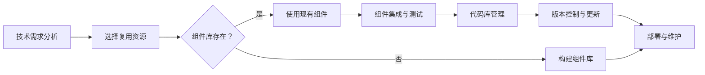

                 

### 技术复用的概念与重要性

**技术复用**，顾名思义，是指通过将已有的技术成果和经验在新的项目中重复使用，以提高开发效率和代码质量。它不仅仅是一个技术问题，更是一种文化、一种理念，是一种对资源和时间的尊重和利用。

首先，让我们明确技术复用的定义。技术复用包括代码复用和组件复用两个层面。代码复用是指在同一项目或不同项目中，重复使用已有的代码段或函数，避免重复编写相同或相似的功能。而组件复用则是在更高层面上，将已经开发好的功能模块或服务在不同的项目或系统间共享和重复使用。

**技术复用的意义**不可小觑。首先，它能够显著提高开发效率。通过复用已有的代码和组件，开发人员可以将更多时间投入到新功能的开发上，而不是重复劳动。其次，技术复用能够提升代码质量。经过多次使用和测试的代码通常更加稳定和可靠，而组件复用也能够使系统结构更加清晰，易于维护和扩展。

然而，技术复用并非没有挑战。现有的技术栈可能无法满足新项目的需求，组件间的兼容性问题也可能带来困扰。此外，技术复用需要一套完善的管理机制，包括版本控制、文档管理、质量保障等，否则很容易导致混乱和错误。

综上所述，技术复用是一项具有重大意义和潜在挑战的任务。在接下来的章节中，我们将深入探讨技术复用的具体策略和方法，帮助读者更好地理解和实践这一重要技术理念。

#### 技术复用的定义与核心要素

技术复用，作为一种提升开发效率和代码质量的重要策略，其定义涵盖了多个层面和维度。首先，从广义上讲，技术复用是指将已有的技术成果，包括代码、组件、设计模式、架构方案等，在不同项目或同一项目的不同阶段重复使用。这种重复使用不仅限于同一组织内部，还可以跨组织、跨行业进行。

在具体的实现层面，技术复用主要分为以下几类：

1. **代码复用**：指在同一项目或不同项目中重复使用已有的代码段或函数。这种复用可以通过函数调用、类继承等方式实现。代码复用是技术复用的基础，也是最为常见的形式。

2. **组件复用**：指将已经开发好的功能模块或服务在不同的项目或系统间共享和重复使用。组件复用通常涉及更高层次的抽象，如UI组件、业务组件、服务组件等。

3. **设计模式复用**：指在不同的项目中使用相同的设计模式，如单例模式、工厂模式、观察者模式等。设计模式复用能够提高代码的可读性和可维护性，减少代码冗余。

4. **架构方案复用**：指在多个项目中采用相同的架构方案，如微服务架构、分布式系统架构等。架构方案复用能够提高系统的可扩展性和可靠性。

**技术复用的核心要素**包括：

- **模块化**：将系统划分为多个模块，每个模块具有独立的职责和功能。模块化使得代码更易于管理和复用。

- **重构**：通过重构，将已有的代码进行改进和优化，提高其可读性和可维护性。重构是实现代码复用的重要手段。

- **信息隐藏**：通过封装和抽象，将实现细节隐藏起来，只暴露必要的接口和功能。信息隐藏能够减少模块间的耦合，提高代码的复用性。

- **接口设计**：良好的接口设计能够提高模块间的互操作性，降低依赖关系，从而实现更高效的代码复用。

通过以上定义和核心要素的介绍，我们可以看出，技术复用不仅仅是一种简单的重复使用，而是一种系统的、策略性的开发方法。在接下来的章节中，我们将进一步探讨代码复用的原则和设计模式，帮助读者深入理解技术复用的具体实践方法。

#### 技术复用的意义与价值

技术复用作为一种重要的开发策略，其意义和价值在多个方面得以体现。首先，技术复用能够显著提高开发效率。通过复用已有的代码和组件，开发人员可以避免重复编写相同或相似的功能，从而节省大量的时间和精力。这不仅加快了项目开发进度，也使得开发人员能够将更多的时间和精力投入到新的功能开发和优化上。

其次，技术复用能够提升代码质量。经过多次使用和测试的代码通常更加稳定和可靠，而组件复用也能够使系统结构更加清晰，易于维护和扩展。此外，良好的代码复用还能减少代码冗余，避免因重复编写导致的问题和错误，从而提高代码的整体质量和可维护性。

**技术复用在实际项目中的应用案例**也为上述观点提供了有力的支持。例如，在电商平台上，组件复用技术被广泛应用于前后端接口的开发。通过封装和复用常见的功能模块，如用户认证、订单处理等，开发人员能够快速搭建出功能完善的电商系统，极大地提高了开发效率和系统稳定性。

**某大型互联网公司的实践**也证明了技术复用的巨大价值。该公司在开发新项目时，通过复用已有的大数据分析和机器学习模型，不仅缩短了项目开发周期，还提高了数据分析的准确性和效率。此外，该公司还建立了完善的代码库和组件库，使得不同项目之间能够高效地共享和复用技术资源。

总之，技术复用不仅是一种提升开发效率和代码质量的有效策略，还在实际项目中展现了其巨大的应用价值和潜力。在接下来的章节中，我们将深入探讨代码复用的原则和设计模式，进一步揭示技术复用的具体实践方法。

### 技术复用的现状与挑战

技术复用虽然在理论上具有显著的优势，但在实际应用中仍面临诸多挑战和现状问题。首先，从技术环境的角度来看，当前的软件开发环境多样且不断演变。各种编程语言、框架和工具层出不穷，开发人员需要在众多选择中找到适合复用技术的环境。这种环境的不确定性增加了技术复用的复杂性和难度。

**主要挑战**包括：

1. **技术栈不兼容**：不同的项目可能使用不同的技术栈，导致代码和组件难以复用。例如，一个项目使用Java Spring框架，而另一个项目则可能采用Python Django框架，这种技术栈的不兼容使得代码复用变得困难。

2. **版本控制困难**：随着代码和组件的复用，版本控制变得更加复杂。如何管理不同项目的代码版本，确保每个版本的正确性和稳定性，是技术复用中的一个重要问题。

3. **测试与验证**：复用代码和组件后，需要对这些代码进行充分的测试和验证，以确保其在新的环境中仍然能够正常运行。这增加了测试的工作量和难度。

**现状**方面，尽管技术复用在实际项目中得到了广泛应用，但其普及程度和效果仍然不尽如人意。许多企业在技术复用方面存在以下问题：

1. **缺乏系统化的复用策略**：许多企业在技术复用方面缺乏明确的规划和系统化的策略，导致技术复用往往是零散和局部的，难以形成规模效应。

2. **工具和资源不足**：部分企业缺乏支持技术复用的工具和资源，如代码库、组件库、文档管理等，这使得技术复用变得困难。

3. **文化因素**：技术复用需要一种开放和共享的文化氛围，但在一些企业中，团队之间的合作和资源共享仍存在障碍，这限制了技术复用的效果。

**解决策略**：

1. **标准化与规范化**：建立统一的开发标准和规范，减少技术栈的不兼容问题，提高代码和组件的通用性。

2. **完善版本控制系统**：采用先进的版本控制系统，如Git，建立完善的代码库和组件库，确保版本管理和更新的便利性。

3. **强化测试与验证**：建立全面的测试体系，包括单元测试、集成测试和系统测试，确保复用代码和组件的质量和稳定性。

4. **培养共享文化**：在企业内部培养开放和共享的文化，鼓励团队合作和资源共享，为技术复用提供良好的环境。

综上所述，技术复用在当前环境中面临着诸多挑战，但通过采取一系列有效策略，这些问题是可以得到解决的。在下一章节中，我们将详细探讨代码复用的原则和设计模式，进一步推动技术复用的实践和发展。

### 代码复用的原则

代码复用作为技术复用的基础，其有效实施依赖于一系列核心原则。以下是代码复用的主要原则，以及它们在实际应用中的具体体现：

#### 单一职责原则（Single Responsibility Principle）

单一职责原则（SRP）由罗伯特·马丁（Robert C. Martin）提出，主张每个模块或函数应只负责一项功能。这一原则有助于提高代码的可读性和可维护性，因为专注于单一功能的模块或函数更易于理解和修改。

- **具体应用**：在一个电商项目中，可以将订单处理、用户认证和库存管理等功能分别封装在不同的模块中，每个模块只负责自身的业务逻辑，避免功能混杂导致代码复杂。

#### 开闭原则（Open/Closed Principle）

开闭原则强调软件实体（如类、模块、函数等）应对扩展开放，对修改关闭。这意味着软件实体应通过扩展而不是修改来实现功能的增加，确保在添加新功能时，不会影响已有的代码。

- **具体应用**：例如，在编写一个排序算法时，可以使用策略模式，通过创建不同的排序策略类来实现多种排序方式，而不需要修改原有的排序逻辑。

#### 里氏替换原则（Liskov Substitution Principle）

里氏替换原则（LSP）由巴里·贝克（Barry Boehm）提出，主张子类可以替换其父类出现在任何使用父类的地方而不改变程序的行为。这一原则保证了继承关系的合理性和子类的通用性。

- **具体应用**：在面向对象编程中，如果一个类是一个基类的子类，它应该能够无缝地替换基类，而不会破坏程序的运行。例如，一个“形状”基类可以有一个“绘制”方法，其子类如“圆形”和“矩形”都应该能够正确地实现该方法。

#### 依赖倒置原则（Dependency Inversion Principle）

依赖倒置原则（DIP）由罗伯特·马丁（Robert C. Martin）提出，主张高层模块不应依赖于低层模块，二者都应依赖于抽象。具体来说，抽象不应依赖于细节，细节应依赖于抽象。

- **具体应用**：在软件架构设计中，可以通过接口定义抽象，具体实现类依赖接口，从而实现解耦。例如，在数据库操作中，数据库的具体实现类应依赖数据库操作的接口，而不是直接依赖于具体的数据库类型。

这些原则在实际代码复用中具有指导意义，可以帮助开发人员编写更加模块化和可维护的代码。接下来，我们将详细探讨设计模式在代码复用中的应用，进一步阐述如何通过模式提高代码的可复用性。

### 设计模式在代码复用中的应用

设计模式是解决常见软件工程问题的经验总结，它们不仅能够提高代码的可读性和可维护性，还能显著提升代码的复用性。以下是一些常用的设计模式，以及它们在代码复用中的应用：

#### 单例模式（Singleton）

单例模式确保一个类仅有一个实例，并提供一个全局访问点。在代码复用中，单例模式常用于管理那些需要唯一实例的资源和对象，如数据库连接、配置管理器等。

- **伪代码**：
  ```pseudocode
  class Singleton {
      private static instance: Singleton
      private constructor()

      public static getInstance(): Singleton {
          if (instance == null) {
              instance = new Singleton()
          }
          return instance
      }
  }
  ```

- **应用场景**：例如，在一个电商系统中，数据库连接对象需要保证全局唯一，以便所有模块都能访问同一数据库实例，避免资源浪费和并发问题。

#### 工厂模式（Factory Method）

工厂模式定义了一个创建对象的接口，但将具体的对象创建委托给子类。通过这种方法，可以实现对象的创建与使用分离，提高代码的复用性。

- **伪代码**：
  ```pseudocode
  interface Creator {
      create(): Product
  }

  class ConcreteCreatorA implements Creator {
      create(): Product {
          return new ConcreteProductA()
      }
  }

  class ConcreteCreatorB implements Creator {
      create(): Product {
          return new ConcreteProductB()
      }
  }
  ```

- **应用场景**：例如，在不同的业务场景中创建不同的产品对象，通过工厂模式，开发者可以方便地切换具体的产品类，而无需修改客户端代码。

#### 适配器模式（Adapter）

适配器模式将一个类的接口转换为另一个客户端期望的接口，使得原本由于接口不兼容而无法在一起工作的类可以协同工作。

- **伪代码**：
  ```pseudocode
  interface Target {
      request()
  }

  class Adaptee {
      specificRequest()
  }

  class Adapter implements Target {
      private adaptee: Adaptee

      constructor(adaptee: Adaptee) {
          this.adaptee = adaptee
      }

      request() {
          adaptee.specificRequest()
      }
  }
  ```

- **应用场景**：例如，将旧系统的接口适配到新系统中，使得新旧系统可以无缝集成。

#### 观察者模式（Observer）

观察者模式定义了一种一对多的依赖关系，使得当一个对象的状态发生改变时，所有依赖于它的对象都会得到通知并自动更新。

- **伪代码**：
  ```pseudocode
  interface Observer {
      update()
  }

  class Subject {
      private observers: Observer[]
      addObserver(observer: Observer) {
          observers.push(observer)
      }

      removeObserver(observer: Observer) {
          observers.remove(observer)
      }

      notifyObservers() {
          for (observer in observers) {
              observer.update()
          }
      }
  }
  ```

- **应用场景**：例如，在一个天气应用中，当天气数据更新时，所有订阅天气信息的界面都会自动更新，确保用户界面实时反映最新的天气情况。

#### 装饰者模式（Decorator）

装饰者模式动态地给一个对象添加一些额外的职责，而不改变其接口。通过使用不同的装饰者，可以扩展对象的行为。

- **伪代码**：
  ```pseudocode
  interface Component {
      operation()
  }

  class Decorator implements Component {
      private component: Component

      constructor(component: Component) {
          this.component = component
      }

      operation() {
          component.operation()
          // 增加额外的职责
      }
  }
  ```

- **应用场景**：例如，在编写一个日志系统时，可以使用装饰者模式为日志添加额外的功能，如日志级别过滤、格式化输出等。

这些设计模式在代码复用中的应用，使得开发者能够编写更加灵活、可扩展和可维护的代码。通过合理地使用这些模式，可以显著提高代码的复用性和系统的整体质量。在下一章节中，我们将探讨代码库管理的重要性及其最佳实践。

### 代码库管理

代码库管理是确保代码复用成功的关键环节，它涉及到代码库的类型选择、版本控制和维护与升级等多个方面。有效的代码库管理不仅能提高开发效率，还能确保代码质量和系统的稳定性。

#### 代码库的类型与选择

在开始代码库管理之前，首先需要明确代码库的类型。常见的代码库类型主要包括：

1. **中央代码库（Central Repository）**：
   中央代码库是将所有代码集中存储在一个位置，适用于小规模团队或项目。中央代码库的优点是管理简单，所有团队成员都能快速访问最新的代码。然而，它也存在一些缺点，如容易造成版本冲突和合并困难，尤其是在团队规模较大时。

2. **分布式代码库（Distributed Repository）**：
   分布式代码库允许多个团队成员各自维护自己的代码库，然后将它们合并到一个中央代码库。这种模式适用于大规模团队或项目，因为它能够提高并发开发效率，减少版本冲突。常见的分布式版本控制系统如Git，支持高效的分支和合并操作。

选择代码库类型时，需要考虑团队规模、项目复杂度、开发流程和协作模式等因素。一般来说，对于小规模团队和简单项目，中央代码库是一个不错的选择；对于大规模团队和复杂项目，分布式代码库能够提供更好的支持。

#### 版本控制

版本控制是代码库管理的重要组成部分，它确保代码的历史记录可追溯，同时避免不同版本之间的冲突。以下是几个关键的版本控制概念和策略：

1. **Git的基本操作**：
   Git是目前最流行的分布式版本控制系统。以下是一些基本的Git操作：

   - **初始化代码库**：
     ```bash
     git init
     ```
   - **添加文件**：
     ```bash
     git add <file>
     ```
   - **提交更改**：
     ```bash
     git commit -m "Commit message"
     ```
   - **推送代码**：
     ```bash
     git push origin main
     ```
   - **拉取代码**：
     ```bash
     git pull origin main
     ```

2. **分支策略**：
   分支策略是管理代码库变更的重要手段。常见的分支策略包括：

   - **Git Flow**：Git Flow是一种流行的分支模型，用于管理产品的迭代。它包括以下几个分支：
     - **master/main**：主分支，包含最新的生产代码。
     - **develop**：开发分支，用于合并功能分支。
     - **feature**：功能分支，用于开发新的功能。
     - **bugfix**：修复分支，用于修复bug。
     - **release**：发布分支，用于准备新版本的代码。
     - **hotfix**：紧急修复分支，用于修复生产环境中的严重bug。

   - **GitHub Flow**：GitHub Flow是一种更简单的分支模型，适用于小型项目或团队。主要分支是**master/main**，功能分支由开发人员创建，完成后直接合并到主分支。

3. **协同工作**：
   版本控制和分支策略协同工作，确保团队成员之间的协作顺畅。以下是一些协同工作的最佳实践：

   - **代码审查**：在合并代码之前进行代码审查，确保代码质量和一致性。
   - **定期同步**：团队成员应定期拉取和推送代码，保持本地代码库与远程代码库同步。
   - **明确分支命名规范**：使用统一的分支命名规范，便于管理和查找。

#### 维护与升级

代码库的维护与升级是确保代码库长期稳定和可用的关键。以下是几个关键点：

1. **代码库维护**：
   - **代码质量检查**：定期运行代码质量检查工具，如静态代码分析工具，确保代码质量。
   - **文档更新**：保持代码库文档的同步更新，包括API文档、README和开发指南等。
   - **安全性**：定期检查代码库的安全性，修补已知的安全漏洞。

2. **代码库升级**：
   - **兼容性测试**：在升级代码库时，确保所有依赖的库和工具都支持新的版本。
   - **回滚策略**：制定回滚策略，以便在升级失败时能够迅速恢复到之前的稳定版本。

通过合理的代码库管理，开发团队能够更好地实现代码复用，提高开发效率和代码质量。在下一章节中，我们将探讨组件化开发及其在代码复用中的应用。

### 组件化开发

组件化开发是现代软件工程中的一个重要理念，其核心理念是将应用程序划分为多个独立的组件，每个组件负责一个特定的功能模块。这种开发模式不仅提高了代码的可维护性和可复用性，还极大地提升了开发效率和系统灵活性。

#### 组件定义与分类

**组件**是指具有独立功能、可重用且能够相互协作的软件模块。组件可以是一个简单的函数、类，也可以是一个复杂的系统模块，如Web服务、数据库接口等。组件化开发的关键在于确保组件的独立性、通用性和互操作性。

根据组件的功能和用途，组件可以分为以下几类：

1. **功能组件**：这类组件负责实现具体的功能模块，如用户身份验证、数据存储、数据处理等。功能组件通常是应用的核心部分，具有高度的独立性和可复用性。

2. **UI组件**：UI组件主要负责用户界面展示，如按钮、表单、菜单等。UI组件通常与功能组件紧密配合，为用户提供直观的操作界面。

3. **服务组件**：服务组件提供系统级服务，如日志记录、消息队列、缓存管理等。这些组件为应用提供基础服务支持，确保系统的稳定性和高效性。

4. **数据组件**：数据组件主要负责数据的处理和存储，如数据库访问层、数据持久化层等。数据组件通常与功能组件和服务组件紧密集成，确保数据的完整性和一致性。

#### 组件开发最佳实践

为了实现组件化开发的高效和可复用性，以下是一些最佳实践：

1. **高内聚、低耦合**：每个组件应具有高内聚性，即组件内部功能紧密相关；同时保持低耦合性，即组件之间的依赖关系尽可能简单和松散。这样可以确保组件的独立性，方便替换和扩展。

2. **标准化接口设计**：组件之间的交互应通过标准化接口进行，避免直接依赖组件的实现细节。接口设计应遵循简洁、一致的原则，确保组件之间能够无缝协作。

3. **模块化开发**：将大型组件分解为多个小型组件，每个组件负责一个简单的功能。这样可以提高代码的可读性和可维护性，也便于并行开发和测试。

4. **测试驱动开发（TDD）**：在组件开发过程中，应采用测试驱动开发方法，先编写测试用例，然后实现满足测试用例的功能。这样可以确保组件的质量和稳定性，减少后续的维护成本。

5. **文档化和注释**：为每个组件编写详细的文档和注释，包括组件的功能描述、接口说明、使用方法等。这样有助于其他开发者理解和复用组件。

#### 组件接口设计

组件接口设计是组件化开发中的关键环节，良好的接口设计能够提高组件的互操作性和可复用性。以下是组件接口设计的一些基本原则：

1. **明确职责**：接口应明确组件的职责和功能，避免功能混淆和过度设计。

2. **简洁性**：接口应尽量简洁，避免复杂的参数和冗余的接口方法。简洁的接口更易于理解和维护。

3. **单一职责**：接口应遵循单一职责原则，每个接口方法只负责一项功能，避免功能混杂。

4. **一致性和稳定性**：接口应保持一致性和稳定性，避免频繁变更导致其他组件的依赖关系失效。

5. **可扩展性**：接口设计应具备一定的可扩展性，以便在未来可以方便地增加新的功能或修改现有功能。

通过遵循以上最佳实践和接口设计原则，开发团队可以有效地实现组件化开发，提高代码的可复用性和系统的灵活性。

#### 组件库管理

组件库管理是确保组件复用成功的关键环节，它涉及到组件库的建设与维护、组件库的搜索与使用，以及组件库的版本控制等多个方面。通过有效的组件库管理，开发团队可以方便地共享和复用组件，提高开发效率和代码质量。

**组件库的建设与维护**

1. **确定组件库类型**：组件库可以分为中央组件库和分布式组件库。中央组件库适用于小规模团队或项目，而分布式组件库适用于大规模团队或项目。选择合适的组件库类型有助于提高组件管理的效率。

2. **标准化组件规范**：为了保证组件的通用性和可复用性，需要制定一套组件开发规范，包括组件的命名规范、接口设计规范、代码风格规范等。规范化的组件开发能够提高组件的可维护性和一致性。

3. **建立组件库架构**：组件库的架构应支持组件的模块化、独立性和高内聚性。常用的架构模式包括分层架构、事件驱动架构和微服务架构等。合理的架构设计有助于组件库的高效管理和维护。

4. **自动化构建和测试**：通过自动化工具（如Jenkins、GitLab CI/CD等）实现组件的自动化构建和测试，确保组件的质量和稳定性。自动化流程可以显著减少人为错误，提高组件交付效率。

**组件库的搜索与使用**

1. **组件搜索机制**：组件库应具备完善的搜索功能，支持根据组件名称、功能描述、标签等多维度进行搜索。通过提供高效的搜索机制，开发人员可以快速找到所需的组件，提高开发效率。

2. **组件文档和示例**：为每个组件提供详细的文档和示例代码，包括组件的功能描述、接口说明、使用方法等。文档和示例有助于开发人员更好地理解和复用组件。

3. **组件集成和测试**：在组件库中提供集成测试工具和测试环境，确保组件在新的项目中能够顺利集成和运行。通过集成测试，可以提前发现和解决组件兼容性问题。

**组件库的版本控制**

1. **版本控制策略**：采用先进的版本控制工具（如Git）对组件库进行版本控制，确保组件的历史记录可追溯。常用的版本控制策略包括Git Flow和GitHub Flow等。

2. **组件升级与回滚**：定期对组件库进行升级，修复已知问题和漏洞，增加新功能。在升级过程中，需要制定回滚策略，以便在升级失败时能够迅速恢复到上一个稳定版本。

3. **组件依赖管理**：使用依赖管理工具（如Maven、Gradle等）管理组件之间的依赖关系，确保组件的依赖关系清晰和稳定。通过依赖管理工具，可以自动化处理组件的下载、安装和配置。

通过建立和维护完善的组件库，开发团队可以方便地共享和复用组件，提高开发效率和代码质量。在组件库管理中，标准化、自动化和版本控制是关键，它们共同构成了组件库管理的基本框架。

### 组件集成与互操作

组件集成与互操作是确保系统中各组件能够无缝协作、实现业务功能的关键。在这一部分，我们将探讨常见的组件集成框架，如微服务架构、RESTful API设计以及MQTT消息队列，以及这些框架下的组件间通信与协作方法。

#### 组件集成框架

1. **微服务架构**：

   微服务架构是一种将大型应用程序拆分为多个独立服务的方法，每个服务负责一个具体的业务功能。这种架构模式具有高扩展性、高可用性和高可维护性。以下是微服务架构的优势：

   - **高内聚、低耦合**：每个微服务具有独立的功能和数据库，服务间通过轻量级的通信协议（如HTTP/HTTPS）进行交互。
   - **部署和扩展灵活**：每个微服务可以独立部署和扩展，不需要重新部署整个系统，提高了系统的灵活性。
   - **故障隔离**：单个微服务的故障不会影响整个系统的运行，便于故障定位和修复。

   在微服务架构中，组件间的通信通常通过RESTful API或消息队列实现。RESTful API提供了简单的接口，便于跨服务调用，而消息队列则适用于异步通信和大规模分布式系统。

2. **RESTful API设计**：

   RESTful API是一种基于HTTP协议的接口设计规范，用于组件间的数据交换和通信。以下是RESTful API设计的关键点：

   - **URL设计**：URL应简洁、清晰，能够明确表示资源（如`/users`表示用户资源）和操作（如`/users/{id}`表示获取特定用户的操作）。
   - **HTTP方法**：使用不同的HTTP方法（GET、POST、PUT、DELETE等）表示不同的操作，确保接口的一致性和易用性。
   - **状态码**：使用HTTP状态码（如200表示成功、400表示请求错误、500表示服务器错误）明确表示请求的处理结果。
   - **数据格式**：使用JSON或XML等数据格式传输数据，确保数据的一致性和可读性。

3. **MQTT消息队列**：

   MQTT（Message Queuing Telemetry Transport）是一种轻量级的消息传输协议，适用于物联网（IoT）和实时通信场景。以下是MQTT的特点：

   - **轻量级**：MQTT协议传输数据格式简单，适用于带宽有限的环境。
   - **双向通信**：MQTT支持客户端与服务器之间的双向通信，使得设备能够实时接收和发送消息。
   - **可靠传输**：MQTT提供消息确认机制，确保消息的可靠传输和顺序处理。

   在MQTT消息队列中，组件间的通信通常通过发布/订阅模型实现。组件作为发布者，发布特定主题的消息；其他组件作为订阅者，订阅特定主题的消息，从而实现消息的广播和订阅。

#### 组件间的通信与协作

1. **事件驱动模型**：

   事件驱动模型是一种基于事件的组件通信方法，组件通过监听和触发事件进行协作。以下是事件驱动模型的关键点：

   - **事件监听**：组件注册监听器，监听特定类型的事件。
   - **事件触发**：当事件发生时，组件触发事件并通知其他组件。
   - **事件处理**：其他组件接收到事件通知后，根据事件的类型进行相应的处理。

   事件驱动模型适用于实时性和响应速度要求较高的场景，如实时数据监控和报警系统。

2. **发布/订阅模型**：

   发布/订阅模型是一种基于消息的组件通信方法，组件通过发布和订阅消息进行协作。以下是发布/订阅模型的关键点：

   - **发布者**：组件作为发布者，发布特定主题的消息。
   - **订阅者**：组件作为订阅者，订阅特定主题的消息。
   - **消息队列**：消息队列负责存储和转发消息，确保消息的可靠传输。

   发布/订阅模型适用于需要广泛分布和广播消息的场景，如分布式系统中的状态同步和事件通知。

3. **接口调用模型**：

   接口调用模型是一种基于接口的组件通信方法，组件通过调用接口的方法进行协作。以下是接口调用模型的关键点：

   - **接口定义**：组件定义接口，明确接口的方法和参数。
   - **接口实现**：组件实现接口的方法，提供具体的功能实现。
   - **接口调用**：组件通过调用接口的方法，与其他组件进行交互。

   接口调用模型适用于需要严格定义交互协议和接口规范的场景，如服务化架构中的服务调用。

通过合理选择和设计组件集成框架，以及有效的组件间通信与协作方法，可以确保系统中的组件能够高效、稳定地协作，实现复杂的业务功能。

### 技术复用在企业中的应用案例

技术复用在实际企业中得到了广泛的应用，通过有效的技术复用，企业不仅提高了开发效率，还增强了系统的稳定性与灵活性。以下将介绍几个具有代表性的企业应用案例，并详细分析这些案例中的技术复用实践。

#### 某大型电商平台的代码复用实践

某大型电商平台在其发展过程中，通过代码复用显著提升了开发效率与系统质量。以下是该平台的几个关键复用实践：

1. **通用模块库**：

   该平台建立了多个通用模块库，包括用户身份验证、订单处理、库存管理、支付处理等。这些模块经过多次测试和优化，具有较高的稳定性和可靠性。在新的功能开发中，开发人员可以直接调用这些通用模块，避免了重复编码，提高了开发效率。

   **具体实践**：
   - **用户身份验证**：平台使用统一的用户身份验证模块，无论哪个功能模块需要用户认证，都可以直接调用该模块，实现用户登录、权限校验等功能。
   - **订单处理**：平台在多个业务场景中使用统一的订单处理模块，简化了订单创建、支付、发货等流程，提高了订单处理的效率。

2. **服务化架构**：

   平台采用服务化架构，将不同的业务功能划分为多个独立的服务，如商品服务、购物车服务、支付服务、物流服务等。每个服务负责一个特定的业务功能，通过RESTful API进行通信。这种服务化架构使得不同服务可以独立开发、部署和扩展，大大提高了系统的灵活性和可维护性。

   **具体实践**：
   - **商品服务**：负责商品信息的存储、查询和更新，提供统一的商品接口供其他服务调用。
   - **购物车服务**：负责购物车信息的存储、查询和更新，确保用户购物车的数据一致性。

3. **代码质量保障**：

   平台建立了严格的代码质量保障机制，包括代码审查、自动化测试和持续集成。通过代码审查，确保代码符合规范和标准；通过自动化测试，及时发现和修复潜在问题；通过持续集成，确保代码的稳定性和可靠性。

   **具体实践**：
   - **代码审查**：每个功能模块在上线前都需要经过代码审查，确保代码的质量和一致性。
   - **自动化测试**：平台采用自动化测试工具（如Selenium、JUnit等）对关键功能模块进行自动化测试，确保功能的正确性和稳定性。
   - **持续集成**：使用Jenkins等工具实现持续集成，自动化构建和部署代码，确保代码的持续性和稳定性。

#### 某互联网公司的组件复用实践

某互联网公司通过组件复用，成功实现了多个项目的快速开发和部署。以下是该公司的几个关键复用实践：

1. **组件库建设**：

   该公司建立了完善的组件库，包括前端UI组件、后端业务组件、数据库访问组件等。组件库中的组件经过严格的质量控制和性能优化，适用于多个业务场景。

   **具体实践**：
   - **前端UI组件**：公司开发了一系列前端UI组件，如按钮、表单、弹窗等，这些组件经过UI设计师的优化，符合用户的使用习惯和审美要求。
   - **后端业务组件**：公司开发了多个后端业务组件，如用户认证、权限控制、数据缓存等，这些组件提供了统一的接口和实现，方便其他项目调用。

2. **服务化架构**：

   该公司采用服务化架构，将不同功能模块划分为多个独立的服务，通过微服务架构实现服务的解耦和分布式部署。每个服务都有明确的职责和接口，可以独立开发和部署，提高了系统的灵活性和可扩展性。

   **具体实践**：
   - **用户服务**：负责用户的注册、登录、权限管理等功能，提供统一的用户接口。
   - **支付服务**：负责处理支付请求，确保支付流程的准确性和安全性。

3. **自动化测试**：

   该公司建立了全面的自动化测试体系，包括单元测试、集成测试、性能测试等。通过自动化测试，确保组件和服务的质量和稳定性。

   **具体实践**：
   - **单元测试**：对每个组件进行单元测试，确保组件的功能正确性和代码质量。
   - **集成测试**：对组件和服务进行集成测试，确保它们之间的交互符合预期。
   - **性能测试**：对关键服务进行性能测试，确保在高并发情况下系统能够稳定运行。

#### 某传统企业的数字化转型案例

某传统企业在数字化转型过程中，通过技术复用实现了业务流程的优化和系统的升级。

1. **业务流程优化**：

   通过技术复用，该企业对传统的业务流程进行了优化，实现了业务流程的自动化和智能化。例如，使用流程引擎组件，将业务流程建模为一系列步骤和规则，提高了业务流程的处理效率和准确性。

   **具体实践**：
   - **订单处理流程**：使用流程引擎组件，实现了订单从创建到交付的全程自动化处理，减少了人为干预和错误。
   - **库存管理流程**：通过库存管理组件，实现了库存的自动化监控和管理，提高了库存利用率。

2. **组件复用**：

   该企业建立了组件库，将通用的业务组件和数据处理组件进行标准化和模块化。这些组件可以跨项目、跨系统复用，提高了系统的可维护性和扩展性。

   **具体实践**：
   - **数据采集组件**：企业开发了一系列数据采集组件，用于从各个业务系统采集数据，并统一存储在数据仓库中。
   - **报表生成组件**：企业开发了报表生成组件，可以快速生成各种报表，提供数据分析和决策支持。

3. **大数据分析**：

   通过技术复用，该企业实现了大数据分析平台的建设，将已有的数据分析模型和算法进行复用，提高了数据分析的效率和准确性。

   **具体实践**：
   - **用户行为分析**：通过用户行为分析组件，实时监控用户的行为数据，提供个性化推荐和营销策略。
   - **业务预测**：通过业务预测组件，利用历史数据预测未来的业务趋势，为决策提供支持。

综上所述，技术复用在实际企业中的应用，不仅提高了开发效率和系统质量，还优化了业务流程，增强了企业的竞争力。在下一章节中，我们将总结技术复用的经验与教训，并探讨技术复用成功的关键因素。

### 技术复用的经验与教训

在技术复用的实际应用中，无论是成功案例还是失败教训，都为我们提供了宝贵的经验。以下是一些常见的问题、成功的关键因素以及技术复用失败的原因分析。

#### 常见问题

1. **组件不兼容**：不同项目或系统可能采用不同的技术栈，导致组件难以兼容。这需要开发者提前进行技术栈的统一规划，确保组件的通用性和兼容性。

2. **测试不足**：复用组件时，往往忽视了在新的环境中对组件进行充分的测试，导致在集成过程中出现问题。全面的测试策略和自动化测试工具是确保组件稳定性的关键。

3. **文档不完善**：组件文档的不完善使得其他开发者难以理解和使用这些组件，影响了组件的复用效果。完善的文档应该包括组件的功能描述、接口说明、使用方法等。

4. **版本管理混乱**：版本管理不善会导致组件更新时出现冲突，影响项目的稳定性。采用先进的版本控制系统，如Git，并制定明确的版本管理策略，是解决这一问题的有效方法。

#### 成功的关键因素

1. **标准化与规范化**：建立统一的开发标准和规范，确保组件的设计、编码和测试都遵循相同的标准，从而提高组件的可复用性。

2. **全面的测试**：通过全面的测试策略，包括单元测试、集成测试和性能测试，确保组件在新的环境中能够正常运行。

3. **完善的文档**：编写详细的组件文档，包括功能描述、接口定义、使用示例等，帮助其他开发者快速理解和复用组件。

4. **代码库和组件库的管理**：建立高效的代码库和组件库管理系统，确保组件的版本控制、更新和维护有序进行。

5. **团队合作与沟通**：在复用组件时，团队成员之间的紧密合作和有效沟通至关重要。良好的团队合作能够减少误解和冲突，提高组件复用的效率。

#### 失败的原因分析

1. **缺乏统一的规划和设计**：没有明确的复用规划和设计，导致组件之间缺乏一致性，难以兼容和复用。

2. **忽视组件的质量和稳定性**：为了快速开发，开发者可能忽视组件的质量和稳定性，导致组件在复用过程中出现问题。

3. **过度依赖特定框架或技术**：过度依赖特定的框架或技术，使得组件难以在不同环境中复用。

4. **版本控制不善**：版本控制不善会导致组件的更新和回滚变得复杂和困难，影响项目的稳定性。

5. **缺乏有效的文档和培训**：缺乏详细的组件文档和使用培训，使得其他开发者难以理解和复用组件。

通过总结这些经验和教训，我们可以更好地理解和实践技术复用，提高代码和组件的复用率，从而提升开发效率和系统质量。

### 技术复用的未来展望与趋势

技术复用作为一种提升开发效率和代码质量的有效策略，其发展前景广阔，未来将呈现以下几大趋势：

#### 自动化与智能化

随着人工智能和自动化技术的发展，技术复用将越来越自动化和智能化。通过使用智能工具和分析算法，系统可以自动识别和推荐可复用的代码和组件，减少人工干预，提高复用效率。例如，智能代码搜索和推荐系统可以根据项目需求自动找到合适的代码库和组件，降低开发人员的搜索和匹配成本。

#### 开源与闭源的平衡

开源技术和闭源技术的结合将成为未来技术复用的一个重要趋势。虽然开源技术具有共享和开放的优点，但某些关键业务逻辑和敏感数据可能需要闭源保护。因此，企业将在开源和闭源之间找到平衡点，合理利用开源组件和框架，同时保护核心业务逻辑和数据安全。

#### 多元化的复用技术

未来的技术复用将不仅仅局限于代码和组件的复用，还将扩展到更广泛的领域，如架构、算法、数据模型等。多元化的复用技术将提供更全面的支持，使开发者在各个层面都能轻松实现复用。例如，设计模式复用和架构模板库等，将帮助开发者快速构建高质量的系统。

#### 跨平台与跨领域复用

随着云计算、物联网和区块链等技术的发展，技术复用将跨越不同的平台和领域。例如，开发者可以在Web、移动、物联网等多个平台上复用相同的代码和组件，实现跨平台开发。同时，技术复用也将扩展到不同的行业领域，如金融、医疗、教育等，提供行业特定的复用解决方案。

#### 社区和生态建设

技术复用的发展离不开良好的社区和生态支持。未来，技术复用将更加依赖于开放的社区和生态系统的建设，通过共享经验、知识和工具，促进技术复用的普及和应用。企业和开发者可以通过社区交流和合作，共同推动技术复用的进步。

### 对企业的影响

#### 提升开发效率

技术复用可以显著提高开发效率。通过复用已有的代码和组件，开发人员可以将更多时间投入到新功能的开发上，减少重复劳动，缩短项目开发周期。

#### 优化业务流程

技术复用有助于优化业务流程，通过复用标准化的组件和接口，企业可以快速搭建新的业务系统，实现业务流程的自动化和智能化，提高业务处理效率。

#### 增强竞争力

技术复用可以帮助企业快速响应市场需求，灵活调整和扩展业务系统，提高产品的竞争力。同时，通过技术复用，企业可以降低开发成本，提升产品质量，进一步增强市场竞争力。

综上所述，技术复用在未来的发展中将呈现出自动化、智能化、多元化、跨平台和跨领域等特点，对企业产生深远的影响。通过积极拥抱和实施技术复用，企业将能够更好地应对市场变化，提高开发效率和竞争力，实现持续创新和可持续发展。

### 附录

#### 附录A：技术复用相关资源与工具

**1. 资源链接**

- [技术复用指南](https://www.example.com/tech-reuse-guide)
- [设计模式教程](https://www.example.com/design-patterns-tutorial)
- [代码库和组件库的最佳实践](https://www.example.com/repository-best-practices)

**2. 开源工具推荐**

- **Git**：[官方文档](https://git-scm.com/docs)
- **Maven**：[官方文档](https://maven.apache.org/guides/introduction/introduction-to-the-maven-project.html)
- **Gradle**：[官方文档](https://docs.gradle.org/current/userguide/)
- **JUnit**：[官方文档](https://junit.org/junit5/docs/current/user-guide/)
- **Selenium**：[官方文档](https://www.selenium.dev/documentation/)

**3. 技术社区与论坛**

- **Stack Overflow**：[技术问答社区](https://stackoverflow.com/)
- **GitHub**：[代码托管与协作平台](https://github.com/)
- **Reddit**：[技术讨论论坛](https://www.reddit.com/r/programming/)
- **CSDN**：[中国开发者社区](https://www.csdn.net/)

通过这些资源和工具，开发者可以更好地理解和实践技术复用，提升代码和组件的复用率，从而提高开发效率和系统质量。

#### 附录B：技术复用流程图

以下是技术复用流程的Mermaid流程图：



**详细解释**：

1. **技术需求分析**：首先，进行技术需求分析，明确项目需求，识别可以复用的资源和组件。

2. **选择复用资源**：根据需求分析结果，选择适合的复用资源，如代码库、组件库等。

3. **组件库存在与否判断**：检查组件库中是否存在满足需求的组件。

4. **构建组件库**：如果组件库中不存在合适的组件，则构建新的组件库。

5. **使用现有组件**：如果组件库中存在合适的组件，则直接使用现有组件。

6. **组件集成与测试**：将选定的组件集成到项目中，并进行充分的测试，确保组件的稳定性和功能性。

7. **代码库管理**：对代码库进行管理，确保代码的版本控制和更新。

8. **版本控制与更新**：定期更新组件库和代码库，确保其与项目需求保持一致。

9. **部署与维护**：将经过测试的组件和代码库部署到生产环境，并进行持续的维护和更新。

通过这个流程图，开发者可以系统地实施技术复用，确保复用资源的有效利用和系统的稳定运行。

