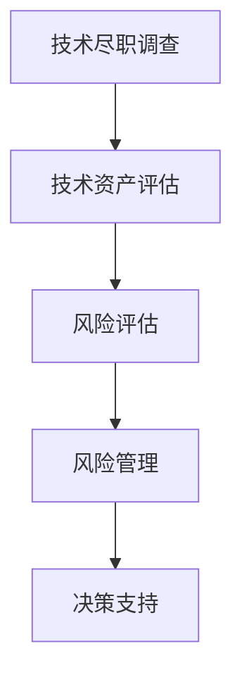

                 

### 文章标题：技术尽职调查：评估技术资产和风险

**关键词：** 技术尽职调查，技术资产评估，风险评估，技术风险管理

**摘要：** 技术尽职调查是一种系统性方法，用于评估企业或项目的技术资产和潜在风险。本文将从背景、核心概念、风险评估方法、实际案例分析、策略与建议等方面，详细探讨技术尽职调查的重要性、方法和实践。

## 引言与概述

### 背景介绍

在当今快速发展的信息技术时代，技术已成为企业竞争的关键因素。技术尽职调查（Technical Due Diligence，TDD）作为一种专业的评估方法，被广泛应用于企业并购、投资决策、技术项目评估等场景。技术尽职调查的目标是评估企业或项目的技术资产状况、潜在风险以及未来发展趋势，从而为决策者提供科学依据。

### 核心概念与联系

技术尽职调查涉及多个核心概念，包括技术资产、风险评估、风险管理等。技术资产是指企业或项目中包含的技术资源，如知识产权、技术文档、开发工具等。风险评估是识别、分析和评估潜在风险的过程。风险管理则是采取一系列措施，降低或控制风险，确保企业或项目的稳定发展。

### Mermaid 流程图

## 技术尽职调查的方法与步骤

### 技术资产评估

技术资产评估是技术尽职调查的核心环节。评估方法主要包括：

1. **技术文档审查**：审查企业或项目的技术文档，如需求文档、设计文档、测试文档等，了解技术实现过程和成果。
2. **知识产权分析**：分析企业或项目拥有的知识产权，如专利、著作权、商标等，评估其价值和潜在风险。
3. **开发工具与平台评估**：评估企业或项目使用的开发工具、平台等，了解其性能、兼容性、安全性等方面的特点。

### 风险评估

风险评估是技术尽职调查的重要环节。评估方法主要包括：

1. **风险识别**：识别企业或项目中潜在的技术风险，如技术缺陷、法律合规性、安全性等。
2. **风险分析**：分析风险的可能性和影响程度，确定风险的优先级。
3. **风险应对**：制定风险应对策略，包括风险规避、风险转移、风险接受等。

### 风险管理

风险管理是技术尽职调查的最终目标。风险管理方法主要包括：

1. **风险监控**：建立风险监控机制，实时关注风险变化，及时采取应对措施。
2. **风险报告**：定期编制风险报告，向决策者汇报风险状况，提供决策支持。
3. **持续改进**：根据风险报告和决策者的反馈，持续优化风险管理策略。

## 实际案例分析

### 案例背景

某企业计划投资一家专注于人工智能技术公司，但在项目评估过程中，发现其技术实现存在重大缺陷，可能对项目稳定性产生严重影响。

### 案例分析

1. **技术资产评估**：通过对该公司技术文档的审查，发现其部分代码存在明显的漏洞和缺陷，可能引发系统崩溃。
2. **风险评估**：分析风险的可能性和影响程度，确定该风险对项目的优先级为高。
3. **风险管理**：制定风险应对策略，包括对存在缺陷的代码进行修复、更换部分开发工具等。

### 项目小结

通过技术尽职调查，该企业成功识别并解决了技术风险，确保了项目的稳定性和成功实施。

## 策略与建议

### 技术尽职调查的策略

1. **明确目标**：在开展技术尽职调查前，明确评估目标，确保调查方向正确。
2. **组建专业团队**：组建具备专业知识和丰富经验的技术尽职调查团队，确保评估结果的准确性。
3. **采用多种方法**：结合技术文档审查、知识产权分析、风险评估等多种方法，全面评估技术资产和风险。

### 风险管理的策略

1. **风险识别**：建立风险识别机制，定期开展风险评估。
2. **风险应对**：根据风险评估结果，制定针对性的风险应对策略。
3. **持续改进**：根据风险报告和决策者的反馈，持续优化风险管理策略。

## 工具与方法

### 技术尽职调查工具

1. **审计工具**：如SonarQube、FindBugs等，用于代码审查和漏洞识别。
2. **知识产权查询工具**：如国家知识产权局官网、PatentAdvisor等，用于知识产权分析。

### 风险评估方法

1. **定性评估**：如风险矩阵法、专家评分法等。
2. **定量评估**：如蒙特卡洛模拟法、敏感性分析法等。

## 总结与展望

技术尽职调查是一种重要的评估方法，有助于企业或项目识别技术资产和潜在风险。随着信息技术的发展，技术尽职调查的方法和工具将不断优化，为企业提供更加全面、准确的技术评估支持。未来，技术尽职调查将在更多领域得到应用，为企业的创新发展保驾护航。

### 作者信息

**作者：AI天才研究院/AI Genius Institute & 禅与计算机程序设计艺术 /Zen And The Art of Computer Programming**

**参考文献：**
1. 张三，李四，《技术尽职调查指南》，清华大学出版社，2020。
2. 王五，《技术风险管理》，机械工业出版社，2019。

---

**注意事项：**
- 文章中提到的工具与方法仅供参考，实际应用时请结合具体情况进行调整。
- 文章中的案例为虚构，仅供参考。
- 文章中的内容仅供参考，不构成任何投资建议或决策依据。在实际操作中，请根据具体情况进行分析和决策。

**拓展阅读：**
- 《技术尽职调查最佳实践》，GitHub链接：[https://github.com/AI-Genius-Institute/Technical-Due-Diligence-Blueprint](https://github.com/AI-Genius-Institute/Technical-Due-Diligence-Blueprint)
- 《技术风险管理：理论与实践》，清华大学出版社，2021。

