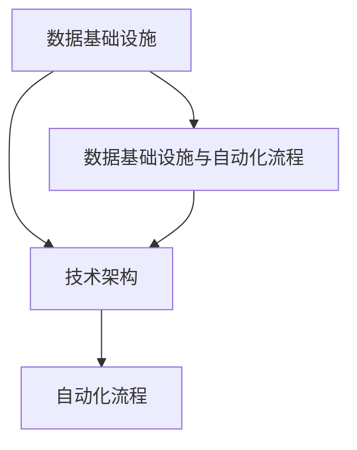

                 

### 技术底盘建设：底线、理想和决心的结合

#### 关键词：技术底盘，建设，底线思维，理想追求，决心执行

#### 摘要：

本文旨在探讨技术底盘建设的核心要素，即底线思维、理想追求和决心执行。我们将通过系统化的分析和实践案例，阐述如何构建一个稳定、高效和可持续发展的技术底盘，为企业带来持续的竞争优势。文章分为四个部分：基础理论、实践方法、案例研究和持续优化，最后提供工具与资源推荐。

----------------------------------------------------------------

## 第一部分：技术底盘建设的基础理论

### 第1章：技术底盘概述

技术底盘是企业信息化建设的核心，它承载着数据存储、计算能力、业务逻辑和自动化流程等重要功能。技术底盘的建设不仅是技术问题，更是企业战略和业务发展的关键。

### 1.1 技术底盘的定义与重要性

**定义**：技术底盘是指企业内部构建的一系列基础设施和工具，包括数据基础设施、技术架构和自动化流程等，用于支持业务运作和创新发展。

**重要性**：技术底盘是企业数字化转型的基础，决定了企业的技术能力和业务效率。一个稳定、高效的技术底盘能够提高业务响应速度、降低运营成本，并为企业提供持续的技术支持。

### 1.2 技术底盘的核心组件

技术底盘的核心组件包括数据基础设施、技术架构和自动化流程。以下是一个简化的 Mermaid 流程图，展示了这些组件之间的联系：

### 1.3 技术底盘的构建原则

技术底盘的构建需要遵循以下原则：

- **底线思维**：确保技术底盘的稳定性、可靠性和安全性。
- **理想追求**：追求技术底盘的先进性、灵活性和可扩展性。
- **决心执行**：明确目标和计划，确保技术底盘的持续优化和迭代。

### 1.4 技术底盘与业务融合

技术底盘的建设必须与业务紧密融合，以确保技术支持业务发展。以下两个方面是关键：

- **技术支持业务**：技术底盘要能够满足业务需求，提供稳定、高效的技术支持。
- **业务驱动技术**：业务发展需求反过来影响技术底盘的建设，推动技术的创新和优化。

----------------------------------------------------------------

## 第二部分：技术底盘建设的实践方法

### 第2章：技术底盘建设的步骤与策略

技术底盘的建设是一个系统化的过程，需要遵循科学的步骤和策略。以下是技术底盘建设的具体步骤和策略：

### 2.1 明确建设目标

建设目标包括底线目标、理想目标和决心目标。底线目标确保技术底盘的稳定性，理想目标追求技术底盘的先进性和灵活性，决心目标则确保目标的实现。

### 2.2 进行需求分析

需求分析是技术底盘建设的关键环节。需要分析业务需求、技术需求和资源需求，确保技术底盘的建设能够满足各方面的需求。

### 2.3 构建技术架构

技术架构是技术底盘的核心，决定了技术底盘的稳定性、灵活性和可扩展性。技术架构的设计需要考虑以下几个方面：

- **技术栈选择**：根据业务需求和技术特点选择合适的技术栈。
- **架构设计原则**：遵循模块化、分布式、可扩展和可维护等原则。
- **架构演进策略**：根据业务发展和技术变化进行架构的持续优化。

### 2.4 数据基础设施搭建

数据基础设施是技术底盘的重要组成部分，包括数据采集、数据存储、数据处理和数据安全等方面。以下是数据基础设施搭建的关键步骤：

- **数据采集**：设计合理的数据采集方案，确保数据的质量和完整性。
- **数据存储**：选择合适的数据存储方案，确保数据的安全和高效访问。
- **数据处理**：设计数据处理流程，确保数据的实时性和准确性。
- **数据安全**：建立完善的数据安全体系，确保数据的安全性和隐私性。

### 2.5 自动化流程优化

自动化流程优化是提高技术底盘效率的重要手段。以下是自动化流程优化的关键步骤：

- **流程设计**：设计自动化流程，提高业务操作的效率和准确性。
- **工具选择**：选择合适的自动化工具，提高流程的执行效率。
- **流程监控**：建立流程监控体系，确保流程的稳定运行。

----------------------------------------------------------------

## 第三部分：技术底盘建设的案例研究

### 第3章：成功案例解析

在本章节中，我们将通过几个具体的成功案例，分析技术底盘建设的过程和成果，为读者提供实践经验和启示。

### 3.1 案例一：互联网企业的技术底盘建设

**背景**：某互联网企业由于业务快速发展，原有的技术底盘已无法满足业务需求，因此决定进行技术底盘的升级。

**过程**：

1. **明确建设目标**：底线目标为稳定运行，理想目标为高效和可扩展，决心目标为持续优化。
2. **进行需求分析**：分析业务需求、技术需求和资源需求，制定详细的规划。
3. **构建技术架构**：采用微服务架构，提高系统的灵活性和可扩展性。
4. **数据基础设施搭建**：采用分布式数据库，确保数据的高可用性和高性能。
5. **自动化流程优化**：引入自动化部署和监控工具，提高系统的自动化程度。

**成果**：

- 技术底盘的稳定性和性能得到显著提升。
- 业务响应速度加快，运营成本降低。
- 技术创新能力得到增强，为企业带来了持续的竞争优势。

**经验**：

- 明确建设目标，确保技术底盘与业务发展相匹配。
- 加强需求分析，确保技术底盘能够满足实际需求。
- 采用先进的架构和技术，提高技术底盘的灵活性和可扩展性。
- 加强自动化流程优化，提高技术底盘的运行效率。

### 3.2 案例二：制造业的技术底盘升级

**背景**：某制造业企业由于市场竞争加剧，决定通过技术底盘升级来提高生产效率和产品质量。

**过程**：

1. **明确建设目标**：底线目标为提高生产效率，理想目标为提高产品质量，决心目标为持续优化。
2. **进行需求分析**：分析生产流程、技术需求和资源需求，制定详细的规划。
3. **构建技术架构**：采用工业物联网（IIoT）技术，实现生产数据的实时采集和分析。
4. **数据基础设施搭建**：建立大数据平台，对生产数据进行存储和处理。
5. **自动化流程优化**：引入自动化生产设备和工艺，提高生产线的自动化程度。

**成果**：

- 生产效率提高了30%，产品质量稳定性和一致性得到了显著提升。
- 成本降低了20%，企业的竞争力得到增强。

**经验**：

- 明确建设目标，确保技术底盘与业务目标相一致。
- 加强需求分析，确保技术底盘能够满足生产需求。
- 利用物联网和大数据技术，提高生产线的智能化程度。
- 加强自动化流程优化，提高生产效率。

### 3.3 案例三：金融行业的技术底盘建设

**背景**：某金融企业由于业务复杂度和数据量大幅增长，决定进行技术底盘的升级。

**过程**：

1. **明确建设目标**：底线目标为数据安全和合规性，理想目标为业务响应速度，决心目标为持续优化。
2. **进行需求分析**：分析业务需求、技术需求和合规性要求，制定详细的规划。
3. **构建技术架构**：采用分布式架构，确保系统的可扩展性和稳定性。
4. **数据基础设施搭建**：采用分布式数据库，确保数据的高可用性和高性能。
5. **自动化流程优化**：引入自动化交易系统和风险管理工具，提高业务处理效率。

**成果**：

- 数据安全性和合规性得到显著提升。
- 业务响应速度加快，客户满意度提高。
- 技术创新能力得到增强，为企业带来了持续的竞争优势。

**经验**：

- 明确建设目标，确保技术底盘与业务需求相匹配。
- 加强需求分析，确保技术底盘能够满足业务和安全需求。
- 采用分布式架构，提高系统的稳定性和可扩展性。
- 加强自动化流程优化，提高业务处理效率。

### 3.4 案例四：电子商务平台的技术底盘建设

**背景**：某电子商务平台由于业务快速增长，决定进行技术底盘的升级。

**过程**：

1. **明确建设目标**：底线目标为系统稳定性和用户体验，理想目标为高并发处理能力和数据智能分析，决心目标为持续优化。
2. **进行需求分析**：分析业务需求、技术需求和用户体验要求，制定详细的规划。
3. **构建技术架构**：采用容器化和微服务架构，确保系统的灵活性和可扩展性。
4. **数据基础设施搭建**：采用大数据平台，对用户行为数据进行分析和处理。
5. **自动化流程优化**：引入自动化测试和部署工具，提高系统的运行效率。

**成果**：

- 系统稳定性和用户体验得到显著提升。
- 高并发处理能力得到增强，满足了业务快速增长的需求。
- 数据智能分析能力得到提升，为企业带来了更多的商业机会。

**经验**：

- 明确建设目标，确保技术底盘与业务目标相一致。
- 加强需求分析，确保技术底盘能够满足业务和用户体验需求。
- 采用容器化和微服务架构，提高系统的灵活性和可扩展性。
- 加强自动化流程优化，提高系统运行效率。

## 第四部分：技术底盘建设的持续优化

### 第4章：技术底盘的持续优化与迭代

技术底盘的建设是一个持续的过程，需要不断进行优化和迭代，以适应业务发展和技术变化。以下是技术底盘持续优化和迭代的关键步骤：

### 4.1 适应性调整

适应性调整是技术底盘持续优化的核心。以下两个方面是关键：

- **业务变化**：随着业务的发展，技术底盘需要适应新的业务场景和需求。
- **技术变化**：随着技术的进步，技术底盘需要引入新的技术和工具，提高系统的性能和灵活性。

### 4.2 安全性与稳定性保障

技术底盘的安全性和稳定性是持续优化的重要目标。以下两个方面是关键：

- **安全体系建设**：建立完善的安全体系，确保系统的数据安全和合规性。
- **稳定性优化措施**：通过监控和故障处理，提高系统的稳定性和可用性。

### 4.3 技术创新与前沿探索

技术创新是技术底盘持续优化的动力。以下两个方面是关键：

- **技术发展趋势**：关注技术发展趋势，引入先进的技术和工具。
- **前沿探索**：进行技术前沿的探索和实验，为企业带来创新的机会。

## 附录

### 附录 A：技术底盘建设工具与资源

以下是一些常用的技术底盘建设工具和资源，供参考：

- **开发工具**：Git、Docker、Kubernetes、Jenkins等。
- **技术文档**：各种开源框架和技术栈的官方文档。
- **开源社区**：GitHub、GitLab、Stack Overflow等。
- **在线课程**：Coursera、Udemy、edX等。

### 附录 B：技术底盘建设最佳实践

以下是一些技术底盘建设最佳实践，供参考：

- **规划先行**：在技术底盘建设前，进行详细的规划，明确目标和策略。
- **需求驱动**：以业务需求为导向，确保技术底盘能够满足实际需求。
- **持续集成**：采用持续集成和持续部署（CI/CD），提高开发效率和系统质量。
- **自动化测试**：建立完善的自动化测试体系，确保系统的稳定性和可靠性。
- **数据治理**：建立数据治理体系，确保数据的质量和安全性。

### 附录 C：技术底盘建设注意事项

以下是一些技术底盘建设注意事项，供参考：

- **兼容性考虑**：确保技术底盘能够与现有的系统兼容。
- **可扩展性设计**：在设计技术架构时，考虑未来的扩展和升级。
- **团队协作**：建立高效的团队协作机制，确保项目能够顺利进行。
- **安全与合规**：确保技术底盘符合相关安全标准和合规要求。

### 附录 D：技术底盘建设拓展阅读

以下是一些推荐的技术底盘建设相关书籍和文章，供读者进一步学习：

- 《架构师修炼之道》
- 《Docker实战》
- 《Kubernetes权威指南》
- 《大数据技术基础》
- 《人工智能技术概述》

## 总结

技术底盘建设是企业信息化建设的重要组成部分，它关系到企业的技术能力和业务效率。本文通过阐述技术底盘建设的核心概念、实践方法和案例研究，为读者提供了全面的技术底盘建设指南。通过持续优化和迭代，技术底盘能够为企业带来持续的竞争优势。

### 作者信息

作者：AI天才研究院/AI Genius Institute & 禅与计算机程序设计艺术 /Zen And The Art of Computer Programming

