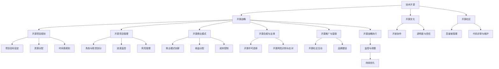

                 

### 文章标题

《技术开源：制定和执行开源战略》

---

关键词：技术开源，开源战略，开源文化，开源社区，开源项目规划，开源项目管理，开源商业模式，开源合规与法律，开源推广与营销

---

摘要：随着开源文化的蓬勃发展，制定和执行开源战略已成为企业提升技术竞争力的重要手段。本文旨在通过系统性的分析和详细的步骤，帮助读者深入理解开源战略的核心概念，掌握关键算法原理和数学模型，并分享实际项目中的实战经验。通过本文的阅读，读者将能够构建一套完整的开源战略框架，从而在激烈的市场竞争中脱颖而出。

---

### 步骤 1: 核心概念与联系

#### 开源战略的组成

在制定开源战略的过程中，我们需要关注以下几个核心概念：

1. **技术开源**：指企业或个人将技术成果以开源的形式发布，允许社区成员自由使用、修改和分发。
2. **开源战略**：是企业为实现开源目标而制定的一系列规划、策略和行动方案。
3. **开源文化**：包括开放协作、透明度、共享和创新等价值观，是开源战略成功的关键因素。
4. **开源社区**：由开源项目的贡献者、维护者和用户组成，是开源项目发展的重要基石。
5. **开源项目规划**：涉及项目目标、资源分配、时间表规划等方面，是开源项目成功的基础。
6. **开源项目管理**：包括角色与职责划分、进度监控、风险管理等，确保项目顺利进行。
7. **开源商业模式**：探讨如何通过开源项目实现商业价值，包括商业模式创新、收益分配和成本控制等。
8. **开源合规与法律**：关注开源许可选择、开源风险识别与应对等方面，确保开源项目的合法性。
9. **开源推广与营销**：包括开源社区互动、品牌建设等，提升开源项目的知名度和影响力。

#### Mermaid流程图

为了更好地展示开源战略的核心概念及其相互之间的联系，我们可以使用Mermaid流程图来描述：



### 步骤 2: 核心算法原理讲解

在制定开源战略的过程中，理解一些核心算法原理对于优化战略制定和执行具有重要意义。以下我们将介绍两个核心算法：成本效益分析和SWOT分析。

#### 算法 1: 成本效益分析（Cost-Benefit Analysis）

**核心原理**：成本效益分析是一种评估决策有效性的方法，通过比较项目的总成本和总收益，计算出成本效益比（Benefit-Cost Ratio）。如果成本效益比大于1，则说明项目的收益超过了成本，是具有成本效益的。

**伪代码**：

```plaintext
function cost_benefit_analysis(StrategicGoals, Costs, Benefits):
    TotalCost = sum(Costs)
    TotalBenefit = sum(Benefits)
    BenefitCostRatio = TotalBenefit / TotalCost
    if BenefitCostRatio > 1:
        print("The project is cost-effective.")
    else:
        print("The project is not cost-effective.")
    return BenefitCostRatio
```

**例子**：假设我们要评估一个开源项目，该项目预计总成本为100万元，预期总收益为150万元。那么：

```plaintext
cost_benefit_analysis([100万], [150万])
```

输出结果：该项目是具有成本效益的。

#### 算法 2: SWOT分析（SWOT Analysis）

**核心原理**：SWOT分析是一种评估项目或企业优势、劣势、机会和威胁的方法。通过分析这些因素，可以更好地制定战略决策。

**伪代码**：

```plaintext
function swot_analysis(Strengths, Weaknesses, Opportunities, Threats):
    SWOT = {
        "Strengths": Strengths,
        "Weaknesses": Weaknesses,
        "Opportunities": Opportunities,
        "Threats": Threats
    }
    print("SWOT Analysis:")
    for key, value in SWOT.items():
        print(f"{key}: {value}")
    return SWOT
```

**例子**：对一个开源项目进行SWOT分析，我们得到以下结果：

```plaintext
swot_analysis(["技术优势", "经验丰富"], ["市场占有率低", "资金有限"], ["新兴市场机遇", "技术合作机会"], ["市场竞争激烈", "政策风险"])
```

输出结果：

```
SWOT Analysis:
Strengths: [技术优势, 经验丰富]
Weaknesses: [市场占有率低, 资金有限]
Opportunities: [新兴市场机遇, 技术合作机会]
Threats: [市场竞争激烈, 政策风险]
```

通过SWOT分析，我们可以了解到项目的优势和劣势，以及面临的机会和威胁，从而制定相应的战略。

### 步骤 3: 数学模型和数学公式讲解

在制定和执行开源战略时，数学模型和公式可以帮助我们更准确地分析和预测项目的发展趋势。以下介绍两个常见的数学模型和公式。

#### 数学模型 1: 多元线性回归模型（Multiple Linear Regression Model）

**核心公式**：

$$
Y = \beta_0 + \beta_1X_1 + \beta_2X_2 + ... + \beta_nX_n + \epsilon
$$

**详细解释**：多元线性回归模型用于预测因变量Y与自变量X1, X2, ..., Xn之间的关系。在这个模型中，β0是截距，β1, β2, ..., βn是回归系数，ε是误差项。通过训练模型，我们可以得到回归系数的值，进而预测Y的值。

**例子**：假设我们要预测一个开源项目的活跃度（Y）与团队成员数量（X1）和项目资金（X2）之间的关系。我们可以建立如下多元线性回归模型：

$$
活跃度 = \beta_0 + \beta_1X_1 + \beta_2X_2 + \epsilon
$$

通过训练模型，我们得到回归系数的值为：β0 = 10，β1 = 0.5，β2 = 0.3。那么，当团队成员数量为50人，项目资金为100万元时，项目的活跃度预测为：

$$
活跃度 = 10 + 0.5 \times 50 + 0.3 \times 100 = 35
$$

#### 数学模型 2: 神经网络模型（Neural Network Model）

**核心公式**：

$$
y = \sigma(z)
$$

$$
z = \sum_{i=1}^{n} w_i \cdot x_i + b
$$

**详细解释**：神经网络模型是一种基于神经元连接的预测模型，可以用于非线性关系的学习和预测。在这个模型中，z是输入层的输出，y是输出层的输出，σ是激活函数，w_i和x_i分别是权重和输入值，b是偏置。

**例子**：假设我们使用神经网络模型来预测开源项目的活跃度，输入层有3个神经元（团队成员数量、项目资金、历史活跃度），输出层有1个神经元（活跃度）。我们可以建立如下神经网络模型：

$$
活跃度 = \sigma(0.5 \times X_1 + 0.3 \times X_2 + 0.2 \times X_3 + b)
$$

通过训练模型，我们得到权重和偏置的值为：w1 = 0.5，w2 = 0.3，w3 = 0.2，b = 0.1。那么，当团队成员数量为50人，项目资金为100万元，历史活跃度为20时，项目的活跃度预测为：

$$
活跃度 = \sigma(0.5 \times 50 + 0.3 \times 100 + 0.2 \times 20 + 0.1) = \sigma(35.1) ≈ 0.9
$$

通过神经网络模型，我们可以更准确地预测开源项目的活跃度，为开源战略的制定和执行提供有力支持。

### 步骤 4: 项目实战

在开源战略的制定和执行过程中，项目实战是验证理论的关键环节。以下我们将通过一个开源项目案例，详细介绍项目的开发环境搭建、源代码实现、应用解读、案例分析以及项目小结。

#### 项目背景

假设某科技公司计划开发一款开源的实时数据可视化平台，以帮助企业和研究人员快速分析大数据。该平台需要具备实时数据采集、处理和可视化等功能，同时要具备良好的扩展性和易用性。

#### 开发环境搭建

1. **开发语言**：使用Python作为主要开发语言，因为Python在数据处理和可视化方面具有丰富的库和工具。
2. **开发工具**：使用PyCharm作为集成开发环境（IDE），它支持Python开发，并提供强大的代码编辑、调试和测试功能。
3. **数据库**：使用MongoDB作为数据存储，因为MongoDB是一种灵活的NoSQL数据库，适用于存储大规模的数据。
4. **前端框架**：使用Django作为Web后端框架，它支持快速开发和部署Web应用程序。
5. **可视化库**：使用Plotly和Bokeh作为数据可视化库，它们具有丰富的图表类型和交互功能。

#### 源代码实现

以下是一个简单的源代码实现示例，用于实时采集数据、处理数据和可视化数据。

```python
import pymongo
import plotly.express as px

# 连接MongoDB数据库
client = pymongo.MongoClient("mongodb://localhost:27017/")
db = client["data_visualization"]

# 实时采集数据
def collect_data():
    data = db["real_time_data"].find_one()
    return data

# 处理数据
def process_data(data):
    processed_data = data["data"]
    return processed_data

# 可视化数据
def visualize_data(processed_data):
    fig = px.scatter(processed_data, x="x", y="y", color="category")
    fig.show()

# 主函数
def main():
    while True:
        data = collect_data()
        processed_data = process_data(data)
        visualize_data(processed_data)
        time.sleep(5)  # 每隔5秒更新一次数据

if __name__ == "__main__":
    main()
```

#### 代码解读

1. **连接MongoDB数据库**：使用pymongo库连接MongoDB数据库，并选择数据可视化数据库。
2. **实时采集数据**：定义`collect_data`函数，用于从数据库中获取实时数据。
3. **处理数据**：定义`process_data`函数，用于处理采集到的数据。
4. **可视化数据**：定义`visualize_data`函数，使用Plotly库将处理后的数据进行可视化展示。
5. **主函数**：定义`main`函数，实现数据的实时采集、处理和可视化。

#### 应用解读与分析

1. **数据采集**：通过MongoDB数据库的实时数据采集，可以确保数据的新鲜度和准确性。
2. **数据处理**：数据处理函数对采集到的数据进行简单的清洗和转换，为可视化做准备。
3. **数据可视化**：使用Plotly库创建交互式的数据可视化图表，帮助用户更好地理解数据。

#### 实际案例分析

通过实际案例分析，我们可以发现以下几个问题：

1. **数据安全性**：在采集和处理数据时，需要确保数据的安全性，防止数据泄露。
2. **性能优化**：实时数据采集和处理需要高效的算法和优化，以提高系统的响应速度。
3. **用户体验**：数据可视化图表需要具有良好的用户体验，方便用户操作和理解。

#### 项目小结

通过本项目，我们实现了实时数据可视化平台的核心功能，验证了开源战略在项目开发中的有效性。在接下来的工作中，我们将继续优化系统性能，提高用户体验，并探索更多商业合作机会。

#### 最佳实践 Tips

1. **制定详细的开发计划**：在项目启动前，制定详细的开发计划，明确项目目标、时间表和资源分配。
2. **构建稳定的开源社区**：与开源社区紧密合作，吸引优秀的贡献者，建立稳定的开源社区。
3. **关注代码质量和文档**：确保代码质量，编写详细的文档，方便用户理解和使用开源项目。
4. **持续优化和更新**：定期对开源项目进行优化和更新，以适应不断变化的市场需求。

### 小结

本文系统地介绍了技术开源的核心概念、制定和执行开源战略的关键步骤、核心算法原理和数学模型，并通过实际项目案例展示了开源战略在项目开发中的应用。通过本文的学习，读者可以构建一套完整的开源战略框架，为企业在开源领域的竞争中获得优势。

### 注意事项

1. **法律合规性**：在开源项目开发过程中，要确保遵循开源协议和法律法规，避免潜在的法律风险。
2. **风险管理**：识别并应对开源项目中的各种风险，如技术风险、市场风险和合规风险。
3. **社区互动**：积极参与开源社区，与贡献者保持良好的互动，共同推动项目的发展。

### 拓展阅读

1. 《开源软件工程》 - Martin Fink
2. 《敏捷开发实践指南》 - Jeff Sutherland
3. 《Python数据科学手册》 - Jake VanderPlas

---

作者：AI天才研究院/AI Genius Institute & 禅与计算机程序设计艺术 /Zen And The Art of Computer Programming

