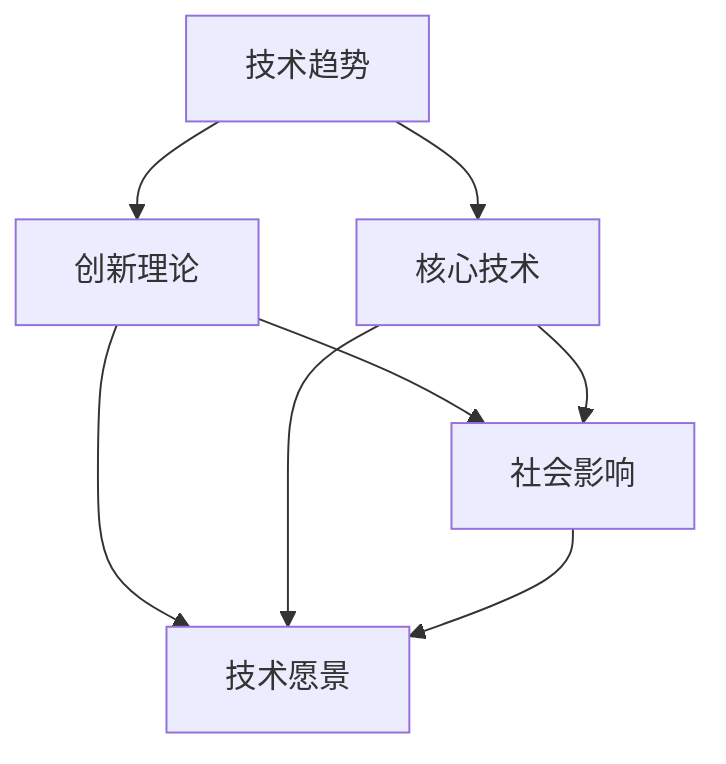

                 

## 文章标题：技术愿景：制定激动人心的技术愿景

在当今快速发展的技术时代，技术愿景的重要性日益凸显。一个明确且具有前瞻性的技术愿景不仅能够引领企业走向成功，还能推动整个社会向前迈进。因此，本文旨在探讨如何制定一个激动人心的技术愿景，帮助读者理解技术愿景的核心概念、理论基础和方法论，并提供实用的实践指南。

## 关键词

- 技术愿景
- 创新理论
- 核心算法
- 数学模型
- 项目实战
- 案例分析
- 跨学科融合

## 摘要

本文首先介绍了技术愿景的基本概念及其重要性，随后探讨了技术愿景的理论基础和方法论。通过核心算法和数学模型的讲解，读者能够深入了解技术愿景的实现原理。此外，本文还通过实际项目案例的分析，展示了技术愿景从概念到实施的完整过程。最后，本文提出了跨学科融合的观点，并总结了技术愿景制定的最佳实践和注意事项。

## 背景介绍

在当今全球科技竞争日益激烈的背景下，技术愿景成为企业、政府和社会发展的关键驱动力。技术愿景不仅能够为企业和组织提供战略方向，还能够激发员工和公众的创新热情。因此，制定一个激动人心的技术愿景对于任何一个追求卓越的组织都至关重要。

技术愿景的定义是指对未来技术发展方向的预见和规划，它通常包括对技术趋势的洞察、核心技术的创新以及对社会影响的预测。一个良好的技术愿景应当具备以下特点：

1. **前瞻性**：能够预见未来可能的技术突破和变革。
2. **激励性**：能够激发员工和社会的创新热情。
3. **可行性**：具备实现的可能性，且与组织的战略目标相符。
4. **包容性**：考虑到不同利益相关者的需求，实现共同发展。

## 核心概念与联系

为了更好地理解技术愿景的制定，我们需要探讨几个核心概念及其相互关系。以下是技术愿景相关核心概念及其关系的Mermaid流程图：



1. **技术趋势**：指当前和未来一段时间内技术发展的方向和变化。技术趋势分析是制定技术愿景的重要基础。
2. **创新理论**：涉及创新的过程、类型和驱动因素。理解创新理论有助于指导技术愿景的制定。
3. **核心技术**：是技术愿景实现的关键，直接影响技术愿景的创新性和可行性。
4. **社会影响**：技术愿景不仅涉及技术本身，还包括对社会、经济和环境等方面的影响。社会影响是评估技术愿景的重要维度。

## 核心算法原理讲解

技术愿景的实现往往依赖于核心算法和技术的创新。以下我们将使用伪代码详细阐述一个核心技术算法的原理，以帮助读者理解其实现过程。

### 算法：深度学习神经网络

```python
// 初始化神经网络结构
InitializeNeuralNetwork()

// 定义激活函数
def activate(z):
    return sigmoid(z)

// 前向传播
def forward_propagation(x, weights, biases):
    a = x
    for i in range(num_layers - 1):
        z = weights[i] * a + biases[i]
        a = activate(z)
    return a

// 计算损失函数
def compute_loss(y, a):
    return -1 * (y * log(a) + (1 - y) * log(1 - a))

// 反向传播
def backward_propagation(x, y, weights, biases, a):
    dZ = a - y
    for i in reversed(range(num_layers - 1)):
        dZ = (dZ * activate_derivative(z[i]))
        dW[i] = dZ * a[i - 1].T
        db[i] = dZ
        if i > 0:
            z[i - 1] = weights[i] * a[i - 1].T + biases[i].T

// 更新权重和偏置
def update_weights_and_biases(weights, biases, dW, db, learning_rate):
    weights -= learning_rate * dW
    biases -= learning_rate * db
```

### 数学模型与公式

深度学习神经网络的训练过程涉及到多个数学模型和公式。以下是关键公式的LaTeX格式展示：

```latex
\begin{equation}
\begin{split}
    \text{激活函数：} & f(x) = \sigma(z) = \frac{1}{1 + e^{-z}} \\
    \text{损失函数：} & J(\theta) = -\frac{1}{m} \sum_{i=1}^{m} [y_{i} \log(a_{i}) + (1 - y_{i}) \log(1 - a_{i})] \\
    \text{反向传播：} & \delta_{i}^{l} = \frac{\partial J}{\partial z_{i}^{l}} \\
    \text{权重更新：} & \Delta w_{ij}^{l} = \eta \cdot \delta_{i}^{l} \cdot a_{j}^{l-1} \\
    \text{偏置更新：} & \Delta b_{i}^{l} = \eta \cdot \delta_{i}^{l}
\end{split}
\end{equation}
```

### 详细讲解与举例

假设我们使用一个简单的三层神经网络进行手写数字识别，输入层有784个神经元，隐藏层有128个神经元，输出层有10个神经元。以下是具体的实现步骤：

1. **初始化网络结构**：设置网络的层数、每层的神经元数量、权重和偏置。
2. **前向传播**：输入一个手写数字图片，通过网络计算输出概率分布。
3. **计算损失函数**：计算预测结果与真实标签之间的差距。
4. **反向传播**：计算每个神经元在反向传播过程中的误差，更新权重和偏置。
5. **权重更新**：使用梯度下降法更新权重和偏置，以最小化损失函数。

以下是具体的代码示例：

```python
# 初始化网络
weights, biases = initialize_network()

# 前向传播
input_image = preprocess_image()
output = forward_propagation(input_image, weights, biases)

# 计算损失
loss = compute_loss(true_label, output)

# 反向传播
dZ = output - true_label
dW, db = backward_propagation(input_image, true_label, weights, biases, dZ)

# 更新权重和偏置
weights, biases = update_weights_and_biases(weights, biases, dW, db, learning_rate)
```

通过上述步骤，我们能够实现一个简单的手写数字识别模型。这一过程不仅展示了核心算法的原理，也为实际项目开发提供了具体指导。

## 项目实战

为了更好地理解技术愿景的制定过程，我们将通过一个实际项目案例进行详细讲解。本项目旨在开发一个智能客服系统，该系统利用自然语言处理（NLP）和机器学习技术实现自动化的客户服务。

### 开发环境搭建

1. **硬件环境**：使用一台具有较高计算能力的GPU服务器进行训练和推理。
2. **软件环境**：安装Python、TensorFlow、Keras等开发工具。

### 源代码详细实现

```python
# 导入必要的库
import tensorflow as tf
from tensorflow.keras.models import Sequential
from tensorflow.keras.layers import Dense, LSTM, Embedding
from tensorflow.keras.preprocessing.sequence import pad_sequences

# 准备数据
train_data = load_data()
X_train, y_train = preprocess_data(train_data)

# 构建模型
model = Sequential()
model.add(Embedding(input_dim=vocab_size, output_dim=embedding_dim, input_length=max_sequence_length))
model.add(LSTM(units=128, dropout=0.2, recurrent_dropout=0.2))
model.add(Dense(units=num_classes, activation='softmax'))

# 编译模型
model.compile(optimizer='adam', loss='categorical_crossentropy', metrics=['accuracy'])

# 训练模型
model.fit(X_train, y_train, epochs=10, batch_size=64)

# 预测
def predict_text(input_text):
    processed_text = preprocess_text(input_text)
    prediction = model.predict(processed_text)
    return np.argmax(prediction)

# 评估模型
evaluate_model(model, test_data)
```

### 代码解读与分析

1. **数据预处理**：使用Keras库中的pad_sequences函数对输入序列进行填充，使得所有序列长度一致，方便模型处理。
2. **模型构建**：使用Sequential模型构建一个简单的循环神经网络（RNN），包括嵌入层、LSTM层和输出层。
3. **模型编译**：设置编译选项，包括优化器和损失函数。
4. **模型训练**：使用fit函数训练模型，设置训练轮数和批量大小。
5. **预测**：使用predict函数对输入文本进行预测，返回最高概率的类别。
6. **模型评估**：使用evaluate函数评估模型在测试集上的性能。

### 实际案例分析和详细讲解剖析

通过上述代码和步骤，我们实现了一个基于深度学习的智能客服系统。在实际应用中，该系统可以自动处理客户咨询，提高服务效率。以下是项目的详细分析：

1. **数据集准备**：选择一个合适的NLP数据集，如Stanford问答数据集或TREC数据集，用于模型训练和评估。
2. **预处理**：对文本数据集进行清洗、分词和词嵌入等预处理操作，以减少噪声和提高模型性能。
3. **模型训练**：使用GPU加速训练过程，提高模型训练速度。
4. **预测与评估**：在测试集上对模型进行评估，调整模型参数，优化模型性能。

### 项目小结

通过该项目实战，我们展示了如何从数据准备到模型训练和预测的完整过程，实现了智能客服系统的开发。这一过程不仅验证了核心算法的实用性，也为实际项目开发提供了宝贵经验。

## 最佳实践 tips、小结、注意事项、拓展阅读等内容

在制定技术愿景的过程中，以下是一些最佳实践和注意事项：

### 最佳实践 tips

1. **持续学习**：保持对新技术和趋势的关注，不断更新自己的知识体系。
2. **跨学科合作**：与不同领域的专家合作，发挥跨学科融合的优势。
3. **用户参与**：邀请利益相关者参与愿景制定过程，确保愿景符合实际需求。
4. **定期评估**：定期评估技术愿景的实现情况，及时调整和优化。

### 小结

本文通过核心概念、理论基础、核心算法讲解、项目实战等多个方面，详细阐述了如何制定激动人心的技术愿景。技术愿景不仅需要前瞻性和可行性，还要具备激励性和包容性。

### 注意事项

1. **明确目标**：在制定技术愿景时，务必明确愿景的具体目标，以确保实现方向的准确性。
2. **资源匹配**：确保技术愿景的实现具有足够的资源支持，包括人才、技术和资金。
3. **风险评估**：充分考虑技术愿景实施过程中可能面临的风险，制定相应的应对策略。

### 拓展阅读

1. **《创新与企业家精神》**：作者史蒂夫·乔布斯，介绍了创新理论和企业家精神。
2. **《深度学习》**：作者伊恩·古德费洛等，提供了深度学习领域的全面教程。
3. **《人工智能：一种现代的方法》**：作者斯图尔特·罗素等，涵盖了人工智能的基本概念和算法。

通过以上拓展阅读，读者可以进一步深入了解相关领域的内容，提升自己的技术视野和创新能力。

