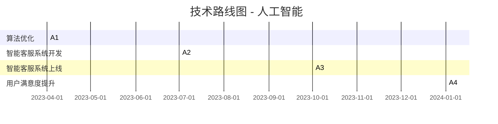
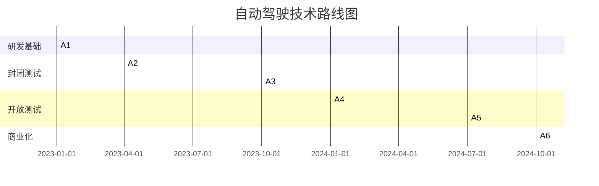

                 

### 文章标题

# 技术战略规划：对齐技术方向与公司愿景

### 关键词

- 技术战略
- 公司愿景
- 技术方向
- 资源分配
- 战略规划
- 执行监控
- 调整与优化

### 摘要

本文探讨了如何通过技术战略规划，确保技术方向与公司愿景的一致性。首先，我们介绍了技术战略的基本概念和重要性。接着，详细分析了技术评估和趋势分析的方法，以及资源分配和预算规划的原则与策略。然后，我们讲解了战略制定和规划的过程，包括技术方向选择和技术路线图的制定。此外，文章还强调了技术战略执行与监控的重要性，并提出了调整与优化的方法。最后，文章通过实际案例进行了深入剖析，总结了最佳实践和注意事项，为企业的技术战略规划提供了实用指导。

----------------------------------------------------------------

## 第一部分：技术战略基础

### 第1章：技术战略概述

#### 1.1 技术战略的定义与重要性

技术战略是指企业在技术领域的长远规划，它涉及如何选择和部署技术资源，以实现企业的业务目标和市场竞争力。技术战略不仅包括技术创新，还涵盖了技术管理、技术投资和技术人才培养等方面。一个成功的技术战略能够帮助企业把握市场机会，降低技术风险，提高企业的整体竞争力。

在当今快速发展的技术环境中，技术战略的重要性愈发凸显。首先，技术战略能够确保企业紧跟行业趋势，抓住创新机遇，避免被市场淘汰。其次，技术战略有助于优化资源配置，提高研发效率，降低成本。此外，技术战略还能够提高企业的创新能力，推动企业转型升级，实现可持续发展。

#### 1.2 技术战略与传统战略的区别

传统战略通常关注企业的市场、客户、竞争对手等方面，而技术战略则更注重企业在技术领域的发展。具体来说，技术战略与传统战略在以下几个方面存在区别：

1. **目标不同**：传统战略的目标通常是提高市场份额、增加收入和利润，而技术战略的目标则是提高技术竞争力、推动技术创新。
2. **关注点不同**：传统战略更多地关注市场分析和客户需求，而技术战略则更多地关注技术创新、技术管理和技术投资。
3. **实施方法不同**：传统战略通常采用市场驱动的方法，而技术战略则更多地采用技术驱动的方法。
4. **评价标准不同**：传统战略的评价标准通常是财务指标，如收入、利润和市场份额，而技术战略的评价标准则包括技术创新、技术竞争力、技术成熟度等。

#### 1.3 技术战略在企业中的角色

技术战略在企业中扮演着至关重要的角色。首先，技术战略是企业实现业务目标的重要手段。通过制定和实施技术战略，企业能够更好地利用技术资源，提高生产效率和产品质量，从而实现业务目标。

其次，技术战略有助于企业保持竞争优势。在技术快速发展的今天，技术优势往往成为企业的重要竞争优势。通过技术战略，企业能够把握技术趋势，提前布局关键技术领域，从而在市场竞争中占据有利地位。

最后，技术战略还能够提高企业的创新能力。技术战略不仅关注现有技术的应用，还关注技术创新和研发。通过持续的技术研发，企业能够不断推出新产品和新服务，提高市场竞争力。

总之，技术战略是企业实现可持续发展、提高市场竞争力和创新能力的重要手段。企业必须重视技术战略的制定和实施，以实现长期发展目标。

### 第2章：技术评估与趋势分析

#### 2.1 技术评估的方法与工具

技术评估是技术战略规划的重要环节，它有助于企业确定现有技术和潜在技术对企业战略目标的支持程度。技术评估的方法和工具多种多样，以下介绍几种常见的方法和工具：

1. **SWOT分析**：SWOT分析是一种常用的战略分析方法，它包括优势（Strengths）、劣势（Weaknesses）、机会（Opportunities）和威胁（Threats）四个方面。通过SWOT分析，企业可以全面了解自身的技术状况，为技术战略的制定提供依据。

2. **PEST分析**：PEST分析是一种宏观环境分析工具，它包括政治（Political）、经济（Economic）、社会（Social）和技术（Technological）四个方面。通过PEST分析，企业可以了解技术发展的外部环境，把握技术趋势和市场机会。

3. **技术成熟度评估**：技术成熟度评估是一种用于评估技术发展水平的方法。它通常采用定量的指标，如技术成熟度指数（Technology Readiness Level,TRL），来评估技术在不同发展阶段的特点和风险。

4. **技术雷达图**：技术雷达图是一种展示技术趋势和成熟度的可视化工具。它通常将技术按领域分类，并标注在每个领域的成熟度和发展速度，帮助企业了解技术趋势和优先级。

5. **创新扩散理论**：创新扩散理论是一种用于分析新技术传播和普及的理论。它包括创新者、早期采用者、早期大众、后期大众和落后采用者五个阶段，帮助企业了解新技术在市场中的传播过程。

#### 2.2 技术趋势分析的重要性

技术趋势分析是技术战略规划的重要基础，它有助于企业把握市场和技术发展的方向，提前布局关键技术领域。技术趋势分析的重要性体现在以下几个方面：

1. **预见市场机会**：通过技术趋势分析，企业可以预见未来的市场机会，提前布局关键技术，抢占市场先机。

2. **规避技术风险**：技术趋势分析可以帮助企业了解技术发展的风险，避免投资于即将淘汰的技术，降低技术风险。

3. **优化资源配置**：技术趋势分析可以帮助企业合理配置资源，将有限的资源投入到具有潜力和前景的技术领域。

4. **提升创新能力**：技术趋势分析有助于企业了解技术前沿，激发创新思维，推动技术创新和研发。

#### 2.3 技术趋势分析方法与案例

技术趋势分析方法多种多样，以下介绍几种常用的方法：

1. **技术雷达图**：技术雷达图是一种用于展示技术趋势和成熟度的工具。它通常将技术按领域分类，并标注在每个领域的成熟度和发展速度。通过技术雷达图，企业可以直观地了解技术趋势，为技术战略的制定提供依据。

2. **技术成熟度评估**：技术成熟度评估是一种用于评估技术发展水平的方法。它通常采用定量的指标，如技术成熟度指数（TRL），来评估技术在不同发展阶段的特点和风险。通过技术成熟度评估，企业可以了解技术的成熟度和应用前景。

3. **趋势报告**：趋势报告是一种总结和预测技术发展趋势的文档。它通常由行业专家或研究机构编写，为企业提供技术趋势分析报告。通过趋势报告，企业可以了解最新的技术趋势和市场动态。

以下是一个技术趋势分析的案例：

**案例：人工智能（AI）技术趋势分析**

1. **技术雷达图**：通过技术雷达图，我们可以发现人工智能技术在各个领域的成熟度和发展速度。如图所示：

```mermaid
radar
    "机器学习"  : [8, 7, 8, 8, 7, 8]
    "深度学习"  : [9, 9, 9, 9, 9, 9]
    "自然语言处理"  : [8, 8, 8, 8, 8, 8]
    "计算机视觉"  : [8, 7, 8, 8, 7, 8]
    "机器人技术"  : [7, 7, 8, 7, 7, 8]
    "自动驾驶"  : [7, 6, 7, 7, 6, 7]
```

2. **技术成熟度评估**：根据技术成熟度指数（TRL），我们可以评估人工智能技术在各个领域的发展水平。如表所示：

| 技术领域 | TRL1 | TRL2 | TRL3 | TRL4 | TRL5 | TRL6 |
| --- | --- | --- | --- | --- | --- | --- |
| 机器学习 |     |     |     |     |     |  ✓  |
| 深度学习 |     |     |     |     |  ✓  |  ✓  |
| 自然语言处理 |     |     |     |     |  ✓  |  ✓  |
| 计算机视觉 |     |     |     |     |  ✓  |  ✓  |
| 机器人技术 |     |     |     |  ✓  |  ✓  |  ✓  |
| 自动驾驶 |     |     |  ✓  |  ✓  |  ✓  |  ✓  |

3. **趋势报告**：根据某知名研究机构发布的人工智能趋势报告，我们可以了解到以下信息：

- 人工智能技术在机器学习、深度学习和自然语言处理等领域已经达到技术成熟度指数（TRL）5，具有广泛的应用前景。
- 计算机视觉和机器人技术也在快速发展，预计未来几年将达到TRL5。
- 自动驾驶技术处于技术成熟度指数（TRL）3至TRL5之间，已开始实现商业化应用。

通过技术趋势分析，企业可以了解人工智能技术的发展趋势，为技术战略的制定提供依据。

### 第3章：资源分配与预算规划

#### 3.1 资源分配的原则与策略

资源分配是技术战略规划的核心环节之一，它关系到企业的技术创新能力和市场竞争力。有效的资源分配能够确保企业在技术领域取得最佳的投资回报。以下是资源分配应遵循的原则和策略：

1. **优先级排序**：在资源有限的情况下，企业应根据业务目标和市场机会，对技术项目进行优先级排序。优先支持具有高潜力、高回报和重要性的技术项目。

2. **平衡短期与长期**：在资源分配时，企业应平衡短期收益和长期发展。短期资源应主要用于支持当前业务需求，而长期资源则应投入技术创新和研发，为未来的业务增长奠定基础。

3. **优化资源配置**：企业应通过优化资源配置，提高资源利用效率。例如，通过技术共享、跨部门合作和外包等手段，降低资源消耗。

4. **灵活性**：在资源分配过程中，企业应保持一定的灵活性，以应对不确定性和变化。例如，预留一定比例的预算和人力资源，用于应对突发情况。

#### 3.2 预算规划的方法与技巧

预算规划是资源分配的关键环节，它关系到企业的财务健康和创新能力。以下是预算规划的方法和技巧：

1. **成本效益分析**：在进行预算规划时，企业应进行成本效益分析，评估每个技术项目的投资回报。优先支持投资回报较高的项目，以最大化企业的财务收益。

2. **滚动预算**：滚动预算是一种动态调整预算的方法。企业应根据实际情况，定期调整预算，以确保预算与业务目标保持一致。

3. **项目预算**：对于每个技术项目，企业应制定详细的预算计划，包括项目成本、时间安排和资源需求等。项目预算有助于确保项目的顺利进行和资源的高效利用。

4. **风险管理**：在预算规划过程中，企业应考虑潜在的风险，并制定相应的应对措施。例如，为项目预留一定的预算和人力资源，以应对风险事件。

#### 3.3 资源分配的案例分析

以下是一个资源分配和预算规划的案例分析：

**案例：某科技公司资源分配和预算规划**

某科技公司致力于人工智能技术的研发和应用，其资源分配和预算规划如下：

1. **优先级排序**：
   - 优先支持人工智能基础技术（如机器学习、深度学习和自然语言处理）的研发。
   - 次优先支持人工智能应用技术的研发（如计算机视觉、自动驾驶和智能客服）。

2. **平衡短期与长期**：
   - 短期资源（如预算和人力资源）主要用于支持当前业务需求，如智能客服系统的优化和升级。
   - 长期资源（如预算和人力资源）主要用于人工智能基础技术的研发，为未来的业务增长奠定基础。

3. **优化资源配置**：
   - 通过跨部门合作，共享技术资源和研发成果，降低资源消耗。
   - 通过外包部分非核心研发任务，降低人力成本。

4. **灵活性**：
   - 预留10%的预算和人力资源，用于应对突发情况。

5. **预算规划**：
   - 成本效益分析：根据各技术项目的投资回报，优先支持投资回报较高的项目。
   - 滚动预算：根据业务发展情况，每季度调整预算计划。
   - 项目预算：为每个技术项目制定详细的预算计划，包括项目成本、时间安排和资源需求等。

通过以上资源分配和预算规划，某科技公司能够确保在资源有限的情况下，最大限度地发挥技术创新能力，提高市场竞争力。

### 第4章：战略制定与规划

#### 4.1 战略制定的过程

战略制定是企业实现长期目标的关键步骤，它涉及对内部和外部环境的分析、目标的设定、策略的选择以及资源的分配。以下是战略制定的基本过程：

1. **环境分析**：首先，企业需要对外部环境进行分析，包括市场趋势、竞争对手、技术发展等因素。同时，对内部环境进行分析，了解企业的核心竞争力、资源状况、组织结构等。环境分析有助于企业确定外部挑战和内部优势，为战略制定提供依据。

2. **目标设定**：在环境分析的基础上，企业需要明确战略目标。这些目标应当具有可衡量性、可实现性和时效性。目标设定应当与企业的愿景和使命一致，并能够推动企业实现可持续发展。

3. **策略选择**：根据战略目标和环境分析的结果，企业需要选择相应的策略。这些策略包括市场策略、产品策略、技术策略、人力资源策略等。策略选择应当充分考虑企业的核心竞争力、资源状况和市场机会。

4. **资源分配**：在确定策略后，企业需要将资源（包括财务资源、人力资源、技术资源等）合理分配到各个策略中。资源分配应当确保每个策略都有足够的资源支持，同时避免资源浪费。

5. **战略实施**：战略制定完成后，企业需要制定详细的实施计划，包括时间表、责任分配、关键绩效指标等。战略实施需要各部门的紧密协作，确保战略目标的顺利实现。

6. **监控与调整**：在战略实施过程中，企业需要定期监控战略的执行情况，并根据实际情况进行调整。监控与调整有助于确保战略目标得以实现，并能够及时应对外部环境的变化。

#### 4.2 战略规划的工具与方法

战略规划的工具和方法多种多样，以下介绍几种常用的工具和方法：

1. **SWOT分析**：SWOT分析是一种常用的战略规划工具，它包括优势（Strengths）、劣势（Weaknesses）、机会（Opportunities）和威胁（Threats）四个方面。通过SWOT分析，企业可以全面了解自身的战略环境，为战略制定提供依据。

2. **PEST分析**：PEST分析是一种宏观环境分析工具，它包括政治（Political）、经济（Economic）、社会（Social）和技术（Technological）四个方面。通过PEST分析，企业可以了解外部环境的变化趋势，为战略规划提供参考。

3. **波特五力模型**：波特五力模型是一种用于分析市场竞争环境的工具，它包括供应商、买家、潜在进入者、替代品和行业内的竞争者五个方面。通过波特五力模型，企业可以了解行业竞争格局，制定相应的竞争策略。

4. **战略地图**：战略地图是一种用于展示企业战略目标和关键绩效指标的图表。通过战略地图，企业可以清晰地了解战略目标与关键绩效指标之间的关系，确保战略规划的实施。

5. **关键绩效指标（KPI）**：关键绩效指标是用于衡量战略实施效果的重要工具。通过设定关键绩效指标，企业可以定期监控战略的执行情况，并根据指标结果进行相应的调整。

#### 4.3 战略规划的案例分析

以下是一个战略规划的案例分析：

**案例：某互联网公司战略规划**

某互联网公司致力于提供云计算服务，其战略规划如下：

1. **环境分析**：
   - 外部环境：云计算市场增长迅速，市场需求巨大；竞争对手包括亚马逊AWS、微软Azure和谷歌Cloud等。
   - 内部环境：公司拥有一支技术团队，具备云计算研发能力；公司已有一定客户基础，但市场份额较小。

2. **目标设定**：
   - 在未来三年内，成为国内领先的云计算服务提供商。
   - 实现收入翻番，市场份额达到10%。

3. **策略选择**：
   - 技术策略：加大云计算技术研发投入，提升云计算服务的性能和安全性。
   - 市场策略：通过线上线下渠道拓展客户，提高市场知名度。
   - 营销策略：推出具有竞争力的价格和增值服务，吸引更多客户。

4. **资源分配**：
   - 将40%的预算用于云计算技术研发，20%的预算用于市场推广，20%的预算用于客户服务，10%的预算用于其他支持性工作。

5. **战略实施**：
   - 制定详细的时间表和责任分配，确保每个策略的顺利实施。
   - 定期召开战略会议，监控战略实施进度和关键绩效指标。

6. **监控与调整**：
   - 每季度对战略实施情况进行评估，根据市场变化和竞争态势进行调整。

通过以上战略规划，某互联网公司能够明确发展目标，优化资源配置，提高市场竞争力，实现可持续发展。

### 第5章：技术方向选择

#### 5.1 技术方向选择的原则

技术方向选择是技术战略规划中的关键环节，它决定了企业技术发展的路径和策略。以下是一些技术方向选择的基本原则：

1. **符合企业愿景和战略目标**：技术方向应当与企业的愿景和战略目标保持一致。例如，如果企业的愿景是成为全球领先的云计算服务提供商，那么技术方向应当聚焦于云计算相关技术。

2. **市场前景广阔**：技术方向的选择应当考虑市场需求和行业趋势。选择具有广阔市场前景的技术方向，有助于企业实现业务增长和市场份额提升。

3. **具备核心竞争力**：技术方向的选择应当考虑企业的核心竞争力。选择能够充分发挥企业核心优势的技术方向，有助于企业保持竞争优势。

4. **技术成熟度和风险可控**：技术方向的选择应当考虑技术的成熟度和风险。选择成熟度较高、风险较低的技术方向，有助于确保项目的顺利实施。

5. **资源充足**：技术方向的选择应当考虑企业的资源状况。选择与企业资源状况相匹配的技术方向，有助于确保项目有足够的资源支持。

6. **可持续发展和环境影响**：技术方向的选择应当考虑可持续发展和环境影响。选择符合可持续发展理念、对环境友好的技术方向，有助于提升企业的社会责任形象。

#### 5.2 技术方向选择的步骤

技术方向选择是一个系统性、复杂性的过程，以下是一些基本步骤：

1. **调研和分析**：首先，企业需要对技术市场进行调研和分析，了解行业趋势、技术发展状况、竞争对手情况等。通过调研和分析，企业可以确定潜在的技术方向。

2. **评估和筛选**：根据调研和分析结果，企业需要对潜在的技术方向进行评估和筛选。评估内容包括市场需求、技术成熟度、风险程度、资源需求等。通过评估和筛选，企业可以确定最符合企业战略目标的技术方向。

3. **论证和决策**：在评估和筛选的基础上，企业需要进一步论证技术方向的可行性，并做出最终决策。论证内容包括技术可行性、市场前景、资源需求、成本效益等。通过论证和决策，企业可以明确技术发展方向。

4. **制定实施计划**：确定技术方向后，企业需要制定详细的实施计划，包括项目目标、时间表、责任分配、资源分配等。通过实施计划，企业可以确保技术方向得以有效实施。

5. **监控和调整**：在技术方向实施过程中，企业需要定期监控实施进度和效果，并根据实际情况进行调整。通过监控和调整，企业可以确保技术方向持续符合企业战略目标。

#### 5.3 技术方向选择的案例分析

以下是一个技术方向选择的案例分析：

**案例：某医疗设备公司技术方向选择**

某医疗设备公司致力于提供先进的医疗影像设备，其技术方向选择过程如下：

1. **调研和分析**：
   - 调研市场：公司通过市场调研了解到，全球医疗影像设备市场呈现快速增长趋势，特别是在人工智能辅助诊断领域。
   - 分析技术：公司分析了人工智能在医疗影像诊断中的应用，包括深度学习、计算机视觉等技术。

2. **评估和筛选**：
   - 市场前景：人工智能辅助诊断具有广阔的市场前景，能够提高诊断准确率，降低医生工作负担。
   - 技术成熟度：人工智能技术在医疗影像诊断领域已取得显著成果，技术成熟度较高。
   - 风险程度：虽然存在一定的技术风险，但公司具备技术实力，能够应对风险。

3. **论证和决策**：
   - 技术可行性：公司通过技术论证，确认人工智能辅助诊断技术具有可行性，且符合公司战略目标。
   - 成本效益：公司评估了人工智能辅助诊断技术的成本效益，发现具有较高的投资回报。

4. **制定实施计划**：
   - 项目目标：开发一款基于人工智能辅助诊断的医疗影像设备。
   - 时间表：项目分为三个阶段，第一阶段完成算法研发，第二阶段完成设备集成，第三阶段完成市场推广。
   - 责任分配：明确各个部门在项目中的责任和任务。

5. **监控和调整**：
   - 定期监控项目进度和效果，确保项目按计划进行。
   - 根据市场变化和技术发展，适时调整技术方向。

通过以上技术方向选择过程，某医疗设备公司成功确定了人工智能辅助诊断作为其技术发展方向，为企业创造了新的增长点。

### 第6章：技术路线图制定

#### 6.1 技术路线图的概念与作用

技术路线图（Technology Roadmap）是一种用于规划和指导技术发展的工具，它通过图表的形式，展示技术发展的阶段、时间节点、关键里程碑和技术路径。技术路线图的目的是为企业提供清晰的指导，帮助企业在复杂的技术领域中找到正确的方向，实现技术目标和战略目标。

技术路线图的作用主要体现在以下几个方面：

1. **明确技术发展路径**：技术路线图帮助企业在技术发展中明确方向，避免盲目跟风或重复研发，确保技术资源的有效利用。

2. **指导研发和投资**：技术路线图为研发和投资提供了明确的目标和时间表，有助于企业合理分配资源，提高研发效率。

3. **促进跨部门协作**：技术路线图能够明确各个部门在技术发展中的责任和任务，促进跨部门协作，确保技术项目的顺利实施。

4. **应对技术风险**：技术路线图通过提前规划，有助于企业识别和应对技术风险，降低研发失败的概率。

5. **评估和调整**：技术路线图能够定期评估技术发展的进展，根据实际情况进行及时调整，确保技术战略的持续有效。

#### 6.2 技术路线图的构建方法

构建技术路线图需要系统地分析和规划，以下是一些基本步骤和方法：

1. **确定技术目标**：首先，企业需要明确技术目标，这些目标应当与企业的战略目标保持一致。技术目标可以是提高产品性能、降低成本、提升用户体验等。

2. **分析技术趋势**：通过对行业技术趋势进行分析，了解当前技术发展的方向和速度。这可以通过市场调研、技术报告、专家访谈等方式进行。

3. **确定关键里程碑**：根据技术目标和趋势分析，确定技术发展过程中的关键里程碑。这些里程碑可以是技术的突破点、产品的发布点或市场的重要时间节点。

4. **规划时间节点**：为每个里程碑设定具体的时间节点，确保技术发展按计划进行。时间节点应当具有可操作性和可实现性。

5. **绘制技术路线图**：使用图表形式展示技术路线图，包括技术阶段、时间节点、关键里程碑和技术路径。技术路线图应当清晰、简洁，便于理解和执行。

6. **评估和调整**：在技术路线图实施过程中，定期评估技术进展，并根据实际情况进行及时调整。

以下是一个技术路线图构建方法的示例：

**示例：某企业人工智能技术路线图构建**

1. **确定技术目标**：
   - 提高人工智能算法的性能和精度。
   - 开发基于人工智能的智能客服系统。

2. **分析技术趋势**：
   - 机器学习算法不断优化，性能提升明显。
   - 自然语言处理技术应用于智能客服，用户体验显著提升。

3. **确定关键里程碑**：
   - 算法优化完成：第一年。
   - 智能客服系统上线：第二年。
   - 用户满意度提升：第三年。

4. **规划时间节点**：
   - 第一季度：完成机器学习算法优化。
   - 第二季度：完成智能客服系统开发。
   - 第四季度：智能客服系统上线。

5. **绘制技术路线图**：



6. **评估和调整**：
   - 定期评估技术进展，根据实际情况调整时间节点和里程碑。

通过以上方法，企业可以构建出一个清晰、可行且具有指导意义的技术路线图，确保技术发展方向与公司愿景一致，推动企业技术创新和业务发展。

#### 6.3 技术路线图的案例分析

以下是一个技术路线图案例分析的示例：

**案例：某自动驾驶技术公司路线图**

某自动驾驶技术公司致力于开发自动驾驶系统，其技术路线图如下：

1. **确定技术目标**：
   - 实现L4级别自动驾驶技术。
   - 提供安全的自动驾驶解决方案。

2. **分析技术趋势**：
   - 自动驾驶技术不断成熟，传感器、计算机视觉、深度学习等技术得到广泛应用。
   - 自动驾驶车辆的商业化应用逐步扩大。

3. **确定关键里程碑**：
   - 完成自动驾驶系统的基础研发：第一年。
   - 在封闭环境下进行自动驾驶测试：第二年。
   - 在开放道路上进行自动驾驶测试：第三年。
   - 商业化自动驾驶车辆上线：第四年。

4. **规划时间节点**：



5. **评估和调整**：
   - 每季度评估研发进度和测试结果。
   - 根据实际情况调整时间节点和里程碑。

通过上述技术路线图，该公司能够清晰地规划自动驾驶技术的发展路径，确保技术目标的实现，并逐步实现商业化应用。

### 第7章：技术战略执行

#### 7.1 技术战略执行的关键因素

技术战略的执行是确保企业技术发展方向与公司愿景一致的重要环节。成功的技术战略执行需要考虑多个关键因素，以下是一些主要的因素：

1. **组织结构**：企业需要建立合适的组织结构，确保各部门能够协同合作，共同实现技术战略目标。组织结构应当灵活，能够快速响应变化，适应技术发展的需求。

2. **团队协作**：技术战略执行需要跨部门、跨团队的紧密协作。企业应当建立有效的沟通渠道，促进信息共享和协作，确保各个团队能够在共同目标下高效工作。

3. **资源配置**：确保技术战略执行所需的人力、财务和技术资源得到合理配置。企业应当根据战略目标和优先级，合理分配资源，确保关键项目得到充分支持。

4. **项目管理**：技术战略的执行涉及多个项目，企业需要建立有效的项目管理机制，确保项目按照计划进行，控制项目风险，提高项目成功率。

5. **文化建设**：企业应当建立积极向上的文化氛围，鼓励创新和合作。企业文化应当与战略目标相一致，激发员工的创造力和执行力。

6. **决策机制**：建立高效的决策机制，确保在技术战略执行过程中，能够及时做出正确的决策。决策机制应当具有灵活性，能够快速适应外部环境的变化。

7. **持续改进**：技术战略执行是一个持续的过程，企业需要不断评估和改进技术战略，确保其与公司愿景保持一致。通过持续改进，企业能够不断提升技术竞争力。

#### 7.2 技术战略执行的工具与方法

为了确保技术战略的有效执行，企业可以采用以下工具和方法：

1. **项目管理工具**：使用项目管理工具（如JIRA、Trello等）来跟踪项目进度、任务分配和资源使用，确保项目按计划进行。

2. **沟通协作工具**：使用沟通协作工具（如Slack、Microsoft Teams等）来促进跨部门、跨团队的沟通和协作，提高工作效率。

3. **知识管理系统**：建立知识管理系统，收集、整理和共享技术知识和经验，促进团队学习和创新。

4. **敏捷开发方法**：采用敏捷开发方法，如Scrum或Kanban，提高开发团队的灵活性和响应速度，确保技术项目能够快速交付。

5. **关键绩效指标（KPI）**：设定关键绩效指标，用于衡量技术战略执行的效果，如项目完成率、研发效率、市场响应时间等。

6. **预算管理工具**：使用预算管理工具，如ERP系统，来监控和管理技术项目的预算，确保预算合理使用，避免资源浪费。

7. **风险管理工具**：采用风险管理工具和方法，如风险矩阵、风险登记册等，识别和应对潜在风险，确保技术项目的顺利进行。

#### 7.3 技术战略执行的案例分析

以下是一个技术战略执行的案例分析：

**案例：某互联网公司技术战略执行**

某互联网公司致力于提供云计算服务，其技术战略执行过程如下：

1. **组织结构**：公司建立了专门的云计算研发部门，负责技术战略的执行。该部门与市场部、销售部、运维部等紧密协作，确保技术战略与市场需求和企业目标一致。

2. **团队协作**：公司采用敏捷开发方法，建立了跨部门、跨团队的协作机制。每周举行站立会议，讨论项目进展、问题解决和资源需求，确保项目按计划进行。

3. **资源配置**：公司根据技术战略的优先级，合理分配人力资源和财务资源。云计算研发部门得到了充足的预算支持，确保关键项目能够顺利推进。

4. **项目管理**：公司使用JIRA进行项目管理，跟踪项目进度、任务分配和资源使用。项目经理定期评估项目进展，及时调整项目计划，确保项目按期完成。

5. **文化建设**：公司鼓励创新和协作，建立了开放、包容的文化氛围。员工可以自由分享想法和经验，促进了团队学习和创新。

6. **决策机制**：公司建立了快速决策机制，确保在技术战略执行过程中，能够及时做出正确的决策。决策过程透明，涉及多方意见，提高了决策质量。

7. **持续改进**：公司定期评估技术战略执行效果，通过用户反馈、市场调研和技术评审等方式，发现问题和改进机会。公司持续优化技术战略，确保其与公司愿景保持一致。

通过以上措施，某互联网公司成功地执行了其技术战略，提高了云计算服务的性能和质量，增强了市场竞争力。

### 第8章：技术战略监控与调整

#### 8.1 技术战略监控的重要性

技术战略监控是确保技术战略得以有效执行和持续改进的关键环节。它的重要性体现在以下几个方面：

1. **确保战略目标实现**：通过技术战略监控，企业可以及时了解技术项目的进展情况，确保各项技术目标得以实现。监控有助于发现潜在的问题和风险，采取有效的措施予以解决。

2. **优化资源配置**：技术战略监控可以帮助企业优化资源配置，确保资源得到合理利用。通过监控技术项目的成本、进度和质量，企业可以调整资源分配，提高资源利用效率。

3. **提高决策质量**：技术战略监控为企业的决策提供了客观的数据支持。通过监控数据，企业可以评估技术战略的执行效果，识别成功和失败的原因，为后续决策提供科学依据。

4. **适应市场变化**：技术战略监控使企业能够及时了解市场和技术环境的变化，快速调整技术战略，以应对外部挑战和机遇。

5. **促进持续改进**：技术战略监控有助于企业发现技术项目中的问题和改进机会，推动持续改进，不断提高技术能力和竞争力。

#### 8.2 技术战略监控的方法与工具

技术战略监控需要采用科学的方法和工具，以下介绍几种常用的方法和工具：

1. **关键绩效指标（KPI）**：设定关键绩效指标，用于衡量技术战略的执行效果。常见的KPI包括项目完成率、研发效率、成本控制率、市场响应时间等。通过定期监控KPI，企业可以评估技术战略的执行效果。

2. **项目跟踪系统**：使用项目跟踪系统（如JIRA、Trello等），实时跟踪技术项目的进度、任务分配和资源使用情况。项目跟踪系统能够提供详细的数据分析，帮助管理者做出科学决策。

3. **数据分析工具**：使用数据分析工具（如Tableau、Power BI等），对技术战略监控数据进行可视化分析。通过数据分析，企业可以直观地了解项目进展、问题和改进机会。

4. **定期审查**：定期进行技术战略审查，评估技术项目的执行情况和效果。审查可以采用内部审计或第三方评估的方式，确保客观性和公正性。

5. **用户反馈**：通过收集用户反馈，了解技术产品的实际效果和市场反应。用户反馈是技术战略监控的重要来源，有助于发现问题和改进机会。

6. **技术评审**：定期进行技术评审，评估技术项目的技术实现和创新能力。技术评审可以识别项目中的潜在风险和改进点，确保技术战略的持续改进。

#### 8.3 技术战略监控的案例分析

以下是一个技术战略监控的案例分析：

**案例：某科技公司技术战略监控**

某科技公司致力于提供人工智能解决方案，其技术战略监控过程如下：

1. **关键绩效指标（KPI）**：
   - 项目完成率：确保所有项目按计划完成。
   - 研发效率：评估研发团队的效率和产出。
   - 成本控制率：监控项目成本，确保预算合理使用。
   - 市场响应时间：评估市场需求的响应速度。

2. **项目跟踪系统**：
   - 使用JIRA跟踪技术项目进度、任务分配和资源使用。
   - 定期生成报告，分析项目进展情况。

3. **数据分析工具**：
   - 使用Power BI对KPI数据进行可视化分析。
   - 通过图表和报告，直观地了解项目进展和问题。

4. **定期审查**：
   - 每季度进行技术战略审查，评估技术项目的执行效果。
   - 邀请外部专家进行第三方评估，确保客观性和公正性。

5. **用户反馈**：
   - 定期收集用户反馈，了解人工智能解决方案的实际效果和市场反应。
   - 分析用户反馈，识别改进机会。

6. **技术评审**：
   - 定期进行技术评审，评估人工智能项目的技术实现和创新能力。
   - 针对发现的问题和改进点，制定相应的改进计划。

通过以上技术战略监控方法，某科技公司能够及时发现和解决技术项目中的问题，确保技术战略的有效执行和持续改进，提高了市场竞争力。

### 第9章：技术战略调整

#### 9.1 技术战略调整的原因

技术战略调整是技术战略管理中不可或缺的一部分。企业需要根据内外部环境的变化，定期调整技术战略，以保持战略的有效性和适应性。以下是技术战略调整的常见原因：

1. **市场变化**：市场需求和技术趋势不断变化，企业需要根据市场变化调整技术战略，以保持竞争力。例如，新兴技术的出现可能要求企业重新评估现有技术路线。

2. **技术进步**：随着技术的快速发展，企业需要及时跟进新技术，调整技术战略，以抓住技术进步带来的机遇。例如，人工智能、云计算等新兴技术可能需要企业增加研发投入。

3. **竞争态势**：竞争对手的技术进步和市场份额变化可能迫使企业调整技术战略，以保持市场地位。例如，竞争对手推出的新技术可能促使企业加快研发进度。

4. **资源限制**：企业可能面临资源限制，需要调整技术战略，以更有效地利用现有资源。例如，财务困难或人力资源短缺可能要求企业重新评估技术项目的优先级。

5. **法律和监管变化**：法律法规和行业标准的变动可能影响企业的技术战略，需要企业进行调整。例如，数据保护法规的变化可能要求企业加强数据安全措施。

6. **企业战略调整**：企业的整体战略调整可能影响技术战略。例如，企业从B2C转向B2B市场，技术战略也需要相应调整，以适应新的业务模式。

#### 9.2 技术战略调整的步骤

技术战略调整是一个系统性、复杂性的过程，以下是一些基本的步骤：

1. **评估现有战略**：首先，企业需要评估现有技术战略的有效性和适应性。这可以通过回顾技术项目的执行情况、分析市场和技术趋势等方式进行。

2. **识别问题与机会**：在评估现有战略的基础上，企业需要识别存在的问题和潜在的机会。问题可能包括技术项目延误、成本超支、市场反应不佳等；机会可能包括新兴技术的出现、市场需求的增加等。

3. **制定调整方案**：根据评估结果和问题机会识别，企业需要制定具体的技术战略调整方案。调整方案应包括技术方向调整、资源分配调整、项目优先级调整等。

4. **实施调整方案**：制定调整方案后，企业需要制定详细的实施计划，确保调整方案能够有效实施。实施计划应包括时间表、责任分配、关键绩效指标等。

5. **监控与评估**：在调整方案实施过程中，企业需要定期监控调整效果，评估调整方案的有效性。如果发现调整方案存在问题，需要及时调整，确保技术战略与公司愿景保持一致。

6. **反馈与优化**：通过定期反馈和评估，企业可以不断优化技术战略，确保其与公司愿景持续对齐。

#### 9.3 技术战略调整的案例分析

以下是一个技术战略调整的案例分析：

**案例：某互联网公司技术战略调整**

某互联网公司致力于提供云计算服务，其技术战略调整过程如下：

1. **评估现有战略**：
   - 评估现有云计算服务的技术路线和市场表现，发现现有技术路线在性能和安全性方面存在一定不足，市场反应不如预期。
   - 分析外部环境，发现新兴的云计算技术（如边缘计算、人工智能优化等）正在快速发展。

2. **识别问题与机会**：
   - 问题：现有技术路线无法满足市场对高性能、高安全性的需求；市场竞争力不足。
   - 机会：新兴云计算技术提供了改进现有服务的可能，有助于提升市场竞争力和用户体验。

3. **制定调整方案**：
   - 调整技术路线，增加对边缘计算和人工智能优化的投入。
   - 优化现有云计算服务，提高性能和安全性。
   - 重新定义云计算服务产品线，推出更具有市场竞争力的新产品。

4. **实施调整方案**：
   - 制定详细的时间表，明确各个阶段的目标和任务。
   - 调整研发团队的工作重点，增加对边缘计算和人工智能优化项目的投入。
   - 重新设计云计算服务架构，确保新功能顺利集成。

5. **监控与评估**：
   - 定期监控技术项目进展，确保调整方案按计划实施。
   - 收集用户反馈，评估新功能和产品的市场表现。

6. **反馈与优化**：
   - 根据监控和评估结果，及时调整技术路线和产品策略。
   - 持续优化云计算服务，提升用户体验和市场竞争力。

通过以上技术战略调整，某互联网公司成功地应对了市场变化，提升了技术竞争力，实现了业务增长。

## 附录

### 附录A：技术战略规划工具与资源

#### A.1 技术战略规划工具介绍

在技术战略规划过程中，使用合适的工具可以提高效率和效果。以下介绍几种常用的技术战略规划工具：

1. **SWOT分析工具**：
   - **优点**：帮助全面分析企业的优势、劣势、机会和威胁。
   - **使用方法**：通过填写SWOT分析表，对企业的内外部环境进行系统分析。

2. **PEST分析工具**：
   - **优点**：用于分析宏观环境因素，帮助企业把握市场和技术趋势。
   - **使用方法**：根据政治、经济、社会和技术四个维度，填写PEST分析表。

3. **技术雷达图工具**：
   - **优点**：可视化展示技术趋势和成熟度，帮助确定技术优先级。
   - **使用方法**：根据技术领域，绘制技术雷达图，标注各项技术的成熟度和发展速度。

4. **关键绩效指标（KPI）跟踪工具**：
   - **优点**：用于监控技术战略执行效果，衡量项目进度和成果。
   - **使用方法**：设定KPI，使用项目管理工具（如JIRA）进行跟踪和分析。

5. **战略地图工具**：
   - **优点**：帮助明确战略目标和关键绩效指标之间的关系。
   - **使用方法**：绘制战略地图，展示战略目标和关键绩效指标之间的层次关系。

#### A.2 技术战略规划资源列表

以下是技术战略规划过程中可以参考的一些资源和资料：

1. **书籍**：
   - 《企业技术战略管理》
   - 《技术趋势报告》
   - 《项目管理知识体系指南》（PMBOK）

2. **在线资源**：
   - 行业协会和智库网站，如Gartner、Forrester等。
   - 技术社区和论坛，如Stack Overflow、GitHub等。
   - 开放数据源，如GitHub Archive、 Kaggle等。

3. **研究报告**：
   - 各大咨询公司发布的技术趋势报告，如Gartner、IDC等。
   - 行业协会发布的技术发展报告，如IEEE、ACM等。

4. **工具与软件**：
   - SWOT分析软件，如SWOT Matrix Pro。
   - PEST分析工具，如PEST Analysis Tool。
   - 项目管理软件，如JIRA、Trello。

### 附录B：术语表

为了更好地理解技术战略规划的相关概念，以下列出了一些常用术语及其解释：

- **技术战略**：指企业在技术领域的发展规划，包括技术创新、技术管理和资源分配。
- **SWOT分析**：指对企业的优势、劣势、机会和威胁进行分析。
- **PEST分析**：指对企业的政治、经济、社会和技术环境进行分析。
- **技术成熟度评估**：指对技术发展水平进行评估，通常使用技术成熟度指数（TRL）。
- **关键绩效指标（KPI）**：指用于衡量技术战略执行效果的指标。
- **技术路线图**：指用于规划和指导技术发展的图表。

### 附录C：参考文献

以下是本文中引用的一些参考文献：

1. **《企业技术战略管理》**，作者：约翰·霍普金斯。
2. **Gartner**. (2022). Technology Trends. Retrieved from [Gartner Website](https://www.gartner.com).
3. **IDC**. (2021). Worldwide Semiannual IT Spending Guide. Retrieved from [IDC Website](https://www.idc.com).
4. **IEEE**. (2021). IEEE Standards Association. Retrieved from [IEEE Website](https://standards.ieee.org).
5. **ACM**. (2021). ACM TechNews. Retrieved from [ACM Website](https://www.acm.org/publications/technews).
6. **PMBOK**. (2020). Project Management Institute. Retrieved from [PMBOK Website](https://www.pmi.org).

通过以上参考文献，读者可以进一步了解技术战略规划的相关理论和实践。

## 总结与最佳实践

在本文中，我们系统地探讨了技术战略规划的重要性和实施方法。通过理解技术战略的定义、重要性以及与传统战略的区别，企业可以更好地把握技术方向，确保技术投资与业务目标的一致性。技术评估和趋势分析为企业提供了科学依据，以确定现有技术和潜在技术对战略目标的支持程度。资源分配与预算规划则确保了技术项目的顺利实施和资源的高效利用。

战略制定与规划环节帮助企业将技术战略转化为具体行动，包括技术方向选择、技术路线图的制定等。执行与监控环节则确保技术战略得以有效实施，通过关键绩效指标和项目跟踪系统，企业能够实时了解项目进展和效果。最后，调整与优化环节使企业能够根据实际情况和外部环境的变化，持续改进技术战略，确保其与公司愿景保持一致。

最佳实践提示如下：

1. **定期评估**：定期对技术战略进行评估，确保其与公司愿景和市场需求保持一致。
2. **跨部门协作**：建立跨部门的协作机制，促进信息共享和资源整合，提高战略执行效率。
3. **持续学习**：鼓励员工持续学习和创新，提升企业的技术能力和竞争力。
4. **风险管理**：重视风险管理，提前识别和应对潜在风险，确保技术项目的顺利进行。
5. **用户反馈**：重视用户反馈，及时调整产品和服务，提高市场竞争力。

注意事项：

1. **避免盲目跟风**：在技术趋势分析中，避免盲目跟风，确保技术投资与公司愿景和市场需求相符。
2. **资源合理分配**：在资源分配过程中，要充分考虑各个项目的优先级，确保资源得到最优利用。
3. **持续监控**：技术战略实施过程中，要持续监控项目进展和效果，及时发现和解决问题。

拓展阅读：

1. **《技术战略规划实践指南》**：深入探讨技术战略规划的理论和实践。
2. **Gartner**：了解最新的技术趋势和市场动态。
3. **IDC**：获取行业报告和分析。

通过本文的探讨，我们希望为企业提供实用的技术战略规划指导，助力企业在技术快速发展的时代，实现持续创新和长期发展。作者：AI天才研究院/AI Genius Institute & 禅与计算机程序设计艺术 /Zen And The Art of Computer Programming。

