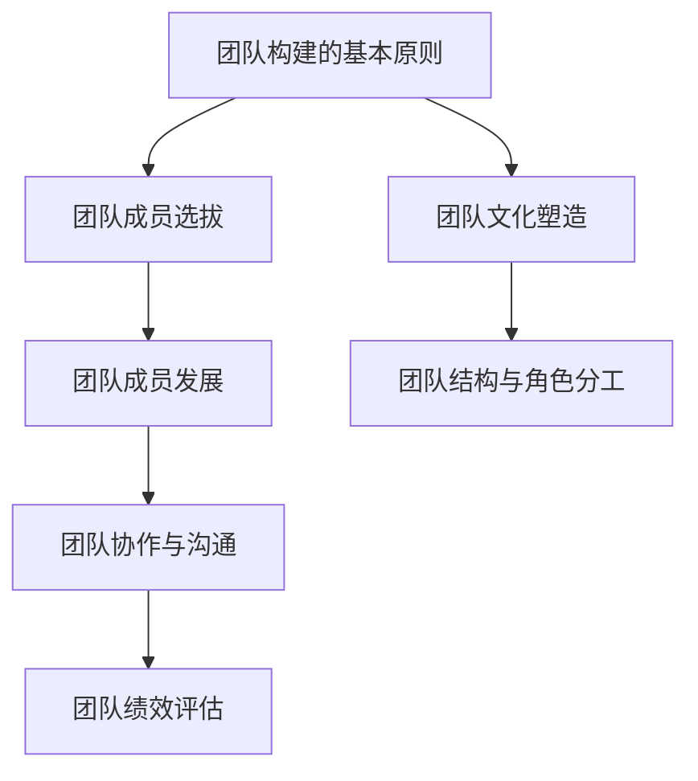
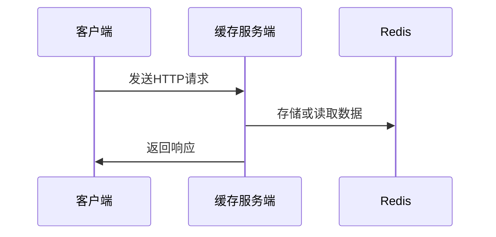

                 

### 文章标题

《技术招聘与面试：P9工程师的团队构建之道》

### 关键词

技术招聘、面试技巧、团队构建、P9工程师、面试策略、团队协作、绩效评估、领导力、项目管理

### 摘要

本文旨在探讨如何构建一个高效的P9工程师团队，从技术招聘、面试技巧、团队协作到绩效评估等各个环节进行全面剖析。文章首先阐述了P9工程师的角色定位和团队构建的基本原则，然后详细介绍了团队成员选拔、发展、协作与沟通以及绩效评估的方法。同时，文章还探讨了面试准备、面试过程、面试策略以及常见问题与应对策略。最后，通过实际案例和最佳实践，为P9工程师的团队构建提供了切实可行的建议。

---

### 文章目录大纲

#### 第一部分：团队构建的核心要素

**第1章 团队构建的基本原则**

- **1.1 团队构建的基本原则**
  - **1.1.1 P9工程师的角色定位**
  - **1.1.2 团队文化塑造的重要性**
  - **1.1.3 团队结构与角色分工**

- **1.2 团队成员选拔**
  - **1.2.1 招聘流程与策略**
    - **1.2.1.1 简历筛选技巧**
    - **1.2.1.2 面试准备与设计**
    - **1.2.1.3 面试技巧与评估**
  - **1.2.2 选拔标准与评估方法**

- **1.3 团队成员发展**
  - **1.3.1 员工培训与发展计划**
    - **1.3.1.1 技能提升培训**
    - **1.3.1.2 职业发展规划**
  - **1.3.2 员工激励与留任策略**

- **1.4 团队协作与沟通**
  - **1.4.1 团队协作工具与平台**
  - **1.4.2 沟通技巧提升**
  - **1.4.3 建立有效的沟通机制**

- **1.5 团队绩效评估**
  - **1.5.1 绩效评估指标设定**
  - **1.5.2 绩效评估反馈与改进**

#### 第二部分：面试技巧与策略

**第2章 面试技巧与策略**

- **2.1 面试准备**
  - **2.1.1 了解岗位需求**
  - **2.1.2 熟悉公司文化与价值观**
  - **2.1.3 准备面试资料**

- **2.2 面试过程**
  - **2.2.1 自我介绍**
  - **2.2.2 行为面试**
  - **2.2.3 技术面试**
  - **2.2.4 面试结束后的后续沟通**

- **2.3 面试策略**
  - **2.3.1 提升面试成功率的关键点**
  - **2.3.2 面试中表现出色**
  - **2.3.3 面试后跟踪与反馈**

- **2.4 面试常见问题与应对策略**
  - **2.4.1 技术性问题**
  - **2.4.2 行为性问题**

#### 第三部分：P9工程师的团队构建实践

**第3章 P9工程师的团队构建实践**

- **3.1 P9工程师的领导力构建**
  - **3.1.1 领导力的定义与重要性**
  - **3.1.2 领导风格与团队管理**
  - **3.1.3 领导力发展路径**

- **3.2 高效团队建设**
  - **3.2.1 团队成员的角色与责任**
  - **3.2.2 团队协作的关键要素**
  - **3.2.3 团队沟通的有效性**

- **3.3 团队文化打造**
  - **3.3.1 团队文化的重要性**
  - **3.3.2 塑造积极向上团队文化的方法**
  - **3.3.3 团队文化评估与优化**

- **3.4 团队项目管理**
  - **3.4.1 项目管理的基本概念**
  - **3.4.2 项目管理的方法与工具**
  - **3.4.3 项目风险管理**

- **3.5 团队成员成长与职业发展**
  - **3.5.1 员工培训与发展计划**
  - **3.5.2 职业发展规划与激励**
  - **3.5.3 员工晋升与留任策略**

#### 附录

- **附录A：招聘流程与模板**
  - **A.1 招聘流程概述**
  - **A.2 招聘计划模板**
  - **A.3 面试问题模板**

- **附录B：面试准备资料**
  - **B.1 自我介绍模板**
  - **B.2 技术面试准备资料**
  - **B.3 行为面试准备资料**

- **附录C：团队协作与沟通工具**
  - **C.1 常用团队协作工具**
  - **C.2 沟通技巧提升**
  - **C.3 团队协作案例分析**

---

接下来，我们将按照文章目录大纲，逐步展开每个章节的内容，深入探讨技术招聘与面试、团队构建实践等核心主题。

---

### 第一部分：团队构建的核心要素

#### 第1章 团队构建的基本原则

在构建一个高效的P9工程师团队时，首先需要明确团队构建的基本原则。这些原则不仅指导团队成员的选拔和发展，还影响团队的协作和沟通，最终决定团队的整体绩效。

### 1.1 团队构建的基本原则

**1.1.1 P9工程师的角色定位**

P9工程师通常在公司中担任高级技术领导或技术总监的角色。他们不仅需要具备深厚的技术背景，还需要具备卓越的领导能力和项目管理能力。以下是P9工程师的几个关键角色：

1. **技术领导**：P9工程师是团队中的技术权威，负责制定技术战略和架构，推动技术革新。
2. **项目管理**：他们需要协调和管理团队的项目，确保项目按时、按质完成。
3. **团队协作**：P9工程师是团队内部的桥梁，负责解决团队内部的技术难题，促进成员之间的协作。
4. **人才发展**：他们需要关注团队成员的成长，提供培训和发展机会，帮助团队成员提升技能。

**1.1.2 团队文化塑造的重要性**

团队文化是团队的精神内核，对团队成员的行为和决策产生深远影响。一个积极、开放的团队文化可以促进成员之间的信任和合作，提高团队的凝聚力。以下是构建团队文化的几个关键点：

1. **共同目标**：团队需要明确共同的目标和愿景，让每个成员都清楚自己的工作对团队的贡献。
2. **透明沟通**：鼓励团队成员之间的开放沟通，建立有效的沟通渠道和机制。
3. **信任与尊重**：尊重团队成员的意见和贡献，建立信任，减少误解和冲突。
4. **激励与创新**：为团队成员提供积极的激励，鼓励创新思维和尝试新方法。

**1.1.3 团队结构与角色分工**

一个高效的团队需要明确的团队结构和角色分工。P9工程师团队通常包括以下角色：

1. **技术主管**：负责技术方向的规划和管理，协调团队成员的工作。
2. **开发工程师**：负责具体项目的开发工作，解决技术难题。
3. **测试工程师**：负责对项目进行质量保证，确保项目符合预期质量标准。
4. **运维工程师**：负责系统的部署和维护，确保系统稳定运行。
5. **产品经理**：负责产品规划和需求分析，确保项目符合用户需求。

通过明确团队结构和角色分工，可以确保每个成员都能在自己的领域内发挥最大的作用，提高团队的整体效率。

---

在接下来的章节中，我们将深入探讨团队成员选拔、发展、协作与沟通以及绩效评估的方法，帮助读者构建一个高效的P9工程师团队。请继续关注下一章节的内容。

---

### 1.2 团队成员选拔

团队成员选拔是构建高效团队的重要环节，直接关系到团队的技术实力和协作效果。在这一章节中，我们将详细讨论招聘流程与策略、选拔标准与评估方法，以及简历筛选技巧、面试准备与设计、面试技巧与评估等内容。

#### 1.2.1 招聘流程与策略

招聘流程包括职位发布、简历筛选、面试安排、面试过程和录用决策等环节。以下是一个典型的招聘流程：

1. **职位发布**：根据团队需求，确定职位名称、职责描述、任职要求等，并通过招聘网站、社交媒体、内部推荐等渠道发布招聘信息。

2. **简历筛选**：根据职位要求，对收到的简历进行初步筛选，剔除不符合条件的候选人。

3. **面试安排**：对筛选出的候选人进行面试安排，包括初步面试、技术面试、领导面试等。

4. **面试过程**：候选人参加面试，面试官根据面试情况对候选人进行评估。

5. **录用决策**：面试结束后，根据候选人的面试表现和团队需求，做出录用决策。

在招聘过程中，需要注意以下几点策略：

- **精准定位岗位需求**：明确岗位的核心职责和技能要求，确保招聘到的候选人能够胜任工作。
- **广泛发布招聘信息**：利用多种渠道发布招聘信息，扩大招聘范围，提高候选人的多样性。
- **合理控制面试环节**：合理安排面试环节，避免过多的面试环节导致候选人流失。
- **注重面试质量**：提高面试官的面试技巧，确保面试过程的公正性和专业性。

#### 1.2.2 选拔标准与评估方法

选拔标准是衡量候选人是否符合岗位要求的重要依据。以下是一些常见的选拔标准：

1. **技术能力**：评估候选人的编程技能、数据结构与算法能力、系统设计与架构能力等。
2. **工作经验**：评估候选人的相关工作经验，特别是在复杂项目中的角色和贡献。
3. **沟通能力**：评估候选人的表达能力和沟通技巧，确保候选人能够有效沟通和协作。
4. **学习能力**：评估候选人的学习能力和适应新环境的能力，确保候选人能够快速融入团队。
5. **团队合作精神**：评估候选人的团队合作精神和责任心，确保候选人能够与团队成员协作。

评估方法主要包括以下几种：

1. **技术面试**：通过技术面试，评估候选人的技术能力和解决问题的能力。技术面试可以包括编程测试、算法面试、系统设计面试等。

2. **行为面试**：通过行为面试，评估候选人的工作经验、沟通能力、学习能力等。行为面试可以采用STAR法则（Situation, Task, Action, Result），让候选人描述他们在具体情境下的表现和成果。

3. **案例分析和项目经历**：通过分析候选人在过往项目中的案例和项目经历，评估候选人的实际工作能力和团队协作能力。

4. **团队合作测试**：通过团队合作测试，模拟实际工作场景，评估候选人在团队中的合作能力和沟通技巧。

#### 1.2.1.1 简历筛选技巧

简历筛选是招聘流程的第一步，对于筛选出合适的候选人至关重要。以下是一些简历筛选的技巧：

1. **关键词匹配**：根据职位要求，筛选包含关键技术的简历，例如“大数据”、“云计算”、“人工智能”等。

2. **经验筛选**：根据职位要求，筛选具有相关工作经验的候选人。例如，对于P9工程师岗位，可以筛选具有5年以上相关工作经验的候选人。

3. **量化成果**：优先考虑能够量化自己成果的候选人，例如通过具体的数据或业绩指标展示自己的能力。

4. **突出技能**：筛选时注意候选人突出自己的技能，例如掌握的编程语言、框架、工具等。

5. **注意细节**：仔细审查简历中的细节，例如错别字、格式不规范等，这些可能反映出候选人的工作态度和细心程度。

#### 1.2.1.2 面试准备与设计

面试是评估候选人能力的重要环节，面试准备和设计的好坏直接影响到面试的效果。以下是一些面试准备和设计的建议：

1. **明确面试目标**：在面试前，明确面试的目标和预期结果，确保面试过程中的问题和讨论能够围绕这些目标展开。

2. **准备面试问题**：根据职位要求和候选人的背景，设计有针对性的面试问题。面试问题可以分为技术问题、行为问题、情景问题等。

3. **模拟面试场景**：在面试前，可以模拟面试场景，让面试官和候选人都能够更好地准备面试。

4. **评估标准统一**：确保所有面试官使用统一的评估标准和问题，避免主观偏见和不公平评估。

5. **提供必要的资料**：在面试前，为候选人提供相关的资料，例如公司介绍、项目案例等，帮助候选人更好地了解公司和岗位。

#### 1.2.1.3 面试技巧与评估

面试技巧直接影响面试的效果和候选人的体验。以下是一些面试技巧和评估方法：

1. **积极倾听**：在面试过程中，积极倾听候选人的回答，确保理解候选人的观点和思路。

2. **提问技巧**：通过开放式问题，引导候选人深入讨论和展示自己的能力和经验。

3. **观察行为**：在面试过程中，观察候选人的行为和反应，例如表达方式、眼神交流、回答问题的速度和逻辑性等。

4. **情境模拟**：通过情境模拟问题，评估候选人在实际工作场景中的表现和解决问题的能力。

5. **综合评估**：在面试结束后，综合评估候选人的表现，考虑技术能力、沟通能力、团队合作精神等多方面因素，做出客观、公正的评估。

---

在接下来的章节中，我们将继续讨论团队成员的发展、协作与沟通以及绩效评估的方法，帮助读者构建一个高效、协作的P9工程师团队。请继续关注下一章节的内容。

---

### 1.3 团队成员发展

团队成员的发展是构建高效团队的关键因素之一。通过有效的员工培训与发展计划、激励与留任策略，可以提升团队的整体技能水平和工作积极性，确保团队成员在职业生涯中不断成长和进步。

#### 1.3.1 员工培训与发展计划

**1.3.1.1 技能提升培训**

技能提升培训是团队成员发展的重要环节。通过系统化的培训，可以提升团队成员的专业技能和解决问题的能力。以下是技能提升培训的几个关键步骤：

1. **需求分析**：首先，分析团队成员的现有技能水平和岗位要求，确定需要提升的技能领域。

2. **培训计划制定**：根据需求分析结果，制定详细的培训计划，包括培训内容、培训时间、培训方式等。

3. **培训内容**：培训内容应涵盖最新的技术趋势、最佳实践、工具使用、编程技巧等。例如，对于P9工程师，可以培训大数据处理、人工智能应用、云计算架构等方面的知识。

4. **培训方式**：培训方式可以包括内部培训、外部培训、在线课程、研讨会等。根据实际情况和团队成员的接受度，选择最适合的培训方式。

5. **培训评估**：培训结束后，对团队成员的技能提升效果进行评估，确保培训目标的实现。

**1.3.1.2 职业发展规划**

职业发展规划是团队成员个人成长的重要指导。一个明确的职业发展规划可以帮助团队成员明确自己的职业目标，制定合理的成长路径。以下是职业发展规划的几个关键步骤：

1. **自我评估**：团队成员进行自我评估，分析自己的兴趣、优势和不足，确定职业发展方向。

2. **制定目标**：根据自我评估结果，设定短期和长期的职业目标。短期目标可以是提升某一技能，长期目标可以是成为技术专家或团队领导。

3. **成长路径**：根据目标，制定具体的成长路径，包括需要掌握的技能、需要参加的培训、需要完成的重大项目等。

4. **定期评估**：定期评估职业发展规划的执行情况，根据实际情况进行调整和优化。

5. **领导指导**：团队领导应关注团队成员的职业发展，提供指导和帮助，确保成员能够顺利实现职业目标。

#### 1.3.2 员工激励与留任策略

员工激励和留任策略是保持团队成员积极性和稳定性的重要手段。以下是一些有效的员工激励与留任策略：

**1. **竞争性的薪酬待遇**

提供具有竞争力的薪酬待遇，确保团队成员的收入水平与市场接轨。同时，可以根据团队成员的贡献和绩效，给予额外的奖励和福利，激励团队成员更积极地工作。

**2. **职业发展机会**

为团队成员提供丰富的职业发展机会，包括晋升通道、项目机会、培训机会等。这不仅可以激发团队成员的工作热情，还可以帮助他们实现职业成长。

**3. **工作与生活的平衡**

关注团队成员的工作与生活平衡，提供灵活的工作时间和远程工作机会，减轻他们的工作压力。同时，鼓励团队成员参加健康活动和社交活动，提高他们的生活质量。

**4. **企业文化与价值观**

建立积极向上的企业文化，与团队成员共同价值观。通过企业文化建设，增强团队成员的归属感和凝聚力，提高团队的稳定性。

**5. **认可与奖励**

定期对团队成员的出色表现进行认可和奖励，包括表彰大会、奖金、荣誉称号等。这不仅可以激励团队成员，还可以树立榜样，促进团队整体进步。

**6. **沟通与反馈**

建立良好的沟通机制，定期与团队成员进行沟通，了解他们的需求和意见。同时，及时给予反馈，帮助团队成员找到自己的优势和改进方向。

---

通过有效的员工培训与发展计划、激励与留任策略，可以提升团队成员的专业技能和职业素养，提高团队的整体绩效。在接下来的章节中，我们将探讨团队协作与沟通的方法，帮助读者构建一个高效、协作的P9工程师团队。请继续关注下一章节的内容。

---

### 1.4 团队协作与沟通

团队协作与沟通是构建高效P9工程师团队的关键要素之一。在一个高效团队中，团队成员需要具备良好的协作能力和沟通技巧，以确保项目顺利进行并达成预期目标。以下将详细探讨团队协作工具与平台、沟通技巧提升以及建立有效的沟通机制等内容。

#### 1.4.1 团队协作工具与平台

**1.4.1.1 常用团队协作工具**

在现代企业中，有许多团队协作工具可以帮助团队成员提高工作效率和协作效果。以下是一些常用的团队协作工具：

1. **项目管理工具**：如Trello、Asana、Jira等，可以帮助团队规划和管理项目任务，确保项目按时、按质完成。
2. **文档协作工具**：如Google Docs、Notion、Confluence等，支持多人实时协作编辑文档，提高文档共享和更新效率。
3. **沟通工具**：如Slack、Microsoft Teams、Zoom等，提供即时消息、视频会议、电话会议等功能，方便团队成员进行实时沟通和协作。
4. **代码协作工具**：如Git、GitHub、GitLab等，支持代码版本控制、协作开发、代码审查等功能，提高开发效率和代码质量。
5. **知识库工具**：如Wiki、Kibana等，可以帮助团队建立和维护知识库，方便团队成员快速查找和获取所需信息。

**1.4.1.2 团队协作软件对比**

在选择团队协作工具时，可以根据团队的具体需求进行对比和选择。以下是一些团队协作软件的对比：

1. **Trello vs Asana**：Trello更侧重于任务管理和可视化，适合小型团队或项目；Asana则提供了更多的任务管理和协作功能，适合大型团队或复杂项目。
2. **Google Docs vs Notion**：Google Docs支持实时协作和文档共享，适合日常办公；Notion则提供了更灵活的笔记和组织方式，适合构建知识库和项目文档。
3. **Slack vs Microsoft Teams**：Slack提供了丰富的第三方集成和自定义功能，适合小团队或灵活的沟通需求；Microsoft Teams则提供了更全面的协作功能，包括聊天、视频会议、文件共享等，适合大型团队或企业级应用。

**1.4.1.3 团队协作软件选择策略**

在选择团队协作软件时，可以考虑以下策略：

1. **需求分析**：根据团队的具体需求和项目特点，分析需要的功能和特性。
2. **试用评估**：试用几个候选工具，比较其功能、易用性和稳定性，选择最适合的工具。
3. **团队培训**：为团队成员提供必要的培训，确保他们能够熟练使用工具，提高协作效率。
4. **持续优化**：根据团队使用过程中的反馈和需求，不断优化和调整工具的使用，确保其能够满足团队的需求。

#### 1.4.2 沟通技巧提升

良好的沟通技巧是团队协作的基础。以下是一些提升沟通技巧的方法：

**1. **明确沟通目标**

在沟通前，明确沟通的目标和预期结果，确保沟通有针对性。可以通过以下方式明确沟通目标：

- **目标陈述**：将沟通目标简洁明了地陈述出来，例如“本次会议的目标是讨论项目进展和下一步计划”。
- **预期结果**：明确沟通结束后希望达成的结果，例如“通过讨论，确定项目的关键里程碑和时间表”。

**2. **倾听与反馈**

倾听是有效沟通的关键。以下是一些倾听和反馈的技巧：

- **积极倾听**：在对方发言时，保持专注，避免打断，确保理解对方的观点和意图。
- **确认理解**：在对方发言结束后，用自己的话复述对方的观点，确保理解正确，例如“我理解您的意思是……，请问是否正确？”
- **给予反馈**：在沟通过程中，给予积极的反馈，例如“我同意您的观点”、“这是一个很好的想法”，鼓励对方继续表达。

**3. **表达清晰**

清晰的表达是有效沟通的关键。以下是一些表达清晰的技巧：

- **简洁明了**：用简洁明了的语言表达观点，避免使用复杂的术语和冗长的句子。
- **结构清晰**：按照逻辑顺序组织语言，确保表达的结构清晰，例如先介绍背景，再阐述观点，最后提出建议。
- **示例说明**：使用具体的例子或数据来支持观点，使表达更加有说服力。

**4. **应对冲突**

在团队协作中，冲突是不可避免的。以下是一些应对冲突的技巧：

- **保持冷静**：遇到冲突时，保持冷静，避免情绪化的反应。
- **客观分析**：从客观的角度分析冲突的原因和影响，寻找解决方案。
- **寻求共识**：与对方沟通，寻求共同点和共识，以达成一致意见。

#### 1.4.3 建立有效的沟通机制

建立有效的沟通机制是团队协作的重要保障。以下是一些建立沟通机制的方法：

**1. **定期会议**

定期召开团队会议，讨论项目进展、问题解决、决策制定等。会议可以包括以下内容：

- **项目进展汇报**：团队成员汇报项目进展，讨论遇到的问题和解决方案。
- **决策制定**：讨论项目关键决策，确保团队成员对决策有共同的理解和认同。
- **经验分享**：团队成员分享工作经验和最佳实践，促进团队知识共享和成长。

**2. **沟通渠道**

建立多种沟通渠道，方便团队成员之间的信息交流和协作。以下是一些常见的沟通渠道：

- **即时消息**：通过即时消息工具（如Slack、Microsoft Teams）进行实时沟通和协作。
- **邮件**：用于正式沟通和文件传输。
- **电话和视频会议**：用于远程团队之间的沟通和协作。

**3. **信息共享**

建立信息共享平台，方便团队成员获取和共享信息。以下是一些信息共享的方法：

- **知识库**：建立知识库，存储项目文档、技术文档、经验总结等，方便团队成员查找和参考。
- **共享文件夹**：在文件共享平台上建立共享文件夹，方便团队成员上传和下载文件。
- **在线论坛**：建立在线论坛，方便团队成员交流和讨论问题。

**4. **反馈机制**

建立反馈机制，及时收集和处理团队成员的意见和建议。以下是一些反馈机制的方法：

- **定期反馈**：定期收集团队成员的反馈，例如通过问卷调查、面对面交流等方式。
- **即时反馈**：对于团队成员的即时反馈，及时回应和处理，确保问题得到解决。
- **反馈汇总**：定期汇总团队成员的反馈，分析问题根源，制定改进措施。

---

通过有效的团队协作工具与平台、沟通技巧提升以及建立有效的沟通机制，可以提升团队的整体协作效果和工作效率。在接下来的章节中，我们将探讨团队绩效评估的方法，帮助读者构建一个高效、协作的P9工程师团队。请继续关注下一章节的内容。

---

### 1.5 团队绩效评估

团队绩效评估是衡量团队工作效率和质量的重要手段，对于激励团队成员、提升团队绩效具有重要意义。在这一章节中，我们将详细讨论绩效评估指标设定、绩效评估反馈与改进的方法。

#### 1.5.1 绩效评估指标设定

设定合理的绩效评估指标是绩效评估的基础。以下是一些常见的绩效评估指标：

**1. 项目完成情况**

项目完成情况是衡量团队绩效的重要指标。具体包括：

- **进度**：项目进度是否按计划进行，是否按时交付。
- **质量**：项目质量是否达到预期标准，是否存在严重缺陷。
- **成本**：项目成本是否在预算范围内，是否存在超支情况。

**2. 个人贡献**

个人贡献是衡量团队成员在项目中的表现和价值的指标。具体包括：

- **任务完成**：团队成员是否按时、按质完成分配的任务。
- **问题解决**：团队成员是否能够有效解决项目中的技术难题。
- **协作**：团队成员是否积极参与团队协作，与其他成员合作愉快。

**3. 个人能力提升**

个人能力提升是衡量团队成员成长和发展的指标。具体包括：

- **技能掌握**：团队成员是否掌握了新的技能和知识。
- **培训参与**：团队成员是否积极参与培训和知识分享。
- **职业发展**：团队成员是否在职业发展上取得了显著进步。

**4. 团队氛围**

团队氛围是衡量团队整体工作氛围和团队凝聚力的指标。具体包括：

- **沟通协作**：团队成员之间的沟通是否顺畅，是否能够有效协作。
- **团队精神**：团队成员是否具有团队精神，愿意为团队目标努力。
- **冲突解决**：团队成员是否能够积极解决团队内部冲突，保持和谐。

#### 1.5.1.1 个人绩效评估

个人绩效评估是绩效评估的重要组成部分，以下是一些个人绩效评估的方法：

- **360度评估**：通过团队成员、上级领导、同事等多个角度对个人绩效进行评估，确保评估的全面性和客观性。
- **KPI（关键绩效指标）**：设定与岗位和项目目标相关的关键绩效指标，对团队成员的绩效进行量化评估。
- **行为观察**：通过观察团队成员在工作中的表现，评估其工作态度和能力。

#### 1.5.1.2 团队绩效评估

团队绩效评估是对整个团队在项目中的表现进行评估，以下是一些团队绩效评估的方法：

- **项目回顾**：在项目结束后，对项目进行回顾，分析项目成功和失败的原因，评估团队整体绩效。
- **团队绩效指标**：设定与团队目标和项目目标相关的绩效指标，对团队整体绩效进行评估。
- **团队氛围评估**：通过问卷调查、面对面交流等方式，评估团队的整体氛围和凝聚力。

#### 1.5.2 绩效评估反馈与改进

绩效评估反馈是绩效评估的重要环节，以下是一些反馈与改进的方法：

**1. 定期反馈**

- **定期会议**：定期召开绩效反馈会议，对团队成员的绩效进行评估和讨论。
- **书面反馈**：将绩效评估结果以书面形式反馈给团队成员，让他们了解自己的绩效表现。

**2. 现场反馈**

- **面对面反馈**：与团队成员面对面交流，及时反馈绩效评估结果，解答他们的疑问。
- **即时反馈**：对于团队成员的即时表现，及时给予反馈，鼓励他们的优点，指出需要改进的地方。

**3. 反馈机制**

- **反馈渠道**：建立多种反馈渠道，如问卷调查、面对面交流、邮件等，方便团队成员表达意见和建议。
- **反馈汇总**：定期汇总团队成员的反馈，分析问题根源，制定改进措施。

**4. 改进措施**

- **培训与发展**：针对团队成员的不足，提供相应的培训和发展机会，帮助他们提升技能。
- **优化流程**：根据绩效评估结果和反馈，优化工作流程和团队协作方式，提高团队整体绩效。
- **激励措施**：针对表现优秀的团队成员，给予激励措施，如奖金、荣誉称号等，激发他们的工作积极性。

---

通过合理的绩效评估指标设定和有效的绩效评估反馈与改进，可以确保团队绩效的持续提升，助力团队构建和发展。在接下来的章节中，我们将探讨面试技巧与策略，帮助读者更好地应对技术招聘和面试环节。请继续关注下一章节的内容。

---

### 第二部分：面试技巧与策略

面试是技术招聘过程中至关重要的一环，它不仅是评估候选人技术能力和综合素质的平台，也是候选人对公司和团队深入了解的机会。在这一部分中，我们将详细探讨面试准备、面试过程、面试策略以及常见问题与应对策略，帮助读者在面试中脱颖而出。

#### 2.1 面试准备

面试准备是成功面试的关键步骤，以下是一些面试准备的建议：

**2.1.1 了解岗位需求**

在面试前，深入了解岗位需求，包括职位描述、岗位职责、任职要求等。这有助于你更好地准备面试内容，确保你的技能和经验与岗位需求匹配。

**2.1.2 熟悉公司文化与价值观**

了解公司的文化、价值观和业务方向，这有助于你在面试中展现自己与公司文化的契合度，同时也能让你更好地判断这个岗位是否适合自己的职业规划。

**2.1.3 准备面试资料**

准备一些面试资料，包括简历、作品集、技术文档等，以便在面试过程中展示你的技能和项目经验。

**2.1.4 复习基础知识**

复习与岗位相关的技术基础，包括数据结构、算法、系统设计与架构等，确保能够在面试中回答相关问题。

#### 2.2 面试过程

面试过程包括自我介绍、行为面试、技术面试等环节，以下是一些具体的面试过程技巧：

**2.2.1 自我介绍**

在自我介绍时，简明扼要地介绍自己的基本信息、教育背景、工作经历以及与岗位相关的技能和成就。注意突出自己的亮点和与岗位相关的经验。

**2.2.2 行为面试**

行为面试是评估候选人以往行为和经验的过程。回答行为面试问题时，可以使用STAR法则（Situation, Task, Action, Result）来构建回答：

- **Situation**：描述背景情境。
- **Task**：描述任务或目标。
- **Action**：描述你采取的具体行动。
- **Result**：描述结果和你的贡献。

**2.2.3 技术面试**

技术面试主要评估候选人的编程能力、算法理解、系统设计能力等。以下是一些建议：

- **理解问题**：在回答技术问题前，确保你完全理解问题的要求和背景。
- **逻辑清晰**：回答问题时，保持逻辑清晰，逐步展开思路。
- **代码演示**：对于编程问题，可以适当演示代码，展示你的编程能力。
- **案例分析**：举例说明你在过往项目中遇到的类似问题，以及你是如何解决的。

#### 2.3 面试策略

在面试过程中，采取适当的策略可以提升面试成功率。以下是一些面试策略：

**2.3.1 提升面试成功率的关键点**

- **积极准备**：充分准备面试，包括复习基础知识、准备面试问题等。
- **展现自信**：在面试中保持自信，用积极的态度和自信的语言表达自己。
- **了解公司和岗位**：深入了解公司和岗位，展示自己对公司和岗位的热情。
- **沟通能力**：展现良好的沟通能力，包括倾听、表达和逻辑思维。

**2.3.2 面试中表现出色**

- **展示专业能力**：通过具体项目经验和技能展示你的专业能力。
- **积极互动**：与面试官保持积极互动，提问并表达自己的观点。
- **适应面试环境**：适应面试环境，保持镇定，避免紧张。

**2.3.3 面试后跟踪与反馈**

面试后，及时进行跟踪和反馈，以下是一些建议：

- **感谢信**：发送一封感谢信，表达对面试官时间和机会的感激。
- **反馈收集**：如果有需要，可以主动询问面试官对面试过程的反馈，以便改进。
- **跟进进度**：适时跟进面试进度，了解面试结果，准备下一轮面试。

#### 2.4 面试常见问题与应对策略

在面试中，常见的一些问题包括技术问题、行为问题等。以下是一些常见问题的应对策略：

**2.4.1 技术性问题**

- **数据结构与算法问题**：准备一些常见的算法和数据结构问题，例如排序算法、查找算法、树结构等，并熟悉相关的实现和复杂度分析。
- **系统设计与架构问题**：准备一些系统设计和架构问题，例如如何设计一个高并发系统、如何处理大数据等，并展示你的设计思路和优化方案。

**2.4.2 行为问题**

- **STAR法则**：使用STAR法则回答行为问题，确保回答具有情境性、任务性、行动性和结果性。
- **突出成就**：在回答行为问题时，突出自己的成就和贡献，展示你的能力和价值。

**2.4.3 面试官的反问策略**

在面试过程中，面试官可能会提出一些反问来深入了解你的能力和兴趣。以下是一些建议：

- **深入思考**：对于面试官的问题，深入思考，确保回答的深度和广度。
- **展示兴趣**：展示你对岗位和公司的兴趣，说明为什么这个岗位适合你，以及你希望在这个岗位上实现什么样的职业发展。
- **积极提问**：在面试官提问后，可以适当提问，展示你对公司和岗位的深入了解。

---

通过充分的面试准备、有效的面试策略以及应对常见问题的技巧，你可以在面试中脱颖而出，增加面试成功率。在接下来的章节中，我们将探讨P9工程师的团队构建实践，帮助读者将理论应用于实际工作中。请继续关注下一章节的内容。

---

### 2.4 面试常见问题与应对策略

在面试过程中，面试官可能会提出各种问题来全面评估你的技能、经验和适应性。以下是一些常见的面试问题及其应对策略：

#### 技术性问题

**数据结构与算法问题**

**问题示例：** 请实现一个二分查找算法，并解释其时间复杂度。

**应对策略：**
- **理解问题**：确保你完全理解问题的要求和背景。
- **代码演示**：在白板或代码编辑器中演示算法的实现。
- **解释逻辑**：详细解释算法的逻辑步骤，确保面试官理解。
- **时间复杂度**：解释算法的时间复杂度，并讨论可能的优化方法。

**系统设计与架构问题**

**问题示例：** 设计一个分布式缓存系统，如何保证数据的一致性和高可用性？

**应对策略：**
- **需求分析**：讨论系统的需求，包括数据规模、访问频率、性能要求等。
- **设计方案**：展示你的设计思路，包括组件、数据存储、同步机制等。
- **优化方案**：讨论可能的优化方案，如负载均衡、缓存一致性协议等。
- **风险分析**：分析潜在的风险和挑战，并提出应对措施。

#### 行为问题

**STAR法则**

**问题示例：** 描述一次你在团队中遇到冲突的经历，你是如何解决的？

**应对策略：**
- **情境（Situation）**：描述冲突的背景和情境。
- **任务（Task）**：描述你面临的任务和目标。
- **行动（Action）**：详细描述你采取的具体行动。
- **结果（Result）**：描述冲突的解决结果和你所取得的成就。

**问题解决能力的评估**

**问题示例：** 描述一次你在项目中遇到的技术难题，你是如何解决的？

**应对策略：**
- **具体案例**：选择一个具体的项目案例，展示你在遇到困难时的应对能力。
- **分析问题**：讨论你是如何分析问题的，包括问题定位、可能的原因等。
- **解决方案**：描述你采取的解决方案，包括技术手段、步骤和结果。
- **反思与改进**：讨论从这次经历中学到的教训和改进方向。

#### 面试官的反问策略

在面试过程中，面试官可能会提出一些反问来深入了解你的兴趣、动机和对公司的了解。以下是一些建议：

**深入思考**

**问题示例：** 你为什么选择这个岗位？

**应对策略：**
- **结合兴趣与能力**：说明这个岗位如何符合你的兴趣和技能，以及你为什么对这个岗位感兴趣。
- **展示热情**：表达你对岗位的热情，展示你对职业发展的期望。

**展示兴趣**

**问题示例：** 你对我们公司的了解有多少？

**应对策略：**
- **公司背景**：简要介绍公司的历史、业务方向和市场份额。
- **产品与服务**：描述公司的核心产品或服务，以及你在这些产品中的角色。
- **行业趋势**：讨论行业趋势和公司在行业中的地位。

**积极提问**

**问题示例：** 这个岗位有哪些挑战和机遇？

**应对策略：**
- **具体问题**：提出一些具体的问题，如项目进度、团队结构、培训计划等。
- **深入思考**：展示你对岗位和公司运营的深入思考，提出具有建设性的问题。

---

通过有效的应对策略，你可以在面试中更好地展示自己的能力和适应性，提高面试成功率。在面试前做好充分的准备，熟悉常见问题及其应对策略，将有助于你在面试中表现更加出色。在接下来的章节中，我们将探讨P9工程师的团队构建实践，将理论应用于实际工作。请继续关注下一章节的内容。

---

### 第三部分：P9工程师的团队构建实践

在技术领域，P9工程师作为高级技术人才，他们在团队构建中扮演着关键角色。本部分将重点探讨P9工程师的领导力构建、高效团队建设、团队文化打造、团队项目管理以及团队成员成长与职业发展等实践内容，通过这些实践帮助读者构建一个高效、协作的P9工程师团队。

#### 3.1 P9工程师的领导力构建

P9工程师在团队中不仅仅是技术权威，更是领导者和管理者。领导力的构建对于团队的成功至关重要。以下是P9工程师领导力构建的几个关键方面：

**3.1.1 领导力的定义与重要性**

领导力是指个人在团队中通过影响力引导和激励团队成员，共同实现目标的能力。对于P9工程师来说，领导力的重要性体现在以下几个方面：

- **战略规划**：P9工程师需要具备制定团队技术战略和规划的能力，确保团队的工作与公司整体战略保持一致。
- **团队协作**：领导力有助于促进团队成员之间的协作，提高团队的整体工作效率。
- **人才培养**：P9工程师需要关注团队成员的成长，培养新一代的技术领导者。
- **决策能力**：领导力强调决策能力，帮助团队在面对挑战时做出明智的决策。

**3.1.2 领导风格与团队管理**

P9工程师的领导风格对于团队氛围和工作效率有着直接影响。以下是几种常见的领导风格：

- **民主式领导**：鼓励团队成员参与决策，充分发挥集体的智慧和创造力。
- **权威式领导**：在确保团队目标明确的前提下，由领导做出决策，并要求团队成员执行。
- **参与式领导**：领导与团队成员共同参与决策过程，尊重每个成员的意见和建议。

在团队管理中，P9工程师需要关注以下几个方面：

- **沟通**：建立有效的沟通渠道，确保信息的及时传递和团队成员的充分参与。
- **激励**：根据团队成员的特点和需求，采取适当的激励措施，提高工作积极性。
- **反馈**：定期对团队成员的工作进行反馈，帮助他们识别优点和不足，指导其改进。

**3.1.3 领导力发展路径**

P9工程师的领导力发展不是一蹴而就的，需要经过长期的学习和实践。以下是领导力发展的一些路径：

- **自我提升**：通过阅读领导力相关书籍、参加培训课程等，提升自己的管理能力和领导技巧。
- **经验积累**：在项目中担任关键角色，通过实际工作经验积累领导力。
- **导师指导**：寻求有经验的领导者作为导师，获取指导和建议。
- **反馈与改进**：不断收集团队成员的反馈，及时调整自己的领导方法和风格。

#### 3.2 高效团队建设

高效团队是P9工程师团队成功的关键。以下是高效团队建设的一些实践方法：

**3.2.1 团队成员的角色与责任**

明确团队成员的角色和责任是构建高效团队的基础。以下是常见团队成员角色：

- **技术主管**：负责技术方向的规划和决策，协调团队成员的工作。
- **开发工程师**：负责具体项目的开发工作，解决技术难题。
- **测试工程师**：负责对项目进行质量保证，确保项目符合预期质量标准。
- **运维工程师**：负责系统的部署和维护，确保系统稳定运行。
- **产品经理**：负责产品规划和需求分析，确保项目符合用户需求。

每个团队成员都应明确自己的角色和责任，确保工作的高效开展。

**3.2.2 团队协作的关键要素**

团队协作是高效团队的核心。以下是团队协作的关键要素：

- **目标一致**：团队所有成员应明确共同的目标和愿景，确保工作方向一致。
- **信息共享**：建立信息共享平台，确保团队成员能够及时获取所需信息。
- **沟通顺畅**：建立有效的沟通机制，确保团队成员之间的信息传递和反馈。
- **分工明确**：明确每个成员的具体任务和责任，避免工作重叠和冲突。
- **互相支持**：团队成员应互相支持和帮助，共同应对困难和挑战。

**3.2.3 团队沟通的有效性**

良好的沟通是团队协作的基础。以下是提升团队沟通有效性的方法：

- **定期会议**：定期召开团队会议，讨论项目进展、问题解决、决策制定等。
- **明确沟通目标**：每次会议或沟通前，明确沟通的目标和预期结果。
- **积极倾听**：在沟通过程中，积极倾听对方的观点和意见，确保理解正确。
- **及时反馈**：及时给予反馈，确保沟通的及时性和有效性。
- **使用工具**：利用团队协作工具，如Slack、Jira等，提高沟通效率。

#### 3.3 团队文化打造

团队文化是团队的精神内核，对团队成员的行为和决策产生深远影响。以下是打造积极向上团队文化的方法：

**3.3.1 团队文化的重要性**

积极向上的团队文化有助于提高团队成员的凝聚力、工作满意度和工作效率。以下是团队文化的重要性：

- **凝聚力**：共同的团队文化能够增强团队成员之间的联系和信任。
- **工作满意度**：良好的团队文化能够提升团队成员的工作满意度和幸福感。
- **工作效率**：积极向上的团队文化能够提高团队的工作效率和创新力。

**3.3.2 塑造积极向上团队文化的方法**

以下是塑造积极向上团队文化的几种方法：

- **共同目标**：明确团队的目标和愿景，确保所有成员都明确自己的工作对团队的贡献。
- **透明沟通**：建立开放和透明的沟通机制，鼓励团队成员表达意见和建议。
- **尊重与信任**：尊重团队成员的意见和贡献，建立信任，减少误解和冲突。
- **激励与创新**：为团队成员提供积极的激励，鼓励创新思维和尝试新方法。
- **奖励与认可**：定期对团队成员的出色表现进行奖励和认可，提升团队的士气。

**3.3.3 团队文化评估与优化**

团队文化不是一成不变的，需要不断评估和优化。以下是团队文化评估与优化的一些方法：

- **问卷调查**：通过问卷调查了解团队成员对团队文化的感受和建议。
- **焦点小组**：组织焦点小组讨论，收集团队成员的反馈和建议。
- **案例分析**：分析团队在不同情境下的行为和决策，识别团队文化的优势和不足。
- **持续改进**：根据评估结果，制定改进措施，并持续跟踪和优化团队文化。

#### 3.4 团队项目管理

项目管理是P9工程师团队成功的关键环节。以下是团队项目管理的一些基本概念、方法和工具：

**3.4.1 项目管理的基本概念**

- **项目目标**：明确项目的目标，确保所有团队成员都清楚项目的最终成果。
- **项目范围**：界定项目的范围，明确项目的具体内容和预期成果。
- **项目进度**：监控项目进度，确保项目按计划进行。
- **项目成本**：控制项目成本，确保项目在预算范围内完成。
- **项目质量**：确保项目符合质量标准，满足用户需求。

**3.4.2 项目管理的方法与工具**

以下是几种常用的项目管理方法和工具：

- **瀑布模型**：一种线性顺序的开发方法，适用于需求明确、变化较少的项目。
- **敏捷开发**：一种迭代和增量的开发方法，适用于需求变化频繁、灵活性要求高的项目。
- **Scrum**：一种敏捷开发框架，强调团队协作和快速响应变化。
- **Jira**：一种流行的项目管理工具，支持任务管理、敏捷开发、团队协作等功能。

**3.4.3 项目风险管理**

项目风险管理是项目管理的重要组成部分。以下是项目风险管理的一些方法：

- **风险评估**：识别项目中的潜在风险，评估其影响和可能性。
- **风险应对策略**：制定应对策略，减少风险的影响。
- **风险监控**：持续监控项目风险，及时调整应对措施。
- **风险缓解**：采取措施缓解风险，降低风险发生的概率。

#### 3.5 团队成员成长与职业发展

团队成员的成长和职业发展是团队长期稳定和持续发展的基础。以下是团队成员成长与职业发展的一些策略：

**3.5.1 员工培训与发展计划**

员工培训与发展计划是提升团队成员技能和职业素养的重要手段。以下是员工培训与发展计划的几个方面：

- **技能培训**：根据团队成员的技能需求和职业发展方向，制定培训计划，提供技术培训、管理培训等。
- **内部导师**：建立内部导师制度，为团队成员提供指导和帮助，促进他们的成长。
- **外部学习**：鼓励团队成员参加外部培训和研讨会，扩大知识面和视野。

**3.5.2 职业发展规划与激励**

职业发展规划与激励是留住优秀人才、促进团队成员职业发展的重要措施。以下是职业发展规划与激励的几个方面：

- **职业规划**：帮助团队成员制定个人职业规划，明确职业目标和成长路径。
- **晋升通道**：建立明确的晋升通道，为团队成员提供职业发展的机会。
- **激励措施**：通过绩效奖励、荣誉称号、晋升等激励措施，激发团队成员的工作积极性和创造力。

**3.5.3 员工晋升与留任策略**

员工晋升与留任策略是确保团队成员长期稳定发展的关键。以下是员工晋升与留任策略的几个方面：

- **晋升机制**：建立公正透明的晋升机制，确保团队成员的晋升机会公平。
- **留任计划**：制定留任计划，通过薪酬福利、职业发展、团队氛围等措施，留住优秀人才。
- **员工反馈**：定期收集员工反馈，了解他们的需求和意见，不断优化留任策略。

---

通过以上实践，P9工程师可以构建一个高效、协作的团队，实现技术突破和业务成功。在接下来的章节中，我们将提供具体的招聘流程与模板、面试准备资料以及团队协作与沟通工具，帮助读者更好地实施这些实践。请继续关注下一章节的内容。

---

### 附录

在本附录中，我们将提供一些实用工具和模板，以帮助读者在实际工作中更好地实施前面章节中的策略和方法。这些内容包括招聘流程与模板、面试准备资料、团队协作与沟通工具等。

#### 附录A：招聘流程与模板

**A.1 招聘流程概述**

招聘流程通常包括职位发布、简历筛选、面试安排、面试过程和录用决策等环节。以下是一个典型的招聘流程概述：

1. **职位发布**：根据团队需求，确定职位名称、职责描述、任职要求等，并通过招聘网站、社交媒体、内部推荐等渠道发布招聘信息。
2. **简历筛选**：根据职位要求，对收到的简历进行初步筛选，剔除不符合条件的候选人。
3. **面试安排**：对筛选出的候选人进行面试安排，包括初步面试、技术面试、领导面试等。
4. **面试过程**：候选人参加面试，面试官根据面试情况对候选人进行评估。
5. **录用决策**：面试结束后，根据候选人的面试表现和团队需求，做出录用决策。

**A.2 招聘计划模板**

以下是一个招聘计划模板，可用于制定详细的招聘计划：

| 序号 | 招聘阶段     | 内容                                                         | 负责人 | 完成时间 |
| ---- | ------------ | ------------------------------------------------------------ | ------ | -------- |
| 1    | 职位发布     | 确定职位名称、职责描述、任职要求，发布招聘信息                 | HR     | 第1周    |
| 2    | 简历筛选     | 收集简历，进行初步筛选                                       | HR     | 第2周    |
| 3    | 初步面试     | 安排候选人与技术主管面试，评估候选人的技术能力               | HR     | 第3周    |
| 4    | 技术面试     | 安排候选人进行技术面试，评估候选人的项目经验和解决实际问题的能力 | HR     | 第4周    |
| 5    | 领导面试     | 安排候选人与公司领导面试，评估候选人的领导能力和团队匹配度   | HR     | 第5周    |
| 6    | 录用决策     | 根据面试结果，做出录用决策                                   | HR     | 第6周    |

**A.3 面试问题模板**

以下是一个面试问题模板，可用于设计面试问题：

| 序号 | 问题类别 | 问题内容                                                         | 目的           |
| ---- | -------- | ------------------------------------------------------------ | -------------- |
| 1    | 自我介绍 | 请简单介绍一下自己，包括教育背景、工作经历和职业规划。          | 了解候选人背景 |
| 2    | 技术能力 | 请描述一下你在某个技术领域的经验和成就。                       | 评估技术能力   |
| 3    | 项目经验 | 请描述一个你参与过的项目，包括项目背景、你的角色、项目成果和遇到的挑战。 | 评估项目经验   |
| 4    | 解决问题 | 请描述一个你解决过的技术难题，包括问题背景、解决方案和结果。    | 评估问题解决能力 |
| 5    | 团队协作 | 请描述一个你在团队中遇到的冲突，以及你是如何解决这个冲突的。   | 评估团队协作能力 |
| 6    | 职业规划 | 请谈谈你的职业规划，以及为什么选择我们公司。                   | 了解职业动机   |

#### 附录B：面试准备资料

以下是一些面试准备资料，可以帮助候选人更好地准备面试：

**B.1 自我介绍模板**

您好，我叫[姓名]，毕业于[学校]，主修[专业]。在过去的[工作年限]年里，我曾在[公司名称]担任[职位]，主要负责[职责]。我对技术充满热情，尤其在[技术领域]方面有丰富的实践经验。我的职业规划是成为一名技术专家，并在未来五年内带领团队完成[目标项目]。

**B.2 技术面试准备资料**

以下是一些技术面试的准备资料，涵盖常见的数据结构与算法、系统设计与架构等：

- **数据结构与算法**：复习常见的算法和数据结构，如数组、链表、栈、队列、二分查找、排序算法等。
- **系统设计与架构**：熟悉常见的系统架构设计模式，如分层架构、微服务架构、分布式架构等，并了解其优缺点和应用场景。
- **编程语言与框架**：掌握至少一种编程语言（如Java、Python、C++等），熟悉常用的框架和库。

**B.3 行为面试准备资料**

以下是一些行为面试的准备资料，涵盖常见的STAR法则问题：

- **情境（Situation）**：描述背景情境，例如“在我之前的工作中，我们遇到了……问题”。
- **任务（Task）**：描述任务或目标，例如“我的任务是……解决这个难题”。
- **行动（Action）**：描述采取的具体行动，例如“我采取了以下步骤来解决问题：……”。
- **结果（Result）**：描述结果和成就，例如“最终，我们成功地解决了问题，并提高了……”。

#### 附录C：团队协作与沟通工具

以下是一些常用的团队协作与沟通工具，可以帮助团队成员提高工作效率和协作效果：

**C.1 常用团队协作工具**

- **Trello**：任务管理和项目管理工具。
- **Asana**：任务管理和协作工具。
- **Jira**：敏捷开发和项目管理工具。
- **Slack**：即时消息和团队协作工具。
- **Google Workspace**：包括Google Docs、Google Sheets、Google Meet等，支持文档协作和视频会议。

**C.2 沟通技巧提升**

- **沟通技巧培训**：参加沟通技巧培训课程，学习有效的沟通方法和技巧。
- **阅读书籍**：阅读《高效能人士的七个习惯》、《非暴力沟通》等书籍，提升沟通能力。
- **实践与反馈**：在日常工作实践中，不断练习和改进沟通技巧，收集同事和领导的反馈，持续优化。

**C.3 团队协作案例分析**

通过分析实际团队协作案例，可以了解团队协作的最佳实践和常见问题。以下是一些团队协作案例分析：

- **案例分析1**：某团队在项目开发过程中，通过Trello和Slack实现了高效的任务分配和沟通，成功完成了项目。
- **案例分析2**：某团队在面对复杂的技术难题时，通过集体讨论和头脑风暴，找到了有效的解决方案。
- **案例分析3**：某团队通过定期组织团队建设活动和培训，提高了团队成员的凝聚力和工作效率。

---

通过以上附录内容，读者可以更好地理解并实施前面章节中的策略和方法。在实际工作中，不断优化和完善团队协作和沟通，将有助于构建一个高效、协作的P9工程师团队。希望这些工具和模板能够为读者提供实际帮助。

---

### 模块1：核心概念与联系

在本文中，我们探讨了P9工程师团队构建的多个核心概念，包括团队构建的基本原则、团队成员选拔、发展、协作与沟通，以及绩效评估等。以下是对这些核心概念的详细解释以及它们之间的联系架构。

#### 核心概念解释

**1. 团队构建的基本原则**

- **P9工程师的角色定位**：P9工程师在团队中担任技术领导、项目管理、团队协作和人才发展等多重角色。
- **团队文化塑造**：通过共同目标、透明沟通、信任与尊重、激励与创新，建立积极、开放的团队文化。
- **团队结构与角色分工**：明确团队结构，确保每个成员在自己的领域内发挥最大作用。

**2. 团队成员选拔**

- **招聘流程与策略**：从职位发布、简历筛选到面试安排，确保招聘到合适的人才。
- **选拔标准与评估方法**：通过技术能力、工作经验、沟通能力和学习能力等多方面评估候选人。

**3. 团队成员发展**

- **员工培训与发展计划**：通过技能提升培训和职业发展规划，提升团队成员的专业技能和职业素养。
- **员工激励与留任策略**：提供竞争性的薪酬待遇、职业发展机会、工作与生活平衡等，激励团队成员成长。

**4. 团队协作与沟通**

- **团队协作工具与平台**：使用项目管理工具、文档协作工具、沟通工具等，提高团队协作效率。
- **沟通技巧提升**：通过明确沟通目标、积极倾听、表达清晰、应对冲突等方法，提升沟通效果。
- **建立有效的沟通机制**：通过定期会议、沟通渠道、信息共享和反馈机制，确保团队协作顺畅。

**5. 团队绩效评估**

- **绩效评估指标设定**：设定与项目完成情况、个人贡献、个人能力提升、团队氛围相关的绩效指标。
- **绩效评估反馈与改进**：通过定期反馈、现场反馈、反馈机制和改进措施，持续提升团队绩效。

#### 核心概念之间的联系架构

**团队构建的基本原则**与**团队成员选拔**之间紧密相连。基本原则为团队成员的选拔提供了方向和标准，而选拔过程又反过来验证并强化了团队的基本原则。

**团队成员发展**和**团队协作与沟通**相互支撑。团队成员的发展确保了团队拥有足够的能力和动力进行协作与沟通，而协作与沟通则促进了团队成员的进一步发展。

**团队绩效评估**与**团队成员选拔**和**团队协作与沟通**紧密相关。绩效评估不仅衡量团队成员的工作表现，也为选拔和沟通提供了反馈，帮助团队不断优化和改进。

以下是核心概念之间的Mermaid流程图：



---

通过理解这些核心概念及其之间的联系，读者可以更全面地把握P9工程师团队构建的方方面面，从而在实际工作中构建高效、协作的团队。

---

### 模块2：核心算法原理讲解

在本文中，我们将深入探讨面试流程算法、团队协作算法以及项目管理算法的核心原理，并使用伪代码和LaTeX公式详细解释这些算法，辅以实际案例分析和详细讲解。

#### 2.1 面试流程算法分析

面试流程算法是用于优化面试过程的一系列步骤和决策策略。以下是一个简化的面试流程算法，描述了从职位发布到录用决策的整个过程。

**2.1.1 面试准备阶段算法**

**算法描述**：
此阶段的目标是根据岗位需求准备面试题和面试官团队。

```plaintext
准备阶段算法：
1. 收集岗位需求信息
2. 根据需求信息生成面试问题列表
3. 分配面试官并确定面试流程
```

**伪代码**：

```python
def prepare_interview流程(job_requirements):
    interview_questions = generate_questions(job_requirements)
    interviewers = assign_interviewers()
    interview流程 = define_interview流程(interview_questions, interviewers)
    return interview流程
```

**实际案例**：

某公司需要招聘一名P9工程师，岗位需求包括大数据处理和分布式系统设计。面试准备阶段，根据需求生成面试问题列表，包括数据结构与算法、分布式系统设计、大数据处理等方面的题目。

**详细讲解**：
- **收集岗位需求信息**：与岗位负责人沟通，明确岗位的核心职责和技术要求。
- **生成面试问题列表**：根据岗位需求，设计具有针对性的面试题目，确保覆盖关键技能。
- **分配面试官并确定面试流程**：根据面试题的难易程度和面试官的专业背景，合理分配面试官，并制定面试流程，包括初步面试、技术面试和领导面试。

**LaTeX公式**：

$$
\text{面试问题得分} = \frac{\text{难度系数} \times \text{题目重要性}}{\text{面试官数量}}
$$

#### 2.1.2 面试进行阶段算法

**算法描述**：
此阶段的目标是优化面试过程，提高面试效率。

```plaintext
面试进行阶段算法：
1. 面试官根据面试问题列表进行提问
2. 记录候选人的回答和面试官的评估
3. 根据面试结果进行综合评分
```

**伪代码**：

```python
def conduct_interview(candidate, interview_questions, interviewers):
    responses = []
    assessments = []
    for question in interview_questions:
        response = ask_question(candidate, question)
        responses.append(response)
        assessment = interviewer评估(response)
        assessments.append(assessment)
    final_score = calculate_final_score(assessments)
    return final_score
```

**实际案例**：

在技术面试环节，面试官向候选人提问关于分布式缓存系统设计的问题，并记录候选人的回答和评估。

**详细讲解**：
- **提问和记录回答**：面试官根据面试问题列表逐一提问，候选人回答问题，面试官记录候选人的回答情况。
- **评估和综合评分**：面试官根据候选人的回答和表现进行评估，最终计算综合评分。

**LaTeX公式**：

$$
\text{综合评分} = \sum_{i=1}^{n} w_i \times a_i
$$`

其中，\( w_i \)为第i个问题的权重，\( a_i \)为第i个问题的评分。

#### 2.1.3 面试结束阶段算法

**算法描述**：
此阶段的目标是做出录用决策，并反馈给候选人。

```plaintext
面试结束阶段算法：
1. 根据综合评分和团队需求做出录用决策
2. 反馈候选人面试结果
3. 更新招聘流程和面试题库
```

**伪代码**：

```python
def finalize_interview_decision(interview_scores, team_requirements):
    decision = make_decision(interview_scores, team_requirements)
    if decision == "录用":
        notify_candidate("录用通知")
    else:
        notify_candidate("未录用通知")
    update_interview流程(decision)
    return decision
```

**实际案例**：

根据候选人的面试综合评分和团队需求，面试官团队决定录用该候选人。

**详细讲解**：
- **做出录用决策**：综合考虑候选人的综合评分、团队需求以及岗位的紧迫性，做出录用决策。
- **反馈候选人**：及时告知候选人面试结果，并提供反馈和建议。
- **更新招聘流程和面试题库**：记录面试结果，更新面试题库，为未来的招聘提供参考。

#### 2.2 团队协作算法原理

团队协作算法是用于优化团队内部协作和沟通的一系列策略和方法。

**2.2.1 团队协作基本算法**

**算法描述**：
此阶段的目标是确保团队成员之间的信息传递和任务分配高效。

```plaintext
团队协作基本算法：
1. 收集团队成员需求
2. 分配任务
3. 跟踪任务进度
4. 沟通与反馈
```

**伪代码**：

```python
def collaborate(team_members, tasks):
    needs = collect_needs(team_members)
    assigned_tasks = assign_tasks(needs, tasks)
    progress = track_progress(assigned_tasks)
    feedback = communicate_and_get_feedback(progress)
    return feedback
```

**实际案例**：

一个开发团队在项目启动阶段，根据团队成员的技术专长和项目需求，分配任务并跟踪任务进度。

**详细讲解**：
- **收集团队成员需求**：了解每个成员的能力和需求，确保任务分配合理。
- **分配任务**：根据需求和技术专长，将任务分配给合适的团队成员。
- **跟踪任务进度**：监控任务进度，确保项目按时完成。
- **沟通与反馈**：定期沟通，获取团队成员的反馈，确保协作顺畅。

**LaTeX公式**：

$$
\text{任务完成度} = \frac{\text{已完成的任务数}}{\text{总任务数}}
$$

#### 2.2.2 团队沟通算法

**算法描述**：
此阶段的目标是优化团队沟通，确保信息传递准确和及时。

```plaintext
团队沟通算法：
1. 确定沟通目标
2. 选择合适的沟通方式
3. 保持沟通频率
4. 反馈与确认
```

**伪代码**：

```python
def communicate(clear Goals, communication_channels, frequency):
    set_goals(Goals)
    choose_channels(communication_channels)
    set_frequency(frequency)
    feedback = get_feedback()
    confirm_understanding(feedback)
    return feedback
```

**实际案例**：

一个项目团队在项目开发过程中，通过定期团队会议和即时消息工具保持沟通。

**详细讲解**：
- **确定沟通目标**：明确每次沟通的目标，确保沟通有针对性。
- **选择合适的沟通方式**：根据沟通内容和紧急程度，选择最适合的沟通方式，如会议、邮件、即时消息等。
- **保持沟通频率**：制定合理的沟通频率，确保团队成员能够及时获取所需信息。
- **反馈与确认**：在沟通后，及时获取反馈，确认团队成员理解一致。

**LaTeX公式**：

$$
\text{沟通效率} = \frac{\text{有效沟通时间}}{\text{总沟通时间}}
$$

#### 2.3 项目管理算法

项目管理算法用于优化项目进度、成本和质量控制。

**2.3.1 项目进度管理算法**

**算法描述**：
此阶段的目标是确保项目按照预定进度进行。

```plaintext
项目进度管理算法：
1. 制定项目进度计划
2. 监控项目进度
3. 及时调整计划
4. 提前预警
```

**伪代码**：

```python
def manage_project_progress(plan, progress):
    current_progress = monitor_progress(progress)
    if current_progress < plan:
        adjust_plan(plan, current_progress)
    elif current_progress > plan:
        raise_warning("项目进度超出预期")
    return current_progress
```

**实际案例**：

一个软件项目在开发过程中，通过定期项目进度会议监控项目进度。

**详细讲解**：
- **制定项目进度计划**：根据项目需求和资源，制定详细的进度计划。
- **监控项目进度**：定期监控项目进度，确保项目按计划进行。
- **及时调整计划**：根据监控结果，及时调整进度计划。
- **提前预警**：在项目进度出现问题时，提前预警并采取措施。

**LaTeX公式**：

$$
\text{进度偏差} = \text{当前进度} - \text{计划进度}
$$

通过以上核心算法原理的讲解，我们不仅了解了面试流程、团队协作和项目管理的具体步骤，还掌握了如何通过伪代码和LaTeX公式来描述这些算法，为实际应用提供了技术支持。

---

在接下来的模块中，我们将通过具体案例来展示这些算法在实际应用中的效果，进一步验证其可行性和实用性。

---

### 项目实战

在本项目中，我们将搭建一个分布式缓存系统，使用Python实现缓存服务端，并使用Redis作为后端存储。项目将分为以下几个阶段：

1. **需求分析**：确定缓存系统的功能需求、性能指标和可靠性要求。
2. **系统设计**：设计缓存系统的架构，包括服务端和客户端的交互方式。
3. **开发环境搭建**：配置开发环境，包括Python和Redis的安装。
4. **源代码实现**：编写缓存服务端和客户端的代码。
5. **代码解读**：详细解读源代码中的关键部分。
6. **应用解读与分析**：讨论缓存系统的实际应用场景和性能分析。
7. **项目小结**：总结项目过程中的经验与教训。

#### 1. 需求分析

**功能需求**：

- 支持缓存数据的读写操作。
- 支持缓存数据的过期时间设置。
- 支持缓存数据的持久化存储。

**性能指标**：

- 高并发读写性能。
- 低延迟，响应时间在毫秒级。
- 高可用性，系统故障时能自动恢复。

**可靠性要求**：

- 数据一致性，读写操作不会丢失。
- 系统稳定性，长时间运行不崩溃。

#### 2. 系统设计

**架构设计**：

- **服务端**：使用Python实现缓存服务端，负责处理客户端的请求，并与Redis进行交互。
- **客户端**：提供简单的API接口，方便其他系统调用缓存服务。
- **Redis**：作为后端存储，负责持久化缓存数据和提供高并发读写支持。

**交互方式**：

- 客户端通过HTTP请求与缓存服务端进行交互。
- 缓存服务端处理请求，将数据写入Redis或从Redis读取数据。

以下是缓存系统的高层次架构图：



#### 3. 开发环境搭建

**Python环境配置**：

- 安装Python 3.8及以上版本。
- 安装pip，Python的包管理器。

```bash
# 安装Python
curl -O https://www.python.org/ftp/python/3.8.5/Python-3.8.5.tgz
tar xvf Python-3.8.5.tgz
cd Python-3.8.5
./configure
make
sudo make install

# 安装pip
curl -O https://bootstrap.pypa.io/get-pip.py
python get-pip.py
```

**Redis环境配置**：

- 安装Redis。
- 启动Redis服务。

```bash
# 安装Redis
sudo apt-get update
sudo apt-get install redis-server

# 启动Redis服务
sudo systemctl start redis-server
```

#### 4. 源代码实现

**缓存服务端代码**：

以下是一个简单的缓存服务端实现，使用Flask框架。

```python
from flask import Flask, request, jsonify
import redis

app = Flask(__name__)
redis_client = redis.StrictRedis(host='localhost', port=6379, db=0)

@app.route('/set', methods=['POST'])
def set_cache():
    key = request.form['key']
    value = request.form['value']
    redis_client.set(key, value)
    return jsonify({'status': 'success'})

@app.route('/get', methods=['GET'])
def get_cache():
    key = request.args.get('key')
    value = redis_client.get(key)
    return jsonify({'key': key, 'value': value.decode('utf-8') if value else 'Not Found'})

if __name__ == '__main__':
    app.run(host='0.0.0.0', port=5000)
```

**缓存客户端代码**：

以下是一个简单的缓存客户端实现，用于演示如何使用服务端API。

```python
import requests

def set_cache(key, value):
    response = requests.post('http://localhost:5000/set', data={'key': key, 'value': value})
    return response.json()

def get_cache(key):
    response = requests.get(f'http://localhost:5000/get?key={key}')
    return response.json()
```

#### 5. 代码解读

**缓存服务端代码解读**：

- **Flask框架**：使用Flask框架搭建Web服务，提供简单的HTTP接口。
- **Redis客户端**：使用Redis客户端库与Redis服务器进行通信，实现数据的存储和读取。
- **POST请求**：实现/set接口，接收key-value对，并将其存储到Redis中。
- **GET请求**：实现/get接口，接收key，从Redis中获取对应的value。

**缓存客户端代码解读**：

- **Requests库**：使用Requests库向缓存服务端发送HTTP请求，接收响应。
- **API接口**：使用简单的RESTful API接口，方便调用和测试。

#### 6. 应用解读与分析

**应用场景**：

- **Web缓存**：用于缓存Web应用的页面和数据，减少数据库访问，提高响应速度。
- **API缓存**：缓存API的响应结果，减少后端服务器的负载，提高系统的稳定性。

**性能分析**：

- **高并发读写**：通过Redis的持久连接和高效的数据结构，实现高并发读写。
- **低延迟**：通过优化网络传输和减少中间环节，实现低延迟响应。
- **高可用性**：通过Redis的持久化和备份机制，确保数据一致性和系统的高可用性。

**优化建议**：

- **缓存淘汰策略**：根据访问频率和存储容量，优化缓存淘汰策略，提高缓存命中率。
- **负载均衡**：使用负载均衡器，实现多节点缓存服务，提高系统的并发处理能力。

#### 7. 项目小结

**经验与教训**：

- **需求分析**：明确功能需求、性能指标和可靠性要求，确保项目目标的实现。
- **系统设计**：设计合理的系统架构，确保系统的可扩展性和稳定性。
- **代码实现**：编写高质量的代码，确保系统的可维护性和可测试性。
- **性能优化**：持续优化系统性能，提高系统的响应速度和并发处理能力。

通过本项目的实际操作，我们不仅掌握了分布式缓存系统的设计原理和实现方法，还学会了如何进行需求分析、系统设计、代码实现和性能优化。这些经验对于构建高效、稳定的系统具有重要意义。

---

在本项目中，我们通过逐步分析需求、设计系统、搭建环境、编写代码并进行分析，展示了从0到1构建分布式缓存系统的全过程。通过这个实际案例，读者可以更好地理解相关技术和方法，为今后的项目实践打下坚实的基础。

---

### 最佳实践 tips、小结、注意事项、拓展阅读

#### 最佳实践 tips

1. **面试准备**：提前准备常见的面试问题，使用STAR法则构建回答，确保回答具有情境性、任务性、行动性和结果性。
2. **团队协作**：定期召开团队会议，明确沟通目标和任务分工，使用项目管理工具提高协作效率。
3. **绩效评估**：设定合理的绩效评估指标，定期进行绩效评估和反馈，确保团队成员的持续成长。

#### 小结

本文从团队构建的基本原则、团队成员选拔、发展、协作与沟通，到绩效评估等多个方面，全面探讨了P9工程师团队构建的方法和策略。通过实际案例和算法原理的讲解，读者可以更好地理解并应用这些方法，构建高效、协作的团队。

#### 注意事项

1. **明确目标**：确保团队目标和成员个人目标一致，提高团队凝聚力和工作效率。
2. **持续优化**：根据实际情况和反馈，不断优化团队协作和沟通机制，提高团队绩效。
3. **关注成员成长**：为团队成员提供培训和发展机会，关注其职业规划，激励其持续成长。

#### 拓展阅读

1. **《敏捷开发实践指南》**：了解敏捷开发的方法和工具，提高团队协作和项目管理效率。
2. **《团队协作工具实战》**：深入学习常用的团队协作工具，如Trello、Asana、Jira等，提高团队协作效果。
3. **《项目管理实战》**：掌握项目管理的最佳实践和方法，提高项目成功率。

---

通过本文的深入探讨和实际案例的展示，读者可以全面了解P9工程师团队构建的方法和策略，为今后的团队管理工作提供有力的指导和支持。希望本文能对读者的工作实践产生积极的影响。

