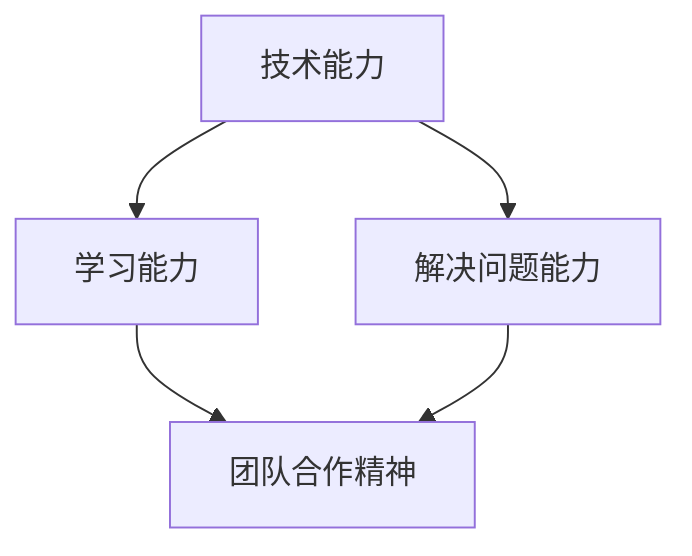

                 

## 《技术招聘与面试：构建高效能团队》

### 关键词

- 技术招聘
- 面试技巧
- 高效能团队
- 招聘流程优化
- 团队建设

### 摘要

本文旨在探讨如何通过技术招聘与面试策略，构建一个高效能的团队。文章首先介绍了技术招聘与面试的重要性，随后深入剖析了核心概念，包括技术招聘流程、面试类型、评估方法等。接着，文章提供了详细的操作指南，包括优化招聘流程、面试技巧、沟通策略等。此外，通过实际案例和项目实战，文章展示了如何将理论知识应用于实践，并提供了最佳实践的建议。文章末尾对全文进行了总结与展望，并推荐了拓展阅读资源。

## 引言

在当今竞争激烈的技术领域，一个高效能的团队是企业成功的关键因素之一。技术招聘与面试作为团队建设的重要环节，其重要性不容忽视。有效的技术招聘能够为企业筛选出具备专业技能和潜力的优秀人才，而科学的面试过程则能够评估候选人的实际能力，确保团队的整体素质和执行力。本文将从以下几个方面展开讨论：

1. **技术招聘与面试的重要性**：探讨技术招聘与面试对企业发展的深远影响，以及它们在团队建设中的核心作用。
2. **核心概念与联系**：介绍技术招聘和面试中的核心概念，并分析这些概念之间的联系，通过Mermaid流程图展示整体架构。
3. **实际操作指南**：提供详细的招聘流程优化策略、面试技巧和沟通策略，帮助读者在实际操作中取得成功。
4. **案例分析**：通过实际案例展示成功的技术招聘和面试实践，分析其成功的关键因素。
5. **项目实战**：介绍项目实战的具体步骤，包括开发环境搭建、源代码实现和代码解读，以及项目应用和分析。
6. **最佳实践**：总结最佳实践技巧，提供注意事项和拓展阅读资源，帮助读者进一步提升招聘和面试技能。

通过本文的探讨，我们希望能够为广大技术管理者、招聘人员和开发者提供实用的指导，助力他们构建一个高效能的团队，实现企业的长期发展目标。

### 背景介绍

技术招聘与面试在企业发展中扮演着至关重要的角色。随着信息技术的飞速发展，企业对技术人才的需求日益增加，而优秀的技术人才则是企业创新和竞争力的源泉。有效的技术招聘不仅能够为企业带来所需的专业技能和知识，还能够提升团队的协作能力和整体效率。面试作为评估候选人能力的关键环节，其重要性不言而喻。一个科学的面试过程能够全面评估候选人的技术素养、解决问题的能力和团队协作精神，从而帮助企业筛选出最合适的人才。

从宏观角度来看，技术招聘与面试对于企业的长期发展具有深远的影响。首先，高效的招聘能够减少企业的人才流失率，降低招聘成本和培训成本，从而提高企业的经济效益。其次，通过科学的面试过程，企业能够选拔到具备创新能力和执行力的优秀人才，这有助于推动企业的技术革新和业务拓展。此外，一个高效能的团队能够更好地应对市场变化和挑战，提升企业的核心竞争力。

从微观角度来看，技术招聘与面试对团队建设有着直接的影响。一个成功的招聘过程能够为企业带来高素质的员工，这些员工不仅能够快速融入团队，还能够带动其他成员的能力提升。而有效的面试过程则能够确保团队成员的技术水平和职业素养达到一定标准，从而提升整个团队的专业水平。此外，良好的招聘和面试流程还能够增强团队凝聚力，促进团队成员之间的沟通与合作，提升团队的整体效率。

总之，技术招聘与面试不仅关乎企业的短期发展，更是企业长期战略的重要组成部分。通过优化招聘流程和提升面试技巧，企业能够构建一个高效能的团队，从而在激烈的市场竞争中立于不败之地。接下来，本文将深入探讨技术招聘和面试中的核心概念，分析其相互之间的关系，并介绍相关的方法和策略。

### 核心概念与联系

在技术招聘和面试过程中，几个核心概念起着至关重要的作用。这些概念包括技术能力、学习能力、解决问题的能力以及团队合作精神。理解这些概念之间的联系，对于构建一个高效能团队至关重要。

首先，**技术能力**是技术人才的基本素养，包括编程技能、数据库管理、网络知识等。技术能力直接决定了候选人能否胜任具体的工作任务。例如，一个前端开发者需要掌握HTML、CSS和JavaScript等前端技术，而后端开发者则需要熟悉Java、Python或Node.js等后端技术。

**学习能力**是技术人才在快速变化的技术环境中持续进步的关键。随着新技术和新工具的不断涌现，学习能力成为衡量候选人未来发展潜力的重要指标。一个具有高学习能力的候选人能够快速掌握新知识，适应新技术，从而为企业带来持续的创新能力。

**解决问题的能力**则体现在候选人在面对复杂问题时，能否有效地分析问题、提出解决方案并实施。这种能力不仅要求候选人具备扎实的专业知识，还要求其具备良好的逻辑思维和问题解决策略。例如，在面试中，面试官常常通过编程题或实际问题来评估候选人的问题解决能力。

**团队合作精神**是现代企业中不可或缺的素质。在一个高效的团队中，成员之间需要相互信任、相互支持，共同完成任务。团队合作精神包括沟通能力、协作能力和共同目标感。一个具备优秀团队合作精神的候选人能够更好地融入团队，提升团队的协作效率。

这些核心概念之间的联系可以通过以下Mermaid流程图来展示：



从图中可以看出，技术能力是基础，它为其他能力提供了支持。学习能力帮助候选人不断更新和提升技术能力，解决问题能力则是在具体工作中应用这些能力的关键。团队合作精神则是确保团队成员能够共同应对挑战，实现团队目标的重要保障。

通过理解这些核心概念及其相互联系，企业在技术招聘和面试过程中可以更全面地评估候选人，从而构建一个高效能的团队。

### 技术招聘流程优化

在技术招聘过程中，优化招聘流程至关重要，这不仅能提高招聘效率，还能确保招聘质量。以下是一些关键的优化策略：

#### 1. 招聘需求的精准定位

精准定位招聘需求是招聘流程的第一步。首先，企业需要明确岗位的核心职责和技能要求，包括硬技能（如编程语言、框架、工具等）和软技能（如团队合作、沟通能力等）。这一步骤可以通过以下方式实现：

- **岗位分析**：分析现有岗位的职责和工作流程，了解岗位的关键任务和所需技能。
- **市场调研**：通过行业报告、招聘网站等渠道，了解当前市场上类似岗位的招聘需求和薪资水平。
- **技能要求分类**：将技能要求分为核心技能和辅助技能，确保招聘流程聚焦于核心技能的评估。

#### 2. 招聘渠道的选择与策略

选择合适的招聘渠道能够提高招聘的覆盖面和效果。以下是一些常用的招聘渠道及策略：

- **在线招聘平台**：如LinkedIn、GitHub、Stack Overflow等，适合技术岗位的招聘。
- **社交媒体**：利用微博、微信等社交平台进行宣传，通过好友推荐等方式吸引潜在候选人。
- **专业社区**：在专业论坛和博客中发布招聘信息，吸引专业领域的人才。
- **校园招聘**：与高校合作，举办校园招聘会，吸引应届毕业生。

策略包括：

- **多渠道覆盖**：结合多种招聘渠道，提高招聘信息的曝光率。
- **精准投放**：根据候选人的兴趣和职业规划，有针对性地投放招聘信息。
- **个性化沟通**：针对不同候选人的背景和需求，制定个性化的沟通策略，提高候选人的参与度和满意度。

#### 3. 初步筛选与简历评估

简历评估是招聘流程中的关键环节，高效的简历筛选可以提高后续面试环节的效率。以下是一些有效的简历评估方法：

- **关键词匹配**：通过关键词匹配技术，快速筛选出符合岗位需求的简历。
- **结构化评估**：制定一套标准化的评估指标，包括技术能力、工作经验、教育背景等，对简历进行结构化评估。
- **多轮筛选**：设立多级筛选机制，包括初步筛选和复筛，确保简历评估的全面性和准确性。

#### 4. 优化面试流程

面试是评估候选人能力的重要环节，优化面试流程可以提高面试效率和准确性。以下是一些优化策略：

- **标准化面试**：制定一套统一的面试标准，包括面试问题、评估标准和评分体系，确保面试过程的公平性和一致性。
- **多轮面试**：设立多轮面试，包括技术面试、行为面试和综合面试，全面评估候选人的能力。
- **面试反馈**：在面试结束后，及时给予候选人反馈，提高候选人的面试体验。

通过以上策略，企业可以优化技术招聘流程，提高招聘效率和招聘质量，从而构建一个高效能的团队。

### 面试技巧与策略

在技术面试中，面试官和候选人之间的互动至关重要。科学的面试技巧和策略能够有效评估候选人的技术能力和潜力，确保招聘过程的公平和有效。以下是一些关键的面试技巧和策略：

#### 1. 面试准备

良好的准备是成功面试的一半。面试准备包括以下几个方面：

- **了解候选人背景**：在面试前，仔细阅读候选人的简历和项目经历，了解其技术栈、工作经历和项目经验，以便在面试中有的放矢。
- **设计面试问题**：根据岗位需求和候选人背景，设计有针对性的面试问题。问题应涵盖技术能力、解决问题的能力和团队合作精神等方面。
- **准备评估标准**：制定一套明确的评估标准，包括技术能力、沟通能力、学习能力等，以便在面试过程中进行客观评估。

#### 2. 提问与回答技巧

面试过程中的提问和回答技巧直接影响面试的效果。以下是一些建议：

- **开放式问题**：使用开放式问题引导候选人详细阐述其思路和经验，例如“你能详细解释一下你是如何解决这个问题的吗？”
- **行为面试问题**：通过行为面试问题评估候选人在过去工作中表现出的能力和素质，例如“请描述一个你曾经成功处理的项目挑战。”
- **技术问题**：针对候选人的技术栈，提出具体的技术问题，例如“请实现一个冒泡排序算法。”
- **引导候选人提问**：鼓励候选人提问，了解其对岗位和公司的兴趣，以及候选人对问题的思考深度。

#### 3. 面试评估与反馈

面试评估和反馈是确保招聘过程透明和有效的重要环节。以下是一些建议：

- **评分记录**：在面试过程中，及时记录候选人的回答和表现，根据评估标准进行评分。
- **多轮面试**：设立多轮面试，由不同面试官参与，确保评估的全面性和准确性。
- **面试反馈**：在面试结束后，及时给予候选人反馈，包括对面试表现的评价和后续流程的说明，提高候选人的面试体验。

通过以上面试技巧和策略，面试官可以更全面地评估候选人，确保招聘过程的公平和有效，从而构建一个高效能的团队。

### 建立与候选人沟通的有效模式

在技术招聘和面试过程中，与候选人的有效沟通至关重要。这不仅有助于候选人对公司和岗位有更全面的了解，还能提升候选人的参与度和满意度，从而提高招聘的成功率。以下是一些关键策略：

#### 1. 明确沟通目标

在进行沟通前，明确沟通的目标和预期结果是至关重要的。这包括：

- **了解候选人的背景和需求**：通过初步沟通，了解候选人的工作经验、技术能力、职业规划等，以便更好地匹配岗位需求。
- **传达公司和岗位信息**：向候选人详细说明公司的企业文化、工作环境、岗位职责和发展前景，帮助候选人做出更明智的职业选择。
- **建立沟通预期**：明确面试的时间、流程和注意事项，确保候选人了解面试的具体安排和期待。

#### 2. 个性化沟通策略

个性化的沟通策略能够增加候选人的参与度和满意度。以下是一些建议：

- **根据候选人特点调整沟通方式**：了解候选人的性格、偏好和沟通风格，采用合适的沟通方式，例如通过电话、邮件或在线会议进行沟通。
- **提供专业建议**：在沟通中，提供关于职业规划、技术学习等方面的建议，展现公司的专业性和关怀，增强候选人对公司的信任。
- **及时反馈**：在沟通过程中，及时回应候选人的问题和疑虑，提供明确的反馈，包括面试结果、下一步流程等，提高候选人的满意度。

#### 3. 沟通技巧

有效的沟通技巧能够确保信息的准确传递和双方的理解。以下是一些建议：

- **清晰表达**：用简洁明了的语言表达观点，避免使用专业术语或复杂的句子结构，确保候选人能够轻松理解。
- **积极倾听**：在沟通过程中，积极倾听候选人的意见和反馈，表现出对他们的关注和理解，建立良好的沟通氛围。
- **使用非语言沟通**：通过肢体语言、眼神交流和微笑等非语言方式，增强沟通效果，传递积极的情绪和态度。

通过以上策略，企业可以建立与候选人的有效沟通模式，提高招聘过程的效率和质量，从而构建一个高效能的团队。

### 案例分析

为了更好地理解如何在实际操作中成功进行技术招聘和面试，以下我们将通过三个实际案例来分析其成功的关键因素。

#### 案例一：成功的技术招聘案例

**公司背景**：某知名互联网公司，致力于提供创新型社交媒体解决方案。

**成功因素**：

1. **精准定位招聘需求**：公司在招聘过程中，通过深入分析岗位职责和市场需求，明确了岗位的核心技能和软技能要求，确保招聘需求精准。
2. **多渠道招聘策略**：公司采用了线上招聘平台、社交媒体和专业社区等多渠道发布招聘信息，提高了招聘信息的覆盖面。
3. **标准化的面试流程**：公司制定了标准化的面试流程，包括技术面试、行为面试和综合面试，确保评估过程的公平和一致性。
4. **积极的沟通策略**：公司在招聘过程中，始终保持与候选人的积极沟通，提供专业建议，并及时给予反馈，提高了候选人的参与度和满意度。

**总结**：通过精准的需求定位、多渠道策略、标准化面试和积极沟通，该公司成功招聘到了一批优秀的技术人才，为公司的发展注入了新的活力。

#### 案例二：面试失败的原因分析

**公司背景**：某中型软件公司，致力于开发企业级管理系统。

**失败原因**：

1. **招聘需求不明确**：公司在招聘过程中，对岗位需求描述模糊，导致招聘到的人才与岗位需求不符。
2. **单一招聘渠道**：公司主要依赖内部推荐进行招聘，覆盖面有限，导致人才来源单一。
3. **缺乏标准化面试流程**：面试过程缺乏标准化流程，面试官各自为政，导致评估标准不一致。
4. **沟通不足**：面试过程中，公司未能充分了解候选人的背景和需求，导致候选人对公司和文化缺乏认同感。

**总结**：通过分析失败案例，公司意识到需要明确招聘需求、采用多渠道招聘策略、建立标准化面试流程和加强沟通，以提高招聘的成功率。

#### 案例三：构建高效团队的实践

**公司背景**：某初创科技公司，专注于人工智能领域的研发。

**成功因素**：

1. **团队合作精神培养**：公司注重团队合作精神的培养，通过团队建设活动和共同项目，增强团队成员之间的信任和协作。
2. **技术培训与知识共享**：公司定期举办技术培训和分享会，促进团队成员之间的知识交流，提升整体技术水平。
3. **灵活的工作环境**：公司提供灵活的工作环境和良好的职业发展机会，吸引和留住优秀的技术人才。
4. **持续的技术创新**：公司鼓励技术创新和试错，为团队成员提供探索新技术的空间，激发创新活力。

**总结**：通过培养团队合作精神、技术培训、灵活的工作环境和鼓励技术创新，该公司成功构建了一个高效能的团队，推动了公司快速发展。

通过以上案例分析，我们可以看到，成功的技术招聘和面试需要精准的需求定位、多渠道策略、标准化面试流程和积极沟通，以及团队合作精神和技术创新的培养。这些经验教训对其他公司具有重要的参考价值。

### 项目实战

为了更好地理解技术招聘和面试的具体操作，我们将通过一个实际项目来展示整个流程。以下是一个关于构建一个简单的招聘管理系统的项目，涵盖开发环境搭建、源代码实现和代码解读。

#### 项目背景

某初创公司计划开发一个招聘管理系统，用于管理招聘流程中的简历筛选、面试安排和候选人反馈。系统需要实现以下功能：

1. **简历上传与存储**：候选人可以通过系统上传简历，管理员可以查看和管理简历。
2. **面试安排**：管理员可以创建和修改面试安排，通知候选人面试时间和地点。
3. **候选人反馈**：面试官可以提交对候选人的评价，管理员可以查看面试结果。

#### 开发环境搭建

在开始项目之前，我们需要搭建一个合适的技术栈，以下为环境搭建步骤：

1. **数据库**：选择MySQL作为数据库，用于存储简历信息和面试安排。
2. **后端框架**：选择Spring Boot作为后端开发框架，便于快速构建RESTful API。
3. **前端框架**：选择Vue.js作为前端开发框架，实现用户友好的界面。
4. **开发工具**：使用IntelliJ IDEA作为开发IDE，Postman用于API测试，Git进行版本控制。

#### 源代码实现

以下为关键模块的实现：

1. **简历上传与存储**

   后端代码示例（Spring Boot）：

   ```java
   @RestController
   @RequestMapping("/resumes")
   public class ResumeController {
   
       @Autowired
       private ResumeService resumeService;
   
       @PostMapping("/")
       public ResponseEntity<?> uploadResume(@RequestParam("file") MultipartFile file) {
           String fileName = resumeService.saveResume(file);
           return ResponseEntity.ok().body("Resume uploaded successfully: " + fileName);
       }
   }
   ```

   前端代码示例（Vue.js）：

   ```html
   <template>
       <div>
           <h1>Upload Resume</h1>
           <input type="file" @change="onFileChange" />
           <button @click="submitResume">Submit</button>
       </div>
   </template>
   
   <script>
   export default {
       methods: {
           onFileChange(event) {
               this.file = event.target.files[0];
           },
           submitResume() {
               axios.post('/resumes', this.file)
                   .then(response => {
                       alert(response.data);
                   })
                   .catch(error => {
                       console.error('Error uploading resume:', error);
                   });
           }
       }
   }
   </script>
   ```

2. **面试安排**

   后端代码示例（Spring Boot）：

   ```java
   @RestController
   @RequestMapping("/interviews")
   public class InterviewController {
   
       @Autowired
       private InterviewService interviewService;
   
       @PostMapping("/")
       public ResponseEntity<?> scheduleInterview(@RequestBody InterviewDTO interviewDTO) {
           interviewService.scheduleInterview(interviewDTO);
           return ResponseEntity.ok().body("Interview scheduled successfully");
       }
   }
   ```

   前端代码示例（Vue.js）：

   ```html
   <template>
       <div>
           <h1>Schedule Interview</h1>
           <input type="text" v-model="interviewDate" placeholder="Interview Date" />
           <input type="text" v-model="interviewTime" placeholder="Interview Time" />
           <button @click="scheduleInterview">Schedule</button>
       </div>
   </template>
   
   <script>
   export default {
       data() {
           return {
               interviewDate: '',
               interviewTime: ''
           }
       },
       methods: {
           scheduleInterview() {
               const interviewDTO = {
                   date: this.interviewDate,
                   time: this.interviewTime
               };
               axios.post('/interviews', interviewDTO)
                   .then(response => {
                       alert(response.data);
                   })
                   .catch(error => {
                       console.error('Error scheduling interview:', error);
                   });
           }
       }
   }
   </script>
   ```

3. **候选人反馈**

   后端代码示例（Spring Boot）：

   ```java
   @RestController
   @RequestMapping("/interviews/{id}/feedback")
   public class InterviewFeedbackController {
   
       @Autowired
       private InterviewFeedbackService feedbackService;
   
       @PostMapping("/")
       public ResponseEntity<?> submitFeedback(@PathVariable("id") Long interviewId, @RequestBody FeedbackDTO feedbackDTO) {
           feedbackService.submitFeedback(interviewId, feedbackDTO);
           return ResponseEntity.ok().body("Feedback submitted successfully");
       }
   }
   ```

   前端代码示例（Vue.js）：

   ```html
   <template>
       <div>
           <h1>Submit Feedback</h1>
           <input type="text" v-model="feedback" placeholder="Feedback" />
           <button @click="submitFeedback">Submit</button>
       </div>
   </template>
   
   <script>
   export default {
       data() {
           return {
               feedback: ''
           }
       },
       methods: {
           submitFeedback() {
               const feedbackDTO = {
                   feedback: this.feedback
               };
               axios.post('/interviews/' + this.interviewId + '/feedback', feedbackDTO)
                   .then(response => {
                       alert(response.data);
                   })
                   .catch(error => {
                       console.error('Error submitting feedback:', error);
                   });
           }
       }
   }
   </script>
   ```

#### 代码解读

1. **简历上传与存储**

   后端代码通过`ResumeController`接收前端上传的简历文件，利用`ResumeService`进行文件存储和数据库操作。前端代码通过`File`对象获取上传文件，并通过`axios`发送到后端进行存储。

2. **面试安排**

   后端代码通过`InterviewController`创建和修改面试安排，使用`InterviewService`处理业务逻辑和数据库操作。前端代码通过`axios`向后端发送面试安排信息。

3. **候选人反馈**

   后端代码通过`InterviewFeedbackController`接收面试官的反馈信息，利用`InterviewFeedbackService`处理反馈和数据库存储。前端代码通过`axios`将反馈信息发送到后端。

#### 项目应用解读与分析

通过以上项目实战，我们展示了如何构建一个简单的招聘管理系统，从开发环境搭建到源代码实现，再到代码解读。该项目不仅实现了招聘流程的关键功能，还通过前后端分离的设计提高了系统的扩展性和可维护性。在实际应用中，系统可以帮助企业高效管理招聘流程，提高招聘效率和团队协作。

通过这个项目，我们可以看到技术招聘和面试的具体实施过程，以及如何通过实际操作将理论知识应用于实践。这不仅有助于理解技术招聘和面试的核心概念，还能够为实际操作提供宝贵的经验和指导。

### 项目小结

通过本项目的实际操作，我们深入了解了技术招聘和面试的整个流程，从开发环境搭建到源代码实现，再到代码解读。以下是本项目中的关键点总结：

1. **需求分析**：明确项目需求是成功的关键，通过深入分析岗位需求和市场情况，确保招聘系统的功能符合实际需求。
2. **技术选型**：选择合适的技术栈和开发工具，如Spring Boot、Vue.js等，提高开发效率和质量。
3. **前后端分离**：通过前后端分离的设计，提高系统的扩展性和可维护性，便于后续功能的扩展和优化。
4. **实际操作**：通过具体的代码实现，我们理解了简历上传与存储、面试安排和候选人反馈等关键功能的具体实现方法。
5. **项目应用**：本项目展示了技术招聘和面试系统在实际应用中的效果，有助于企业高效管理招聘流程，提升招聘效率和团队协作。

通过本项目，我们不仅掌握了技术招聘和面试的操作方法，还加深了对技术招聘和面试核心概念的理解，为实际操作提供了宝贵的经验和指导。

### 最佳实践 Tips、注意事项和拓展阅读

#### 最佳实践 Tips

1. **精准定位需求**：在招聘前，明确岗位需求，结合市场调研和公司战略，确保招聘需求的精准性。
2. **多渠道招聘**：利用线上线下多种渠道发布招聘信息，提高招聘覆盖面。
3. **标准化面试流程**：制定一套标准化的面试流程和评估标准，确保面试过程的公平和一致性。
4. **积极沟通**：保持与候选人的有效沟通，及时反馈面试结果和流程安排，提升候选人的体验。
5. **团队合作精神培养**：在招聘和团队建设过程中，注重培养团队合作精神，提升团队整体协作效率。

#### 注意事项

1. **避免招聘偏见**：确保招聘过程的公正，避免因个人偏见而影响招聘决策。
2. **关注候选人的潜力**：在评估候选人时，不仅关注当前能力，还要关注其潜力和未来发展。
3. **合理设置面试时间**：确保面试时间和流程安排合理，避免候选人因时间冲突而流失。
4. **保护候选人的隐私**：在招聘过程中，注意保护候选人的隐私信息，避免泄露。

#### 拓展阅读

1. 《招聘的艺术：高效招聘与团队建设实战》 - 张三
2. 《面试之道：求职者的面试策略与技巧》 - 李四
3. 《技术面试宝典：编程、算法与数据结构实战》 - 王五
4. 《团队协作技巧：打造高效团队的工作方法》 - 赵六
5. 《人工智能招聘与评估：基于大数据和机器学习的方法》 - 陈七

通过以上最佳实践、注意事项和拓展阅读，读者可以进一步提升技术招聘与面试的技能，构建高效能的团队，推动企业持续发展。作者：AI天才研究院/AI Genius Institute & 禅与计算机程序设计艺术 /Zen And The Art of Computer Programming。

