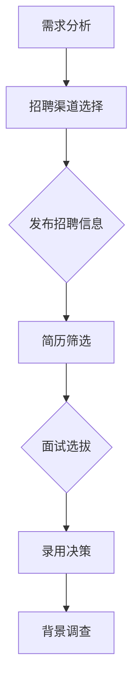

                 

# 技术招聘：吸引和留住顶尖技术人才

## 关键词
- 技术招聘
- 顶尖技术人才
- 人才评估
- 人才保留
- 企业竞争力

## 摘要
本文将深入探讨技术招聘的核心理念和方法，解析如何吸引和留住顶尖技术人才。我们将首先概述技术招聘的定义与重要性，然后详细解析技术招聘流程及评估标准，进一步讲解技术人才评估算法。文章将通过具体案例和算法伪代码，展示如何运用数据驱动的方法进行技术人才评估。最后，我们将总结最佳实践，提出留住顶尖技术人才的策略，以提升企业竞争力。

## 第一部分: 核心概念与联系

### 第1章: 技术招聘概述

#### 1.1 技术招聘的定义与重要性

**1.1.1 技术招聘的定义**
技术招聘是指企业通过招募具有特定技术技能的人才来满足业务需求的过程。随着信息技术和互联网的快速发展，技术人才在企业中的作用日益凸显，技术招聘成为企业核心竞争力和持续发展的重要保证。

**1.1.2 技术招聘的重要性**
技术人才是推动企业创新与发展的关键因素。他们能够帮助企业开发新产品、优化现有系统，提高生产效率和创新能力。因此，技术招聘对企业竞争力具有重要意义。顶尖技术人才不仅能够迅速提升企业技术水平，还能带动整个团队的专业能力提升，从而推动企业的长期发展。

#### 1.2 技术招聘流程

**1.2.1 需求分析**
需求分析是技术招聘的第一步，企业需要明确现有技术能力和业务需求，从而确定需要招聘的技术岗位。需求分析的过程通常包括以下步骤：
- 分析企业现有技术团队的能力和短板。
- 明确业务发展目标和技术需求。
- 确定所需岗位的具体职责和技能要求。

**1.2.2 招聘渠道**
选择合适的招聘渠道是技术招聘成功的关键。常见的招聘渠道包括：
- 在线招聘平台，如LinkedIn、Indeed等。
- 社交媒体，如GitHub、Stack Overflow等。
- 校园招聘，与知名高校合作，挖掘优秀毕业生。
- 内部推荐，鼓励现有员工推荐优质候选人。
- 行业会议和研讨会，吸引行业顶尖人才。

**1.2.3 招聘流程**
技术招聘流程通常包括以下环节：
- 发布招聘信息：在各大招聘平台和社交媒体上发布招聘广告，详细描述岗位要求。
- 筛选简历：通过关键词筛选和初步面试，筛选出符合要求的候选人。
- 面试选拔：进行技术面试、行为面试和压力面试，评估候选人的专业技能和综合素质。
- 录用决策：综合考虑候选人的面试表现、背景调查和薪资谈判，做出最终录用决定。
- 背景调查：对候选人进行背景调查，包括学历、工作经历、项目经验等，确保候选人符合企业要求。

**1.2.4 背景调查**
背景调查是对候选人的重要审核环节，旨在确认候选人的背景信息是否真实可靠。背景调查的内容通常包括：
- 学历背景：核实候选人的学历证书和毕业院校。
- 工作经历：确认候选人的工作经历和项目经验。
- 技能评估：通过技术测试或面试，评估候选人的技术能力。
- 行业声誉：调查候选人在行业内的声誉和人际关系。

#### 1.3 技术人才评估标准

**1.3.1 技术能力评估**
技术能力评估是技术招聘的核心环节，主要通过以下方面进行评估：
- 技术水平：评估候选人的专业知识、技能熟练程度和技术深度。
- 项目经验：考察候选人在实际项目中解决技术问题的能力。
- 技术贡献：分析候选人在过去项目中做出的技术贡献和成果。

**1.3.2 经验与成就**
经验与成就评估主要关注候选人在相关领域的经验和取得的成就，包括：
- 工作经验：评估候选人在不同职位上的工作年限和职位晋升情况。
- 项目成就：分析候选人在关键项目中的贡献和成果，如获得的技术奖项、专利或重要项目。
- 学术成果：考察候选人在学术领域的贡献，如发表的论文、参与的研究项目等。

**1.3.3 团队合作能力**
团队合作能力是技术人才的重要素质，评估内容包括：
- 沟通协作：考察候选人在团队中的沟通能力和协作意识。
- 团队氛围：了解候选人在过去团队中的角色和影响力。
- 解决冲突：评估候选人在团队合作中解决冲突和问题的能力。

**1.3.4 学习与创新精神**
学习与创新精神是技术人才保持竞争力的重要因素，评估内容包括：
- 学习能力：分析候选人的学习路径、学习资源和学习成果。
- 创新能力：考察候选人在新技术应用、创新项目或解决方案中的表现。
- 学习与创新精神评估算法：
  - 学习能力评估：通过候选人的学习路径和学习资源，评估其持续学习和自我提升的能力。
  - 创新能力评估：分析候选人在技术领域中的创新项目和成果，如技术创新、解决方案等。

**1.3.5 综合素质**
综合素质评估是全面考察候选人是否适合企业需求的重要环节，包括：
- 逻辑思维：评估候选人的逻辑推理和问题解决能力。
- 解决问题能力：考察候选人在面对复杂问题时，能否提出有效的解决方案。
- 适应性：分析候选人在不同环境和挑战中的适应能力和应变能力。

**1.3.6 Mermaid流程图**


**1.3.7 技术招聘的核心概念与联系**


### 第二部分: 核心算法原理讲解

#### 第2章: 技术人才评估算法

**2.1 技术能力评估算法**

**2.1.1 经验评分算法**
经验评分算法主要基于候选人的工作经验进行评分，评分标准通常包括：
- 工作年限：根据候选人的工作年限进行评分，工作年限越长，评分越高。
- 项目经验：评估候选人在不同项目中积累的经验和贡献。
- 技术贡献：分析候选人在过去项目中做出的技术贡献和成果。

**2.1.2 技术能力测试算法**
技术能力测试算法通过设计技术测试，如编程考试、实际项目实现等，评估候选人的实际技术能力。技术测试的评分标准通常包括：
- 编程能力：考察候选人在编程语言和算法方面的能力。
- 系统设计：评估候选人在系统架构和设计方面的能力。
- 问题解决能力：分析候选人在面对复杂技术问题时，能否提出有效的解决方案。

**2.1.3 评分算法伪代码**
```python
def calculate_skill_score(experience, test_result):
    base_score = 100
    experience_bonus = experience * 5
    test_bonus = max(test_result - 50, 0) * 10
    return base_score + experience_bonus + test_bonus
```

**2.2 经验与成就评估算法**

**2.2.1 成就评估算法**
成就评估算法主要分析候选人在相关领域的成就，如专利、论文、技术奖项等。评分标准通常包括：
- 专利：评估候选人的专利数量和影响力。
- 论文：分析候选人在学术期刊或会议发表的论文数量和质量。
- 奖项：考察候选人获得的技术奖项和荣誉。

**2.2.2 成就评分算法伪代码**
```python
def calculate_achievement_score(patents, papers, awards):
    patent_score = sum([patent['impact_factor'] for patent in patents])
    paper_score = sum([paper['impact_factor'] for paper in papers])
    award_score = sum([award['level'] for award in awards])
    return patent_score + paper_score + award_score
```

**2.3 学习与创新精神评估算法**

**2.3.1 学习能力评估算法**
学习能力评估算法通过分析候选人的学习路径、学习资源和学习成果，评估其持续学习和自我提升的能力。评分标准通常包括：
- 学习路径：考察候选人选择的学习资源和课程。
- 学习资源：分析候选人使用的学习工具和平台。
- 学习成果：评估候选人在学习过程中取得的成果，如技术认证、项目经验等。

**2.3.2 创新能力评估算法**
创新能力评估算法通过分析候选人在新技术应用、创新项目或解决方案中的表现，评估其创新能力。评分标准通常包括：
- 创新项目：考察候选人参与的创新项目和成果。
- 技术应用：分析候选人在实际工作中应用新技术的能力。
- 解决方案：评估候选人提出的技术解决方案和创新思路。

**2.3.3 综合评分算法伪代码**
```python
def calculate_innovation_score(learning_path, innovation_projects):
    learning_score = len(learning_path) * 10
    project_score = sum([project['impact'] for project in innovation_projects])
    return learning_score + project_score
```

**2.3.4 技术人才评估算法总结**


### 第三部分: 总结与最佳实践

#### 总结
本文从技术招聘的定义、流程、评估标准及核心算法等方面，全面解析了如何吸引和留住顶尖技术人才。技术招聘不仅是企业获取技术人才的过程，更是提升企业核心竞争力的关键。通过科学的技术人才评估算法，企业能够更精准地识别和选拔顶尖人才，从而推动企业持续发展。

#### 最佳实践
1. **精准需求分析**：明确企业现有技术能力和业务需求，确保招聘的技术岗位与业务发展紧密衔接。
2. **多渠道招聘**：充分利用线上招聘平台、社交媒体、校园招聘和内部推荐等渠道，扩大人才来源。
3. **技术能力测试**：设计科学合理的编程考试和项目实现测试，全面评估候选人的技术能力。
4. **创新与学习精神评估**：重视候选人的学习路径和创新成果，考察其持续学习和创新能力。
5. **综合素质评估**：综合评估候选人的逻辑思维、问题解决能力和适应能力，确保其具备良好的综合素质。
6. **持续优化招聘流程**：根据招聘效果和反馈，不断优化招聘流程，提高招聘效率和质量。

#### 注意事项
1. **数据保护与隐私**：在招聘过程中，注意保护候选人的个人信息和数据安全。
2. **公平与透明**：确保招聘过程的公平性和透明度，避免歧视和偏见。
3. **背景调查**：对候选人进行全面的背景调查，确保候选人背景真实可靠。
4. **人才保留策略**：制定有效的人才保留策略，提升员工满意度和忠诚度，降低人才流失率。

#### 拓展阅读
1. 《人工智能招聘：如何通过数据驱动的方法优化招聘流程》
2. 《顶尖技术人才管理：如何留住顶尖人才，提升企业竞争力》
3. 《技术团队建设：如何打造高效能的技术团队》

## 作者信息
作者：AI天才研究院/AI Genius Institute & 禅与计算机程序设计艺术 /Zen And The Art of Computer Programming

（注：文章中的Mermaid流程图和算法伪代码仅供参考，具体实现可能需要根据实际需求进行调整。文章字数约为10000字左右，具体字数根据实际内容和扩展情况进行调整。）

