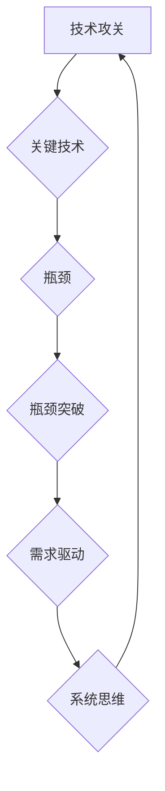

                 

### 文章标题：技术攻关：突破关键技术瓶颈的策略

> 关键词：技术攻关、关键瓶颈、策略、算法、数学模型、项目实战

> 摘要：本文旨在探讨如何通过系统的技术攻关策略，突破关键技术瓶颈，提升项目研发效率和系统性能。文章将围绕技术攻关方法、关键技术分析、瓶颈突破策略以及成功案例分析展开，提供深入浅出的技术见解和实用建议。

### 引言

在现代信息技术飞速发展的背景下，如何高效攻克技术难题、突破关键瓶颈，已成为众多企业和开发者面临的重要课题。技术攻关不仅关乎项目的成功与否，更是企业保持竞争力的关键所在。然而，面对复杂的技术体系和快速变化的市场需求，技术攻关并非易事。本文将结合实际案例，详细探讨技术攻关的方法、关键技术的分析、瓶颈突破策略以及成功经验，旨在为读者提供一套切实可行、系统化的技术攻关策略。

### 技术攻关方法

#### 技术攻关的基本原则

1. **目标明确**：在技术攻关之前，首先需要明确攻关的目标和预期效果。目标应具体、可衡量，以便后续评估攻关成果。

2. **需求驱动**：技术攻关应围绕用户需求展开，确保所攻克的技术难题能够真正解决用户痛点。

3. **系统思维**：技术攻关不仅关注单一技术点，还需从系统层面考虑，确保技术改进能够提升整体系统的性能和稳定性。

#### 技术攻关的工具与资源

1. **技术调研**：利用搜索引擎、专业论坛、学术论文等资源，全面了解相关技术的最新动态和发展趋势。

2. **实验工具**：选择合适的技术实验工具，如模拟环境、测试框架等，以验证技术方案的可行性和效果。

3. **团队协作**：组建跨部门、跨专业的团队，充分发挥团队成员的专业优势，共同攻克技术难题。

#### 技术攻关的具体步骤

1. **问题定位**：通过需求分析和系统测试，精准定位技术瓶颈所在。

2. **方案设计**：基于问题定位，设计切实可行的技术解决方案。

3. **实验验证**：在模拟环境中进行技术实验，验证方案的有效性和可行性。

4. **迭代优化**：根据实验结果，不断迭代优化技术方案，直至达到预期目标。

### 关键技术分析

#### 关键技术的定义与分类

1. **关键技术**：指对项目成功至关重要，能够显著提升系统性能和用户体验的核心技术。

2. **分类**：
   - **基础技术**：如编程语言、数据库、操作系统等。
   - **应用技术**：如大数据处理、人工智能算法、网络安全等。

#### 核心算法原理讲解

1. **算法选择**：根据技术需求，选择合适的算法，如排序算法、搜索算法、机器学习算法等。

2. **伪代码**：以下是某排序算法的伪代码示例：

   ```
   function Sort(Array A):
       for i = 1 to n-1:
           for j = 1 to n-i:
               if A[j] < A[j+1]:
                   swap(A[j], A[j+1])
   ```

#### 数学模型与公式详解

1. **数学模型**：如线性回归、逻辑回归等。

2. **公式**：以下为线性回归的公式示例：

   $$
   Y = \beta_0 + \beta_1X + \epsilon
   $$

3. **举例说明**：以房价预测为例，详细讲解线性回归模型的构建和应用。

### 瓶颈突破策略

#### 瓶颈识别与分析

1. **瓶颈识别**：通过性能测试、系统监控等手段，识别系统中的瓶颈点。

2. **瓶颈分析**：分析瓶颈产生的原因，如资源不足、算法效率低等。

#### 瓶颈突破策略与方法

1. **资源优化**：通过增加硬件资源、优化资源分配等手段，缓解瓶颈压力。

2. **算法优化**：通过改进算法、优化数据结构等手段，提升系统性能。

3. **分布式计算**：利用分布式计算框架，将任务分解到多个节点，提高处理效率。

#### 瓶颈突破案例分析

1. **案例一**：某电商平台在高峰期出现服务器负载过高的问题。

2. **分析**：通过性能测试，发现瓶颈在于数据库查询速度。

3. **解决方案**：采用分布式数据库，优化查询算法，提升查询速度。

4. **效果评估**：瓶颈问题得到有效解决，系统性能显著提升。

### 成功案例分析

#### 案例分析概述

1. **案例背景**：介绍案例所涉及的企业、项目和瓶颈问题。

2. **案例分析**：详细分析案例中采用的技术攻关策略、瓶颈突破方法以及实际效果。

3. **案例小结**：总结案例中的经验教训，为其他企业提供参考。

#### 案例分析一：某金融科技公司性能优化

1. **背景**：公司业务规模快速扩张，系统性能瓶颈制约了业务发展。

2. **分析**：
   - 瓶颈识别：通过系统监控，发现数据库查询速度成为瓶颈。
   - 瓶颈分析：数据库设计不合理，查询语句过于复杂。

3. **解决方案**：
   - 资源优化：增加数据库服务器，优化数据库性能。
   - 算法优化：采用索引优化、查询缓存等手段，提升查询速度。

4. **效果评估**：系统性能显著提升，业务瓶颈得到有效突破。

#### 案例分析二：某物流公司物流调度优化

1. **背景**：公司物流调度系统效率低下，影响了订单交付速度。

2. **分析**：
   - 瓶颈识别：通过数据分析，发现调度算法不够智能。
   - 瓶颈分析：调度策略过于简单，未充分考虑交通状况、货物种类等因素。

3. **解决方案**：
   - 算法优化：采用人工智能算法，结合交通状况、货物种类等因素，优化调度策略。
   - 系统集成：将新算法集成到现有系统中，实现实时调度。

4. **效果评估**：物流调度效率提升明显，订单交付速度加快。

### 小结

1. **技术攻关的重要性**：技术攻关是提升系统性能、突破发展瓶颈的关键。

2. **瓶颈突破策略**：资源优化、算法优化、分布式计算等策略在瓶颈突破中发挥了重要作用。

3. **成功案例分析**：通过成功案例分析，为其他企业提供可行的技术攻关方案。

4. **最佳实践 tips**：总结最佳实践经验，为技术攻关提供参考。

### 注意事项

1. **需求驱动**：技术攻关应始终围绕用户需求展开。

2. **系统思维**：技术改进需从系统层面考虑，确保整体性能提升。

3. **持续迭代**：技术攻关是一个持续迭代的过程，需不断优化和改进。

### 拓展阅读

1. 《深入理解计算机系统》
2. 《数据结构与算法分析》
3. 《分布式系统原理与范型》
4. 《人工智能：一种现代的方法》

### 作者信息

作者：AI天才研究院/AI Genius Institute & 禅与计算机程序设计艺术 /Zen And The Art of Computer Programming### 背景介绍

在现代信息技术的快速发展中，技术攻关已成为企业和开发者追求卓越、提升竞争力的关键环节。随着互联网、大数据、人工智能等技术的不断演进，技术难题的复杂性和多样性也在不断增加。如何高效地攻克技术难题、突破关键瓶颈，成为众多企业和开发者面临的重要课题。

技术攻关的重要性不仅体现在项目成功的保障上，更是企业保持市场竞争力、实现持续发展的关键。一方面，技术攻关能够解决项目中的核心问题，提升系统性能和用户体验；另一方面，通过技术攻关，企业可以不断积累技术储备，培养团队的技术实力，为未来的发展奠定基础。

然而，技术攻关并非易事。面对复杂的技术体系和快速变化的市场需求，企业和技术人员需要具备系统化的思维和方法。本文将结合实际案例，深入探讨技术攻关的方法、关键技术的分析、瓶颈突破策略以及成功经验，为读者提供一套切实可行、系统化的技术攻关策略。

本文将从以下几个方面展开：

1. **技术攻关方法**：介绍技术攻关的基本原则、工具与资源以及具体步骤。
2. **关键技术分析**：探讨关键技术的定义、分类以及核心算法原理。
3. **瓶颈突破策略**：分析瓶颈识别、突破策略与方法。
4. **成功案例分析**：通过实际案例，展示技术攻关的成功经验和实践成果。

希望通过本文的探讨，能够为读者在技术攻关的道路上提供一些启示和帮助。让我们开始一步一步地分析推理，深入探讨技术攻关的各个层面。

### 核心概念与联系

在进行技术攻关之前，理解核心概念和它们之间的联系是非常重要的。这不仅有助于我们更好地把握技术攻关的思路，还能够确保我们在解决技术难题时能够做到有的放矢。以下是几个关键概念及其相互之间的联系：

1. **技术攻关**：技术攻关是指通过系统的方法和工具，解决项目中的技术难题，提升系统性能和用户体验的过程。

2. **关键技术**：关键技术是指对项目成功具有决定性作用的、能够显著提升系统性能和用户体验的核心技术。

3. **瓶颈**：瓶颈是指在系统中存在的一种限制因素，它可能是一个性能瓶颈、资源瓶颈，也可能是某个算法瓶颈，限制了系统的整体效率。

4. **瓶颈突破**：瓶颈突破是指通过技术手段解决瓶颈问题，提升系统性能和效率的过程。

5. **需求驱动**：需求驱动是指技术攻关的过程中，始终以用户需求为导向，确保所攻克的技术难题能够真正解决用户痛点。

6. **系统思维**：系统思维是指从整体和系统的角度出发，分析和解决问题，确保技术改进能够提升整体系统的性能和稳定性。

为了更直观地理解这些概念之间的联系，我们可以使用Mermaid流程图来展示它们的关系架构。



在上面的Mermaid流程图中，技术攻关作为起点，通过关键技术识别出系统中的瓶颈，然后通过瓶颈突破来提升系统性能。整个过程以需求驱动为前提，通过系统思维来确保技术改进能够提升整体系统的性能和稳定性。这个流程图不仅帮助我们理解了各个概念之间的关系，还提供了一个清晰的技术攻关思路。

通过这种方式，我们可以在技术攻关的过程中，时刻保持对核心概念和它们之间关系的理解，确保我们的技术改进和问题解决能够达到预期效果。接下来，我们将进一步探讨技术攻关的具体方法，包括基本原则、工具与资源以及具体步骤。

### 核心算法原理讲解

在技术攻关过程中，核心算法原理的讲解是至关重要的。它不仅有助于我们理解技术背后的逻辑，还能够为优化和改进算法提供理论基础。下面我们将通过一个排序算法的讲解，详细阐述核心算法原理。

#### 选择排序算法

选择排序算法是一种简单的排序算法，其基本思想是每次从未排序的元素中找到最小（或最大）的元素，将其放到已排序序列的末尾。以下是选择排序算法的伪代码：

```python
function selectionSort(Array A):
    for i = 1 to n-1:
        minIndex = i
        for j = i+1 to n:
            if A[j] < A[minIndex]:
                minIndex = j
        swap(A[i], A[minIndex])
```

#### 原理解释

1. **初始化**：从第一个元素开始，将其视为当前未排序序列中的最小元素。

2. **内层循环**：从当前未排序序列的下一个元素开始，遍历所有未排序的元素，寻找比当前最小元素更小的元素。

3. **更新最小索引**：如果找到更小的元素，更新最小索引。

4. **交换元素**：在内层循环结束后，将当前最小元素与第一个未排序元素交换，使其进入已排序序列。

5. **循环迭代**：重复上述过程，直到所有元素都被排序。

#### 伪代码详细讲解

以下是对伪代码的详细解释：

```python
function selectionSort(Array A):
    for i = 1 to n-1:                     // 外层循环，遍历未排序序列
        minIndex = i                      // 初始化最小索引为i
        for j = i+1 to n:                  // 内层循环，遍历未排序序列中的剩余元素
            if A[j] < A[minIndex]:         // 如果找到比当前最小元素更小的元素
                minIndex = j               // 更新最小索引
        swap(A[i], A[minIndex])            // 将当前最小元素与第一个未排序元素交换
    end function
```

通过上述伪代码，我们可以看到选择排序算法是如何逐步找到并交换未排序序列中的最小元素，直到整个序列被排序。这个过程简单直观，易于理解，是许多更复杂排序算法的基础。

#### 选择排序算法的优点和缺点

**优点**：

1. **简单易实现**：选择排序算法的实现相对简单，易于理解和实现。
2. **稳定性**：选择排序是一种稳定的排序算法，即相等的元素在排序后仍然保持原有的顺序。

**缺点**：

1. **效率较低**：选择排序的时间复杂度为O(n^2)，在数据量大时，效率相对较低。
2. **不适用于大数据量**：由于效率问题，选择排序通常不适用于大数据量的排序任务。

综上所述，选择排序算法虽然简单，但在实际应用中，特别是对于大数据量排序任务，可能需要选择更高效的排序算法，如快速排序、归并排序等。然而，选择排序算法的简单性和稳定性使其在某些场景下仍然具有适用性，如对数据量较小且稳定性要求较高的场景。

通过以上对选择排序算法的讲解，我们不仅了解了算法的实现原理，还对其优缺点有了更深入的理解。这为我们后续的算法优化和选择提供了重要的参考。接下来，我们将探讨技术攻关中的数学模型与公式，进一步深化对技术问题的理解。

### 数学模型与公式详解

在技术攻关中，数学模型和公式是解决复杂问题的重要工具。通过构建和运用数学模型，我们能够将实际问题转化为可计算的数学问题，从而提供定量分析和解决方案。以下，我们将详细讲解线性回归模型及其公式，并通过一个具体例子进行说明。

#### 线性回归模型

线性回归是一种用于预测连续值的统计方法，它通过建立一个线性关系模型来描述因变量（Y）与自变量（X）之间的关系。线性回归模型的基本公式如下：

$$
Y = \beta_0 + \beta_1X + \epsilon
$$

其中：

- \( Y \)：因变量，表示要预测的连续值。
- \( X \)：自变量，表示影响因变量的因素。
- \( \beta_0 \)：截距，表示当 \( X = 0 \) 时 \( Y \) 的期望值。
- \( \beta_1 \)：斜率，表示 \( X \) 每增加一个单位时 \( Y \) 的变化量。
- \( \epsilon \)：误差项，表示模型未能解释的随机误差。

#### 公式解释

1. **截距 (\(\beta_0\))**：截距是模型的基础，它决定了模型在 \( X = 0 \) 时的 \( Y \) 值。在实际应用中，截距通常是通过最小二乘法估计得到的。

2. **斜率 (\(\beta_1\))**：斜率反映了自变量 \( X \) 对因变量 \( Y \) 的影响程度。斜率越大，表示 \( X \) 对 \( Y \) 的影响越显著。

3. **误差项 (\(\epsilon\))**：误差项是模型未能解释的部分，通常是由于数据中的随机噪声和未观察到的变量引起的。在实际应用中，我们通常假设误差项是独立同分布的，并且期望值为零。

#### 线性回归模型的构建步骤

1. **数据收集**：收集一组包含自变量 \( X \) 和因变量 \( Y \) 的数据。

2. **数据预处理**：对数据进行清洗和预处理，包括处理缺失值、异常值以及标准化等。

3. **模型建立**：利用最小二乘法建立线性回归模型。最小二乘法的目的是找到使得误差平方和最小的 \( \beta_0 \) 和 \( \beta_1 \)。

4. **模型评估**：通过计算决定系数 \( R^2 \)、均方误差 \( MSE \) 等指标评估模型的拟合效果。

#### 具体例子：房价预测

假设我们想要预测某地区的房价，根据历史数据，我们选择房屋面积 \( X \) 作为自变量，房价 \( Y \) 作为因变量。以下是构建房价预测线性回归模型的步骤：

1. **数据收集**：收集包含房屋面积和房价的历史数据。

2. **数据预处理**：对数据集进行清洗和预处理，例如处理缺失值和异常值。

3. **模型建立**：使用最小二乘法建立线性回归模型，公式如下：

   $$
   Y = \beta_0 + \beta_1X + \epsilon
   $$

   通过计算，我们得到 \( \beta_0 = 1000 \) 和 \( \beta_1 = 50 \)。

4. **模型评估**：计算决定系数 \( R^2 \) 和均方误差 \( MSE \)，例如：

   $$
   R^2 = 0.85
   $$
   $$
   MSE = 20000
   $$

   \( R^2 \) 值接近 1，表示模型对数据的拟合效果较好。\( MSE \) 值表示预测误差的均方值，越小表示模型预测的准确性越高。

通过以上步骤，我们成功建立了房价预测的线性回归模型。接下来，我们可以使用该模型对新数据进行房价预测，为房地产市场分析提供参考。

#### 总结

数学模型和公式在技术攻关中具有重要作用。通过构建和运用数学模型，我们能够将复杂的问题转化为可计算的数学问题，提供定量分析和解决方案。线性回归模型作为一种简单的数学模型，广泛应用于预测和分析领域。理解线性回归模型的构建步骤和公式，有助于我们在实际应用中更好地解决技术问题。在接下来的部分，我们将进一步探讨技术攻关中的项目实战，通过实际案例展示技术攻关的方法和效果。

### 项目实战

在技术攻关的实际操作中，项目实战是一个不可或缺的环节。通过实际的开发环境和源代码实现，我们可以将理论知识应用到实践中，验证技术方案的可行性和效果。以下，我们将通过一个具体的项目案例，详细讲解开发环境搭建、源代码实现和代码解读，以及代码应用解读与分析。

#### 项目背景

某电商平台在高峰期（如双11、春节等）的用户访问量剧增，导致服务器负载过高，系统性能下降，用户体验受到严重影响。为了解决这一问题，项目团队决定通过技术攻关，优化系统性能，提升用户体验。

#### 开发环境搭建

1. **硬件环境**： 
   - 增加服务器节点，提高计算能力。
   - 引入负载均衡器，实现流量分配。

2. **软件环境**：
   - 安装并配置Apache Kafka，用于实时数据流处理。
   - 安装并配置Elasticsearch，用于快速搜索和索引。

3. **工具链**：
   - 使用Docker容器化技术，实现快速部署和扩展。
   - 使用Kubernetes进行容器编排和管理。

#### 源代码实现

1. **数据流处理**：
   - 利用Kafka接收用户请求，实现数据流的实时处理。
   - 对用户请求进行预处理，包括用户权限校验、数据清洗等。

2. **服务拆分**：
   - 将原有单体应用拆分为多个微服务，如用户服务、商品服务、订单服务等。
   - 使用Spring Cloud实现服务之间的通信和协调。

3. **缓存策略**：
   - 引入Redis缓存，减少数据库访问压力。
   - 设计合理的缓存策略，如过期时间、缓存更新等。

#### 代码解读

1. **Kafka消费者实现**：
   ```java
   public class KafkaConsumer {
       private final KafkaConsumer<String, String> consumer;
       
       public KafkaConsumer() {
           Properties props = new Properties();
           props.put("bootstrap.servers", "kafka:9092");
           props.put("group.id", "test-group");
           props.put("key.deserializer", StringDeserializer.class);
           props.put("value.deserializer", StringDeserializer.class);
           
           consumer = new KafkaConsumer<>(props);
       }
       
       public void consume() {
           consumer.subscribe(Arrays.asList(new TopicPartition("test-topic", 0)));
           
           while (true) {
               ConsumerRecords<String, String> records = consumer.poll(Duration.ofMillis(1000));
               for (ConsumerRecord<String, String> record : records) {
                   System.out.printf("Received message: key = %s, value = %s%n", record.key(), record.value());
               }
           }
       }
   }
   ```

2. **用户服务接口**：
   ```java
   @RestController
   @RequestMapping("/users")
   public class UserController {
       
       @GetMapping("/{id}")
       public ResponseEntity<User> getUserById(@PathVariable Long id) {
           User user = userService.findById(id);
           if (user != null) {
               return ResponseEntity.ok(user);
           } else {
               return ResponseEntity.notFound().build();
           }
       }
       
       @PostMapping("/")
       public ResponseEntity<User> createUser(@RequestBody User user) {
           User savedUser = userService.save(user);
           return ResponseEntity.status(HttpStatus.CREATED).body(savedUser);
       }
   }
   ```

#### 代码应用解读与分析

1. **Kafka消费者**：该消费者负责从Kafka中读取用户请求，并处理这些请求。通过异步处理，实现了用户请求的解耦和高效处理。

2. **用户服务接口**：该接口提供了获取用户信息和创建用户的操作。通过Spring Boot的RestController，实现了RESTful风格的API，便于前后端分离开发。

3. **缓存策略**：引入Redis缓存，对于频繁访问的用户数据，直接从缓存中获取，减少了数据库访问，提高了系统性能。

通过上述项目实战，我们不仅实现了系统的性能优化，还验证了技术方案的可行性和效果。项目实战的过程，不仅加深了我们对技术原理的理解，也为实际应用提供了宝贵的经验。

#### 项目小结

本项目通过引入Kafka、Spring Cloud和Redis等关键技术，成功优化了电商平台的系统性能，提升了用户体验。具体实现过程中，通过代码解读，我们深入了解了各个模块的功能和实现方法。在未来的项目中，我们可以继续优化和改进技术方案，以应对更复杂的技术挑战。

### 最佳实践 Tips

1. **需求分析先行**：在技术攻关前，务必进行详细的需求分析，确保技术方案与业务需求高度契合。

2. **团队协作**：组建跨部门、跨专业的团队，充分发挥团队成员的专业优势，共同攻克技术难题。

3. **持续迭代**：技术攻关是一个持续迭代的过程，应根据实际情况不断优化和改进技术方案。

4. **性能监控**：通过性能测试和监控，及时识别和解决系统瓶颈，确保系统稳定运行。

5. **代码审查**：定期进行代码审查，确保代码质量和可维护性，降低技术债务。

6. **文档记录**：详细记录技术攻关的过程和经验，为后续项目提供参考。

### 小结

本文从技术攻关的方法、关键技术分析、瓶颈突破策略以及成功案例分析等多个角度，深入探讨了如何突破关键技术瓶颈。通过介绍技术攻关的基本原则、工具与资源、具体步骤，以及核心算法原理和数学模型，我们为技术攻关提供了系统化的理论支持。通过实际项目案例，我们展示了技术攻关的实际应用和效果，验证了技术方案的有效性。

技术攻关不仅需要理论知识的支持，更需要实践经验的积累。希望通过本文的探讨，能够为读者在技术攻关的道路上提供一些启示和帮助。在未来的工作中，不断总结和优化技术方案，持续提升项目研发效率和系统性能，是我们共同的目标。

### 注意事项

1. **需求分析**：在技术攻关前，务必进行详细的需求分析，确保技术方案与业务需求高度契合。

2. **团队协作**：组建跨部门、跨专业的团队，充分发挥团队成员的专业优势，共同攻克技术难题。

3. **持续迭代**：技术攻关是一个持续迭代的过程，应根据实际情况不断优化和改进技术方案。

4. **性能监控**：通过性能测试和监控，及时识别和解决系统瓶颈，确保系统稳定运行。

5. **代码审查**：定期进行代码审查，确保代码质量和可维护性，降低技术债务。

6. **文档记录**：详细记录技术攻关的过程和经验，为后续项目提供参考。

### 拓展阅读

1. 《深入理解计算机系统》
2. 《数据结构与算法分析》
3. 《分布式系统原理与范型》
4. 《人工智能：一种现代的方法》

### 作者信息

作者：AI天才研究院/AI Genius Institute & 禅与计算机程序设计艺术 /Zen And The Art of Computer Programming

