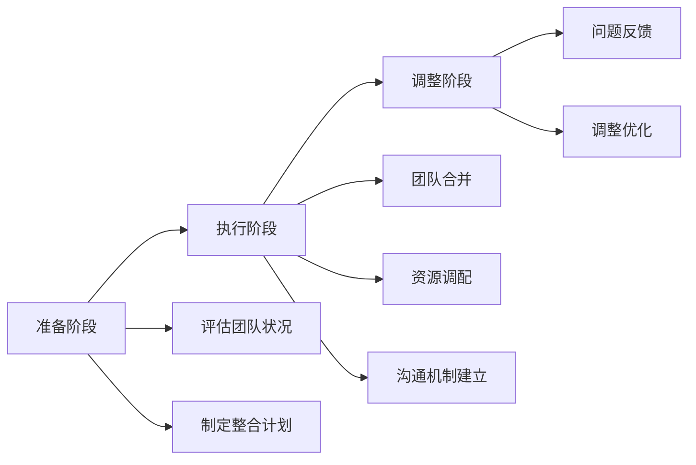

                 

### 文章标题

# 技术整合：收购后的技术团队整合

### 关键词

- 技术整合
- 收购后整合
- 技术团队
- 文化融合
- 沟通策略
- 效能提升
- 案例分析

### 摘要

本文旨在探讨收购后的技术团队整合过程中的关键问题，包括团队整合的重要性、核心概念、策略与流程、文化融合与沟通、技术整合以及团队评估与改进。通过理论讲解与实际案例相结合，本文提供了详细的指导，以帮助IT企业成功实施收购后的技术整合，提升团队效能，实现可持续发展。

## 引言

在当今快速发展的IT行业，企业之间的竞争愈发激烈。为了获取竞争优势，许多企业选择通过收购来扩展业务和技术能力。然而，收购后的技术团队整合并非易事，它涉及到多个方面，如团队文化融合、沟通策略、技术整合等。如果处理不当，可能会带来一系列问题，如团队效率低下、项目延误、员工流失等。因此，如何有效地整合收购后的技术团队成为企业面临的一个重要挑战。

本文将系统地探讨技术整合的核心概念、团队整合策略与流程、文化融合与沟通、技术整合、团队评估与改进，并通过实际案例进行分析。文章结构如下：

1. **核心概念与联系**：介绍技术整合的定义、类型和挑战，并展示相关的Mermaid流程图。
2. **团队整合策略与流程**：详细讨论团队整合的策略、流程以及可能遇到的问题和解决方案。
3. **文化融合与沟通**：探讨收购后的团队文化融合、沟通策略以及团队管理。
4. **技术整合**：分析技术共享、技术合并的过程和挑战。
5. **团队评估与改进**：讨论团队整合后的评估方法和改进措施。
6. **案例研究**：通过实际案例展示团队整合的过程和结果。
7. **结论与展望**：总结文章的主要观点，并对未来的技术整合趋势进行展望。

## 核心概念与联系

### 技术整合的定义

技术整合是指将两个或多个技术团队合并为一个整体，以实现资源共享、协同工作和技术创新的过程。它不仅仅涉及到技术层面的整合，还包括团队管理、文化融合和沟通等多个方面。

### 技术整合的类型

根据整合的程度和目标，技术整合可以分为以下几种类型：

1. **水平整合**：在同一层次上合并相似的技术团队，以增强业务能力和技术水平。
2. **垂直整合**：在不同层次上合并技术团队，例如研发团队与测试团队的整合。
3. **混合整合**：同时进行水平整合和垂直整合，以实现更全面的技术整合。

### 技术整合的挑战

尽管技术整合能够带来诸多好处，但在实际操作中仍面临许多挑战：

1. **文化冲突**：不同团队之间的价值观、工作方式和文化差异可能导致冲突和隔阂。
2. **沟通障碍**：整合后的团队可能面临沟通不畅的问题，影响项目的进度和效果。
3. **资源分配**：如何合理分配资源和预算，以支持技术整合过程，是另一个关键问题。
4. **人员调整**：整合过程中可能会涉及人员调整和岗位变动，如何处理这些问题对整合的成功至关重要。

### 技术团队整合流程

技术团队整合的过程可以分为以下几个阶段：

1. **准备阶段**：包括制定整合计划、评估现有团队状况、确定整合目标和范围。
2. **执行阶段**：包括团队合并、资源调配、沟通机制建立等具体实施步骤。
3. **调整阶段**：根据实际情况对整合过程进行调整和优化，以应对出现的问题。

### Mermaid 流程图展示

以下是一个简单的Mermaid流程图，展示了技术团队整合的流程：

通过上述核心概念与联系的介绍，读者可以初步了解技术整合的基本概念、类型和挑战，以及整合的基本流程。接下来，我们将深入探讨团队整合策略与流程，以帮助读者更好地理解和应对收购后的技术整合挑战。

