                 

### 技术文档写作：有效沟通的关键

> **关键词**：技术文档、写作技巧、沟通、有效表达、图表与示例、项目实战、案例分析

> **摘要**：本文旨在探讨技术文档写作的核心要素，包括基础概念、写作技巧、沟通原则、图表与示例的使用，以及项目实战和案例分析。通过一步步的分析和推理，本文希望帮助读者理解如何创作高质量的技术文档，实现有效的知识传递和沟通。

---

### 第一部分：技术文档写作的基础

#### 第1章：技术文档概述

#### 1.1 技术文档的定义与重要性

**背景介绍**

在信息时代，技术文档如同软件的“灵魂”，承载着技术知识、操作步骤和设计思路的传递。它不仅对开发团队内部的知识共享和协作至关重要，还对外部用户、合作伙伴乃至客户的理解与使用起到至关重要的作用。

**核心概念与联系**

技术文档不仅包括用户手册、操作指南，还包括开发文档、API文档等。这些文档共同构成了一个完整的技术知识体系，如下图所示：

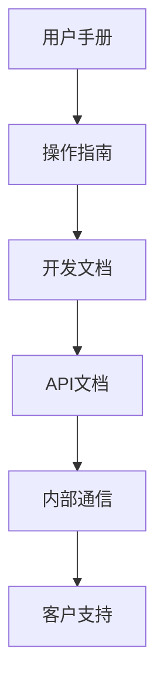

**核心算法原理讲解**

技术文档的核心在于清晰、准确地传达技术信息。以下是撰写技术文档的一个简要伪代码：

```plaintext
Function WriteTechnicalDocument()
    Define targetAudience
    Define documentObjectives
    CollectTechnicalKnowledge()
    StructureDocument()
    ValidateAndReview()
    PublishDocument()
End Function
```

**数学模型和公式**

技术文档往往涉及复杂的算法和数学模型。以下是技术文档中可能使用的一个基本数学公式：

$$
E = mc^2
$$

**举例说明**

例如，在编写一个关于计算机编程语言的技术文档时，可以使用以下例子来说明变量声明：

```java
int x = 5;
String name = "Alice";
```

#### 1.2 技术文档的类别与用途

**核心概念与联系**

技术文档根据用途和受众可以分为多种类型，如用户手册、技术指南、API文档和开发文档。以下是各类技术文档的定义及其用途的Mermaid流程图：

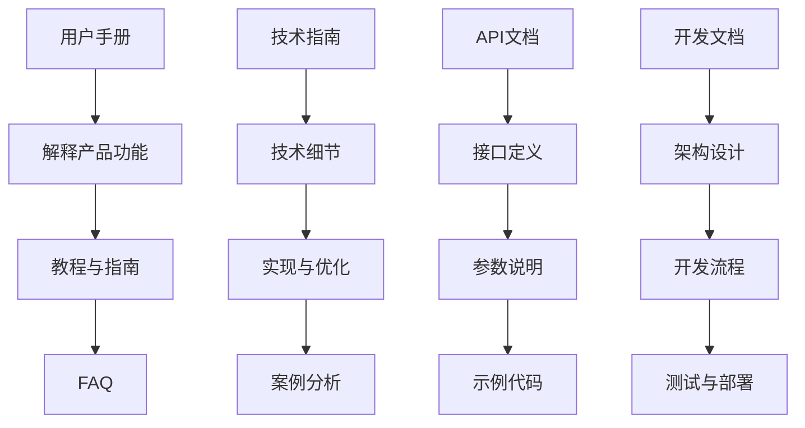

**核心算法原理讲解**

每类文档都有其特定的结构和内容，需要根据目标受众和文档目的进行调整。

**数学模型和公式**

例如，API文档通常需要详细描述每个API函数的参数和返回值，可以使用以下公式表示：

$$
API\ function(output) = function(input\_parameters)
$$

**举例说明**

一个典型的用户手册示例可能是：

```
用户手册：计算机操作系统使用指南

第1步：开启计算机
第2步：登录用户账户
第3步：打开桌面应用程序
...
第10步：关闭计算机
```

#### 1.3 技术文档的读者群体分析

**核心概念与联系**

技术文档的读者群体多样，包括开发者、测试人员、产品经理、客户和支持人员等。了解读者需求是编写高质量技术文档的关键。

**核心算法原理讲解**

以下是分析读者群体的一个简单算法：

```plaintext
Function AnalyzeTargetAudience()
    CollectRequirements()
    PrioritizeInformation()
    CustomizeContent()
    ValidateUnderstanding()
End Function
```

**数学模型和公式**

读者群体的需求可以用一个多变量函数表示：

$$
Requirement_{i} = f(Reader_{type}, Technical_{topic})
$$

**举例说明**

例如，开发文档的读者主要是开发人员，而用户手册的读者则主要是终端用户。

---

## 第2章：技术文档写作技巧

#### 2.1 确定文档目标与受众

**背景介绍**

在开始撰写技术文档之前，明确文档的目标和受众是至关重要的。这有助于确保文档的内容能够满足读者的需求，从而提高文档的实用性和可读性。

**核心概念与联系**

确定文档目标与受众是一个系统性的过程，涉及需求收集、目标定义和受众分析。以下是这个过程的Mermaid流程图：

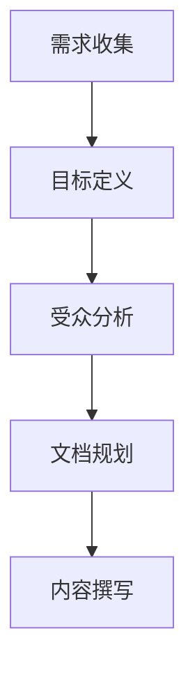

**核心算法原理讲解**

以下是确定文档目标与受众的一个简单算法：

```plaintext
Function DetermineDocumentGoals()
    CollectRequirements()
    DefineObjectives()
    IdentifyTargetAudience()
    AssessKnowledgeLevel()
End Function
```

**数学模型和公式**

目标与受众的需求可以用一个决策树模型表示：

$$
DecisionTree(Requirement, Objective, Audience)
$$

**举例说明**

例如，一个面向新手的编程教程需要从基础知识开始，而面向高级开发者的文档可以深入探讨复杂的编程技巧。

#### 2.2 撰写清晰、简洁的技术文档

**背景介绍**

清晰、简洁的技术文档是有效沟通的关键。这要求文档作者具备良好的表达能力和逻辑思维。

**核心概念与联系**

撰写清晰、简洁的技术文档涉及选择合适的语言、避免冗余和简化表达。以下是这个过程的Mermaid流程图：

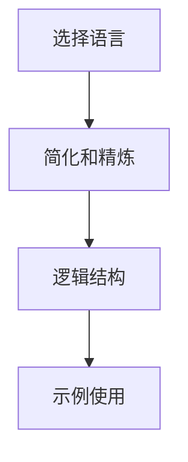

**核心算法原理讲解**

以下是撰写清晰、简洁技术文档的一个简单算法：

```plaintext
Function WriteClearTechnicalDocumentation()
    ChooseAppropriateLanguage()
    EliminateRedundancy()
    SimplifyExpressions()
    OrganizeContentLogically()
    IncludeExamples()
End Function
```

**数学模型和公式**

文档的清晰度和简洁度可以用一个综合指标表示：

$$
Clearness + Simplicity = Quality
$$

**举例说明**

例如，在解释一个复杂的技术概念时，可以使用图表和示例来帮助读者理解，而不是仅仅使用文字描述。

#### 2.3 使用恰当的格式和排版

**背景介绍**

恰当的格式和排版对于技术文档的可读性和专业感至关重要。这包括文本格式、段落结构、图表使用等。

**核心概念与联系**

使用恰当的格式和排版涉及设计文档的外观和内容布局。以下是这个过程的Mermaid流程图：

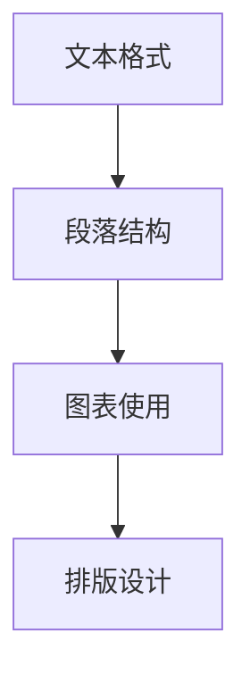

**核心算法原理讲解**

以下是使用恰当格式和排版的一个简单算法：

```plaintext
Function UseProperFormatting()
    ApplyConsistentTypography()
    StructureParagraphs()
    IntegrateChartsAndTables()
    EnsureVisualConsistency()
End Function
```

**数学模型和公式**

文档的格式和排版可以用一个美学指标表示：

$$
Formatting + Layout = VisualQuality
$$

**举例说明**

例如，使用不同的字体和大小来突出关键信息，使用表格和图表来展示数据。

---

## 第3章：编写技术文档的工具

#### 3.1 文本编辑器选择与使用

**背景介绍**

编写技术文档时，选择合适的文本编辑器可以显著提高写作效率和文档质量。

**核心概念与联系**

文本编辑器选择与使用涉及编辑器的功能和性能。以下是这个过程的Mermaid流程图：

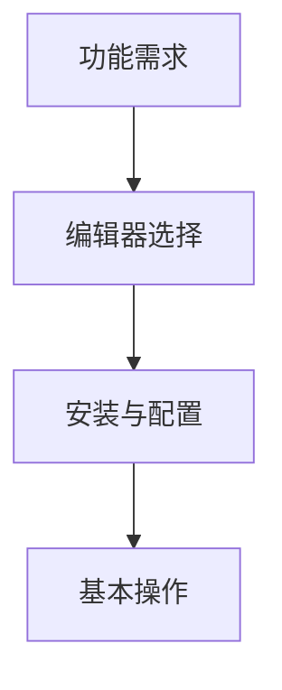

**核心算法原理讲解**

以下是选择和使用文本编辑器的一个简单算法：

```plaintext
Function ChooseAndUseTextEditor()
    IdentifyRequirements()
    SelectEditor()
    InstallAndConfigure()
    FamiliarizeWithFeatures()
End Function
```

**数学模型和公式**

编辑器的选择和配置可以用一个匹配度指标表示：

$$
Editor\ Match = \frac{Requirement\ Match}{Total\ Requirements}
$$

**举例说明**

例如，Markdown编辑器Typora因其简洁的界面和强大的Markdown功能而受到开发者的青睐。

#### 3.2 版本控制系统介绍

**背景介绍**

版本控制系统（VCS）是管理文档版本和控制变更的重要工具。

**核心概念与联系**

版本控制系统涉及版本管理、变更跟踪和协作。以下是这个过程的Mermaid流程图：

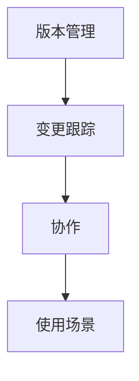

**核心算法原理讲解**

以下是使用版本控制系统的简单算法：

```plaintext
Function UseVersionControl()
    InitializeRepository()
    CommitChanges()
    TrackHistory()
    CollaborateWithTeam()
End Function
```

**数学模型和公式**

版本控制系统的效率可以用以下指标表示：

$$
Efficiency = \frac{CommitFrequency}{Time}
$$

**举例说明**

例如，Git是使用最广泛的版本控制系统，其强大的分支管理和合并功能极大地提高了团队协作的效率。

#### 3.3 其他辅助工具介绍

**背景介绍**

除了文本编辑器和版本控制系统，还有许多辅助工具可以帮助编写高质量的技术文档。

**核心概念与联系**

辅助工具包括文档生成器、图表绘制工具和文档管理平台。以下是这些工具的应用场景：

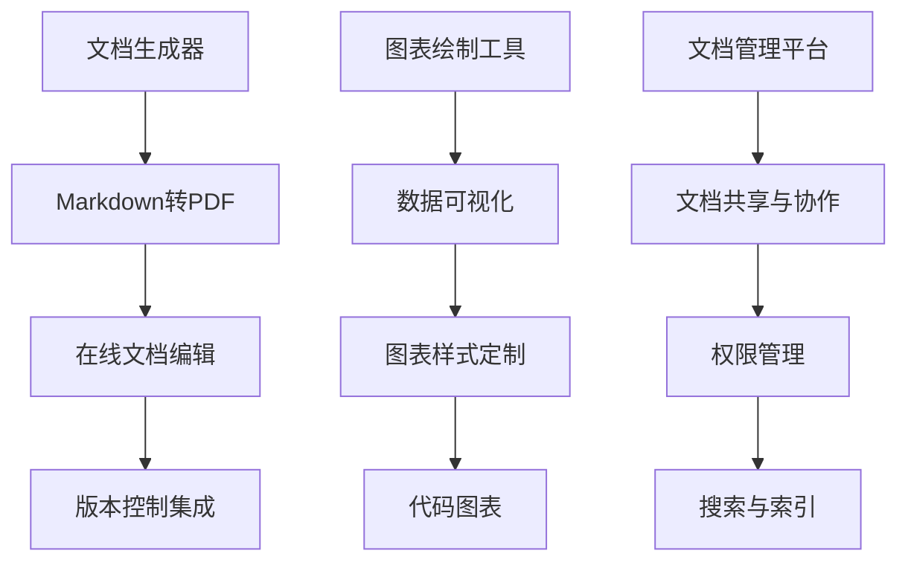

**核心算法原理讲解**

以下是使用辅助工具的一个简单算法：

```plaintext
Function UtilizeAuxiliaryTools()
    ChooseDocumentationGenerator()
    UseVisualizationTools()
    ImplementDocumentManagementPlatform()
    EnsureIntegrationWithVersionControl()
End Function
```

**数学模型和公式**

辅助工具的效率可以用以下指标表示：

$$
Tool\ Efficiency = \frac{Task\ Completion}{Tool\ Time}
$$

**举例说明**

例如，Jenkins是一个常用的文档生成器，它可以将Markdown文档自动转换为PDF或HTML格式，提高了文档生成的效率。

---

## 第4章：技术文档测试与发布

#### 4.1 技术文档的测试流程

**背景介绍**

技术文档的测试是确保文档质量和准确性的关键步骤。

**核心概念与联系**

技术文档的测试涉及内容审查、格式验证和反馈收集。以下是这个过程的Mermaid流程图：

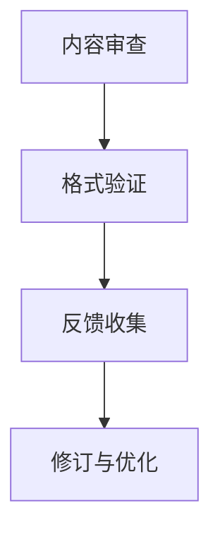

**核心算法原理讲解**

以下是技术文档测试的一个简单算法：

```plaintext
Function TestTechnicalDocumentation()
    ConductContentReview()
    ValidateFormatting()
    GatherFeedback()
    ReviseContent()
End Function
```

**数学模型和公式**

文档测试的准确性可以用以下指标表示：

$$
Accuracy = \frac{CorrectContent}{TotalContent}
$$

**举例说明**

例如，在审查文档内容时，可以使用自动化工具检查语法错误和格式问题。

#### 4.2 发布技术文档的途径

**背景介绍**

发布技术文档是让文档对外部受众可用的最后一步。

**核心概念与联系**

发布技术文档的途径包括网站、文档管理平台和电子书等。以下是这些途径的选择和应用的Mermaid流程图：

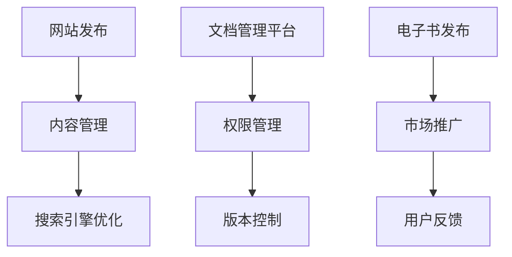

**核心算法原理讲解**

以下是发布技术文档的一个简单算法：

```plaintext
Function PublishTechnicalDocumentation()
    ChoosePublicationChannel()
    ConfigurePermissions()
    ImplementVersionControl()
    PromoteDocumentation()
End Function
```

**数学模型和公式**

文档发布的成功率可以用以下指标表示：

$$
SuccessRate = \frac{PublishedContent}{TotalContent}
$$

**举例说明**

例如，使用GitHub Pages可以方便地将Markdown文档发布为静态网站，提高文档的可访问性和可搜索性。

#### 4.3 管理和更新技术文档

**背景介绍**

管理和更新技术文档是确保其持续有效性的关键。

**核心概念与联系**

文档管理和更新涉及版本控制、内容审查和持续改进。以下是这个过程的Mermaid流程图：

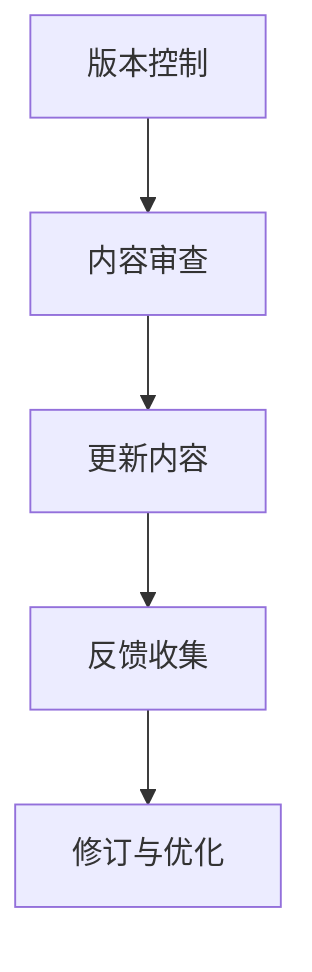

**核心算法原理讲解**

以下是管理和更新技术文档的一个简单算法：

```plaintext
Function ManageAndUpdateTechnicalDocumentation()
    ImplementVersionControl()
    ConductRegularReviews()
    UpdateContent()
    GatherFeedback()
    ReviseAndOptimize()
End Function
```

**数学模型和公式**

文档的更新频率可以用以下指标表示：

$$
UpdateFrequency = \frac{UpdatedContent}{TotalContent}
$$

**举例说明**

例如，定期审查和更新文档内容，确保其与最新技术进展保持一致。

---

## 第二部分：技术文档中的沟通技巧

#### 第5章：有效沟通的原则

**背景介绍**

技术文档的编写不仅需要清晰的表达，还需要有效的沟通技巧，以确保信息的准确传递。

**核心概念与联系**

有效沟通的原则包括清晰性、简洁性、针对性、及时性和反馈性。以下是这些原则的Mermaid流程图：

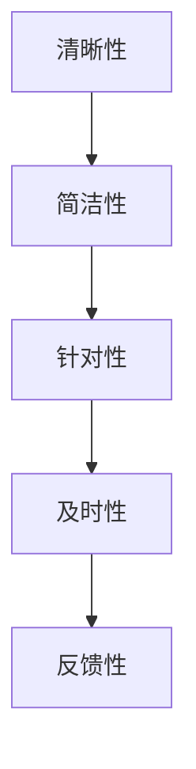

**核心算法原理讲解**

以下是有效沟通的一个简单算法：

```plaintext
Function EffectiveCommunication()
    EnsureClarity()
    SimplifyLanguage()
    TargetAudience()
    BeTimely()
    SeekFeedback()
End Function
```

**数学模型和公式**

沟通的有效性可以用以下指标表示：

$$
Effectiveness = \frac{InformationReceived}{InformationSent}
$$

**举例说明**

例如，通过及时反馈和持续改进，可以提高文档的可理解性和实用性。

#### 5.1 沟通的基本原则

**核心概念与联系**

沟通的基本原则包括明确目标、倾听对方、尊重差异和建立信任。以下是这些原则的Mermaid流程图：

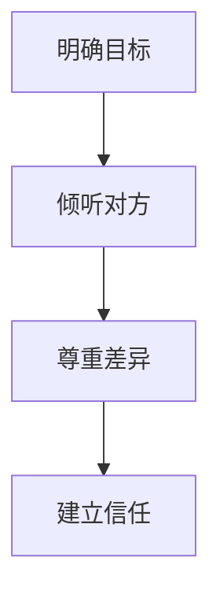

**核心算法原理讲解**

以下是沟通的基本原则的一个简单算法：

```plaintext
Function BasicCommunicationPrinciples()
    DefineObjectives()
    ListenToOthers()
    RespectDifferences()
    BuildTrust()
End Function
```

**数学模型和公式**

沟通的有效性可以用以下指标表示：

$$
CommunicationEffectiveness = \frac{ObjectiveAchievement}{CommunicationEffort}
$$

**举例说明**

例如，在编写技术文档时，明确文档的目标和受众，有助于提高沟通的针对性。

#### 5.2 沟通的障碍与解决方案

**核心概念与联系**

沟通过程中可能会遇到语言障碍、文化差异和时间冲突等障碍。以下是这些障碍及其解决方案的Mermaid流程图：

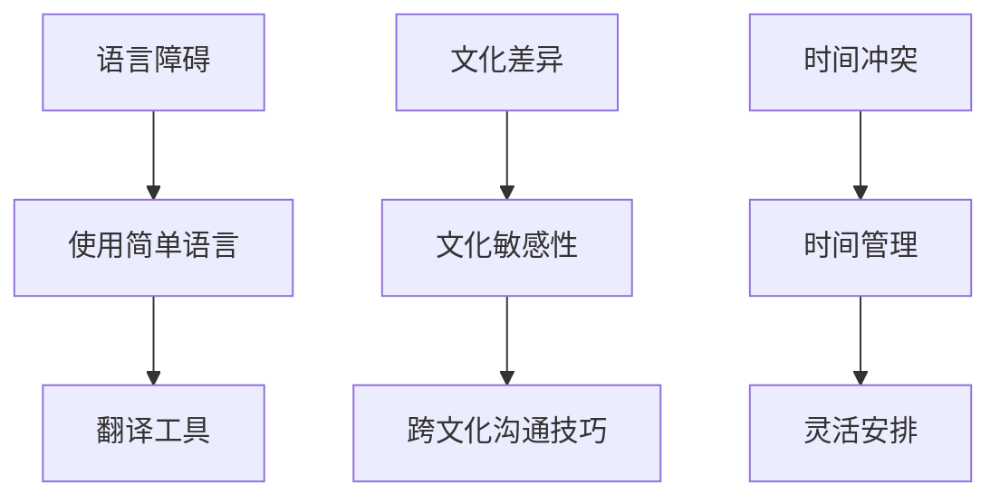

**核心算法原理讲解**

以下是解决沟通障碍的一个简单算法：

```plaintext
Function OvercomeCommunicationBarriers()
    UseSimpleLanguage()
    PracticeCulturalSensitivity()
    ManageTimeEfficiently()
End Function
```

**数学模型和公式**

沟通的流畅性可以用以下指标表示：

$$
Fluency = \frac{EffectiveCommunication}{TotalCommunication}
$$

**举例说明**

例如，在跨文化沟通中，使用简单语言和培养文化敏感性是克服语言障碍的有效方法。

#### 5.3 情景模拟与应对策略

**核心概念与联系**

情景模拟是一种有效的沟通训练方法，可以帮助识别潜在的沟通障碍并制定应对策略。以下是情景模拟和应对策略的Mermaid流程图：

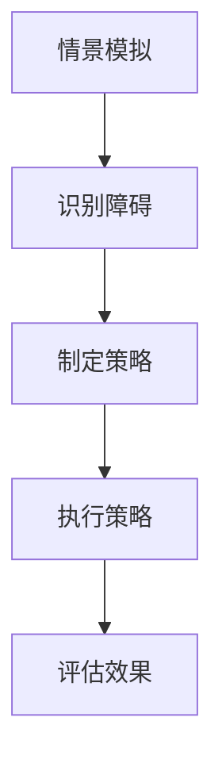

**核心算法原理讲解**

以下是情景模拟和应对策略的一个简单算法：

```plaintext
Function ScenarioSimulationAndResponse()
    IdentifyPotentialBarriers()
    DevelopResponseStrategies()
    SimulateCommunicationScenarios()
    EvaluateAndImprove()
End Function
```

**数学模型和公式**

沟通的训练效果可以用以下指标表示：

$$
TrainingEffectiveness = \frac{ImprovedPerformance}{TotalPerformance}
$$

**举例说明**

例如，通过情景模拟，开发人员可以预演与客户的交流场景，提高实际沟通时的应对能力。

---

## 第6章：技术文档中的语言表达

**背景介绍**

技术文档的语言表达直接影响其可读性和准确性。选择合适的语言、避免专业术语和确保文本可读性是提高文档质量的关键。

**核心概念与联系**

以下是技术文档语言表达的关键要素及其Mermaid流程图：

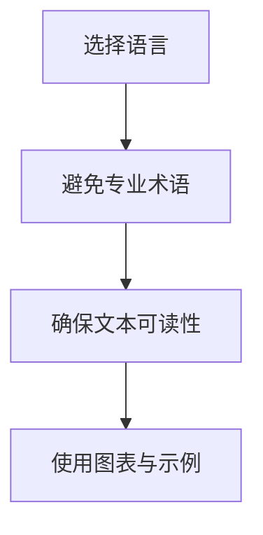

**核心算法原理讲解**

以下是优化技术文档语言表达的一个简单算法：

```plaintext
Function OptimizeLanguageUsage()
    ChooseAppropriateLanguage()
    AvoidJargon()
    EnsureReadability()
    UseVisualAids()
End Function
```

**数学模型和公式**

文档的可读性可以用以下指标表示：

$$
Readability = \frac{Understandability}{TotalContent}
$$

**举例说明**

例如，在解释复杂的编程概念时，可以使用图表和示例来帮助读者更好地理解。

#### 6.1 选择合适的语言

**核心概念与联系**

选择合适的语言是确保文档易于理解的关键。以下是一些选择合适语言的指导原则：

- **简洁性**：使用简单的词汇和句式。
- **准确性**：确保用词准确，避免歧义。
- **一致性**：保持术语和格式的统一。

**核心算法原理讲解**

以下是选择合适语言的一个简单算法：

```plaintext
Function ChooseAppropriateLanguage()
    AnalyzeTargetAudience()
    SimplifyLanguage()
    EnsureAccuracy()
    MaintainConsistency()
End Function
```

**数学模型和公式**

语言选择的适当性可以用以下指标表示：

$$
LanguageSuitability = \frac{AppropriateLanguage}{TotalLanguage}
$$

**举例说明**

例如，在面向新手的文档中，应避免使用复杂的术语和高级句式，以便更容易理解。

#### 6.2 避免使用专业术语

**核心概念与联系**

避免使用专业术语是提高文档可读性的重要策略，尤其是面向非专业读者的文档。

- **问题**：专业术语可能导致读者困惑，降低文档的理解度。
- **解决方案**：使用通俗易懂的语言，或者提供术语的解释。

**核心算法原理讲解**

以下是避免使用专业术语的一个简单算法：

```plaintext
Function AvoidJargon()
    IdentifyJargon()
    ReplaceWithSimpleTerms()
    ProvideExplanations()
End Function
```

**数学模型和公式**

术语的可理解性可以用以下指标表示：

$$
JargonUnderstanding = \frac{UnderstoodJargon}{TotalJargon}
$$

**举例说明**

例如，将“内存泄漏”替换为“资源未释放”，使文档更易于理解。

#### 6.3 提高文本可读性

**核心概念与联系**

提高文本可读性涉及多种策略，如使用清晰的结构、简短的句子和适当的格式。

- **结构**：组织内容，使其逻辑清晰。
- **句子**：使用简短的句子，避免冗长复杂的表达。
- **格式**：使用标题、列表和图表来增强文档的结构和可读性。

**核心算法原理讲解**

以下是提高文本可读性的一个简单算法：

```plaintext
Function ImproveTextReadability()
    OrganizeContent()
    UseShortSentences()
    ApplyClearFormatting()
End Function
```

**数学模型和公式**

文本的可读性可以用以下指标表示：

$$
Readability = \frac{UnderstandableContent}{TotalContent}
$$

**举例说明**

例如，通过使用标题和段落分隔，使文档更易于浏览和理解。

---

## 第7章：图表与示例的使用

图表和示例是技术文档中重要的可视化元素，能够帮助读者更好地理解和掌握技术概念。正确使用图表和示例不仅可以增强文档的可读性，还能提高信息传递的效率。

### 7.1 图表的选择与应用

**核心概念与联系**

图表的选择与应用取决于文档的内容和目标受众。以下是一些常见的图表类型及其适用场景：

- **条形图**：用于比较不同类别的数据。
- **折线图**：用于展示数据的变化趋势。
- **饼图**：用于显示各部分占整体的比例。
- **流程图**：用于展示流程或步骤。

**核心算法原理讲解**

以下是选择和应用图表的一个简单算法：

```plaintext
Function ChooseAndUseCharts()
    IdentifyContentNeeds()
    SelectAppropriateChartType()
    DesignAndCreateChart()
    IntegrateIntoDocumentation()
End Function
```

**数学模型和公式**

图表的适用性可以用以下指标表示：

$$
ChartRelevance = \frac{ApplicableCharts}{TotalCharts}
$$

**举例说明**

例如，在解释一个复杂的算法时，可以使用流程图来展示算法的执行步骤。

### 7.2 示例的编写与解释

**核心概念与联系**

示例是技术文档中的重要组成部分，能够帮助读者实际操作和理解抽象的概念。编写示例时，需要考虑以下要点：

- **真实性**：确保示例具有实际应用价值。
- **简明性**：示例应简洁明了，避免冗余。
- **可复现性**：示例应易于复现，以便读者验证。

**核心算法原理讲解**

以下是编写和解释示例的一个简单算法：

```plaintext
Function WriteAndExplainExamples()
    IdentifyConceptToExplain()
    CreateARealisticExample()
    KeepExampleSimple()
    EnsureReproducibility()
End Function
```

**数学模型和公式**

示例的实用性可以用以下指标表示：

$$
ExamplePracticality = \frac{PracticalExamples}{TotalExamples}
$$

**举例说明**

例如，在解释SQL查询时，可以提供一个实际的查询示例，并解释其执行结果。

### 7.3 图表与示例的排版与美化

**核心概念与联系**

图表和示例的排版与美化对于文档的整体视觉效果至关重要。以下是一些排版与美化的技巧：

- **对齐与布局**：确保图表和文本的对齐整齐，布局合理。
- **颜色与字体**：使用适当的颜色和字体来增强视觉效果。
- **注释与标签**：为图表和示例添加清晰的注释和标签，以便读者理解。

**核心算法原理讲解**

以下是图表与示例排版与美化的一个简单算法：

```plaintext
Function FormatAndEnhanceVisualAids()
    AlignVisualElements()
    UseAppropriateColorsAndFonts()
    AddClearAnnotations()
    EnsureVisualConsistency()
End Function
```

**数学模型和公式**

文档的美观性可以用以下指标表示：

$$
VisualAppeal = \frac{EnhancedVisuals}{TotalVisuals}
$$

**举例说明**

例如，使用简洁明了的图标和配色方案，可以使图表更加吸引读者。

---

## 第8章：技术文档中的反馈与改进

**背景介绍**

技术文档的反馈与改进是确保文档质量和用户满意度的重要环节。通过收集用户反馈、改进文档内容，并保持更新频率，可以提高文档的实用性和影响力。

**核心概念与联系**

以下是技术文档反馈与改进的关键要素及其关系：

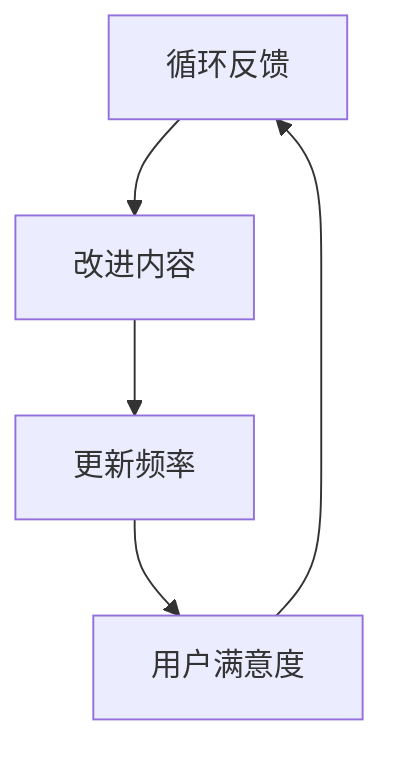

**核心算法原理讲解**

以下是技术文档反馈与改进的一个简单算法：

```plaintext
Function FeedbackAndImprovement()
    CollectUserFeedback()
    AnalyzeFeedback()
    ReviseContent()
    MaintainUpdateFrequency()
    SeekContinuousFeedback()
End Function
```

**数学模型和公式**

文档的改进效果可以用以下指标表示：

$$
ImprovementEffectiveness = \frac{ImprovedContent}{TotalContent}
$$

**举例说明**

例如，通过定期收集用户反馈，可以识别文档中的不足，并进行相应的修订和优化。

### 8.1 收集用户反馈

**核心概念与联系**

收集用户反馈是改进技术文档的重要步骤。以下是一些有效收集用户反馈的方法：

- **调查问卷**：设计详细的调查问卷，收集用户意见。
- **用户访谈**：进行一对一的用户访谈，深入了解用户需求。
- **社交媒体**：在社交媒体平台上收集用户反馈，增加互动性。

**核心算法原理讲解**

以下是收集用户反馈的一个简单算法：

```plaintext
Function CollectUserFeedback()
    DesignSurveys()
    ConductInterviews()
    MonitorSocialMedia()
    AnalyzeFeedback()
End Function
```

**数学模型和公式**

用户反馈的质量可以用以下指标表示：

$$
FeedbackQuality = \frac{ValuableFeedback}{TotalFeedback}
$$

**举例说明**

例如，通过在线调查问卷，可以收集大量用户意见，快速识别文档中的问题。

### 8.2 改进文档内容

**核心概念与联系**

改进文档内容是提高文档质量的关键步骤。以下是一些改进文档内容的策略：

- **内容更新**：根据用户反馈，更新文档内容，确保其与实际使用场景相符。
- **结构优化**：优化文档结构，使其更加清晰、易于阅读。
- **示例丰富**：增加实际示例，帮助用户更好地理解技术概念。

**核心算法原理讲解**

以下是改进文档内容的一个简单算法：

```plaintext
Function ImproveDocumentContent()
    UpdateContentBasedOnFeedback()
    OptimizeDocumentStructure()
    EnhanceWithExamples()
End Function
```

**数学模型和公式**

文档的改进程度可以用以下指标表示：

$$
ContentImprovement = \frac{ImprovedContent}{TotalContent}
$$

**举例说明**

例如，根据用户反馈，可以添加更多具体的示例和案例，使文档更具有实用价值。

### 8.3 维护文档更新频率

**核心概念与联系**

维护文档更新频率是确保文档持续有效的重要策略。以下是一些维护更新频率的方法：

- **定期审查**：定期审查文档，确保其内容与最新技术进展保持一致。
- **自动化更新**：使用自动化工具定期更新文档，提高效率。
- **版本控制**：使用版本控制系统管理文档变更，确保更新可追溯。

**核心算法原理讲解**

以下是维护文档更新频率的一个简单算法：

```plaintext
Function MaintainUpdateFrequency()
    ScheduleRegularReviews()
    ImplementAutomatedUpdates()
    UseVersionControl()
End Function
```

**数学模型和公式**

文档的更新频率可以用以下指标表示：

$$
UpdateFrequency = \frac{UpdatedContent}{TotalContent}
$$

**举例说明**

例如，通过设置定期审查机制，可以确保文档内容及时更新，保持其时效性。

---

## 第三部分：项目实战与案例分析

### 第9章：技术文档写作实战

**背景介绍**

技术文档写作实战是验证和提升写作技能的重要途径。通过实际操作，可以更好地理解技术文档的写作原则和方法。

**核心概念与联系**

以下是技术文档写作实战的关键步骤及其关系：

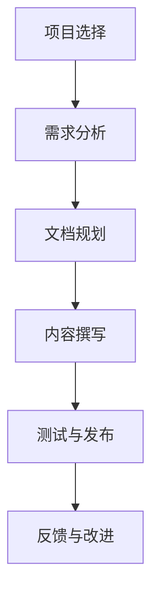

**核心算法原理讲解**

以下是技术文档写作实战的一个简单算法：

```plaintext
Function TechnicalDocumentationPracticum()
    ChooseProject()
    AnalyzeRequirements()
    PlanDocumentation()
    WriteContent()
    TestAndPublish()
    CollectFeedback()
    ImproveDocumentation()
End Function
```

**数学模型和公式**

文档的质量可以用以下指标表示：

$$
DocumentQuality = \frac{ImprovedContent}{TotalContent}
$$

**举例说明**

例如，选择一个实际项目，编写相关技术文档，并持续收集用户反馈进行改进。

### 第10章：技术文档案例分析

**背景介绍**

技术文档案例分析是通过分析成功和失败的技术文档，总结经验和教训，从而提高写作水平。

**核心概念与联系**

以下是技术文档案例分析的几个关键方面：

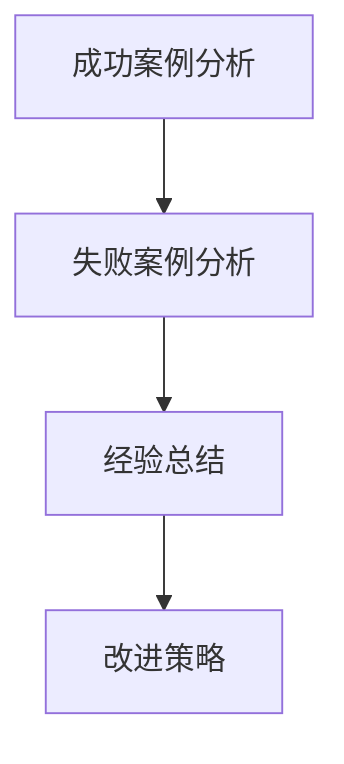

**核心算法原理讲解**

以下是技术文档案例分析的一个简单算法：

```plaintext
Function TechnicalDocumentationCaseAnalysis()
    AnalyzeSuccessCases()
    AnalyzeFailureCases()
    SummarizeExperience()
    DevelopImprovementStrategies()
End Function
```

**数学模型和公式**

案例分析的深度可以用以下指标表示：

$$
AnalysisDepth = \frac{DetailedCases}{TotalCases}
$$

**举例说明**

例如，分析某知名技术公司的文档案例，总结其成功经验和失败教训。

### 第11章：技术文档写作中的常见问题与解决

**背景介绍**

技术文档写作过程中，常见问题会影响文档的质量和读者体验。识别并解决这些问题是提高文档编写效率的关键。

**核心概念与联系**

以下是技术文档写作中的常见问题及其解决方案：

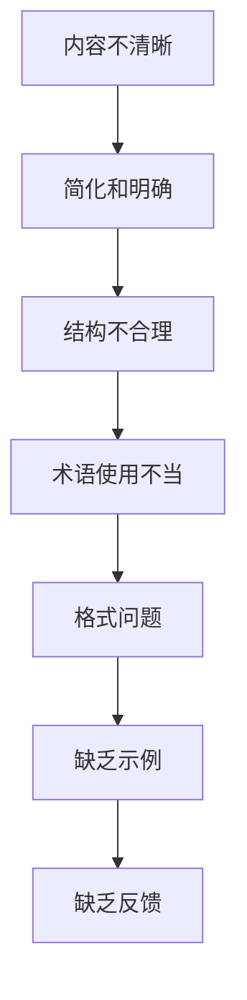

**核心算法原理讲解**

以下是解决技术文档写作问题的一个简单算法：

```plaintext
Function SolveCommonWritingProblems()
    ClarifyContent()
    ImproveStructure()
    UseTermsappropriately()
    AddressFormatting()
    IncludeExamples()
    SeekFeedback()
End Function
```

**数学模型和公式**

文档的质量可以用以下指标表示：

$$
DocumentQuality = \frac{ImprovedContent}{TotalContent}
$$

**举例说明**

例如，通过简化内容、明确结构，并添加适当的示例和反馈，可以提高文档的质量。

---

## 附录

### 附录 A：常用技术文档编写资源

**背景介绍**

为了提高技术文档写作的效率和效果，以下是一些常用的技术文档编写资源。

**核心概念与联系**

以下是技术文档编写资源的选择和应用：

```mermaid
graph TD
A[在线教程] --> B[书籍]
B --> C[论坛]
C --> D[博客]
D --> E[文档管理工具]
```

**核心算法原理讲解**

以下是利用技术文档编写资源的一个简单算法：

```plaintext
Function UtilizeWritingResources()
    IdentifyResourceNeeds()
    AccessOnlineTutorials()
    ReferToBooks()
    EngageInForums()
    UseBloggingPlatforms()
    ImplementDocumentationTools()
End Function
```

**数学模型和公式**

资源利用的效率可以用以下指标表示：

$$
ResourceUtilization = \frac{EffectiveUse}{TotalResources}
$$

**举例说明**

例如，通过在线教程和书籍，可以快速学习技术文档写作的基础知识。

### 附录 B：技术文档写作工具推荐

**背景介绍**

为了提高技术文档写作的效率和效果，以下是一些推荐的技术文档写作工具。

**核心概念与联系**

以下是技术文档写作工具的选择和应用：

```mermaid
graph TD
A[Markdown编辑器] --> B[版本控制系统]
B --> C[图表绘制工具]
C --> D[文档管理平台]
```

**核心算法原理讲解**

以下是选择和使用技术文档写作工具的一个简单算法：

```plaintext
Function ChooseWritingTools()
    IdentifyNeeds()
    SelectMarkdownEditor()
    ImplementVersionControl()
    UseVisualizationTools()
    ImplementDocumentationPlatform()
End Function
```

**数学模型和公式**

工具的适用性可以用以下指标表示：

$$
ToolSuitability = \frac{AppropriateTools}{TotalTools}
$$

**举例说明**

例如，使用Markdown编辑器Typora可以方便地编写和格式化文档，而Git作为版本控制系统，可以有效地管理文档的版本和变更。

---

## 总结与最佳实践

通过本文的讨论，我们详细探讨了技术文档写作的基础、沟通技巧、工具使用、测试与发布、反馈与改进、项目实战、案例分析以及常见问题与解决等内容。以下是本文的核心观点和最佳实践：

1. **技术文档的重要性**：技术文档不仅是知识传递的工具，也是团队协作和客户支持的关键环节。
2. **明确目标与受众**：在撰写技术文档之前，明确文档的目标和受众，有助于提高文档的针对性和实用性。
3. **清晰简洁的表达**：使用简洁明了的语言和结构，提高文档的可读性。
4. **图表与示例的使用**：合理使用图表和示例，可以增强文档的直观性和理解度。
5. **持续反馈与改进**：定期收集用户反馈，并根据反馈持续改进文档内容，确保其时效性和实用性。
6. **工具选择与优化**：选择合适的写作工具和文档管理平台，提高写作效率和文档质量。

在技术文档写作的过程中，遵循这些最佳实践，可以大大提升文档的质量和影响力，实现更有效的沟通和知识共享。

---

### 作者信息

**作者：** AI天才研究院/AI Genius Institute & 禅与计算机程序设计艺术 /Zen And The Art of Computer Programming

AI天才研究院致力于推动人工智能技术的发展和应用，我们的目标是培养下一代人工智能领域的创新者和领导者。同时，我们通过研究和撰写技术文章，分享人工智能领域的最新研究成果和技术趋势，为业界提供有价值的见解和指导。

在《禅与计算机程序设计艺术》一书中，作者以独特的视角和深刻的思考，探讨了计算机编程的哲学和艺术，为编程领域带来了全新的启示。他的著作不仅具有学术价值，也为广大程序员提供了宝贵的实践经验和智慧。

通过本文的讨论，我们希望读者能够更好地理解技术文档写作的核心原则和实践方法，提高自身的技术沟通能力，为团队协作和项目成功贡献力量。让我们一起努力，推动技术文档写作的进步，实现更高效的沟通和知识传递。

