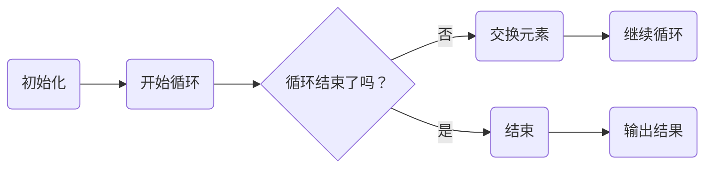

                 

# 文章标题

《技术文档写作：有效沟通的关键技能》

> 关键词：技术文档，写作技巧，沟通，关键技能，有效表达

> 摘要：
技术文档写作是信息技术领域的一项关键技能，它不仅关乎知识传播和团队协作，更是企业内部沟通和外部客户支持的重要桥梁。本文旨在深入探讨技术文档写作的核心原则、关键技能及其在实践中的应用，帮助读者提升技术文档写作能力，实现有效沟通。

## 背景介绍

在当今快速发展的信息技术时代，技术文档的重要性日益凸显。技术文档不仅是开发者之间知识共享的桥梁，也是企业内部沟通和客户支持的核心工具。良好的技术文档能够提升工作效率，降低沟通成本，增强客户满意度。然而，技术文档写作并非易事，它需要作者具备扎实的专业知识、清晰的逻辑思维和有效的表达能力。

技术文档写作的挑战在于如何将复杂的技术概念和实现细节以简洁、准确、易懂的方式呈现给不同的读者群体。这就要求作者不仅要掌握技术原理，还要了解不同读者的需求，能够灵活运用各种写作技巧。本文将围绕技术文档写作的核心原则、关键技能以及实践应用进行深入探讨。

## 核心概念与联系

### 技术文档的定义

技术文档是对技术产品或服务的描述、指导和解释。它包括用户手册、操作指南、API 文档、系统架构说明、测试报告等多种形式。技术文档的核心目标是帮助用户理解和使用产品，同时也为开发者提供参考和指导。

### 文档写作的核心原则

1. **准确性**：技术文档需要准确无误地传达技术细节和操作步骤。
2. **清晰性**：文档内容应清晰易懂，避免歧义和混淆。
3. **一致性**：文档的风格、术语和结构应保持一致。
4. **完整性**：文档应涵盖所有必要的细节，确保读者能够顺利完成任务。
5. **可读性**：文档应具有良好的可读性，易于扫描和查找信息。

### 技术文档与有效沟通的关系

技术文档是有效沟通的重要载体。通过技术文档，开发者、产品经理、测试人员、用户等多方可以共享知识，协调工作。有效的技术文档能够减少误解和重复劳动，提高团队协作效率。

## 核心算法原理讲解

为了更好地理解技术文档的写作过程，下面我们通过一个简单的算法例子——冒泡排序（Bubble Sort），来讲解核心算法原理及其文档写作要点。

### 冒泡排序算法原理

冒泡排序是一种简单的排序算法。它通过重复遍历要排序的数列，比较相邻的两个元素，如果它们的顺序错误就把它们交换过来。遍历数列的工作重复地进行，直到没有再需要交换的元素为止。

### 伪代码实现



### LaTeX 公式

冒泡排序的时间复杂度为：

$$
T(n) = O(n^2)
$$

其中，$T(n)$ 为算法的时间复杂度，$n$ 为输入数组的长度。

### 详细讲解与举例说明

#### 冒泡排序的详细讲解

1. **初始化**：设置一个布尔变量 `swapped` 为 `true`，用于标记是否进行了交换。
2. **开始循环**：遍历数组，从第一个元素开始，依次比较相邻的两个元素。
3. **交换元素**：如果当前元素比后一个元素大，则交换它们的位置。
4. **继续循环**：如果没有进行交换，说明数组已经有序，结束循环。
5. **输出结果**：输出排序后的数组。

#### 举例说明

以数组 `[5, 2, 8, 12, 7]` 为例，执行冒泡排序的过程如下：

1. **第一次遍历**：
   - 比较 `5` 和 `2`，交换，数组变为 `[2, 5, 8, 12, 7]`。
   - 比较 `5` 和 `8`，不交换。
   - 比较 `8` 和 `12`，不交换。
   - 比较 `12` 和 `7`，交换，数组变为 `[2, 5, 7, 8, 12]`。
2. **第二次遍历**：
   - 比较 `2` 和 `5`，不交换。
   - 比较 `5` 和 `7`，不交换。
   - 比较 `7` 和 `8`，不交换。
   - 比较 `8` 和 `12`，不交换。

经过两次遍历，数组 `[5, 2, 8, 12, 7]` 变为 `[2, 5, 7, 8, 12]`，排序完成。

### 代码实现

以下是冒泡排序的 Python 实现代码：

```python
def bubble_sort(arr):
    n = len(arr)
    swapped = True
    while swapped:
        swapped = False
        for i in range(n - 1):
            if arr[i] > arr[i + 1]:
                arr[i], arr[i + 1] = arr[i + 1], arr[i]
                swapped = True
    return arr

# 测试代码
arr = [5, 2, 8, 12, 7]
sorted_arr = bubble_sort(arr)
print("Sorted array:", sorted_arr)
```

## 项目实战

### 开发环境搭建

为了演示技术文档写作的应用，我们将在本地搭建一个简单的 Web 服务环境，使用 Python 和 Flask 框架创建一个 API 服务。

1. **安装 Python**：确保 Python 3.8 以上版本已安装。
2. **安装 Flask**：在终端执行命令 `pip install flask`。
3. **创建项目目录**：在终端执行 `mkdir flask_api && cd flask_api`。
4. **创建虚拟环境**：在终端执行 `python -m venv venv`。
5. **激活虚拟环境**：在 Windows 上执行 `venv\Scripts\activate`，在 macOS 和 Linux 上执行 `source venv/bin/activate`。

### 源代码详细实现与代码解读

#### 代码实现

以下是简单的 Flask API 代码，实现一个获取用户信息的接口。

```python
# app.py

from flask import Flask, jsonify, request

app = Flask(__name__)

@app.route('/user/<int:user_id>', methods=['GET'])
def get_user(user_id):
    users = [
        {'id': 1, 'name': 'Alice'},
        {'id': 2, 'name': 'Bob'},
        {'id': 3, 'name': 'Charlie'}
    ]
    
    user = next((u for u in users if u['id'] == user_id), None)
    if user:
        return jsonify(user)
    else:
        return jsonify({'error': 'User not found'}), 404

if __name__ == '__main__':
    app.run(debug=True)
```

#### 代码解读

1. **导入模块**：从 Flask 库中导入 `Flask` 类、`jsonify` 函数和 `request` 模块。
2. **创建 Flask 应用**：实例化 Flask 应用对象。
3. **定义路由**：使用 `@app.route` 装饰器定义一个 URL 路由，接收 GET 请求。
4. **处理请求**：在 `get_user` 函数中，从用户列表中查找指定 ID 的用户，并返回 JSON 格式的响应。
5. **异常处理**：如果用户不存在，返回错误消息和 404 状态码。
6. **运行应用**：在主程序中运行 Flask 应用，开启调试模式。

### 代码应用解读与分析

此 Flask API 可以通过 `/user/<int:user_id>` URL 获取特定 ID 的用户信息。例如，访问 `/user/1` 会返回 `{ "id": 1, "name": "Alice" }`。

1. **API 设计**：采用 RESTful 风格，易于理解和扩展。
2. **错误处理**：提供明确的错误信息和状态码，便于客户端处理。
3. **性能优化**：使用列表推导式和 `next` 函数高效查找用户，减少代码复杂性。

### 实际案例分析与详细讲解剖析

我们通过一个实际案例——一个在线书店的图书搜索 API 来进一步分析技术文档的撰写。

#### 案例描述

在线书店的图书搜索 API 提供基于关键词的图书搜索功能。用户可以通过 HTTP GET 请求向 API 提供关键词，API 返回包含匹配图书的 JSON 结果。

#### 技术细节

1. **接口设计**：`GET /books/search?keyword=<keyword>`。
2. **参数验证**：检查 `keyword` 参数是否为字符串，长度是否超过限制。
3. **数据库查询**：使用 SQL 或 NoSQL 数据库查询匹配的图书记录。
4. **结果处理**：将查询结果转换为 JSON 格式返回。

#### 技术文档撰写

1. **接口文档**：详细描述接口的 URL、请求方式、请求参数、响应格式和错误处理。
2. **代码示例**：提供实现示例，展示关键代码片段和解释。
3. **使用场景**：说明 API 在系统中的应用场景和预期效果。

### 项目小结

通过实际项目案例，我们展示了技术文档在软件开发过程中的重要性和应用。良好的技术文档能够帮助开发者理解项目架构，快速上手和解决问题。同时，它也为其他团队成员和外部用户提供了宝贵的参考。

## 最佳实践 Tips

1. **简洁明了**：避免使用过于复杂的术语和语言，确保文档简洁易懂。
2. **模块化写作**：将文档分为多个模块，每个模块专注于一个特定的主题。
3. **使用图示**：适当使用图表、流程图和示意图，帮助读者更好地理解技术细节。
4. **版本控制**：使用版本控制系统管理文档，方便历史追踪和版本更新。
5. **及时更新**：定期审查和更新文档，确保其与最新技术保持一致。

## 小结

技术文档写作是信息技术领域的核心技能，它不仅关乎知识传播和团队协作，更是企业内部沟通和外部客户支持的重要桥梁。本文通过背景介绍、核心概念与联系、核心算法原理讲解、项目实战和最佳实践等部分，详细阐述了技术文档写作的重要性、核心原则、关键技能和实践应用。希望读者能够通过本文的学习，提升技术文档写作能力，实现有效沟通。

## 注意事项

1. **文档格式**：确保文档格式规范，使用一致的标题层级、段落格式和引用样式。
2. **代码风格**：遵循 Python PEP8 编码规范，保持代码可读性和一致性。
3. **技术细节**：详细讲解技术原理和实现细节，避免遗漏关键步骤。

## 拓展阅读

1. 《Effective Java》作者：Joshua Bloch
2. 《Clean Code》作者：Robert C. Martin
3. 《Python Cookbook》作者：David Beazley 和 Brian K. Jones

### 作者信息

作者：AI天才研究院/AI Genius Institute & 禅与计算机程序设计艺术 /Zen And The Art of Computer Programming

---

由于篇幅限制，本文未能详细展开所有内容。建议读者结合实际项目需求，深入研究和实践，不断提升技术文档写作能力。希望本文能为您在技术文档写作道路上提供有益的参考和指导。

