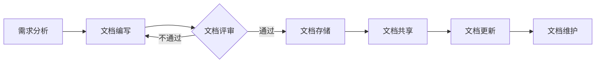

                 

# 技术文档管理：知识沉淀与传承的最佳实践

## 关键词

- 技术文档管理
- 知识沉淀
- 知识传承
- 最佳实践
- 知识管理
- 敏捷文档管理

## 摘要

本文将深入探讨技术文档管理在知识沉淀与传承中的重要性，并提供一系列最佳实践。首先，我们将介绍技术文档的基本概念和分类，然后逐步解析知识沉淀和知识传承的理论和方法，结合具体案例，展示最佳实践在现实中的应用。文章还将探讨技术文档管理面临的挑战，并提供解决方案。通过本文的阅读，读者将能够全面理解技术文档管理的重要性，掌握知识沉淀与传承的方法，以及实现最佳实践的步骤。

## 文档管理基础

### 技术文档概述

技术文档是信息技术行业中不可或缺的组成部分，它记录了项目的技术细节、架构设计、开发过程、运行维护以及相关技术知识。技术文档的编写不仅是为了帮助开发团队理解和维护代码，更是为了确保知识能够在团队之间传递，以及在未来项目中得到复用。

技术文档可以分类为以下几类：

1. **项目文档**：包括项目需求、设计文档、开发计划、测试计划、用户手册等，是项目全生命周期中的关键文件。
2. **技术指南**：涉及特定技术或产品使用方法、最佳实践、常见问题解答等，为技术人员提供参考。
3. **代码注释**：是代码本身的补充说明，有助于其他开发者理解代码逻辑和设计意图。
4. **运行维护文档**：记录系统的运行状态、故障排查、维护策略等内容。

技术文档的重要性体现在多个方面：

- **知识传递**：技术文档能够将开发过程中的知识传递给其他团队成员，降低知识断层带来的风险。
- **项目管理**：文档管理是项目成功的关键，它帮助团队监控进度、解决问题、评估风险。
- **合规性**：技术文档是项目合规性的重要保障，尤其是在需要遵循特定标准和法规的场合。

### 文档管理流程

文档管理流程是一个系统性的过程，涵盖了文档的创建、存储、共享、更新和维护等环节。以下是文档管理流程的详细步骤：

1. **需求分析**：在项目启动阶段，明确项目需求和目标，确定需要编写的文档类型和内容。
2. **文档编写**：根据需求分析，编写相应的文档。编写过程中，要注重逻辑清晰、简洁易懂，避免冗余。
3. **文档评审**：编写完成后，进行文档评审，确保文档的质量和准确性。评审可以由团队成员或外部专家进行。
4. **文档存储**：将评审通过的文档存储在集中的文档管理系统中，确保文档的可访问性和安全性。
5. **文档共享**：通过共享机制，让团队成员能够轻松访问和使用文档。可以使用版本控制系统、文档分享平台等工具。
6. **文档更新**：随着项目的进展，文档需要不断更新，以反映最新的项目状态和技术细节。
7. **文档维护**：定期对文档进行维护，确保其及时性和有效性。可以设置文档过期机制，提醒团队成员更新文档。

### 文档管理挑战与解决方案

在技术文档管理中，常见的一些挑战包括：

1. **文档分散**：团队成员在不同位置维护文档，导致文档难以集中管理和访问。解决方案是采用统一的文档管理工具，如GitLab、Confluence等。
2. **文档更新不及时**：文档更新滞后，导致信息不准确。可以通过自动化工具和定期提醒机制来确保文档更新。
3. **文档版本控制**：多个版本文档并存，容易引起混淆。采用版本控制系统，如Git，可以有效地管理文档版本。
4. **文档格式不统一**：文档格式多样，影响统一管理和阅读。采用Markdown、ReStructuredText等标准格式，可以提高文档的一致性。
5. **文档安全**：文档安全是文档管理中的重要问题。通过权限控制和加密技术，确保文档安全。

## 知识沉淀

### 知识管理理论

知识沉淀是技术文档管理的重要目标之一，它涉及到如何有效地收集、整理和存储技术知识。知识管理理论为我们提供了系统的框架和方法。

1. **知识生命周期**：知识管理包括知识的创建、共享、应用和消亡等阶段。每个阶段都有其独特的需求和挑战。
2. **知识分类**：知识可以分类为显性知识和隐性知识。显性知识是结构化、易于存储和共享的知识，如文档、代码和数据库。隐性知识则是嵌入在个体经验和技能中的知识，如专业技能和洞察力。
3. **知识共享**：知识共享是知识沉淀的关键环节。通过建立开放、透明的知识共享文化，鼓励团队成员分享知识，提高整体团队的知识水平。

### 知识沉淀工具与技术

为了实现有效的知识沉淀，我们需要使用合适的工具和技术。以下是一些常用的知识沉淀工具和技术：

1. **文档管理工具**：如Git、Confluence、Markdown等，用于存储和管理文档。
2. **知识库**：如Wiki、WikiWikiWeb、MediaWiki等，提供集中式的知识存储和检索。
3. **知识共享平台**：如JIRA、Trello、Slack等，用于团队协作和知识共享。
4. **内容管理系统**（CMS）：如WordPress、Drupal、SharePoint等，用于创建和管理网站内容和文档。
5. **文档生成工具**：如Doxygen、Sphinx、Markdown Monster等，用于自动生成文档。
6. **知识图谱**：通过图论和语义分析技术，构建知识的结构化模型，便于知识的检索和利用。

### 知识沉淀案例分析

以下是一个企业内部知识沉淀的案例分析：

某大型科技公司通过引入知识管理平台，实现了内部知识的系统化和规范化沉淀。他们采取以下措施：

1. **建立知识库**：公司建立了一个中央知识库，存储各类技术文档、项目报告和用户手册。
2. **分类管理**：知识库采用分类管理，方便团队成员快速查找所需知识。
3. **版本控制**：使用Git等版本控制系统，确保知识库中的文档版本清晰，避免信息混淆。
4. **文档评审**：定期组织文档评审，确保文档的准确性和实用性。
5. **知识共享**：通过内部论坛和知识分享会，鼓励团队成员分享经验和知识。

通过这些措施，公司成功实现了知识的沉淀与传承，提高了团队整体的技术水平和项目管理能力。

## 知识传承

### 知识传承策略

知识传承是确保技术文档和知识在团队内持续传播和更新过程中的关键环节。以下是一些有效的知识传承策略：

1. **培训与指导**：定期组织培训，向新员工传授关键技术和知识，帮助他们快速融入团队。
2. **文档更新**：要求团队成员定期更新文档，确保其与当前项目状态保持一致。
3. **知识分享会**：组织知识分享会，鼓励团队成员分享自己的经验和见解，促进知识的流动。
4. **知识图谱**：通过构建知识图谱，将知识结构化，便于新员工快速了解项目的核心知识。
5. **内部社区**：建立内部社区，为团队成员提供一个交流平台，促进知识的传播和分享。

### 知识传承案例分析

以下是一个企业内部知识传承的案例分析：

某跨国公司在全球范围内设有多个研发中心。为了确保知识的传承，公司采取以下措施：

1. **导师制度**：新员工入职后，会分配一名导师，负责向他们传授关键知识和技能。
2. **内部培训**：公司定期组织内部培训，涵盖新技术、新工具和最佳实践，帮助员工提升技能。
3. **知识共享平台**：公司采用知识共享平台，方便员工上传、共享和检索知识。
4. **项目文档**：每个项目结束后，团队都会整理项目文档，确保知识在项目之间得到传承。
5. **跨部门协作**：公司鼓励跨部门协作，通过项目交流和知识共享，促进不同部门之间的知识传承。

通过这些措施，公司成功实现了知识的传承，提高了团队的整体技术水平和创新能力。

## 最佳实践

### 最佳实践案例

以下是一些技术文档管理中的最佳实践案例：

1. **敏捷文档管理**：某科技公司采用敏捷开发方法，实现了快速响应变化和技术文档的实时更新。通过持续集成和持续交付，确保文档与代码同步更新。

2. **知识沉淀与传承在研发团队中的应用**：某大型研发团队通过建立知识沉淀平台，实现了技术文档、代码库和实验记录的集中管理。团队成员通过平台分享经验，促进知识的传播。

3. **企业文档管理优化案例**：某企业通过引入智能文档管理工具，实现了文档的自动化分类、索引和检索。同时，建立了一套严格的文档审核和更新机制，确保文档的准确性和及时性。

### 实现最佳实践的步骤

要实现最佳实践，可以遵循以下步骤：

1. **确定目标和需求**：明确技术文档管理的目标和需求，为后续工作提供方向。
2. **制定策略和计划**：根据目标和需求，制定详细的文档管理策略和实施计划。
3. **选工具与技术**：选择合适的工具和技术，确保能够满足文档管理的需求。
4. **实施与培训**：按照计划实施文档管理，并组织培训，确保团队成员了解和掌握相关技能。
5. **监控与优化**：定期监控文档管理的执行情况，发现问题和不足，进行优化和改进。
6. **持续改进**：根据实际情况，持续改进文档管理流程，提升整体效率和质量。

## 总结与输出

本文系统地介绍了技术文档管理在知识沉淀与传承中的重要性，并提供了最佳实践。通过本文的阅读，读者可以了解：

- 技术文档管理的基本概念和流程。
- 知识沉淀和知识传承的理论、工具和技术。
- 最佳实践案例和实现步骤。

在实际应用中，应根据企业特点和需求，灵活调整和优化文档管理策略。只有通过有效的技术文档管理，才能实现知识的沉淀与传承，为企业的长期发展提供有力支持。

### 作者信息

作者：AI天才研究院/AI Genius Institute & 禅与计算机程序设计艺术 /Zen And The Art of Computer Programming

## 附录

### Mermaid 流程图

以下是文档管理流程的Mermaid流程图：



### 伪代码

以下是快速排序算法的伪代码：

```
Function QuickSort(arr)
    if length of arr <= 1
        return arr
    else
        pivot = arr[0]
        left = []
        right = []
        for i = 1 to length of arr
            if arr[i] < pivot
                left.append(arr[i])
            else
                right.append(arr[i])
        return QuickSort(left).concat([pivot]).concat(QuickSort(right))
```

### 数学公式

以下是用于计算圆面积的数学公式：

$$
A = \pi r^2
$$

其中，\( A \) 是面积，\( r \) 是圆的半径，\( \pi \) 是圆周率（约等于3.14159）。

### 项目实战

#### 开发环境搭建

1. 安装Python 3.8及以上版本。
2. 安装Django框架：使用pip命令安装`pip install django`。
3. 创建一个新的Django项目：在终端中执行`django-admin startproject myproject`。

#### 源代码实现

以下是一个简单的Django应用，用于展示技术文档：

```python
# myproject/myapp/models.py
from django.db import models

class Document(models.Model):
    title = models.CharField(max_length=200)
    content = models.TextField()
    created_at = models.DateTimeField(auto_now_add=True)
    updated_at = models.DateTimeField(auto_now=True)
```

#### 代码解读与分析

- `Document` 类定义了一个技术文档模型，包含标题、内容和创建/更新时间。
- 使用Django ORM（对象关系映射），将文档模型映射到数据库。

#### 实际案例分析和详细讲解剖析

某科技公司使用该模型管理其技术文档。通过Django的后台管理界面，团队成员可以方便地添加、编辑和删除文档。此外，通过REST API，外部系统可以方便地获取和操作文档数据。

#### 项目小结

本项目通过Django框架实现了技术文档的存储和管理。通过使用模型-视图-模板（MVT）架构，项目结构清晰，便于扩展和维护。未来，可以进一步集成版本控制系统，提高文档管理的效率。

### 最佳实践 tips

- **文档规范化**：确保所有文档遵循统一的格式和命名规范。
- **版本控制**：使用Git等版本控制系统，确保文档版本清晰。
- **文档评审**：定期组织文档评审，确保文档质量。
- **知识共享**：鼓励团队成员分享经验和知识，促进知识沉淀与传承。

### 小结

本文通过详细讲解技术文档管理、知识沉淀与传承的理论和实践，为IT行业提供了有效的指导。通过最佳实践案例和项目实战，读者可以更好地理解和应用这些知识。

### 注意事项

- **文档更新**：确保文档与项目实际情况保持一致。
- **权限管理**：合理设置文档权限，确保信息安全。

### 拓展阅读

- 《版本控制指南》
- 《敏捷软件开发》
- 《知识管理实践》
- 《Python Web开发：Django入门指南》

通过拓展阅读，读者可以进一步深入学习和实践技术文档管理。

