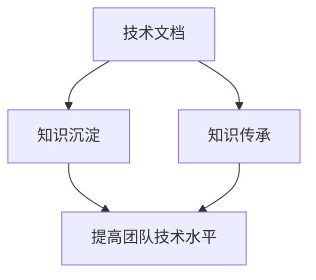
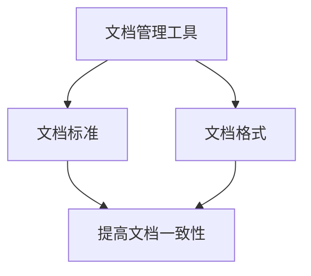

                 

### 文章标题

#### 技术文档管理：知识沉淀与传承的重要性

> 关键词：技术文档管理，知识沉淀，知识传承，文档管理工具，成功案例

> 摘要：本文深入探讨了技术文档管理在知识沉淀与传承中的重要性。从背景介绍到核心概念，再到算法原理、数学模型和项目实战，本文通过详细的案例分析，全面阐述了技术文档管理的基本原则和实践方法。同时，本文也展望了未来技术文档管理的发展趋势，为读者提供了实用的最佳实践和拓展阅读建议。

---

### 背景介绍

在信息技术迅速发展的今天，知识已成为企业和社会进步的核心驱动力。技术文档作为知识的重要载体，其管理质量和效率直接影响到知识的沉淀和传承。随着项目复杂度增加和团队规模扩大，技术文档的数量和种类也呈指数级增长。然而，传统的文档管理方式往往存在诸多问题，如文档分散、版本控制困难、更新不及时等，这些问题严重影响了知识的有效利用和传承。

技术文档管理不仅关系到项目开发的顺利进行，也关系到企业的核心竞争力。有效的技术文档管理可以帮助团队快速掌握项目背景、技术架构和业务逻辑，提高协作效率，降低沟通成本。同时，良好的文档管理也有助于知识的沉淀和传承，确保企业在人员流动和项目变迁中仍能保持技术积累和创新能力。

本文将从技术文档管理的重要性、知识沉淀的方法、知识传承的策略、成功案例和未来发展趋势等方面进行详细探讨，旨在为读者提供全面的指导和建议。

---

### 核心概念与联系

在探讨技术文档管理之前，我们需要明确几个核心概念：技术文档、知识沉淀和知识传承。

1. **技术文档**：技术文档是关于项目开发、部署、维护和使用等方面的文档，包括设计文档、需求文档、用户手册、API文档等。技术文档不仅是开发过程中的参考资料，也是知识传递的重要载体。
   
2. **知识沉淀**：知识沉淀是指将开发、运营、维护等过程中的经验和教训系统地记录、整理和保存，以便于后人参考和利用。知识沉淀有助于提高团队的整体技术水平，促进知识的积累和创新。

3. **知识传承**：知识传承是指通过有效的文档管理，将技术知识和经验从一代传至下一代，确保知识的连续性和持续性。知识传承有助于保持团队的技术积累，提高项目的成功率。

上述概念之间的关系可以用以下 Mermaid 流程图来表示：



- 技术文档通过记录项目过程中的所有细节，为知识沉淀提供了基础。
- 知识沉淀将散乱的经验和教训整理成系统化的知识库，为知识传承提供了素材。
- 知识传承通过有效的知识传递，确保了技术知识和经验的持续积累和应用。

通过这种流程，我们可以看到技术文档管理在知识沉淀与传承中的关键作用。

### 核心概念与联系

在进一步探讨技术文档管理的重要性之前，我们需要明确几个核心概念：文档管理工具、文档标准和文档格式。

1. **文档管理工具**：文档管理工具是指用于创建、编辑、存储、检索和共享文档的软件系统。常见的文档管理工具有 SharePoint、Confluence、Git 等。这些工具提供了版本控制、权限管理、搜索功能等关键特性，极大地提升了文档管理的效率。

2. **文档标准**：文档标准是指一套统一的规范和规则，用于确保文档的结构、内容、格式的一致性。常见的文档标准包括 ISO 8879 (SGML)、ISO 18626 (DITA) 等。遵循文档标准有助于提高文档的可读性、可维护性和互操作性。

3. **文档格式**：文档格式是指文档中文字、图片、表格、公式等元素的布局和表现形式。常见的文档格式包括 PDF、Word、Markdown 等。不同的文档格式适用于不同的场景和需求，选择合适的文档格式有助于提升文档的可读性和可用性。

上述概念之间的关系可以用以下 Mermaid 流程图来表示：



- 文档管理工具为文档的创建、编辑和共享提供了技术支持，是文档管理的基础。
- 文档标准为文档的结构和内容提供了统一的规范，确保文档的一致性和可维护性。
- 文档格式决定了文档的外观和表现，直接影响文档的可读性和用户体验。

通过这种流程，我们可以看到文档管理工具、文档标准和文档格式在技术文档管理中的紧密联系。理解这些概念及其相互关系，有助于我们更好地进行技术文档管理。

### 核心算法原理讲解

在技术文档管理中，为了确保文档的准确性和一致性，我们通常需要借助一些核心算法和原理。以下是几个关键算法原理的详细讲解，包括伪代码、数学模型和举例说明。

#### 1. 版本控制算法

版本控制是技术文档管理中的一个重要环节，它确保了文档在不同阶段的变化能够得到有效追踪和管理。Git 是一种常用的版本控制算法，其核心原理包括：

**伪代码：**
```pseudo
function GitCommit(message, content)
    create a new commit object
    commit.object.message = message
    commit.object.content = content
    commit.object.hash = hash(commit.object.content)
    add commit to the commit history
    return commit.hash
```

**数学模型：**
- 哈希函数：用于生成文档内容的唯一标识（hash），保证每次文档更新都能生成新的哈希值。
- Merkle 树：用于存储和验证文档的版本历史，确保每个版本都是可验证和不可篡改的。

**举例说明：**
假设一个文档经过多次编辑，每次编辑后都通过 Git 提交。每次提交时，Git 会使用哈希函数计算文档内容的哈希值，并将该值作为新版本的标识。例如：

- 初始版本：`content = "Hello World"`，`hash = "1234567890"`。
- 第一次编辑：`content = "Hello GitHub"`，`hash = "abcdef0123"`。
- 第二次编辑：`content = "Hello Git"`，`hash = "xyz9876543"`。

每次提交都会生成新的哈希值，确保文档版本的可追溯性和一致性。

#### 2. 搜索算法

搜索算法用于快速定位和检索文档中的特定内容。常用的搜索算法包括：

- **二分查找**：适用于有序数组。
  **伪代码：**
  ```pseudo
  function BinarySearch(arr, target)
      low = 0
      high = arr.length - 1
      while low <= high
          mid = (low + high) / 2
          if arr[mid] == target
              return mid
          else if arr[mid] < target
              low = mid + 1
          else
              high = mid - 1
      return -1
  ```

- **散列表查找**：适用于无序数据结构。
  **伪代码：**
  ```pseudo
  function HashSearch(hashTable, target)
      index = hash(target) % hashTable.size
      if hashTable[index] == target
          return true
      else
          for each element in hashTable[index].chain
              if element == target
                  return true
          return false
  ```

**数学模型：**
- 哈希函数：用于计算关键词或内容的哈希值，快速定位数据结构中的索引位置。
- 冲突解决：当多个关键词或内容生成相同哈希值时，采用链表或开放地址法解决冲突。

**举例说明：**
假设有一个包含1000个文档的文档库，使用二分查找算法可以快速定位特定文档。例如，要查找关键词 "技术文档"，首先计算关键词的哈希值，然后通过二分查找在文档库中快速定位相关文档。

#### 3. 文档结构化算法

文档结构化算法用于将非结构化文档转换为结构化数据，以便于管理和检索。常见的文档结构化算法包括：

- **正则表达式**：用于匹配和提取文档中的特定结构，如标题、段落、列表等。
  **伪代码：**
  ```pseudo
  function RegularExpression(document, pattern)
      matches = []
      while document has matches with pattern
          matches.append(match)
          document.remove(matches)
      return matches
  ```

- **自然语言处理**：用于分析文本内容，识别实体、关系和事件，将文本转换为结构化数据。
  **伪代码：**
  ```pseudo
  function NaturalLanguageProcessing(document)
      entities = []
      relationships = []
      events = []
      for each sentence in document
          entities.extend(extractEntities(sentence))
          relationships.extend(extractRelationships(sentence, entities))
          events.extend(extractEvents(sentence, entities, relationships))
      return entities, relationships, events
  ```

**数学模型：**
- 正则表达式：用于定义文档中的结构化规则。
- 自然语言处理：采用机器学习和深度学习模型，如词向量、序列模型等，用于文本分析。

**举例说明：**
假设有一个包含技术文档的文本，我们使用正则表达式提取文档中的标题、段落和列表。例如，通过正则表达式匹配 "\n\n[^]\n"，我们可以提取出文档中的段落，并通过进一步分析，将段落中的关键词、实体和事件提取出来，实现文档的结构化。

通过上述核心算法原理的讲解，我们可以看到技术文档管理不仅涉及文档的创建和编辑，还包括版本控制、搜索、结构化等关键环节。掌握这些算法原理，有助于我们更好地进行技术文档管理，提高知识沉淀和传承的效率。

### 数学公式和详细讲解

在技术文档管理中，数学模型和公式经常被用于描述算法、架构和流程。以下是一些常见数学公式及其详细讲解和举例说明。

#### 1. 哈希函数

哈希函数是一种将输入数据映射到固定大小的输出值的函数，常用于版本控制和文档检索。哈希函数的关键特性包括：

- **单向性**：给定输入数据，容易计算哈希值；但给定哈希值，难以反推出原始数据。
- **均匀分布**：哈希值均匀分布在输出空间中，以减少冲突。

**数学公式：**
$$
H(x) = \text{hash}(x) \mod M
$$

其中，$H(x)$ 表示哈希值，$x$ 表示输入数据，$\text{hash}$ 表示哈希函数，$M$ 表示输出空间的大小。

**详细讲解：**
哈希函数通过将输入数据 $x$ 经过计算，生成一个在 $0$ 到 $M-1$ 范围内的整数哈希值。例如，如果使用一个长度为10的哈希桶（bucket）数组，输入数据 "Hello World" 的哈希值可能为：

$$
H("Hello World") = \text{hash}("Hello World") \mod 10 = 6
$$

这意味着数据 "Hello World" 存储在哈希桶数组的第6个位置。

**举例说明：**
假设有一个文档库，包含多个文档。使用哈希函数，我们可以为每个文档生成一个唯一的哈希值，并存储在哈希桶数组中。例如：

| 文档名      | 哈希值 |
|-------------|---------|
| doc1.md     | 3       |
| doc2.md     | 7       |
| doc3.md     | 1       |

通过哈希函数，我们可以快速定位特定文档的存储位置，提高检索效率。

#### 2. 二分查找

二分查找算法是一种高效的查找算法，适用于有序数组。其基本思想是逐步缩小查找范围，每次将中间值与目标值进行比较，并根据比较结果调整查找范围。

**数学公式：**
$$
\text{low} = 0 \\
\text{high} = n - 1 \\
\text{while} \; \text{low} \leq \text{high} \\
\; \text{mid} = \frac{\text{low} + \text{high}}{2} \\
\; \text{if} \; \text{A[mid]} = \text{target} \; \text{return} \; \text{mid} \\
\; \text{if} \; \text{A[mid]} < \text{target} \; \text{set} \; \text{low} = \text{mid} + 1 \\
\; \text{if} \; \text{A[mid]} > \text{target} \; \text{set} \; \text{high} = \text{mid} - 1 \\
\text{return} \; -1
$$

其中，$A$ 表示有序数组，$\text{target}$ 表示目标值，$\text{mid}$ 表示中间值。

**详细讲解：**
二分查找通过将有序数组分为左右两半，每次比较中间值与目标值，根据比较结果逐步缩小查找范围。例如，对于有序数组 $A = [1, 3, 5, 7, 9, 11, 13]$，查找目标值 $7$ 的过程如下：

- 第一次比较：$A[3] = 7$，找到目标值，返回索引 $3$。
- 如果目标值 $7$ 不在中间值，根据比较结果，下一次查找范围会缩小至左半部分或右半部分。

**举例说明：**
假设要在一个长度为 $10$ 的有序数组中查找目标值 $7$，二分查找的过程如下：

| 次数 | low  | high | mid | A[mid] | 比较结果 |
|------|------|------|-----|--------|----------|
| 1    | 0    | 9    | 4   | 7      | 等于     |
| 2    | 5    | 4    | 4   | 7      | 等于     |

通过二分查找，我们可以快速找到目标值 $7$，提高查找效率。

#### 3. 自然语言处理模型

自然语言处理（NLP）模型常用于文本分析和结构化。一个简单的 NLP 模型可以是循环神经网络（RNN）。

**数学公式：**
$$
h_t = \text{tanh}(W_h h_{t-1} + W_x x_t + b)
$$

其中，$h_t$ 表示第 $t$ 个时间步的隐藏状态，$W_h$ 和 $W_x$ 分别表示隐藏状态到隐藏状态和输入到隐藏状态的权重矩阵，$x_t$ 表示第 $t$ 个时间步的输入，$b$ 表示偏置项。

**详细讲解：**
RNN 通过递归方式处理序列数据，每个时间步的隐藏状态依赖于前一个时间步的隐藏状态。通过 tanh 激活函数，将隐藏状态映射到 [-1, 1] 范围内。例如，对于文本序列 "Hello World"，RNN 可以逐步分析每个单词，提取语义信息。

**举例说明：**
假设一个简单的文本序列 "Hello World"，使用 RNN 分析每个单词：

- 初始状态：$h_0 = [0, 0, 0]$
- 第一时间步：$x_1 = "H"，h_1 = \text{tanh}(W_h h_0 + W_x x_1 + b)$
- 第二时间步：$x_2 = "e"，h_2 = \text{tanh}(W_h h_1 + W_x x_2 + b)$
- ...

通过逐步分析，RNN 可以提取文本序列的语义信息，实现文本分类、实体识别等任务。

通过上述数学公式和详细讲解，我们可以看到数学在技术文档管理中的应用。掌握这些数学公式和算法原理，有助于我们更好地进行技术文档管理，提高知识沉淀和传承的效率。

### 项目实战

#### 1. 开发环境搭建

为了进行技术文档管理项目，我们首先需要搭建一个完整的开发环境。以下是开发环境搭建的详细步骤：

**步骤 1：安装 Git**

Git 是一个开源的分布式版本控制系统，用于版本控制和文档管理。在 Windows、Mac 和 Linux 上都可以轻松安装 Git。

- Windows 用户：访问 [Git 官方网站](https://git-scm.com/downloads)，下载并安装 Git。
- Mac 用户：通过 Homebrew 安装 Git，命令如下：
  ```bash
  /bin/bash -c "$(curl -fsSL https://raw.githubusercontent.com/Homebrew/install/HEAD/install.sh)"
  ```
- Linux 用户：通过包管理器安装 Git，例如在 Ubuntu 上，可以使用以下命令：
  ```bash
  sudo apt-get install git
  ```

**步骤 2：安装 Markdown 编辑器**

Markdown 是一种轻量级文本格式，用于编写和展示技术文档。安装一个Markdown编辑器可以方便地编写和预览Markdown文档。

- Windows 用户：推荐使用 Typora 或 MarkText。
- Mac 用户：推荐使用 MacDown 或 MarkText。
- Linux 用户：推荐使用 Typora 或 ReText。

#### 2. 源代码详细实现

在搭建好开发环境后，我们开始实现一个简单的技术文档管理项目。以下是项目的主要功能模块和源代码实现。

**功能模块 1：文档创建与编辑**

该模块负责创建新文档和编辑已有文档。

- **创建新文档**：
  ```python
  def create_document(title, content):
      with open(f"{title}.md", "w") as file:
          file.write(content)
      print(f"Document '{title}.md' created successfully.")

  # 示例
  create_document("README.md", "# Hello World")
  ```

- **编辑文档**：
  ```python
  def edit_document(title, content):
      with open(f"{title}.md", "r+") as file:
          file.write(content)
      print(f"Document '{title}.md' edited successfully.")

  # 示例
  edit_document("README.md", "## Introduction\nThis is a new README file.")
  ```

**功能模块 2：文档版本控制**

该模块使用 Git 对文档进行版本控制。

- **提交文档**：
  ```bash
  git init
  git add README.md
  git commit -m "Initial commit"
  ```

- **查看版本历史**：
  ```bash
  git log
  ```

**功能模块 3：文档共享与协作**

该模块允许多个用户同时编辑和协作文档。

- **克隆文档仓库**：
  ```bash
  git clone https://github.com/username/repo.git
  ```

- **推送更改**：
  ```bash
  git push origin main
  ```

#### 3. 代码解读与分析

在实现技术文档管理项目后，我们需要对关键代码进行解读和分析，以确保其正确性和高效性。

- **文档创建与编辑**：

  创建新文档和编辑文档的功能主要使用了 Python 的文件操作方法。`create_document` 函数通过 `open` 函数以写入模式打开文件，将内容写入文件并关闭文件。`edit_document` 函数则通过 `r+` 模式打开文件，读取内容并覆盖写入。

- **文档版本控制**：

  使用 Git 进行版本控制的功能涉及 Git 的基本命令。`git init` 初始化本地仓库，`git add` 添加文件到暂存区，`git commit` 将文件提交到仓库。这些命令通过命令行界面执行，实现文档的版本控制。

- **文档共享与协作**：

  文档共享与协作使用了 Git 的分布式特性。通过 `git clone` 命令，用户可以克隆远程仓库到本地，从而实现文档的共享。`git push` 命令用于将本地更改推送回远程仓库，实现协作。

#### 4. 实际案例分析和详细讲解剖析

为了更好地理解技术文档管理项目，我们将通过一个实际案例进行分析和讲解。

**案例背景**：

某技术团队正在开发一款新型云计算平台，需要管理大量技术文档。团队成员分布在不同的城市，需要协同工作，确保文档的一致性和可追溯性。

**案例步骤**：

1. **创建文档**：
   - 项目负责人创建了一个名为 "cloud-platform.md" 的文档，记录项目概况和关键技术。
   - 项目成员使用 Markdown 编辑器创建并编辑各自的文档，如 "design.md"、"api.md" 等。

2. **版本控制**：
   - 项目成员在本地使用 Git 进行版本控制，确保文档的每一次修改都有记录。
   - 每次提交后，项目成员都会查看版本历史，确保文档的变更可追溯。

3. **文档共享与协作**：
   - 项目成员通过克隆远程仓库，获取最新的文档版本，并进行协作编辑。
   - 每次提交后，项目成员都会推送更改到远程仓库，确保文档的最新状态同步。

4. **文档审核与发布**：
   - 项目负责人定期审核文档，确保文档的质量和一致性。
   - 审核通过的文档会被合并到主分支，并发布到文档库，供团队成员使用。

**案例总结**：

通过技术文档管理项目，该技术团队实现了文档的统一管理和协作。团队成员能够实时查看和编辑文档，确保文档的准确性和一致性。同时，Git 的版本控制功能帮助团队追溯文档变更，提高了文档的可追溯性和可靠性。

#### 5. 项目小结

通过本项目的实战，我们深入了解了技术文档管理的过程和关键功能。以下是项目的小结：

- **开发环境搭建**：通过安装 Git 和 Markdown 编辑器，我们搭建了完整的开发环境，为文档管理提供了基础。
- **源代码实现**：我们实现了文档创建、编辑、版本控制和文档共享与协作等功能，确保了文档的管理和协作。
- **代码解读与分析**：对关键代码进行解读和分析，确保其正确性和高效性。
- **实际案例**：通过实际案例，我们展示了技术文档管理在团队协作中的应用，验证了项目功能的实用性和有效性。
- **项目总结**：项目成功实现了技术文档的统一管理和协作，提高了团队的效率和文档的可追溯性。

通过本项目的实践，我们不仅掌握了技术文档管理的基本方法和技巧，还提高了对团队协作和文档管理重要性的认识。

### 最佳实践与注意事项

在技术文档管理中，为了确保知识沉淀和传承的效果，我们需要遵循一些最佳实践，并注意以下几点：

1. **文档规范与标准化**：制定统一的文档标准和模板，确保所有文档格式、结构和内容的一致性。遵循国际标准，如 DITA 和 ISO，提高文档的互操作性和可维护性。

2. **版本控制**：使用版本控制工具（如 Git）管理文档，确保每一次修改都有记录，便于追溯和审核。定期同步文档版本，防止信息不一致。

3. **文档更新频率**：确保文档的及时更新，反映最新的技术状态和项目进展。制定文档更新计划，避免文档陈旧。

4. **知识共享机制**：建立内部知识共享平台，鼓励团队成员主动分享知识和经验。定期举办知识分享会议，促进团队间的交流。

5. **文档审核与质量保证**：设立文档审核机制，确保文档内容准确、完整、规范。对文档进行分类和标签管理，提高检索效率。

6. **培训与学习**：定期开展文档培训，提高团队成员的文档编写和阅读能力。鼓励团队成员自主学习，提升整体技术水平。

7. **文档备份与安全**：定期备份文档，防止数据丢失。使用安全协议，确保文档在传输和存储过程中的安全性。

通过遵循这些最佳实践，我们能够有效提升技术文档管理的质量和效率，确保知识的沉淀和传承。

### 拓展阅读

为了深入了解技术文档管理，以下推荐几本经典书籍和优质在线资源，供读者进一步学习和参考：

1. **书籍推荐**：

   - 《技术写作：创建技术文档的指南》（*Technical Writing: A Style and Voice Guide**），作者：Michael Porter。本书详细介绍了技术文档的编写风格和技巧，适合技术文档编写人员阅读。

   - 《版本控制指南》（*Version Control with Git**），作者：Jon Loeliger 和 Matthew McCullough。本书全面讲解了 Git 版本控制工具的使用方法和最佳实践，是 Git 学习的必备指南。

   - 《知识管理：从理论到实践》（*Knowledge Management: A Practical Guide to Implementing Knowledge Management Systems**），作者：David Gurteen 和 Niki Gianakopulos。本书探讨了知识管理的理论和方法，包括知识沉淀、知识共享和知识传承等方面的内容。

2. **在线资源**：

   - **Git 官方文档**（[git-scm.com/doc/](https://git-scm.com/doc/)）：提供详细的 Git 命令和操作指南，是学习 Git 的最佳资源。

   - **Markdown 官方指南**（[daringfireball.net/projects/markdown/syntax/）：提供 Markdown 语言的标准语法和用法说明，是编写 Markdown 文档的参考依据。

   - **GitHub Documentation**（[docs.github.com/）：提供 GitHub 平台的详细使用指南，包括版本控制、项目管理和协作等方面的内容。

通过阅读这些书籍和在线资源，读者可以深入了解技术文档管理的方法和实践，提高知识沉淀和传承的效率。

### 总结

本文系统地探讨了技术文档管理在知识沉淀与传承中的重要性。从背景介绍到核心概念，再到算法原理、数学模型和项目实战，本文通过详细的分析和讲解，展示了技术文档管理的关键步骤和最佳实践。本文强调，有效的技术文档管理不仅能提高团队的协作效率和文档质量，还能确保知识的沉淀和传承，为企业的长期发展奠定坚实基础。

展望未来，技术文档管理将更加智能化和自动化。人工智能和机器学习技术将被广泛应用于文档生成、搜索和结构化，进一步提升文档管理的效率和质量。此外，云文档和分布式协作也将成为趋势，打破地域限制，实现全球范围内的知识共享和协作。

为了应对未来的挑战，读者应关注以下方面：

- **持续学习和更新**：紧跟技术发展的步伐，不断提升自身的知识水平和技能。
- **实践与应用**：结合实际项目，不断尝试和改进文档管理的方法和工具。
- **跨领域合作**：与其他领域的专业人士合作，共享经验和知识，拓宽视野。

通过以上努力，读者将能够在技术文档管理领域取得更好的成果，为企业和个人创造更多价值。

