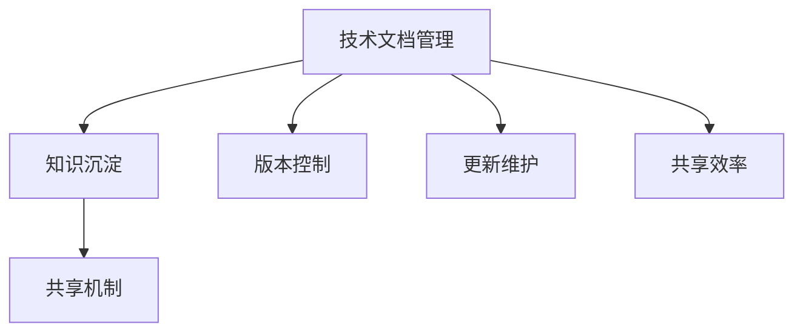

                 


### 文章标题

技术文档管理：知识沉淀与共享最佳实践

### 关键词

技术文档管理，知识沉淀，共享机制，版本控制，文档生成工具，项目管理，团队协作，最佳实践，案例分析

### 摘要

本文旨在深入探讨技术文档管理的重要性，以及如何通过最佳实践实现知识沉淀与共享。文章首先介绍了技术文档管理的核心概念和挑战，随后详细阐述了版本控制、文档生成、发布与共享等关键技术框架和工具。接着，文章分享了文档格式与编写规范、审核流程与版本控制策略、发布与共享的最佳实践，并探讨了技术文档管理在项目管理与团队协作中的应用。最后，通过具体案例分析和实践经验，为读者提供了实际操作的建议和参考。

### 总体思路

设计《技术文档管理：知识沉淀与共享最佳实践》的目录大纲时，我们需明确以下几个关键点：

1. **核心概念与联系**：首先介绍技术文档管理的基础概念，如文档管理、知识沉淀、共享机制等，并提供Mermaid流程图，帮助读者理解各个概念之间的内在联系。

2. **技术框架与工具**：列举和介绍常用的技术框架和工具，如版本控制、文档生成工具、文档网站构建工具等，并详细解释如何选择合适的工具。

3. **最佳实践**：分享在技术文档管理中的最佳实践，包括文档格式、编写规范、审核流程、版本控制、发布与共享等方面。

4. **项目管理**：讨论如何将文档管理融入项目管理流程，确保文档的质量和效率。

5. **团队协作**：探讨团队在文档管理中的协作方式，如角色分工、沟通渠道、协作工具等。

6. **案例分析**：通过具体的企业或项目案例，展示最佳实践的应用效果，并提供改进建议。

#### 目录大纲设计与细节

在组织文章内容时，我们可以按照以下结构来设计目录：

#### 第一部分：技术文档管理基础
- **第1章** 技术文档管理概述
  - 1.1 技术文档管理的核心概念
    - 技术文档、知识沉淀、共享机制
  - 1.2 技术文档管理的挑战
    - 版本控制、更新维护、共享效率
  - 1.3 技术文档管理的目标
  - Mermaid流程图：技术文档管理核心概念架构

- **第2章** 版本控制工具
  - 2.1 Git简介
  - 2.2 Git工作流程
  - 2.3 其他版本控制工具（SVN, Mercurial）

- **第3章** 文档生成工具
  - 3.1 Markdown基础
  - 3.2 Sphinx文档生成工具
  - 3.3 AsciiDoc文档格式
  - 3.4 Confluence文档管理平台

- **第4章** 文档网站构建工具
  - 4.1 Jekyll静态站点生成器
  - 4.2 Hugo快速静态站点生成器
  - 4.3 Read the Docs文档托管平台

#### 第二部分：最佳实践
- **第5章** 文档格式与编写规范
  - 5.1 文档格式选择
  - 5.2 文档结构设计
  - 5.3 文档编写规范

- **第6章** 审核流程与版本控制
  - 6.1 审核流程设计
  - 6.2 版本控制策略
  - 6.3 冲突解决策略

- **第7章** 发布与共享
  - 7.1 内部文档发布策略
  - 7.2 公开文档发布渠道
  - 7.3 文档共享与协作

#### 第三部分：项目管理与团队协作
- **第8章** 技术文档与项目管理
  - 8.1 项目文档需求
  - 8.2 项目文档流程
  - 8.3 项目文档质量评估

- **第9章** 团队协作与沟通
  - 9.1 团队角色分工
  - 9.2 沟通渠道选择
  - 9.3 协作工具应用

#### 第四部分：案例分析
- **第10章** 案例分享
  - 10.1 案例一：大型企业文档管理实践
  - 10.2 案例二：开源项目文档建设经验
  - 10.3 案例三：创业公司文档管理策略

### 目录大纲实现

根据上述设计，我们可以将目录大纲具体化为以下Markdown格式的文本：

```
# 技术文档管理：知识沉淀与共享最佳实践

## 第一部分：技术文档管理基础
### 第1章：技术文档管理概述
#### 1.1 技术文档管理的核心概念
#### 1.2 技术文档管理的挑战
#### 1.3 技术文档管理的目标
#### Mermaid流程图：技术文档管理核心概念架构

### 第2章：版本控制工具
#### 2.1 Git简介
#### 2.2 Git工作流程
#### 2.3 其他版本控制工具（SVN, Mercurial）

### 第3章：文档生成工具
#### 3.1 Markdown基础
#### 3.2 Sphinx文档生成工具
#### 3.3 AsciiDoc文档格式
#### 3.4 Confluence文档管理平台

### 第4章：文档网站构建工具
#### 4.1 Jekyll静态站点生成器
#### 4.2 Hugo快速静态站点生成器
#### 4.3 Read the Docs文档托管平台

## 第二部分：最佳实践
### 第5章：文档格式与编写规范
#### 5.1 文档格式选择
#### 5.2 文档结构设计
#### 5.3 文档编写规范

### 第6章：审核流程与版本控制
#### 6.1 审核流程设计
#### 6.2 版本控制策略
#### 6.3 冲突解决策略

### 第7章：发布与共享
#### 7.1 内部文档发布策略
#### 7.2 公开文档发布渠道
#### 7.3 文档共享与协作

## 第三部分：项目管理与团队协作
### 第8章：技术文档与项目管理
#### 8.1 项目文档需求
#### 8.2 项目文档流程
#### 8.3 项目文档质量评估

### 第9章：团队协作与沟通
#### 9.1 团队角色分工
#### 9.2 沟通渠道选择
#### 9.3 协作工具应用

## 第四部分：案例分析
### 第10章：案例分享
#### 10.1 案例一：大型企业文档管理实践
#### 10.2 案例二：开源项目文档建设经验
#### 10.3 案例三：创业公司文档管理策略

```

### 实现逻辑清晰、结构紧凑、简单易懂的Markdown格式文章

为了实现逻辑清晰、结构紧凑、简单易懂的Markdown格式文章，我们需要在文章的各个部分使用适当的标题和子标题，以及列表和代码块来呈现内容。以下是一个示例：

```markdown
# 技术文档管理：知识沉淀与共享最佳实践

> 关键词：技术文档管理，知识沉淀，共享机制，版本控制，文档生成工具，项目管理，团队协作，最佳实践，案例分析

> 摘要：本文深入探讨了技术文档管理的重要性，以及如何通过最佳实践实现知识沉淀与共享。文章涵盖了技术文档管理的核心概念、版本控制工具、文档生成工具、最佳实践、项目管理与团队协作，并通过案例分析了实践效果。

## 第一部分：技术文档管理基础

### 第1章：技术文档管理概述

#### 1.1 技术文档管理的核心概念

技术文档：记录技术实现、设计思路、用户手册等内容的文档。

知识沉淀：将技术经验和知识系统化、结构化地记录和整理。

共享机制：确保技术文档能够被团队内部和外部用户有效访问和使用。

#### 1.2 技术文档管理的挑战

版本控制：确保文档的版本更新与代码版本同步。

更新维护：及时更新文档内容，保持其准确性和完整性。

共享效率：提高文档的共享速度，降低沟通成本。

#### 1.3 技术文档管理的目标

提高开发效率：通过统一的文档规范，减少团队成员之间的沟通成本。

提升产品质量：确保开发人员能够准确理解需求，降低错误率。

增强知识传承：通过文档记录经验，帮助新员工快速融入团队。

#### 1.4 技术文档管理核心概念架构图



## 第二部分：技术框架与工具

### 第2章：版本控制工具

#### 2.1 Git简介

Git是一种分布式版本控制系统，能够高效地管理文档的版本更新。

#### 2.2 Git工作流程

- 添加文件到暂存区
- 提交文件到本地仓库
- 推送更新到远程仓库

#### 2.3 其他版本控制工具

- SVN：集中式版本控制系统，适合小团队协作。
- Mercurial：类似于Git的分布式版本控制系统，更适合小型项目。

### 第3章：文档生成工具

#### 3.1 Markdown基础

Markdown是一种轻量级标记语言，适合快速撰写文档。

#### 3.2 Sphinx文档生成工具

Sphinx可以将Markdown文档转换为HTML格式，适合生成项目文档。

#### 3.3 AsciiDoc文档格式

AsciiDoc是一种基于文本的文档格式，支持多种输出格式，如HTML和PDF。

#### 3.4 Confluence文档管理平台

Confluence是一种协作型文档管理平台，支持版本控制和共享。

### 第4章：文档网站构建工具

#### 4.1 Jekyll静态站点生成器

Jekyll可以将Markdown文档生成静态HTML站点，适合个人博客和团队文档。

#### 4.2 Hugo快速静态站点生成器

Hugo是一种快速、现代的静态站点生成器，适合构建大型网站。

#### 4.3 Read the Docs文档托管平台

Read the Docs是一个在线文档托管平台，支持自动化构建和发布。

## 第三部分：最佳实践

### 第5章：文档格式与编写规范

#### 5.1 文档格式选择

根据项目的需求和团队的偏好选择合适的文档格式。

#### 5.2 文档结构设计

确保文档结构清晰，便于读者理解和查找信息。

#### 5.3 文档编写规范

遵循统一的编写规范，提高文档的可读性和一致性。

### 第6章：审核流程与版本控制

#### 6.1 审核流程设计

建立文档审核流程，确保文档的质量和准确性。

#### 6.2 版本控制策略

制定版本控制策略，确保文档版本与代码版本的一致性。

#### 6.3 冲突解决策略

当文档更新产生冲突时，制定冲突解决策略，确保文档的更新顺利进行。

### 第7章：发布与共享

#### 7.1 内部文档发布策略

确保内部文档能够被团队成员高效地访问和使用。

#### 7.2 公开文档发布渠道

选择合适的公开文档发布渠道，提高文档的可见度和影响力。

#### 7.3 文档共享与协作

鼓励团队成员之间的文档共享与协作，提高团队协作效率。

## 第四部分：项目管理与团队协作

### 第8章：技术文档与项目管理

#### 8.1 项目文档需求

根据项目需求制定文档计划，确保文档覆盖项目的各个阶段。

#### 8.2 项目文档流程

建立项目文档流程，确保文档的及时更新和发布。

#### 8.3 项目文档质量评估

定期对项目文档进行质量评估，确保文档的准确性和完整性。

### 第9章：团队协作与沟通

#### 9.1 团队角色分工

明确团队成员的角色分工，提高团队协作效率。

#### 9.2 沟通渠道选择

选择合适的沟通渠道，确保团队内部的信息流通。

#### 9.3 协作工具应用

利用协作工具，提高团队协作的效率和质量。

## 第五部分：案例分析

### 第10章：案例分享

#### 10.1 案例一：大型企业文档管理实践

分享大型企业在文档管理中的实践经验，为其他企业提供参考。

#### 10.2 案例二：开源项目文档建设经验

介绍开源项目在文档建设中的成功经验，帮助其他项目改进文档管理。

#### 10.3 案例三：创业公司文档管理策略

分析创业公司在资源有限的情况下如何实现有效的文档管理。

## 总结

技术文档管理是知识沉淀与共享的重要手段，通过最佳实践，可以有效提升团队协作效率，保证项目质量和文档的准确性。本文为读者提供了全面的指导，帮助他们在实际工作中更好地进行技术文档管理。

### 作者信息

作者：AI天才研究院/AI Genius Institute & 禅与计算机程序设计艺术 /Zen And The Art of Computer Programming
```

通过使用Markdown格式，文章的结构和逻辑更加清晰，便于读者阅读和理解。同时，代码块和Mermaid流程图等元素的使用，增加了文章的可读性和互动性。希望这个示例能够帮助您撰写出高质量的技术博客文章。

