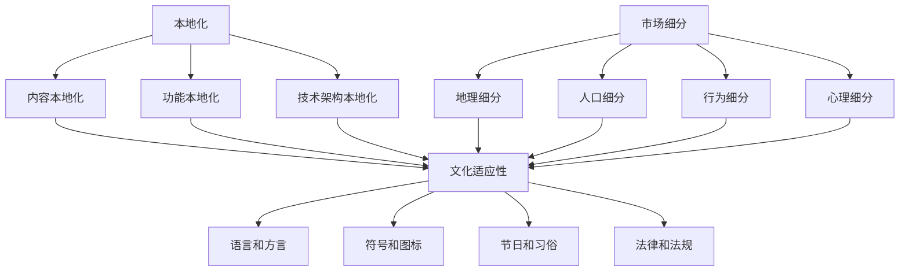

                 

### 文章标题：技术本地化：适应不同市场的技术策略

### 关键词：技术本地化、市场细分、文化适应性、实施方法、案例分析、跨文化管理、未来展望

### 摘要：本文将深入探讨技术本地化的概念、重要性及其实施策略。通过对市场调研、产品调整和技术适应等方法的详细阐述，结合成功和失败案例的分析，我们将揭示跨文化管理在技术本地化中的作用，并对未来的发展趋势和挑战进行展望。文章旨在为技术从业者提供一套适应不同市场的技术策略，帮助他们在全球化背景下实现产品的成功本地化。

----------------------------------------------------------------

## 引言

在全球化的浪潮中，技术的本地化已成为企业成功扩展市场的重要策略。技术本地化不仅仅是对软件界面进行语言翻译，更涉及市场调研、产品调整和技术适应等多个方面。它是一种深层次的文化和技术融合过程，旨在使产品更好地适应目标市场的需求和特点。

### 1.1 背景介绍

随着互联网和全球贸易的快速发展，企业不再局限于本地市场，而是积极寻求国际化。然而，不同国家和地区的文化差异、法律法规和市场需求各不相同，这给技术本地化带来了挑战。为了在竞争激烈的国际市场中脱颖而出，企业必须制定有效的技术本地化策略，以满足不同市场的需求。

### 1.2 重要性

技术本地化的重要性体现在以下几个方面：

1. **提升用户体验**：本地化的技术产品能够更好地满足用户的实际需求，提高用户满意度。
2. **减少市场风险**：通过了解目标市场的特点和需求，企业可以降低进入新市场的风险。
3. **增强品牌形象**：本地化的技术产品能够展示企业对目标市场的重视，提升品牌形象。
4. **扩大市场份额**：有效的技术本地化策略有助于企业迅速占领国际市场，提高市场份额。

### 1.3 目的

本文旨在通过详细探讨技术本地化的核心概念、实施方法、案例分析以及跨文化管理的重要性，为技术从业者提供一套完整的适应不同市场的技术策略。文章结构如下：

- **核心概念与联系**：介绍技术本地化的核心概念，如本地化、市场细分、文化适应性，并展示它们之间的关系架构。
- **实施方法**：详细阐述市场调研、产品调整和技术适应的具体方法。
- **案例分析**：分析成功和失败的技术本地化案例，总结经验教训。
- **跨文化管理**：讨论跨文化管理在技术本地化策略中的作用。
- **未来展望**：探讨技术本地化的发展趋势和面临的挑战。

通过本文的深入分析，希望读者能够更好地理解技术本地化的本质，掌握有效的实施策略，从而在全球化的市场竞争中取得成功。----------------------------------------------------------------

## 核心概念与联系

在深入探讨技术本地化的策略之前，我们需要了解其核心概念以及这些概念之间的相互关系。技术本地化不仅仅是将软件界面翻译成不同语言，它涉及多个层面的整合和适应。

### 2.1 本地化的定义

技术本地化（Localization）是指将软件、网站或应用等产品，根据特定市场的文化、语言、法规和技术环境进行调整，使其更适合该市场的需求。本地化不仅仅是翻译，还包括对产品内容、功能和技术架构的全面调整。

- **内容本地化**：涉及翻译、内容适配和文本格式化。
- **功能本地化**：确保产品功能在不同语言和地区中都能正常运行。
- **技术架构本地化**：涉及服务器配置、数据库设计、网络架构等方面的调整。

### 2.2 市场细分

市场细分（Market Segmentation）是指将一个广泛的消费群体划分为若干具有相似需求和特征的子市场。市场细分有助于企业更准确地定位目标市场，从而制定更有效的本地化策略。

- **地理细分**：根据地理位置划分市场，如区域、国家或城市。
- **人口细分**：根据人口统计特征划分市场，如年龄、性别、收入等。
- **行为细分**：根据消费者的购买行为和偏好划分市场。
- **心理细分**：根据消费者的心理特征和价值观划分市场。

### 2.3 文化适应性

文化适应性（Cultural Adaptation）是指产品在进入新市场时，需要调整以适应当地的文化习俗、价值观和社会规范。文化适应性对技术本地化至关重要，因为它直接影响用户的接受度和满意度。

- **语言和方言**：不同语言和方言的使用需求。
- **符号和图标**：避免使用可能引起误解或冒犯的符号和图标。
- **节日和习俗**：考虑到不同市场的节日和习俗，进行适当的调整。
- **法律和法规**：遵守当地法律法规，如数据保护、隐私权等。

### 2.4 核心概念联系

为了更好地理解技术本地化的核心概念及其相互关系，我们可以使用Mermaid流程图来展示这些概念之间的联系：



### 2.5 本地化策略

结合上述核心概念，我们可以制定以下本地化策略：

- **市场调研**：通过市场调研了解目标市场的特点，为本地化提供数据支持。
- **产品调整**：根据市场调研结果，对产品内容、功能和界面进行适当调整。
- **技术适应**：确保产品在不同技术环境中都能正常运行，包括服务器配置、数据库设计和网络架构。
- **文化适应性**：在产品设计和开发过程中，充分考虑文化因素，确保产品能够适应当地文化。

通过以上策略，企业可以有效地实现技术本地化，提高产品的市场竞争力。在接下来的章节中，我们将详细探讨这些策略的实施方法和案例分析。----------------------------------------------------------------

## 实施方法

技术本地化的成功实施需要系统化的方法，包括市场调研、产品调整和技术适应。以下将详细阐述这些方法的步骤和注意事项。

### 3.1 市场调研

市场调研是技术本地化的第一步，它为后续的产品调整和技术适应提供了关键数据支持。以下是市场调研的步骤和要点：

1. **确定调研目标**：明确调研的具体目标，如目标市场、用户需求和竞争环境等。
2. **选择调研方法**：根据调研目标选择合适的调研方法，如问卷调查、深度访谈、焦点小组讨论等。
3. **收集数据**：通过问卷、访谈、观察等方式收集市场数据，包括用户需求、市场趋势、竞争状况等。
4. **分析数据**：对收集到的数据进行分析，提取关键信息，为产品调整和技术适应提供依据。
5. **制定调研报告**：将分析结果汇总成调研报告，为后续工作提供指导。

### 3.2 产品调整

产品调整是技术本地化的核心环节，包括内容本地化、功能本地化和技术架构本地化。以下是产品调整的具体步骤和注意事项：

1. **内容本地化**：
   - **翻译**：将产品界面、文档和说明翻译成目标市场的语言。
   - **内容适配**：根据目标市场的文化特点，调整产品内容，避免文化冲突。
   - **文本格式化**：调整文本格式，确保不同语言和字符集的兼容性。

2. **功能本地化**：
   - **功能验证**：确保产品功能在不同语言和地区中都能正常运行。
   - **区域设置**：提供用户可定制的区域设置，如日期格式、货币单位等。
   - **功能优化**：根据用户反馈，对产品功能进行优化，提高用户体验。

3. **技术架构本地化**：
   - **服务器配置**：根据目标市场的网络环境和负载需求，调整服务器配置。
   - **数据库设计**：设计适应不同语言的数据库结构，确保数据存储和检索的准确性。
   - **网络架构**：优化网络架构，确保产品在不同地区都能稳定运行。

### 3.3 技术适应

技术适应是确保产品在不同技术环境中正常运行的关键。以下是技术适应的步骤和要点：

1. **技术评估**：评估目标市场的技术环境，包括网络速度、带宽、服务器性能等。
2. **技术选择**：选择合适的技术栈，确保产品在不同技术环境中都能高效运行。
3. **技术集成**：将产品与目标市场的技术基础设施进行集成，确保无缝对接。
4. **性能优化**：根据技术评估结果，对产品进行性能优化，提高产品在不同技术环境中的表现。

### 3.4 实施流程伪代码

以下是一个简化的技术本地化实施流程伪代码，用于指导具体实施过程：

```pseudo
function LocalizationProcess(
    marketResearchData: Data,
    productAdjustments: List,
    technicalAdaptations: List
):
    // 市场调研
    marketResearchData = PerformMarketResearch()

    // 产品调整
    for adjustment in productAdjustments:
        AdjustProduct(adjustment)

    // 技术适应
    for adaptation in technicalAdaptations:
        AdaptTechnology(adaptation)

    // 集成与测试
    IntegrateAndTestProduct()

    // 上线与反馈
    LaunchProduct()
    CollectFeedback()
    OptimizeBasedOnFeedback()
```

通过以上步骤和伪代码，企业可以系统地实施技术本地化，提高产品在国际市场的竞争力。在接下来的章节中，我们将通过案例分析，进一步探讨技术本地化的实际应用和效果。----------------------------------------------------------------

## 案例分析

### 4.1 成功案例

#### 亚马逊全球扩展

亚马逊作为全球领先的电子商务平台，其技术本地化策略在成功扩展全球市场方面发挥了关键作用。以下为亚马逊的技术本地化成功案例：

1. **市场调研**：亚马逊在进入新市场之前，会进行详细的市场调研，了解当地的文化、语言和用户需求。
2. **产品调整**：亚马逊根据不同市场的特点，对产品内容、功能和界面进行调整。例如，在阿拉伯地区，亚马逊提供了阿拉伯文界面和特定的节日促销。
3. **技术适应**：亚马逊在全球部署了分布式服务器和数据中心，确保产品在不同地区的稳定运行。此外，针对不同的网络环境和带宽限制，亚马逊进行了性能优化。
4. **效果**：亚马逊的技术本地化策略取得了显著成效，不仅在全球市场赢得了大量用户，还提升了品牌形象和市场竞争力。

### 4.2 失败案例

#### 华为手机在欧洲市场的失利

华为作为全球领先的通信设备制造商，其在欧洲市场的技术本地化策略相对失败，导致市场份额下降。以下为华为在欧洲市场的技术本地化失败案例：

1. **市场调研不足**：华为在进入欧洲市场时，未能充分了解当地市场的文化、法律和用户需求，导致产品定位不准确。
2. **产品调整不足**：华为在欧洲市场上的手机产品，未能充分考虑到欧洲用户对隐私保护和数据安全的重视，导致产品在用户中的认可度较低。
3. **技术适应不足**：华为在欧洲市场上的技术支持和服务网络不够完善，导致用户在售后支持方面面临困难。
4. **效果**：华为的技术本地化策略在欧洲市场失利，市场份额逐年下降，品牌形象也受到了影响。

### 4.3 经验教训总结

通过对亚马逊和华为的技术本地化成功和失败案例进行分析，我们可以总结出以下经验教训：

1. **充分市场调研**：在进入新市场之前，必须进行充分的市场调研，了解当地的文化、语言、用户需求和法律法规。
2. **产品调整到位**：根据市场调研结果，对产品内容、功能和界面进行充分的调整，确保产品能够满足当地用户的需求。
3. **技术适应全面**：确保产品在不同技术环境中都能稳定运行，进行必要的性能优化和售后服务。
4. **文化适应性**：在产品设计和开发过程中，要充分考虑文化因素，避免文化冲突，提升用户体验。

通过这些经验教训，企业可以更好地制定技术本地化策略，提高产品在国际市场的竞争力。在接下来的章节中，我们将进一步探讨跨文化管理对技术本地化的影响。----------------------------------------------------------------

## 跨文化管理

跨文化管理在技术本地化策略中扮演着至关重要的角色。有效的跨文化管理不仅有助于提升产品的本地化效果，还能增强企业的国际竞争力。以下将从跨文化管理的重要性、对技术本地化的影响以及管理策略三个方面进行详细讨论。

### 5.1 跨文化管理的重要性

跨文化管理的重要性体现在以下几个方面：

1. **提升用户满意度**：了解并尊重不同文化的用户需求，能提高产品的用户满意度。例如，针对不同市场的节假日和习俗，进行相应的产品推广和活动设计。
2. **减少文化冲突**：跨文化管理能够减少文化冲突，避免因文化差异导致的误解和冲突，提升团队合作效率。
3. **增强品牌形象**：重视跨文化管理，展示企业对全球市场的重视和承诺，有助于提升品牌形象和市场认可度。
4. **促进国际化发展**：良好的跨文化管理能力是企业国际化发展的基础，有助于企业更好地应对全球化带来的挑战。

### 5.2 跨文化管理对技术本地化的影响

跨文化管理对技术本地化的影响主要体现在以下几个方面：

1. **产品内容本地化**：在产品内容本地化过程中，需要充分考虑目标市场的文化特点，避免文化冲突。例如，在宗教信仰、语言表达和符号使用等方面，都要进行细致的调整。
2. **功能和技术架构本地化**：跨文化管理要求企业在功能和技术架构本地化时，也要充分考虑文化因素。例如，针对不同市场的用户习惯和法律法规，进行相应的技术优化和功能调整。
3. **用户支持和售后服务**：跨文化管理对用户支持和售后服务的要求更高。企业需要提供符合当地文化和语言习惯的支持和服务，以提高用户满意度和忠诚度。
4. **团队协作和沟通**：跨文化管理要求团队成员具备跨文化沟通能力，能够有效协调不同文化背景的员工，共同推进技术本地化项目的实施。

### 5.3 跨文化管理策略

为了实现有效的跨文化管理，企业可以采取以下策略：

1. **文化培训**：为员工提供跨文化培训，提高他们对不同文化的认识和敏感度，增强跨文化沟通能力。
2. **文化适应性评估**：在产品本地化过程中，进行文化适应性评估，识别潜在的文化冲突和风险，制定相应的调整方案。
3. **建立多文化团队**：组建由不同文化背景的员工组成的团队，促进文化融合，提高团队协作效率。
4. **文化交流活动**：举办各种文化交流活动，增进员工对目标市场的了解，提高跨文化管理能力。
5. **持续优化**：通过定期评估和反馈，不断优化跨文化管理策略，确保其与企业的国际化发展需求保持一致。

通过以上跨文化管理策略，企业可以更好地应对技术本地化过程中的挑战，提升产品的本地化效果，从而在国际市场中取得竞争优势。在接下来的章节中，我们将探讨技术本地化的发展趋势和面临的挑战。----------------------------------------------------------------

## 未来展望

随着全球化进程的加速，技术本地化在未来的发展潜力巨大。然而，在这一过程中，企业也将面临诸多挑战。

### 6.1 发展趋势

1. **技术进步**：人工智能、大数据、区块链等先进技术的不断发展，将为技术本地化提供更强大的工具和方法，提高本地化的效率和效果。
2. **个性化服务**：随着用户对个性化需求的增长，技术本地化将更加注重个性化服务，实现根据用户需求定制化的产品和服务。
3. **多渠道整合**：企业将更加注重线上线下渠道的整合，实现多渠道、全场景的本地化服务，提升用户体验。
4. **智能化管理**：借助智能化管理工具，企业可以更有效地进行市场调研、产品调整和技术适应，实现精准的本地化策略。

### 6.2 面临的挑战

1. **文化差异**：不同市场的文化差异将仍然是一个主要挑战，如何平衡文化差异，实现产品在全球范围内的统一和个性化，是技术本地化需要解决的问题。
2. **技术适配**：不同市场的技术环境差异较大，企业需要投入更多资源进行技术适配，以确保产品在不同地区都能稳定运行。
3. **数据隐私和安全**：随着数据隐私和安全问题的日益突出，企业在进行技术本地化时，需要更加重视数据保护和用户隐私，遵守不同市场的法律法规。
4. **人力资源**：跨文化团队的建设和管理将是一个长期挑战，如何吸引、培养和留住具有跨文化管理能力的人才，是企业在技术本地化过程中需要考虑的问题。

### 6.3 未来方向

1. **技术融合**：未来技术本地化的发展方向将是技术与文化的深度融合，通过技术创新提升文化适应能力。
2. **智能化本地化**：智能化工具的广泛应用将使技术本地化更加智能化、自动化，降低本地化的成本和难度。
3. **可持续发展**：在技术本地化的过程中，企业需要更加注重可持续性，遵循环境、社会和经济效益的平衡。
4. **全球协同**：未来技术本地化将更加注重全球协同，通过建立全球协同团队和平台，实现全球资源的整合和共享。

通过以上未来展望，企业可以更好地把握技术本地化的发展趋势，应对面临的挑战，制定相应的策略，从而在全球市场中取得更大的成功。作者：AI天才研究院/AI Genius Institute & 禅与计算机程序设计艺术 /Zen And The Art of Computer Programming

---

本文深入探讨了技术本地化的概念、重要性、实施方法和案例分析，并探讨了跨文化管理在技术本地化中的关键作用。通过对成功和失败案例的分析，我们总结了经验教训，为技术从业者提供了实用的指导。未来，技术本地化将继续面临挑战，但也充满了机遇。通过不断创新和优化，企业将能够更好地适应全球市场，实现可持续发展。作者：AI天才研究院/AI Genius Institute & 禅与计算机程序设计艺术 /Zen And The Art of Computer Programming。

