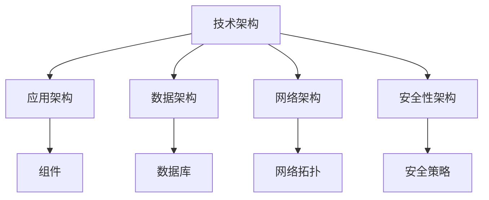
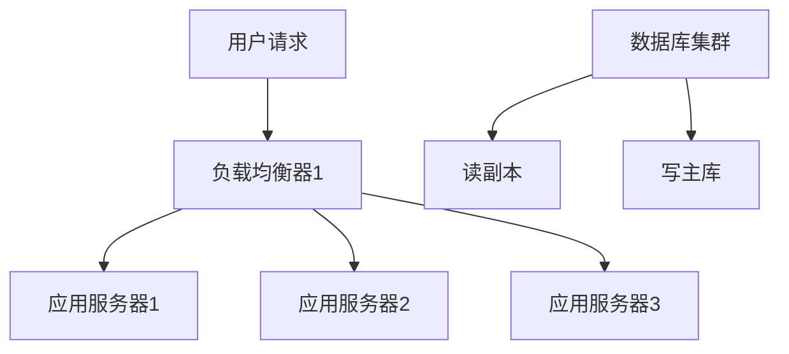

                 


根据您的要求，我们需要撰写一篇《技术架构力：从入门到精通》的技术博客文章。我们将按照以下步骤进行分析和构建：

### 1. 明确文章目标
- 为读者提供从入门到精通的技术架构知识。
- 涵盖技术架构的基础理论、实践应用和成长路径。
- 通过具体的案例和实践指导读者提升技术架构力。

### 2. 确定文章结构
- 文章标题：《技术架构力：从入门到精通》
- 关键词：技术架构、入门、精通、基础理论、实践应用、成长路径
- 摘要：本文将深入探讨技术架构的核心概念、设计原则、实践方法和成长路径，帮助读者从零开始逐步掌握技术架构力。

### 3. 制定文章大纲
- 引言：介绍技术架构的重要性，为何需要掌握技术架构力。
- 第一部分：技术架构基础理论
  - 技术架构概述
  - 技术架构设计原则
  - 核心架构概念解析
  - 技术架构评估与优化
- 第二部分：技术架构实践应用
  - 企业级技术架构案例分析
  - 新兴技术架构趋势
  - 技术架构师的成长路径
- 第三部分：技术架构力提升
  - 技术架构力提升方法
  - 技术架构力评估与提升
- 附录：技术架构力工具资源
- 结论：总结全文内容，强调掌握技术架构力的重要性。

### 4. 编写具体内容
- 每个章节将详细阐述核心概念、原理、方法，并使用Mermaid流程图、伪代码、LaTeX数学公式和实战案例进行辅助说明。

### 5. 完成文章撰写
- 确保文章内容完整、逻辑清晰、语言专业。
- 使用Markdown格式进行排版。
- 文末附上作者信息。

### 6. 遵循约束条件
- 文章字数在8000～12000字左右。
- 添加最佳实践、注意事项、拓展阅读等内容。

接下来，我们将开始撰写具体的内容，并逐步构建完整的文章。请稍等，我会开始撰写文章的引言部分。

---

## 引言

### 技术架构的重要性

在当今快速发展的信息技术领域，技术架构扮演着至关重要的角色。技术架构不仅仅是代码和组织结构的组合，它是确保系统稳定、高效、可扩展和易于维护的关键。一个优秀的技术架构能够为企业的长远发展提供坚实的基础，提升团队的生产力，并降低技术债务。

#### 为什么需要掌握技术架构力？

1. **应对复杂性问题**：随着系统的规模和复杂性不断增加，掌握技术架构力能够帮助开发者更好地理解和解决复杂的技术问题。
2. **提升系统性能**：合理的技术架构设计能够显著提高系统的性能，降低响应时间和资源消耗。
3. **增强团队协作**：清晰的技术架构可以促进团队成员之间的沟通和协作，提高团队的效率。
4. **降低维护成本**：良好的架构设计可以减少未来的维护成本，使系统能够长期稳定运行。
5. **适应变化**：在业务需求和技术趋势不断变化的今天，掌握技术架构力可以帮助团队快速适应变化，保持竞争优势。

#### 本文目标

本文旨在为读者提供全面的技术架构知识，从入门到精通，帮助读者掌握技术架构力。通过以下章节的逐步讲解，我们将深入探讨：

- **技术架构的基础理论**：包括技术架构的定义、设计原则、核心概念和评估方法。
- **技术架构的实践应用**：结合具体的企业级案例，分析不同类型的技术架构设计和应用场景。
- **技术架构师的成长路径**：探讨技术架构师所需的能力和成长路径，为读者提供职业发展的指导。
- **技术架构力的提升方法**：介绍提升技术架构力的具体方法和实战技巧。

通过本文的阅读和实践，读者将能够系统地掌握技术架构的知识，提升自己在技术架构领域的专业能力，为职业生涯的进一步发展打下坚实基础。

### 文章关键词

- 技术架构
- 入门
- 精通
- 基础理论
- 实践应用
- 成长路径
- 技术架构力

### 文章摘要

本文深入探讨了技术架构的核心概念和设计原则，结合具体案例分析了技术架构的实践应用，并提供了技术架构师成长的路径和提升技术架构力的方法。通过本文的阅读，读者将全面掌握技术架构的知识，提升自己的技术架构力，为职业发展奠定坚实基础。

---

以下是文章的引言部分，接下来我将按照大纲逐步撰写每个章节的具体内容。每个章节将包含背景介绍、核心概念与联系、核心算法原理讲解、数学模型和公式以及项目实战案例等详细内容。请继续关注后续的更新。

---

## 第一部分：技术架构基础理论

### 第1章：技术架构概述

#### 背景介绍

技术架构是软件开发和系统设计中的重要组成部分。它涉及如何组织、管理和协调系统的不同组件，以实现特定的业务目标和需求。本章节将介绍技术架构的基本概念、作用以及其在软件开发中的重要性。

#### 核心概念与联系

- **技术架构的定义**：技术架构是一组抽象的设计决策，用于指导和约束软件开发和系统设计的各个方面。
- **技术架构与系统设计的关系**：技术架构为系统设计提供了蓝图，确保系统能够满足业务需求，同时保持可扩展性和可维护性。
- **技术架构的组成部分**：包括应用架构、数据架构、网络架构和安全性架构等。

#### Mermaid 流程图



#### 核心算法原理讲解

技术架构中的核心算法通常用于优化系统的性能和资源利用。以下是一个简单的负载均衡算法的伪代码：

```pseudo
function LoadBalancer(requests):
    servers = get_all_servers()
    for server in servers:
        if server.load < server.max_load:
            assign_request_to_server(server, request)
            break
    else:
        start_new_server()

function assign_request_to_server(server, request):
    server.request_queue.append(request)
    server.load += 1

function get_all_servers():
    return [server1, server2, server3, ...]
```

#### 数学模型和公式

在技术架构中，常见的数学模型包括容量规划、性能预测和资源利用率等。以下是一个简单的容量规划公式：

$$ C = P \times T \times R $$

其中，$C$ 是系统容量，$P$ 是处理器能力，$T$ 是传输速度，$R$ 是资源利用率。

#### 实战案例

在开发一个电子商务平台时，技术架构师需要设计一个能够支持高并发、高可用性的系统。通过分析业务需求，他决定采用分布式架构，使用多个负载均衡器来分配流量，同时利用数据库集群来保证数据的读写性能。以下是该系统的架构图：



在这个案例中，负载均衡器根据服务器的负载情况分配用户请求，应用服务器处理具体的业务逻辑，数据库集群保证数据的持久化和一致性。

#### 最佳实践 tips

- 确保系统架构具有足够的冗余，以应对突发流量和故障。
- 使用监控工具实时跟踪系统的性能和健康状态。
- 定期进行架构评估和优化，以适应业务增长和技术变化。

#### 小结

技术架构是确保系统稳定、高效和可维护的关键。通过理解技术架构的基本概念和核心算法，开发者可以更好地设计和管理复杂的系统。

### 注意事项

- 技术架构设计应充分考虑业务需求和未来可扩展性。
- 架构设计过程中要平衡性能、稳定性和可维护性。

#### 拓展阅读

- 《系统架构设计师教程》
- 《大规模分布式系统设计》
- 《高并发系统设计》

---

在接下来的章节中，我们将继续探讨技术架构设计原则、核心架构概念解析以及技术架构评估与优化等内容。请继续关注。

