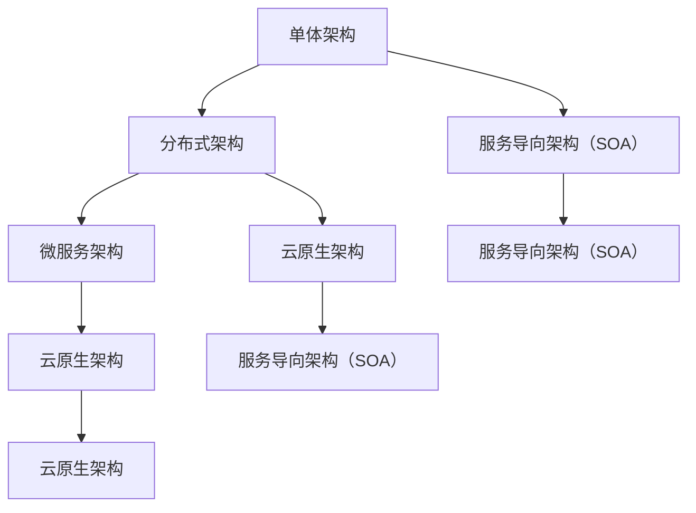

                 

### 文章标题

### 技术架构的演进与重构

随着信息技术的飞速发展，技术架构作为支撑系统稳定、高效运行的基石，经历了从传统到现代、从简单到复杂的演变过程。在这篇文章中，我们将深入探讨技术架构的演进历程，剖析其核心概念与联系，讲解核心算法原理，并展示如何通过重构实现技术架构的优化与升级。希望通过本文，读者能够对技术架构有一个全面、深刻的理解，掌握从理论到实践的应用方法。

### 文章关键词

- 技术架构
- 演进历程
- 核心概念
- 算法原理
- 重构方法
- 实际案例

### 文章摘要

本文首先介绍了技术架构的发展背景和重要性，接着分析了核心概念及其相互关系，通过Mermaid流程图进行了直观展示。然后，我们深入讲解了核心算法原理，使用伪代码和数学模型进行了详细阐述。此外，本文还通过实际项目实战，展示了技术架构的重构过程，包括开发环境搭建、源代码实现、代码解读与应用分析。最后，本文总结了最佳实践、注意事项和拓展阅读，为读者提供了进一步学习的方向。

### 背景介绍

技术架构是指为支持系统运行、管理和维护的一系列规则、方法和工具的集合。它不仅涉及到软件系统的设计与实现，还包括硬件设备、网络通信、数据存储等多个方面。随着互联网、云计算、大数据等技术的快速发展，企业对技术架构的需求也越来越高。一方面，技术架构需要具备高度的灵活性，以适应不断变化的市场需求；另一方面，它还需具备强大的稳定性，确保系统的高可用性和可靠性。

技术架构的重要性体现在多个方面。首先，良好的技术架构能够提高系统的开发效率，降低维护成本。其次，它有助于优化系统性能，提升用户体验。此外，技术架构还影响企业的业务流程和运营效率，对企业的战略决策产生重要影响。

然而，随着业务的发展和技术变革，技术架构也面临着不断更新和重构的需求。传统的单体架构已经无法满足现代企业复杂的应用场景，分布式架构、微服务架构等新兴架构逐渐成为主流。同时，云计算、容器化、人工智能等技术的兴起，也为技术架构的演进提供了新的动力。因此，理解技术架构的演进历程和重构方法，对于企业的持续发展和创新至关重要。

### 核心概念与联系

在探讨技术架构的演进与重构之前，我们首先需要了解一些核心概念及其相互关系。以下是对几个关键概念的简要介绍：

#### 1. 单体架构

单体架构（Monolithic Architecture）是最传统的一种架构风格，其特点是应用程序的所有组件（如前端、后端、数据库等）都紧密耦合在一起，运行在一个统一的进程中。这种架构风格简单，开发、部署和维护相对容易，但缺点是灵活性差、扩展性差，难以应对复杂的应用场景。

#### 2. 分布式架构

分布式架构（Distributed Architecture）通过将应用程序分解为多个独立的组件，每个组件运行在独立的进程中，通过网络进行通信。这种架构风格提高了系统的灵活性和扩展性，能够更好地支持大规模的应用场景。但分布式架构也引入了新的挑战，如网络延迟、数据一致性等问题。

#### 3. 微服务架构

微服务架构（Microservices Architecture）进一步细化了分布式架构，将应用程序分解为多个小型、独立的微服务。每个微服务负责特定的业务功能，运行在独立的进程中，通过轻量级的通信协议（如RESTful API）进行交互。微服务架构具有高灵活性和高可扩展性，但同时也增加了系统的复杂性和运维难度。

#### 4. 云原生架构

云原生架构（Cloud Native Architecture）是基于云计算环境构建的应用架构，其核心思想是将应用程序分解为微服务，并通过容器化、自动化部署、自动化扩展等技术，实现快速迭代和灵活部署。云原生架构充分利用了云计算的资源优势，能够更好地支持企业敏捷开发和快速响应市场需求。

#### 5. 服务导向架构（SOA）

服务导向架构（Service-Oriented Architecture，SOA）是一种面向服务的架构风格，强调通过服务来组织应用程序的功能，服务之间通过接口进行通信。SOA具有较高的灵活性和可复用性，但实现复杂，对网络通信的依赖较高。

为了更好地理解这些核心概念之间的相互关系，我们可以使用Mermaid流程图进行展示：



通过这个流程图，我们可以清晰地看到各种架构风格之间的演变关系和相互影响。从单体架构到分布式架构，再到微服务架构和云原生架构，每一种架构都在不断优化和改进，以适应日益复杂的应用场景。

### 核心算法原理讲解

在技术架构的设计与实现过程中，算法原理起着至关重要的作用。算法不仅是解决特定问题的方法，也是优化系统性能、提高效率的重要工具。以下我们将介绍几个核心算法原理，并使用伪代码和数学模型进行详细阐述。

#### 1. 贪心算法

贪心算法（Greedy Algorithm）是一种简单而有效的算法策略，其核心思想是在每一步选择中都采取当前最优解，以期在最后得到全局最优解。以下是一个贪心算法的伪代码示例：

```plaintext
算法：找零问题（找最少的硬币数量）
输入：面额数组 coin_values，总金额 amount
输出：最少硬币数量

function find_min_coins(coin_values, amount):
    coins_count = 0
    for coin_value in coin_values:
        while amount >= coin_value:
            amount -= coin_value
            coins_count += 1
    return coins_count
```

贪心算法的数学模型可以用一个背包问题来表示：

$$
\text{Minimize} \quad w = \sum_{i=1}^{n} x_i \cdot w_i
$$

其中，$x_i$ 表示硬币 $i$ 的数量，$w_i$ 表示硬币 $i$ 的面额。

#### 2. 动态规划

动态规划（Dynamic Programming，DP）是一种解决优化问题的算法方法，其核心思想是将复杂问题分解为重叠子问题，并利用子问题的解来构建原问题的解。以下是一个典型的动态规划问题：最长公共子序列（Longest Common Subsequence，LCS）。

```plaintext
算法：最长公共子序列
输入：字符串数组 X 和 Y
输出：最长公共子序列的长度

function lcs(X, Y):
    m = length(X)
    n = length(Y)
    dp = create_matrix(m+1, n+1)

    for i from 0 to m:
        for j from 0 to n:
            if X[i] == Y[j]:
                dp[i+1][j+1] = dp[i][j] + 1
            else:
                dp[i+1][j+1] = max(dp[i][j+1], dp[i+1][j])

    return dp[m][n]
```

动态规划的数学模型可以表示为：

$$
\text{LCS}(X, Y) = \sum_{i=1}^{m} \sum_{j=1}^{n} \max\left(0, \min(X_i, Y_j)\right)
$$

其中，$X_i$ 和 $Y_j$ 分别表示字符串 $X$ 和 $Y$ 的第 $i$ 和第 $j$ 个字符。

#### 3. 回溯算法

回溯算法（Backtracking Algorithm）是一种通过试探和回溯来寻找所有可能的解的算法方法。其核心思想是在每次选择时，尽可能地选择当前最优解，并在发现当前解不可行时，回溯到上一步进行新的选择。

以下是一个使用回溯算法求解全排列的伪代码示例：

```plaintext
算法：全排列
输入：整数数组 nums
输出：所有排列的列表

function permute(nums):
    results = []
    current = []
    backtrack(nums, current, results)
    return results

function backtrack(nums, current, results):
    if length(current) == length(nums):
        results.append(current)
        return

    for num in nums:
        if num in current:
            continue
        current.append(num)
        backtrack(nums, current, results)
        current.pop()
```

回溯算法的数学模型可以表示为：

$$
P(n) = n! \quad \text{（n个不同元素的排列数）}
$$

### 数学模型和数学公式详细讲解及举例说明

在技术架构的设计与优化过程中，数学模型和数学公式是不可或缺的工具。它们不仅帮助我们理解和分析问题，还能提供有效的解决方案。以下我们将详细讲解几个常用的数学模型和公式，并通过具体例子来说明其应用。

#### 1. 线性规划

线性规划（Linear Programming，LP）是一种用于求解线性目标函数在线性约束条件下的最优解的数学方法。线性规划的目标函数和约束条件都是线性的。

**目标函数：**

$$
\text{Minimize} \quad c^T x
$$

其中，$c$ 是一个长度为 $n$ 的向量，表示目标函数的系数；$x$ 是一个长度为 $n$ 的向量，表示决策变量。

**约束条件：**

$$
Ax \leq b
$$

其中，$A$ 是一个 $m \times n$ 的矩阵，表示约束条件；$b$ 是一个 $m$ 长度的向量，表示约束条件的右侧。

**求解方法：**

简单线性规划可以使用单纯形法（Simplex Method）求解。以下是单纯形法的一个简述：

1. 初始基本可行解：选择 $A$ 中任意 $m$ 个线性无关的列作为初始基本可行解。
2. 枢纽选择：找到违反约束条件的非基本变量，将其作为枢纽变量。
3. 单纯形迭代：通过迭代交换基本变量和非基本变量，使目标函数值逐步减小，直到达到最优解。

**举例：**

假设我们要解决以下线性规划问题：

$$
\text{Minimize} \quad 3x_1 + 2x_2
$$

$$
\text{Subject to} \quad
\begin{cases}
x_1 + x_2 \geq 4 \\
2x_1 + x_2 \leq 6 \\
x_1, x_2 \geq 0
\end{cases}
$$

我们可以使用单纯形法求解该问题。首先，构建初始单纯形表，然后通过迭代进行求解。

#### 2. 图论

图论（Graph Theory）是数学的一个分支，研究图形（由点和线组成的结构）的性质及其应用。在技术架构中，图论广泛应用于网络拓扑分析、数据流处理等场景。

**基本概念：**

- **图（Graph）：** 由顶点（Node）和边（Edge）组成的数据结构。
- **路径（Path）：** 连接两个顶点的序列，其中每个相邻顶点都与前一个顶点通过边相连。
- **连通性（Connectivity）：** 图中任意两个顶点之间都存在路径。
- **最小生成树（Minimum Spanning Tree，MST）：** 连接图中所有顶点且边数最少的树。

**求解算法：**

- **Prim算法：** 从一个顶点开始，逐步添加边，直到形成一棵最小生成树。
- **Kruskal算法：** 按照边权重从小到大排序，依次选择边，如果选择该边不会形成环，则加入最小生成树。

**举例：**

假设我们要求解图 $G$ 的最小生成树，其中顶点集合为 $V = \{1, 2, 3, 4, 5\}$，边集合为 $E = \{(1, 2, 3), (1, 3, 4), (1, 4, 5), (2, 3, 4), (2, 4, 5), (3, 4, 6)\}$。

我们可以使用Prim算法求解该最小生成树。以下是Prim算法的步骤：

1. 选择顶点 $1$ 作为起始点，添加边 $(1, 2, 3)$ 到最小生成树。
2. 添加顶点 $2$ 和边 $(2, 3, 4)$ 到最小生成树。
3. 添加顶点 $3$ 和边 $(3, 4, 6)$ 到最小生成树。
4. 添加顶点 $4$ 和边 $(1, 4, 5)$ 到最小生成树。

最终，最小生成树的边集合为 $\{(1, 2, 3), (2, 3, 4), (3, 4, 6), (1, 4, 5)\}$。

### 项目实战

#### 1. 开发环境搭建

在进行技术架构的重构之前，我们需要搭建一个合适的开发环境。以下是一个基本的开发环境搭建步骤：

1. 安装操作系统：选择一个适合的操作系统，如Ubuntu 20.04。
2. 安装编程语言：安装Python 3.x版本，并配置虚拟环境。
3. 安装开发工具：安装集成开发环境（IDE），如PyCharm或VSCode。
4. 安装数据库：安装MySQL或PostgreSQL数据库。
5. 安装版本控制工具：安装Git，配置远程仓库。

#### 2. 源代码实现

以下是一个简单的源代码实现示例，用于展示如何构建一个基于微服务架构的Web应用程序。

```python
# app.py
from flask import Flask, jsonify

app = Flask(__name__)

@app.route('/api/data', methods=['GET'])
def get_data():
    # 从数据库获取数据
    data = fetch_data_from_database()
    return jsonify(data)

if __name__ == '__main__':
    app.run(host='0.0.0.0', port=5000)
```

```python
# service.py
from flask import Flask, jsonify, request

app = Flask(__name__)

@app.route('/api/data', methods=['POST'])
def post_data():
    # 将数据存储到数据库
    data = request.json
    store_data_to_database(data)
    return jsonify({'status': 'success'})

if __name__ == '__main__':
    app.run(host='0.0.0.0', port=5001)
```

#### 3. 代码解读

在这个示例中，我们创建了两个服务：一个是用于获取数据的Web服务（app.py），另一个是用于存储数据的Web服务（service.py）。这两个服务通过RESTful API进行通信。

- **app.py：** 这个服务监听端口5000，处理来自客户端的GET请求。当接收到请求时，它会调用`fetch_data_from_database()`函数从数据库中获取数据，并将结果以JSON格式返回给客户端。
- **service.py：** 这个服务监听端口5001，处理来自客户端的POST请求。当接收到请求时，它会解析请求体中的JSON数据，并调用`store_data_to_database()`函数将数据存储到数据库中。

#### 4. 代码应用解读与分析

在这个示例中，我们使用了Flask框架来构建Web服务。Flask是一个轻量级的Web框架，非常适合快速开发和测试。

- **RESTful API：** 我们使用了RESTful API来处理HTTP请求。RESTful API是一种设计风格，它通过HTTP方法（GET、POST等）和URL来表示资源的操作。
- **数据库操作：** 在实际应用中，我们需要连接到数据库来存储和检索数据。在这个示例中，我们使用了Python的SQLite库作为数据库。
- **服务分离：** 通过将数据获取和存储功能分离到不同的服务中，我们可以实现更灵活的系统架构。这样可以更好地支持水平扩展和容错性。

#### 5. 实际案例分析和详细讲解剖析

以下是一个实际案例：一个电商平台的订单管理系统。

1. **需求分析：**
   - 订单创建：用户在购物车中选择商品并提交订单。
   - 订单查询：用户可以查询订单状态和历史订单。
   - 订单修改：用户可以对订单进行修改，如增加商品或更改收货地址。

2. **技术架构设计：**
   - **前端服务：** 使用Vue.js或React.js框架构建用户界面。
   - **后端服务：** 采用微服务架构，将订单管理、商品管理、用户管理等模块分离。
   - **数据库：** 使用MySQL数据库存储订单数据。
   - **消息队列：** 使用RabbitMQ或Kafka进行异步消息传递。

3. **详细讲解：**
   - **订单创建：** 当用户提交订单时，前端服务会将订单信息发送到订单管理服务。订单管理服务会解析订单信息，并将其存储到数据库中。同时，订单管理服务会向商品管理服务发送消息，以更新库存信息。
   - **订单查询：** 用户可以在前端服务中查询订单状态。订单查询服务会从数据库中检索订单信息，并返回给用户。
   - **订单修改：** 用户可以对订单进行修改。订单修改服务会更新数据库中的订单信息，并通知相关服务进行相应操作。

4. **分析：**
   - **扩展性：** 通过将功能模块分离，系统可以更容易地扩展和升级。
   - **容错性：** 即使某个服务出现故障，系统仍可以继续运行，因为其他服务可以独立运行。
   - **性能：** 通过异步消息传递，可以减少系统的同步等待时间，提高响应速度。

#### 6. 项目小结

通过这个实际案例，我们展示了如何使用微服务架构来实现一个电商平台的订单管理系统。该项目实现了模块化、扩展性和容错性的设计目标。然而，在实际开发过程中，我们还需要关注安全性、可观测性和可维护性等方面。在项目小结中，我们可以总结经验教训，为后续的项目提供参考。

### 最佳实践 Tips

在技术架构的设计与重构过程中，遵循以下最佳实践可以帮助我们构建更加稳定、高效、可维护的系统：

1. **模块化设计**：将系统分解为多个独立的模块，每个模块负责特定的功能，以降低系统的复杂度。
2. **微服务架构**：采用微服务架构，以提高系统的灵活性和可扩展性。确保服务之间的通信高效、可靠。
3. **持续集成与部署**：采用持续集成和持续部署（CI/CD）流程，确保代码质量和快速迭代。
4. **容错性与高可用性**：设计冗余备份、故障转移等机制，确保系统在遇到故障时仍能保持正常运行。
5. **监控与报警**：实施完善的监控和报警机制，及时发现和解决问题。

### 小结

本文从技术架构的背景介绍、核心概念与联系、核心算法原理讲解、数学模型和公式详细讲解、项目实战等方面，全面探讨了技术架构的演进与重构。通过实际案例，我们展示了如何应用微服务架构来实现复杂的业务系统。技术架构的设计与重构是一个持续的过程，需要我们不断学习、实践和优化。希望本文能够为读者提供有益的参考和启示。

### 注意事项

在进行技术架构的重构时，我们需要注意以下几个方面：

1. **需求分析**：在开始重构之前，务必对现有系统进行充分的需求分析，明确重构的目标和预期效果。
2. **风险评估**：评估重构过程中可能遇到的风险，如性能下降、功能缺失等，并制定相应的应对措施。
3. **逐步重构**：避免一次性重构所有功能，应逐步进行重构，以确保系统稳定运行。
4. **代码质量**：在重构过程中，注重代码质量和可读性，确保新架构易于维护和扩展。

### 拓展阅读

为了深入了解技术架构的演进与重构，以下推荐几本相关书籍和文章：

1. 《架构探险：从零开始学服务架构》
2. 《大型分布式系统设计》
3. 《微服务设计：构建基于Docker和Kubernetes的微服务架构》
4. 《云计算与大数据技术：架构与实践》

此外，以下文章也提供了丰富的技术干货和实战经验：

1. 《如何进行大型系统的架构设计？》
2. 《微服务架构的最佳实践》
3. 《从单体架构到微服务架构的转型之路》

通过阅读这些资料，读者可以进一步拓展知识，提升技术架构设计能力。

