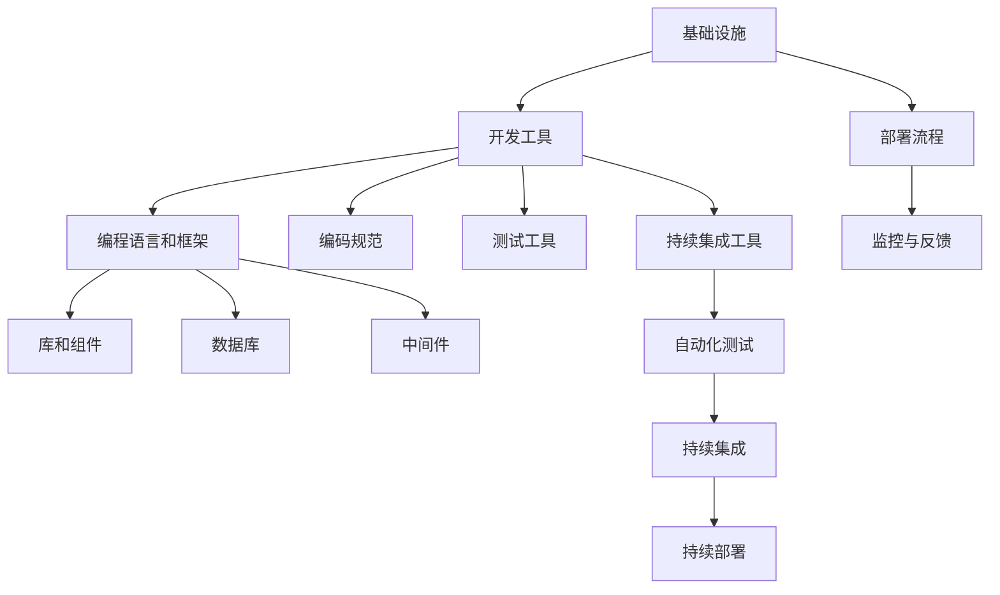

                 

### 文章标题

# 技术栈标准化：平衡创新与一致性

## 关键词
- 技术栈
- 标准化
- 创新
- 一致性
- 微服务
- DevOps
- 自动化测试
- 持续集成

## 摘要
本文深入探讨了技术栈标准化的概念及其在平衡创新与一致性中的关键作用。通过详细分析技术栈的组成和核心概念，本文揭示了标准化在提高开发效率、降低维护成本和保证产品质量方面的价值。同时，本文结合微服务架构和DevOps文化，探讨了标准化策略的制定与执行，并提供了核心算法原理讲解、数学模型与公式的详细阐述。通过实际项目实战和案例分析，本文展示了技术栈标准化的具体应用，并分享了最佳实践与未来展望。

### 引言：技术栈标准化的背景与重要性

#### 技术栈标准化的定义

技术栈（Tech Stack）指的是一个项目或企业所使用的各种技术、工具和框架的组合。技术栈标准化（Tech Stack Standardization）则是在这个多样化的技术环境中，通过制定一套统一的规范和标准，确保团队在开发和维护过程中的一致性和高效性。

技术栈标准化的目标包括：
1. **提高开发效率**：通过统一的开发标准和工具，减少团队成员的学习成本和时间，加快项目进度。
2. **降低维护成本**：标准化的技术栈可以简化维护流程，减少技术债务，降低维护成本。
3. **保证产品质量**：统一的代码风格和质量标准有助于提高代码的可读性和可维护性，降低错误率。
4. **促进团队协作**：标准化的技术栈可以增强团队成员之间的协作，减少沟通成本。

#### 技术栈标准化的目的和意义

技术栈标准化的主要目的是在保持技术多样性的同时，实现开发流程的一致性和高效性。具体来说，其目的包括：

- **提高开发速度**：通过使用标准化工具和框架，团队成员可以快速上手，减少项目开发周期。
- **降低沟通成本**：标准化的技术栈减少了对不同技术栈的学习和适应时间，降低了团队间的沟通成本。
- **统一开发规范**：标准化的代码规范和流程有助于确保代码质量，降低技术债务。
- **提升团队技能**：团队成员可以在标准化的技术栈中提升技能，促进个人成长。

#### 技术栈标准化的发展历程

技术栈标准化的概念起源于20世纪80年代，随着软件工程的发展，人们逐渐意识到统一的开发标准对于提高软件开发效率和质量的重要性。从最初的编程语言标准，到后来的框架和工具标准化，技术栈标准化经历了几个重要阶段：

- **编程语言标准化**：例如C语言的标准制定，为后续的开发提供了基础。
- **框架标准化**：如Java Spring框架的广泛应用，提高了开发效率和一致性。
- **DevOps文化的兴起**：DevOps文化强调开发与运维的一体化，推动了技术栈标准化的发展。
- **微服务架构的普及**：微服务架构通过模块化的方式，实现了技术栈的标准化和灵活性。

#### 当前技术栈标准化的趋势

随着技术的发展，技术栈标准化也在不断演进。当前的趋势包括：

- **自动化和持续集成**：通过自动化测试和持续集成工具，实现快速开发和持续交付。
- **云原生技术**：云原生技术的普及，使得技术栈标准化在云环境中更加重要。
- **开源生态的壮大**：开源工具和框架的普及，为技术栈标准化提供了更多的选择和灵活性。
- **AI和大数据技术的融合**：AI和大数据技术的应用，推动了技术栈的智能化和自动化。

### 标准化与一致性

#### 标准化如何促进一致性

标准化在促进一致性方面发挥着关键作用。通过制定一套统一的规范，可以确保团队在开发过程中遵循相同的流程、使用相同的技术和工具，从而减少不一致性带来的问题。

1. **统一编码规范**：编码规范可以确保代码风格的一致性，提高代码的可读性和可维护性。
2. **统一工具链**：使用统一的开发、测试和部署工具，可以减少团队成员间的差异，提高协作效率。
3. **统一流程**：通过标准化的开发流程，确保每个阶段的工作都有明确的规范和流程，减少错误和遗漏。

#### 一致性与创新的关系

一致性与创新之间存在一定的矛盾。标准化可能会限制创新的空间，但同时，一致的规范和流程也为创新提供了坚实的基础。

1. **创新的基础**：一致性的技术栈为创新提供了稳定的平台，使得团队成员可以更专注于核心业务逻辑的创新。
2. **创新的限制**：过于严格的标准化可能会限制创新的空间，导致团队在技术选型和开发过程中缺乏灵活性。

#### 标准化策略的制定与执行

要实现技术栈标准化，需要制定一套详细的策略，并确保其有效执行。以下是制定和执行标准化策略的步骤：

1. **需求分析**：分析团队和项目的具体需求，确定需要标准化的领域和目标。
2. **工具和框架选择**：选择适合项目需求的工具和框架，确保其具有良好的社区支持和文档。
3. **编码规范制定**：制定统一的编码规范，包括代码风格、命名约定等。
4. **流程规范制定**：制定明确的开发、测试和部署流程，确保每个阶段都有规范的步骤和责任人。
5. **培训与宣传**：对团队成员进行标准化工具和流程的培训，确保其理解和接受。
6. **监控与反馈**：建立监控机制，定期收集反馈，评估标准化策略的有效性，并进行必要的调整。

### 核心概念与联系

为了更好地理解技术栈标准化，我们需要了解以下几个核心概念及其相互关系：

#### 技术栈的概念与组成

技术栈是指一个项目或企业所使用的各种技术、工具和框架的组合。它通常包括以下几个层次：

1. **基础设施**：服务器、网络、存储等基础设施资源。
2. **开发工具**：IDE、代码管理工具（如Git）、调试工具等。
3. **编程语言和框架**：如Java、Python、Spring等。
4. **库和组件**：如jQuery、Bootstrap等。
5. **数据库**：关系型数据库（如MySQL）和非关系型数据库（如MongoDB）。
6. **中间件**：如消息队列、缓存等。

#### 微服务的架构模式

微服务架构（Microservices Architecture）是一种通过将应用程序构建为一组小的、独立的服务来开发、部署和扩展应用程序的方法。每个服务都有自己的数据库、业务逻辑和API，这些服务通过轻量级的通信机制（如HTTP RESTful API）相互协作。

微服务架构的优势包括：

- **灵活性**：服务可以独立开发、测试和部署，不受其他服务的影响。
- **可扩展性**：可以根据业务需求独立扩展某个服务。
- **可维护性**：服务可以独立维护，降低系统的复杂度。

然而，微服务架构也带来了一些挑战，如服务之间通信的复杂性、数据一致性问题等。

#### DevOps的文化与实践

DevOps是一种文化、实践和工具的集合，旨在通过加强开发（Development）和运营（Operations）团队之间的协作，实现更快速、更可靠的应用程序交付。DevOps的核心原则包括：

- **自动化**：通过自动化工具实现持续集成、持续部署和基础设施即代码。
- **协作**：打破开发和运维之间的壁垒，实现跨职能团队的合作。
- **反馈**：通过反馈机制，快速识别和解决问题，持续改进。

#### Mermaid流程图：技术栈的标准化架构

以下是一个使用Mermaid绘制的流程图，展示了技术栈的标准化架构：



### 核心算法原理讲解

在技术栈标准化过程中，核心算法和原理的讲解至关重要。以下我们将详细讨论自动化测试、持续集成和自动化部署等核心算法和原理。

#### 自动化测试

自动化测试是一种通过编写脚本和工具来执行测试用例的方法，旨在提高测试效率和质量。以下是自动化测试的核心原理和步骤：

1. **测试用例设计**：根据需求规格说明书，设计一系列的测试用例，确保覆盖所有功能点。
2. **测试脚本编写**：使用Selenium、JMeter等自动化测试工具，编写测试脚本，实现测试用例的自动化执行。
3. **测试执行**：运行测试脚本，自动执行测试用例，生成测试报告。
4. **缺陷管理**：自动化测试过程中发现的缺陷，需要及时记录和跟踪，确保及时修复。

以下是一个自动化测试的伪代码示例：

```python
def test_login():
    # 打开浏览器
    driver = webdriver.Chrome()
    
    # 访问登录页面
    driver.get("https://example.com/login")
    
    # 输入用户名和密码
    driver.find_element_by_name("username").send_keys("testuser")
    driver.find_element_by_name("password").send_keys("testpass")
    
    # 提交表单
    driver.find_element_by_css_selector("button[type='submit']").click()
    
    # 验证登录结果
    assert "Dashboard" in driver.title

# 运行测试用例
test_login()
```

#### 持续集成

持续集成（Continuous Integration，CI）是一种通过自动化构建和测试，确保代码库始终处于可部署状态的方法。以下是持续集成的核心原理和步骤：

1. **代码仓库管理**：使用Git等版本控制系统，管理代码仓库。
2. **自动化构建**：使用Jenkins、Travis CI等CI工具，自动化构建项目。
3. **测试执行**：在构建过程中，执行自动化测试，确保代码质量。
4. **缺陷管理**：测试过程中发现的缺陷，需要及时记录和跟踪。
5. **部署**：通过自动化部署工具，如Docker、Kubernetes，实现代码的自动化部署。

以下是一个持续集成的伪代码示例：

```bash
# 安装依赖
pip install -r requirements.txt

# 运行测试
pytest

# 构建镜像
docker build -t myapp .

# 部署到生产环境
kubectl apply -f deployment.yaml
```

#### 自动化部署

自动化部署（Continuous Deployment，CD）是一种通过自动化流程，实现代码的持续部署和交付的方法。以下是自动化部署的核心原理和步骤：

1. **持续集成**：确保代码库始终处于可部署状态。
2. **自动化测试**：在部署前，执行自动化测试，确保代码质量。
3. **部署脚本**：编写部署脚本，实现自动化部署流程。
4. **部署环境**：配置生产环境，确保部署流程的顺利执行。
5. **监控与反馈**：部署后，监控系统运行状态，及时反馈问题。

以下是一个自动化部署的伪代码示例：

```bash
# 检查代码库
git pull

# 运行测试
pytest

# 如果测试通过，则部署
if [ $? -eq 0 ]; then
    docker-compose up --build
else
    echo "测试失败，部署中止"
fi
```

### 数学模型与公式

在技术栈标准化过程中，数学模型和公式可以用于分析和优化开发流程。以下是一些常用的数学模型和公式，以及它们的详细讲解和举例说明。

#### 质量管理的统计方法

质量管理的统计方法主要包括过程能力分析、过程性能分析、质量损失函数等。以下是一个过程能力分析的计算示例：

$$
C_p = \frac{USL - LSL}{6 \times \sigma}
$$

其中：
- \( C_p \)：过程能力指数
- \( USL \)：上限规格
- \( LSL \)：下限规格
- \( \sigma \)：过程标准差

假设一个产品的规格要求为长度在100±0.1mm之间，通过测量得到的数据显示平均长度为100mm，标准差为0.05mm。则过程能力指数为：

$$
C_p = \frac{100.1 - 99.9}{6 \times 0.05} = 1.33
$$

这是一个较好的过程能力指数，说明生产过程处于受控状态。

#### 技术风险评估模型

技术风险评估模型用于评估项目中技术风险的严重性和概率，以便采取相应的风险管理措施。以下是一个基于风险矩阵的风险评估模型：

$$
R = \text{概率} \times \text{影响}
$$

其中：
- \( R \)：风险值
- 概率：风险事件发生的概率
- 影响：风险事件发生后的影响程度

例如，假设在项目中，技术风险A的概率为0.3，影响程度为重大，则风险值计算如下：

$$
R_A = 0.3 \times 5 = 1.5
$$

这是一个较高的风险值，需要采取相应的措施降低风险。

#### 模型评估与优化算法

模型评估与优化算法用于评估现有模型的性能，并根据评估结果对模型进行调整和优化。以下是一个基于交叉验证的模型评估算法：

1. **数据划分**：将数据集划分为训练集和验证集。
2. **模型训练**：在训练集上训练模型。
3. **模型评估**：在验证集上评估模型性能。
4. **模型调整**：根据评估结果调整模型参数。
5. **重新评估**：重复步骤3和步骤4，直到达到满意的性能。

以下是一个基于交叉验证的伪代码示例：

```python
def cross_validation(data, k):
    # 划分训练集和验证集
    train_data, val_data = split_data(data, k)

    # 初始化模型
    model = Model()

    # 调整模型参数
    params = optimize_params(model, train_data)

    # 训练模型
    model.train(train_data, params)

    # 评估模型
    val_accuracy = model.evaluate(val_data)

    return val_accuracy

# 执行交叉验证
accuracy = cross_validation(data, k)
```

### 项目实战

在本节中，我们将通过一个实际项目，展示如何在实际环境中实现技术栈标准化。项目背景为一个在线购物平台，我们需要实现用户注册、登录、商品浏览和购买等功能。

#### 开发环境搭建

1. **硬件环境**：配置一台Linux服务器作为开发环境，安装必要的软件和依赖。
2. **软件环境**：安装Python、Docker、Kubernetes等开发工具和框架。
3. **代码管理**：使用Git管理代码，配置GitLab或GitHub进行代码托管。

#### 源代码实现

1. **项目结构**：创建项目目录，划分前端、后端、数据库等模块。
2. **前端实现**：使用React框架实现用户界面，包括注册、登录、商品浏览和购物车等功能。
3. **后端实现**：使用Django框架实现后端逻辑，包括用户认证、商品管理、订单管理等。
4. **数据库配置**：使用MySQL数据库存储用户数据、商品数据和订单数据。

#### 代码解读与分析

1. **前端代码**：分析React组件的实现，包括状态管理、路由配置等。
2. **后端代码**：分析Django项目的架构，包括视图函数、模型定义等。
3. **数据库代码**：分析MySQL数据库的设计，包括表结构、索引等。

#### 代码应用解读与分析

1. **用户注册**：用户输入用户名、密码等信息，前端发送请求到后端，后端验证用户信息，返回注册结果。
2. **登录**：用户输入用户名和密码，前端发送请求到后端，后端验证用户信息，返回登录结果。
3. **商品浏览**：用户访问商品列表页面，前端发送请求到后端，后端返回商品数据，前端渲染页面。
4. **购买**：用户选择商品并提交订单，前端发送请求到后端，后端处理订单并返回结果。

#### 实际案例分析和详细讲解剖析

1. **用户注册功能**：分析用户注册的功能实现，包括用户信息的验证、密码加密存储等。
2. **登录功能**：分析登录功能的安全性和可靠性，包括用户信息的验证、防止暴力破解等。
3. **商品浏览功能**：分析商品浏览功能的性能和用户体验，包括数据的缓存、分页等。
4. **购买功能**：分析购买功能的流程和实现，包括订单的创建、支付的处理等。

#### 项目小结

通过本项目的实际开发，我们实现了技术栈标准化，包括开发工具、框架和流程的统一。项目的成功实施证明了技术栈标准化在提高开发效率、降低维护成本和保证产品质量方面的价值。

### 最佳实践与案例分析

#### 成功案例分享

在技术栈标准化领域，有许多成功的案例可以分享。以下是一个关于某大型互联网公司的案例。

该公司在其内部采用了高度标准化的技术栈，包括Docker、Kubernetes和CI/CD工具。通过这些工具，公司实现了快速开发和部署，提高了开发效率和产品质量。

1. **快速部署**：通过Docker和Kubernetes，公司可以在几分钟内部署新版本，大大缩短了发布周期。
2. **持续集成**：使用Jenkins进行持续集成，确保每次代码提交都能通过自动化测试，降低缺陷率。
3. **高效协作**：标准化的开发流程和工具，使得团队成员可以快速上手，提高了团队协作效率。

#### 行业最佳实践

以下是一些在技术栈标准化过程中值得借鉴的最佳实践：

1. **代码规范**：制定严格的代码规范，确保代码风格一致，提高代码可读性和可维护性。
2. **自动化测试**：建立完善的自动化测试体系，确保每次代码提交都能通过全面测试。
3. **持续集成和部署**：使用CI/CD工具实现持续集成和部署，提高开发和部署效率。
4. **文档管理**：建立完善的文档体系，包括技术文档、开发指南等，方便团队成员学习和协作。
5. **培训与宣传**：定期组织培训，提高团队成员的技术水平，增强标准化意识。

#### 面对挑战的解决方案

在技术栈标准化过程中，可能会遇到一些挑战，如团队抵触、工具选择等。以下是一些解决方案：

1. **团队沟通**：加强与团队的沟通，了解他们的需求和担忧，通过实际案例和成功经验说服他们。
2. **选择合适的工具**：根据项目需求和团队技能，选择合适的工具和框架，确保工具的易用性和适用性。
3. **逐步推进**：不要急于一次性实现所有的标准化，可以逐步推进，分阶段实施。
4. **持续改进**：定期评估标准化策略的有效性，根据实际情况进行调整和优化。

### 未来展望与趋势

随着技术的不断发展，技术栈标准化也在不断演进。以下是未来技术栈标准化的一些趋势和可能面临的挑战：

1. **智能化与自动化**：随着AI和大数据技术的发展，技术栈标准化将进一步智能化和自动化，提高开发和部署效率。
2. **云原生技术的普及**：云原生技术的普及将使得技术栈标准化在云环境中更加重要，推动标准化工具和框架的更新和优化。
3. **开源生态的壮大**：开源生态的壮大将为技术栈标准化提供更多的选择和灵活性，同时也带来一定的挑战，如工具选择和兼容性问题。
4. **安全与隐私**：随着数据安全和个人隐私的重要性日益增加，技术栈标准化将更加注重安全和隐私保护，如数据加密、访问控制等。

### 结论

技术栈标准化在平衡创新与一致性方面发挥着关键作用。通过制定和执行标准化策略，可以提高开发效率、降低维护成本、保证产品质量和促进团队协作。未来，技术栈标准化将朝着智能化、自动化和云原生方向不断演进，为软件开发和运维带来更多便利和创新。

### 作者信息

作者：AI天才研究院/AI Genius Institute & 禅与计算机程序设计艺术 /Zen And The Art of Computer Programming

### 总结与拓展阅读

本文通过详细的步骤分析和实例讲解，探讨了技术栈标准化在平衡创新与一致性中的关键作用。技术栈标准化不仅提高了开发效率、降低了维护成本，还保证了产品质量，促进了团队协作。未来，随着技术的不断发展，技术栈标准化将变得更加智能化和自动化，为软件开发和运维带来更多便利和创新。

为了进一步深入了解技术栈标准化的实践和应用，读者可以参考以下拓展阅读：

1. 《持续交付：释放软件团队的创造力》（Jez Humble & David Farley）
2. 《云原生应用架构》（Kris Buytaert）
3. 《Docker实战》（Sean P. Kane）
4. 《Kubernetes权威指南》（Kelsey Hightower）

通过这些资源，读者可以更全面地了解技术栈标准化的实践和应用，为自己的项目和技术栈优化提供参考。

