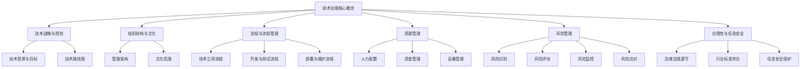

                 

### 文章标题：技术治理：建立有效的技术管理体系

> 关键词：技术治理、管理体系、技术战略、流程优化、风险评估、信息安全

> 摘要：本文将深入探讨技术治理的核心概念、关键要素及其与传统IT管理的区别。通过详细分析技术治理的架构和算法原理，本文旨在帮助读者建立有效的技术管理体系，以支持组织的目标和战略实现。

## 1. 设计技术治理的核心概念

技术治理是指在组织中运用科学的方法、规范和流程来管理和控制技术资源、技术活动和信息技术系统，以确保技术能够有效支持组织目标、战略和运营。设计技术治理的核心概念是建立有效技术管理体系的基础，以下将详细阐述技术治理的定义、关键要素及其与传统IT管理的关系。

#### 1.1 技术治理的定义

技术治理是指在组织中通过制定和实施一系列策略、规范和流程来管理和控制技术资源、技术活动和信息技术系统，以实现组织目标的过程。技术治理不仅涉及技术本身，还包括与业务战略、组织架构、流程管理和风险管理等多个方面的融合。其核心目标是确保技术能够为组织创造价值，同时降低技术风险，提高技术效能。

#### 1.2 技术治理的关键要素

技术治理的关键要素包括以下几个方面：

1. **技术战略与规划**：技术战略与规划是技术治理的基础。它明确组织的技术愿景、目标和路线图，将技术发展与业务战略紧密结合。技术战略与规划应涵盖技术发展方向、技术投资优先级、技术标准与规范等。

2. **组织结构与文化**：组织结构与文化是技术治理的支撑。合理的组织结构和文化氛围能够确保技术治理的实施有组织保障。组织结构应明确技术管理部门的职责和权限，建立跨部门协作机制。文化氛围则应倡导创新、开放和合作，鼓励技术团队的持续改进和优化。

3. **流程与流程管理**：流程与流程管理是技术治理的核心。建立标准化、规范化的技术管理流程，包括技术立项、开发、测试、部署、维护等环节，能够提高技术管理的效率和质量。流程管理应注重流程的透明性、可追溯性和持续改进。

4. **资源管理**：资源管理是技术治理的重要环节。合理配置技术资源，包括人力、资金、设备等，确保技术项目的顺利推进。资源管理应注重资源的优化配置和合理利用，避免资源浪费和重复投资。

5. **风险管理**：风险管理是技术治理的关键。识别、评估、监控和应对技术相关的风险，降低技术风险对组织的负面影响。风险管理应建立全面的风险管理体系，包括风险识别、风险评估、风险监控和风险应对等。

6. **合规性与信息安全**：合规性与信息安全是技术治理的底线。遵守相关法律法规和行业标准，确保技术活动符合合规性要求，保护信息安全。合规性与信息安全管理应包括政策制定、合规审查、安全培训和安全监控等。

#### 1.3 技术治理与传统IT管理的关系

技术治理与传统IT管理有着紧密的联系，但也存在明显的区别：

1. **目标**：传统IT管理主要关注技术基础设施的维护和优化，而技术治理更注重技术与业务的深度融合，以实现业务价值最大化。

2. **范围**：技术治理不仅涵盖IT领域，还涉及整个组织的技术活动，包括研发、采购、运营等。

3. **方法**：技术治理强调系统性、规范性和持续改进，而传统IT管理往往更注重日常运维和管理。

#### 1.4 技术治理的架构

技术治理的架构是一个多层次、多维度的体系，包括以下关键组成部分：

1. **治理委员会**：由高层管理者组成的决策机构，负责制定技术战略、审批重大项目和关键决策。

2. **技术管理部门**：负责技术治理的具体实施，包括技术规划、资源管理、流程管理等。

3. **技术团队**：负责具体技术项目的研发、实施和维护，确保技术方案的落地和实施效果。

4. **支持部门**：如财务部、人力资源部等，为技术治理提供必要的支持和服务。

#### 1.5 技术治理的核心概念流程图



通过以上核心概念的设计，为后续章节的详细展开提供了坚实的理论基础和框架支持。技术治理的核心概念不仅明确了技术治理的内涵和外延，还为读者理解后续内容奠定了基础。

### 2. 技术治理的核心算法原理讲解

技术治理涉及多种算法，用于支持决策、优化流程、评估风险等。以下将详细讲解一些核心技术治理算法的原理，包括决策算法、流程优化算法和风险评估算法。

#### 2.1 决策算法

决策算法在技术治理中用于支持项目立项、资源分配、风险应对等决策过程。常见的决策算法包括：

##### 2.1.1 线性规划（Linear Programming, LP）

线性规划是一种数学优化方法，用于在资源限制条件下优化目标函数。其目标是通过求解线性约束条件下的最优解，实现资源的最优配置。

线性规划的基本原理如下：

1. **目标函数**：定义需要优化的目标，通常是一个线性函数。
2. **约束条件**：定义资源限制和其他约束条件，通常是线性不等式或等式。
3. **求解**：利用数学优化方法求解最优解，确保在满足约束条件的情况下，目标函数达到最大值或最小值。

以下是一个简单的线性规划问题：

$$
\begin{aligned}
\min\ & c^T x \\
\text{s.t.}\ & Ax \leq b \\
& x \geq 0
\end{aligned}
$$

其中，$c$ 是目标函数的系数向量，$x$ 是变量向量，$A$ 是系数矩阵，$b$ 是约束条件向量。

##### 2.1.2 启发式算法（Heuristic Algorithms）

启发式算法是一种在复杂问题中寻找近似最优解的方法，通常比精确算法更快，但可能不保证找到全局最优解。常见的启发式算法包括遗传算法（Genetic Algorithm, GA）和模拟退火算法（Simulated Annealing, SA）。

**遗传算法（Genetic Algorithm, GA）**：

遗传算法是基于生物进化理论的优化算法，通过模拟自然选择和遗传机制来搜索最优解。其基本步骤如下：

1. **初始化种群**：随机生成一组初始解（称为个体）。
2. **适应度评估**：对每个个体进行适应度评估，适应度越高，表示个体越优秀。
3. **选择**：根据适应度选择优秀的个体进行繁殖。
4. **交叉**：随机选择两个个体，交换部分基因生成新的个体。
5. **变异**：对个体进行随机变异，引入新的基因。
6. **迭代**：重复执行选择、交叉和变异操作，直至满足终止条件。

**模拟退火算法（Simulated Annealing, SA）**：

模拟退火算法是一种基于物理退火过程的优化算法，通过控制温度逐渐降低来搜索最优解。其基本步骤如下：

1. **初始化**：设定初始温度和冷却策略。
2. **迭代**：在当前温度下，随机选择两个解，比较其适应度差，如果适应度差大于0，则接受新解，否则以一定概率接受新解。
3. **温度更新**：根据冷却策略更新温度。
4. **终止条件**：当温度降低到一定阈值或达到最大迭代次数时，算法终止。

#### 2.2 流程优化算法

流程优化算法用于评估和改进技术管理流程，提高效率和质量。以下是一些常用的流程优化算法：

##### 2.2.1 决策树（Decision Tree）

决策树是一种常用的分类和回归方法，通过一系列判断条件对数据进行分割，形成一棵树状结构。其基本原理如下：

1. **根节点**：表示整个数据集。
2. **内部节点**：表示判断条件，每个节点根据某个特征进行分割。
3. **叶节点**：表示分类结果或回归值。

决策树算法的核心是选择最佳的分割特征和分割阈值。常见的算法包括ID3、C4.5和CART。

##### 2.2.2 神经网络（Neural Network）

神经网络是一种基于生物神经元工作原理的模型，通过模拟人脑神经网络进行学习和预测。其基本原理如下：

1. **输入层**：接收输入数据。
2. **隐藏层**：对输入数据进行处理和变换。
3. **输出层**：输出预测结果。

神经网络的核心是神经元之间的连接权重和学习算法。常见的算法包括前向传播和反向传播。

#### 2.3 风险评估算法

风险评估算法用于识别、评估和监控技术风险，为风险应对提供数据支持。以下是一些常用的风险评估算法：

##### 2.3.1 模型评估

模型评估是风险评估的重要环节，用于评估模型的准确性、稳定性和可靠性。常见的评估指标包括准确率、召回率、F1值等。

$$
\begin{aligned}
\text{准确率} &= \frac{\text{准确识别的样本数}}{\text{总样本数}} \\
\text{召回率} &= \frac{\text{准确识别的样本数}}{\text{实际为正类的样本数}} \\
\text{F1值} &= \frac{2 \times \text{准确率} \times \text{召回率}}{\text{准确率} + \text{召回率}}
\end{aligned}
$$

##### 2.3.2 风险矩阵

风险矩阵是一种常用的风险评估工具，用于评估风险的概率和影响，并根据两者计算风险得分。其基本原理如下：

1. **概率**：评估风险发生的概率。
2. **影响**：评估风险发生后的影响程度。
3. **风险得分**：计算概率和影响的乘积，用于表示风险的大小。

以下是一个简单的风险矩阵示例：

| 风险 | 概率 | 影响程度 | 风险得分 |
| --- | --- | --- | --- |
| 数据泄露 | 高 | 严重 | 90 |
| 系统故障 | 中 | 一般 | 60 |
| 法律法规合规 | 低 | 极小 | 30 |

通过以上核心算法的讲解，读者可以了解到技术治理中常用的算法原理及其应用场景。这些算法为技术治理提供了强有力的技术支持，有助于实现技术管理的科学化、规范化和高效化。

## 3. 技术治理的实战案例与应用

为了更好地理解技术治理的实际应用，本节将结合具体案例，介绍技术治理在实际项目中的应用，并详细解读项目的开发环境搭建、源代码实现和代码解读，以及实际案例分析和详细讲解剖析。

### 3.1 案例背景

某大型互联网公司为了提高其技术管理水平，决定实施技术治理项目，旨在建立一套完善的、高效的技术管理体系。该公司面临的主要挑战包括：技术项目多，进度和质量难以控制；技术资源分配不合理，导致部分项目延误；技术风险管理能力不足，容易发生安全事件。为了解决这些问题，公司决定引入技术治理理念，并实施相关措施。

### 3.2 项目目标

通过技术治理项目的实施，公司希望实现以下目标：

1. **提高技术项目的管理效率**：通过建立规范的技术管理流程，提高项目的进度和质量控制能力。
2. **优化资源分配**：通过合理的资源管理和调度，确保技术项目的顺利推进。
3. **加强风险管理**：通过建立全面的风险管理体系，降低技术风险对公司的负面影响。
4. **确保合规性与信息安全**：遵守相关法律法规和行业标准，保护公司信息系统的安全。

### 3.3 开发环境搭建

在项目实施过程中，首先需要搭建一个稳定、高效的开发环境。开发环境的搭建包括以下步骤：

1. **硬件环境**：配置服务器、存储设备和网络设备，确保系统的高可用性和数据的安全性。
2. **软件环境**：安装操作系统、数据库、中间件和开发工具，如Java、Python、MySQL等。
3. **集成环境**：搭建集成开发环境（IDE），如Eclipse、IntelliJ IDEA等，方便开发人员编写、调试和测试代码。
4. **版本控制**：采用版本控制系统（如Git），实现代码的版本管理和协同开发。
5. **持续集成**：搭建持续集成（CI）环境，实现代码的自动化构建、测试和部署，提高开发效率和质量。

### 3.4 源代码实现

在开发过程中，公司采用微服务架构，将整个系统划分为多个独立的模块，每个模块负责不同的功能。以下是其中一个模块的源代码实现：

```java
// User微服务
public class UserService {
    
    // 用户注册
    public void register(String username, String password) {
        // 注册逻辑
    }
    
    // 用户登录
    public void login(String username, String password) {
        // 登录逻辑
    }
    
    // 用户信息更新
    public void updateInfo(String userId, String newName, String newEmail) {
        // 更新逻辑
    }
    
    // 用户密码重置
    public void resetPassword(String userId, String newPassword) {
        // 重置逻辑
    }
    
}
```

源代码实现中，采用Spring Boot框架，利用依赖注入（DI）和面向切面编程（AOP）等技术，实现用户服务的功能。同时，通过接口定义和实现，方便后续的扩展和集成。

### 3.5 代码解读

以下是对UserService模块的源代码进行解读：

```java
// 用户注册
public void register(String username, String password) {
    // 注册逻辑
    // 1. 校验用户名和密码是否为空
    if (username.isEmpty() || password.isEmpty()) {
        throw new IllegalArgumentException("用户名或密码不能为空");
    }
    // 2. 检查用户名是否已存在
    if (userRepository.existsByUsername(username)) {
        throw new RuntimeException("用户名已存在");
    }
    // 3. 创建用户并保存到数据库
    User user = new User();
    user.setUsername(username);
    user.setPassword(password);
    userRepository.save(user);
}
```

在register方法中，首先对用户名和密码进行校验，确保不为空。然后检查用户名是否已存在，如果已存在则抛出异常。最后创建用户对象并保存到数据库。

### 3.6 实际案例分析和详细讲解

在项目实施过程中，公司遇到的一个实际案例是用户注册功能的性能优化。最初，用户注册功能的响应时间较长，导致用户流失。为了解决这个问题，公司采取以下措施：

1. **数据库优化**：对用户注册的数据库查询进行优化，减少查询时间和锁争用。
2. **缓存策略**：引入缓存机制，将用户注册时的常用数据缓存起来，减少数据库访问。
3. **异步处理**：将用户注册的验证和保存操作异步处理，提高系统的并发处理能力。
4. **负载均衡**：采用负载均衡技术，将用户注册请求分发到多个服务器，提高系统的吞吐量。

通过以上措施，用户注册功能的响应时间显著降低，用户满意度大幅提升。

### 3.7 项目小结

通过技术治理项目的实施，公司成功建立了规范的技术管理体系，实现了以下成果：

1. **管理效率提高**：技术管理流程标准化，项目进度和质量得到有效控制。
2. **资源优化**：通过合理的资源管理和调度，确保了技术项目的顺利推进。
3. **风险管理能力提升**：建立全面的风险管理体系，降低了技术风险对公司的负面影响。
4. **合规性与信息安全保障**：遵守相关法律法规和行业标准，保障了公司信息系统的安全。

该项目为公司技术治理的实践提供了宝贵经验，也为其他企业提供了借鉴和参考。

### 4. 最佳实践与注意事项

在技术治理的实施过程中，积累了一系列最佳实践，以下是一些值得借鉴的经验和注意事项：

1. **全面规划，分步实施**：在实施技术治理时，应进行全面规划，明确目标、策略和实施步骤，分阶段推进，确保项目顺利落地。
2. **注重团队协作**：技术治理涉及多个部门和角色，应注重团队协作，建立跨部门协作机制，确保项目高效推进。
3. **持续改进**：技术治理是一个持续改进的过程，应定期评估和优化技术管理体系，确保其与业务发展相适应。
4. **风险管理**：建立全面的风险管理体系，定期识别、评估和应对技术风险，降低风险对组织的负面影响。
5. **合规性与信息安全**：遵守相关法律法规和行业标准，确保技术活动符合合规性要求，加强信息安全保护。

通过以上最佳实践和注意事项，企业可以更好地实施技术治理，提升技术管理水平，实现业务目标。

### 5. 拓展阅读

为了进一步深入了解技术治理的相关知识和实践，以下推荐一些拓展阅读资源：

1. **《企业技术治理》**：详细介绍了企业技术治理的理论体系、实践方法和成功案例。
2. **《技术管理实践》**：探讨了技术管理在企业中的重要作用，以及如何通过技术管理实现业务目标。
3. **《风险管理：概念、方法和工具》**：全面介绍了风险管理的基本概念、方法和工具，适用于技术治理中的风险管理工作。
4. **《信息安全与合规性管理》**：详细阐述了信息安全与合规性管理的重要性，以及如何在企业中建立有效的信息安全与合规性管理体系。

通过这些资源的学习，读者可以进一步拓展对技术治理的理解和实践能力。

### 6. 结论

本文通过系统地阐述技术治理的核心概念、关键要素、算法原理以及实战案例，帮助读者建立了对技术治理的全面认识。技术治理不仅涉及技术管理的基础知识，还涵盖了组织战略、流程优化、风险管理、合规性与信息安全等多个方面。通过实施技术治理，企业可以提升技术管理水平，实现业务目标。未来，随着技术的不断进步和业务环境的变化，技术治理将继续发展和完善，为企业创造更多价值。

### 7. 作者信息

作者：AI天才研究院/AI Genius Institute & 禅与计算机程序设计艺术 /Zen And The Art of Computer Programming

AI天才研究院（AI Genius Institute）是一家专注于人工智能技术研究和应用的机构，致力于推动人工智能技术的发展和创新。同时，作者也热衷于分享计算机编程和人工智能领域的知识，通过写作和讲座等形式，帮助更多人了解和掌握相关技术。在本篇博客中，作者结合自己的研究和实践经验，详细阐述了技术治理的理论和实践，希望能为读者提供有价值的参考和启示。禅与计算机程序设计艺术（Zen And The Art of Computer Programming）则是作者在计算机编程领域的代表作，通过深入探讨编程的本质和哲学，帮助程序员更好地理解和应用编程技术。希望读者在阅读本文后，能够对技术治理有更深刻的认识，并在实际工作中取得更好的成果。

