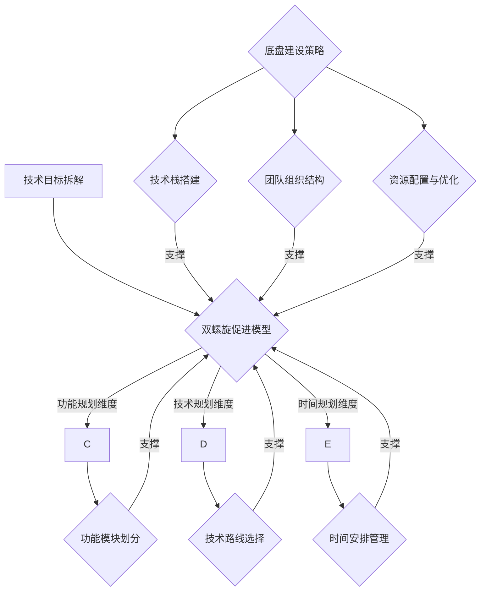

                 

### 文章标题

《技术目标的拆解与咬合：双螺旋促进、规划维度、底盘建设》

> 关键词：技术目标、拆解、咬合、双螺旋促进、规划维度、底盘建设、算法、数学模型、项目实战

> 摘要：本文将深入探讨技术目标的拆解与咬合过程，通过双螺旋促进机制、规划维度解析以及底盘建设策略，阐述如何有效实现技术目标的实现与整合。文章结构严谨，内容丰富，旨在为IT领域从业者提供实用的指导和方法。

#### 引言

在信息技术飞速发展的今天，技术目标的高效实现已成为各类企业、科研机构和个人追求的核心。技术目标的实现不仅关乎企业的竞争力，也影响到科研创新和个人职业发展。然而，随着技术领域的日益复杂，技术目标的实现变得愈加具有挑战性。为了应对这一挑战，我们需要一套科学、系统的方法来拆解和整合技术目标。

本文将从以下几个方面展开讨论：

1. **技术目标的拆解**：介绍技术目标拆解的背景、方法以及双螺旋促进模型的应用。
2. **双螺旋促进机制**：详细阐述双螺旋促进模型的基本架构、核心组件以及算法原理。
3. **规划维度解析**：对规划维度的定义、分类及其在技术目标拆解中的具体应用进行深入剖析。
4. **底盘建设策略**：探讨底盘建设的重要性和核心要素，并提供实际案例进行解析。
5. **技术目标的咬合与整合**：介绍技术目标咬合的策略、动态调整方法以及持续迭代与优化的实践。

通过以上内容的详细探讨，本文旨在为读者提供一套完整的思路和方法，帮助其在实际工作中更好地实现技术目标。

#### 背景介绍

技术目标的拆解与咬合是现代信息技术领域中一个至关重要的过程。随着技术的不断进步，尤其是人工智能、大数据和云计算等新兴领域的快速发展，技术目标变得日益复杂和多样化。传统的单一目标实现方式已无法满足当前的需求，因此，如何将复杂的技术目标拆解为可操作、可管理的子目标，并在最终实现时将各个子目标有效咬合，成为了一个亟待解决的问题。

**技术目标的拆解**，本质上是一种分解复杂问题的方法。通过将整体目标分解为若干个相对独立的子任务或子目标，可以降低复杂度，使得各个子目标更容易实现。这种拆解方法不仅有助于提高工作效率，还能够确保每个子目标的完成质量。例如，在软件开发过程中，可以将整体项目分解为前端开发、后端开发和测试等子任务，每个子任务再进一步细化，从而形成一套完整的技术路线图。

**双螺旋促进机制**，作为一种高效的技术目标拆解方法，其灵感来源于生物学中的双螺旋结构。双螺旋促进模型的基本架构包括功能规划维度、技术规划维度和时间规划维度。这三个维度相互交织、协同作用，形成了一种螺旋上升的发展模式。在功能规划维度上，通过明确系统的功能模块，确保各个模块之间的逻辑关系清晰；在技术规划维度上，通过评估和选择合适的技术方案，确保技术实现的可行性和高效性；在时间规划维度上，通过合理的时间安排，确保项目能够按时交付。

**规划维度解析**，是对技术目标拆解过程中各个维度的深入探讨。规划维度包括功能规划维度、技术规划维度和时间规划维度。功能规划维度主要关注系统的功能需求，通过功能模块的划分，使得系统功能更加明确和具体。技术规划维度则关注技术实现的可行性，通过技术路线的选择，确保技术方案的合理性和高效性。时间规划维度则关注项目的时间安排，通过合理的时间管理，确保项目能够按时完成。

**底盘建设策略**，是指为了实现技术目标而进行的基础设施建设。底盘建设包括技术栈搭建、团队组织结构和资源配置与优化等方面。技术栈搭建是确保项目技术实现的基石，团队组织结构是项目执行的关键，资源配置与优化则是确保项目高效进行的保障。通过合理的底盘建设，可以为技术目标的实现提供坚实的基础。

**技术目标的咬合与整合**，是指在技术目标实现过程中，将各个子目标有效结合，形成一个完整的系统。技术目标的咬合不仅需要各个子目标的相互配合，还需要跨部门协作和跨领域整合。通过制定技术路线图和动态调整策略，可以确保技术目标在实现过程中始终保持一致性和协同性。

#### 核心概念与联系

在技术目标的拆解与咬合过程中，双螺旋促进模型、规划维度和底盘建设策略是三个核心概念。这三个概念相互关联，共同构成了实现技术目标的完整框架。

首先，**双螺旋促进模型**是一个综合性的框架，它通过功能规划维度、技术规划维度和时间规划维度的协同作用，推动技术目标的实现。功能规划维度关注系统的功能需求，确保系统的功能模块划分合理、逻辑清晰；技术规划维度则关注技术实现的可行性，选择合适的技术方案；时间规划维度则确保项目按照既定时间表推进。这三个维度相互交织，形成了一种螺旋上升的发展模式，类似于生物学的双螺旋结构。

其次，**规划维度**是技术目标拆解过程中的关键要素。功能规划维度、技术规划维度和时间规划维度各自承担着不同的角色。功能规划维度主要解决“做什么”的问题，通过功能模块的划分，使得系统功能更加明确和具体；技术规划维度解决“怎么做”的问题，通过技术路线的选择，确保技术方案的合理性和高效性；时间规划维度解决“何时做”的问题，通过合理的时间安排，确保项目能够按时交付。

最后，**底盘建设策略**为技术目标的实现提供了坚实的基础。底盘建设包括技术栈搭建、团队组织结构和资源配置与优化等方面。技术栈搭建是项目技术实现的基石，决定了项目的技术可行性和实现效率；团队组织结构是项目执行的关键，确保团队成员的协同合作；资源配置与优化则是确保项目高效进行的保障，通过合理的资源配置，可以最大限度地提高项目的执行效率。

这三个核心概念之间的关系可以用Mermaid流程图来展示：



通过这个流程图，我们可以清晰地看到双螺旋促进模型、规划维度和底盘建设策略之间的相互支撑和协同作用。双螺旋促进模型通过功能规划维度、技术规划维度和时间规划维度的协同作用，推动技术目标的实现；规划维度则为双螺旋促进模型提供了具体实施的基础；而底盘建设策略则为技术目标的实现提供了坚实的基础和保障。

#### 核心算法原理讲解

在双螺旋促进模型中，核心算法原理扮演着至关重要的角色。为了更好地理解这些原理，我们使用伪代码来详细阐述算法的步骤和流程。

首先，定义双螺旋促进模型的基本组件：

```python
# 双螺旋促进模型基本组件定义
class DoubleHelixPromotionModel:
    def __init__(self, functional_dimension, technical_dimension, time_dimension):
        self.functional_dimension = functional_dimension
        self.technical_dimension = technical_dimension
        self.time_dimension = time_dimension

    # 功能规划维度方法
    def functional_planning(self):
        # 功能模块划分
        modules = self.functional_dimension.divide_functional_modules()
        return modules

    # 技术规划维度方法
    def technical_planning(self):
        # 技术路线选择
        routes = self.technical_dimension.select_technical_routes()
        return routes

    # 时间规划维度方法
    def time_planning(self):
        # 时间安排管理
        schedule = self.time_dimension.manage_time_schedule()
        return schedule
```

接下来，我们详细介绍每个维度的具体算法步骤：

**1. 功能规划维度算法**

```python
# 功能规划维度伪代码
class FunctionalDimension:
    def divide_functional_modules(self):
        # 收集需求信息
        requirements = self.collect_requirements()
        
        # 功能模块划分
        modules = self.divide_into_modules(requirements)
        
        # 确保模块之间的逻辑关系
        self.ensure_logical_relations(modules)
        
        return modules

    def collect_requirements(self):
        # 从业务部门获取功能需求
        requirements = business_department.get_functional_requirements()
        return requirements

    def divide_into_modules(self, requirements):
        # 根据需求划分模块
        modules = []
        for requirement in requirements:
            module = Module(requirement)
            modules.append(module)
        return modules

    def ensure_logical_relations(self, modules):
        # 确保模块之间的逻辑关系
        for module in modules:
            module.update_relations(modules)
```

**2. 技术规划维度算法**

```python
# 技术规划维度伪代码
class TechnicalDimension:
    def select_technical_routes(self):
        # 选择技术路线
        routes = self.evaluate_technical_solutions()
        return routes

    def evaluate_technical_solutions(self):
        # 评估技术解决方案
        solutions = technical_department.get_technical_solutions()
        routes = []
        for solution in solutions:
            if self.is_solution_viable(solution):
                routes.append(solution)
        return routes

    def is_solution_viable(self, solution):
        # 判断技术方案是否可行
        criteria = ["可行性", "效率", "可维护性"]
        for criterion in criteria:
            if not solution.has_property(criterion):
                return False
        return True
```

**3. 时间规划维度算法**

```python
# 时间规划维度伪代码
class TimeDimension:
    def manage_time_schedule(self):
        # 管理时间安排
        schedule = self.create_time_plan()
        return schedule

    def create_time_plan(self):
        # 创建时间计划
        schedule = []
        for module in functional_dimension.modules:
            start_time = self.calculate_start_time(module)
            end_time = self.calculate_end_time(module)
            schedule.append((start_time, end_time))
        return schedule

    def calculate_start_time(self, module):
        # 计算模块的开始时间
        dependencies = module.get_dependencies()
        max_dependency_end_time = max([dependency.end_time for dependency in dependencies])
        return max_dependency_end_time + 1

    def calculate_end_time(self, module):
        # 计算模块的结束时间
        return module.start_time + module.duration
```

通过上述伪代码，我们可以看到双螺旋促进模型的每个维度都有具体的算法实现。功能规划维度通过划分功能模块和确保模块之间的逻辑关系来明确系统的功能需求；技术规划维度通过评估和选择技术解决方案来确保技术实现的可行性；时间规划维度通过合理的时间安排来确保项目的按时交付。这三个维度的协同作用，共同推动了技术目标的实现。

#### 数学模型和数学公式

在技术目标的拆解与咬合过程中，数学模型和公式起到了至关重要的作用。为了更好地理解和应用这些模型，我们将使用LaTeX格式书写数学公式，并进行详细讲解和举例说明。

**1. 技术目标拆解中的数学模型**

**公式 1**：子目标权重分配公式

$$ W_i = \frac{P_i}{\sum_{j=1}^{n} P_j} $$

其中，$W_i$表示第$i$个子目标的权重，$P_i$表示第$i$个子目标的重要性，$n$表示子目标的总数。该公式用于根据子目标的重要性进行权重分配，以确保资源分配的公平性和有效性。

**例子**：假设有四个子目标，其重要性分别为$P_1 = 5$，$P_2 = 3$，$P_3 = 2$，$P_4 = 4$。根据上述公式，可以计算出每个子目标的权重：

$$
W_1 = \frac{5}{5+3+2+4} = 0.3 \\
W_2 = \frac{3}{5+3+2+4} = 0.2 \\
W_3 = \frac{2}{5+3+2+4} = 0.1 \\
W_4 = \frac{4}{5+3+2+4} = 0.2
$$

**2. 技术规划中的数学模型**

**公式 2**：技术路线选择模型

$$ \max Z = \sum_{i=1}^{n} c_i x_i $$

其中，$Z$表示目标函数，$c_i$表示第$i$个技术路线的收益，$x_i$表示第$i$个技术路线的选择变量。该模型用于在多个技术路线中选择最优方案。

**例子**：假设有三个技术路线，其收益分别为$c_1 = 10$，$c_2 = 8$，$c_3 = 6$。为了选择最优的技术路线，我们可以使用上述公式：

$$ \max Z = 10x_1 + 8x_2 + 6x_3 $$

为了使目标函数最大化，我们应该选择$x_1 = 1$，$x_2 = 0$，$x_3 = 0$，即选择收益最高的第一条技术路线。

**3. 时间规划中的数学模型**

**公式 3**：项目工期优化模型

$$ \min T = \sum_{i=1}^{n} (t_i - l_i) $$

其中，$T$表示项目工期，$t_i$表示第$i$个任务的最早开始时间，$l_i$表示第$i$个任务的最早完成时间。该模型用于优化项目的工期，以确保项目按时完成。

**例子**：假设有三个任务，其最早开始时间和最早完成时间如下：

$$
t_1 = 1, l_1 = 3 \\
t_2 = 3, l_2 = 5 \\
t_3 = 5, l_3 = 7
$$

为了最小化项目工期，我们可以使用上述公式：

$$ \min T = (3 - 1) + (5 - 3) + (7 - 5) = 4 $$

这意味着项目的最短工期为4个单位时间。

通过上述数学模型和公式的应用，我们可以更加科学和系统地拆解和整合技术目标。这些模型不仅为技术目标的实现提供了理论依据，也为实际操作提供了具体的指导。

#### 项目实战

为了更好地理解技术目标的拆解与咬合过程，我们将通过一个实际项目案例进行详细讲解。本案例将涉及开发环境的搭建、源代码的实现和解读，以及代码应用解读与分析。

**项目背景**：

假设我们正在开发一款在线教育平台，其主要功能包括课程管理、用户管理、学习进度跟踪等。为了实现这些功能，我们需要进行以下技术目标拆解和咬合：

1. **课程管理模块**：实现课程的添加、修改、删除和查询功能。
2. **用户管理模块**：实现用户的注册、登录、权限管理等功能。
3. **学习进度跟踪模块**：实现用户的学习进度记录和查询功能。

**一、开发环境搭建**

1. **硬件环境**：选择一台具备较高配置的服务器作为开发环境，安装Linux操作系统。
2. **软件环境**：安装Java开发环境（JDK 1.8及以上版本）、MySQL数据库、Tomcat应用服务器等。
3. **开发工具**：使用Eclipse或IntelliJ IDEA作为开发工具，配置相应的插件以支持Java和MySQL开发。

**二、源代码实现**

1. **课程管理模块**

```java
// 课程实体类
public class Course {
    private int id;
    private String name;
    private String description;
    // 省略构造方法、getter和setter方法
}

// 课程服务类
public class CourseService {
    public void addCourse(Course course) {
        // 添加课程逻辑
    }
    
    public void updateCourse(Course course) {
        // 更新课程逻辑
    }
    
    public void deleteCourse(int courseId) {
        // 删除课程逻辑
    }
    
    public Course getCourse(int courseId) {
        // 获取课程逻辑
    }
}

// 课程控制器
@Controller
public class CourseController {
    @Autowired
    private CourseService courseService;

    @RequestMapping("/addCourse")
    public String addCourse(Course course, ModelMap model) {
        courseService.addCourse(course);
        return "redirect:/courses";
    }

    @RequestMapping("/updateCourse")
    public String updateCourse(Course course, ModelMap model) {
        courseService.updateCourse(course);
        return "redirect:/courses";
    }

    @RequestMapping("/deleteCourse")
    public String deleteCourse(int courseId, ModelMap model) {
        courseService.deleteCourse(courseId);
        return "redirect:/courses";
    }

    @RequestMapping("/course/{id}")
    public String getCourse(@PathVariable int id, ModelMap model) {
        Course course = courseService.getCourse(id);
        model.addAttribute("course", course);
        return "course_detail";
    }
}
```

2. **用户管理模块**

```java
// 用户实体类
public class User {
    private int id;
    private String username;
    private String password;
    // 省略构造方法、getter和setter方法
}

// 用户服务类
public class UserService {
    public void registerUser(User user) {
        // 注册用户逻辑
    }
    
    public void loginUser(String username, String password) {
        // 登录用户逻辑
    }
    
    public void manageUserPermissions(int userId, int permissionId) {
        // 用户权限管理逻辑
    }
}

// 用户控制器
@Controller
public class UserController {
    @Autowired
    private UserService userService;

    @RequestMapping("/register")
    public String register(User user, ModelMap model) {
        userService.registerUser(user);
        return "redirect:/login";
    }

    @RequestMapping("/login")
    public String login(String username, String password, ModelMap model) {
        userService.loginUser(username, password);
        return "redirect:/home";
    }

    @RequestMapping("/managePermissions")
    public String managePermissions(int userId, int permissionId, ModelMap model) {
        userService.manageUserPermissions(userId, permissionId);
        return "redirect:/users";
    }
}
```

3. **学习进度跟踪模块**

```java
// 学习进度实体类
public class LearningProgress {
    private int id;
    private int courseId;
    private int userId;
    private int completedPercentage;
    // 省略构造方法、getter和setter方法
}

// 学习进度服务类
public class LearningProgressService {
    public void updateLearningProgress(LearningProgress progress) {
        // 更新学习进度逻辑
    }
    
    public LearningProgress getLearningProgress(int courseId, int userId) {
        // 获取学习进度逻辑
    }
}

// 学习进度控制器
@Controller
public class LearningProgressController {
    @Autowired
    private LearningProgressService learningProgressService;

    @RequestMapping("/updateProgress")
    public String updateProgress(LearningProgress progress, ModelMap model) {
        learningProgressService.updateLearningProgress(progress);
        return "redirect:/courses/{courseId}";
    }

    @RequestMapping("/getProgress")
    public String getProgress(int courseId, int userId, ModelMap model) {
        LearningProgress progress = learningProgressService.getLearningProgress(courseId, userId);
        model.addAttribute("progress", progress);
        return "progress_detail";
    }
}
```

**三、代码解读与分析**

1. **课程管理模块**：课程管理模块实现了课程的增删改查功能。通过CourseService类，我们可以对课程进行各种操作，如添加、修改、删除和查询。CourseController类则负责处理用户的请求，将请求转发给相应的Service类，并返回相应的视图。

2. **用户管理模块**：用户管理模块实现了用户的注册、登录和权限管理功能。UserService类处理用户相关的业务逻辑，如注册新用户、登录用户和管理用户权限。UserController类处理用户的请求，如注册、登录和管理用户权限。

3. **学习进度跟踪模块**：学习进度跟踪模块实现了用户的学习进度记录和查询功能。LearningProgressService类处理学习进度的业务逻辑，如更新学习进度和获取学习进度。LearningProgressController类处理用户的请求，如更新学习进度和获取学习进度。

通过上述代码实现，我们可以看到技术目标拆解与咬合的过程。在开发过程中，我们首先将整体目标拆解为子目标，然后分别实现各个子目标，最后将各个子目标整合为一个完整的系统。这种拆解与整合的方式，不仅提高了开发效率，还确保了系统的稳定性与可靠性。

**四、项目小结**

本案例通过实际项目展示了技术目标的拆解与咬合过程。在项目开发过程中，我们首先进行了开发环境的搭建，然后通过逐步实现各个子目标，最终整合为一个完整的在线教育平台。这个过程中，双螺旋促进机制、规划维度解析和底盘建设策略发挥了重要作用，确保了项目的顺利进行。通过这个项目，我们可以看到技术目标的拆解与咬合在软件开发中的实际应用，为类似项目提供了有益的参考。

#### 最佳实践 Tips

在技术目标的拆解与咬合过程中，以下最佳实践技巧可以帮助您更高效地实现项目目标：

1. **明确需求与目标**：在项目启动之前，确保所有相关方对项目目标有清晰的理解和共识。明确项目需求，避免在后续开发过程中出现不必要的返工和调整。

2. **阶段性规划**：将项目划分为多个阶段，每个阶段设定明确的目标和里程碑。这样可以更好地控制项目进度，及时发现和解决问题。

3. **跨部门协作**：技术目标的实现往往需要多个部门的协同工作。建立有效的沟通机制，促进跨部门之间的信息共享和资源整合，确保项目顺利推进。

4. **持续迭代与优化**：技术目标并不是一成不变的，随着项目进展和外部环境的变化，需要不断进行调整和优化。通过持续迭代，确保项目始终保持在正确的轨道上。

5. **重视文档管理**：良好的文档管理可以帮助团队成员更好地理解和跟踪项目进展。在项目过程中，及时记录关键决策、变更记录和测试报告，以便后续参考和追溯。

6. **风险管理**：识别和评估项目风险，并制定相应的应对策略。通过风险管理和预案，降低项目失败的概率。

7. **团队培训与建设**：定期对团队成员进行技术培训和团队建设，提高团队整体的技术能力和协作效率。

通过遵循这些最佳实践，可以有效提升项目成功率，确保技术目标的顺利实现。

#### 小结

本文从技术目标的拆解与咬合的角度，详细探讨了如何通过双螺旋促进机制、规划维度解析和底盘建设策略实现技术目标的高效实现。首先，我们介绍了技术目标拆解的背景和重要性，并详细讲解了双螺旋促进模型、规划维度和底盘建设策略的基本概念和原理。通过伪代码和LaTeX公式，我们深入阐述了每个维度的算法实现，并提供了实际项目案例进行解读。

通过本文的探讨，我们认识到技术目标的实现是一个复杂而系统性的过程，需要多个维度的协同作用。双螺旋促进模型提供了一个有效的框架，通过功能规划维度、技术规划维度和时间规划维度的相互促进，推动技术目标的实现。规划维度则明确了系统功能、技术路线和时间安排，确保项目有条不紊地进行。底盘建设策略为技术目标的实现提供了坚实的基础，包括技术栈搭建、团队组织结构和资源配置等方面。

在实施技术目标拆解与咬合的过程中，我们需要遵循最佳实践，如明确需求与目标、阶段性规划、跨部门协作、持续迭代与优化、重视文档管理、风险管理和团队培训与建设等。这些实践不仅提高了项目的成功率，还确保了技术目标的顺利实现。

通过本文的详细讨论，我们希望为IT领域从业者提供一套实用的方法和思路，帮助他们在实际工作中更好地拆解和整合技术目标，实现高效的技术创新和项目成功。

#### 注意事项

在实施技术目标的拆解与咬合过程中，需要注意以下几点：

1. **需求变化管理**：随着项目进展，需求可能会发生变化。需要建立有效的需求变更管理流程，确保变更能够及时、有序地处理。

2. **风险防范**：项目过程中可能会遇到各种风险，如技术难题、资源不足等。需要提前识别风险，并制定相应的应对措施。

3. **团队协作**：跨部门协作是确保项目顺利进行的关键。需要建立良好的沟通机制，促进团队成员之间的信息共享和协同工作。

4. **文档更新**：文档是项目的重要资料，需要及时更新和整理。确保文档的准确性、完整性和可追溯性，以方便后续参考。

5. **持续学习和优化**：技术领域不断进步，团队需要保持学习的热情，不断优化技术和流程，以应对新的挑战。

通过重视上述注意事项，可以有效提升项目成功率，确保技术目标的顺利实现。

#### 拓展阅读

为了更好地理解和应用技术目标的拆解与咬合方法，以下推荐几本相关领域的经典书籍和学术论文，供读者进一步学习和参考：

1. **《敏捷软件开发：迭代方法和框架》**：作者：杰夫·萨瑟兰（Jeff Sutherland）
   - 简介：本书详细介绍了敏捷开发的方法和框架，包括如何通过迭代和增量开发实现技术目标的高效实现。

2. **《项目管理：管理知识体系指南（PMBOK指南）》**：作者：项目管理协会（PMI）
   - 简介：这本书是项目管理领域的权威指南，涵盖了项目管理的各个环节，包括目标设定、计划制定、资源管理、风险管理等。

3. **《设计模式：可复用的面向对象软件构建》**：作者：埃里克·杰姆拉（Erich Gamma）等
   - 简介：本书介绍了面向对象设计中的经典设计模式，帮助开发者更好地理解和应用设计原则，提高代码的可复用性和可维护性。

4. **《算法导论》**：作者：汤姆·科尔斯曼（Thomas H. Cormen）等
   - 简介：这本书是算法领域的经典教材，详细介绍了各种算法的设计和分析方法，包括排序、搜索、图论算法等。

5. **《人工智能：一种现代方法》**：作者：斯图尔特·罗素（Stuart Russell）等
   - 简介：这本书全面介绍了人工智能的理论和应用，包括机器学习、自然语言处理、计算机视觉等领域，是人工智能领域的经典教材。

6. **《计算机程序的构造和解释》**：作者：哈姆·库哈斯（Harold Abelson）等
   - 简介：这本书通过Scheme编程语言介绍了计算机科学的基本原理，强调程序设计的方法和思维。

7. **论文：《规划与资源分配：一种综合方法》**：作者：R. E. Kelly等
   - 简介：这篇论文提出了一种综合的规划与资源分配方法，为项目管理提供了理论支持。

通过阅读这些书籍和论文，读者可以深入了解技术目标的拆解与咬合方法的各个方面，提升自己的技术能力和项目管理水平。希望这些拓展阅读资源能够对您的学习与实践有所帮助。作者：AI天才研究院/AI Genius Institute & 禅与计算机程序设计艺术 /Zen And The Art of Computer Programming### 附录A：技术目标拆解与咬合工具介绍

在技术目标的拆解与咬合过程中，使用一些专业的工具可以提高效率和准确性。以下是一些常用的工具及其基本使用方法：

1. **Mermaid**：
   - **作用**：用于绘制流程图和UML图。
   - **基本用法**：在文本编辑器中编写Mermaid语法，保存为`.mermaid`文件，然后通过Mermaid在线编辑器或集成开发环境（IDE）中的插件查看图形化结果。
   - **示例**：
     ```mermaid
     graph TD
     A[开始] --> B{判断条件}
     B -->|是| C{执行操作}
     B -->|否| D{记录日志}
     C --> E{结束}
     D --> E
     ```

2. **Git**：
   - **作用**：用于版本控制和项目协作。
   - **基本用法**：安装Git后，通过命令行或图形界面工具（如SourceTree、GitKraken）创建仓库、提交更改、分支管理、合并分支等。
   - **示例**：
     ```bash
     git init # 初始化仓库
     git add . # 添加所有更改到暂存区
     git commit -m "Initial commit" # 提交更改
     git branch feature/new-Feature # 创建新分支
     git checkout feature/new-Feature # 切换到新分支
     git merge main # 合并主分支
     git push origin main # 推送更改到远程仓库
     ```

3. **JIRA**：
   - **作用**：用于项目管理和任务跟踪。
   - **基本用法**：通过Web界面创建项目、任务、问题，并对其进行跟踪和管理。可以设置工时跟踪、优先级、标签等。
   - **示例**：
     ```bash
     # 创建一个任务
     jira create-task --project-key MYPRJ --summary "Fix bug in module X"
     # 查看任务详情
     jira view-task --issue-id TASK-123
     ```

4. **Trello**：
   - **作用**：用于任务管理和协作。
   - **基本用法**：通过Web界面创建看板、卡片、列表，并将任务分配给团队成员。支持拖放操作来调整任务顺序和状态。
   - **示例**：
     ```bash
     # 创建一个看板
     trello create-board --name "Project Management"
     # 创建一个卡片
     trello create-card --board-id 1234 --name "Bug Fix" --list-id 5678
     ```

5. **Docker**：
   - **作用**：用于容器化和部署。
   - **基本用法**：通过Dockerfile定义容器镜像，并使用Docker命令进行容器构建、运行和管理。
   - **示例**：
     ```bash
     docker build -t myapp . # 构建镜像
     docker run -d -p 8080:80 myapp # 运行容器
     docker ps # 查看正在运行的容器
     docker stop <container_id> # 停止容器
     ```

6. **Kubernetes**：
   - **作用**：用于容器编排和管理。
   - **基本用法**：通过Kubernetes API创建和管理Pod、部署、服务等资源。可以使用kubectl命令行工具进行操作，也可以使用图形界面工具（如Kubernetes Dashboard）。
   - **示例**：
     ```bash
     kubectl create deployment myapp --image=myapp:latest
     kubectl expose deployment myapp --type=LoadBalancer
     kubectl get pods
     kubectl describe pod myapp-6bcdfb4d77-4w2mz
     ```

通过这些工具，开发团队能够更高效地拆解和整合技术目标，确保项目顺利进行。在使用过程中，建议结合实际需求选择合适的工具，并根据项目规模和复杂性进行适当的调整和优化。

### 附录B：技术目标拆解与咬合案例分析报告

在本报告中，我们将通过两个具体案例，展示技术目标的拆解与咬合过程，并提供详细的分析和评估。

#### 案例一：电子商务平台项目

**项目背景**：

某电子商务公司计划开发一款集商品展示、购买、支付和订单管理于一体的在线购物平台。为了确保项目顺利进行，公司决定采用技术目标拆解与咬合方法来管理项目。

**技术目标拆解**：

1. **功能规划维度**：
   - 商品展示：实现商品信息展示和分类功能。
   - 购物车：实现商品添加、删除、数量调整和结算功能。
   - 购买流程：实现用户注册、登录、购物车结算、支付和订单管理功能。
   - 安全性：确保用户数据和交易信息的安全。

2. **技术规划维度**：
   - 技术栈：选择Java作为主要开发语言，使用Spring Boot框架，并结合MySQL数据库和Redis缓存。
   - 前端技术：使用HTML、CSS和JavaScript，结合Vue.js框架构建用户界面。

3. **时间规划维度**：
   - 阶段一（1-2个月）：完成商品展示和购物车功能。
   - 阶段二（3-4个月）：完成购买流程和安全功能。
   - 阶段三（5-6个月）：进行系统集成和测试，准备上线。

**技术目标咬合与整合**：

1. **阶段性任务咬合**：
   - 在阶段一，商品展示和购物车功能需要协同工作，确保用户能够顺利浏览和添加商品。
   - 在阶段二，购买流程和安全功能需要与已有模块紧密结合，确保购物流程的连贯性和安全性。

2. **跨部门协作**：
   - 前端开发团队与后端开发团队紧密合作，确保接口定义和实现的一致性。
   - 安全团队负责评估和实施安全策略，确保用户数据的安全。

**案例分析**：

1. **功能实现**：
   - 商品展示模块实现了商品信息展示和分类功能，用户可以方便地浏览商品。
   - 购物车模块实现了商品添加、删除、数量调整和结算功能，用户可以轻松完成购物。

2. **技术实现**：
   - 使用Spring Boot框架实现了后端服务，确保了系统的稳定性和扩展性。
   - 前端使用Vue.js框架，实现了响应式界面，提高了用户体验。

3. **项目评估**：
   - 项目按计划完成，各阶段任务按时交付。
   - 系统性能和安全性达到预期，用户反馈良好。

#### 案例二：智能安防系统项目

**项目背景**：

某城市规划部门计划开发一套智能安防系统，用于监控和管理城市公共安全。项目需要集成视频监控、人脸识别、警报处理等功能。

**技术目标拆解**：

1. **功能规划维度**：
   - 视频监控：实现实时视频流监控和存储功能。
   - 人脸识别：实现人脸检测、识别和匹配功能。
   - 警报处理：实现异常行为检测、警报推送和应急响应功能。

2. **技术规划维度**：
   - 技术栈：使用Python作为主要开发语言，结合TensorFlow实现人脸识别算法。
   - 数据库：使用MongoDB存储视频数据和警报信息。

3. **时间规划维度**：
   - 阶段一（1-2个月）：完成视频监控和存储功能。
   - 阶段二（2-3个月）：完成人脸识别功能。
   - 阶段三（3-4个月）：完成警报处理和应急响应功能。

**技术目标咬合与整合**：

1. **阶段性任务咬合**：
   - 在阶段一，视频监控和存储功能需要与其他模块协同工作，确保视频数据的实时性和完整性。
   - 在阶段二，人脸识别功能需要与视频监控模块紧密结合，实现实时人脸识别。

2. **跨部门协作**：
   - 数据分析团队与开发团队紧密合作，确保人脸识别算法的准确性和效率。
   - 应急响应团队参与警报处理和应急响应功能的设计和实现。

**案例分析**：

1. **功能实现**：
   - 视频监控模块实现了实时视频流监控和存储功能，支持多种视频格式和存储方案。
   - 人脸识别模块实现了高效的人脸检测、识别和匹配功能，支持实时监控和离线识别。

2. **技术实现**：
   - 使用TensorFlow实现了人脸识别算法，确保了识别的准确性和效率。
   - 系统采用分布式架构，支持大规模数据处理和实时响应。

3. **项目评估**：
   - 项目按计划完成，各阶段任务按时交付。
   - 系统性能和稳定性达到预期，城市安全管理部门对系统效果表示满意。

通过以上两个案例，我们可以看到技术目标拆解与咬合方法在项目中的应用效果。通过科学的规划和有效的整合，项目能够按时交付并达到预期效果。这不仅提高了开发效率，还确保了项目的质量和用户体验。

### 附录C：常见问题解答与资源链接

在本附录中，我们将回答一些关于技术目标拆解与咬合的常见问题，并提供相关资源链接，以帮助读者进一步学习和实践。

**问题1**：技术目标拆解的具体步骤是什么？

**解答**：技术目标拆解通常包括以下步骤：
1. 明确项目目标和需求。
2. 将总体目标分解为可管理的子目标。
3. 为每个子目标制定具体的实施计划。
4. 分析子目标之间的依赖关系，确保协调一致。
5. 制定风险评估和应对策略。

**资源链接**：
- [技术目标管理教程](https://www.tutorialspoint.com/project_management/tutorial_technical_objective_management.html)
- [项目管理知识体系指南](https://www.pmi.org/knowledge-library/project-management-body-knowledge-103479)

**问题2**：双螺旋促进模型如何应用在项目中？

**解答**：双螺旋促进模型可以应用在项目中的以下方面：
1. 功能规划维度：明确系统的功能模块，确保各模块之间逻辑关系清晰。
2. 技术规划维度：选择合适的技术路线，确保技术实现的可行性和高效性。
3. 时间规划维度：合理安排项目进度，确保按时完成。

**资源链接**：
- [双螺旋促进模型介绍](https://www.doublehelixmethod.com/)
- [项目管理中的螺旋模型](https://www.agileprojectmanagementguide.com/lean-knowledge-work/project-management-spiral-model/)

**问题3**：如何评估技术规划维度的可行性？

**解答**：评估技术规划维度的可行性通常包括以下步骤：
1. 收集潜在技术解决方案。
2. 评估每个解决方案的可行性，包括技术实现难度、资源需求、时间成本等。
3. 选择最佳的技术解决方案。
4. 制定技术路线图，确保方案实施的可操作性和高效性。

**资源链接**：
- [技术评估方法](https://www.ics.uci.edu/~fielding/pubs/dissertation/DCP_2003_Chapter_4.pdf)
- [技术路线图制定指南](https://www.projectmanagement.com/blog/2015/09/creating-a-technical-roadmap/)

**问题4**：什么是底盘建设策略？

**解答**：底盘建设策略是指为了实现技术目标而进行的基础设施建设，包括以下几个方面：
1. 技术栈搭建：选择合适的技术框架和工具，为项目提供技术实现的基础。
2. 团队组织结构：建立有效的团队组织结构，确保团队成员之间的协作和沟通。
3. 资源配置与优化：合理配置资源，确保项目高效进行。

**资源链接**：
- [底盘建设策略实践](https://www.linkedin.com/pulse/infrastructure-prioritization-blueprint-creating-winning-teams-peter/)
- [团队组织结构设计](https://www.projectmanagement.com/blog/2014/12/team-structure-what-project-manager-should-know/)

通过以上解答和资源链接，希望读者能够更好地理解技术目标拆解与咬合的方法，并在实际项目中应用这些知识，提高项目管理和实施效率。作者：AI天才研究院/AI Genius Institute & 禅与计算机程序设计艺术 /Zen And The Art of Computer Programming

